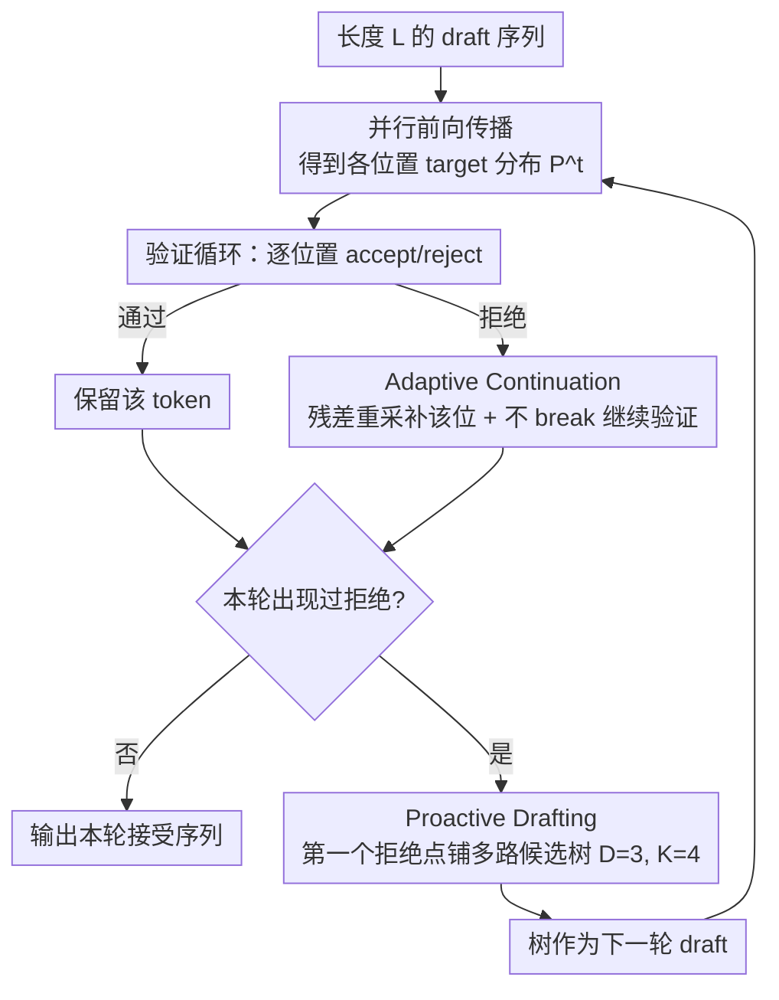

# SJD-PAC: Accelerating Speculative Jacobi Decoding via Proactive Drafting and Adaptive Continuation

**会议**: CVPR 2026  
**arXiv**: [2603.18599](https://arxiv.org/abs/2603.18599)  
**作者**: Jialiang Kang (北京大学), Han Shu, Wenshuo Li, Yingjie Zhai, Xinghao Chen (华为)
**代码**: 无  
**领域**: 图像生成  
**关键词**: 自回归图像生成, 推理加速, 推测解码, Jacobi解码, 无损加速

## 一句话总结
本文分析了 Speculative Jacobi Decoding (SJD) 在文本到图像生成中接受长度分布严重偏斜的瓶颈，提出 SJD-PAC 框架，通过 Proactive Drafting (PD) 和 Adaptive Continuation (AC) 两项技术，在严格无损的前提下实现 3.8× 推理加速，显著超越原始 SJD 的约 2× 加速。

## 研究背景与动机

**领域现状**：自回归（AR）文本到图像模型（如Lumina-mGPT、Emu3）生成质量已经可以与扩散模型竞争，但推理延迟严重——需要序列化生成数千个token。Speculative Decoding（SD）是LLM推理加速的主流方法，但在T2I场景下效果不佳。

**现有痛点**：标准SD方法（如EAGLE）在T2I模型上几乎无加速效果，因为图像生成的高熵特性导致draft token的接受率极低——即使在标准采样温度下，图像token也有很多候选几乎等概率可行。现有SJD方法虽然是training-free和lossless的，但只能提供约2×的温和加速。

**核心矛盾**：作者深入分析发现SJD的接受长度分布高度偏斜——约50%的前向传播只接受1个token（即完全没有加速），平均2×的加速主要由少数成功接受大量token的步骤贡献。这种"长尾分布"是性能瓶颈的根源。

**本文目标**
   - 如何减少单token接受（低效步骤）的频率？
   - 如何增加每步成功验证的token数？

**切入角度**：单token接受的根因是"上下文失配的级联效应"——当位置i被拒绝后，后续所有proposal的上下文都无效了。对此需要两个方向的优化：（1）在拒绝点提供多样化候选减少后续级联拒绝（PD），（2）拒绝后不立即终止而是继续验证后续token（AC）。

**核心 idea**：拒绝后不停下来，而是继续验证+主动多路起草，双管齐下最大化每步接受长度。

## 方法详解

### 整体框架

SJD-PAC 要解决的是 SJD 加速比被"长尾"拖死的问题：约一半的前向传播只接受 1 个 token，等于白跑一趟。它不改 SJD 的无损骨架，只动验证循环和起草这两处。一次迭代里，模型先对整条长度为 $L$ 的 draft 序列做一次并行前向传播，拿到所有位置的 target 分布 $P^t$；接着进入改造后的验证循环——逐位置做 accept/reject，但**遇到拒绝不再刹车**，而是补救当前位置后继续往下验证；最后若这一轮出现过拒绝，就在第一个拒绝点上**主动铺开一棵多路候选树**，作为下一轮迭代的 draft。两处改动一个负责"拒绝后别浪费已经算好的远处 token"，一个负责"让下一轮在拒绝边界上更容易接得上"。

### 关键设计

**1. Adaptive Continuation：拒绝一个 token 不该连累后面整串 token**

标准 SJD 的验证循环是"first-reject break"——位置 $i$ 一旦被拒，立刻终止本轮，把后面 $X_{i+1:L}^{t-1}$ 全部丢掉。可这些 token 的 target 分布在这次前向传播里其实都已经算出来了，丢掉就是纯浪费，也正是"只接受 1 个 token"的主因。AC 把这个 break 删掉：位置 $i$ 被拒后，先按标准推测解码的残差分布重采样 $x_i^t \sim \max(p_i - q_i,\,0)$ 补上这一格，然后**继续**对 $j>i$ 的每个位置做标准 rejection sampling，通过的就保留、不通过的就地重采样。

这样做的底气来自图像 token 的强局部性。作者测量了在某位置扰动上下文后、远处 token 输出分布的总变差距离 $d_{TV}$，发现图像 token 的 $d_{TV}$ 随距离 $j$ 增大迅速趋近 0（文本 token 则一直保持高敏感）。换句话说，位置 $i$ 的内容被改写，对远处 token 的 target 分布几乎没影响，用这份"略微过期"的分布继续验证依然站得住。和标准 SJD 拒绝后重采整段后续序列相比，AC 只替换被拒的那个 token、保住其余已验证 token——每个被保留 token 的成立概率是 $1 - d_{TV}(p_i^{t-1}, p_i^t) > 0.7$，而靠重新采样去命中同一个 token 的概率不到 $0.01$（图像 token 高熵、候选众多），孰优孰劣一目了然。

**2. Proactive Drafting：在拒绝点铺开多条候选，掐断级联拒绝的源头**

级联拒绝的根子在于：位置 $i$ 被拒后新采的 $x_i^t$ 和后续 token 原本依赖的上下文对不上，于是下一轮往往从这里开始又一连串被拒。PD 的应对是在拒绝点不只续一条线，而是搭一棵"浅而宽"的树。树的部分（深度 $D=3$、宽度 $K=4$）对位置 $i+1$ 到 $i+D$，每个位置从分布 $p(\cdot \mid X_{<j}^{t-1})$ 里无放回地采 $K$ 个候选 token；链的部分则从这 $K$ 条路径里挑一条的末端，自回归延伸补满到长度 $L$。

关键是这棵树**不额外跑模型前向传播**——它复用当前（可能略过期的）分布采样，只增加采样开销、不增加算力开销。这和标准 tree-based 推测解码（需要多次前向传播才能建树）截然不同。在拒绝这个最容易出岔子的边界上预备好 $K$ 个不同方向，下一轮验证时至少有一条路径接得上的概率就显著提高，长尾里的"单 token 步"也就随之减少。

**3. PD 与 AC 的正交协同：一个稳住序列，一个拓宽候选**

两者攻的是同一个长尾问题的两端，且互不干扰。AC 让序列在遭遇拒绝后尽量保持稳定——更多已验证 token 被留下来，喂给下一轮当 draft；PD 则在拒绝点提供多样化候选，抬高下一轮的接受概率。因为各管一头，二者可以独立分析、自由组合（消融里也正是这么拆开看的）。更重要的是两者都严格无损：AC 的后续验证走的是标准 rejection sampling，从数学上保证最终分布与逐 token 自回归一致；PD 的树只当 draft 用，验证阶段一律以 target 分布裁决，不会污染输出分布。

### 一个完整示例：一轮迭代里 AC 多救回几个 token

设窗口 $L=8$，本轮并行前向后逐位置验证。标准 SJD 的走法是：位置 1、2 通过，位置 3 被拒 → 立即 break，本轮净接受 **2 个** token，剩下位置 4–8 全部作废重来——这正是拖累平均加速的那种"低效步"。

换成 AC 后：位置 3 被拒，按 $\max(p_3 - q_3, 0)$ 重采一个新 token 补上，然后不停，继续往下验证。由于图像 token 局部性，位置 4、5、7 的 target 分布几乎没受位置 3 改写的影响，rejection sampling 顺利通过、原样保留；位置 6、8 没通过，就地各重采一个。一轮下来净保留 token 从 2 个抬到 **5–6 个**，同一次前向传播的产出立刻翻了一倍多。

与此同时 PD 在第一个拒绝点（位置 3）就近铺一棵 $D=3, K=4$ 的小树：给位置 4、5、6 各备 4 个候选、再从中选一条链补满到位置 8。下一轮迭代验证时，即便位置 3 的新内容让原路径接不上，这 4 路候选里大概率有一条对得上，避免又从位置 4 开始连环被拒。两处合力，把"50% 步骤只接 1 个 token"的长尾一点点削平。

## 实验关键数据

### 主实验（Lumina-mGPT，MS-COCO 2017）

| 方法 | 训练免？ | 无损？ | 步压缩↑ | 时延加速↑ | FID↓ | CLIP↑ |
|------|---------|--------|---------|----------|------|-------|
| 原始AR | ✓ | ✓ | 1.00× | 1.00× | 30.79 | 31.31 |
| EAGLE | ✗ | ✓ | 2.94× | 2.10× | 30.68 | 31.73 |
| SJD | ✓ | ✓ | 2.22× | 2.05× | 31.13 | 31.33 |
| GSD (有损) | ✓ | ✗ | 3.39× | 3.62× | 33.12 | 31.25 |
| SJD2 (有损) | ✗ | ✗ | 4.02× | 2.81× | 31.40 | 31.80 |
| **SJD-PAC** | **✓** | **✓** | **4.51×** | **3.80×** | **30.69** | **31.21** |

SJD-PAC以无损方式超越所有有损方法的加速比。

### 跨模型验证（Emu3，MS-COCO 2017）

| 方法 | 无损？ | 步压缩↑ | 时延加速↑ | FID↓ |
|------|--------|---------|----------|------|
| SJD | ✓ | 2.32× | 2.01× | 30.74 |
| SJD2 | ✗ | 5.62× | 2.54× | 31.50 |
| **SJD-PAC** | **✓** | **4.31×** | **3.25×** | **31.10** |

SJD2虽然步压缩更高但窗口长度翻倍导致额外开销，实际wall-clock加速远低于SJD-PAC。

### 消融实验

| 配置 | 步压缩↑ | 说明 |
|------|---------|------|
| SJD baseline (L=32) | 2.31× | 原始方法 |
| + PD | 2.71× | 主动起草减少级联拒绝 |
| + PD + AC | 3.52× | 自适应续行大幅提升 |
| + PD + AC (L=64) | **4.51×** | 更大窗口充分利用AC |

### 关键发现
- AC是贡献最大的组件（+0.81×压缩比 vs PD的+0.40×），因为它直接保留了更多有效token
- AC启用后L=32成为瓶颈，因为token更快稳定，需要更大窗口L=64来充分发挥
- 图像token的总变差距离 $d_{TV}$ 随距离快速衰减的特性是AC有效的关键理论支撑——与文本生成形成鲜明对比
- 修改单个token（0.04%的总量）即可引入严重视觉伪影，证明了无损保证对T2I的必要性
- PD的树参数D=3, K=4是甜点——太深浪费采样，太浅不够多样

## 亮点与洞察
- **对SJD接受长度的细粒度分析**揭示了"50%的步骤贡献0%加速"的洞察，这个分析本身就很有价值，为后续加速方法提供了clear的optimization target
- **AC利用图像token局部性**的思路很巧妙——文本token的长距离依赖使得类似方法在LLM上不可行，但图像token的强局部性使得用stale分布验证是有效的
- **PD + AC的正交性设计**使两者可以独立分析和组合，这种模块化设计值得学习

## 局限与展望
- 仅在Lumina-mGPT和Emu3两个模型上测试，对更新的AR T2I模型的泛化性未知
- 窗口大小L>64后收益递减但计算开销增加——硬件特定的最优L值不通用
- PD的树构建基于stale分布，理论上不如full forward pass构建的准确，可能在更高质量要求下有优化空间
- 可以探索自适应的D和K参数——根据当前区域的熵动态调整树的深度和宽度

## 相关工作与启发
- **vs SJD原版**: SJD-PAC在其基础上修改验证循环和起草策略，将加速比从2×提升到3.8×，且保持training-free和lossless
- **vs EAGLE**: EAGLE需要训练draft model且在T2I上效果差（2.10×），SJD-PAC无需训练且加速更强（3.80×）
- **vs GSD/LANTERN++**: 这些有损方法通过放松接受标准加速，但可能引入视觉伪影。SJD-PAC以无损方式甚至超越它们的加速比
- **vs SJD2**: SJD2需要训练且有损，步压缩虽高但实际加速低（因为窗口大），SJD-PAC更实用

## 评分
- 新颖性: ⭐⭐⭐⭐ AC和PD个别看不算特别新，但结合起来针对T2I的高熵特性设计合理
- 实验充分度: ⭐⭐⭐⭐ 两个模型、两个benchmark、详细消融和分析，但缺少更大规模模型测试
- 写作质量: ⭐⭐⭐⭐⭐ 问题分析深入，从分布偏斜观察到两个解决方案的推导逻辑链非常清晰
- 价值: ⭐⭐⭐⭐ 对AR T2I推理加速有直接实用价值，training-free + lossless是强卖点

<!-- RELATED:START -->

## 相关论文

- [\[CVPR 2026\] Parallel Jacobi Decoding for Fast Autoregressive Image Generation](parallel_jacobi_decoding_for_fast_autoregressive_image_generation.md)
- [\[AAAI 2026\] Annealed Relaxation of Speculative Decoding for Faster Autoregressive Image Generation](../../AAAI2026/image_generation/annealed_relaxation_of_speculative_decoding_for_faster_autor.md)
- [\[ICCV 2025\] Grouped Speculative Decoding for Autoregressive Image Generation](../../ICCV2025/image_generation/grouped_speculative_decoding_for_autoregressive_image_generation.md)
- [\[CVPR 2026\] FastHybrid: Accelerating Hybrid Autoregressive Image Generation with Lookahead and Guided Decoding](fasthybrid_accelerating_hybrid_autoregressive_image_generation_with_lookahead_an.md)
- [\[CVPR 2026\] Multi-Scale Local Speculative Decoding for Image Generation](multi-scale_local_speculative_decoding_for_image_generation.md)

<!-- RELATED:END -->
