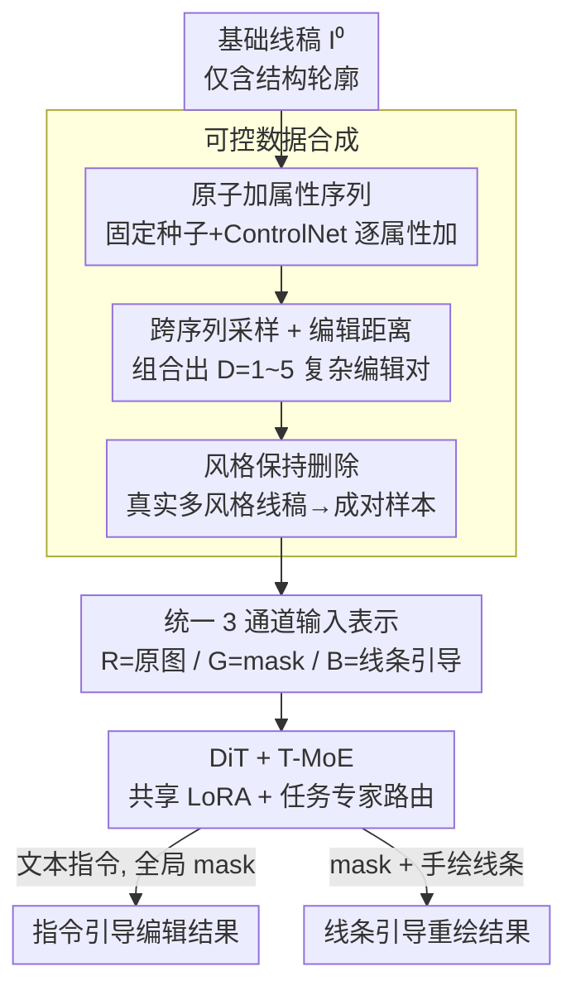

# SketchAssist: A Practical Assistant for Semantic Edits and Precise Local Redrawing

**会议**: CVPR 2026  
**论文**: [CVF Open Access](https://openaccess.thecvf.com/content/CVPR2026/html/Zou_SketchAssist_A_Practical_Assistant_for_Semantic_Edits_and_Precise_Local_CVPR_2026_paper.html)  
**代码**: 无  
**领域**: 扩散模型 / 图像编辑  
**关键词**: 线稿编辑, 指令编辑, 局部重绘, 可控数据合成, 任务路由 MoE

## 一句话总结
SketchAssist 把"按文字指令改线稿"和"按手绘线条局部重绘"两件事统一进一个 DiT 框架里——靠一条可控数据合成管线造出结构对齐的成对训练样本，再用 3 通道统一输入表示 + 任务路由 MoE（T-MoE）让同一个模型在两种编辑模式间无缝切换，两个任务都拿到 SOTA。

## 研究背景与动机
**领域现状**：线稿（sketch / 线条画）创作在专业流程里分两步——先定**布局**（pose、身体比例、构图），再补**细节**（眼睛、头发、背景纹理）。画师的大部分笔触和时间都花在第二步上，所以业界想用现代图像生成模型把第二步自动化，通常拆成两个接口：**指令引导编辑**（给一句话，加/删/换某个视觉属性）和**线条引导重绘**（给一个 mask + 手绘线条，在框内按线条重画）。

**现有痛点**：现成的图像编辑和 inpainting 模型搬到线稿上都不太行，问题同时卡在数据和模型两侧。数据侧：主流编辑数据集都来自自然图像，迁移不到稀疏、线条化的线稿；而现有线稿数据集几乎没有"同一主体、不同状态、属性变化精确可控"的成对样本，多属性复杂编辑尤其缺，简单的合成策略又保不住多步编辑之间的结构对齐。模型侧：指令编辑天然影响**整张图**，局部重绘却要求对**指定区域**精确控制，要在一个框架里同时塞下这两种模式、还得在各种画风之间保持风格一致，是个 open challenge。

**核心矛盾**：高层语义指令（全局、文本驱动）和低层结构约束（局部、线条驱动）之间的控制粒度根本不同，硬塞进一个模型会互相干扰。

**本文目标**：(1) 造一条专为线稿设计、能产出"结构对齐、属性可控"成对样本的数据管线；(2) 用一个统一框架同时吃下两种编辑模式且不互相打架。

**核心 idea**：数据上用"原子加属性序列 + 跨序列采样"组合出复杂编辑对（共享同一基础线稿保证结构对齐），模型上用"3 通道统一输入"把两种模式的空间条件打包进一张 RGB 图、再用 T-MoE 把两个任务的行为解耦。

## 方法详解

### 整体框架
SketchAssist 整条链路分两段：**离线数据合成**先造出大量结构对齐、风格多样的成对训练样本，**在线统一模型**再在一个基于 FLUX.1-Kontext 的 DiT 上同时学会指令编辑和线条重绘。

数据侧的关键在于"先把编辑拆到最细粒度，再组合出复杂度可控的对"：从一张只有结构轮廓、不含任何属性的**基础线稿** $I^{(0)}$ 出发，用固定随机种子 + ControlNet 一次只加一个属性，生成多条"原子加属性序列"；因为所有序列都从同一张 $I^{(0)}$ 分叉出来，跨序列、跨时间步任意取两张配对，pose 和构图天然对齐——这就是**跨序列采样**，配上一个形式化的编辑距离度量来控制每个样本的复杂度。再用一个"风格保持删除"模型把真实世界的多风格线稿也变成可控成对样本，注入风格多样性。线条重绘的数据则额外用 Anime Lineart 抽线 + ControlNet 生成"用户手绘线条"，配上语义/随机两种 mask。

模型侧两个核心设计：**统一 3 通道输入表示**把"原图 / 可编辑 mask / 结构引导"分别塞进 R/G/B 三个通道，两种任务共用同一个输入接口；**T-MoE** 嵌进 LoRA 层里，用文本+视觉特征做路由，动态选专家，让两个任务各走各的参数路径而不互相干扰。

### 关键设计

**1. 跨序列采样 + 编辑距离控制：用原子编辑组合出结构对齐的复杂样本**

直接生成"同一主体的复杂多属性编辑前后对"几乎不可能保证结构对齐，作者把它拆成两步绕过去。第一步造**原子加属性序列**：从只含轮廓的基础线稿 $I^{(0)}$ 出发，用 Danbooru/WD14 风格标签随机采一个有序属性列表 $\{a_1,\dots,a_T\}$，固定随机种子并用 ControlNet 以上一张 $I^{(t-1)}$ 为条件，一次只加一个属性，得到序列 $\{I^{(t)}\}$，每个相邻对 $(I^{(t-1)},I^{(t)})$ 就是一次编辑距离 $D=1$ 的纯加操作。对同一个 $I^{(0)}$ 用不同标签顺序重复 $M$ 次，得到 $M$ 条结构对齐的分叉序列。

第二步**跨序列采样**：因为所有序列同源于 $I^{(0)}$，任取源 $(I_s,A_s)$ 和目标 $(I_t,A_t)$ 两张，pose/构图天然对齐。两者属性集合的差被分解成三类原子操作——加 $O_{add}=A_t\setminus A_s$、删 $O_{rm}=A_s\setminus A_t$、换 $O_{rep}$（同类别内互斥属性互换，如 short hair ↔ long hair），总编辑距离 $D=|O_{add}|+|O_{rm}|+|O_{rep}|$ 精确量化了变换复杂度。这样就能从 $D=1$ 的原子编辑一路合成到 $D\ge3$ 的复杂多属性指令（如"摘帽子+换长发+加围巾"对应 $D=3$）。严格控制编辑距离 + 保持结构布局，逼模型学真正的指令跟随、而不是靠数据里的伪相关性蒙混。

**2. 风格保持删除：让训练集覆盖真实世界的多种画风**

前面的数据全来自单一生成器，风格单一。直接把"加属性"管线套到收集来的真实多风格线稿上会破坏其连贯性，而且 ControlNet 这种刚性空间条件的生成器不擅长"删除"。作者反过来用：把第一步原子加属性对 $(I^{(t)},I^{(t-1)})$ 的方向翻转，当作原子删除 $O_{rm}$ 来训练一个**风格保持删除模型**。把它作用到收集的多风格线稿上，就能产出高质量的删除成对样本，既注入了多样的风格先验、又保住了精确的属性控制。这一招的巧妙在于"删除比添加更适合跨风格泛化"——删一个已有属性不需要凭空想象新内容，更容易保持原画风。

**3. 统一 3 通道输入表示：把两种模式的空间条件打包进一张 RGB 图**

要把局部重绘塞进指令编辑模型，常规做法是扩输入通道数或加单独的控制分支（如 OminiControl），都会抬高训练/推理开销。作者抓住线稿是**单色**这一点，把所有空间条件压进标准的 3 通道合成图 $I_{cond}\in\mathbb{R}^{H\times W\times3}$：**R 通道（源上下文）**放要编辑的底图——指令模式放完整原图，线条模式放"抹掉目标区域后的原图"；**G 通道（可编辑 mask）**放二值 mask $M$，白=可编辑、黑=保留，指令模式用全局 mask、线条模式用局部 mask；**B 通道（结构引导）**放线条引导 $G$，指令模式留空白画布（纯靠文本 $t$ 驱动）、线条模式放用户手绘/抽取的引导线。靠这种结构化的 3 通道路由，模型不用额外管线、也不用重训输入层，就能在全局语义编辑和精确局部重绘之间无缝切换。

**4. T-MoE：把两个任务的参数路径解耦，避免互相干扰**

统一输入解决了空间条件，但两个任务需要不同的特征映射，共享同一套参数会互相拖累。作者把**任务引导的 Mixture-of-Experts** 嵌进 LoRA 层：每个 T-MoE 层有一个**共享 LoRA** 捕捉任务无关的结构/风格先验，外加一组**专家 LoRA** 学各自的编辑模式。推理时把文本+视觉特征拼成路由输入 $z$，动态选最相关的专家，输出为

$$\text{Output}=\text{BaseLayer}(x)+\text{SharedLoRA}(x)+\frac{\alpha}{r}\sum_{i=1}^{N}G(z)_i\cdot\text{ExpertLoRA}_i(x),$$

其中 $\alpha,r$ 是 LoRA 的缩放因子和秩；专家路由概率 $G(z)_i=\text{Softmax}(\text{TopK}(g(z),K))_i$ 只保留 pre-softmax 路由分 $g(z)$ 的 top-$K$ 项，实现稀疏激活。这样一个 DiT 既能维持线稿的整体一致性（共享部分），又能让全局语义编辑和局部结构重绘各自走专门的专家路径，缓解参数干扰。

### 损失函数 / 训练策略
基于 FLUX.1-Kontext 架构训练统一框架。数据生成阶段用预定义标签，但最终模型完全用自然语言指令训练，保证交互友好。训练时用跨序列采样动态组 pair，编辑距离从 $D=1$ 到 $5$，覆盖原子到复杂多步工作流。指令数据经过严格双阶段过滤——稳定性（Human-Art + CLIP 卡 pose/风格一致）和语义（WD14 Tagger 确认属性增删、Qwen-VL 校验指令对齐），从约 1 万张基础线稿扩出约 10 万张高质量训练图；风格多样化再收集 4000 张多风格作品。⚠️ T-MoE 的 active-parameter 对齐（为和标准 LoRA baseline 公平比较设计）等细节在补充材料里，正文未展开。

## 实验关键数据

两个任务各用 200 张精选线稿做独立测试集，指令任务的 200 张基础线稿训练时未见过。

### 主实验

指令引导编辑（VIEScore 协议，Gemini-2.0-Flash + Qwen3-VL-30B 打分，Q* 为质量分，WR 为对该 baseline 的胜率）：

| 方法 | CLIP-T↑ | CLIP-I↑ | DINO↑ | Q SC↑ | Q O↑ | WR(%) |
|------|---------|---------|-------|-------|------|-------|
| ICEdit | 0.270 | 0.811 | 0.705 | 4.13 | 4.54 | 94.81 |
| FLUX.1 Kontext | 0.296 | 0.882 | 0.791 | 6.62 | 6.42 | 84.45 |
| Step1X-Edit | 0.295 | 0.886 | 0.809 | 7.60 | 7.25 | 82.76 |
| Qwen-Image-Edit | 0.292 | 0.849 | 0.776 | 6.89 | 6.79 | 86.91 |
| **Ours** | **0.305** | **0.931** | **0.879** | **8.74** | **8.04** | — |

线条引导局部重绘：

| 方法 | LPIPS↓ | CLIP-I↑ | DINO↑ | WR(%) |
|------|--------|---------|-------|-------|
| SketchEdit | 0.2277 | 0.853 | 0.800 | 98.56 |
| BrushNet | 0.1877 | 0.852 | 0.795 | 97.23 |
| MagicQuill | 0.1472 | 0.903 | 0.887 | 94.49 |
| **Ours** | **0.0972** | **0.961** | **0.949** | — |

两个任务几乎全指标领先。Qwen-Image-Edit 的感知质量 Q PQ（7.66）比本文（7.49）略高，但本文的总分 Q O 最高，说明在语义准确和视觉连贯之间取得了更好平衡。50 名标注者的 side-by-side 用户研究里，本文对所有 baseline 都拿到很高胜率。

### 消融实验

重绘测试集扩到 400 张（200 语义 mask + 200 随机 mask）做结构鲁棒性压测。逐模块累加：

| 配置 | CLIP-I(指令) | DINO(指令) | Q O(指令) | LPIPS(重绘) | DINO(重绘) |
|------|------|------|------|------|------|
| Baseline | 0.882 | 0.791 | 6.42 | 0.119 | 0.890 |
| + 原子加属性序列 | 0.892 | 0.831 | 7.20 | 0.119 | 0.937 |
| + 跨序列采样 | 0.901 | 0.847 | 7.55 | 0.112 | 0.948 |
| + 风格多样化 | 0.931 | 0.879 | 7.86 | 0.0915 | 0.956 |
| + T-MoE（完整） | 0.931 | 0.879 | **8.04** | — | — |

### 关键发现
- **跨序列采样主要提结构一致性**：在原子序列基础上引入 $D=1\sim5$ 的复杂编辑后，CLIP-I +0.009、DINO +0.016，因为它逼模型在各种属性组合下维持主体身份。
- **风格多样化提语义/风格对齐，但 PQ 略降**：这是 fidelity-quality 的权衡——模型忠实保留多风格源线稿的手绘纹理，而不是把它们过度平滑成"干净"的通用线条。
- **T-MoE 拿下几乎所有指标最佳总分**：动态路由任务特征有效缓解了全局语义编辑和局部结构重绘之间的参数干扰，让单个 DiT 既保风格一致又能精确局部修改。

## 亮点与洞察
- **"原子拆解 + 跨序列组合"造结构对齐数据**：用同一张基础线稿分叉出多条原子序列，再跨序列配对，天然解决了"复杂编辑前后对结构对不齐"的老大难——这个思路可迁移到任何"需要成对、结构对齐、属性可控"的编辑数据合成场景。
- **用 RGB 三通道复用现成单色线稿的"空闲位"**：线稿是单色的，所以可以把原图/mask/线条引导分别塞进 R/G/B，不扩通道、不加分支、不重训输入层就统一了两种模式，工程上非常省。
- **删除比添加更适合跨风格**：把原子加属性对反向训练一个删除模型来给真实多风格线稿造样本，是个反直觉但很实用的 trick。
- **编辑距离当难度旋钮**：用形式化的 $D=|O_{add}|+|O_{rm}|+|O_{rep}|$ 显式控制每个训练样本的复杂度，能做课程式训练并防止模型走捷径。

## 局限与展望
- 训练和测试数据**全是 pipeline 生成**的（测试 200 张也来自合成管线），评测能拿到精确 target 和 GT caption，但和真实画师的杂乱手绘、真实工作流之间可能有 gap，泛化性需在真实场景验证。
- 像素级指标 PSNR/SSIM 因线稿大片白底会失真，只放在补充材料里——本文主要靠 CLIP/DINO/LPIPS + VIEScore + 用户研究评价，这些指标本身也依赖 Gemini/Qwen 等 VLM 打分，存在评测模型偏好的风险。
- ⚠️ T-MoE 的专家数 $N$、$K$、active-parameter 对齐等关键超参未在正文给出，复现需查补充材料。
- 风格多样化带来 PQ 下降的 trade-off 说明"保真"和"干净"难两全，如何让用户按需调节这个偏好是可拓展方向。

## 相关工作与启发
- **vs 指令编辑（FLUX.1 Kontext / Step1X-Edit / Qwen-Image-Edit）**：它们擅长全局语义改动但缺乏细粒度局部控制；本文以指令编辑 backbone 为底，额外接入线条引导的局部编辑，兼得全局语义和精确区域控制。
- **vs 局部编辑/重绘（SketchEdit / BrushNet / MagicQuill）**：这些方法局部控制好但缺乏指令式全局语义操纵力，且常常没真正贴合用户线条（MagicQuill 风格接近但重绘区对不上引导线）；本文紧贴引导线、又保留强语义编辑能力。
- **vs OminiControl 式扩通道/加分支**：本文不扩输入通道、不加控制分支，靠单色线稿的 3 通道打包实现统一输入，省训练/推理开销。

## 评分
- 新颖性: ⭐⭐⭐⭐ 数据侧"原子+跨序列"造结构对齐样本、模型侧 3 通道统一输入 + T-MoE 解耦双任务，组合很扎实，但各组件多为已有思路的巧妙拼装。
- 实验充分度: ⭐⭐⭐⭐ 两任务都做了主对比+消融+用户研究，逐模块消融清晰；但测试集全为合成数据、缺真实场景验证。
- 写作质量: ⭐⭐⭐⭐ 动机和数据管线讲得很清楚，图示到位；部分关键超参推到补充材料。
- 价值: ⭐⭐⭐⭐ 面向真实线稿创作流程，统一两种编辑模式且工程开销小，实用性强。

<!-- RELATED:START -->

## 相关论文

- [\[CVPR 2026\] MapRoute: Semantic Routing for Precise Concept Erasure with Mapper](maproute_semantic_routing_concept_erasure.md)
- [\[CVPR 2026\] VectorArk: Learning Practical Image Vectorization with Rounded Polygon Representation](vectorark_learning_practical_image_vectorization_with_rounded_polygon_representa.md)
- [\[CVPR 2026\] Omni IIE Bench: Benchmarking the Practical Capabilities of Image Editing Models](omni_iie_bench_benchmarking_the_practical_capabilities_of_image_editing_models.md)
- [\[CVPR 2026\] Say Cheese! Detail-Preserving Portrait Collection Generation via Natural Language Edits](say_cheese_detail-preserving_portrait_collection_generation_via_natural_language.md)
- [\[CVPR 2026\] TokenLight: Precise Lighting Control in Images using Attribute Tokens](tokenlight_precise_lighting_control_in_images_using_attribute_tokens.md)

<!-- RELATED:END -->
