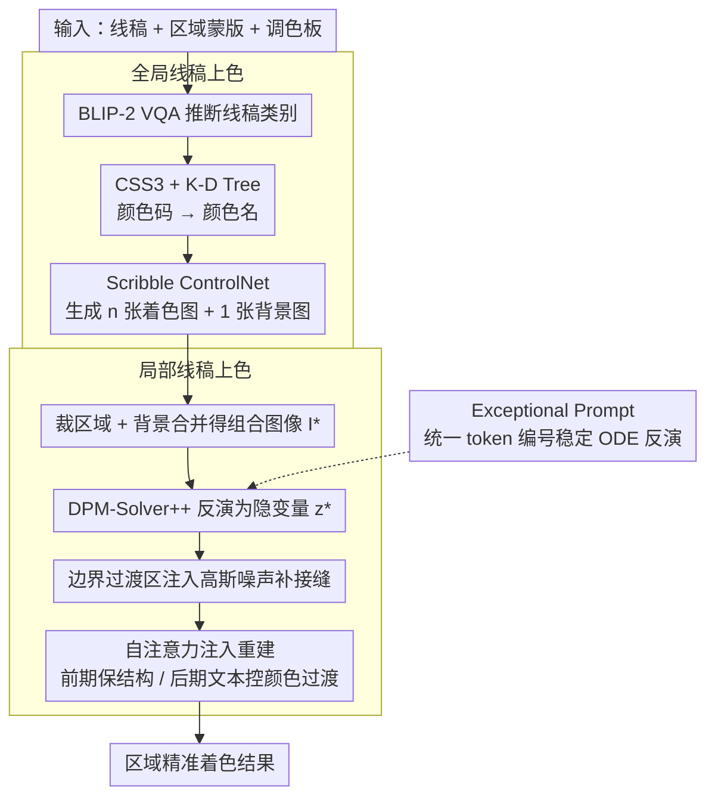

# SketchDeco: Training-Free Latent Composition for Precise Sketch Colourisation

**会议**: CVPR 2026  
**arXiv**: [2405.18716](https://arxiv.org/abs/2405.18716)  
**代码**: 无  
**领域**: 图像生成  
**关键词**: Sketch Colourisation, Diffusion Models, training-free, Latent Composition, Self-Attention Injection

## 一句话总结

提出SketchDeco，一种无需训练的线稿上色方法，通过全局-局部两阶段策略将区域蒙版和调色板作为精确控制信号，利用扩散模型反演和自注意力注入在隐空间中实现区域精准着色与全局和谐过渡，在消费级GPU上15-20步即可完成。

## 研究背景与动机

线稿上色是动画分镜、产品设计、概念艺术等创意工作流中的基础任务。尽管大规模扩散模型在图像生成上取得了突破，但在细粒度、区域级别的颜色控制上仍面临挑战：

**文本引导的空间歧义**：文本提示虽然语义丰富，但无法精确指定"哪个区域用什么颜色"，经常出现颜色溢出和语义错误（如图1b所示）

**传统方法效率低**：手动分配颜色或基于参考图的颜色迁移过于繁琐

**训练开销大**：ControlNet等方法需要微调超网络，计算成本高昂

本文的核心洞察：解决方案不是更多训练，而是一种创新的无训练组合框架——将全局一致性和局部控制分离处理。

## 方法详解

### 整体框架

线稿上色的难点在于：文本提示说不清「哪个区域用什么颜色」，常出现颜色溢出和语义错误；而 ControlNet 这类做法又要微调超网络、开销大。SketchDeco 的核心洞察是不靠更多训练，而用一个无训练的组合框架，把「全局一致性」和「局部精确控制」拆成两个阶段处理。

输入是线稿 $\mathcal{S}$、区域蒙版集合 $\{\mathcal{M}^{(i)}\}$ 和对应调色板 $\{\mathcal{P}_H\}$。全局阶段先生成多个保持线稿结构和配色一致的整体着色结果，局部阶段再通过隐空间组合实现区域精准着色与平滑过渡。

### 关键设计

**1. 全局线稿上色：自动把调色板变成可用的着色候选**

为了不让用户逐区域手调颜色，全局阶段先用 BLIP-2 的 VQA 推断线稿类别（「这幅线稿画的是什么？」）拿到零样本语义标签，再用 CSS3 色彩数据库（147 种颜色）+ K-D Tree（K=3）把十六进制颜色码映射到最近的颜色名称——作者发现 K-D Tree 在颜色检索上比直接问 LLM 更靠谱、还省掉 LLM 调用。然后用预训练的 Scribble ControlNet，结合语义标签和颜色名称拼 prompt，生成 $n+1$ 张图：$n$ 张对应各调色板的着色结果 + 1 张无颜色描述的辅助背景图，并在像素空间渲染预览、允许用户换种子比较变体。

**2. 局部线稿上色：把区域着色重构成「图像组合 + 重建」问题**

这是全文最巧的一步——首次把区域着色从「在去噪过程中硬加颜色约束」换成组合再重建。对每个蒙版区域，从对应全局着色结果里裁出区域、和背景图合并成组合图像 $\mathcal{I}^*$；用 DPM-Solver++（15-20 步高效反演）把 $\mathcal{I}^*$ 反演成噪声隐变量 $z^*$；在蒙版边界过渡区注入额外高斯噪声，借扩散模型的生成先验把接缝自然补好。重建时用自注意力注入控制忠实度：用组合图像的自注意力图 $\mathcal{A}^*_{l,t}$ 配合缩放因子 $\tau$ 分段——前期 $t \in [T, T(1-\tau)]$ 注入自注意力保住全局结构忠实度，后期 $t \in [T(1-\tau), 0]$ 改用文本编码实现平滑颜色过渡。因为多个蒙版的处理在全局着色阶段并行完成，蒙版数量不影响最终质量。

**3. Exceptional Prompt：让 ODE 反演不被 CFG 带偏**

ODE 反演里 CFG 会引入不稳定、放大重建误差。SketchDeco 借用 exceptional prompt 替代空 prompt：把所有 token 编号设成统一值、移除多余的位置编码和特殊 token，使反向 ODE 轨迹更贴近前向轨迹，显著提升反演精度，是上面「反演—重建」链路能成立的关键支撑。

### 损失函数 / 训练策略

本方法完全无需训练，所有组件都基于预训练的 Stable Diffusion v1.5 和 Scribble ControlNet。关键超参数：CFG scale = 2.5、$\tau = 0.4$（自注意力注入比例）、K-Means 聚类 K=4 提取主色调，推理在单卡 RTX 4090 Super 上完成。

## 实验关键数据

### 主实验

**局部上色** (Table 1)

| 方法 | Place365 Indoor FID↓ | LPIPS↓ | DCCW↓ | PascalVOC FID↓ | DCCW↓ |
|------|---------------------|--------|-------|----------------|-------|
| ColorizeDiffusion | 151.52 | 0.645 | 15.30 | 110.80 | 24.37 |
| ColorFlow | 354.07 | 0.643 | 17.05 | 367.69 | 14.98 |
| MangaNinja | 134.57 | 0.548 | 15.19 | 289.21 | 10.61 |
| Cobra | 221.38 | 0.603 | 14.96 | 382.70 | 13.96 |
| **SketchDeco** | **123.87** | **0.527** | **11.85** | **95.64** | **8.89** |

**全局上色** (Table 2, AFHQ-cat/dog)

| 方法 | AFHQ-cat FID↓ | LPIPS↓ | SSIM↑ | AFHQ-dog FID↓ |
|------|--------------|--------|-------|---------------|
| DiffBlender | 86.82 | 0.811 | 0.032 | 145.50 |
| T2I-Adapter | 68.95 | 0.706 | 0.134 | 107.12 |
| T2I-Adapter+IDeepColor | 68.41 | 0.673 | 0.133 | 116.95 |
| **SketchDeco** | **50.31** | **0.671** | **0.187** | **89.70** |

### 消融实验

| 配置 | 关键指标 | 说明 |
|------|---------|------|
| 无自注意力注入 | 颜色不一致、结构丢失 | 仅依赖初始噪声不够 |
| 无exceptional prompt | 重建误差大 | CFG不稳定导致ODE轨迹偏移 |
| 无高斯噪声注入 | 区域边界生硬 | 过渡区域缺乏生成先验 |
| $\tau=0.4$ (默认) | 最佳平衡 | 结构保持 + 颜色过渡 |
| K=4 聚类 | 最佳 | K过大→调色板冗余；K过小→颜色覆盖不足 |

### 关键发现

- SketchDeco在局部上色的DCCW指标（颜色调色板相似度）上全面领先，证明精确颜色控制能力
- 方法在多个领域（动物、室内外场景、动漫、多物体自然scene）上均有效
- K-D Tree在颜色检索上优于LLM（不需要调用LLM来理解颜色十六进制码）
- 蒙版数量不影响最终质量，因为多个蒙版的处理通过并行全局着色完成

## 亮点与洞察

1. **分治策略的巧妙设计**：将全局一致性与局部控制的矛盾解耦为两个阶段，是全文最具启发性的设计思想
2. **隐空间组合范式**：将区域着色重构为组合+重建问题，避免了直接在去噪过程中强制颜色约束的困难
3. **无需训练即可控制**：完全利用预训练模型的生成先验，展现了扩散模型丰富的可操控性
4. **CFG不稳定性的优雅解决**：exceptional prompt技术通过移除prompt信息使反演更稳定，是ODE反演领域的实用技巧
5. **实际工作流友好**：支持交互式预览和种子切换，15-20步在消费级GPU上完成，适合实际创意工作流

## 局限与展望

- 基于Stable Diffusion v1.5，生成质量受限于基础模型能力；升级到SDXL或SD3可能带来更大提升
- 蒙版需手动绘制（如用Photoshop），自动语义分割生成蒙版可降低使用门槛
- K-D Tree仅映射到147种CSS3颜色名称，精细颜色调控受限
- 着色结果的纹理细节依赖ControlNet的生成能力，对极简线稿可能效果有限
- 未讨论视频线稿上色或时序一致性场景

## 相关工作与启发

- 在TF-ICON的组合框架上扩展，引入区域蒙版和调色板控制
- Exceptional prompt技术来源于TF-ICON，本文将其用于ODE反演稳定化
- DPM-Solver++的选择体现了在效率和反演精度之间的考量（vs DDIM的100-250步）
- 方法思路可推广到其他图像编辑任务：如区域风格迁移、局部材质替换等

## 评分

- **新颖性**: ⭐⭐⭐⭐ — 将着色重构为隐空间组合问题是新颖的视角，但各组件均来自已有技术的巧妙组合
- **实验充分度**: ⭐⭐⭐⭐ — 多数据集、多对比方法，包含全局和局部两种设置
- **写作质量**: ⭐⭐⭐⭐ — 图示清晰，流程描述详细，动机分析到位
- **价值**: ⭐⭐⭐⭐ — 对创意工作流有直接实用价值，无需训练是核心优势

<!-- RELATED:START -->

## 相关论文

- [\[CVPR 2026\] Object-WIPER: Training-Free Object and Associated Effect Removal in Videos](object-wiper_training-free_object_and_associated_effect_removal_in_videos.md)
- [\[CVPR 2026\] Training-free Mixed-Resolution Latent Upsampling for Spatially Accelerated Diffusion Transformers](training-free_mixed-resolution_latent_upsampling_for_spatially_accelerated_diffu.md)
- [\[CVPR 2026\] SparVAR: Exploring Sparsity in Visual Autoregressive Modeling for Training-Free Acceleration](sparvar_exploring_sparsity_in_visual_autoregressive_modeling_for_training-free_a.md)
- [\[CVPR 2026\] Denoising as Path Planning: Training-Free Acceleration of Diffusion Models with DPCache](dpcache_denoising_path_planning_diffusion_accel.md)
- [\[CVPR 2026\] Precise Object and Effect Removal with Adaptive Target-Aware Attention](precise_object_and_effect_removal_with_adaptive_target-aware_attention.md)

<!-- RELATED:END -->
