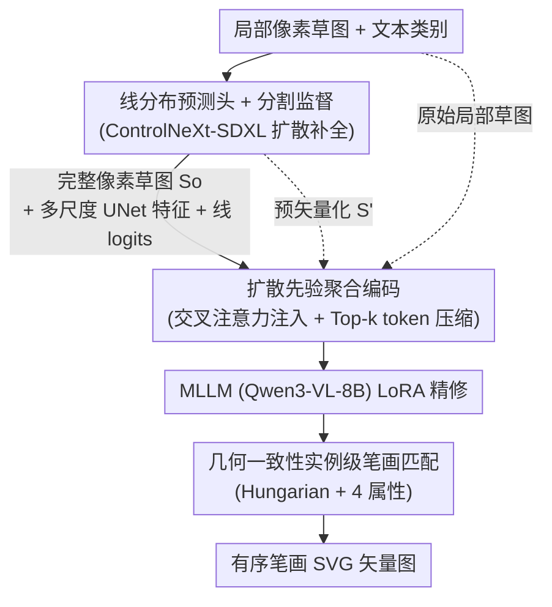

# SketchRevive: Fine-Grained Pixel-to-Vector Sketch Completion with Diffusion-Prior-Guided Multimodal LLMs

**会议**: CVPR 2026  
**论文**: [CVF Open Access](https://openaccess.thecvf.com/content/CVPR2026/html/Zuo_SketchRevive_Fine-Grained_Pixel-to-Vector_Sketch_Completion_with_Diffusion-Prior-Guided_Multimodal_LLMs_CVPR_2026_paper.html)  
**代码**: 无  
**领域**: 扩散模型 / 矢量草图生成  
**关键词**: 草图补全, 像素到矢量, 扩散先验, 多模态大模型, SVG 矢量化

## 一句话总结
SketchRevive 提出"细粒度像素到矢量草图补全"新任务，用一个两阶段框架（扩散模型先在像素层做结构一致的补全，再由 MLLM 做结构感知的精修与矢量化），并通过把扩散中间特征注入 MLLM 视觉流来打通两阶段，在 FID/IoU/SRR 等指标上大幅超过把 ControlNeXt 直接拼 GPT-5/Gemini 的朴素级联。

## 研究背景与动机
**领域现状**：矢量草图生成近年很热，主流是把草图建模成有序的笔画轨迹或参数化 Bézier 曲线，再用序列模型 / 扩散模型 / SDS 蒸馏来做"从零合成"，并支持文本、参考图、手势等多模态条件。

**现有痛点**：这些工作几乎都假设"在数字设备上从零画"，忽略了创作早期最常见的场景——人在纸、白板、平板上随手勾几笔粗糙、不完整的轮廓，希望系统能读懂这几笔局部草图、把它**补全成细粒度可编辑的矢量图**。而现有"草图补全"范式把任务退化成局部缺口 inpainting（从随机 mask 的片段重建），缺少全局结构推理，结果轮廓粗糙、外观抽象；带文本引导的补全又主要用来"往原图里插入新部件 / 新物体"，而不是忠实还原用户的半成品。

**核心矛盾**：把 Bézier 扩散这类"从零生成"的方法直接搬过来做补全有两道坎——它们没有从残缺草图**预测并传播结构**的机制；固定笔画数的约束又限制了细节表达，随机采样控制点拟合常引入多余笔画和伪影。一个直觉的两阶段管线（扩散先补全像素图、MLLM 再矢量化）看似可行，但朴素级联会带来语义漂移、结构形变，且很难从生成像素里恢复拓扑一致的 SVG 笔画轨迹。

**本文目标**：形式化"细粒度像素到矢量草图补全"——给定像素级局部草图 + 描述类别（可含朝向/姿态）的文本，预测**整张物体的笔画分布**，输出全局结构连贯、外观高保真、且把原始栅格输入与新生成内容统一在同一套笔画拓扑里的矢量图。

**核心 idea**：把扩散阶段产生的**像素级补全先验**（多尺度 UNet 特征 + 线预测 logits）注入 MLLM，引导其精修与矢量化，最大化"扩散善于像素生成、MLLM 善于变长笔画/SVG 代码"两种架构的互补性。

## 方法详解

### 整体框架
SketchRevive 要解决的是"残缺像素草图 → 完整可编辑矢量图"。整体是两阶段串行 + 一个跨阶段连接模块：先构建一个更贴近真实的基准（在带笔画标注的 SFSD 数据集上，额外采集纸/白板拍摄草图并用 GPT-5 生成文本描述）；**Stage I** 用扩散模型在像素层把局部草图补全成结构/外观一致的完整草图；**Stage II** 用 MLLM 在 Stage I 结果 + 原始局部草图的条件下做结构感知的精修与矢量化，输出有序笔画的 SVG。两阶段之间靠"扩散先验聚合编码"模块打通——把 Stage I 的多尺度 UNet 特征通过层级交叉注意力注入 MLLM 视觉嵌入，并用线预测 logits 做 token 压缩，让 MLLM 聚焦最有信息量的视觉区域。

### 关键设计

**1. 线分布预测头 + 线分割引导目标：把"补全"从间接去噪改成像素级笔画分割**

Stage I 的痛点是：只用扩散标准的 ε-噪声预测目标来补草图并不合适，常出现结构不一致、虚假阴影、偏离干净二值线条的问题。作者的做法是把任务从"间接去噪"重述为"直接的逐像素分割"——在 ControlNeXt-SDXL 的 UNet 解码器上挂一个轻量线预测头（3×3 卷积 → 归一化 → ReLU → 1×1 卷积出单通道 logit，再 sigmoid），输出每个像素属于笔画的概率图 $p_\text{line}\in[0,1]$，并直接用二值化的 GT 草图 $B_\text{gt}\in\{0,1\}$ 监督它，给模型一个显式的结构信号。

监督用一组分割损失叠加去噪损失：BCE 损失 $L_\text{BCE}$ 保证逐像素分类、Dice 损失 $L_\text{Dice}$ 专治稀疏前景（笔画占比小）、结构损失 $L_\text{str}$ 取 $p_\text{line}$ 与 $B_\text{gt}$ 的 L1 距离，总目标为

$$L_\text{complete}=\lambda_1 L_\text{noise}+\lambda_2 L_\text{BCE}+\lambda_3 L_\text{Dice}+\lambda_4 L_\text{str}.$$

这样训练既保证笔画连续、边界贴合，又顺带产出了下一阶段要用的三样东西：完整草图 $S_o$、UNet 三层中间特征 $\{F^i_\text{mid}\}_{i=1}^3$、以及线预测 logits $p_\text{line}$。相比纯去噪，显式的"是不是笔画"信号让补全结构更干净，是后续矢量化能恢复拓扑的前提。

**2. 扩散先验聚合编码：把扩散中间证据跨阶段灌进 MLLM，并用线 logits 做 token 压缩**

朴素级联（把 Stage I 最终输出直接喂 Stage II）会放大扩散阶段的伪影和结构误差，劣化最终 SVG 的几何保真。这个模块是本文核心创新，做两件事来打通两阶段。其一是**先验注入**：先把二值补全 $S_o$ 预矢量化成平滑连续表示 $S'_o$（骨架化成单像素中心线 → 体素化取控制点 → 拟合 B 样条），既降低 token 成本、又让 MLLM 在连续曲线上精修拓扑；同时把 Stage I 的多尺度 UNet 特征 $\{F^i_\text{mid}\}$ 经一个变换函数对齐到 ViT token 空间

$$A_i=\text{Pool}\big(\phi(\text{BN}(\text{Conv}_{1\times1}(\text{Conv}^\text{dw}_{3\times3}(F^i_\text{mid}))))\big),$$

再通过层级交叉注意力注入 MLLM 视觉流：$F^i_\text{par}=\text{LayerNorm}(F^{i-1}_\text{par}+\text{Attn}(F^{i-1}_\text{par},A_i,A_i))$，把可能在最终渲染图里被衰减的中层外观/几何线索补回来。

其二是**token 压缩**：融合后的 $F_\text{par}$ 仍有很多冗余/低响应 token，作者用线预测 logits $p_\text{line}$ 给 token 打分、只保留 Top-k 最显著的，$F'_\text{par}=\text{Gather}(F_\text{par},\text{Top}_k(\text{Flatten}(\text{Pool}(p_\text{line}))))$（实现里 $k=50\%$）。这样 MLLM 在最关键的笔画区域上做矢量化，再把 $F'_\text{par}$ 与初始笔画序列特征 $F_\text{vec}$、固定任务提示拼接后送入后续层，用 LoRA 微调输出 SVG。它的价值在消融里很直接：去掉这一模块（仅 $S'_o$ + 微调 Qwen）FID 从 4.76 涨到 8.21、IoU 从 0.56 跌到 0.42。

**3. 几何一致性实例级笔画匹配：用无序集合匹配监督笔画属性而非逐点对齐**

预测笔画集 $P=\{P_j\}_{j=1}^N$ 与 GT 笔画集 $S=\{S_i\}_{i=1}^M$ 是**无序且数量可能不等**的，没法逐一对齐。作者从四个几何属性度量两条笔画的相似度——形状（Chamfer 距离 $d_\text{cham}$）、长度（弧长差 $d_\text{len}$）、姿态（质心距 + 主方向夹角 $d_\text{pose}$）、曲率（采样点曲率差 $d_\text{curv}$），合成几何一致性代价

$$L_\text{geo}(S,P)=\alpha\,d_\text{cham}+\gamma\,d_\text{len}+\delta\,d_\text{pose}+\eta\,d_\text{curv}.$$

然后构造代价矩阵 $C\in\mathbb{R}^{M\times N}$，用匈牙利算法求最优匹配 $\pi^*$，把每条预测笔画对到几何上最近的 GT 笔画实例，得到实例级匹配损失 $L_\text{inst}=\frac{1}{K}\sum_i (\alpha\,d_\text{cham}(S_i,P_{\pi^*(i)})+\gamma\,d_\text{len}+\delta\,d_\text{pose}+\eta\,d_\text{curv})$，其中 $K=\min(M,N)$。这样监督既要求整体实例级一致、又约束单笔画的细粒度几何属性，让 MLLM 生成的矢量在外观清晰之外还保持结构与几何忠实。

### 损失函数 / 训练策略
渐进式两阶段训练：Stage I 用 $L_\text{complete}$（$\lambda_1{=}1,\lambda_2{=}1,\lambda_3{=}0.1,\lambda_4{=}0.5$）优化带线预测头的 ControlNeXt-SDXL；Stage II 用 $L_\text{inst}$ 在实例级几何属性引导下 LoRA 微调 Qwen3-VL-8B-Instruct，代价矩阵权重 $\alpha{=}0.4$、其余约 $0.2$，token 压缩比 $k{=}50\%$。训练时用笔画级标注构造"按笔画递增"的局部草图覆盖整条绘制轨迹；评测时给前 10%~50% 笔画。

## 实验关键数据

### 主实验
augmented SFSD（19 类前景、28,845 实例；7:3 切分），分别给前 10%/30%/50% 笔画评测。指标：FID↓、Geometry Score (GS)↓、IoU↑、笔画重建率 SRR↑。下表取 10%/50% 两档对比（数值越低/越高越好）。

| 方法 | FID@10%↓ | FID@50%↓ | IoU@50%↑ | SRR@50%↑ |
|------|---------|---------|---------|---------|
| SketchRNN | 14.85 | 14.36 | 0.55 | 0.46 |
| SketchKnitter | 10.58 | 11.61 | 0.65 | 0.51 |
| ControlNeXt + Claude 4.5 Sonnet | 11.56 | 10.06 | 0.64 | 0.51 |
| ControlNeXt + GPT-5 | 9.81 | 9.03 | 0.68 | 0.57 |
| ControlNeXt + Gemini 2.5 Pro | 9.54 | 8.29 | 0.72 | 0.59 |
| **SketchRevive** | **4.76** | **4.20** | **0.77** | **0.63** |

SketchRevive 在所有档位、所有指标上大幅领先：FID 几乎只有最强基线（ControlNeXt+Gemini 2.5 Pro）的一半，说明端到端两阶段 + 跨阶段交互比"把现成扩散和现成 MLLM 直接拼"更能产出语义清晰、拓扑有序的矢量草图。

### 消融实验
Stage I（线分割引导目标，FID/GS）与 Stage II（组件递增）分别消融：

| 阶段 | 配置 | FID↓ | GS↓ | IoU↑ | SRR↑ |
|------|------|------|-----|------|------|
| Stage I | 仅 $L_\text{noise}$ | 14.85 | 4.60 | – | – |
| Stage I | + $p_\text{line}$ + $L_\text{BCE}$ | 11.54 | 4.91 | – | – |
| Stage I | + $L_\text{Dice}$ | 7.65 | 4.01 | – | – |
| Stage I | + $L_\text{str}$（全） | 4.97 | 3.80 | – | – |
| Stage II | $S_o$ + 微调 Qwen | 9.47 | 5.13 | 0.38 | 0.29 |
| Stage II | $S'_o$ + 微调 Qwen | 8.21 | 4.37 | 0.42 | 0.34 |
| Stage II | + 扩散先验（全） | 4.76 | 2.70 | 0.56 | 0.48 |

### 关键发现
- Stage I 里线预测头叠加分割损失逐项都在掉 FID：BCE→Dice 让 FID 从 11.54 降到 7.65（Dice 治稀疏前景最关键），再加结构损失到 4.97，验证"把补全当像素级笔画分割"远胜纯去噪。
- Stage II 三件套各有增益但**扩散先验聚合编码贡献最大**：从 $S'_o$+Qwen（FID 8.21、IoU 0.42）加上先验注入直接到 FID 4.76、IoU 0.56、SRR 0.48；预矢量化 $S'_o$ 相比直接喂 $S_o$ 也稳定提升（FID 9.47→8.21），说明给 MLLM 一个连续表示能减轻其推理负担。
- 给越多笔画（10%→50%）各方法都更好，但 SketchRevive 在最难的 10% 档（FID 4.76）就已优于所有基线在 50% 档的成绩，说明它对极稀疏输入的结构推理更强。

## 亮点与洞察
- **"用扩散先验喂 MLLM"这条跨架构互补思路很巧**：扩散擅长像素级稠密生成、MLLM 擅长变长笔画/SVG 代码，作者不让它们简单级联，而是把扩散的中层 UNet 特征 + 线 logits 当"证据"灌进 MLLM 视觉流，既补回最终渲染图里被衰减的线索、又用 logits 引导 token 压缩聚焦笔画区——这个"中间特征 + 置信度双通道注入"模式可迁移到任何"生成器→矢量化器"的两阶段管线。
- **把补全重述成分割是关键的问题重塑**：噪声预测对"干净二值线条"这种稀疏结构天然不友好，换成逐像素 sigmoid + Dice，直接把 FID 砍掉一大截，提示对结构性强、前景稀疏的生成任务可优先考虑分割式目标。
- **无序笔画用匈牙利 + 多属性匹配**，绕开了固定笔画数和逐点对齐的限制，对任何"集合到集合、元素几何属性可度量"的生成监督都有参考价值。

## 局限与展望
- 数据集只覆盖 19 类单物体前景（zebra/giraffe 等），且纸/白板增强只拍了三分之一物体；面向多物体场景合成、复杂结构或开放类别时的泛化未充分验证。
- 文本描述由 GPT-5 自动生成，类别/朝向/姿态标注质量与真实用户意图的一致性存疑 ⚠️；评测也只用前 10%~50% 笔画的"顺序前缀"作为局部输入，真实随手草图的笔顺/残缺模式可能更杂。
- 强依赖大模型组件（ControlNeXt-SDXL + Qwen3-VL-8B），推理成本与实时交互体验未见报告；定量对比里 SketchAgent / SketchDreamer 因无法用 GT 监督被排除，横向比较不够完整。
- 可改进：把跨阶段先验注入扩展到端到端联合训练、引入多物体/场景级笔画拓扑约束、用真实用户在线草图做评测。

## 相关工作与启发
- **vs SketchHealer / GAN 式补全**：它们把补全当局部缺口 inpainting / 逐笔重建，缺全局结构推理、轮廓粗糙；本文做全局笔画分布预测，输出统一拓扑的矢量结果。
- **vs SketchDreamer / SketchAgent（文本驱动矢量草图）**：这类工作主要"从零 / 从轮廓 + 文本合成"，且 SketchAgent 用现成 MLLM 无任务训练；本文以局部草图为条件预测后续笔画分布，并显式用扩散先验监督，保真度和笔画一致性更高。
- **vs ControlNeXt + 现成 MLLM 朴素级联**：直接拼会语义漂移、拓扑断裂；本文的扩散先验聚合编码 + 几何一致性损失正是为修这条级联的"接缝"而设计，实验上 FID 直接腰斩。

## 评分
- 新颖性: ⭐⭐⭐⭐⭐ 形式化新任务 + "扩散中间特征/置信度注入 MLLM"的跨架构互补设计有真创新
- 实验充分度: ⭐⭐⭐⭐ 多档位主对比 + 两阶段逐项消融扎实，但数据类别有限、部分基线被排除在定量外
- 写作质量: ⭐⭐⭐⭐ 任务动机和两阶段逻辑讲得清楚，公式完整；个别符号（如 $\beta$/$\gamma$ 权重命名）略有出入
- 价值: ⭐⭐⭐⭐ 面向真实草图创作的可编辑矢量补全很实用，跨阶段先验注入范式可复用

<!-- RELATED:START -->

## 相关论文

- [\[CVPR 2026\] Towards Fine-Grained Attribution: Instance-Aware Preference Optimization for Aligning Diffusion Models](towards_fine-grained_attribution_instance-aware_preference_optimization_for_alig.md)
- [\[CVPR 2026\] Fine-Grained GRPO for Precise Preference Alignment in Flow Models](fine-grained_grpo_for_precise_preference_alignment_in_flow_models.md)
- [\[CVPR 2026\] SliderEdit: Continuous Image Editing with Fine-Grained Instruction Control](slideredit_continuous_image_editing_with_fine-grained_instruction_control.md)
- [\[CVPR 2026\] Beyond Objects: Contextual Synthetic Data Generation for Fine-Grained Classification](beyond_objects_contextual_synthetic_data_generation_for_fine-grained_classificat.md)
- [\[CVPR 2026\] CogniEdit: Dense Gradient Flow Optimization for Fine-Grained Image Editing](cogniedit_dense_gradient_flow_optimization_for_fine-grained_image_editing.md)

<!-- RELATED:END -->
