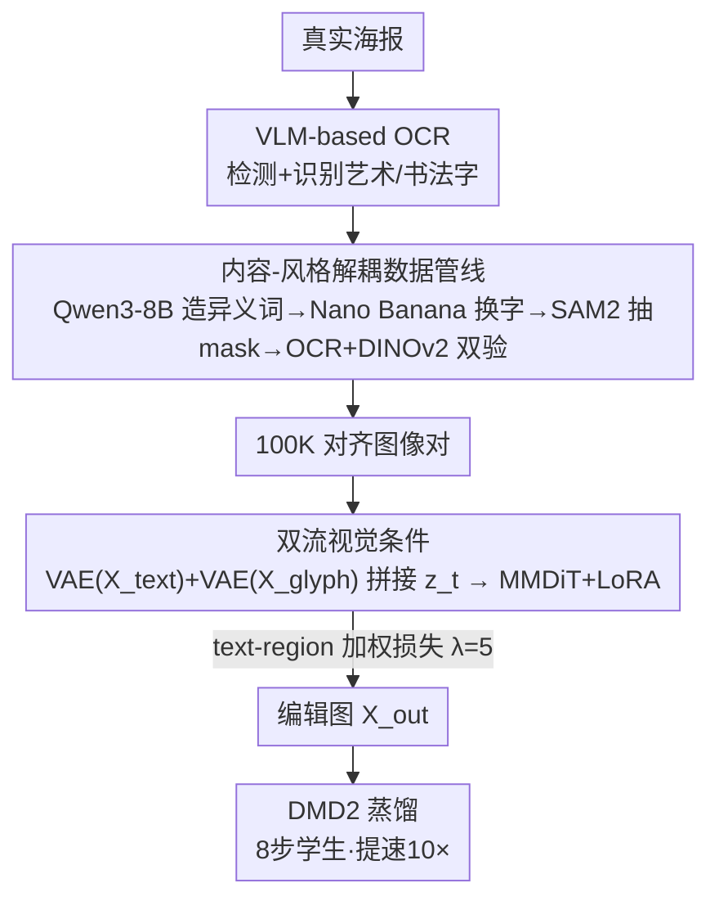

# SkyReels-Text: Fine-Grained Font-Controllable Text Editing for Poster Design

**会议**: CVPR 2026  
**arXiv**: [2511.13285](https://arxiv.org/abs/2511.13285)  
**代码**: https://github.com/SkyworkAI/SkyReels-Text (有)  
**领域**: 扩散模型 / 图像编辑 / 视觉文字生成  
**关键词**: 文字编辑, 字体可控, 海报设计, 双流视觉条件, 风格-内容解耦

## 一句话总结
SkyReels-Text 把"换字"建模成区域级编辑任务，用一张用户裁剪的字形参考图（glyph patch）作为显式视觉条件，通过双流 VAE 注入实现零样本字体迁移——既准确替换文字内容，又精确复刻任意字体（包括手写、艺术体），在多个 benchmark 上文字保真度和字体一致性同时拿到 SOTA。

## 研究背景与动机
**领域现状**：海报设计的核心诉求是"快速、精准地改文字、又不破坏原有版式与字体气质"。当前两条技术路线：一是通用扩散编辑模型（FLUX.1 Kontext、Qwen-Image-Edit、Seedream 4.0、Nano Banana）靠自然语言指令改图；二是专用视觉文字编辑模型（FLUX-Text、TextFLUX）往 DiT backbone 里注入渲染字形和位置 mask 来保证拼写正确。

**现有痛点**：通用编辑模型即使把参考字形当视觉上下文喂进去，也经常**改错内容或字体没贴上**——要么语义被破坏，要么生成文字的位置/版式对不上，专业排版精度不够。专用文字编辑模型拼写是对了，但**没有接收"任意字体风格"的机制**：它们只能用标准字库或内部字形先验，无法让输出精确模仿用户给的一张参考字体图。

**核心矛盾**：文字编辑要同时满足两个正交的约束——**内容正确**（写什么）和**风格忠实**（长什么样的字体）。现有方法要么只管内容（拼写）、要么只能用预设字库的风格，没人能把"任意用户提供的字体"作为细粒度的显式条件，于是内容和风格在模型内部互相纠缠。

**本文目标**：做到无需字体标签、无需测试时微调，用户只丢一张裁剪的字形 patch（哪怕这个字体不在任何标准字库里），就能把指定区域的文字换成目标内容、且严格复刻参考字体；还要支持一张图里**多个区域、各自不同字体**同时编辑。

**切入角度**：作者把字体可控编辑重新表述为"带目标视觉条件的区域修改任务"，关键洞察是——与其用文本 prompt 或内部字形先验这种模糊引导，不如把"内容"和"风格"拆成两路**显式的视觉条件**分别喂进去，给模型无歧义的先验。

**核心 idea**：用双流视觉条件（plain-text 参考图管内容/版式 + glyph map 管字体），经冻结 VAE 编码后在序列维拼到噪声 latent 上，让模型直接 attend 到内容和字体范例，实现零样本字体迁移。

## 方法详解

### 整体框架
SkyReels-Text 要解决的是"给定源海报、若干待编辑文字实例 $(t_i, r_i, g_i)$（目标文字、区域、参考字形）和文字 prompt $y$，生成把原文字区域换成目标文字、且字体视觉一致的编辑图 $X_{out}$"。整条系统分两大块：**离线的数据生产管线**（造出内容与风格完全解耦的 100K 对齐图像对）和**在线的双流条件编辑模型**（在 Qwen-Image-Edit 上 LoRA 微调）。

数据侧的关键是"内容-风格解耦"：从真实海报里用自训练的 VLM-OCR 找出高质量文字实例，用 Qwen3-8B 生成与原文**语义完全不同**的替换词（最大化内容解耦），再用 Nano Banana 在保留字体/颜色/局部对齐的前提下替换内容，SAM2 抽紧致 mask，最后用 OCR（验内容）+ DINOv2 特征相似度（验风格）双重校验，得到"风格相同、内容最大不同"的原图-编辑图对。模型侧在推理时：把原图待编辑区域用目标文字 inpaint 出 plain-text 参考 $X_{text}$（管内容和版式），把参考字形渲染到同尺寸画布得到 glyph map $X_{glyph}$（管字体），两者经冻结 VAE 编码后与噪声 latent $z_t$ 沿序列维拼接送入带 LoRA 的 MMDiT，同时 Qwen2.5-VL 处理多模态指令。训练用 text-region 加权损失聚焦字形区域，最后用 DMD2 蒸馏成 8 步学生模型提速 10× 以上。

### 关键设计

**1. 双流视觉条件机制：把内容和字体拆成两路显式视觉先验**

这是全文的核心创新，直击"内容与风格互相纠缠、文本 prompt 引导太模糊"的痛点。作者不再依赖文本 prompt 或模型内部字形先验，而是把编辑条件解耦成两张图：一是 plain-text 参考 $X_{text}$，做法是把原图待编辑区域用目标文字 $t_i$ inpaint 进去，从而在原视觉上下文里确立"写什么内容、放在什么版式位置"；二是 glyph map $X_{glyph}$，把参考字形 $g_i$ 渲染到与输入同尺寸的画布上，确立"长什么样的字体"。

注入方式刻意做得很轻——不引入参数沉重的 embedding 模块，也不用 ControlNet，而是直接用**冻结的 VAE 编码器**抽取两张图的特征，沿序列维与噪声 latent 拼接：

$$Z_{in} = \text{Concat}\big(z_t,\ \text{VAE}(X_{text}),\ \text{VAE}(X_{glyph})\big).$$

这样模型在去噪时能直接 attend 到文字内容和字体范例两组 token。之所以有效：VAE 已经是预训练好的强视觉压缩器，复用它既简化训练又能有效提取/压缩视觉信息；而把字体作为"显式视觉范例"而非"标签/类别"，使得即便参考字体不在任何字库里，模型也能零样本迁移其笔画风格——这正是 FLUX-Text 这类靠内部字形先验的方法做不到的。

**2. VLM-based OCR：让数据管线能"读懂"书法体和艺术字**

整条数据生产的瓶颈在 OCR：标准 OCR（PP-OCRv4/v5）乃至 VLM 系的 PaddleOCR-VL 都是针对干净规整字体和场景文字优化的，遇到笔画不规则、空间布局非标准的书法体或定制字形就失效，甚至会把它们误判为图标或花纹。而海报里恰恰富含这类字体，没有可靠 OCR 就无从筛选高质量文字实例、也无从校验编辑后内容是否正确。

作者微调 Qwen2.5-VL 7B 作为专用 OCR（约 72 A100-hours），让它从视觉和语义两个角度同时解析非标准文字图案，既能识别又能像素级定位。它在管线里身兼三职：数据筛选时检测/识别文字实例并过滤重叠区域、校验时复测编辑后内容准确性、推理时评估指标（Sen. Acc / NED 都用它算）。这个组件是支撑"真实海报数据中心化"路线的前提。

**3. 内容-风格解耦数据管线：造出"同风格、异内容"的 100K 对齐图像对**

风格迁移学习最大的坑是"内容干扰"——模型常把某些字符的内容特征和风格特征混为一谈。作者用一条专门管线强制解耦：先用 VLM-OCR 在富文字海报里定位高质量文字实例并去掉重叠区域；对剩下的文字用 Qwen3-8B 生成**与原文语义发散**的替换词，且**刻意保证新词集与原词集不相交**，把内容差异拉到最大；再用 Nano Banana 编辑模型替换内容、同时保留字体/颜色/局部对齐等全部排版属性，从而留住细粒度风格。

为严格保证这一过程的保真度，作者用双重校验（Dual-Verification）：一是再用 VLM-OCR 复测新文字内容是否正确；二是从原区域和编辑区域分别抽 DINOv2 特征，验证特征级高相似度以确认风格被保住。最终产出 100K 对"内容最大不同、风格完全一致"的对齐样本——正因为成对样本只在内容上变、风格不变，模型才能学到"内容可换、风格照搬"的解耦能力，而不会把两者绑死。

**4. Text-Region 加权损失：把优化火力集中到只占 <10% 像素的文字区**

文字区域通常只占整图不到 10%，若对所有像素做均匀优化，文字生成的收敛会被大片背景稀释。作者在标准扩散损失（L2 或 flow matching loss）上按文字 mask $M$ 做空间重加权：

$$\mathcal{L} = \mathbb{E}\Big[\,\|X_{gt}-\hat{X}\|_2^2 \odot (1 + \lambda \cdot M)\,\Big],$$

其中 $\lambda>0$ 放大文字区域的损失，$M$ 是 SAM2 生成的紧致文字 mask，实际取 $\lambda=5$。这个 trick 简单但有效：不需要额外的感知编码器、也不需要多阶段训练，就把字形精度拉上去、同时不破坏背景。消融显示 $\lambda$ 越大文字准确率越高，但 $\lambda=5$ 在文字收敛和背景保真之间取得最佳平衡（再大到 10 会牺牲背景 B-PSNR）。

**5. DMD2 蒸馏：8 步学生模型推理提速 10×**

为在不牺牲字体可控编辑质量的前提下加速推理，作者把 SkyReels-Text 用改进的分布匹配蒸馏 DMD2 蒸馏成 8 步学生模型，使其分布贴近教师、同时保住细粒度字体感知能力。它减少采样步数、并消除对 classifier-free guidance 的需求，推理提速超过 10×——这对海报设计这种要快速迭代的实际工作流很关键。

### 损失函数 / 训练策略
- **Backbone & 微调**：以 Qwen-Image-Edit 为 baseline，用 rank=64 的 LoRA 微调以保住基础模型能力；batch size 64，AdamW，学习率 $10^{-4}$，训 2 epoch，约 512 A100-hours。
- **OCR 微调**：Qwen2.5-VL 7B，学习率 $10^{-4}$，约 72 A100-hours。
- **主损失**：text-region 加权重构损失，$\lambda=5$。
- **加速**：DMD2 蒸馏成 8 步学生模型。

## 实验关键数据

### 主实验

SkyReels-Text Benchmark（自建 200 样本，覆盖多种字体风格）上的对比：

| 方法 | Sen. Acc↑ | NED↑ | Spatial↑ | DINO↑ | B-PSNR↑ |
|------|-----------|------|----------|-------|---------|
| Nano Banana | 0.7290 | 0.9195 | 0.7011 | 0.8125 | 28.78 |
| Seedream 4.0 | 0.7772 | 0.9348 | 0.6844 | 0.7629 | 25.50 |
| FLUX-Kontext-Pro | 0.6390 | 0.8458 | 0.5063 | 0.8130 | 27.21 |
| Qwen-Image-Edit | 0.7760 | 0.9337 | 0.5845 | 0.8209 | 25.88 |
| FLUX-Text | 0.8266 | 0.9352 | 0.7503 | 0.6679 | **34.53** |
| Calligrapher | 0.6404 | 0.8811 | 0.7281 | 0.7162 | 24.26 |
| **SkyReels-Text** | **0.8334** | **0.9502** | **0.7506** | **0.8503** | 34.17 |

> 指标定义：**Sen. Acc**（句子准确率）和 **NED**（归一化编辑距离，$\text{NED}=1-\text{Edit Distance}$）用微调后的 Qwen2.5-VL 7B 算，衡量文字保真度；**Spatial** 是 OCR 检测框与 GT 框的空间 IoU，衡量版式对齐；**DINO** 是生成与参考文字区域的 DINO 相似度，衡量字体风格贴合度；**B-PSNR** 在非文字区域算，衡量背景保留。SkyReels-Text 在文字保真（Sen.Acc/NED）、字体风格（DINO）、版式（Spatial）上全面领先，背景保留（B-PSNR 34.17）与 FLUX-Text 相当。

AnyText benchmark（1000 图，中英双语）上全指标最优：

| 数据 | 方法 | Sen. Acc↑ | NED↑ | FID↓ | LPIPS↓ |
|------|------|-----------|------|------|--------|
| 英文 | FLUX-Text | 0.8419 | 0.9400 | 13.85 | 0.0729 |
| 英文 | **SkyReels-Text** | **0.8536** | **0.9406** | **6.12** | **0.0246** |
| 中文 | FLUX-Text | 0.7132 | 0.8510 | 13.68 | 0.0541 |
| 中文 | **SkyReels-Text** | **0.7710** | **0.8764** | **5.44** | **0.0192** |

英文 Sen.Acc 超 FLUX-Text 1.37%、中文超 7.50%；FID/LPIPS 全场最低，说明分布级和感知级都更贴近真实图。

手写文字生成（IAM / CVL，零样本，未专门训手写数据）：

| 数据集 | 方法 | HWD↓ | IS↑ | GS↓(×10⁻³) |
|--------|------|------|-----|------------|
| IAM | DiffBrush | 1.41 | 1.85 | 2.35 |
| IAM | **SkyReels-Text** | **1.32** | **1.90** | **1.26** |
| CVL | DiffBrush | 1.06 | 1.70 | 29.6 |
| CVL | **SkyReels-Text** | **0.89** | 1.71 | 31.0 |

> **HWD**（Handwriting Distance）衡量手写风格保真度。即使没在手写数据上训练，仅靠一张参考样本就在 HWD 上超过专门为手写设计训练的 DiffBrush，体现零样本字体迁移的泛化力。

**用户研究**：对 4 个商业编辑系统，SkyReels-Text 全胜——对 Qwen-Image-Edit 胜率 71.8%、对 FLUX-Kontext-Pro 84.5%、对 Nano Banana 和 Seedream 4.0 也有 60.2% 胜率、败率仅约 10%。

### 消融实验

| 配置 | Sen. Acc↑ | NED↑ | Spatial↑ | DINO↑ | B-PSNR↑ |
|------|-----------|------|----------|-------|---------|
| w/o FSR（无字体参考） | 0.9327 | 0.9734 | 0.6986 | 0.6995 | 33.61 |
| w/ FSR（完整） | 0.8334 | 0.9502 | 0.7506 | **0.8503** | 34.17 |
| λ=0 | 0.7998 | 0.9378 | 0.7501 | 0.8473 | 34.28 |
| λ=1 | 0.8126 | 0.9392 | 0.7492 | 0.8484 | 34.25 |
| λ=2 | 0.8267 | 0.9426 | 0.7505 | 0.8496 | 34.21 |
| λ=5 | 0.8334 | 0.9502 | 0.7506 | **0.8503** | 34.17 |
| λ=10 | **0.8363** | **0.9558** | 0.7503 | 0.8502 | 33.13 |

### 关键发现
- **字体参考（FSR）是字体一致性的来源，但和拼写准确率存在 trade-off**：加 FSR 后 DINO 从 0.6995 飙到 0.8503（字体大幅贴合）、Spatial 也升（参考图裁自原图，隐含空间线索帮助定位）；但 Sen.Acc/NED 反而略降——作者解释有两点原因：一是单条件生成任务更简单，二是开启 FSR 后字体被高度风格化，当前 OCR 反而难以解析这些花体（即指标本身受 OCR 能力拖累，并非真生成质量下降）。
- **加权损失的 λ 单调提文字准确率，但 λ=5 是综合最优**：文字只占小部分像素，$\lambda>0$ 才能把优化导向字形保真。λ 越大 Sen.Acc/NED 越高，λ=10 文字最准，但 λ=5 把 Spatial 和 DINO 推到最高、且背景 B-PSNR（34.17）远好于 λ=10 的 33.13，故取 λ=5 平衡文字收敛与背景保真。
- **零样本泛化最亮眼**：完全没训手写数据，仅凭参考图就在 IAM/CVL 上超过专门训练的手写生成模型，说明"把字体当显式视觉范例"这条路对未见字体的迁移天然友好。

## 亮点与洞察
- **"字体即一张参考图"的范式转换**：把字体从"标签/类别/字库索引"变成"一张可裁剪的视觉范例"，于是任意没在字库里的字体（书法、定制、手写）都能零样本迁移——这是相对 FLUX-Text/TextFLUX 内部字形先验的根本性松绑。
- **极轻量的条件注入**：不加 ControlNet、不加重型 embedding 模块，纯靠冻结 VAE 编码 + 序列维 concat，把双流条件喂进 MMDiT，既省训练成本又复用了预训练 VAE 的视觉压缩能力——这个"用 VAE+concat 注入视觉条件"的 trick 可直接迁移到其他需要图像参考的编辑任务。
- **数据解耦比模型设计更关键**：内容-风格能解耦，根子在于数据对"风格相同、内容最大不同"。用 Qwen3-8B 强制造异义词 + DINOv2 验风格的双验管线，是一个可复用的"造解耦数据"配方，适用于任何风格迁移任务。
- **指标诚实度**：作者主动指出 w/o FSR 时 Sen.Acc 更高其实是"任务更简单 + OCR 解析花体能力不足"造成的假象，而非生成更好——这种对指标局限的坦诚解释值得借鉴。

## 局限性 / 可改进方向
- **文字保真受限于 OCR 评测器**：Sen.Acc/NED 都用自家 Qwen2.5-VL OCR 算，当字体高度风格化时 OCR 本身会拉低分数，导致"字体越像、拼写分越低"的悖论——这意味着现有指标无法完全公允地衡量高风格化场景的真实质量。
- **依赖外部强模型造数据**：数据管线串了 Qwen3-8B、Nano Banana、SAM2、DINOv2 多个外部模型，复现成本和数据质量都受这些组件能力约束，Nano Banana 换字时若漏改/改错风格会污染训练对。
- **手写虽强但 GS 不稳**：CVL 上 HWD 最优，但 GS（几何分数 31.0）反而高于若干基线，几何一致性在某些数据上未必最佳。
- **未深究多区域多字体的失败模式**：论文强调支持多区域异构字体同时编辑，但定量实验主要在单字体设置，多字体冲突/相互干扰的边界未充分量化。

## 相关工作与启发
- **vs FLUX-Text / TextFLUX**：它们往 DiT 注入渲染字形 + 位置 mask 保证拼写，但只能用内部字形先验、无法接收用户任意字体；本文用显式 glyph patch 作视觉条件，实现字体可控。本文优势是字体迁移和 DINO 风格分大幅领先（DINO 0.8503 vs FLUX-Text 0.6679），劣势是 B-PSNR 略低于 FLUX-Text。
- **vs Qwen-Image-Edit / Nano Banana / Seedream 4.0（通用编辑模型）**：它们靠自然语言指令做开放域编辑，但缺乏文字编辑的鲁棒性、字体迁移时常改错内容或破坏背景；本文在同一 backbone（Qwen-Image-Edit）上 LoRA 微调 + 双流条件，把它专精成字体可控的文字编辑器，用户研究胜率 60%~84%。
- **vs Calligrapher（书法/字体迁移专精）**：本文不需为手写/书法单独训练，零样本就在 IAM/CVL 超过它（HWD 1.32/0.89 vs Calligrapher 系方法），泛化性更好。
- **vs AnyText / DreamText（多语言/字体感知文字生成）**：本文用"裁剪字形 patch 作显式视觉范例"取代字库/标签式的字体控制，把可控字体从有限集合扩到任意未见字体。

## 评分
- 新颖性: ⭐⭐⭐⭐ "字体即参考图"的双流视觉条件范式转换扎实，但单项技术（VAE concat、加权损失、DMD2）多为已有组件的巧妙组装
- 实验充分度: ⭐⭐⭐⭐⭐ 自建+AnyText+IAM/CVL 三类 benchmark、中英双语、手写零样本、用户研究、λ 与 FSR 消融齐全
- 写作质量: ⭐⭐⭐⭐ 动机清晰、对指标局限坦诚，但多区域异构字体的核心卖点缺定量支撑
- 价值: ⭐⭐⭐⭐⭐ 直击海报/排版专业工作流真实痛点，代码模型开源，零样本字体迁移实用性强

<!-- RELATED:START -->

## 相关论文

- [\[CVPR 2026\] PosterIQ: A Design Perspective Benchmark for Poster Understanding and Generation](posteriq_a_design_perspective_benchmark_for_poster_understanding_and_generation.md)
- [\[CVPR 2026\] PromptEnhancer: Taming Your Rewriter for Text-to-Image Generation via Fine-Grained Reward](promptenhancer_taming_your_rewriter_for_text-to-image_generation_via_fine-graine.md)
- [\[CVPR 2026\] SliderEdit: Continuous Image Editing with Fine-Grained Instruction Control](slideredit_continuous_image_editing_with_fine-grained_instruction_control.md)
- [\[CVPR 2026\] CogniEdit: Dense Gradient Flow Optimization for Fine-Grained Image Editing](cogniedit_dense_gradient_flow_optimization_for_fine-grained_image_editing.md)
- [\[CVPR 2026\] SpatialReward: Verifiable Spatial Reward Modeling for Fine-Grained Spatial Consistency in Text-to-Image Generation](spatialreward_verifiable_spatial_reward_modeling_for_fine-grained_spatial_consis.md)

<!-- RELATED:END -->
