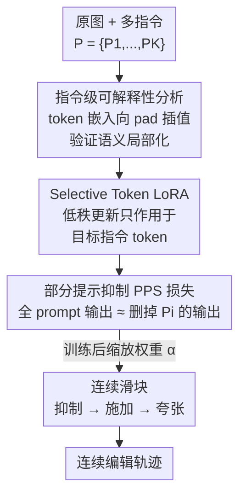

# SliderEdit: Continuous Image Editing with Fine-Grained Instruction Control

**会议**: CVPR 2026  
**论文**: [CVF Open Access](https://openaccess.thecvf.com/content/CVPR2026/html/Zarei_SliderEdit_Continuous_Image_Editing_with_Fine-Grained_Instruction_Control_CVPR_2026_paper.html)  
**代码**: 无（项目页 https://armanzarei.github.io/SliderEdit ）  
**领域**: 图像生成 / 指令式图像编辑  
**关键词**: 指令式图像编辑, 连续控制, LoRA, 提示词抑制, MMDiT

## 一句话总结
SliderEdit 给指令式图像编辑模型（FLUX-Kontext、Qwen-Image-Edit）的每条子指令配一个"滑块"，通过一组共享低秩适配器加部分提示抑制损失，让用户连续、解耦地调节每个编辑的强度——从完全不施加到加倍夸张，而无需为每个属性单独训练。

## 研究背景与动机

**领域现状**：以 FLUX-Kontext、Qwen-Image-Edit 为代表的指令式编辑模型已经能在统一框架里处理从全局风格到局部细节的各种编辑，用户只要给一句自然语言指令就能改图。这些模型建立在 MMDiT（多模态扩散 Transformer）之上，文本 token 与图像 token 通过共享注意力交互。

**现有痛点**：这类模型本质上是**离散的、全有或全无**——给定一个 prompt，它只会输出一个固定强度的结果。比如"把龙的皮肤变金色并让它喷火"，模型无法让你在"皮肤稍微泛金"与"亮金属金"之间选，也无法让火焰在"小一簇"与"大爆发"之间过渡。多次采样只能得到随机变体，无法**系统性地、连续地**调单条指令的强度。

**核心矛盾**：连续属性滑块（如 Concept Sliders）这条线虽然存在，但它们几乎都为**每个属性单独训一个 LoRA / 嵌入方向**，存在属性纠缠、多编辑退化的问题，而且主要面向文生图，迁到真实图像编辑上效果有限。换句话说，"连续控制"和"通用、免逐属性训练、支持多指令组合"两者难以兼得。

**本文目标**：把 SOTA 指令编辑模型扩展成支持**连续、解耦、可解释**的逐指令强度控制——给一个多指令 prompt $P=\{P_1,\dots,P_K\}$，为每条指令 $P_i$ 关联一个缩放系数，可在"抑制（强度 0）→ 完全施加（强度 1）→ 夸张放大（>1）"之间平滑滑动。

**切入角度**：作者的关键观察是——MMDiT 的潜在表示把**指令语义局部化地编码在对应的文本 token 嵌入里**。如果能定位并选择性地调制这些 token，就能精细控制单条指令对输出的影响。他们用一个简单的插值实验验证了这一点：把目标指令 token 的嵌入向 pad token 线性插值，编辑强度就会随之平滑减弱，而其他编辑基本不动。

**核心 idea**：训练**一组共享**的低秩适配器（而非逐属性 LoRA），用一个"部分提示抑制"损失教它学会"消掉某条指令的视觉效果"；训练好后，通过连续缩放这组 LoRA 的权重，就自然得到了每条指令的连续滑块。

## 方法详解

### 整体框架

SliderEdit 的输入是原图 $X_{orig}$ 加一个多指令 prompt $P=\{P_1,\dots,P_K\}$，输出是一个**带强度旋钮**的编辑模型：对任意指令 $P_i$，用户给定缩放系数就能连续调它的施加强度。整条路线分三步：① 先做一个可解释性分析，确认指令语义确实局部化在它对应的 token 嵌入里；② 把"抑制某条指令"形式化成一个适配器 $M_\theta(P_i)$，用部分提示抑制（PPS）损失训练它去复现"prompt 里删掉 $P_i$"的结果；③ 适配器以 Selective Token LoRA 的形式只作用在目标指令 token 上，训练完成后通过连续缩放其权重，把"抑制器"变成"连续滑块"。

整个训练只在冻结的基模型上加一组秩 16 的低秩矩阵，用 1k–8k 样本、几百步迭代即可收敛，非常轻量。

### 关键设计

**1. 指令级可解释性分析：先证明"指令语义是局部化的"**

要做精细控制，先得知道"一条指令的影响藏在哪"。作者在每个注意力块第 $\ell$ 层，针对目标指令 $P_{target}$ 对应的 token 子集 $\{y^\ell_u,\dots,y^\ell_{u'}\}$ 做线性插值干预：把它们朝 pad token 嵌入靠拢，$y^\ell_j \leftarrow (1-\beta)\, y^\ell_j + \beta\, y^\ell_{<pad>}$。其中 $\beta=1$ 等于用"无信息"的 pad 替换掉指令、彻底抹掉该编辑，$\beta=0$ 则完全保留。实验（论文 Fig. 2）显示：随 $\beta$ 变化，对应编辑的强度平滑减弱，而其他编辑基本不动。这说明指令语义确实**高度局部化**在它自己的 token 嵌入上，直接操纵这些嵌入就能精细控制——这为后面"只改目标 token"的设计提供了依据。不过作者也指出，单纯嵌入插值只能给出有限且**不够平滑/不够连续**的调制，所以需要更鲁棒的可学习机制。

**2. 部分提示抑制损失（PPS / SPPS）：把"调强度"转化成"学会抹掉一条指令"**

核心训练目标是让适配器 $M_\theta(P_i)$ 学会"中和"某条指令的视觉效果。做法很直接：用冻结基模型 $\epsilon$ 先跑一次**删掉第 $i$ 条指令**的 prompt 得到参考方向，再要求**带适配器、且喂完整 prompt** 的模型输出与之一致：

$$\mathcal{L}_{PPS} = \big\| \epsilon_{M_\theta(P_i)}(Z, X_{orig}, P) - \epsilon(Z, X_{orig}, P\setminus\{P_i\}) \big\|$$

其中 $Z$ 是噪声潜变量。直觉上，这等于教适配器"在喂了完整 prompt 的情况下，假装那条指令不存在"。这个目标的妙处在于它**自监督、无需额外标注**：监督信号就是基模型自己在"少一条指令"时的输出。作者还给了一个简化变体 SPPS，把整个 prompt 当作单条指令 $P=\{P_1\}$ 来施加抑制；尽管更简单，SPPS 训出的适配器**泛化性更强**，即便在多指令场景也很鲁棒，因此实现里默认用 SPPS 训练（多指令的强控制场景再辅以 PPS）。

**3. Selective Token LoRA（STLoRA）与全局变体 GSTLoRA：让更新只落在该落的 token 上**

适配器 $M_\theta$ 实例化为 **Selective Token LoRA**——一个 token 感知的轻量适配器。在某层线性投影 $z'=W^\ell z$ 上，它引入低秩矩阵 $\Delta W^\ell = B^\ell A^\ell$，但**只对目标指令 $P_i$ 对应的 token 应用**这个更新：$z'_{target}=(W^\ell+\Delta W^\ell)z_{target}$，其余 token 仍走原投影 $z'_{others}=W^\ell z_{others}$。这种选择性保证了改一条指令不会污染别的 token，是实现"解耦控制"的关键。针对**单指令**场景，作者又给了 **GSTLoRA**（Globally Selective Token LoRA），把更新施加到**所有**文本和图像 token 上——因为单指令时可以利用全局上下文，往往能得到更平滑、更高保真度的编辑轨迹。两个变体由同一套算法切换（论文 Algorithm 2）：STLoRA 走 token 选择分支，GSTLoRA 走全局分支。

**4. 缩放 LoRA 权重 → 连续滑块（含外推）**

训练好的 LoRA 天然支持连续控制：记 $M^\alpha_\theta$ 为把每层更新缩放成 $\alpha\Delta W^\ell$ 的适配器。在区间 $[\alpha_{min},\alpha_{max}]$ 内变化 $\alpha$，就得到一段平滑连续的效果谱——从完全抑制（$\alpha=1$）到完全施加（$\alpha=0$），甚至**外推到 $\alpha<0$ 做夸张编辑**。注意 $\alpha$ 与背景里定义的强度系数 $\beta$ 方向相反，二者关系为 $\alpha = 1-\beta$。正是这一步把"训练时学到的抑制能力"无缝转成了"推理时可拖动的滑块"，且无需任何重训。

### 损失函数 / 训练策略
- 基模型 FLUX-Kontext、Qwen-Image-Edit 全程冻结，只训低秩适配器，LoRA 秩设为 16。
- 默认用 $\mathcal{L}_{SPPS}$ 训练（更简单、更泛化）；多指令强控制场景用 $\mathcal{L}_{PPS}$ 增强 STLoRA。
- 训练数据为 GPT-Image-Edit 数据集的 1k–8k 子集；STLoRA 训 1000 步（约 400 步即收敛），FLUX 上的 GSTLoRA 仅 300 步——整体计算与数据都极轻量。

## 实验关键数据

评测构造了一个人脸编辑基准：若干主体 × 若干编辑方向（如"让头发卷曲""让头发变长"），原图刻意选目标属性缺失的样本。每条编辑在 $[\alpha_{min},\alpha_{max}]$ 内取 $\delta$ 步，形成 $\gamma$ 维编辑空间，用来量化**连续性、外推性、解耦性**三类指标（连续性用卡方统计衡量分数是否均匀平滑变化，解耦性用 ArcFace ID 距离、LPIPS、DINOv2 衡量是否动到无关因素，越低越好）。

### 主实验（单指令 γ=1，δ=15，基于 FLUX-Kontext）

| 方法 | Continuity-CLIP ↑ | Continuity-SigLIP ↑ | Disent. LPIPSalex ↓ | Disent. ID ↓ |
|------|------|------|------|------|
| Concept Slider | 0.1803 | 0.2071 | 0.2174 | 0.7091 |
| Cont. Attr. Control | 0.1891 | 0.2167 | 0.1973 | 0.5519 |
| Implicit CFG | 0.1547 | 0.1906 | 0.2149 | 0.2748 |
| Explicit CFG | 0.1993 | 0.2263 | 0.2465 | 0.3415 |
| SliderEdit-STLoRA | 0.2538 | 0.2495 | **0.1902** | **0.2550** |
| SliderEdit-GSTLoRA | **0.2998** | **0.3062** | 0.1868 | 0.2675 |

GSTLoRA 在连续性上明显领先（CLIP 0.2998 vs Explicit CFG 0.1993），同时保持强解耦与令人满意的外推；即便人们直觉上认为 Explicit CFG 该有可比表现，STLoRA / GSTLoRA 在平滑度和强度控制上都显著超过它。两个先验滑块方法（Concept Slider / Cont. Attr. Control）因依赖 inversion，在真实图像编辑上 ID 漂移很大（ID 距离 0.55–0.71，远高于本文 ~0.26）。

### 多指令分析（γ∈{1,2,3}，δ=7）

| γ | 模型 | Extrap.Avg ↑ | Cont.Avg ↑ | Disent.Avg ↓ |
|---|------|------|------|------|
| 1 | FLUX-Kontext | 0.2630 | 0.2709 | 0.1912 |
| 1 | Qwen-Image-Edit | 0.3214 | 0.2319 | 0.2187 |
| 2 | FLUX-Kontext | 0.2776 | 0.2409 | 0.2509 |
| 2 | Qwen-Image-Edit | 0.3160 | 0.2813 | 0.3088 |
| 3 | FLUX-Kontext | 0.2970 | 0.3691 | 0.2762 |
| 3 | Qwen-Image-Edit | 0.3417 | **0.4345** | 0.3630 |

只有 STLoRA 能在 γ>1 时做**逐指令独立控制**（Explicit/Implicit CFG 与 GSTLoRA 无法分别控制各方向）。两个基模型各有所长：FLUX 在 ID 保持与解耦上更好，Qwen 在外推上更强；连续性两者接近。⚠️ 不同 γ、不同模型间数值不宜直接比大小（任务难度与采样步数 δ 不同）。

### 关键发现
- **GSTLoRA 的平滑度是最大卖点**：相比 Implicit/Explicit CFG 出现的"突变跳变"，GSTLoRA 的聚合相似度分数随 $\alpha$ 渐进上升，编辑轨迹连续且 ID 漂移更小。
- **SPPS 比 PPS 更泛化**：把多指令当单指令训练反而得到更鲁棒的适配器，这是个反直觉但实用的发现。
- 始终存在**连续性 / 外推性 / 解耦性三者的 trade-off**——没有哪个配置能同时把三项都拉满。

## 亮点与洞察
- **"调强度"被巧妙转化为"学会删一条指令"**：PPS 损失用基模型自己"少一条指令"的输出当监督，完全自监督、无需人工标注强度，这是把一个本来模糊的"强度"概念落地成可优化目标的关键一招。
- **一套共享 LoRA 通吃所有属性**：相比 Concept Sliders 逐属性训练，SliderEdit 学一组低秩矩阵就泛化到多样编辑、未见属性和组合指令，工程上和可扩展性上都更友好。
- **token 选择性是解耦的物理基础**：STLoRA 只动目标 token 嵌入，把"改 A 不影响 B"从损失约束变成结构性保证，这个 token 级粒度的思路可迁移到其他需要解耦多条件的生成任务。
- **LoRA 权重缩放天然就是连续旋钮**：训练时学"抑制"，推理时缩放系数即得连续谱并可外推到夸张，复用了 LoRA scaling 这一已知性质但用到了新场景。

## 局限与展望
- 论文自己点明了**连续性/外推性/解耦性的三方 trade-off**，没有给出能同时最优的方案。
- 定量评测主要建立在**人脸编辑基准**上，更广泛的物体/场景编辑多以定性展示为主，量化覆盖面有限。⚠️ 各指标都依赖 VLM（CLIP/SigLIP/BLIP）的图文相似度作代理，本身有偏差。
- 强度由 VLM 相似度近似度量，缺乏直接的人类感知强度标定；"夸张外推"（$\alpha<0$）何时会破坏图像保真度没有系统刻画。
- 当前在 FLUX-Kontext、Qwen-Image-Edit 两个 MMDiT 模型上验证，是否能无缝迁到其他架构的编辑模型仍待确认。

## 相关工作与启发
- **vs Concept Sliders / Continuous Attribute Control**: 它们为每个属性训独立 LoRA 或嵌入方向，且依赖 inversion，主要服务文生图；本文用**一套共享适配器**直接服务指令式真实图像编辑，免逐属性重训、支持多指令组合，真实图编辑上 ID 保持显著更好。
- **vs Explicit / Implicit CFG**: CFG 类方法靠 guidance scale 隐式调强度，控制粒度粗、轨迹突变，且**多指令时无法分别控制各方向**；STLoRA 借 token 选择性实现逐指令解耦、轨迹平滑。
- **启发**: "用基模型在删去某条件后的输出当自监督目标"这一范式，可推广到任何"想精细调单个条件强度"的可控生成场景（如布局、风格、相机视角的连续调节）。

## 评分
- 新颖性: ⭐⭐⭐⭐⭐ 首个面向指令式图像编辑的连续、解耦、可解释强度控制框架，PPS 损失思路新颖。
- 实验充分度: ⭐⭐⭐⭐ 多指标、多基模型、多基线对比扎实，但量化主要集中在人脸基准。
- 写作质量: ⭐⭐⭐⭐ 从可解释性观察一路推导到方法，逻辑清晰，记号略多。
- 价值: ⭐⭐⭐⭐⭐ 轻量、即插即用地把 SOTA 编辑模型升级为连续可控，交互式创作价值高。

<!-- RELATED:START -->

## 相关论文

- [\[CVPR 2026\] Kontinuous Kontext: Continuous Strength Control for Instruction-based Image Editing](kontinuous_kontext_continuous_strength_control_for_instruction-based_image_editi.md)
- [\[CVPR 2026\] CogniEdit: Dense Gradient Flow Optimization for Fine-Grained Image Editing](cogniedit_dense_gradient_flow_optimization_for_fine-grained_image_editing.md)
- [\[CVPR 2026\] SkyReels-Text: Fine-Grained Font-Controllable Text Editing for Poster Design](skyreels-text_fine-grained_font-controllable_text_editing_for_poster_design.md)
- [\[CVPR 2026\] DreamOmni2: Multimodal Instruction-based Generation and Editing](dreamomni2_multimodal_instruction-based_generation_and_editing.md)
- [\[CVPR 2026\] CompBench: Benchmarking Complex Instruction-guided Image Editing](compbench_benchmarking_complex_instruction-guided_image_editing.md)

<!-- RELATED:END -->
