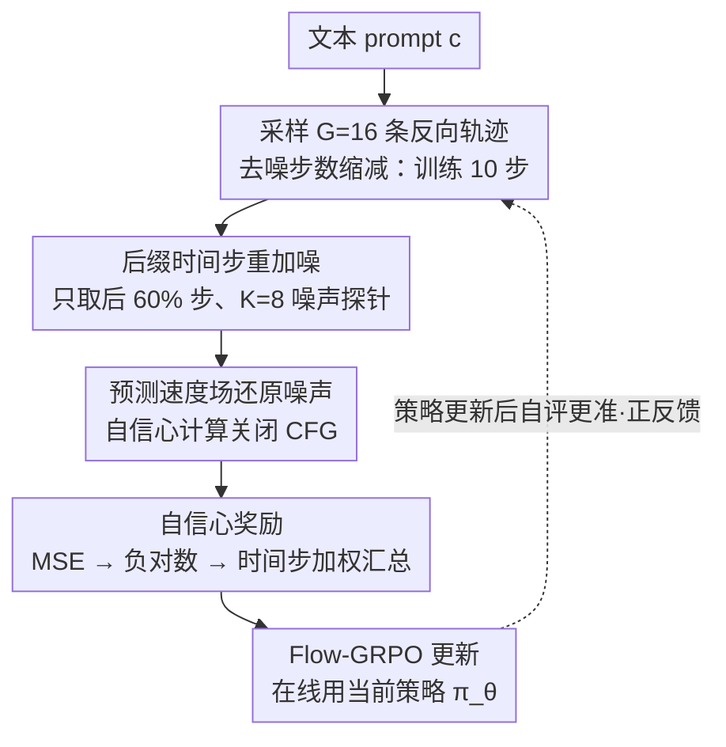

# SOLACE: Improving Text-to-Image Generation with Intrinsic Self-Confidence Rewards

**会议**: CVPR 2026  
**arXiv**: [2603.00918](https://arxiv.org/abs/2603.00918)  
**代码**: [https://wookiekim.github.io/SOLACE/](https://wookiekim.github.io/SOLACE/)  
**作者**: Seungwook Kim, Minsu Cho (POSTECH / RLWRLD)  
**领域**: 扩散模型 / 图像生成 / 后训练  
**关键词**: 文本到图像, 自信心奖励, Flow-GRPO, 免外部奖励, 后训练对齐  

## 一句话总结
用T2I模型自身的去噪自信心（对注入噪声的恢复精度）作为内在奖励替代外部奖励模型做后训练，在组合生成、文字渲染、文图对齐上获一致提升，且与外部奖励互补可缓解reward hacking。

## 背景与动机
T2I后训练（post-training）是提升生成质量的重要范式，通常依赖外部奖励信号（如PickScore、HPSv2等人类偏好模型）驱动强化学习。但这条路存在三个核心痛点：
1. **外部奖励定义困难**：好图像需同时满足组合性、文字渲染、美学、文图对齐等多个弱相关标准，不同场景权重不同
2. **Reward hacking**：针对单一外部指标优化容易导致过拟合——目标分数上升但非目标能力退化（如PickScore涨了但组合性崩了）
3. **成本与复杂度**：人类偏好奖励模型需大规模标注训练，训练时还要额外跑评价模型，流水线复杂

核心问题：**T2I生成器自身能否提供有意义的后训练信号？** 大规模预训练已赋予模型对真实图像分布和文图对齐的强先验——高质量输出时模型应当更"自信"。

## 核心思想
受Score Distillation Sampling (SDS)启发——SDS用预训练T2I模型作为text-to-3D的critic——SOLACE将同一思想内化：**让T2I模型critique自己的生成**。
具体做法是给模型生成的潜表示重新注入噪声，然后测量模型恢复该噪声的精度。恢复越准确 → 模型对自己输出越"自信" → 奖励越高。

## 方法详解

### 整体框架

SOLACE 想回答一个问题：T2I 生成器自己能不能给后训练提供奖励信号，而不必依赖外部偏好模型。它的做法是让模型「自评」——把生成出来的潜表示重新打上噪声，再看模型能多准地把这些噪声恢复回来，恢复得越准说明模型对这张图越「自信」、奖励越高，整个信号在潜空间里算完直接喂给 Flow-GRPO。

给定文本 prompt $c$，一轮的流程是：先采样 $G=16$ 组独立反向轨迹得到一批终端潜表示 $\{z_0^{(i)}\}_{i=1}^G$；抽 $K=8$ 个共享噪声探针 $\epsilon^{(m)} \sim \mathcal{N}(0,I)$（反义配对保证均值为零）；对每个 $z_0^{(i)}$ 在若干时间步 $t \in \mathcal{T}$ 按 $z_t^{(i,m)} = (1-t)z_0^{(i)} + t\epsilon^{(m)}$ 重新加噪；让模型预测速度场 $v_\theta(z_t^{(i,m)}, t, c)$ 并还原噪声估计 $\hat{\epsilon}_\theta = v_\theta + z_0^{(i)}$；最后用恢复误差算出自信心奖励送进 Flow-GRPO。关键之处在于这条链路里有几个稳定化/提效的设计（只优化后缀时间步、奖励计算关 CFG、用在线策略而非冻结参考、去噪步数缩减），缺了就会崩溃或退化。

### 关键设计

**1. 自信心奖励：用去噪恢复精度当内在奖励**

外部奖励既难定义又容易被 hack，SOLACE 索性把奖励来源换成模型自己的去噪能力。对每个样本 $z_0^{(i)}$，先在每个时间步对 $K$ 个探针求平均重建误差，再做负对数变换并按时间步加权汇总：
$$\text{MSE}_{i,t} = \frac{1}{K}\sum_{m=1}^K \|\hat{\epsilon}_\theta(z_t^{(i,m)}, t, c) - \epsilon^{(m)}\|_2^2$$
$$S_{i,t} = -\log(\text{MSE}_{i,t} + \delta)$$
$$R_{\text{SOLACE}}(z_0^{(i)}, c) = \frac{1}{\sum_{t\in\mathcal{T}} w(t)} \sum_{t\in\mathcal{T}} w(t) S_{i,t}$$
负对数变换一举三得：近似高斯对数似然、压缩异常值、让不同时间步的得分可加（实践中 $w(t)=1$）。背后的依据是大规模预训练已经让模型对真实图像分布有了强先验，恢复得准本身就编码了「这是不是一张好图」的判断，所以这个信号不需要任何外部标注。

**2. 后缀时间步训练：只优化后 60% 去噪步**

直接对整条轨迹优化会把模型推向「噪声特别好预测」的退化区域，训练随之崩溃。SOLACE 只优化后 60%（$\rho=0.6$）去噪步的轨迹，把容易作弊的早期阶段排除在外，超过这个比例（$\rho>0.6$）就会触发崩溃。

**3. 自信心计算不用 CFG：避免优化引导代理**

CFG 构造的是混合场 $v_\text{cfg} = v_\text{uncond} + s(v_\text{cond} - v_\text{uncond})$，若用它算自信心，优化的其实是引导代理而非基础条件策略，反而诱发 hacking。因此奖励计算阶段一律关掉 CFG（消融里用 CFG 让 GenEval 从 0.71 掉到 0.68）。

**4. 在线计算优于离线：用当前策略而非冻结参考模型**

自信心用正在训练的 $\pi_\theta$ 计算，而不是冻结的 $\pi_\text{ref}$。随着模型变好，它的自评也越来越准、形成正反馈；离线版本评估能力被固定，效果全面落后（GenEval 0.71 vs 0.69、OCR 0.67 vs 0.61）。

**5. 去噪步数缩减：训练 10 步、推理 40 步**

奖励计算阶段把去噪步数从推理时的 40 步压到 10 步，质量几乎不掉但训练大幅加速。

### 损失函数 / 训练策略
- 优化器：AdamW，lr=3e-4
- LoRA：rank=32，α=64
- KL正则：β=0.04
- GRPO group size：G=16
- 噪声探针数：K=8（反义配对）
- 训练迭代：2000次
- 分辨率：512×512
- 推理CFG：7.0
- 硬件：8×NVIDIA RTX PRO 6000 Blackwell

## 实验结果

### 主实验（SD3.5-M基线）

| 模型 | GenEval↑ | OCR↑ | CLIPScore↑ | Aesthetic↑ | PickScore↑ | HPSv2↑ | ImageReward↑ |
|------|----------|------|-----------|-----------|------------|--------|-------------|
| SD3.5-M | 0.65 | 0.61 | 0.282 | 5.36 | 22.34 | 0.279 | 0.84 |
| +SOLACE | **0.71** | **0.67** | **0.288** | 5.39 | 22.41 | 0.278 | 0.87 |
| SD3.5-L | 0.71 | 0.68 | 0.289 | 5.50 | 22.91 | 0.288 | 0.96 |

关键发现：SOLACE让2.5B的SD3.5-M在GenEval/OCR/CLIPScore上几乎追平7.1B的SD3.5-L（不到1/3参数量）。

### SOLACE + 外部奖励互补

| 模型 | GenEval↑ | OCR↑ | CLIPScore↑ | PickScore↑ |
|------|----------|------|-----------|------------|
| SD3.5-M + FlowGRPO(GenEval) | **0.95** | 0.65 | 0.293 | 22.51 |
| SD3.5-M + FlowGRPO(GenEval) + SOLACE | **0.92** | **0.71** | **0.294** | 22.50 |
| SD3.5-M + FlowGRPO(PickScore) | 0.54 | 0.68 | 0.278 | **23.50** |
| SD3.5-M + FlowGRPO(PickScore) + SOLACE | 0.77 | **0.70** | 0.287 | 22.73 |

在FlowGRPO外部奖励后训练的基础上叠加SOLACE：组合性、文字渲染、对齐均改善，目标外部指标仅轻微下降——**内在与外在奖励互补，且缓解reward hacking**。特别是PickScore post-training导致GenEval从0.65暴跌至0.54，叠加SOLACE后恢复至0.77。

### 消融实验
- **噪声探针数K**：K=4/8/16差异不大，K=8略优且计算效率合理
- **CFG用于自信心**：用CFG反而掉分（GenEval 0.68 vs 0.71），验证了不应优化引导代理
- **在线vs离线**：在线全面优于离线（GenEval 0.71 vs 0.69，OCR 0.67 vs 0.61）
- **训练崩溃条件**：(1) $\rho > 0.6$；(2) 采样候选时不用CFG → 产生无纹理图像

### 用户研究
在PartiPrompts和HPSv2 prompt上收集约1800份回答（20名参与者），SOLACE在视觉真实感/吸引力和文图对齐两方面均一致优于基线SD3.5-M。

## 亮点 / 我学到了什么
- **预训练隐含质量先验**：模型的去噪能力本身就编码了"什么是好图像"的知识，自信心是可利用的内在信号
- **SDS→自我critique**：SDS用T2I模型评价3D生成，SOLACE将同一思路内化为自评——优雅的方法论迁移
- **内在+外在互补**：两类信号关注不同维度（自信心→组合性/文字；外部→人类偏好），叠加使用效果最佳
- **稳定化设计精巧**：后缀窗口、不用CFG、在线计算三个设计缺一不可，否则崩溃或效果差
- **潜空间操作**：奖励完全在潜空间计算，无需解码到像素空间，省去了decoder开销

## 局限与展望
- 与人类偏好指标相关性弱，无法单独靶向特定对齐目标（如美学）
- 仅验证了flow matching架构（SD3.5），对autoregressive T2I模型适用性未知
- 未来可探索：(1) 时序/多视角一致性扩展到视频和3D生成；(2) 解耦和校准内在信号以实现任务级奖励塑形

## 与相关工作的对比
- **vs FlowGRPO**：外部奖励有靶向性但易reward hacking且需额外模型；SOLACE免外部依赖但无法精确靶向
- **vs DPO/ReFL**：需偏好配对数据或可微奖励；SOLACE完全无监督
- **vs Intuitor (LLM)**：首次将自信心奖励从LLM离散token扩展到T2I连续去噪轨迹，非平凡迁移
- **vs SDS**：SDS用预训练模型评估外部生成（3D）；SOLACE用当前模型评估自身生成（自评）

## 与我的研究方向的关联
内在信号后训练的思路有跨领域推广价值——检测/分割模型同样经过大规模预训练，是否也可提取类似的"自信心"信号做无监督后训练？

## 评分
- 新颖性: ⭐⭐⭐⭐ 自信心作为T2I内在奖励新颖且有原理性支撑，但LLM领域Intuitor有先例
- 实验充分度: ⭐⭐⭐⭐ 多基准(GenEval/OCR/6个偏好指标)+用户研究+消融+多模型(SD3.5-M/L)+互补实验
- 写作质量: ⭐⭐⭐⭐ 问题定义清晰，方法推导严谨，消融实验系统
- 对我的价值: ⭐⭐⭐ 图像生成非核心方向，但"内在信号后训练"的范式值得关注

<!-- RELATED:START -->

## 相关论文

- [\[CVPR 2026\] Self-Corrected Image Generation with Explainable Latent Rewards](self-corrected_image_generation_with_explainable_latent_rewards.md)
- [\[CVPR 2026\] OSPO: Object-Centric Self-Improving Preference Optimization for Text-to-Image Generation](ospo_object-centric_self-improving_preference_optimization_for_text-to-image_gen.md)
- [\[CVPR 2026\] LumiX: Structured and Coherent Text-to-Intrinsic Generation](lumix_structured_and_coherent_text-to-intrinsic_generation.md)
- [\[CVPR 2026\] Self-Evaluation Unlocks Any-Step Text-to-Image Generation](self-evaluation_unlocks_any-step_text-to-image_generation.md)
- [\[CVPR 2026\] OctoT2I: A Self-Evolving Agentic Text-to-Image Router](octot2i_a_self-evolving_agentic_text-to-image_router.md)

<!-- RELATED:END -->
