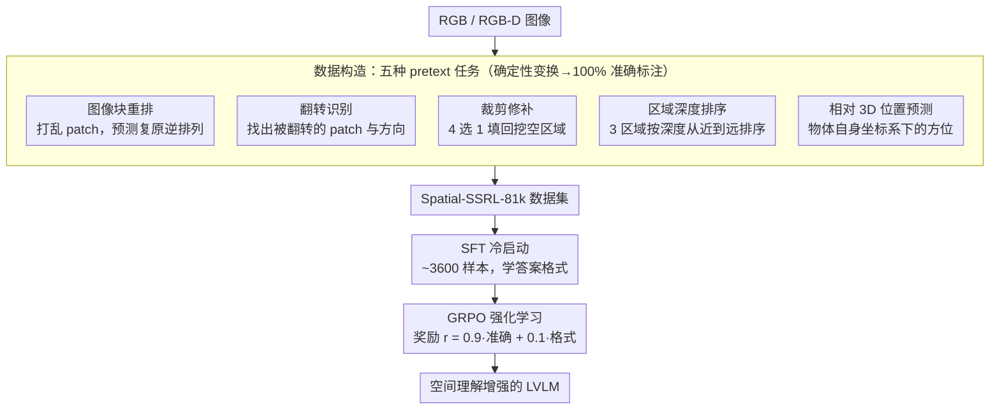

# Spatial-SSRL: Enhancing Spatial Understanding via Self-Supervised Reinforcement Learning

**会议**: CVPR 2026  
**arXiv**: [2510.27606](https://arxiv.org/abs/2510.27606)  
**代码**: [GitHub](https://github.com/InternLM/Spatial-SSRL)  
**领域**: 图像生成  
**关键词**: 空间理解, 自监督学习, 强化学习RLVR, 大视觉语言模型, 深度感知

## 一句话总结
本文提出Spatial-SSRL，一种自监督强化学习范式，通过从普通RGB/RGB-D图像自动构造五种pretext任务（patch重排、翻转识别、裁剪修补、深度排序、相对3D位置预测），利用GRPO优化LVLM的空间理解能力，在七个空间benchmark上平均提升3.89%-4.63%，且无需人工标注或外部工具。

## 研究背景与动机

**领域现状**：大视觉语言模型（LVLM）在VQA、图像描述等任务上接近饱和，但空间理解能力远低于人类水平。现有提升方法分为两类：数据驱动的SFT（构造空间QA对微调）和RLVR（用可验证奖励做强化学习）。

**现有痛点**：SFT方法依赖昂贵的人工标注或GPT-4生成QA对，且容易过拟合到数据集特定模式。工具型方法（如使用深度估计器、目标检测器等）pipeline复杂、计算成本高。模拟环境方法（rendering 3D场景）与真实世界存在domain gap。RLVR方法受限于特定环境（如3D扫描），数据规模和覆盖范围有限。

**核心矛盾**：空间理解需要大规模可验证的监督信号，但现有方法获取这类信号的代价太高——要么需要昂贵的人工标注，要么需要复杂的工具链，要么受限于特定3D数据集。

**本文目标** 设计一种零标注、无工具、可扩展的自监督方案来生成可验证的空间理解训练信号，并与RLVR训练范式自然结合。

**切入角度**：图像内部固有的结构一致性（相对深度、几何一致性、视角不变性）本身就提供了确定性可验证的监督信号。将视觉自监督学习（SSL）的pretext任务重新定位为RLVR的奖励函数，而非传统的特征预训练目标。

**核心 idea**：把经典的SSL任务（jigsaw、翻转检测等）改造成LVLM的QA prompt + 确定性验证函数，直接用GRPO做后训练。

## 方法详解

### 整体框架
这篇论文要解决的核心难题是：训练LVLM的空间理解需要海量"可验证"的监督信号，但人工标注、工具链和3D扫描这三条路都太贵或太窄。Spatial-SSRL的破局点在于——一张普通图像里本就藏着确定性的几何真值（哪块patch该放哪、哪个区域更近），把图像做一次可控变换，正确答案就被"程序化"地生成了，根本不需要人或检测器去标。

整套流程分两步走。第一步是数据构造：从RGB或RGB-D图像出发，自动生成五种pretext任务的QA对，攒成Spatial-SSRL-81k数据集，因为所有答案都来自确定性变换，标注准确率是100%。第二步是RL训练：先用约3600个样本做SFT冷启动，让模型先学会输出规定的答案格式（否则直接RL时生成正确格式的成功率不到5%），再上GRPO优化。五种任务里有三种只看RGB、考2D布局，两种依赖深度图、考3D空间推理，难度由浅入深地铺开。

### 关键设计

**1. Shuffled Patch Reordering（图像块重排）：把全局2D布局变成一道可判分的复原题**

这一任务直接针对"模型缺乏全局空间感"这个痛点。做法是把图像 $I$ 切成 $M \times N$ 的patch网格 $\mathcal{X} = \{x_{i,j}\}$，施加一个随机排列 $\pi$ 把它们打乱展示，而ground-truth答案就是能复原原图的逆排列：

$$\pi^{-1} = [\pi^{-1}(0),\ \pi^{-1}(1),\ \ldots,\ \pi^{-1}(M \times N - 1)]$$

模型要做的就是预测这串逆排列。为防止它靠拼接边缘的低级线索取巧，还会随机把一个patch涂成白色增加难度。要把打乱的网格拼回去，模型必须真正理解各块之间的相对位置和整体布局一致性——而这种能力恰好能迁移到判断真实场景里物体的空间排布。

**2. Flipped Patch Recognition（翻转识别）：用一处方向违反考验对局部几何的敏感度**

重排考的是全局，这一任务则把注意力收到局部细节。它随机挑一个patch $\hat{x}_t$，以等概率对它做垂直或水平翻转：

$$x_{\text{vert}}(r,c) = x(P_H - 1 - r,\, c), \qquad x_{\text{horz}}(r,c) = x(r,\, P_W - 1 - c)$$

模型要答出被翻转的patch索引 $t$ 和翻转方向 $d$，即 $[t, d]$。一处翻转往往很隐蔽，要发现它，模型得对局部几何、镜像对称性以及文字、人脸、阴影这类有方向性的线索足够敏感——这正是空间理解里容易被忽略的细粒度能力。

**3. Cropped Patch Inpainting（裁剪修补）：靠精心设计的干扰项逼模型读懂纹理连续性**

这一任务测的是纹理-上下文匹配与细粒度结构推理。它随机裁掉一块区域涂黑，再给出4个候选patch让模型选出正确的填充块。关键的巧思在干扰项：另外3个错误选项分别是正确patch的90°旋转版、它的内部子区域、以及向外扩展的区域，三者在视觉上都和正确答案高度相似。这样一来，模型没法靠颜色或大致语义蒙对，必须盯住纹理是否真的连续、结构是否真的对得上才能选准。

**4. Regional Depth Ordering（区域深度排序）：把深度图变成一道确定可验证的序数题**

从这里开始进入依赖深度的3D任务。做法是从depth map $D$ 里挑出3个深度上明确分离的区域，给它们贴上数字标签、打乱顺序展示，让模型按从近到远排序。区域的挑选有两条硬约束——每个区域自身的深度跨度要小，区域之间的深度差要足够大：

$$r(R_i) < r_{\max} = 0.15 \quad(\text{区域内一致}), \qquad d(R_i, R_{i+1}) > d_{\min} = 0.05 \quad(\text{区域间可分})$$

前者保证每块区域的深度是"干净"的，后者保证排序有唯一确定的答案、不会因为深度接近而模棱两可。这道题逼着模型整合深度线索、透视关系和序数推理，是3D场景理解的入门基本功。

**5. Relative 3D Position Prediction（相对3D位置预测）：让模型做一次自我中心的坐标变换**

这是五种任务里最硬的一个，对应空间理解里最高阶的能力。给定一个物体的朝向 $\theta$（从前后左右四个基本方向均匀采样），要预测另一个点落在该物体自身坐标系里的相对方位（左/右、前/后的组合）。机制上是一次2D刚体变换：把相机坐标系下的点 $(x_2, z_2)$ 旋转到以物体朝向为基准的坐标系 $(\tilde{x}_2, \tilde{z}_2)$，再按阈值读出方向标签 $(\tilde{p}_x, \tilde{p}_z)$。同一个点在相机视角和物体视角里"左右前后"完全不同，要答对就得做心象旋转、切换到以物体为中心的参照系并结合深度——这正是真实空间推理（"站在桌子的角度，杯子在它的左边还是右边"）所需的核心能力。

### 损失函数 / 训练策略
- **冷启动SFT**：先在~3600样本上做5 epoch的SFT（lr=$1 \times 10^{-5}$），让模型熟悉任务格式
- **GRPO优化**：KL正则权重0.01，每样本rollout 5次，temperature 1.0，batch size 128，lr=$1 \times 10^{-6}$，360步
- **奖励设计**：$r = 0.9 \cdot r_{\text{acc}} + 0.1 \cdot r_{\text{fmt}}$，准确率权重远高于格式权重
- 使用think标签引导推理链输出

## 实验关键数据

### 主实验（7个空间理解benchmark）

| 模型 | Spatial457 | 3DSRBench | SpatialEval | QSpatial+ | What'sUp | ViewSpatial | VSI-Bench | Avg |
|------|-----------|-----------|-------------|-----------|----------|-------------|-----------|-----|
| Qwen2.5-VL-3B | 33.70 | 50.30 | 54.65 | 33.66 | 85.85 | 35.38 | 27.84 | 45.91 |
| Spatial-SSRL-3B | 46.07 | 51.72 | 59.59 | 39.60 | 86.71 | 36.62 | 33.49 | 50.54 |
| Δ | **+12.37** | +1.42 | +4.94 | +5.95 | +0.86 | +1.24 | +5.65 | **+4.63** |
| Qwen2.5-VL-7B | 44.67 | 53.39 | 62.37 | 46.53 | 86.95 | 36.83 | 38.08 | 52.69 |
| Spatial-SSRL-7B | 53.34 | 56.53 | 64.03 | 54.46 | 90.61 | 37.81 | 39.29 | 56.58 |
| Δ | **+8.67** | +3.14 | +1.66 | +7.93 | +3.66 | +0.98 | +1.21 | **+3.89** |

所有7个benchmark上均有提升，Spatial457上最大提升+12.37%。

### 推理能力验证

| 配置 | Avg准确率 | 说明 |
|------|----------|------|
| Qwen2.5-VL-7B (无推理) | 52.69 | baseline |
| Qwen2.5-VL-7B (有推理) | 49.58 | 推理反而降低！(-3.11) |
| Spatial-SSRL-7B (有推理) | **56.58** | 推理链真正有效(+3.89) |

baseline开启推理反而掉点（What'sUp: 86.95→70.61），说明基础模型缺乏有效的空间推理能力。Spatial-SSRL通过RL训练成功教会了模型生成有效推理链。

### 关键发现
- 3D推理类benchmark获益最多（Spatial457 +12.37%, QSpatial+ +7.93%），验证depth-based任务的贡献
- 基础模型开启CoT推理反而掉点是重要发现——说明空间推理能力需要专门训练而非简单的prompt engineering
- Qwen3-VL-4B上也有+1.29%空间提升且通用VQA也涨+1.18%，说明方法不损害通用能力
- Spatial-SSRL-81k数据集实现100%标注准确率（因为所有答案来自确定性变换），这是依赖noisy检测器的方法无法达到的
- 冷启动SFT很必要——直接RL训练导致生成正确格式的成功率<5%

## 亮点与洞察
- **SSL + RLVR的结合范式**是最大创新点。SSL pretext任务天然提供确定性可验证答案，与RLVR要求的verifiable reward完美契合——这个insight可能催生大量follow-up工作将其他SSL任务引入LVLM后训练
- **五种任务的互补设计**覆盖了从2D布局到3D空间关系的完整层次：patch reordering（全局布局）→ flip recognition（局部方向）→ inpainting（纹理一致性）→ depth ordering（3D深度）→ 3D position（自我中心坐标变换）
- **干扰项设计**的巧妙之处：inpainting任务中用旋转版、内部子区域、外部扩展区域作为干扰项，防止模型靠低级特征取巧

## 局限与展望
- 依赖depth map的两个任务需要RGB-D数据，限制了数据源（虽然depth可以用单目估计但会引入噪声）
- 五种任务的相对权重未做细致调优，当前是等比例混合
- 仅在Qwen2.5-VL和Qwen3-VL上测试，对其他LVLM架构（如LLaVA、InternVL）的泛化性未知
- 81k的数据规模相比SFT方法已经较小但RL训练效率还有提升空间
- 可以探索更多SSL任务——如颜色通道重排、频域变换预测、多视角一致性验证

## 相关工作与启发
- **vs SpatialLadder/SpaceR**: 这些方法依赖3D扫描数据集+复杂pipeline，Spatial-SSRL仅需普通RGB/RGB-D图像，pipeline极简。性能上Spatial-SSRL-7B（56.58）超越SpaceR-7B（54.54）
- **vs Jigsaw-R1/Visual Jigsaw**: 类似的SSL+RL思路但只覆盖jigsaw一种任务，Spatial-SSRL设计了五种互补任务，更全面地提升空间理解
- **vs SSL4RL**: 仅关注2D任务，Spatial-SSRL同时覆盖2D和3D，depth-based任务贡献了显著的性能提升

## 评分
- 新颖性: ⭐⭐⭐⭐⭐ SSL pretext任务作为RLVR reward的范式具有开创性，五种任务设计全面
- 实验充分度: ⭐⭐⭐⭐ 7个benchmark + 3个base model + 通用能力验证，但消融可以更详细
- 写作质量: ⭐⭐⭐⭐⭐ 方法动机清晰，任务设计的数学形式化严谨，图示优秀
- 价值: ⭐⭐⭐⭐⭐ 零标注、可扩展、与RLVR天然兼容，为LVLM空间理解提升开辟了新路径

<!-- RELATED:START -->

## 相关论文

- [\[CVPR 2026\] Enhancing Spatial Understanding in Image Generation via Reward Modeling](enhancing_spatial_understanding_in_image_generation_via_reward_modeling.md)
- [\[ICCV 2025\] CoMPaSS: Enhancing Spatial Understanding in Text-to-Image Diffusion Models](../../ICCV2025/image_generation/compass_enhancing_spatial_understanding_in_text-to-image_diffusion_models.md)
- [\[CVPR 2026\] SpatialReward: Verifiable Spatial Reward Modeling for Fine-Grained Spatial Consistency in Text-to-Image Generation](spatialreward_verifiable_spatial_reward_modeling_for_fine-grained_spatial_consis.md)
- [\[CVPR 2026\] Exploring Spatial Intelligence from a Generative Perspective](exploring_spatial_intelligence_from_a_generative_perspective.md)
- [\[CVPR 2026\] Rethinking Glyph Spatial Information in Font Generation](rethinking_glyph_spatial_information_in_font_generation.md)

<!-- RELATED:END -->
