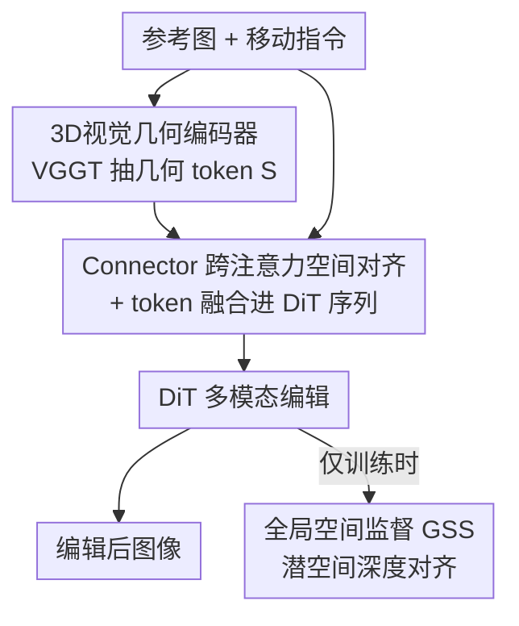

# SpatialDiff: 3D-Aware Object Movement via Implicit Spatial Modeling

**会议**: CVPR 2026  
**论文**: [CVF Open Access](https://openaccess.thecvf.com/content/CVPR2026/html/Liu_SpatialDiff_3D-Aware_Object_Movement_via_Implicit_Spatial_Modeling_CVPR_2026_paper.html)  
**代码**: 未公开  
**领域**: 图像生成 / 扩散模型 / 指令图像编辑  
**关键词**: 指令图像编辑, 物体移动, 隐式3D先验, 扩散Transformer, 潜空间深度监督

## 一句话总结
SpatialDiff 在不做显式 3D 重建的前提下，用一个 3D 几何编码器把单图的隐式空间先验注入扩散 Transformer，并辅以潜空间深度监督，从而让指令驱动的图像编辑能在带遮挡、跨深度层的复杂场景里把物体"挪到对的位置"。

## 研究背景与动机

**领域现状**：指令驱动的图像编辑（InstructPix2Pix、Flux-Kontext、Qwen-Image-Edit 等）已经能按一句自然语言对图像做风格迁移、物体增删、细粒度修改，大多基于扩散/流匹配模型，并用 MLLM 联合编码图像和指令。

**现有痛点**：当指令要求把某个物体"移动"到场景里另一处（如"把苹果挪到香蕉和西瓜中间"）时，纯 2D 方法常常失败——要么物体被挪歪、形状扭曲，要么原位置残留"鬼影"，要么破坏了未编辑区域。根因是这些模型只学了 2D 平面先验，缺乏深度、空间布局这类 3D 知识，无法保证移动在 3D 空间里是自洽的。

**核心矛盾**：2D 扩散编辑灵活高效但没有空间理解；显式 3D 方法（Diffusion Handles、Diff3DEdit、LACONIC 等）能做几何推理，但单图显式 3D 重建本身是病态问题——视角未知、深度有歧义、遮挡、几何残缺、缺多视监督，重建质量差又拖累后续编辑，遇到多物体复杂场景尤其脆弱。两条路各有死穴。

**本文目标**：把 3D 空间先验的好处带进 2D 扩散编辑框架，但要绕开"显式重建"这一步，让扩散 Transformer（DiT）能理解并控制物体的空间定位关系。

**切入角度**：作者的关键观察是——3D 先验不必以"重建出深度/点云"的显式形式存在；可以让模型在内部 token 表示里**隐式地**持有几何信息，推理时根本不需要任何 3D 重建。

**核心 idea**：用一个现成的 3D 几何基础模型（VGGT）抽取单图的隐式几何特征，经一个对齐模块塞进 DiT 的潜空间一起参与编辑，再用目标图深度在潜空间做一道"软约束"监督，逼模型学会随编辑动态更新空间结构。

## 方法详解

### 整体框架
SpatialDiff 以 Flux-Kontext 这样的流匹配 DiT 为编辑底座，输入是「一张参考图 + 一句移动指令」，输出是「物体被挪到正确空间位置的编辑图」。它在底座之外接了两件东西：一条**隐式 3D 空间建模（ISM）**通路，把参考图过一遍 3D 几何编码器拿到几何 token，再用 Connector 对齐进 DiT 潜空间，和图像潜变量、指令 token 拼成一条统一序列交给 DiT 做多模态编辑；一道**全局空间监督（GSS）**，只在训练时用目标图的深度图在 VAE 潜空间约束 DiT 处理后的空间 token，让它学会"物体挪走后原处别留痕、整体语义保持一致"。推理时只跑前者，GSS 不参与，所以全程无需任何显式 3D 重建。

### 关键设计

**1. 3D 视觉几何编码器（3D-VGE）：用现成 3D 基础模型给扩散主干"装上"空间感**

针对"模型缺 3D 空间理解"这个根因，作者不另训几何网络，而是直接借 VGGT——一个能从单图同时推出相机参数、点图、深度图、3D point track 的 3D 基础模型——的 Transformer 主干。关键做法是**只取主干特征、丢掉所有任务预测头**：$S = \mathrm{3D\text{-}VGE}(x_0),\ S \in \mathbb{R}^{l' \times d'}$，得到的是一组隐式几何先验 token，而不是显式的深度/法线输出。这样模型"享用"了 3D 知识，却不必真的把场景重建出来，从源头规避了单图显式重建的病态性。代价是这些几何 token 的特征空间和 DiT 潜空间不一致，需要后续对齐。

**2. Connector 跨注意力对齐 + token 融合：把几何先验"翻译"进 DiT 能用的语言**

3D-VGE 的特征维度/语义和 DiT 潜空间对不上，直接拼接没用。Connector 用一组可学习 query token $Q_l \in \mathbb{R}^{l \times d}$（$l$ 取 DiT 序列长度），通过交叉注意力从几何特征 $S$ 里**有选择地**抽取并对齐空间信息：$\hat{Q}_l = \mathrm{Softmax}\!\left(\frac{QK^\top}{\sqrt{d}}\right)V$，其中 $Q = Q_l W_Q^\top,\ K = S W_K^\top,\ V = S W_V^\top$，三个投影矩阵把不同维度对齐。对齐后的空间 token 再和图像潜变量 $x$、指令 token $I$ 拼成统一序列 $C = [x, \hat{Q}_l, I]$ 喂给 DiT 的多模态层。这样 DiT 在一条序列里同时看到局部外观、空间线索和指令，靠上下文学习把三者揉在一起，隐式捕捉物体深度、相对位置和物体间空间关系——这正是纯 2D 方法做不到的。

**3. 全局空间监督（GSS）：用潜空间深度软约束，逼模型动态更新空间结构而非死记原位**

只有 ISM 还不够：作者发现即便物体被成功挪走，原位常残留痕迹、或整体语义被破坏（论文 Model B）。原因是对齐后的几何特征主要强化了"静态空间记忆"（物体原本在哪），却没驱动"动态空间更新"（编辑后该长什么样）。GSS 用目标图深度 $d_{\text{tgt}} = \mathrm{DepthAnything}(x_{\text{tgt}})$ 当辅助监督：把 DiT 处理后的空间 token $\hat{s}$ 经一个可学习的空间解码头 $\bar{\mathcal{D}}$ 映到 VAE 潜空间，与目标深度的 VAE 编码做 MSE 对齐——$\mathcal{L}_{\text{GSS}} = \lVert \bar{\mathcal{D}}(\hat{s}) - \mathcal{E}(d_{\text{tgt}}) \rVert_2^2$。作者特意对比了两种监督：**显式深度监督（EDS）**在像素空间硬对齐，约束太强会误伤未编辑区域（如把沙发上不该动的枕头也抹掉）；**潜空间深度监督（LDS）**只在 VAE 潜空间约束，强调高层空间/语义关系而非低层像素细节，训练信号更平滑鲁棒，最终采用 LDS。注意深度只在训练时用作"软"信号，推理时完全不需要，保住了"隐式"这一核心卖点。

### 损失函数 / 训练策略
采用两阶段训练。**第一阶段**只优化 Connector，让几何特征先对齐进 DiT 潜空间，目标是标准流匹配损失 $\mathcal{L}_{Align} = \mathbb{E}\,\lVert v - v_\theta(x_t, t, C)\rVert_2^2$（速度目标 $v = \epsilon - x$）。**第二阶段**联合优化 DiT 主干、Connector 和空间解码头，在流匹配损失上叠加 GSS：$\mathcal{L} = \mathbb{E}\,\lVert v - v_\theta(x_t, t, C)\rVert_2^2 + \lambda \cdot \mathcal{L}_{\text{GSS}}$，权重 $\lambda = 0.01$。底座为 Flux-Kontext，Connector 用 8 层交叉注意力、query 长度 1024，LoRA rank 64，512×512 分辨率，8 卡 AdamW、学习率 1e-4、每卡 batch 4，训 3k 步。

## 实验关键数据

### 主实验
训练数据由 OBJect-3DIT 移动数据集改造而来：取其源图/目标图，用 Qwen3-VL-32B-Instruct 生成"源→目标"的编辑指令，构成 20k 三元组（参考图, 指令, 目标图），不依赖任何 3D 资产坐标。评测自建复杂场景基准 **SpatialBench**（100 张含前/中/背景物体的图，外加 50 张 OBJect-3DIT 测试图）。指标沿用 VIEScore：SC（语义一致性，看是否执行了指令）、PQ（感知质量，看编辑物体/未编辑区/整体真实度）、O（综合分，$O = (\mathrm{SC} \times \mathrm{PQ})^{1/2}$），分别由 GPT-5 和 Qwen3-VL-32B 打分，区间 0–1。

| 方法 | GPT-SC↑ | GPT-PQ↑ | GPT-O↑ | Qwen-O↑ |
|------|---------|---------|--------|---------|
| Flux-Kontext | 0.292 | 0.848 | 0.498 | 0.447 |
| OmniGen2 | 0.301 | 0.661 | 0.446 | 0.458 |
| Step1X-Edit | 0.484 | 0.785 | 0.616 | 0.583 |
| BAGEL | 0.368 | 0.709 | 0.511 | 0.500 |
| Qwen-Image-Edit | 0.666 | 0.882 | 0.766 | 0.717 |
| **SpatialDiff（本文）** | **0.803** | **0.886** | **0.843** | **0.807** |

SpatialDiff 在 SC/PQ/O 上全面领先。值得注意的是 Flux-Kontext 的 PQ 虚高（0.848）只是因为它几乎没改图，SC 极低（0.292）暴露了编辑根本没成功；Qwen-Image-Edit 靠强预训练拿到高画质，但指令跟随（GPT-SC 0.666）仍明显落后于本文。GPT 和 Qwen 两套打分的相对排名高度一致，佐证了结论可靠性。

### 消融实验
逐组件加上去（FT=对 DiT 注意力模块做 LoRA 微调；ISM=注入并对齐 3D token；EDS=像素空间深度监督；LDS=潜空间深度监督）：

| 配置 | FT | ISM | EDS | LDS | GPT-SC↑ | GPT-PQ↑ | GPT-O↑ |
|------|----|----|----|----|---------|---------|--------|
| Baseline | | | | | 0.236 | 0.831 | 0.443 |
| Model A | ✓ | | | | 0.398 | 0.795 | 0.563 |
| Model B | ✓ | ✓ | | | 0.518 | 0.743 | 0.620 |
| Model C | ✓ | ✓ | ✓ | | 0.566 | 0.801 | 0.673 |
| **SpatialDiff** | ✓ | ✓ | | ✓ | **0.804** | **0.871** | **0.837** |

### 关键发现
- 单纯 LoRA 微调（Model A）只把 SC 从 0.236 提到 0.398，PQ 反而从 0.831 掉到 0.795——微调能让模型对空间指令更敏感，却引入了不自然扭曲（如"鹦鹉悬在半空"），印证了指令服从与画质之间的 trade-off。
- 注入隐式 3D（Model B）把 GPT-SC 再推到 0.518、O 到 0.620，证明 3D-aware 特征确实强化了空间推理和物体定位，是涨点主力。
- 监督方式是 PQ 的胜负手：EDS（Model C）把 O 提到 0.673 但会误伤未编辑区；换成 LDS 后 GPT-PQ 一举回到 0.871、GPT-O 冲到 0.837，说明潜空间软约束能在保住全局一致性的同时不牺牲画质。
- 35 人、4200 票的用户研究（H-SC/H-PQ/H-O，1–5 分）结论与自动评测一致，本文三项人评均最高。

## 亮点与洞察
- **"隐式 3D"这条路本身很巧**：把 3D 先验从"重建出来再用"改成"以 token 形式被模型内化"，一举绕过单图显式重建的病态性，推理时零 3D 开销——这是全文最 aha 的点，也直接决定了它能扛复杂多物体场景。
- **复用 3D 基础模型只取主干、丢预测头**：这招很可迁移——任何想给 2D 模型补几何感的任务，都可以把 VGGT/DUSt3R 这类模型当"几何特征提取器"用，而不必跑它的完整重建管线。
- **EDS vs LDS 的对照很有教益**：同样是深度监督，放像素空间就过约束、放潜空间就刚好，说明"监督施加在哪个空间"和"监督什么"同等重要，可直接借鉴到其他需要辅助几何/结构监督的生成任务。

## 局限与展望
- 训练数据来自 OBJect-3DIT 改造的合成移动对，指令由 VLM 自动生成，真实世界复杂编辑（光影重投、跨材质遮挡）下的泛化性尚待验证。
- 几何质量被 VGGT 单图推断能力封顶：若 3D-VGE 对某场景的隐式几何估计本身就偏，下游编辑也会跟着错，论文未深入分析这种失败模式。
- 评测高度依赖 GPT-5/Qwen 这类 MLLM 打分，虽有用户研究兜底，但 SC/PQ 的自动度量与人类对"空间正确性"的细粒度判断仍可能有系统偏差。⚠️ 部分指标定义以原文 VIEScore 为准。
- 当前只处理"移动"这一类空间编辑，是否能扩展到旋转、缩放、复合 3D 变换并保持同样的隐式建模优势，是自然的下一步。

## 相关工作与启发
- **vs 纯 2D 指令编辑（Flux-Kontext / Qwen-Image-Edit）**：它们靠 MLLM 联合编码图文、画质很高，但没有 3D 知识，移动指令下空间不自洽；本文在同款 DiT 底座上加 ISM+GSS，用隐式几何补齐空间推理，SC 大幅领先。
- **vs 显式 3D-aware 编辑（Diffusion Handles / Diff3DEdit / LACONIC）**：它们靠显式重建/新视角合成/布局-相机位姿做几何控制，单图、多物体、复杂遮挡下重建易崩；本文不重建、只在 token 里隐式持有几何，鲁棒性和可扩展性更好，且推理无 3D 开销。

## 评分
- 新颖性: ⭐⭐⭐⭐⭐ "隐式 3D 先验 + 潜空间深度监督"把 2D 编辑和 3D 推理优雅地缝合，思路确有突破。
- 实验充分度: ⭐⭐⭐⭐ 自建基准 + 双 MLLM 打分 + 用户研究 + 逐组件消融较完整，但训练数据偏合成、真实场景评测有限。
- 写作质量: ⭐⭐⭐⭐⭐ 动机推导清晰，ISM/GSS 两条主线和 EDS/LDS 对照讲得很透。
- 价值: ⭐⭐⭐⭐ 为"给 2D 生成模型补几何感"提供了一条低成本可复用的范式，对空间可控编辑有实际意义。

<!-- RELATED:START -->

## 相关论文

- [\[CVPR 2026\] SPREAD: Spatial-Physical REasoning via geometry Aware Diffusion](spread_spatial-physical_reasoning_via_geometry_aware_diffusion.md)
- [\[CVPR 2025\] ObjectMover: Generative Object Movement with Video Prior](../../CVPR2025/image_generation/objectmover_generative_object_movement_with_video_prior.md)
- [\[CVPR 2026\] Enhancing Spatial Understanding in Image Generation via Reward Modeling](enhancing_spatial_understanding_in_image_generation_via_reward_modeling.md)
- [\[CVPR 2026\] SpatialReward: Verifiable Spatial Reward Modeling for Fine-Grained Spatial Consistency in Text-to-Image Generation](spatialreward_verifiable_spatial_reward_modeling_for_fine-grained_spatial_consis.md)
- [\[ICML 2026\] Visual Implicit Autoregressive Modeling](../../ICML2026/image_generation/visual_implicit_autoregressive_modeling.md)

<!-- RELATED:END -->
