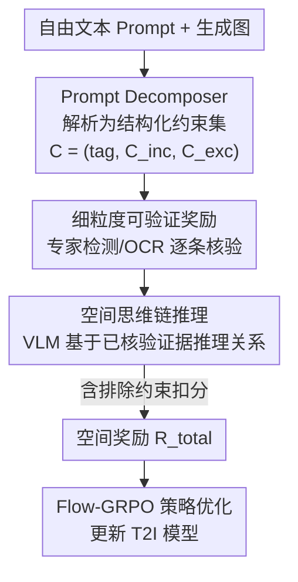

# SpatialReward: Verifiable Spatial Reward Modeling for Fine-Grained Spatial Consistency in Text-to-Image Generation

**会议**: CVPR 2026  
**论文**: [CVF Open Access](https://openaccess.thecvf.com/content/CVPR2026/html/Zhou_SpatialReward_Verifiable_Spatial_Reward_Modeling_for_Fine-Grained_Spatial_Consistency_in_CVPR_2026_paper.html)  
**代码**: https://github.com/LivingFutureLab/SpatialReward  
**领域**: 扩散模型 / 文生图 / 对齐RLHF  
**关键词**: 文生图、空间一致性、可验证奖励、强化学习、思维链推理

## 一句话总结
SpatialReward 是一个面向文生图（T2I）的"可验证"空间奖励模型：它先把自由文本拆成结构化约束，再用目标检测/OCR 等专家模型对生成图做客观核验，最后让视觉语言模型基于这些已核验的事实做思维链推理给出空间奖励分；接入 Flow-GRPO 强化训练后，SD3.5-M 和 FLUX 在空间一致性上大幅提升（SpatRelBench overall 从 0.23→0.42、0.28→0.46）。

## 研究背景与动机
**领域现状**：近两年文生图模型（Stable Diffusion、FLUX 等）越来越多地用强化学习（尤其是 GRPO 系方法）来对齐人类偏好，而其中的核心部件是预训练奖励模型（RM）——它给生成图打分，作为策略梯度优化的反馈信号。主流 RM 如 PickScore、ImageReward、HPSv2 都是在 CLIP 上微调去拟合人类偏好，更新的 VisionReward、UnifiedReward 则用 VLM 做整体评分。

**现有痛点**：这些 RM 几乎都只盯着"全局语义对不对、画面好不好看"，对**物体之间的细粒度空间关系**关注很少。结果就是生成图整体看着合理，但物体位置常常错——"手机在椅子右边"画成左边、"标签写 SIT"写成别的词，这种空间错误既降低真实感，又违背 prompt 语义。

**核心矛盾**：作者把现有评估器的失败归为两类。其一是**prompt 端僵硬**：GenEval、T2I-CompBench 这类结构化方法依赖固定模板和预定义检测器，能处理"a photo of a purple backpack"但无法泛化到开放式的复杂组合 prompt。其二是**视觉端疏漏**：CLIPScore、VLM 这类整体评分器能吃任意 prompt、抓全局语义，却没有细粒度空间核验能力，经常给"看着像、位置错"的图打高分。

**本文目标**：作者提出一个假设——T2I 空间生成的进一步提升，更多依赖于"可验证、有空间感知"的奖励模型，而不是继续打磨 RL 训练策略本身。于是目标分解为：(1) 让奖励模型能解析任意自由文本里的空间约束；(2) 用客观可核验的信号替代 VLM 的主观判断；(3) 对规则难以判断的复杂关系仍能稳健推理。

**切入角度**：作者借鉴了逻辑推理领域"可验证奖励（verifiable reward）"的成功经验——在数学/代码任务里，明确可检验的奖励能显著提升复杂推理。他们把这套思路搬到视觉空间评估：用准确率远高于 VLM 判断力的开放域检测器和 OCR 模型产出"客观事实"，再让 VLM 在这些事实之上做推理，而不是让 VLM 凭空判断。

**核心 idea**：用"结构化约束解析 + 专家检测核验 + 思维链推理"三段流水线，把空间奖励从"VLM 拍脑袋打分"变成"基于可核验证据的推理打分"。

## 方法详解

### 整体框架
SpatialReward 是一个三阶段流水线，输入是 (prompt, 生成图) 对，输出是一个空间一致性奖励分 $\mathcal{R}_{\mathrm{total}}$，用来喂给 Flow-GRPO 做策略优化。第一阶段 **Prompt Decomposer** 把自由文本解析成结构化约束集（实体、属性、空间关系、文本内容、要包含/排除什么）；第二阶段 **细粒度可验证奖励** 调用目标检测、颜色分类、朝向、深度、OCR 等专家模型，逐条核验每个约束在生成图上是否满足，产出客观的子奖励；第三阶段 **空间思维链推理** 把已核验的 bounding box 和属性分作为 grounding 喂给 Qwen2.5-VL，让它一步步推理复杂的物体间关系，并对"违反排除约束"的情况扣分，最终聚合成总奖励。

这套奖励再插进标准 Flow-GRPO 框架：T2I 模型在马尔可夫决策过程里采样去噪轨迹，SpatialReward 给每个样本打分，组相对策略优化（GRPO）据此更新策略。

### 关键设计

**1. Prompt Decomposer：把任意自由文本归一化成可检测的结构化约束**

痛点是开放式 prompt 经常掺杂无关上下文、把不同物体的描述混在一起，直接喂检测器会引入歧义、拉低检测准确率。作者用一个解码器 $\mathcal{D}$ 把自由文本 $P$ 转成约束集 $\mathcal{C} = \mathcal{D}(P) = (\text{tag}, \mathcal{C}_{\text{inc}}, \mathcal{C}_{\text{exc}})$，其中 tag 是主评估类别（计数 / 朝向 / 空间关系等），$\mathcal{C}_{\text{inc}}$ 是包含约束（图里应该有什么、什么属性、什么相对位置、什么文字），$\mathcal{C}_{\text{exc}}$ 是排除约束（不该出现什么）。每条原子约束精确指定物体类别、数量、属性、空间关系或文字内容。

实现上，作者构造了约 10 万条多物体元数据（显式标注每个主体的属性、数量、空间关系、关联文本），用 GPT-4o 从这些元数据反向生成多样的自然语言 prompt，得到 (prompt, metadata) 训练对，再微调一个 Qwen2.5-VL-7B 来从无约束文本里抽取核心元属性。这一步的价值在于：把"格式各异的人话"统一成"检测器能照着核验的字段"，让后续专家检测不受 prompt 格式影响，是整条流水线能泛化到复杂 prompt 的前提。

**2. 细粒度可验证奖励：用专家检测器产出客观、可核验的子奖励，替代 VLM 主观判断**

痛点是即使最强的 VLM，在多物体组合、属性绑定、计数、空间动作这些任务上也不稳定，单靠它拿不到可验证的客观奖励。而现代开放域检测器和 OCR 模型在这些事实判断上的准确率远超 VLM。所以作者用 Decomposer 抽出的约束去驱动专家检测，对每条包含约束 $c \in \mathcal{C}_{\text{inc}}$ 算一组子奖励。

物体侧：检测器 $F_{\text{det}}$ 在生成图上给出候选框 $D_c = \{(B_j, s_j)\}_{j=1}^k$，用置信阈值 $\tau_{\text{det}}$ 过滤得到核验集 $\mathcal{B}_c$，其基数 $\hat{N}_c = |\mathcal{B}_c|$ 给出存在奖励 $\mathcal{R}_{\text{presence}}(c) = \mathbb{I}(\hat{N}_c > 0)$ 和计数奖励 $\mathcal{R}_{\text{count}}(c) = \exp(-|\hat{N}_c - N_c^*|)$，$N_c^*$ 是目标数量。颜色奖励 $\mathcal{R}_{\text{color}}(c) = \mathrm{sim}_{\mathrm{color}}(C_{\text{det}}, C^*)$ 用 CLIP 分类器对裁剪区域比对目标色；朝向奖励 $\mathcal{R}_{\text{ori}}(c) = \mathbb{I}(|\theta_{\text{det}} - \theta^*| \leq \delta_\theta)$ 检查角度是否在容差内；深度奖励 $\mathcal{R}_{\text{depth}}(c) = \exp(-|d_{\mathrm{rank}} - d_{\mathrm{rank}}^*|)$ 用单目深度估计核验相对深度排序。

文本侧针对"在某物体上渲染指定文字"的需求，要同时核验内容对不对和位置对不对。全局 OCR 模型 $F_{\text{ocr}}$ 抽出文字-框对集合 $\mathcal{T}_{\text{rec}}$，文本奖励取与目标串 $T^*$ 最匹配且落在目标框 $B_{\text{obj}}$ 内的那一项：

$$\mathcal{R}_{\text{text}}(T^*, B_{\text{obj}}) = \max_{(T'_j, B'_j) \in \mathcal{T}_{\text{rec}}} \left[ \text{sim}(T^*, T'_j) \cdot \text{IoA}(B'_j, B_{\text{obj}}) \right]$$

其中 $\text{IoA}(B_{\text{text}}, B_{\text{obj}}) = \frac{\text{Area}(B_{\text{text}} \cap B_{\text{obj}})}{\text{Area}(B_{\text{text}})}$ 衡量文字框被目标物体框包含的程度。只有文字内容对、且确实出现在正确物体上时才给高分。这一阶段之所以有效，是因为它把"模糊主观判断"换成了"检测器的客观读数"，大幅降低幻觉——消融里去掉它掉点最多就是证据。

**3. 空间思维链推理：让 VLM 在已核验证据上推理复杂关系，并用排除约束防奖励作弊**

痛点是细粒度子奖励能核验单个属性，但"A 在 B 上方还是里面""多物体的复杂布局"这类关系需要更高层推理，纯几何规则区分不了"on"和"above"这种语义差别。作者用 Qwen2.5-VL 作 CoT 推理骨干，但关键是给它喂"已核验的 grounding"而不是让它凭空判断：CoT prompt $P_{\text{CoT}}$ 包含目标关系 $r$、两实体的检测框 $B_A, B_B$、以及前两阶段算出的属性奖励集合 $\{\mathcal{R}_{\mathrm{pres}}, \ldots, \mathcal{R}_{\mathrm{ori}}, \mathcal{R}_{\mathrm{depth}}, \mathcal{R}_{\mathrm{text}}\}$。VLM 被引导逐步推理：先按框解读每个属性奖励，再做几何分析，最后判断关系 $r$ 是否成立，输出结构化的推理轨迹+最终分，由 $\mathcal{P}_{\mathrm{score}}$ 解析出空间一致性奖励 $\mathcal{R}_{\mathrm{spatial}}$。

为了防止过拟合正样本、避免奖励作弊，作者引入对"满足了排除约束"的显式惩罚，把总奖励写成包含项减排除项：

$$\mathcal{R}_{\mathrm{total}} = \sum_{c \in \mathcal{C}_{\mathrm{inc}}} \mathcal{R}_{\mathrm{spatial}}^+(c) - \sum_{c \in \mathcal{C}_{\mathrm{exc}}} \mathcal{R}_{\mathrm{spatial}}^-(c)$$

这样既奖励满足要求的关系，又惩罚出现了不该出现的东西。论文里 Fig. 5 的例子很直观：纯几何匹配看到"frog 框 ⊂ sleeping bag 框"就判成"inside"给 0.25 分，而 CoT 结合 bbox+朝向+全图语义推理出"frog 触在睡袋顶面 → above"给 1.0 分，证明在语义微妙的关系上 CoT 比规则更可靠。

## 实验关键数据

### 主实验
在 GenEval（80 类对象）和 SpatRelBench（1k 类对象）上，把 SpatialReward 接入 Flow-GRPO 训练 SD3.5-M 和 FLUX，与一众奖励模型对比（所有 RM 用同一 10 万条数据、同超参训练以保证公平）。

| 基座 + 奖励 | GenEval Overall | SpatRelBench Overall | SpatRel-Pos.Text | SpatRel-3DRel |
|------|------|------|------|------|
| SD3.5-M（基线） | 0.67 | 0.23 | 0.40 | 0.36 |
| + ImageReward | 0.80 | 0.30 | 0.42 | 0.42 |
| + UnifiedReward | 0.89 | 0.33 | 0.46 | 0.40 |
| **+ SpatialReward** | **0.94** | **0.42** | **0.51** | **0.55** |
| 较基线提升 | +0.28 | +0.19 | +0.11 | +0.19 |
| FLUX1-dev（基线） | 0.76 | 0.28 | 0.49 | 0.38 |
| **+ SpatialReward** | **0.97** | **0.46** | **0.63** | **0.45** |
| 较基线提升 | +0.21 | +0.18 | +0.14 | +0.17 |

两个基座、两个 benchmark 上 SpatialReward 都是 overall 最优。GenEval 上 SD3.5-M 的 Positions 指标从 0.28 飙到 0.97（+0.70）尤为突出，说明可验证空间奖励确实把位置关系学进去了。在 SpatRelBench 更难的维度（朝向、深度、文字位置）上提升也最显著——这正是单维度评估协议藏不住的差距。

人类对齐实验（500 对 prompt-图，标注空间关系对/错）进一步验证：

| 奖励模型 | Spearman ρ | Pearson r | Accuracy(τ=0.8) |
|------|------|------|------|
| CLIPScore | 0.42 | 0.40 | 0.68 |
| UnifiedReward | 0.51 | 0.49 | 0.72 |
| VisionReward | 0.55 | 0.53 | 0.74 |
| **SpatialReward** | **0.63** | **0.61** | **0.79** |

SpatialReward 与人类空间一致性判断的相关性和分类准确率都最高，说明显式建模细粒度空间关系产出的评分更贴近人感知。

### 消融实验
逐一移除三个核心模块（在 GenEval / SpatRelBench / T2I-CompBench 上测准确率，后者取 2D+3D 空间任务平均）：

| 配置 | GenEval | SpatRel | T2IComp | 说明 |
|------|---------|---------|---------|------|
| Full SpatialReward | 95.2 | 37.1 | 50.1 | 完整模型 |
| – 排除约束 | 90.5 | 25.9 | 45.9 | 去掉负样本惩罚，SpatRel 掉 11.2 |
| – 专家检测 | 70.3 | 21.6 | 39.2 | 掉点最多，核验是地基 |
| – CoT 推理 | 94.2 | 27.9 | 47.5 | 量降中等但复杂场景靠它 |

还测了通用质量指标（Wise/DPG/Aesthetic/PickScore）：SpatialReward 在多数指标上持平或超过基线，仅 Aesthetic 略降（SD3.5-M 5.39→5.23），说明空间奖励优化没有牺牲整体观感和语义对齐。

### 关键发现
- **专家检测是地基**：去掉它三个 benchmark 全线大跌（GenEval 95.2→70.3，SpatRel 37.1→21.6），印证了核心主张——空间推理必须建立在"可核验的客观证据"上，光靠通用 VLM 撑不住。
- **排除约束防作弊**：去掉它 SpatRel 从 37.1 掉到 25.9，因为没有负样本惩罚就容易奖励作弊、对含干扰物的 prompt 退化。
- **CoT 的价值在质不在量**：量化下降最小（GenEval 仅 95.2→94.2），但定性案例显示它在"above vs inside""朝向是否对准目标"这类规则启发式搞不定的场景里是决定性的。
- **位置类指标提升最猛**：GenEval Positions +0.70、SpatRelBench 各空间维度普遍 +0.15~+0.29，正好命中现有 RM 最弱的细粒度空间关系。

## 亮点与洞察
- **把"可验证奖励"从逻辑推理迁到视觉空间评估**：核心洞察是"检测器/OCR 的事实判断准确率远超 VLM 的主观判断"，于是让 VLM 只做它擅长的推理、把事实核验外包给专家模型。这个分工思路可复用到任何"需要客观打分但又有复杂语义"的奖励建模场景。
- **CoT 输入端注入已核验 grounding**：不是让 VLM 看图凭空推理，而是把 bbox+属性分作为既成事实喂进去，CoT 只负责"组合这些事实推出关系"。这有效压制了 VLM 幻觉，是"VLM-as-judge"类工作值得借鉴的稳健化技巧。
- **排除约束做负向惩罚防奖励作弊**：$\mathcal{R}_{\mathrm{total}}$ 里减去排除项，这是 RL 奖励工程里对抗 reward hacking 的实用设计，对含干扰物的真实 prompt 尤其有用。
- **配套 benchmark 补盲区**：SpatRelBench 把评估扩到朝向、3D 深度、文字位置/计数，揭示了单维度评估协议下被掩盖的性能差距，是奖励模型之外的独立贡献。

## 局限与展望
- **强依赖专家模型的天花板**：整条流水线的可靠性取决于检测器、OCR、深度估计、朝向模型的准确率。这些专家模型本身出错时（如开放词汇检测漏检、OCR 误读），错误会直接传进奖励信号，论文未充分讨论检测失败时的鲁棒性。
- **流水线重、推理开销大**：每个生成样本要跑 Decomposer（7B VLM）+ 多个检测/OCR/深度模型 + CoT 推理（VLM），相比 CLIPScore 这种单次前向的 RM，奖励计算成本高很多，对 RL 训练吞吐是负担（论文未给奖励计算耗时）。
- **Aesthetic 轻微下降**：SD3.5-M 上 Aesthetic 从 5.39 掉到 5.23，提示一味优化空间正确性可能与观感存在轻微 trade-off，长程优化是否会放大这一点未知。
- **benchmark 规模有限**：SpatRelBench 当前仅约 2000 条标注样本、人类对齐实验 500 对，覆盖面和统计置信度仍有扩展空间。
- **可改进方向**：可探索把多个专家模型蒸馏进单个轻量核验模型以降本；或对检测置信度做加权、给奖励引入不确定性估计，缓解专家模型出错的传导。

## 相关工作与启发
- **vs 结构化方法（GenEval / T2I-CompBench）**：它们靠固定模板和预定义检测器，在窄模板内精度高但无法泛化到自由文本；SpatialReward 用 Prompt Decomposer 先把任意文本归一化成结构化约束，再做检测，既保留可验证性又能吃开放式 prompt。
- **vs 整体评分器（CLIPScore / ImageReward / PickScore / HPSv2）**：它们在 CLIP 上拟合人类偏好，能抓全局语义但对细粒度位置错误视而不见；SpatialReward 显式核验每条空间约束，在 Positions 等指标上提升尤其大。
- **vs VLM 类奖励（VisionReward / UnifiedReward）**：它们直接用 VLM 整体打分，灵活但常忽略空间细节、易给"看着对位置错"的图高分；SpatialReward 不让 VLM 凭空判断，而是先用专家检测产出客观证据、再让 VLM 在证据上做 CoT 推理，人类对齐准确率从 UnifiedReward 的 0.72 提到 0.79。
- **启发**：在 GRPO 系 T2I RL 里，奖励模型的"可验证性"可能比 RL 算法本身更关键——这与 LLM 推理领域"verifiable reward 驱动复杂推理"的结论一脉相承，提示把客观核验信号引入生成式模型的对齐是一条通用路径。

## 评分
- 新颖性: ⭐⭐⭐⭐ 把逻辑推理的"可验证奖励"思想成体系迁移到 T2I 空间评估，专家检测+CoT 的分工组合有新意，但各组件本身多为现有技术拼装。
- 实验充分度: ⭐⭐⭐⭐ 两基座、三 benchmark、人类对齐、通用质量、完整消融都覆盖，较扎实；但缺奖励计算开销分析、专家模型失败鲁棒性研究。
- 写作质量: ⭐⭐⭐⭐ 动机清晰、公式完整、图示直观，三阶段叙述顺畅；部分核验细节（如各子奖励如何聚合进 CoT）可更明确。
- 价值: ⭐⭐⭐⭐ 给 T2I 空间一致性这一真实痛点提供了可落地的奖励方案，外加 SpatRelBench 基准，对生成模型对齐社区有实用价值。

<!-- RELATED:START -->

## 相关论文

- [\[CVPR 2026\] Enhancing Spatial Understanding in Image Generation via Reward Modeling](enhancing_spatial_understanding_in_image_generation_via_reward_modeling.md)
- [\[CVPR 2026\] PromptEnhancer: Taming Your Rewriter for Text-to-Image Generation via Fine-Grained Reward](promptenhancer_taming_your_rewriter_for_text-to-image_generation_via_fine-graine.md)
- [\[CVPR 2026\] SpatialDiff: 3D-Aware Object Movement via Implicit Spatial Modeling](spatialdiff_3d-aware_object_movement_via_implicit_spatial_modeling.md)
- [\[CVPR 2026\] Spatial-SSRL: Enhancing Spatial Understanding via Self-Supervised Reinforcement Learning](spatial-ssrl_enhancing_spatial_understanding_via_self-supervised_reinforcement_l.md)
- [\[CVPR 2026\] Rethinking Glyph Spatial Information in Font Generation](rethinking_glyph_spatial_information_in_font_generation.md)

<!-- RELATED:END -->
