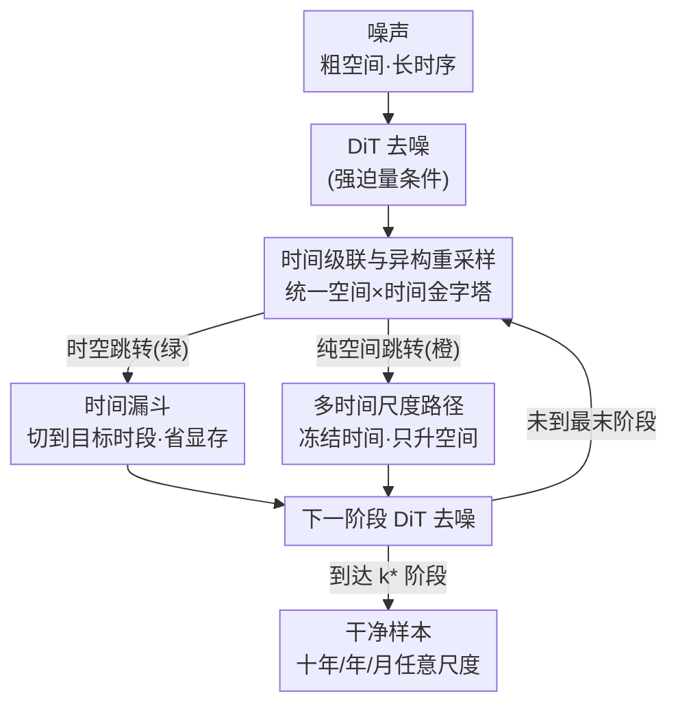

# Spatiotemporal Pyramid Flow Matching for Climate Emulation

**会议**: CVPR 2026  
**论文**: [CVF Open Access](https://openaccess.thecvf.com/content/CVPR2026/html/Irvin_Spatiotemporal_Pyramid_Flow_Matching_for_Climate_Emulation_CVPR_2026_paper.html)  
**代码**: https://github.com/stanfordmlgroup/spf  
**领域**: 扩散/流匹配生成模型 · 气候模拟  
**关键词**: 流匹配, 时空金字塔, 气候模拟, 概率代理模型, 多时间尺度

## 一句话总结
把"由粗到细"的金字塔流匹配同时拓展到空间和时间两个维度，提出 Spatiotemporal Pyramid Flow（SPF），用一个 DiT 网络在像素空间并行采样十年/逐年/逐月的气候场，既比自回归气候代理模型快 15–28 倍，又在 ClimateBench 上取得更好的 CRPS/RMSE。

## 研究背景与动机
**领域现状**：地球系统模型（ESM）是预测气候演化的"金标准"，但跑一遍几十年到上百年的模拟、再加上量化不确定性所需的集合（ensemble），算力开销大到连超算都吃不消。于是大家转向用机器学习训练**代理模型（emulator）**，希望又快又准地复现 ESM 的输出。目前主流做法是借鉴天气预报，做**天气尺度（6 小时一步）的自回归**，然后一步步滚动到气候尺度（几十年）。

**现有痛点**：天气尺度自回归在气候模拟里有两个硬伤。其一是**误差累积**——每一步的小局部误差在长程滚动中不断放大，导致长期统计量漂移；现有模型即便能滚出十年、气候偏差也不大，却还没能在温室气体/气溶胶驱动下复现真实的气候趋势。其二是**慢**——长程滚动需要海量的串行步骤，用 SOTA 代理模型生成一条 10 年、6 小时分辨率的轨迹要将近 3 小时。而很多下游任务（综合评估模型、行业影响研究）其实只需要**年均或月均**的粗时间尺度场，根本不需要 6 小时分辨率，这种串行滚动是巨大的浪费。

**核心矛盾**：气候模拟天然有"慢分量调制快分量"的层级结构——空间上大尺度通过能量/水汽输运组织小尺度，时间上强迫趋势和年际变率调制快速的天气波动。但自回归框架强行用**细步长滚动**去逼近这种长程依赖，既不匹配数据的物理层级，又把计算浪费在了用不到的高分辨率上。

**本文目标**：（1）做一个在像素空间直接工作、不依赖 VAE 的概率代理模型；（2）能**并行**采样长序列、并能**直接**在任意时间尺度（十年/年/月）出干净样本，而不必先生成最细尺度再平均；（3）把强迫量（温室气体、气溶胶等）作为条件，让模型捕捉外部驱动的慢趋势。

**切入角度**：作者借用了图像/视频生成里的**级联（cascade）金字塔流**思想——先建粗结构再逐级细化，把算力集中在最影响质量的地方。已有的 PixelFlow/PyramidalFlow 只在**空间**维度做金字塔；作者观察到气候数据在**时间**维度也有完全对应的层级（十年→年→月），于是把金字塔从纯空间推广到时空联合。

**核心 idea**：把生成轨迹切成一个**时空金字塔**——粗空间分辨率的长时序状态先建好（编码外部强迫趋势），再逐级条件细化空间，再逐级条件细化时间，让任意未来时刻可以**直接采样**，绕开逐步自回归。

## 方法详解

### 整体框架
SPF 是一类流匹配模型：训练时学习一个速度场 $v_t$，把噪声沿 ODE $\mathrm{d}x_t/\mathrm{d}t = v_t(x_t)$ 输运到目标气候场分布。关键不在流匹配本身，而在于把整条生成轨迹**分段（piecewise）**成 $K$ 个阶段，每个阶段对应金字塔里的一个"空间×时间分辨率"档位。本文用 $K=3$ 段，对应气候学常用的**十年（decadal）→ 年（yearly）→ 月（monthly）** 三个尺度。

整条 pipeline 是：从最粗的低分辨率、长时序噪声出发，每个阶段先用 DiT 去噪，再做一次"阶段跳转"——要么**时空跳转**（同时上采样空间和时间，并在时间上漏斗式聚焦到目标时段），要么**纯空间跳转**（只升空间分辨率、保持时间分辨率不变）；如此交替直到最后一个阶段，输出目标时段、目标时间尺度上的干净样本。每个阶段都用同一时段对齐的强迫量做交叉注意力条件。

### 关键设计

**1. 时间级联与异构重采样：让金字塔同时在空间和时间上由粗到细**

传统空间金字塔流把轨迹按空间分辨率切段，每段只在固定分辨率上去噪、逐级上采样（升 2 倍）。SPF 的第一步突破是把"分辨率"从纯空间扩成"空间高×宽×时间"三元组，并允许**每个阶段、每个维度用不同的重采样因子**。形式上把降/升采样写成 $\mathrm{Down}_k(x)=\mathrm{Downsample}(x;\dot r^h_k,\dot r^w_k,\dot r^t_k)$、$\mathrm{Up}_k(z)=\mathrm{Upsample}(z;r^h_{k+1},r^w_{k+1},r^t_{k+1})$，其中 $\dot r_k=\prod_{i=1}^k r_i$ 是累积因子。第 $k$ 段窗口内的流是

$$x_t = t' \,\mathrm{Down}_k(x_{e_k}) + (1-t')\,\mathrm{Up}_k(\mathrm{Down}_{k+1}(x_{s_k})),$$

两端的条件概率路径让段首/段尾共享同一噪声样本 $n\sim\mathcal N(0,I)$：$\hat x_{e_k}=e_k\mathrm{Down}_k(x_1)+(1-e_k)n$、$\hat x_{s_k}=s_k\mathrm{Up}_k(\mathrm{Down}_{k+1}(x_1))+(1-s_k)n$，再用流匹配目标 $\mathcal L_{\text{PFM}}=\mathbb E\|v_t(\hat x_t)-(\hat x_{e_k}-\hat x_{s_k})\|^2$ 回归速度场。

真正棘手的是**阶段跳转处的分布连续性**：不同阶段分辨率不同，跳转时必须重新缩放+重新加噪才能让两段的端点分布对齐。作者把 Jin et al. 的校正规则推广到任意空间/时间重采样因子：

$$\hat x_{s_k}=\frac{(1-s_k)+s_k\sqrt{n_k}}{\sqrt{n_k}}\,\mathrm{Up}_k(\hat x_{e_{k+1}})+(1-s_k)\sqrt{\tfrac{n_k-1}{n_k}}\,n',$$

其中 $n_k=r^h_k r^w_k r^t_k$。这条公式之所以关键，是它保证了**任意维度、任意重采样因子下**跳转的分布连续，于是金字塔可以贴着 ESM 真实的时间层级走——十年到年是 $\times 10$，年到月是 $\times 12$ 这种**异构**比例（本文设 $r^h_k=r^w_k=2$、$r^t_1=10$、$r^t_2=12$）。而 PixelFlow/PyramidalFlow 是 $r^t_k=1$ 的纯空间特例，根本没法表达这种不规整的时间层级。

**2. 时间漏斗：只生成关心的那一帧，把显存和算力按时间窗口倍数砍掉**

如果一次性在最细时空分辨率上生成整条长序列，显存会爆，而且气候下游往往只需要序列里的一小段。作者的做法是：在每次上采样**之前**先把潜变量在时间维切片，只保留 $T'_k\le T_k$ 个感兴趣的时间索引。之所以能这么"无痛"切，是因为去噪后的潜变量是高斯的——取任意时间子集得到的仍是高斯，其均值/协方差就是原参数的对应子向量/子矩阵，所以前面推的那套缩放-加噪校正**原样成立**、概率路径保持不变。本文直接漏斗到单帧（$T'_k=1$），而时间窗口本身含 $T_k\in\{10,12\}$ 帧，于是每个阶段在显存和 FLOPs 上直接拿到 $10\times$、$12\times$ 的削减。这个设计把"我只想看 2050 年这一年"变成了真正的省钱，而不是先算完十年再挑一年。

**3. 多时间尺度采样：训一次网络，年/月/十年都能直接出干净样本**

气候任务常要不同时间分辨率的输出，但传统金字塔流只允许在**最高分辨率**出干净样本——想要年均就得先生成月、再平均，慢且浪费。SPF 在流匹配目标里加了一项**时间冻结路径**的损失：训练时为每个阶段抽二元指示 $\omega_k\sim\text{Bernoulli}(\varepsilon_k)$，$\omega_k=1$ 表示该阶段做时空细化、$\omega_k=0$ 表示只升空间、时间分辨率冻住，并约束时间细化"一旦开始就对所有更细阶段持续"。$K=3$ 下这恰好给出三条合法路径 $T_0\!\to\!T_0\!\to\!T_0$、$T_0\!\to\!T_1\!\to\!T_1$、$T_0\!\to\!T_1\!\to\!T_2$（即十年/年/月三个落点）。把概率设成 $\omega_1\sim\text{Bernoulli}(2/3)$、$\omega_2\,|\,(\omega_1{=}1)\sim\text{Bernoulli}(1/2)$ 让三条路径等概率覆盖。对应地每阶段的时间缩放因子取 $\tilde r^t_k=r^t_k$（$\omega_k{=}1$）或 $1$（$\omega_k{=}0$），目标变成 $\mathcal L_{\text{MT}}=\mathbb E_{k,t,\omega_k}\|v_t(\hat x_t)-(\hat x^{\omega}_{e_k}-\hat x^{\omega}_{s_k})\|^2$。因为 $\omega_k$ 是即时采样的，**单个网络**就学会了在任意时间尺度路径上去噪。推理时想要年均/十年均，只需把 ODE 解到对应阶段 $k^*$、套用上面的缩放-加噪校正、之后只做空间上采样再去噪，就能**不经过细时间样本**直接拿到粗尺度场。

> 为让同一个网络区分不同阶段，作者沿用 Jin et al. 的**空间尺度嵌入**（正弦编码过 2 层 SiLU MLP），并新增一个**时间尺度嵌入**（同型正弦编码），让模型在相同空间分辨率、不同时间尺度的输入间也能区分。

### 损失函数 / 训练策略
最终训练目标就是上面的多时间尺度流匹配损失 $\mathcal L_{\text{MT}}$，在像素空间（无 VAE）直接回归速度场。骨干用 SD3 的 MM-DiT，空间用正弦位置编码、时间用 1D RoPE；输出 patch 8×8、输入强迫量 patch 16×16（强迫场更平滑、局部依赖更弱）；patchify 后做 sequence packing 把不同空间/时间分辨率的 token 拼到序列维，从而在单张 16GB 的 RTX A4000 上就能训练和推理。条件方式是每层对展平的 patch 序列做标准交叉注意力，且每个阶段都用**同时段对齐的强迫量**做条件。

为支撑规模化，作者还构建了 **ClimateSuite**：迄今最大的 ML-ready 气候数据集，含 10 个 ESM、33,739 个模拟年，并**首次纳入平流层气溶胶注入（SAI）干预实验**（39 个 SAI + 276 个非 SAI 场景），额外加入平流层气溶胶光学厚度（AOD）输入作为 SAI 强迫的代理。

## 实验关键数据

### 主实验
在 ClimateBench 留出场景 SSP2-4.5 上评测（CRPS 衡量概率技巧，RMSE/Bias 衡量均值质量，runtime 是单条 10 年轨迹的采样时间，单位秒）：

| 模型 (200M) | 时间能力 | 年-CRPS↓ | 年-RMSE↓ | 年-Runtime | 月-CRPS↓ | 月-Runtime |
|------|------|------|------|------|------|------|
| Pyramidal Flow（自回归） | 自回归 | 0.327 | 0.671 | 24 | 0.473 | 105 |
| Multi-Monthly Flow（本文） | 并行 | 0.231 | 0.528 | 21 | 0.443 | 21 |
| PixelFlow（纯空间金字塔） | 单尺度 | 0.224 | 0.504 | 7 | – | – |
| **SPF（本文）** | 并行·多尺度 | **0.222** | 0.511 | **6** | 0.453 | **11** |

要点：SPF 在 100M 和 200M 两种规模下都拿到**最低年 CRPS**；月尺度上 100M 的 SPF 同时拿下 CRPS/RMSE/Bias 三项最优。效率上，100M/200M 的 SPF 相对自回归 PyramidalFlow 分别快 **28×** 和 **>15×**（年尺度），月尺度 10 年输出也快 3–6×，把采样时间压到几秒。注意 ClimaX 是在大规模气候数据上预训练的强模型，而 SPF 只在 ClimateBench 训练集上训。

### 消融实验（金字塔结构设计，200M，月尺度）

| 变体 | 阶段序列 | CRPS↓ | RMSE↓ | 说明 |
|------|------|------|------|------|
| DYMMM | 十→年→月→月→月 | 0.474 | 1.087 | 先全做时间跳转、后做空间，5 阶段 |
| DYYMM | 十→年→年→月→月 | 0.463 | 1.085 | 时间空间交替，5 阶段 |
| DYM-Monthly | 十→年→月 | 0.453 | 1.064 | 3 阶段但只支持月样本 |
| **SPF (DYM-Any)** | 十→年→月 | **0.453** | **1.060** | 3 阶段且支持任意尺度 |

另有规模/预训练消融（Table 3）：600M 不预训练在年尺度反而**不如** 200M（CRPS 0.229 vs 0.222），但加上 ClimateSuite 预训练后 600M 全面变好（年 CRPS 0.216、月 CRPS 0.432），说明收益主要来自数据预训练而非单纯堆参数。

### 关键发现
- **多尺度训练几乎免费**：DYM-Any 与只支持月样本的 DYM-Monthly 在月尺度 CRPS 持平（0.453）、RMSE 还略好（1.060 vs 1.064），即"额外支持十年/年采样"不仅没掉点，反而对月采样有微小增益。
- **3 阶段 > 5 阶段**：把时空跳转解耦拆成 5 阶段（DYMMM/DYYMM）反而更差，且"先时间后空间"（DYMMM）比交替（DYYMM）更差；作者还提到"先空间后时间"的 5 阶段变体直接 OOM——说明**时空联合、阶段尽量少**才是好设计。
- **跨模型泛化**：600M 预训练 SPF 在 10 个 ESM 的留出 SSP 场景上 RMSE/CRPS 全面优于 600M UNet（平均 CRPS 0.256 vs 0.393）；在**完全没训过**的 UKESM1-0-LL SAI 干预场景上也比 UNet 好（CRPS 0.315 vs 0.466），世纪初表现稍弱、之后接近模拟。

## 亮点与洞察
- **把视频生成的"级联金字塔"迁到气候，且抓住了时间层级这个对的类比**：图像金字塔只升空间分辨率，而气候数据的"十年→年→月"本身就是时间金字塔，SPF 让空间和时间用**异构**因子（2/2/10/12）共用一套流匹配，物理直觉和算法形式罕见地对齐。
- **时间漏斗用"高斯子集仍是高斯"换来免费省钱**：因为切时间子集后概率路径校正不变，所以"只要 2050 这一帧"能直接砍掉 10–12 倍显存/算力，这个观察很轻巧但收益巨大，可迁移到任何需要"长序列只取局部"的扩散/流模型。
- **像素空间、无 VAE、单张 16GB 卡可跑**：气候数据没有现成强 VAE，作者干脆全程像素空间操作，反而绕开了"压缩质量上限"这一约束，工程门槛也低。
- **多尺度即时采样近乎零成本**：用一个 Bernoulli 指示在训练时随机走不同时间路径，单网络就能直接出十年/年/月，避免"先细后平均"的浪费——这种"训练期随机化路径换推理期灵活性"的思路值得借鉴。

## 局限与展望
- **不强制物理守恒**：作者承认 SPF 没有显式约束能量/质量守恒，某些强迫下可能产生物理不一致的轨迹；这是神经代理模型的通病，未来可用架构设计、守恒损失项或 guidance 弥补。
- **数据受限于已有 ESM 集合**：ClimateSuite 虽大，但仍局限于现有 ESM 的 ensemble，对未见参数化方案或极端强迫的泛化可能受限。
- **未评估模型间迁移**：因为依赖各 ESM 特有的物理参数化，作者没做 inter-model transfer 评测，留作未来方向。
- **自评补充**：实验只在年/月（最细到月）尺度上验证，论文标榜的"任意时刻直接采样"在更细（日/小时）尺度上的精度未知；且 SAI 留出场景"世纪初较差"提示外推到训练分布之外的强迫仍有风险。RMSE 上 SPF 偶尔略逊于 PixelFlow（200M 年尺度 0.511 vs 0.504），即多尺度灵活性与单点精度间存在轻微取舍。

## 相关工作与启发
- **vs PixelFlow [8]**：PixelFlow 把金字塔流搬到像素空间、去掉 VAE，但**只做空间、且重采样因子同构（每级 ×2）**，不处理时间数据。SPF 直接把它推广到时空联合 + 异构因子，因此能表达气候的时间层级；代价是单点 RMSE 偶尔略输给纯空间的 PixelFlow。
- **vs PyramidalFlow [24]**：PyramidalFlow 在视频生成里每个物理时刻跑一次金字塔流、**沿时间自回归**，且依赖预训练 VAE。SPF 改成**并行**跑一个联合流一次采多帧，并用时间漏斗聚焦目标时段，于是采样快 15–28×、且无需 VAE。
- **vs 天气尺度自回归气候代理（如 ClimaX 等）[5,38,57]**：它们靠细步长滚动逼近长程依赖，误差累积且慢；SPF 直接把强迫量作条件、用金字塔细化绕开滚动，从根上规避漂移和串行开销。
- **启发**：①"训练期随机选生成路径 → 推理期一网络多档输出"可用于任何需要多分辨率/多保真度输出的生成任务；②"高斯子集仍是高斯，故可在上采样前任意切片"是降低长序列扩散成本的通用 trick；③把任务里天然的物理层级（这里是时间尺度）显式映成金字塔阶段，往往比让模型自己用细步长去学层级更高效。

## 评分
- 新颖性: ⭐⭐⭐⭐⭐ 首次把金字塔流匹配从纯空间推广到时空联合+异构重采样，并配套时间漏斗与多尺度直采，物理类比与算法形式高度自洽。
- 实验充分度: ⭐⭐⭐⭐ ClimateBench 主对比 + 金字塔结构/规模/预训练消融 + 10 个 ESM 跨模型与 SAI 干预泛化都覆盖；不足是最细只到月尺度、未评模型间迁移。
- 写作质量: ⭐⭐⭐⭐ 动机层层递进、公式推导完整、图 1/图 2 清晰；部分跳转校正公式较密集，需要对照附录才能完全跟上。
- 价值: ⭐⭐⭐⭐⭐ 既给出快 15–28× 的概率气候代理新范式，又开源迄今最大、首含干预实验的 ClimateSuite 数据集，对气候 ML 社区有双重价值。

<!-- RELATED:START -->

## 相关论文

- [\[CVPR 2026\] Flow Matching for Multimodal Distributions](flow_matching_for_multimodal_distributions.md)
- [\[CVPR 2026\] RenderFlow: Single-Step Neural Rendering via Flow Matching](renderflow_single-step_neural_rendering_via_flow_matching.md)
- [\[CVPR 2026\] Frequency-Aware Flow Matching for High-Quality Image Generation](freqflow_frequency_aware_flow_matching.md)
- [\[CVPR 2026\] MPDiT: Multi-Patch Global-to-Local Transformer Architecture for Efficient Flow Matching](mpdit_multi-patch_global-to-local_transformer_architecture_for_efficient_flow_ma.md)
- [\[CVPR 2026\] GRPO-Guard: Mitigating Implicit Over-Optimization in Flow Matching via Regulated Clipping](grpo-guard_mitigating_implicit_over-optimization_in_flow_matching_via_regulated_.md)

<!-- RELATED:END -->
