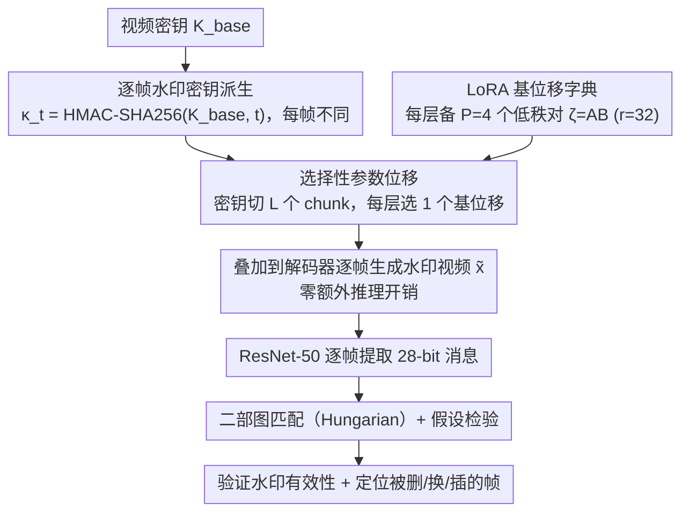

# SPDMark: Selective Parameter Displacement for Robust Video Watermarking

**会议**: CVPR 2026  
**arXiv**: [2512.12090](https://arxiv.org/abs/2512.12090)  
**代码**: 有（论文中提及）  
**领域**: 扩散模型 / 视频水印  
**关键词**: 视频水印, 参数位移, LoRA, 扩散模型, 鲁棒性

## 一句话总结
SPDMark 提出了一种基于选择性参数位移（SPD）的视频扩散模型内嵌水印框架，通过在解码器中学习低秩基 shift 字典并根据水印密钥选择组合，实现了逐帧水印嵌入、不可感知、高鲁棒性和低计算开销，同时支持时序篡改检测与定位。

## 研究背景与动机

1. **领域现状**：高质量视频生成模型（如 Sora、SVD）的出现使得 AI 生成视频的溯源问题日益严峻。EU AI Act 和美国 AI 行政令均建议对 AI 生成内容添加水印。视频水印需同时满足不可感知性、鲁棒性和计算效率三个要求。

2. **现有痛点**：(a) 后处理方法（如 VideoSeal）增加延迟且无法利用生成先验；(b) 噪声空间方法（如 VideoShield）通过 DDIM inversion 解码，计算开销大且易受扰动影响；(c) 模型微调方法（如 LVMark）统一调制所有层限制了逐帧控制，VidSig 只嵌入单一固定签名无法检测时序篡改。三类方法在不可感知性、鲁棒性和效率之间存在此消彼长。

3. **核心矛盾**：如何在不牺牲视频质量的前提下，实现高效的多密钥逐帧水印嵌入，且能检测帧级时序篡改？

4. **本文目标** 设计一种 in-generation 视频水印方案，支持任意密钥、逐帧水印、时序篡改检测，且计算开销可忽略。

5. **切入角度**：不扰动像素或噪声，而是通过学习一组低秩基 shift 的字典，根据水印密钥选择性地位移生成模型的参数来嵌入水印。

6. **核心 idea**：学习一个固定的 LoRA 基 shift 字典，每个帧的水印密钥决定每层选择哪个基 shift，从而在解码器参数空间中嵌入逐帧水印，无需推理开销也无需逐密钥重训。

## 方法详解

### 整体框架
SPDMark 想做的事是：在视频扩散模型"生成"的那一刻就把水印写进去，而且让每一帧带不同的水印，从而既不损画质又能查出谁动过哪一帧。它的做法不是改像素、也不是改噪声，而是改解码器的参数——给定一个视频级密钥 $K_{base}$，先用密码学哈希为每帧派生一个唯一的水印消息 $\kappa_t$；每个 $\kappa_t$ 翻译成一个二进制 mask，决定解码器每一层从字典里挑哪个"基位移"；被挑中的基位移叠加到原参数上，用这个被微调过的解码器生成出来的视频 $\tilde{\mathbf{x}}$ 就自带逐帧水印。提取端用一个 ResNet-50 逐帧读出消息，再把读出的消息序列和参考序列做二部图匹配 + 假设检验，既验证水印是否成立，又能指出哪几帧被删/换/插。

### 关键设计

**1. 选择性参数位移：把"嵌哪个水印"变成"每层挑哪个基位移"**

直接学一个"密钥→参数位移"的映射不现实——解码器参数动辄上亿维，位移空间太大根本学不动，而且每换一个密钥就要重训一遍。SPDMark 把这个问题拆小：先把参数分成不动的 $\Phi_U$ 和可动的 $\Phi_M$（只动解码器），让 $\Phi_M$ 横跨 $L$ 层、每层预先准备好 $P$ 个候选基位移 $\zeta_{\ell,p}$。这样某层的实际位移就是 $\Delta\phi_\ell = \sum_{p=1}^P b_{\ell,p}\,\zeta_{\ell,p}$，而 mask $b_{\ell,p}$ 由密钥决定。具体地，把 $M = L\log_2 P$ 位的密钥切成 $L$ 个 chunk，第 $\ell$ 个 chunk 的十进制值就是该层选第几个基位移——实际每层只选一个，于是整个位移塌缩成一次纯选择：

$$\Delta\Phi_M(\kappa) = [\zeta_{1,i_1+1},\ \ldots,\ \zeta_{L,i_L+1}]^{T}$$

这样做的好处是字典 $\{\zeta_{\ell,p}\}$ 训练一次就固定，之后任意新密钥都只是从字典里换一种组合，完全不用重训；同时把"学一个连续高维位移"降成了"在每层 $P$ 个离散候选里挑一个"，搜索空间小得多也好学得多。

**2. 用 LoRA 实现基位移：让字典轻到能挂在大模型上**

上一步假设每层有 $P$ 个候选位移可选，但如果每个 $\zeta_{\ell,p}$ 都是全秩矩阵，光字典本身就比原模型还大，根本部署不了。SPDMark 把每个基位移写成低秩分解 $\zeta_{\ell,p} = A_{\ell,p} B_{\ell,p}$，其中 $A \in \mathbb{R}^{d\times r}$、$B \in \mathbb{R}^{r\times d}$、$r \ll d$（论文取 $r=32$），也就是给每个候选位移配一对 LoRA 矩阵。被选中的层这样前向：

$$\mathbf{h}_\ell = \mathcal{F}_{\phi_\ell}(\mathbf{h}_{\ell-1}) + \alpha\,\mathcal{F}_{\Delta\phi_\ell}(\mathbf{h}_{\ell-1})$$

落到实现上，水印只挂在解码器的 $L=14$ 个空间 ResNet 块、每块备 $P=4$ 个 LoRA，于是每层携带 $\log_2 4 = 2$ bit、整帧 payload 是 $14\times 2 = 28$ bit。低秩分解既保住了位移的表达力，又把字典体积压到可以忽略，这是整套方案"零额外推理开销"的关键——生成时只是多算一个低秩旁路。

**3. 逐帧水印 + 二部图匹配：让时序篡改无处可藏**

此前的内嵌水印（如 VidSig）整段视频只埋一个固定签名，攻击者删几帧、换帧序、插入伪造帧，签名依旧能被读出来，时序层面的篡改完全测不到。SPDMark 让每帧的消息都不同：用 HMAC-SHA256 从基密钥和帧号派生 $\kappa_t = \text{Trunc}_M(\mathcal{H}(K_{base}, t))$，帧号一变消息就变，且无密钥不可预测。验证时把参考消息序列 $\mathbf{K}$ 和逐帧提取出的消息 $\hat{\mathbf{K}}$ 摆成一张二部图，边权用 Hamming 相似度 $\bar{S}_{m,n} = 1 - \psi(\kappa_m, \hat{\kappa}_n)/M$ 衡量"第 $m$ 帧参考"和"第 $n$ 帧提取"有多像，再用 Hungarian 算法求最大权匹配，最后用二项分布假设检验（帧级阈值 $\tau_f$、视频级阈值 $\tau_v$）判断匹配是否够强。匹配上的帧确认水印有效，匹配不上的帧就是被改动的帧——删除、交换、插入都会让对应位置匹配失败，于是篡改既被检测又被定位。

### 一个完整示例
拿一段 25 帧的生成视频走一遍：从视频密钥 $K_{base}$ 出发，第 0 帧得到 $\kappa_0 = \text{HMAC}(K_{base}, 0)$ 截断成 28 bit，比如切成 14 个 chunk、每个 chunk 2 bit；第 5 个 chunk 若是 `10`（十进制 2），就让解码器第 5 层选用第 3 个 LoRA 基位移 $\zeta_{5,3}$。14 层各自按自己的 chunk 选好基位移，叠到解码器上生成第 0 帧；第 1 帧换 $\kappa_1$、重选一组基位移……25 帧各带一份 28 bit 的独立水印。提取时 ResNet-50 逐帧读出 28 维 logits 还原消息，得到 25 条提取序列，和 25 条参考序列做二部图匹配。若攻击者把第 10 帧删掉，参考里的第 10 条消息在提取侧找不到高相似度对象，Hungarian 匹配在这一位留空，假设检验判定该帧丢失——这就完成了"第 10 帧被删"的定位。

### 损失函数 / 训练策略
总目标同时压不可感知损失和消息恢复损失：$\min_{\zeta,\eta}\ \mathcal{L}_{imp}(\mathbf{x}, \tilde{\mathbf{x}}) + \mathcal{L}_{rec}(\mathcal{V}_\eta(\tilde{\mathbf{x}}), \kappa)$。消息恢复用 BCElogits 督促提取器读对每一 bit；不可感知损失 $\mathcal{L}_{imp} = \lambda_{ps}\,\mathbb{E}_t[\text{LPIPS}(x_t, \tilde{x}_t)] + \lambda_{tc}\,\mathbb{E}_t[\|\delta y_t - \delta \tilde{y}_t\|_1]$ 由两项组成——LPIPS 保证每帧和无水印版本在感知上几乎一致，时序一致性项（相邻帧亮度差的 L1）压住逐帧水印可能引入的闪烁。训练在 OpenVid-1M 的 1 万段视频上，对密钥 $\kappa$、条件 $\mathbf{c}$、噪声 $\mathbf{z}$ 取期望优化。提取器用 ImageNet 预训练的 ResNet-50，推理时对测试视频全部帧做一次 batch normalization 以稳住预测。

## 实验关键数据

### 主实验（视频质量 + 水印检测）

**SVD-XT 模型**:

| 方法 | Payload | Bit Acc↑ | SC↑ | BC↑ | MS↑ | IQ↑ |
|------|---------|----------|-----|-----|-----|-----|
| VideoShield | 512 | 0.979 | 0.954 | 0.954 | 0.956 | **0.695** |
| VideoSeal | 256 | **0.999** | 0.955 | 0.950 | 0.961 | 0.682 |
| VidSig | 48 | 0.958 | 0.951 | 0.953 | 0.956 | 0.693 |
| **SPDMark** | 28×25 | 0.995 | **0.966** | **0.958** | **0.975** | 0.690 |

### 鲁棒性实验（SVD-XT 平均 Bit Acc）

| 方法 | 光度攻击 | 时序攻击 | 后处理 | 平均 |
|------|---------|---------|--------|------|
| VideoShield | ~0.82 | ~0.94 | ~0.83 | 0.833 |
| VideoSeal | ~0.94 | ~1.00 | ~0.82 | 0.912 |
| VidSig | ~0.66 | ~0.96 | ~0.53 | 0.685 |
| **SPDMark** | ~0.94 | ~0.99 | ~0.89 | **0.935** |

### 消融实验

| 配置 | 关键指标 | 说明 |
|------|---------|------|
| Full SPDMark | Avg Bit Acc 0.935 | 完整模型 |
| SPDMark 在 ModelScope 上 | Avg Bit Acc 高 | 跨架构（UNet→DiT）泛化 |
| 时序篡改定位 | 高 Precision/Recall/F1 | 帧删除/插入/交换均可检测 |

### 关键发现
- SPDMark 在视频质量指标（SC/BC/MS）上一致优于所有对比方法，说明参数位移方式对视觉质量影响最小
- 在鲁棒性方面平均 Bit Acc 达 0.935，超越 VideoSeal（0.912）和 VideoShield（0.833）
- 在 Screen Recording 攻击下 SPDMark 达 0.837 远超 VideoSeal 的 0.598，说明生成式水印比后处理水印更鲁棒
- 在 Crop&Drop 复合攻击下 SPDMark（0.856）显著优于其他方法（0.458-0.513）
- 逐帧水印使得时序篡改（帧删除、交换、插入）均可被检测和定位

## 亮点与洞察
- **参数空间水印是一个巧妙的范式转换**：不在像素或噪声空间操作，而是在模型参数空间嵌入水印，天然继承了模型的生成质量，开销极低
- **LoRA 基 shift 字典支持无限密钥**：一次训练字典后，任意新密钥只需选择不同组合，无需重训。这比 per-key fine-tuning 高效得多
- **密码学哈希生成帧级消息 + Hungarian 匹配验证**：将密码学工具与图匹配算法结合，优雅地解决了时序篡改检测问题，这个框架可以推广到其他需要序列完整性验证的场景

## 局限与展望
- 每帧仅 28 bit payload，容量有限（14 层 × 2 bit/层），增加位深需要更多 LoRA 基或更多层
- 仅在解码器上做水印，如果攻击者替换解码器则水印失效（但这在 API 控制场景下不太可能）
- 提取器使用 ResNet-50 相对简单，对极端攻击（如高压缩比 H.265）可能不够鲁棒
- 训练需要成对的 watermarked/non-watermarked 视频，数据成本较高

## 相关工作与启发
- **vs VideoShield**: 基于噪声空间+DDIM inversion，计算开销大且 Crop 攻击下 Bit Acc 仅 0.521。SPDMark 避免了 inversion
- **vs VideoSeal**: 后处理方法，Screen Recording 下严重退化（0.598）。SPDMark 利用生成先验更鲁棒
- **vs VidSig**: 冻结 PAS 层+时序对齐，但只嵌入固定签名无法检测时序篡改。SPDMark 的逐帧机制更灵活
- **vs AQuaLoRA**: 图像级 LoRA 水印，SPDMark 扩展到视频并加入时序一致性和篡改检测

## 评分
- 新颖性: ⭐⭐⭐⭐⭐ 参数位移框架和 LoRA 基 shift 字典的设计非常新颖，时序篡改检测机制优雅
- 实验充分度: ⭐⭐⭐⭐ 覆盖两种生成架构和多种攻击类型，但消融实验可以更详细
- 写作质量: ⭐⭐⭐⭐ 形式化推导清晰，但符号较多需要仔细阅读
- 价值: ⭐⭐⭐⭐⭐ 高度实用的视频水印方案，直接可部署到视频生成 API 服务中

<!-- RELATED:START -->

## 相关论文

- [\[CVPR 2026\] Towards Robust Content Watermarking Against Removal and Forgery Attacks](towards_robust_content_watermarking_against_removal_and_forgery_attacks.md)
- [\[CVPR 2026\] Rel-Zero: Harnessing Patch-Pair Invariance for Robust Zero-Watermarking Against AI Editing](rel-zero_harnessing_patch-pair_invariance_for_robust_zero-watermarking_against_a.md)
- [\[CVPR 2026\] Editing Away the Evidence: Diffusion-Based Image Manipulation and the Failure Modes of Robust Watermarking](editing_away_the_evidence_diffusion-based_image_manipulation_and_the_failure_mod.md)
- [\[ECCV 2024\] Robust-Wide: Robust Watermarking against Instruction-driven Image Editing](../../ECCV2024/image_generation/robust-wide_robust_watermarking_against_instruction-driven_image_editing.md)
- [\[CVPR 2026\] SpotEdit: Selective Region Editing in Diffusion Transformers](spotedit_selective_region_editing_in_diffusion_transformers.md)

<!-- RELATED:END -->
