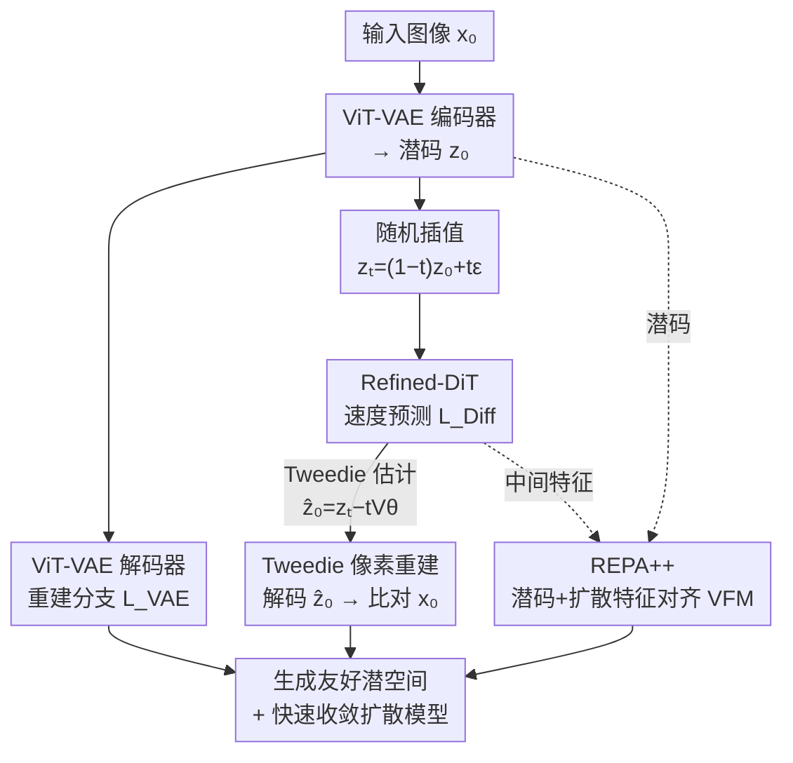

# SpeeDiff: Scalable Pixel-Anchored End-to-End Latent Diffusion Model

**会议**: CVPR 2026  
**论文**: [CVF Open Access](https://openaccess.thecvf.com/content/CVPR2026/html/Zhang_SpeeDiff_Scalable_Pixel-Anchored_End-to-End_Latent_Diffusion_Model_CVPR_2026_paper.html)  
**代码**: 无  
**领域**: 扩散模型 / 图像生成  
**关键词**: 潜在扩散、端到端训练、VAE、Tweedie 公式、表示对齐  

## 一句话总结
SpeeDiff 把潜在扩散模型里"先训 VAE 再冻结、再训扩散"的两阶段流程拆掉，让 VAE 和扩散模型从头联合训练且不加 stop-gradient——关键是用一个 Tweedie 像素重建（TPR）损失把扩散梯度"锚"回像素空间，防止潜空间塌缩，在 ImageNet 256×256 上无引导达到 FID 1.50，训练速度比 Vanilla SiT 快 140×、比 REPA 快 61×。

## 研究背景与动机

**领域现状**：潜在扩散模型（LDM）已是视觉生成的主流范式，它先用一个 VAE 把图像压进紧凑的潜空间，再在这个潜空间上训练扩散模型（通常是 DiT）。标准做法是两阶段流水线——VAE 先训到收敛并冻结，扩散模型在固定潜空间上学习。近期改进 LDM 的工作几乎都集中在"怎么把 VAE 做得更好"，例如借助视觉基础模型（VFM，如 DINOv3）做表示对齐（REPA）或直接拿 VFM 当编码器。

**现有痛点**：用重建目标训出来的 VAE 主要捕捉低层像素统计，潜空间缺乏语义结构，扩散模型在上面学得很费劲。而真正能让 VAE "为生成服务"的端到端优化——让扩散损失的梯度直接回传到 VAE 编码器——几乎没人碰。原因很现实：早在 LSGM 时代就发现，朴素的端到端联合训练会让性能**严重退化**。作者复现的 Vanilla E2E 在 ImageNet 256 上训 80 epoch 只有 FID 33.95，远差于两阶段基线。

**核心矛盾**：作者诊断出退化的根因是**潜空间塌缩（latent collapse）**。在端到端训练里，扩散模型可以"作弊"——它把潜空间逼成一个退化表示：各通道方差被严重压低、偏置很大，潜值分布偏离高斯先验、形成几个尖峰。这样一来，给定噪声态 $z_t$、干净潜码 $z_0$ 的条件分布极度集中，扩散模型只要对几乎所有输入预测一个接近常数的均值就能把潜空间里的扩散损失压到极低，却完全丢掉了重建图像所需的语义信息。换句话说，**潜空间损失很低 ≠ 像素能重建**，扩散模型找到了一条平凡解的捷径。

**本文目标 / 切入角度**：既然问题出在"扩散模型只盯着潜空间目标、没有像素层面的约束"，那就给它补上像素级反馈，把潜码"钉"在能重建出原图的位置上。

**核心 idea**：用 Tweedie 公式从中间噪声态估出干净潜码、解码回像素再和原图比对（TPR 损失），强制 VAE 维持语义有意义的潜空间；在此基础上换上全 Transformer 架构（ViT-VAE + Refined-DiT）并引入增强版表示对齐 REPA++，实现从零开始的单阶段端到端 LDM。

## 方法详解

### 整体框架

SpeeDiff 是一个**单阶段、从零联合训练 VAE 与扩散模型、且全程不加 stop-gradient** 的潜在扩散框架。输入是一张图像 $x_0$，VAE 编码器把它压成潜码 $z_0$，扩散模型在采用随机插值（stochastic interpolant）形式的潜空间上学习速度场；输出是一个既能重建、又"生成友好"的潜空间加一个快速收敛的扩散模型。

整条前向训练同时跑**四条分支**，它们共享同一套梯度（包括回传到 VAE 编码器的扩散梯度）：①重建分支算标准 VAE 损失 $L_{VAE}$；②扩散分支按随机插值做流匹配预测算 $L_{Diff}$；③**TPR 分支**——这是防塌缩的核心——用 Tweedie 公式从噪声态估出干净潜码、解码成像素和原图比；④**REPA++ 分支**把潜码和中间扩散特征都对齐到冻结的 VFM 表示。总目标是四项相加：

$$L_{\text{SpeeDiff}} = L_{VAE} + L_{Diff} + L_{TPR} + L_{\text{REPA++}}$$

下图按前向流向画出这四条分支如何在一次训练步里协同（TPR 与 REPA++ 都是"挂在主干上、把梯度灌回 VAE 编码器"的约束分支）：

### 关键设计

**1. Tweedie 像素重建损失（TPR）：把扩散梯度"锚"回像素，挡住潜空间塌缩**

这是全文最核心、也最便宜的贡献，直接针对"扩散模型在潜空间作弊、丢掉重建信息"这个痛点。思路是：既然塌缩是因为缺了像素级监督，那就显式地从扩散预测里恢复一张图、和真图比对。具体地，在随机插值 $z_t = (1-t)z_0 + t\varepsilon$ 下，扩散模型对干净潜码的 Tweedie 估计是 $\hat{z}_0 = z_t - t V_\vartheta(z_t, t)$；把它送进 VAE 解码器 $D_\xi$ 再和真图做 MSE：

$$L_{TPR} = \mathbb{E}_{x_0, z_0, \varepsilon, t}\big[\|D_\xi(\hat{z}_0) - x_0\|^2\big]$$

这一项本质是像素空间的重建约束（还可叠加 LPIPS 感知损失增强）。它的妙处在于：扩散模型若想靠"预测近似常数"压低潜空间损失，解码出来的图就会和原图差很远、被 TPR 狠狠惩罚，于是 VAE 被迫维持一个"解得回像素"的潜空间。作者用诊断实验佐证（论文 Fig. 3）：加上 TPR 后，潜值分布从尖峰拉回接近高斯、各通道偏置和方差恢复平衡，Tweedie 估计的像素重建误差也显著下降。效果立竿见影——仅加这一项，Vanilla E2E 的 FID 从 33.95 砍到 5.79（80 epoch）。

**2. 全 Transformer 精炼架构（ViT-VAE + Refined-DiT）：让 VAE 和扩散一起可扩展**

朴素端到端跑通后，作者把架构整体换成全 Transformer，目的是解锁联合 scaling。VAE 端用 ViT-VAE 替换传统卷积 VAE（CNN-VAE）：编码器是 patch-embedding + Transformer block，解码器镜像对称。扩散主干则在 DiT 基础上吸收近期改进（参照 LightningDiT）：RMSNorm、SwiGLU 激活、2D RoPE，并把逐 block 的调制层换成"共享全局调制 + 逐 block 可学习偏置"（类似 PixArt-α），patch size 固定为 1，称为 Refined-DiT。换架构后单步训练成本反而从 436.29 GFLOPs 降到 334.98 GFLOPs，80 epoch 的 FID 进一步降到 3.66。更重要的是，全 Transformer 管线避免了卷积的容量瓶颈、且**把 VAE 和扩散一起放大**（而非只扩扩散、冻住 VAE），从而呈现比 EDM2 更单调清晰的 scaling 曲线。

**3. REPA++ 表示对齐：双路注入 VFM 语义、端到端回传指导 VAE**

为进一步加速收敛、补强语义，作者把 REPA 升级为 REPA++，在端到端框架里**同时**对齐两处特征到冻结 VFM（默认 DINOv3-ViT-L/16）。设 $y = \text{VFM}(x_0)$ 为干净图的语义表示。第一路 **Latent-REPA** 把潜码 $z_0$ 经两层 MLP $h_{\varrho_1}$ 映射后，最大化与 $y$ 的逐 patch 余弦相似度 $L_{\text{Latent-REPA}} = -\mathbb{E}[\text{sim}(h_{\varrho_1}(z_0), y)]$；第二路 **Diff-REPA** 沿用 REPA 思路，把扩散网络早期层抽到的中间特征 $f_t$ 经另一 MLP $h_{\varrho_2}$ 对齐到同一 $y$。两路相加即 REPA++。和原版 REPA 只对齐扩散特征不同，REPA++ 因为处在无 stop-gradient 的端到端框架里，语义监督能**通过梯度反传一路指导 VAE 编码器**，让潜空间天生更语义化。加上 REPA++ 后，SpeeDiff-XL 80 epoch 的 FID 从 3.66 降到 1.69；消融显示双路缺一不可——只留 Latent-REPA 是 2.28、只留 Diff-REPA 是 2.15，两路合一才到 1.69。

## 实验关键数据

### 主实验

ImageNet 256×256，无引导 gFID（越低越好）。SpeeDiff-XL 在"不依赖 VFM 对齐"和"用对齐"两个赛道都刷到 SOTA，且训练 epoch 数远少于对手。

| 方法 | VAE / 扩散 | Epochs | gFID↓（无引导） |
|------|-----------|--------|----------------|
| SiT | SD-VAE / DiT-XL | 1400 | 8.61 |
| MDTv2 | SD-VAE / DiT-XL | 1080 | —（有引导 1.58） |
| REPA | SD-VAE / DiT-XL | 800 | 5.90 |
| REPA-E | E2E-VAE / DiT-XL | 800 | 1.83 |
| **SpeeDiff-XL (w/o REPA++)** | ViT-VAE-XL / Refined-DiT-XL | 200 | **2.42** |
| **SpeeDiff-XL (w/ REPA++)** | ViT-VAE-XL / Refined-DiT-XL | 200 | **1.50** |

512×512（用更激进的 32× 压缩 VAE，f32d32）：SpeeDiff-XL (w/ REPA++) 200 epoch 取得 gFID **1.53**（无引导），优于 EDM2-XXL 的 1.91，且模型/计算量更省。

收敛速度：SpeeDiff-XL (w/ REPA++) 仅 **10 epoch** 就达到 gFID 7.36，已超过训了 1400 epoch 的 Vanilla SiT；整体训练加速 **140×**（vs Vanilla SiT）、**61×**（vs REPA）。

### 消融实验

逐组件加法（ImageNet 256，80 epoch，gFID↓），对比"扩散梯度是否回传 VAE"两条路径——端到端只有在 TPR 兜底后才反超 detached：

| 配置 | Detached（无梯度回传） | End-to-end（有梯度回传） |
|------|----------------------|------------------------|
| Baseline | 13.02（两阶段）/ 14.21（单阶段） | 33.95（Vanilla E2E，塌缩） |
| + TPR Loss | 11.65 | 5.79 |
| + Refined 架构 | 7.52 | 3.66 |
| + REPA++ | 3.47 | **1.69** |

REPA++ 内部消融（80 epoch）：DINOv3-L 双路 1.69 > DINOv2-L 双路 1.76 > 单路 Diff-REPA 2.15 > 单路 Latent-REPA 2.28。

### 关键发现
- **TPR 是端到端能跑通的命门**：没有它，端到端（33.95）远差于两阶段（13.02）；加上它，端到端（5.79）一举反超。同一条 TPR 损失在 detached 路径只把 14.21 降到 11.65，说明它真正的价值是"为回传的扩散梯度兜底"，而非单纯的正则。
- **端到端会自动提升潜空间语义**：即便不加 REPA++，端到端训练也让潜空间线性探测精度提升 9.45%，扩散损失梯度天然把潜空间往语义对齐的方向"抹平"。
- **学到的 VAE 是"生成友好"的可复用资产**：冻结 SpeeDiff-XL 训好的 VAE、从头训一个新扩散模型，收敛速度几乎和 SpeeDiff 本身一样（80 epoch gFID 1.73 vs 参考 1.69），说明 SpeeDiff 相当于做了一次"潜空间预训练"。

## 亮点与洞察
- **Tweedie 公式的巧用**：扩散里 Tweedie 估计 $\hat{z}_0 = z_t - t V_\vartheta$ 本是采样/去噪的常规工具，这里被借来当"探针"——把潜空间预测翻译回像素再施加监督，一行公式就堵住了塌缩这条作弊路径，简单到几乎零额外结构成本。
- **"诊断 → 对症"的研究范式很干净**：作者先用 latent error vs pixel error、KDE 分布、逐通道偏置/方差三组诊断坐实"塌缩"，再针对性地补像素反馈，逻辑闭环，比直接堆 trick 更有说服力。
- **可迁移思路**：任何"在压缩/潜空间上优化、但下游需要还原到原始空间"的端到端任务（如神经压缩、token 化生成），都可以借鉴"用解码器把潜预测拉回原空间施加锚定损失"来防止表示退化。

## 局限与展望
- 论文主战场是 ImageNet 类条件生成，**文本到图像、视频生成**等更复杂条件下的端到端联合训练是否同样稳定、TPR 是否仍足够兜底，论文未验证。⚠️ 以原文为准。
- TPR 分支每步需要**额外一次解码器前向**（每步两次解码：VAE 重建 + TPR），虽然换架构后总 FLOPs 反降，但解码次数翻倍在更大分辨率/更大解码器下的开销值得关注。
- 最优性能仍依赖外部 VFM（DINOv3）做 REPA++ 对齐；不用对齐的 SpeeDiff（FID 2.42）虽已是非对齐 SOTA，但和用对齐版（1.50）仍有可见差距，端到端本身没能完全替代 VFM 语义先验。

## 相关工作与启发
- **vs 两阶段 LDM（如 SiT / DiT）**：他们冻结预训练 VAE、只训扩散；SpeeDiff 让 VAE 和扩散从零联合训练、扩散梯度直接塑造潜空间，收敛快上百倍，区别核心在于"潜空间是否随生成监督一起演化"。
- **vs REPA-E**：REPA-E 也把表示对齐损失反传到 VAE 编码器、是端到端方向的近亲，但它仍以对齐为主轴；SpeeDiff 的差异是先用 TPR 解决塌缩这个端到端的根本障碍，再叠加 REPA++ 双路对齐，800 epoch 的 REPA-E（1.83）被 200 epoch 的 SpeeDiff（1.50）反超。
- **vs LSGM**：LSGM 最早尝试 VAE+扩散联合训练但被性能退化劝退；SpeeDiff 相当于诊断出退化根因（潜塌缩）并给出便宜的解法，把这条被搁置的路线重新跑通。
- **vs 直接用 VFM 当编码器（RAE / SVG / VFM-VAE）**：那条线把 VAE 编码器换成冻结/半冻结的 VFM；SpeeDiff 选择保留可训练 VAE、把 VFM 当即插即用的对齐目标，从而保留端到端梯度回传的灵活性。

## 评分
- 新颖性: ⭐⭐⭐⭐⭐ 把被搁置的 VAE+扩散端到端联合训练用一个极简 TPR 损失重新跑通，诊断到位、解法干净。
- 实验充分度: ⭐⭐⭐⭐⭐ 256/512 双分辨率主表 + 逐组件加法消融 + REPA++ 内部消融 + 潜空间诊断/可复用性分析，覆盖全面。
- 写作质量: ⭐⭐⭐⭐ "诊断塌缩→对症 TPR→架构与对齐增强"的叙事清晰，公式与图表配合好；缓存版有少量排版/拼写瑕疵。
- 价值: ⭐⭐⭐⭐⭐ 140×/61× 的训练加速 + SOTA FID，且训出的 VAE 可独立复用，对 LDM 训练范式有实际推动。

<!-- RELATED:START -->

## 相关论文

- [\[ICCV 2025\] REPA-E: Unlocking VAE for End-to-End Tuning with Latent Diffusion Transformers](../../ICCV2025/image_generation/repa-e_unlocking_vae_for_end-to-end_tuning_of_latent_diffusion_transformers.md)
- [\[CVPR 2026\] DeCo: Frequency-Decoupled Pixel Diffusion for End-to-End Image Generation](deco_frequency-decoupled_pixel_diffusion_for_end-to-end_image_generation.md)
- [\[CVPR 2026\] Your Latent Mask is Wrong: Pixel-Equivalent Latent Compositing for Diffusion Models](your_latent_mask_is_wrong_pixel-equivalent_latent_compositing_for_diffusion_mode.md)
- [\[CVPR 2026\] Bias at the End of the Score: Demographic Biases in Reward Models for T2I](bias_reward_models_t2i.md)
- [\[ICML 2026\] End-to-End Autoregressive Image Generation with 1D Semantic Tokenizer](../../ICML2026/image_generation/end-to-end_autoregressive_image_generation_with_1d_semantic_tokenizer.md)

<!-- RELATED:END -->
