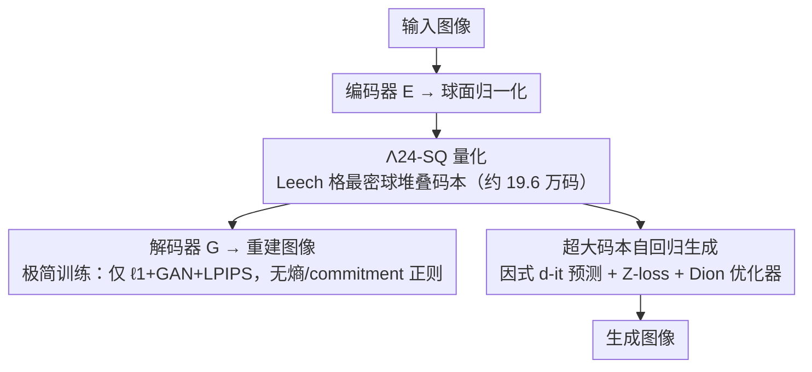

# Spherical Leech Quantization for Visual Tokenization and Generation

**会议**: CVPR 2026  
**论文**: [CVF Open Access](https://openaccess.thecvf.com/content/CVPR2026/html/Zhao_Spherical_Leech_Quantization_for_Visual_Tokenization_and_Generation_CVPR_2026_paper.html)  
**项目页**: http://cs.stanford.edu/~yzz/npq/  
**领域**: 图像生成 / 视觉 tokenizer / 向量量化  
**关键词**: 非参数量化, 格码, Leech 格, 视觉 tokenizer, 超大码本自回归生成

## 一句话总结
本文把 LFQ / FSQ / BSQ 等无查表（non-parametric）量化统一成「格码（lattice code）」语言，指出熵正则项本质是在做格点重定位，进而用「最密超球堆叠」原则导出基于 24 维 Leech 格的球面量化 $\Lambda_{24}$-SQ，把视觉码本规模一举推到约 20 万，既不需要任何熵/commitment 正则就能训 tokenizer，又首次让离散视觉自回归模型在 ImageNet-1k 上用约 20 万码本达到接近 oracle 的 1.82 gFID。

## 研究背景与动机
**领域现状**：离散视觉 token 化是视觉压缩、生成、理解的基础。与语言建模类似，视觉自回归模型也走「先量化成离散 token、再 next-token 预测」的范式。为了把码本做大、又省参数，近年兴起一类**非参数量化（NPQ）**方法——LFQ、BSQ、FSQ——它们用固定的隐式码本（如 $\{\pm1\}^d$、单位超球上的 $\{\pm\frac{1}{\sqrt d}\}^d$）替代可学习的向量量化码本。

**现有痛点**：尽管语言模型的词表已达 13 万（DeepSeek-R1）甚至 20 万（GPT-4o），主流视觉码本却还停在 1K–16K 量级。更糟的是现有 NPQ 各有各的「补丁」：LFQ 实现简单但熵计算随维度指数爆炸；BSQ 高效但不加熵正则就会码本坍缩；FSQ 不需复杂正则，但每通道取多少级（$L_1,\dots,L_d$）的选法很启发式。这些 ad hoc 技巧的共同根源是——**大多数方法是凭直觉拼出来的，缺乏统一的原理性设计**。

**核心矛盾**：码本要做大、训练又要简单，二者之间长期靠正则项（熵惩罚、commitment loss）硬撑，而这些正则本身又带来调参和数值负担。

**本文目标**：(1) 给所有 NPQ 一个统一、可解释的数学框架；(2) 在该框架下导出一个**理论扎实、实现简单、可扩展到约 20 万码本**的新量化器；(3) 解决超大码本下自回归生成的训练稳定性。

**切入角度**：作者发现 NPQ 的码本本质都是某个**格（lattice）**在约束下的离散点集，而熵正则的两个子项恰好对应「把输入推向格点」和「寻找格点的最优分布」。既然如此，与其用正则去逼近一个均匀分布，不如**直接选一个天然最均匀的格**。

**核心 idea**：用「最密超球堆叠」格——24 维 Leech 格——的第一壳层作为固定码本（$\Lambda_{24}$-SQ），其高对称性和超球面上的均匀分布让熵正则变得多余，从而同时拿到「简化训练」和「更优的率-失真折中」。

## 方法详解

### 整体框架
方法可拆成两层。**第一层是 tokenizer**：图像经编码器 $E$ 得到连续隐表示，归一化到单位超球面后用 $\Lambda_{24}$-SQ 把每个向量量化到最近的 Leech 格点，再由解码器 $G$ 重建——关键是量化器是**固定**的格点集，不参与梯度更新，训练只需 $\ell_1$+GAN+LPIPS 三件套。**第二层是生成**：把约 20 万的离散码喂给视觉自回归（VAR/Infinity 式）模型做 next-scale 预测，并配套一组让超大码本训练不崩的技巧。整套流程串起来如下：

下面的「格码统一视角」是支撑整套设计的理论底座，「$\Lambda_{24}$-SQ 码本」「极简训练」对应图中的量化与重建节点，「超大码本自回归生成」对应生成分支。

### 关键设计

**1. 把非参数量化统一成格码：熵正则即格点重定位**

现有 NPQ 五花八门，让人看不清它们到底差在哪。本文把每种方法都写成同一套格码语言：一个 $d$ 维格 $\Lambda_d = \{\lambda = Gb \mid b\in\mathbb{Z}^d\}$，再加上把它变成可枚举码本的约束 $f(\lambda)=c_1,\ h(\lambda)\le c_2$。在这套语言里，LFQ 是生成矩阵 $G=I_d$ 加 $\|\lambda\|_1=d$ 约束（即 $\lambda_i=\pm1$），BSQ 是 $G=\frac{1}{\sqrt d}I_d$ 加单位球面约束，FSQ 是有界整数格——一眼就能看出它们是同一个量化器 $Q_\Lambda(z)=\arg\min_{t\in\Lambda}\|z-t\|$ 在不同格上的实例。

更关键的是对**熵正则**的重新解读：熵正则 $L_{\text{entropy}}=\mathbb{E}[H[q(z)]]-\beta H[\mathbb{E}[q(z)]]$ 的两项分别对应「让每个输入靠近某个格点（而非决策边界）」和「让各码字的 Voronoi 区域体积相等以求类别均衡」。换句话说，熵正则其实在偷偷做一件事——**把格点重新摆放到一个最均匀的配置**。这一步把「要不要加正则」的工程问题，转化成「选哪个格最均匀」的几何问题，是后面所有设计的逻辑起点。它也顺带解释了为什么 FSQ 不需熵正则（有界域上等体积 Voronoi 天然均衡）而 LFQ 需要。

**2. $\Lambda_{24}$-SQ：用最密超球堆叠的 Leech 格当码本**

既然熵最大化等价于「在超球面上把 $N$ 个点摆得尽量分散」（最大化任意两点最小距离 $\delta_{\min}(N)$，即 Tammes 问题在高维的推广），那最优解自然是**最密超球堆叠格**。在 1–8、12、16、24 维里已被证明最优的格中，作者锁定 24 维的 **Leech 格 $\Lambda_{24}$**：它第一壳层有 196,560 个最小范数（$\sqrt{32}$）向量，归一化到单位长度后正好构成一个约 20 万的球面码本，记作 $\Lambda_{24}$-SQ。和同等码本规模的 BSQ（$d=18$，$2^{18}=262{,}144$）相比，$\Lambda_{24}$-SQ 把最小角距 $\delta_{\min}$ 从 $2/\sqrt{18}\approx0.471$ 提到 $\sqrt{3}/2\approx0.866$，**提升超过 80%**——点摆得越分散，量化误差越小、码本利用越充分。尽管码本巨大，但格向量固定，可用 tiling + JIT 编译把显存和运行时压到比朴素 VQ 还低；需要小码本时也能只取某一类 $\Lambda_{24}(2)_s$ 子集，灵活覆盖 1,104–98,304 规模。

**3. 极简训练配方：靠均匀格直接删掉所有正则项**

由于 $\Lambda_{24}$-SQ 的点天然均匀分布在超球面上，类别均衡这件事已被几何「白送」，于是 tokenizer 训练**不再需要 commitment loss、也不需要熵惩罚**，只留 $\ell_1$（管 PSNR）、GAN（管 FID）、LPIPS（管感知）这个「无法再简化的三元损失」。这正是「简单」的含金量所在：旧方法删掉正则就坍缩，而本文删掉正则反而更好——在 ViT 自编码器上把 rFID 从 BSQ 的 1.14 降到 0.83，且有效码率还略低（$d_\omega=17.58$ vs. $18$）。消融（Table 8）进一步证实：在固定码本下，$\delta_{\min}$ 越大的量化器（$\Lambda_{24}$-SQ > BSQ > 随机投影 VQ）rFID/LPIPS/SSIM/PSNR 全面更优，且换成可学习码本几乎不改变结论——说明收益来自**格的几何**而非学习。

**4. 超大码本自回归生成：因式 d-it 预测 + 稳定化训练**

把约 20 万码本接到自回归模型上有两个坎：一是码本映射怎么表示，二是大码本下训练会梯度爆炸。对前者，作者推广「逐 bit 预测」为**因式分解的 d-it 预测**——假设各维独立，则一个格码的联合对数概率近似为各维之和 $\log p(c^{(1:d)})\approx\sum_i^d \log p(c^{(i)})$；对 $\Lambda_{24}$-SQ 就是用 24 个 9 路（取值 $\{-4,\dots,4\}$）分类头。同时用 cut cross-entropy（CCE）+ Kahan 求和压低显存、保数值稳定。对后者，作者观察到大码本下码字频率极不均衡（最频/最少之比从 VQ 的约 5.6 飙到约 37），导致 16 层 Infinity 训练时梯度范数持续上涨、loss 爆炸；借鉴大语言模型经验引入两招——**Z-loss** $L_Z=\xi|\log Z|^2$（$\xi=10^{-4}$）防 logit 爆炸，以及 **Dion 正交归一化优化器**（>1D 张量用 Dion、1D 与嵌入层用 Lion，解嵌入层按 $1/\sqrt{d_{in}}$ 缩放学习率），把训练曲线变平滑、方差更小、最终 loss 更低。值得注意的是，d-it 因式预测虽省，却会牺牲多样性（gFID 略差、recall 偏低），所以最终主结果仍用整码本 CE 头。

### 损失函数 / 训练策略
- **Tokenizer**：$L = \ell_1 + \lambda_{\text{GAN}}L_{\text{GAN}} + \lambda_{\text{LPIPS}}L_{\text{LPIPS}}$，无熵/commitment 正则；可选用 DINOv2 的 VF 对齐损失缓解「重建好不等于生成好」的两难。
- **生成模型**：CE（或 9 路因式 CE）+ Z-loss；优化器 Dion/Lion；采样用层级线性缩放 CFG + nucleus（top-$p$）。
- $\Lambda_{24}$-SQ 可即插即用接入多尺度残差量化（VAR/Infinity tokenizer）。

## 实验关键数据

### 主实验
ImageNet-1k 重建（256×256，ViT 架构）与 ImageNet 生成对比：

| 任务 | 指标 | 本文 $\Lambda_{24}$-SQ | 之前 SOTA | 变化 |
|------|------|------|----------|------|
| 重建 (ImageNet val) | rFID↓ | **0.83** | 1.14 (BSQ-ViT) | -0.31 |
| 重建 (ImageNet val) | PSNR↑ | **26.37** | 25.36 (BSQ) | +1.01 |
| 重建 (ImageNet val) | LPIPS↓ | **0.0622** | 0.0761 (BSQ) | 更优 |
| 重建 | 有效 bit | ≈17.58 | 18 (BSQ) | 略低 |
| 生成 (gFID, 2.8B) | gFID↓ | **1.82** | 1.92 (VAR-d30) | 逼近 oracle 1.78 |
| 生成 (IS, 2.8B) | IS↑ | **333.4** | 323.1 (VAR-d30) | +10.3 |

Kodak 压缩（Table 6）：$\Lambda_{24}$-SQ 仅用 $\ell_1$ 损失、不做算术编码，PSNR 29.632 / MS-SSIM 0.9637 即超过 JPEG2000、WebP、BSQViT，且 BPP（0.2747）更低。

### 消融实验
固定码本、只换量化瓶颈（ViT-small，ImageNet 128×128，Table 8）：

| 量化器 | 码本 $|C|$ | rFID↓ | LPIPS↓ | PSNR↑ | 说明 |
|------|------|------|------|------|------|
| 随机投影 VQ (U) | $2^{14}$ | 13.08 | 0.1080 | 23.018 | 分散度最低 |
| BSQ | $2^{14}$ | 12.98 | 0.1048 | 23.171 | $\delta_{\min}$ 居中 |
| $\Lambda_{24}$-SQ | $2^{14}$ | **11.16** | **0.1007** | **23.390** | 同码本下最优 |
| $\Lambda_{24}$-SQ | 196,560 | **8.98** | 0.0811 | 24.282 | 大码本进一步提升 |

预测头消融（$\rightleftharpoons$-CC，Table 9）：$\Lambda_{24}$-SQ + 整码本 CE 拿到 gFID 8.7；换成 24×9 路因式 CE 后 gFID 升到 11.7、recall 仍升但多样性受损，印证因式近似牺牲多样性。

### 关键发现
- **分散度（$\delta_{\min}$）是率-失真折中的主因**：固定码本下 $\delta_{\min}$ 越大，重建四项指标越好，且这一优势在高维（$d=24$）比低维（$d=3$）更明显；可学习码本几乎不改变结论，说明收益来自格几何。
- **大码本只有在大模型上才划算**：12 层（0.24B）到 16 层（0.49B）时，把码本从 16,384 扩到 196,560 才显著改善 gFID，呼应「大模型配大词表」的 LLM 规律；同时把 precision-recall Pareto 前沿推向验证集 oracle。
- **VF 对齐**会让重建略变差，却让 VAR 生成收敛更快、最终 gFID/IS/recall 更好——把 VAVAE 关于连续隐变量的结论扩展到了离散 token。
- **训练稳定性**：超大码本天然带来频率不均衡（最频/最少比约 37），Z-loss + Dion 是让 16 层 Infinity 不崩的关键。

## 亮点与洞察
- **「选好格」替代「调正则」**：把 LFQ/BSQ/FSQ 的 ad hoc 正则统一解释成「格点重定位」，再用最密超球堆叠一步到位——这是个把工程补丁升级为几何原理的漂亮换框，思路可迁移到任何「靠正则逼近均匀分布」的量化/聚类场景。
- **Leech 格的妙用**：24 维 Leech 格本是编码理论/晶格密码学里的经典对象，作者把它第一壳层的 196,560 个点直接当视觉码本，既「免费」拿到极高对称性，又恰好对上 LLM 级别的词表规模——跨学科借力的典范。
- **固定码本反而更省**：格向量固定 → 不进梯度更新 → tiling+JIT 让 20 万码本比朴素 VQ 还省显存，打破「大码本必然昂贵」的直觉。
- **首次让离散视觉 AR 用约 20 万码本逼近 oracle**：1.82 gFID 对 oracle 1.78，且 recall 更高、把 precision-recall 折中推向验证集，证明「大词表有利于生成多样性」这一此前未被报告的结论。

## 局限与展望
- 作者承认目前只在 ImageNet 类规模验证，更大规模（如文本条件生成）的有效性留待future work。
- 维度被「锁死」在 24 维（Leech 格特有），换其他码本规模需取子集或换别的最密堆叠格（如 $E_8$、$\Lambda_{16}$），灵活性不如可任意设维的 FSQ。
- 因式 d-it 预测虽省显存却牺牲生成多样性，最终主结果仍依赖整码本 CE 头——超大码本上的「省显存」与「保多样性」尚未两全。
- 超大码本带来的频率不均衡需要 Z-loss/Dion 等额外技巧兜底，迁移到新架构时这些技巧的鲁棒性需重新验证（⚠️ 部分训练超参以原文为准）。

## 相关工作与启发
- **vs BSQ [91]**：BSQ 把超立方体码本投到单位球，本质是低分散度的简单方格格；本文指出它并非最密堆叠，用 Leech 格把 $\delta_{\min}$ 提升 80%，在同等码率下重建全面更优且无需熵正则。
- **vs FSQ [56]**：FSQ 用有界整数格避开熵正则，但每通道级数选法启发式；本文用统一格码视角解释了 FSQ 为何不需正则（等体积 Voronoi），并给出更原理化、可扩展到 20 万的替代。
- **vs LFQ / MAGVITv2 [86]**：LFQ 实现简单但熵计算指数爆炸、且需 index subgrouping 等技巧才能上大码本；本文不用 subgrouping、multihead、bit-flipping 等「花活」就把码本推到约 20 万。
- **vs 可学习 VQ [33, 77]**：传统 VQ 因码本与编码器分布错配而难训；本文沿「固定码本」路线（与 LFQ/BSQ/FSQ 同方向），把固定码本的几何设计推到极致。

## 评分
- 新颖性: ⭐⭐⭐⭐⭐ 用格码统一视角 + 最密超球堆叠把量化从「调正则」升级为「选几何」，并首次把视觉 AR 推到约 20 万码本。
- 实验充分度: ⭐⭐⭐⭐⭐ 覆盖重建/压缩/生成三类任务，有 $\delta_{\min}$ 与码本规模的科学性消融。
- 写作质量: ⭐⭐⭐⭐ 理论部分密集、记号偏重，需要一定格码/编码理论背景才好读。
- 价值: ⭐⭐⭐⭐⭐ 给视觉 tokenizer 提供了既简单又可扩展的新基线，直接利好离散视觉自回归生成。

<!-- RELATED:START -->

## 相关论文

- [\[CVPR 2026\] EVATok: 自适应长度视频Tokenization用于高效视觉自回归生成](evatok_adaptive_length_video_tokenization_for_eff.md)
- [\[CVPR 2026\] Seeing What Matters: Visual Preference Policy Optimization for Visual Generation](seeing_what_matters_visual_preference_policy_optimization_for_visual_generation.md)
- [\[CVPR 2026\] ThinkGen: Generalized Thinking for Visual Generation](thinkgen_generalized_thinking_for_visual_generation.md)
- [\[CVPR 2026\] CaTok: Taming Mean Flows for One-Dimensional Causal Image Tokenization](catok_taming_mean_flows_for_one-dimensional_causal_image_tokenization.md)
- [\[CVPR 2026\] Mirai: Autoregressive Visual Generation Needs Foresight](mirai_autoregressive_visual_generation_needs_foresight.md)

<!-- RELATED:END -->
