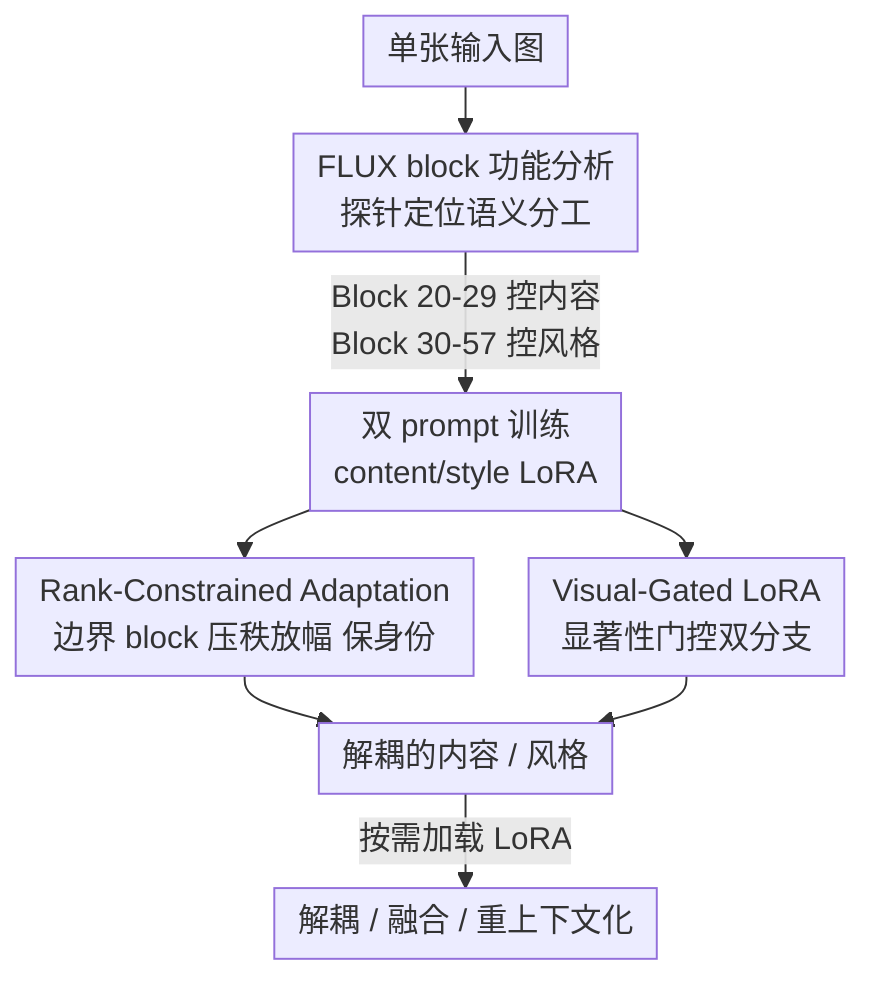

# SplitFlux: Learning to Decouple Content and Style from a Single Image

**会议**: CVPR 2026  
**论文**: [CVF Open Access](https://openaccess.thecvf.com/content/CVPR2026/html/Yang_SplitFlux_Learning_to_Decouple_Content_and_Style_from_a_Single_CVPR_2026_paper.html)  
**代码**: https://github.com/yangyt46/SplitFlux  
**领域**: 图像生成 / 扩散模型 / 内容风格解耦  
**关键词**: 内容风格解耦, FLUX, LoRA, 个性化生成, 重上下文化

## 一句话总结
本文系统剖析了 FLUX 模型中各 block 的功能分工，发现 single stream block 才是图像生成的关键、且前段控内容后段控风格，据此用 LoRA 只微调这些 block 实现单图内容/风格解耦，并配合 Rank-Constrained Adaptation 保身份、Visual-Gated LoRA 让解耦内容能重新嵌入新场景，在内容保真度上大幅超过 SDXL/FLUX 基线方法。

## 研究背景与动机

**领域现状**：从单张图里把"内容"（主体身份、结构）和"风格"（色彩、笔触、画风）拆开，是个性化图像生成的核心能力——拆开后才能"把这只猫画成那种水彩风""把这个角色放进新场景"。主流做法基于 DreamBooth + LoRA，分两派：一派做内容-风格解耦（B-LoRA、UnZipLoRA，找出 SDXL 里负责各自语义的特定 block 单独训），一派做内容-风格融合（ZipLoRA、K-LoRA 把两组 LoRA 合并）。

**现有痛点**：这些方法几乎都建立在 SDXL（U-Net 架构）之上，画质天花板已经饱和，解耦出的内容质量上不去。最近有人改用更强的 FLUX（DiT 架构），但 FLUX 内部各 block 到底负责什么完全没人摸清，直接套用 SDXL 的解耦经验失效。具体暴露三个问题：(1) **特性未知**——FLUX 的 block 在内容-风格解耦上的角色没被探索；(2) **身份丢失**——解耦出的内容经常丢掉主体的结构和身份特征；(3) **难以重上下文化**——解耦内容容易过拟合，没法灵活塞进新场景。

**核心矛盾**：FLUX 比 SDXL 强，但它"哪一层管内容、哪一层管风格"是个黑箱；不搞清楚就盲目微调，要么解不开内容和风格，要么解开了却把主体身份也一起破坏掉。

**本文目标**：先解剖 FLUX 的 block 分工，再在正确的 block 上做受约束的 LoRA 微调，使得（a）内容和风格能干净分离、（b）分离出的内容保住身份结构、（c）内容能重新嵌入新上下文。

**切入角度**：借鉴 B-LoRA 在 SDXL 上"逐 block 探针"的思路，针对 FLUX「每个 block 都会动态更新 text embedding」的特性设计探测实验，定位出真正负责语义生成的 block 区间。

**核心 idea**：FLUX 的 38 个 single stream block 才是图像生成主力，且 Block 20–29 控内容、Block 30–57 控风格——只在这些 block 上做"压低秩+放大幅度"的约束式 LoRA，就能在保身份的前提下解耦内容与风格。

## 方法详解

### 整体框架
SplitFlux 的流程分三段：先用探针实验摸清 FLUX 各 block 的语义分工（分析阶段），再在定位出的内容/风格 block 上用两套不同 prompt（`A <c> object` / `A <s> style`）分别训练 content LoRA 和 style LoRA，从而把单张图的内容和风格解耦；训练时在"语义边界 block"上施加 Rank-Constrained Adaptation（RCA）防止内容泄漏进风格 block、保住身份结构，同时把 content LoRA 拆成两支、用图像显著性门控的 Visual-Gated LoRA（VGRA）让主体信息能灵活重嵌新场景。推理时按需加载对应 LoRA：单独加载就得到内容图或风格图，合并加载就做内容+风格融合，只加载内容分支的 $\Delta W_{cnt}$ 就做重上下文化。

### 关键设计

**1. FLUX block 功能解剖：定位"谁管内容、谁管风格"**

这是全文的地基。FLUX 由 19 个 double stream block（文本和图像 latent 独立处理）和 38 个 single stream block（文本和图像 latent 拼接后联合处理）组成。问题在于：SDXL 的解耦经验告诉你某些 attention block 管内容、某些管风格，但 FLUX 架构完全不同、且它每个 block 都会动态刷新 text embedding，旧经验直接失效。作者设计了一个"prompt 替换探针"：准备两个不同 prompt $P_1$、$P_2$，以及 $P_1$ 的副本 $P_1^*$；在第 $i$ 到 $j$ 个 block 里把 $P_1^*$ 的 text embedding 换成 $P_2$ 的，看输出图被改变多少，以此衡量该 block 区间的功能贡献。用 ChatGPT 生成内容评测集和风格评测集各 100 张图，得出两条关键结论：① 把语义注入 double stream block（Block 1–19）对输出几乎无影响（成功率 0%），注入 single stream block（Block 20–57）则同时改变内容和风格（成功率 100%）——所以 single stream block 才是生成主力；② Block 20–29 注入只改内容（内容成功率 100%、风格 0%），Block 30–57 注入只改风格（内容 0%、风格 95%）——前段管内容、后段管风格。这两条发现直接决定了后面"在哪些 block 上训 LoRA"。

**2. Rank-Constrained Adaptation（RCA）：在语义边界 block 压秩放幅，挡住内容泄漏**

光是把 content LoRA 加载到内容 block 还不够：实验发现单独 B20–29 解出的内容丢身份结构，而逐步把 Block 30、31、32 也并进来虽能改善身份结构，却越来越多地引入风格特征。原因是 **Block 30–31 处在 single stream block 的"语义边界"**——它们既接收浅层来的内容特征、又开始聚合高层风格表示，一旦放任更新，内容里的颜色/结构线索就会泄漏进风格子空间，导致身份退化、结构扭曲。RCA 的做法是对这两个边界 block 的 LoRA 同时约束秩和缩放因子：把更新写成 $\Delta W_{RCA} = \alpha B A$，其中 $A \in \mathbb{R}^{\frac{r}{\alpha}\times d_{in}}$、$B \in \mathbb{R}^{d_{out}\times \frac{r}{\alpha}}$，前向为 $h = Wx + \Delta W_{RCA}x$。直觉是：用 $\alpha$ 把秩压低（$r/\alpha$）来收窄更新子空间、堵住内容向风格 block 的泄漏；同时用 $\alpha$ 放大更新幅度来补偿低秩带来的容量损失，确保内容信息牢牢编码在内容 block 里。这相当于一种隐式正则——既解耦内容/风格、又减小身份损失，还不牺牲风格质量。论文里取 $\alpha = 2$（即 rank=32）、只作用于 Block 30–31 时效果最好。此外训练用固定 prompt（内容块 `A <c> object`、风格块 `A <s> style`）施加到所有图，避免概念被绑死到特定 token，也省去 UnZipLoRA 那种逐图替换主体/风格描述的麻烦。

**3. Visual-Gated LoRA（VGRA）+ 互补损失：让解耦内容能塞进新场景**

RCA 在特征层把内容和风格拆开了，但解出的内容仍很难重新嵌入新上下文——因为单一 LoRA 容易把内容过拟合，迁移时不灵活。VGRA 借鉴 MoE 思路，按图像 token 的**显著性**把它们路由到不同 LoRA 分支。具体地，对图像 token 的特征 $E^I_n$ 算归一化激活幅度作为显著性代理：$s_n = \frac{\|E^I_n\|_2 - \mu}{\sigma}$（$\mu,\sigma$ 是图内所有 token 的均值方差），再用 sigmoid 转成可微门控 $g_i = \text{Sigmoid}(s_i)$，让前景/主体这类语义重要区域被强调。然后把 content LoRA 拆成两支加权组合：

$$\Delta W_c = g \odot \Delta W_{cnt} + (1-g) \odot \Delta W_{res}$$

其中高秩分支 $\Delta W_{cnt}$（rank $r_{cnt}=48$）抓主体主信息、低秩分支 $\Delta W_{res}$（rank $r-r_{cnt}=16$）编码残余细节，这种"主体走高秩、细节走低秩"的拆分能防内容过拟合、保留重嵌入的灵活度。为了逼两支学到互补而非冗余的内容，还加了互补损失 $L_{comp} = (\|AC^\top\|_F^2 + \|B^\top D\|_F^2) + |BA \odot DC|$，前项在参数空间约束方向正交、后项在激活空间约束位置不重叠（$A,B$ 与 $C,D$ 分别是两支的投影矩阵），最终以权重 $\lambda=0.1$ 并入默认重建损失。

### 损失函数 / 训练策略
基模型 FLUX，Adam 优化器，学习率 $1\text{e-}4$，batch size=1，训练 1000 步，单卡 L20（48G）。内容块 $\Delta W_{cnt}$ 秩 48、$\Delta W_{res}$ 秩 16，RCA 取 $\alpha=2$（rank=32），风格块秩 64，互补损失权重 $\lambda=0.1$。

## 实验关键数据

实验数据共 40 张图，取自 B-LoRA、UnZipLoRA、StyleDrop。评测用 CLIP/DINO 余弦相似度分别衡量内容（-C）和风格（-S），并用 Qwen3-VL 做模拟人类用户研究的偏好打分（VLM-C / VLM-S，单选题）。

### 主实验

| 方法 | 基模型 | DINO-C↑(解耦) | VLM-C↑(解耦) | VLM-C↑(融合) | 训练参数↓ |
|------|--------|------|------|------|------|
| B-LoRA | SDXL | 0.547 | 0% | 0% | 56.36M |
| UnZipLoRA | SDXL | 0.567 | 15% | 8.25% | 185.8M |
| LoRA-Flux | FLUX | 0.756 | 17.5% | 14% | 44.83M |
| **Ours** | FLUX | **0.808** | **67.5%** | **77.75%** | **43.65M** |

内容保真上 SplitFlux 全面领先：VLM 内容偏好从 LoRA-Flux 的 17.5% 跳到 67.5%（解耦）、融合任务从 14% 跳到 77.75%，且训练参数最少（43.65M，不到 UnZipLoRA 的 1/4）。风格指标（CLIP-S/DINO-S）与 LoRA-Flux 基本持平，说明 RCA+VGRA 没有牺牲风格迁移能力。

### 消融实验

| 配置 | CLIP-C↑ | CLIP-S↑ | DINO-C↑ | DINO-S↑ | 说明 |
|------|---------|---------|---------|---------|------|
| w/o RCA (LoRA-Flux) | 0.859 | 0.665 | 0.756 | 0.358 | 全秩 LoRA、$\alpha=1$ |
| w/o FT (不微调 B30–31) | 0.842 | 0.645 | 0.709 | 0.337 | 内容/风格信息流被掐断 |
| $\alpha=2$, B30–31 | **0.879** | **0.666** | **0.784** | **0.370** | 完整 RCA 配置 |
| $\alpha=4$ | 0.877 | 0.664 | 0.781 | 0.370 | 秩过小、轻微丢内容 |
| B30–35 (范围过大) | 0.879 | 0.628 | 0.784 | 0.307 | 风格 block 被占、风格质量掉 |

### 关键发现
- **语义边界 block 是关键**：完全不微调 Block 30–31（w/o FT）会掐断内容块和风格块之间的信息流，内容保真和风格迁移双双显著下降（DINO-C 0.756→0.709、DINO-S 0.358→0.337）。
- **$\alpha$ 不能太大**：RCA 的秩太小（$\alpha=4/8$）会出现轻微内容丢失，$\alpha=2$ 最优。
- **RCA 作用范围不能太宽**：把约束扩到 B30–35 会大量挤占有效风格 block，风格质量明显下滑（DINO-S 0.370→0.307），所以只锁 B30–31。
- **VGRA 的秩有 trade-off**：$r_{cnt}$ 太大（56）更贴合内容但削弱新场景适应性、太小（32）则解耦内容信息丢失，$r_{cnt}=48$ 折中最好；没有 VGRA 时解耦内容根本塞不进新场景。

## 亮点与洞察
- **"先解剖再动手"的范式很扎实**：不是盲目套 SDXL 经验，而是用 prompt 替换探针把 FLUX 的 block 分工量化成"内容 100%/风格 0%"这类硬数字，方法的每一步选择（在哪训、约束哪几个 block）都有实验支撑——这种"理解模型内部结构再做最小干预"的思路可迁移到任何想做可控生成的 DiT 模型。
- **"语义边界 block"概念巧妙**：发现 Block 30–31 是内容向风格过渡的临界点、泄漏正发生在这里，于是只对这两个 block 施加约束而非全局压秩，是非常精准的"外科手术式"干预。
- **用秩缩放因子 $\alpha$ 同时做两件事**：压秩堵泄漏 + 放幅补容量，一个超参兼顾"防泄漏"和"保表达力"两个看似矛盾的目标，设计很经济。
- **显著性门控做 LoRA 分流**：把 MoE 的"按 token 路由"思想用到 LoRA 内容分支拆分上，让主体走高秩、背景细节走低秩，天然防过拟合——这个"显著性 → 门控 → 双秩分支"的模板可复用到其他需要"主体保真+灵活迁移"的个性化生成任务。

## 局限与展望
- 数据规模较小（仅 40 张图），且解耦质量依赖 FLUX 特定的 block 分工结论，换一个 DiT 架构（如 SD3）需要重新做 block 探针分析才能定位边界 block。
- block 分工的结论（Block 20–29 控内容、Block 30–31 是边界）是在特定 prompt 集和评测协议下统计出来的，⚠️ 不同语义类别/复杂场景下边界是否稳定、是否需要逐类调整，论文未充分讨论。
- 评测的"风格成功率"用 Qwen3-VL 打分代替人类用户研究，VLM 偏好与真实人类感知的一致性存疑。
- VGRA 的高/低秩分配（48/16）是手调超参，不同图像复杂度下的最优分配可能不同，缺乏自适应机制。

## 相关工作与启发
- **vs B-LoRA**：B-LoRA 在 SDXL 上找特定 attention block 做解耦，本文继承其"逐 block 探针"思路但迁移到 FLUX，并针对 FLUX「每 block 动态更新 text embedding」的特性重新设计探测方式；受限于 SDXL 架构，B-LoRA 解出的内容质量低、丢身份，本文靠 FLUX + RCA 大幅改善。
- **vs UnZipLoRA**：UnZipLoRA 把 B-LoRA 的逐 block 分离扩到更多 block 并需逐图给出主体/风格描述，训练参数高达 185.8M 且解耦内容质量更差；本文用固定 prompt（`A <c> object`/`A <s> style`）+ 仅 43.65M 参数，内容保真和效率都远胜。
- **vs LoRA-Flux**：LoRA-Flux 同样基于 FLUX、只微调 single stream block，能解耦内容但丢结构身份、且无 VGRA 导致内容过拟合难迁移；本文加 RCA 保身份、加 VGRA 保迁移灵活度，在风格质量持平的同时内容保真大幅领先。

## 评分
- 新颖性: ⭐⭐⭐⭐ FLUX block 功能解剖 + 语义边界约束 + 显著性门控 LoRA，组合很新颖，但每个组件都基于已有思路（B-LoRA 探针、LoRA、MoE 路由）。
- 实验充分度: ⭐⭐⭐⭐ 解耦/融合/重上下文化三任务 + 多指标 + 详尽 RCA/VGRA 消融，但数据量偏小（40 图）。
- 写作质量: ⭐⭐⭐⭐ 从 block 分析到方法推导逻辑清晰，公式和图示对照充分。
- 价值: ⭐⭐⭐⭐ 为 DiT/FLUX 时代的内容-风格解耦提供了可复现的强基线，"先解剖模型再最小干预"的范式有借鉴价值。

<!-- RELATED:START -->

## 相关论文

- [\[CVPR 2026\] CRAFT-LoRA: Content-Style Personalization via Rank-Constrained Adaptation and Training-Free Fusion](craft-lora_content-style_personalization_via_rank-constrained_adaptation_and_tra.md)
- [\[CVPR 2026\] Learning Latent Proxies for Controllable Single-Image Relighting](learning_latent_proxies_for_controllable_single-image_relighting.md)
- [\[ICCV 2025\] SCFlow: Implicitly Learning Style and Content Disentanglement with Flow Models](../../ICCV2025/image_generation/scflow_implicitly_learning_style_and_content_disentanglement_with_flow_models.md)
- [\[ICML 2026\] Content-Style Identification via Differential Independence](../../ICML2026/image_generation/content-style_identification_via_differential_independence.md)
- [\[ECCV 2024\] Implicit Style-Content Separation using B-LoRA](../../ECCV2024/image_generation/implicit_style-content_separation_using_b-lora.md)

<!-- RELATED:END -->
