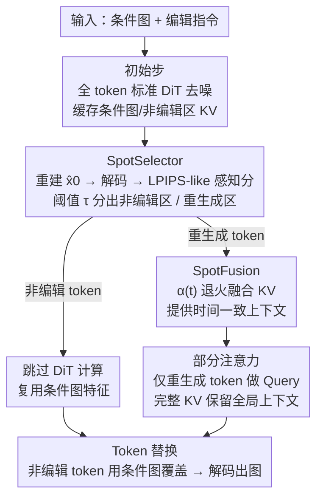

# SpotEdit: Selective Region Editing in Diffusion Transformers

**会议**: CVPR 2026  
**论文**: [CVF Open Access](https://openaccess.thecvf.com/content/CVPR2026/html/Qin_SpotEdit_Selective_Region_Editing_in_Diffusion_Transformers_CVPR_2026_paper.html)  
**代码**: https://biangbiang0321.github.io/SpotEdit.github.io/ （项目页）  
**领域**: 扩散模型 / 图像编辑  
**关键词**: 扩散 Transformer、指令图像编辑、区域选择、训练免训练、推理加速

## 一句话总结
SpotEdit 是一个无需训练的 DiT 图像编辑框架，利用"非编辑区域在去噪早期就快速收敛"这一现象，用感知相似度自动找出稳定 token 并把它们移出 DiT 计算、直接复用条件图特征，配合一个随时间退火的 KV 融合机制保住上下文，从而在 FLUX.1-Kontext 上做到 1.7×–1.95× 加速且编辑质量几乎不掉。

## 研究背景与动机
**领域现状**：当前主流的指令图像编辑（FLUX.1-Kontext、Qwen-Image-Edit 等）建立在 Diffusion Transformer（DiT）之上——把条件图编码成 token，和噪声 token 一起送进 transformer 层联合去噪。这种范式好处是只要给一句高层指令就能改图，不用人工提供 mask，可用性很高。

**现有痛点**：真实编辑任务里，绝大多数情况只改一小块区域（把足球换成向日葵、加一个人），但现有方法不分青红皂白地对**整张图的所有 token** 在每个时间步全量去噪。这带来两个具体问题：一是对本该保留的背景区域做冗余去噪，反而可能引入细微伪影、破坏原图；二是大量算力浪费在根本不需要改的区域上。

**核心矛盾**：编辑任务天然是**稀疏**的——只有一小撮 token 需要变，多数应该原样保留；但 DiT 的全量去噪范式把所有空间位置一视同仁。已有的扩散加速方法（TeaCache、TaylorSeer、ToCa 等）虽然能提速，却都在"全 token 层面"做特征复用/跳步，不区分编辑区与非编辑区，激进加速时质量损失恰恰集中在语义最重要的编辑区，得不偿失。

**切入角度**：作者观察去噪过程中各区域的时间收敛模式（论文 Figure 2）发现，在局部编辑任务里**非编辑区域会在很早的时间步就稳定下来**、和原图视觉一致，而编辑区域会一直演化到最后。既然模型自己已经"暴露"了哪些区域稳定、哪些还在精修，那就可以顺着这个信号：**只编辑需要编辑的部分**。

**核心 idea**：用感知相似度在线检测出已稳定的非编辑 token，把它们从 DiT 计算里直接踢掉、改用条件图特征复用；再用一个随时间退火的 KV 融合补回这些区域对编辑区的上下文贡献——以此把算力精准集中到真正要改的 token 上。

## 方法详解

### 整体框架
SpotEdit 是套在 FLUX.1-Kontext 这类基于 Rectified Flow 的 DiT 编辑器外面的、**无需训练**的推理时框架。它把去噪过程切成三段：① **初始步（Initial Steps）**——前几步照常对全部 token 做标准 DiT 去噪，同时把条件图和非编辑区的 KV 缓存下来供后面用；② **Spot 步（Spot Steps）**——每一步先由 **SpotSelector** 用 LPIPS-like 感知分把 token 分成"非编辑区"和"重生成区"，非编辑 token 直接跳过 DiT 计算，重生成 token 继续迭代去噪，期间由 **SpotFusion** 给注意力提供时间一致的条件 KV 缓存；③ **Token 替换（Token Replacement）**——最后一步把非编辑 token 直接用条件图 latent 覆盖，再解码成图，保证背景与原图严格一致。

整套方法围绕两个核心组件运转：SpotSelector 负责"判断哪些 token 不用算"，SpotFusion 负责"被跳过的 token 怎么继续给编辑区当上下文而不掉质量"。

### 关键设计

**1. SpotSelector：用感知相似度在线挑出"不用重画"的 token**

痛点是没有人工 mask 时，模型并不知道哪些区域该保留。SpotSelector 利用 Rectified Flow 的一个解析性质：在其线性插值动力学下，时刻 $t$ 的 latent 与完全去噪状态 $\hat{X}_0$ 存在闭式关系 $\hat{X}_0 = X_{t_i} - t_i \cdot v_\theta(X_{t_i}, C, t_i)$，因此每一步都能"提前预览"出当前的去噪结果并解码成图。和原图对比就能判断哪些区域早早稳定（=非编辑区）、哪些还在演化（=编辑区）。

关键是相似度怎么量——latent 空间的欧氏距离并不对齐人眼感知。作者借鉴 LPIPS，用 VAE 解码器的多层特征算 token 级感知分：

$$s_{\text{LPIPS}}(i) = \sum_{l \in L} w_l \left\| \hat{\phi}_l(\hat{X}_0)_i - \hat{\phi}_l(Y)_i \right\|_2^2$$

其中 $\phi_l(\cdot)$ 是解码器第 $l$ 层特征、$w_l$ 是层权重、$Y$ 是条件图 latent。再用阈值 $\tau$ 做二值路由 $r_{t,i} = \mathbb{1}[s_{\text{LPIPS}}(i) \le \tau]$：分到非编辑集 $R_t$ 的 token 整个从 DiT 计算里移除、直接复用条件图特征；分到重生成集 $A_t$ 的 token 继续走完整反向积分更新（公式 3）。这一步直接把扩散自身的收敛动态当信号用，既免了人工 mask，又保证选出的区域和模型的生成过程是对齐的。在最后一步还做一次轻量"latent 整合"——所有非编辑 token 解码前直接用条件图 latent 覆盖，确保背景像素级一致。

**2. SpotFusion：随时间退火的 KV 融合，补回被跳过 token 的上下文**

把非编辑 token 踢出计算虽然省了算力，却也抹掉了它们通过跨 token 注意力对编辑区贡献的上下文，naive 地丢弃会让编辑质量明显下降。一个直觉做法是缓存非编辑 token 或条件图的 KV 反复复用，但这会引入**时间不一致**：缓存的 KV 是某个时刻冻结的特征，而编辑区的 hidden state 一直在随时间步漂移；DiT 不像语言模型有静态 embedding，它的特征随时间步持续 drift，静态 KV 缓存会越来越对不齐，消融里证实这会明显掉质量。

作者先用 PCA 分析非编辑 token 的轨迹（论文 Figure 4）：非编辑 token 的 hidden state（x 分支）会在初始瞬态后**迅速贴近条件图轨迹**（y 分支），并随 $t \to 0$ 收敛到同一 latent 子空间。既然两者是平滑趋近而非突变，那就可以"渐进强化"而不是"静态缓存"。SpotFusion 据此对每个 block、每个时间步把缓存的非编辑特征朝条件图特征做插值：

$$\tilde{h}^{(b,t)}_x = \alpha(t)\, \tilde{h}^{(b,t+1)}_x + (1-\alpha(t))\, h^{(b)}_y, \quad \alpha(t) = \cos^2\!\left(\tfrac{\pi}{2}t\right)$$

同样的插值直接作用在 KV 上（$K^{(b)}_{t,i} \leftarrow \alpha(t)K^{(b)}_{t+1,i} + (1-\alpha(t))K^{(b)}_{y,i}$，V 同理）。$\alpha(t)$ 让表示**早期更依赖缓存的当前估计、后期逐渐切向条件图参考**，从而既保持时间相干、又避免边界伪影，而且整个过程不需要为非编辑区跑额外的去噪。

**3. 部分注意力：只让编辑 token 做 Query，但保留完整上下文**

有了 SpotFusion 提供的时间一致 KV 缓存，DiT 就能"用一小撮 Query 配一套完整 KV"来算注意力。去噪时只有重生成 token 需要前向传播，所以 Query 集被限制为重生成 token $A_t$ 加上指令 prompt token：$Q_{\text{active}} = [Q_P, Q_{A_t}]$。而非编辑区和条件图 token 虽然跳过了计算，它们的上下文影响仍需在场，于是 Key/Value 集通过拼接缓存特征补全：$K_{\text{full}} = [K_P, K_{A_t}, K^C_{R_t}, K^C_Y]$，V 同理。注意力只在 active query 上算：

$$\text{Attn} = \text{softmax}\!\left(\frac{Q_{\text{active}} K_{\text{full}}^\top}{\sqrt{d}}\right) V_{\text{full}}$$

这样算力精确落在真正发生编辑的地方，同时靠缓存 KV 维住全局相干——这是 SpotEdit 加速的直接来源（少算了非编辑区和条件图分支的前向）。

### 损失函数 / 训练策略
SpotEdit **完全无需训练**，是纯推理时框架，没有任何损失函数或微调。关键超参：base 模型用 flux-kontext-dev、$T=50$ 步、分辨率 $1024\times1024$、seed 42；SpotSelector 阈值 $\tau=0.2$；融合权重 $\alpha(t)=\cos^2(\pi t/2)$；条件图特征在初始阶段 $t=4$ 之后缓存并在剩余步里复用。另外引入一个**周期性 token reset** 机制防止数值误差累积。

## 实验关键数据

### 主实验
在 imgEdit-Benchmark 和 PIE-Bench++ 两个 benchmark 上，以 flux-kontext-dev 原始推理为基线对比缓存加速类（TeaCache、TaylorSeer）和精确编辑类（FollowYourShape）方法：

| 方法 | 数据集 | CLIP↑ | SSIMc↑ | PSNR↑ | DISTS↓ | 加速比↑ |
|------|--------|-------|--------|-------|--------|---------|
| Original (FLUX-Kontext) | imgEdit | 0.699 | 0.67 | 16.40 | 0.17 | 1.00× |
| TeaCache | imgEdit | 0.698 | 0.60 | 15.02 | 0.21 | 3.43× |
| TaylorSeer | imgEdit | 0.666 | 0.52 | 14.36 | 0.37 | 3.61× |
| FollowYourShape (single) | imgEdit | 0.686 | 0.47 | 11.73 | 0.27 | 0.33× |
| **SpotEdit (Ours)** | imgEdit | **0.699** | **0.67** | **16.45** | **0.16** | 1.67× |
| Original (FLUX-Kontext) | PIE-Bench++ | 0.741 | 0.791 | 18.76 | 0.136 | 1.00× |
| TeaCache | PIE-Bench++ | 0.735 | 0.764 | 18.89 | 0.144 | 3.59× |
| **SpotEdit (Ours)** | PIE-Bench++ | **0.741** | **0.792** | 18.73 | **0.136** | 1.95× |

关键对比：缓存类方法（TeaCache/TaylorSeer）加速比更高（3.4–3.9×），但 SSIM/DISTS 等结构与感知指标明显掉（SSIMc 从 0.67 跌到 0.52–0.60）；精确编辑类（FollowYourShape）不但没加速反而更慢（0.33×），还严重扭曲非编辑区（PSNR 掉 4.6+ dB）。SpotEdit 几乎不掉质量（多项指标与原模型持平甚至略升）的同时拿到 1.67×/1.95× 的加速，是质量-效率权衡最好的一档。在 imgEdit 八个子集的 VL 综合评分上，SpotEdit 取得 3.77 的最高分（原模型 3.91，其余加速基线 3.43–3.70）。

跨模型泛化：把 SpotEdit 套到 Qwen-Image-Edit 上，imgEdit 上质量几乎无损（+0.01 PSNR、−0.01 DISTS）配 1.59× 加速；PIE-Bench++ 上甚至提升质量（+0.03 SSIMc、+1.08 PSNR）配 1.72× 加速，说明该局部编辑策略不绑定单一架构。

### 消融实验
| 配置 | CLIP↑ | SSIMc↑ | PSNR↑ | DISTS↓ | 加速比↑ | 说明 |
|------|-------|--------|-------|--------|---------|------|
| Default (完整) | 0.741 | 0.792 | 18.73 | 0.136 | 1.95× | 完整 SpotEdit |
| w/o Reset | 0.738 | 0.782 | 17.10 | 0.154 | 2.25× | 去掉周期性 reset，更快但 PSNR 掉 1.6 dB |
| w/o Condition Cache | 0.787 | 0.801 | 19.155 | 0.131 | 1.24× | 每步重算条件特征，质量略升但慢很多 |

Token Fusion 的消融（论文 Figure 6 定性）对比三种变体：Naive Skip（直接丢非编辑 token、不缓存）会丢上下文；Static Token Fusion（缓存但不与条件图对齐）会有时间不一致伪影；只有 SpotFusion 自适应逐 token 融合才同时保住背景保真和编辑质量。

### 关键发现
- **SpotFusion 的"对齐"是关键**：静态 KV 缓存因为 DiT 特征随时间步 drift 而越来越失配，必须用 $\alpha(t)$ 退火把缓存特征朝条件图参考插值，才能消掉时间不一致带来的伪影。
- **Condition Cache 是个明确的效率-质量旋钮**：每步重算条件特征质量略好（PSNR 19.155 vs 18.730）但只有 1.24× 加速；缓存后掉到 18.73 但提到 1.95×——作者选缓存，说明这点质量代价换近 1.6× 的额外提速是值得的。
- **Reset 防的是数值误差累积**：去掉它能更快（2.25×）但 PSNR 直接掉 1.6 dB，而 reset 本身开销可忽略，是个低成本稳定器。
- **阈值 $\tau$ 在 [0.15, 0.25] 区间稳健**，太低会抖动、太高会侵入编辑区，最终取 0.2。

## 亮点与洞察
- **把"扩散自身的收敛速度差"当免费 mask 信号用**：不需要任何额外网络或人工标注，直接用 Rectified Flow 的闭式 $\hat{X}_0$ 预览 + LPIPS-like 感知分判稳定区，这个洞察既优雅又便宜，是全文最"啊哈"的地方。
- **加速来源和别人不一样**：主流加速做的是"跨时间步少算/跳步"，SpotEdit 做的是"跨空间少算"——只在编辑 token 上跑前向，天然契合编辑任务的空间稀疏性，因此能在几乎不掉质量的前提下提速，而缓存类方法掉质量是因为它们对编辑区也激进加速。
- **退火融合的思路可迁移**：用 $\alpha(t)=\cos^2(\pi t/2)$ 在"缓存的当前估计"和"参考特征"之间随去噪进度平滑切换，本质是处理"缓存特征会随时间漂移"的通用问题，可以借鉴到任何想复用扩散中间特征的加速场景。
- **完全 training-free + 可即插即用**：在 FLUX-Kontext 和 Qwen-Image-Edit 两个不同架构上都能直接套用，落地成本极低。

## 局限与展望
- **加速比相对温和**：1.67×–1.95× 明显低于缓存类方法的 3.4×+，对那些可以容忍一定质量损失、只追求极致速度的场景吸引力有限；本质上 SpotEdit 的提速上限受"编辑区占比"约束——改的区域越大，能跳过的 token 越少，收益越小（极端情况如全局风格迁移几乎无收益）。
- **依赖每步解码做感知打分**：SpotSelector 要把 $\hat{X}_0$ 解码出来算 LPIPS-like 分，这本身有开销，论文未充分拆解这部分相对净加速的占比；对超高分辨率或更多步数时这部分代价是否仍可忽略存疑。
- **阈值/缓存起点是手调超参**：$\tau=0.2$、缓存起点 $t=4$ 都是经验值，换 base 模型或换任务分布时是否需要重调、鲁棒性如何，正文只给了 imgEdit 上 $\tau$ 的区间，覆盖不够全面。
- **质量"持平"主要靠保住背景**：SpotEdit 的强项是非编辑区保真，但它并不提升编辑区本身的质量上限（受限于 base 模型），对"编辑区也需要更好生成"的需求帮不上。

## 相关工作与启发
- **vs 缓存加速类（TeaCache / TaylorSeer / ToCa）**：它们在全 token 层面跨时间步复用/预测特征，不区分编辑区与非编辑区，激进加速时质量损失集中在语义最重要的编辑区；SpotEdit 反过来在空间维度只算编辑 token，保住编辑区质量，但加速比更保守。
- **vs 精确编辑类（FollowYourShape / ControlNet / KV-injection）**：这类靠结构线索或 KV 注入在全图去噪中保留参考特征，仍是全图重生成，既慢又容易扭曲背景；SpotEdit 直接把非编辑 token 移出计算并用条件图覆盖，背景像素级一致。
- **vs mask-based inpainting 编辑**：传统 mask 方法虽然能把计算限制在 mask 内，但需要显式二值 mask、灵活性差；SpotEdit 用感知相似度自动判区，免 mask 又保留了"只算该算的"的好处。
- **vs 并发工作 RegionE**：两者都基于"非编辑区早收敛"的同一观察，但 RegionE 用区域差异做**自适应跳步**（时空加速），SpotEdit 用它做**空间 token 豁免**、目标是最大化背景保真——同一观察、两条不同的利用路径。

## 评分
- 新颖性: ⭐⭐⭐⭐ "edit only what needs editing" 的洞察简单有力，把空间稀疏性引入 DiT 编辑加速是个清晰的新角度，但与并发的 RegionE 共享同一核心观察。
- 实验充分度: ⭐⭐⭐⭐ 两个 benchmark + 跨模型验证 + 较完整的组件消融，定性对比也到位；user study 只在补充材料、$\tau$ 的完整敏感性也放补充，主文略偏精简。
- 写作质量: ⭐⭐⭐⭐ 动机—观察—方法的逻辑链顺畅，公式与 pipeline 交代清楚，三个组件分工明确。
- 价值: ⭐⭐⭐⭐ 训练免训练、即插即用、保真度高，对真实局部编辑场景实用性强；加速比温和、收益随编辑面积下降是其天花板。

<!-- RELATED:START -->

## 相关论文

- [\[CVPR 2026\] Region-Adaptive Sampling for Diffusion Transformers](region-adaptive_sampling_for_diffusion_transformers.md)
- [\[CVPR 2026\] EditMGT: Unleashing Potentials of Masked Generative Transformers in Image Editing](editmgt_unleashing_potentials_of_masked_generative_transformers_in_image_editing.md)
- [\[CVPR 2026\] DDiT: Dynamic Patch Scheduling for Efficient Diffusion Transformers](ddit_dynamic_patch_scheduling_for_efficient_diffusion_transformers.md)
- [\[CVPR 2026\] MRT: Masked Region Transformer for Layered Image Generation and Editing at Scale](mrt_masked_region_transformer_for_layered_image_generation_and_editing_at_scale.md)
- [\[CVPR 2026\] PixelDiT: Pixel Diffusion Transformers for Image Generation](pixeldit_pixel_diffusion_transformers_for_image_generation.md)

<!-- RELATED:END -->
