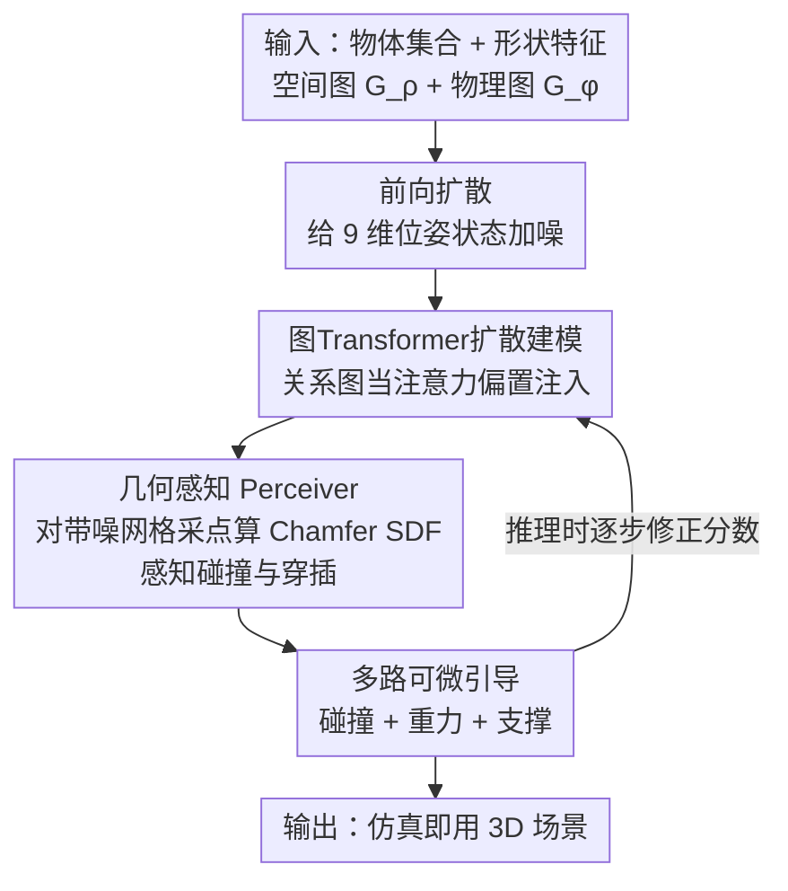

# SPREAD: Spatial-Physical REasoning via geometry Aware Diffusion

**会议**: CVPR 2026  
**论文**: [CVF Open Access](https://openaccess.thecvf.com/content/CVPR2026/html/Li_SPREAD_Spatial-Physical_REasoning_via_geometry_Aware_Diffusion_CVPR_2026_paper.html)  
**代码**: https://github.com/L-avenir/SPREAD  
**领域**: 扩散模型 / 3D视觉  
**关键词**: 3D场景生成, 引导扩散, 图transformer, 物理合理性, 几何感知

## 一句话总结
SPREAD 把"物体怎么摆才符合物理"做成一个引导扩散框架：用图 transformer 同时编码空间关系图和物理关系图，在每一步去噪时通过几何感知 Perceiver 直接"看"到带噪网格之间的碰撞与穿插，并在推理阶段用碰撞 / 重力 / 支撑三路可微引导把物体推到物理一致的位姿，从而生成在 Isaac Sim 里仿真也几乎不塌的、可直接用于具身 AI 的 3D 室内场景。

## 研究背景与动机
**领域现状**：自动 3D 场景生成正从"图形学审美布局"转向"服务具身 AI 的真实复杂场景"。主流做法分三派——基于优化的方法能给单场景做出物理合理的结果但不可扩展；程序化生成靠手写规则可大规模铺量但引入人为偏置、缺真实世界的杂乱多样性；数据驱动的深度生成模型（尤其扩散）直接从数据学场景分布，其中一类用文本/场景图当空间先验拿到了可控性。

**现有痛点**：这些数据驱动方法几乎都只建模**空间关系**（左/右/前/后），忽略**物理关系**（支撑、接触、重力），于是生成结果常出现物体悬浮、互相穿模；少数强调物理合理性的方法（如 Physcene）又用包围盒近似碰撞、为了物理稳定牺牲了关系语境，得到"稳定但布局不合理"的场景。更糟的是大家普遍用 3D-FRONT 这类只有粗粒度家具摆放的数据集，根本没有细粒度物体交互数据去学复杂物理关系。

**核心矛盾**：空间关系一致性与物理合理性这两件事，现有扩散框架是**割裂**建模的——要么只管布局对不对、要么只管物理稳不稳，没人在去噪过程里把两者**联合优化**，也没人在生成中途真正"感知"到网格级几何（碰撞/穿插发生在哪里）。

**本文目标**：造一个既忠实遵守空间+物理关系图、又在网格层面物理自洽（无碰撞、有支撑、服从重力）、且仿真即用的 3D 场景扩散生成器。

**切入角度**：人类摆物体时是同时用空间常识和物理直觉的（铅笔通常平躺、放进笔筒才竖起；杯子必须正放才能盛水）。作者据此主张：生成模型必须在去噪的每一步都显式地对"物体如何稳定交互、互相支撑、空间共存"做几何+关系推理，而不是只对最终布局做后处理。

**核心 idea**：把空间图与物理图作为可微先验注入图 transformer 扩散，配一个在每步去噪都基于带噪网格点云算 Chamfer 符号距离的几何感知模块，再在推理时叠加碰撞/重力/支撑三路可微引导——用"边生成边感知几何、边引导满足物理"取代"先生成布局再硬约束"。

## 方法详解

### 整体框架
SPREAD 的输入是一组待生成的物体（每个物体带形状特征）以及描述它们关系的两张图——空间关系图 $G_\rho$（成对相对方向）和物理关系图 $G_\phi$（支撑/接触/附着）；输出是每个物体的 3D 平移 $p$ 和 6 维连续旋转 $r$，组成一个物理一致、关系连贯的场景。整条管线是一个**引导扩散**：前向给 9 维状态（位置+旋转）加高斯噪声，反向用一个图 transformer 网络 $\epsilon_\theta(x_t, t, f, G_\rho, G_\phi)$ 逐步去噪。

它和别的场景扩散的根本区别在两处：① 反向去噪的**每一步**都把两张关系图当作偏置注入图注意力，同时还通过一个**几何感知 Perceiver** 对当前带噪网格采样点云、算碰撞/穿插，让网络在去噪途中就"看见"几何冲突；② 推理阶段额外叠一套**多路可微引导**，把碰撞、重力、支撑三种物理定律以梯度形式直接修正分数函数。训练阶段只学去噪网络（含几何感知），引导只在推理时启用。

### 关键设计

**1. 图 Transformer 扩散建模：把空间图与物理图当可微先验注入去噪**

针对"现有方法只建模空间关系、忽略物理关系，且两者割裂优化"的痛点，SPREAD 把场景表示成一个联合状态空间——每个物体 $o_j$ 用元组 $\langle p_j, r_j, f_j, \rho_j, \phi_j\rangle$ 表示，状态向量 $x_0 = \bigoplus_{j=1}^{N}[p_j \| r_j] \in \mathbb{R}^{N\times(3+6)}$（位置 3 维 + 连续 6 维旋转）。空间关系图 $G_\rho$ 和物理交互图 $G_\phi$ 都是 $N\times N$ 邻接矩阵，元素取值表示 $K$ 种关系类型。它们先经嵌入层映到连续隐空间 $E = \text{MLP}(\text{Embedding}(G))$，得到边嵌入 $E\in\mathbb{R}^{N\times N\times d_e}$，再作为**偏置项**注入图注意力层。每个去噪步通过扩散图块 $H_t^{l+1} = \text{GraphBlock}^l(H_t^l, G_\rho, G_\phi)$ 同时处理两类关系信息。关键在于：把离散关系投到连续特征空间后，**每个图块层内都能对空间关系与物理约束做联合优化**，而不是事后拼接——这正是"空间一致"和"物理合理"不再割裂的地方。

**2. 几何感知 Perceiver：每步去噪都基于带噪网格点云感知碰撞穿插**

针对"扩散途中网络看不到几何冲突、只能事后修"的痛点，SPREAD 不像前人那样依赖隐式 shape embedding，而是在**每个时间步 $t$** 对物体 $i$ 的带噪网格采样 $M$ 个点 $p_i^M$，计算到其他所有物体点云 $P_{\neg i}$ 的单向 Chamfer 距离，并用最近邻法向 $n_{nn}$ 赋符号，近似出一个有向距离场：

$$d_{scd}(p) = \min_{q\in P_{\neg i}} \|p-q\|_2 \cdot \text{sign}\big(n_{nn}^\top(p-q)\big)$$

这样得到形状为 $(B, N, M, 4)$ 的特征张量（前 3 通道是全局坐标，第 4 通道是 $d_{scd}$）。一个 Perceiver 模块通过交叉注意力把这些稀疏高维特征蒸馏成 $n$ 个 $d$ 维 token $f_{geo}$，让网络真正"感知到"碰撞和穿透。在模型架构里，物体节点的 9 维状态先加正弦位置编码、线性投影，再分别和**静态形状 token**（预训练 Michelangelo 编码器输出的 256×64 维、扩散全程不变，提供稳定形状先验）以及**动态几何 token** $f_{geo}$ 做顺序交叉注意力，融出"既懂形状又懂几何"的表示，再交给图注意力沿显式边传播；所有归一化层用 AdaLayerNorm 以时间步嵌入 $t_{emb}$ 为条件，使去噪时间感知。符号距离场的正负号是这个设计的精髓——它让网络分得清"靠近但没碰"和"已经穿模"，比包围盒近似精细得多。

**3. 多路可微引导框架：碰撞 / 重力 / 支撑三路梯度在推理时把物体推到物理一致位姿**

针对"光靠学到的分数函数不足以保证硬物理约束"的痛点，SPREAD 在推理时给反向过程叠一套可微引导，修正分数函数：$\nabla_{x_t}\log p_\gamma(x_t) = s_\theta(x_t, t) + \gamma\nabla_{x_t}\mathcal{G}(x_t)$，复合引导信号 $\mathcal{G} = \lambda_C \mathcal{G}_C + \lambda_H \mathcal{G}_H + \lambda_R \mathcal{G}_R$ 由三项组成。**碰撞引导** $\mathcal{G}_C$ 不用包围盒，而是基于不同网格的相交三角形直接量化碰撞：用 BVH 找出碰撞三角对集合 $C$，对每对用锥形距离场 CoDF 评估，$\mathcal{G}_C = \frac{1}{|C|}\sum_{a,b,a\neq b}\sum_{(i,j)\in C}\text{CoDF}(t_a^i, t_b^j)$，比包围盒近似更准更高效。**重力引导** $\mathcal{G}_H$ 对每个物体算它到支撑体的竖直偏移 $r_i = d_i - \epsilon$，惩罚悬浮（$r_i > \theta_H$）与穿插（$r_i < 0$）、容忍阈值内小偏差：$\mathcal{G}_H = \sum_{r_i>\theta_H \lor r_i<0}|r_i|$。**关系（支撑）引导** $\mathcal{G}_R$ 用物体在 XZ 平面投影凸包的重叠度近似支撑合理性：对有向支撑对 $(i,j)$，把 $i$ 落在 $j$ 投影凸包外的所有顶点 $V_{i,j}$ 到该凸包的最小欧氏距离 $s(\alpha,j)$ 求平均惩罚，$\mathcal{G}_R = \sum_{(i,j)\in E}\sum_{\alpha\in V_{i,j}}\frac{s(\alpha,j)}{|V_{i,j}||E|}$。三路引导各管一类物理违例——分别消除穿模、消除悬浮、维持正确支撑结构，合起来把生成结果推向稳定、富接触的真实场景。

### 损失函数 / 训练策略
训练只优化去噪网络：节点特征最终经 MLP 预测噪声 $\hat\epsilon$，最小化均方误差 $\|\hat\epsilon - \epsilon\|^2$。几何感知（Chamfer SDF + Perceiver）在训练时一并学习，使网络在去噪中具备几何约束意识；多路可微引导**仅在推理时**启用，无需额外训练。前向加噪遵循马尔可夫链 $q(x_t|x_{t-1}) = \mathcal{N}(x_t; \sqrt{1-\beta_t}x_{t-1}, \beta_t I)$。

## 实验关键数据

### 主实验
在 3D-FRONT（设计师精修家具场景）和 ProcTHOR（程序化生成、富小物体交互）两数据集上，对比 ATISS（自回归 transformer）、DiffuScene（非自回归扩散）、InstructScene（两阶段图框架）。指标含 FID（视觉保真）、Colmesh（网格碰撞率，越低越好）、GRecall（图召回，结构准确度）、ASD（平均支撑距离，越低接触越紧）、Stability（Isaac Sim 仿真后关系保持率）。

| 数据集 | 指标 | 本文 | 最佳baseline | 结论 |
|--------|------|------|----------|------|
| 3D-FRONT Bedroom | FID ↓ | 0.097 | 0.275 (ATISS) | 视觉保真大幅领先 |
| 3D-FRONT Livingroom | FID ↓ | 0.185 | 0.350 (InstructScene) | 领先 |
| ProcTHOR | GRecall ↑ | 0.979 | 0.964 (InstructScene) | 最高，布局最忠实 |
| ProcTHOR | Colmesh ↓ | 0.007 | 0.021 (InstructScene) | 碰撞率最低 |
| ProcTHOR | ASD ↓ | 0.121 | 0.260 (InstructScene) | 接触几乎无缝隙 |
| ProcTHOR | Stability ↑ | 0.950 | 0.886 (DiffuScene) | 仿真后最稳 |

在交互密集的 ProcTHOR 上，SPREAD 在每个物理指标上都超过所有 baseline；3D-FRONT 上 FID 也明显更优。

### 消融实验
在 ProcTHOR 上从 vanilla 扩散基线出发逐步加模块：

| 配置 | GRecall ↑ | Colmesh ↓ | ASD ↓ | Stability ↑ | 说明 |
|------|---------|---------|---------|---------|------|
| Ours (base) | 0.963 | 0.241 | 0.014 | 0.934 | 仅图扩散基线 |
| +Geometry | 0.965 | 0.225 | 0.012 | 0.938 | 加几何感知 Perceiver，碰撞率、ASD 下降 |
| +Guidance | 0.979 | 0.121 | 0.007 | 0.950 | 再加多路引导，全指标最优 |

### 关键发现
- **几何感知 Perceiver 与多路引导职责互补**：加 Geometry 主要小幅降碰撞与 ASD（让网络生成时就懂几何），而多路 Guidance 带来最大跃升——Colmesh 从 0.225 砍到 0.121、Stability 升到 0.950，说明推理时的物理梯度是物理合理性的主要来源。
- **三路引导各司其职**：碰撞引导去穿模、重力引导去悬浮、支撑引导维持正确支撑结构，合起来同时拿到最低 ASD、最高 GRecall、最佳仿真稳定性。
- **仿真即用**：Isaac Sim 仿真后 95% 的成对关系保持不变，baseline 则常出现物体位移和结构漂移——把物理推理放进生成过程而非后处理确有实效。
- **用户研究**：57 份有效回答中 88.6% 偏好 SPREAD（ATISS 0.9%、DiffuScene 6.1%、InstructScene 4.4%）。

## 亮点与洞察
- **符号距离场让扩散网络"看见"几何冲突**：在每步去噪对带噪网格采点算带符号的 Chamfer 距离，把"靠近 vs 已穿模"用正负号区分开，比包围盒近似精细得多——这种"生成途中实时感知几何"的思路可迁移到任何需要避碰的布局/装配生成任务。
- **物理定律即可微引导**：把碰撞（CoDF on 三角网格）、重力（竖直偏移阈值）、支撑（XZ 投影凸包重叠）三条物理常识各写成一个可微惩罚项叠到分数函数上，无需重训就能注入硬约束——这是"训练学分布、推理加约束"解耦范式的漂亮示范。
- **空间图+物理图双先验**：显式引入"支撑/接触"物理关系图（而非只有方向关系），是它在富交互 ProcTHOR 上碾压只建模空间关系方法的根因。

## 局限与展望
- 作者承认：受数据集限制，目前**只能做室内场景**，未来想借图像条件范式扩到室外。
- **推理慢**：SPREAD 单场景 14.72s，远慢于 ATISS（0.02s）、InstructScene（2.58s）、DiffuScene（10.25s）——这是为建模复杂物体关系、追求质量与结构完整性付出的代价；作者计划用 flow matching 等高效替代降本。
- 作者还想把扩散直接定义在 SE(3) 流形上，更原生地利用旋转的几何先验。
- ⚠️ 自己发现的局限：三路引导各带权重 $\lambda_C/\lambda_H/\lambda_R$，论文未充分披露权重敏感性；BVH+CoDF 的网格级碰撞计算在物体数多时的开销可能正是推理慢的主因，对超大场景的可扩展性存疑。

## 相关工作与启发
- **vs Physcene**：Physcene 用预测包围盒近似碰撞、靠引导强行物理稳定但牺牲关系语境（稳定却布局不合理）；SPREAD 用网格级+关系级引导，碰撞算到三角形、并保留富物体交互，做到既稳又布局合理。
- **vs InstructScene / DiffuScene**：它们是只建模空间关系（图先验或扩散）的代表，忽略物理约束故易悬浮/穿模；SPREAD 额外引入物理关系图与多路物理引导，在 ProcTHOR 全物理指标领先。
- **vs ATISS**：ATISS 是自回归集合 transformer，无显式几何/物理推理；SPREAD 的非自回归扩散+几何感知在物理合理性与仿真稳定性上明显更优（代价是推理更慢）。

## 评分
- 新颖性: ⭐⭐⭐⭐ 几何感知符号距离场 + 三路可微物理引导 + 空间/物理双图先验的组合在场景扩散里属首创性整合。
- 实验充分度: ⭐⭐⭐⭐ 两数据集、四 baseline、消融逐模块拆解、Isaac Sim 仿真验证 + 用户研究，较完整；权重敏感性披露偏少。
- 写作质量: ⭐⭐⭐⭐ 动机—方法—实验逻辑清晰，公式与图示到位。
- 价值: ⭐⭐⭐⭐ 直接产出仿真即用场景、服务具身 AI 数据生成，实用价值高，推理速度是落地短板。

<!-- RELATED:START -->

## 相关论文

- [\[CVPR 2026\] Probing and Bridging Geometry–Interaction Cues for Affordance Reasoning in Vision Foundation Models](probing_and_bridging_geometry-interaction_cues_for_affordance_reasoning_in_visio.md)
- [\[CVPR 2026\] SpatialDiff: 3D-Aware Object Movement via Implicit Spatial Modeling](spatialdiff_3d-aware_object_movement_via_implicit_spatial_modeling.md)
- [\[ICML 2026\] Geometry-Aware Tabular Diffusion](../../ICML2026/image_generation/geometry-aware_tabular_diffusion.md)
- [\[CVPR 2026\] Circuit Mechanisms for Spatial Relation Generation in Diffusion Transformers](circuit_mechanisms_for_spatial_relation_generation_in_diffusion_models.md)
- [\[CVPR 2026\] GeoRK2: Geometry-Guided Runge-Kutta Integration for Diffusion Transformer Acceleration](geork2_geometry-guided_runge-kutta_integration_for_diffusion_transformer_acceler.md)

<!-- RELATED:END -->
