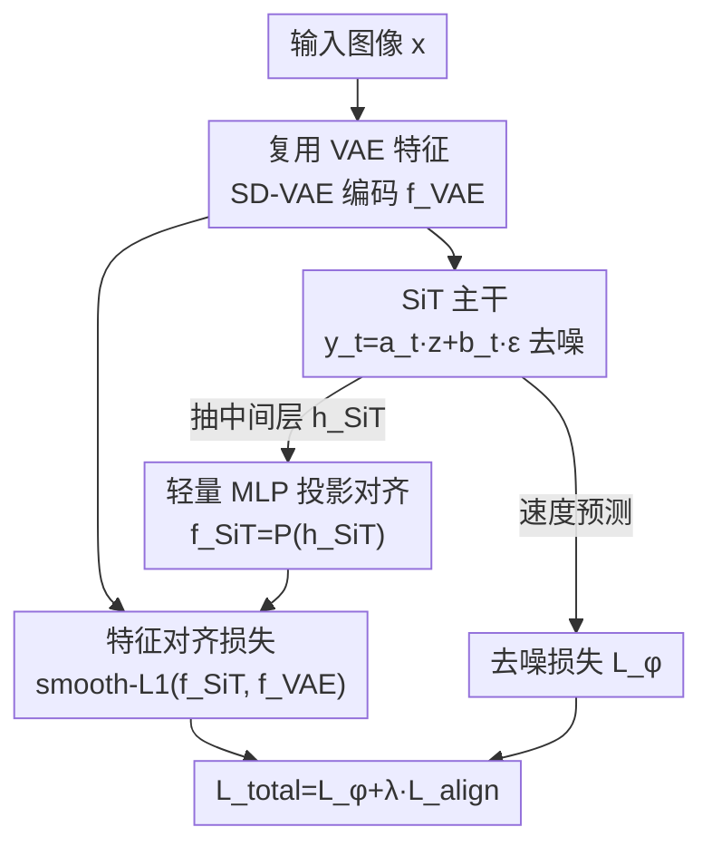

# SRA 2: Variational Autoencoder Self-Representation Alignment for Efficient Diffusion Training

**会议**: CVPR 2026  
**论文**: [CVF Open Access](https://openaccess.thecvf.com/content/CVPR2026/html/Wang_SRA_2_Variational_Autoencoder_Self-Representation_Alignment__for_Efficient_Diffusion_CVPR_2026_paper.html)  
**代码**: 无  
**领域**: 扩散模型  
**关键词**: 扩散 Transformer、训练加速、表征对齐、VAE 特征、SiT

## 一句话总结
SRA 2 直接拿 latent diffusion 第一阶段那个现成的 SD-VAE 编码特征当监督信号，用一个轻量 MLP 把 SiT 中间层特征投影过去做对齐，不引入任何外部表征编码器、也不维护双模型 teacher，就把扩散 Transformer 的训练收敛加速了最多 7×，且只多了 4% 的 GFLOPs。

## 研究背景与动机
**领域现状**：latent diffusion（LDM）系的扩散 Transformer（DiT / SiT）是当下高保真图像生成的主力，但它们有个老毛病——训练收敛极慢，常常要跑几百万甚至上千万次迭代才能达到满意的 FID。为了加速，社区出现了三条主流路线：① 掩码建模（MaskDiT、SD-DiT，要额外加一个 diffusion decoder）；② 外部表征引导（REPA 用 DINOv2 这类大规模预训练编码器去对齐扩散模型中间层）；③ 自对齐（SRA 用一个 EMA teacher DiT 提供更干净的特征做自监督）。

**现有痛点**：这三条路线都要为"监督信号"付出额外代价。REPA 这类方法要在训练时挂一个外部大编码器，不仅增加算力，还把模型死死绑在外部预训练知识上——一旦换到 T2I / T2V / T2A 这种领域，合适的外部编码器往往根本不存在（论文引 Flux.2 为佐证）。SRA 这类自对齐方法要维护一个额外的 teacher EMA DiT，每步训练多一次前向传播。

**核心矛盾**：要给扩散模型补"视觉先验 / 语义引导"以加速收敛，似乎就绕不开"额外的外部模型或额外的前向开销"。作者追问：有没有一个更简单、更轻量、又不依赖外部编码器或双模型的引导来源？

**切入角度**：作者注意到 LDM 框架内部其实**自带**一个被忽视的优质特征源——第一阶段那个预训练好的 SD-VAE。它是在大规模自然图像上训练的、具备高质量重建能力，因此其编码特征天然包含了纹理细节、低层结构模式和基础语义信息。论文用 PCA 可视化对比了 SD-VAE 特征和 SiT 各层 latent 特征，发现前者在刻画视觉概念、保持结构完整性和语义连贯性上明显更强。更关键的是：训练第二阶段扩散模型时，这些 VAE 特征本来就被离线预提取并缓存好了，**复用它们零额外提取成本**。

**核心 idea**：把现成的 SD-VAE 特征当作扩散 Transformer 中间层的对齐目标——既不需要外部表征编码器，也不需要双模型 teacher，只插一个轻量 MLP 投影层 + 一个特征对齐损失，就能把富含视觉先验、无噪声的目标灌进扩散学习过程。

## 方法详解

### 整体框架
SRA 2 完整保留了 SiT 的去噪训练框架，只在中间插入一条"对齐支路"。训练时一张图像被 SD-VAE 编码成 latent 特征 $f^{VAE}$（同时这个 latent 也是 SiT 的生成目标，所以是零额外成本的复用）；SiT 按插值过程 $y_t = a_t z + b_t \epsilon$ 把带噪 latent 喂进网络做去噪预测，同时从某个中间隐藏层抽出特征 $h^{SiT}$，经一个轻量 MLP $P(\cdot)$ 投影到与 $f^{VAE}$ 同维度的空间得到 $f^{SiT} = P(h^{SiT})$，再用对齐损失把 $f^{SiT}$ 拉向 $f^{VAE}$。最终损失是 SiT 原本的去噪损失加上这条对齐损失的加权和。推理阶段 MLP 和对齐支路完全丢弃，模型结构与原版 SiT 一模一样。

### 关键设计

**1. 复用预提取 VAE 特征作内生引导：把"现成的东西"当监督信号**

这是全文的命门。前面三条加速路线之所以都贵，是因为它们都从模型**外部**找监督信号（外部编码器 / teacher DiT），而 SRA 2 直接把 LDM 第一阶段输出的 SD-VAE 特征拿来当引导目标。对一张 $3\times256\times256$ 的输入图，SD-VAE 编码器输出特征张量 $f^{VAE}\in\mathbb{R}^{C\times H\times W}$（形状为 $4\times32\times32$）。关键在于：第二阶段训练扩散模型时，$f^{VAE}$ 本来就被离线预提取、存好备用了，所以拿它当对齐目标是"零额外特征提取成本"——既不用挂外部编码器，也不用 teacher 多跑一次前向。作者用 PCA 可视化论证了为什么 VAE 特征配当老师：它在纹理细节、结构完整性、语义连贯性上都明显优于 SiT 自身的 latent 表征。由此带来的副作用反而是优点：抛弃外部编码器意味着不再依赖固定的预训练"知识"，从而支持真正的领域专属训练（这也是它能泛化到 T2I 的原因）。

**2. 轻量 MLP 投影 + smooth-L1 特征对齐损失：跨过 SiT 与 VAE 的特征空间鸿沟**

SiT 中间层特征 $h^{SiT}$ 和 VAE 特征 $f^{VAE}$ 处在差异很大的特征空间（PCA 图里可见），不能直接对齐。SRA 2 用一个轻量 MLP $P(\cdot)$ 做非线性 + 维度变换，把 $h^{SiT}$ 投到 $f^{VAE}$ 所在空间。对齐用的是逐元素 smooth-L1 损失，记 $\Delta f = f^{SiT} - f^{VAE}$：

$$\mathcal{L}_{\text{align}} = \mathbb{E}_{z,\epsilon,t}\left[\sum_{i=1}^{N}\begin{cases}\frac{1}{2\beta}(\Delta f_i)^2 & |\Delta f_i|\le\beta\\[2pt]\frac{|\Delta f_i|}{\beta}-\frac{1}{2} & \text{otherwise}\end{cases}\right]$$

其中 $N = C\times H\times W$，阈值 $\beta=0.05$ 控制二次区与线性区的切换点。smooth-L1 兼顾了 L2 在小误差时的平滑梯度和 L1 在大误差时的鲁棒性，消融里它确实优于纯 $\ell_1$、$\ell_2$ 和 cosine。这个设计灵感来自深监督（deep supervision）——让中间层直接被一个信息丰富、无噪声的目标牵引，从而把视觉先验注入扩散学习过程。值得注意的是 MLP 不能太浅：2 层（1M 参数）效果明显次于 5 层（8M 参数），因为两个特征空间差距大，需要足够深的变换才能对齐。

**3. 浅层 + 全时间步对齐：把先验喂到对的地方、对的时刻**

对齐应该加在网络的哪一层、哪些噪声水平上，直接决定效果。消融发现：① **深度上越早越好**——在第 2 层对齐时 SiT-B/2 拿到最佳 FID 28.89（比基线降 4.13），随着对齐层加深效果逐渐变差，作者推测深层负责精细细节和高级语义，已超出 VAE 特征能提供的范畴，硬加约束反而会破坏深层对这些细节的自然精修（据此 B/L/XL 分别选用第 2/8/8 层）。② **时间步上全程覆盖最好**——在完整范围 $t\in[0,1]$ 对齐优于只在 $[0,0.5]$ 或 $[0.5,1]$：低噪声阶段 VAE 的纹理与结构帮助精修连贯表征，高噪声阶段 VAE 的视觉属性帮模型对抗退化，两者互补，所以全程施加才能稳定吃到 VAE 引导。最终训练目标是去噪损失与对齐损失的加权和：

$$\mathcal{L}_{\text{total}} = \mathcal{L}_{\phi} + \lambda\cdot\mathcal{L}_{\text{align}},\quad \lambda=1.0$$

消融显示 $\lambda=1.0$ 在主要指标上整体最优。

## 实验关键数据

实验全部在 ImageNet 256×256 上，沿用 SiT / REPA 的训练配置（AdamW、lr 1e-4、batch 256、SD-VAE 提特征），采样用 SDE Euler–Maruyama 250 步。

### 主实验：训练收敛加速（无 CFG，Table 2）

| 模型 | 迭代数 | FID↓ | 对照 |
|------|--------|------|------|
| SiT-B/2 | 400K | 33.0 | 基线 |
| SiT-B/2 + SRA 2 | 400K | **28.9** | 降 4.1 |
| SiT-L/2 | 400K | 18.8 | 基线 |
| SiT-L/2 + SRA 2 | 400K | **14.3** | 超过 XL/2 跑 600K 的 14.6 |
| SiT-XL/2 | 7M | 8.3 | 基线（700 万步） |
| SiT-XL/2 + SRA 2 | 1M | **8.2** | 7× 训练加速且更好 |
| SiT-XL/2 + SRA 2 | 4M | **6.6** | 继续提升 |

亮点是 SiT-XL/2 上只跑 1M 步（8.2）就追平基线跑 7M 步（8.3），相当于约 7 倍训练加速。

### 兼容性 & SOTA 对比（带 CFG，Table 3）

| 方法 | Epochs | FID↓ | IS↑ | 外部依赖 |
|------|--------|------|-----|---------|
| SiT-XL/2 (基线) | 1400 | 2.06 | 270.3 | ✗ |
| + SRA [18] | 800 | 1.58 | 305.7 | ✓ teacher DiT |
| + REPA [44] | 800 | 1.42 | 311.4 | ✓ DINOv2 |
| + REG [39] | 800 | 1.36 | 299.4 | ✓ 编码器 |
| **+ SRA 2** | 200 | 1.98 | 284.5 | **✗ 无** |
| **+ SRA 2** | 800 | **1.52** | **316.2** | **✗ 无** |

SRA 2 在 800 epoch 拿到 FID 1.52 / IS 316.2，FID 与 REPA 的 1.42 相当、IS 反超（316.2 vs 311.4），而且全程**零外部依赖**。它还能叠加在别的方法上：和 REPA 组合在 100K/200K/400K 分别再降 3.1/1.9/1.1，和 VAVAE 组合把 400K 的 FID 从 4.9 进一步降到 4.4。

### 消融实验（SiT-B/2，400K，无 CFG，Table 1）

| 配置 | FID↓ | 说明 |
|------|------|------|
| Vanilla SiT-B/2 | 33.02 | 基线 |
| 对齐第 2 层 | **28.89** | 最佳深度 |
| 对齐第 6 层 | 32.44 | 太深，先验失效 |
| 对齐第 8 层 | 36.20 | 比基线还差 |
| 时间步 $[0,1]$ | **28.89** | 全程覆盖最佳 |
| 时间步 $[0,0.5]$ | 30.04 | 只低噪声 |
| smooth-ℓ1 | **28.89** | 最佳目标 |
| cosine / ℓ1 / ℓ2 | 29.30 / 29.50 / 29.40 | 均略逊 |
| λ=1.0 | **28.89** | λ=0.1 → 30.10 |
| 5-layer MLP | **28.89** | 2-layer → 31.32 |

### 关键发现
- **对齐深度最敏感**：从第 2 层（28.89）一路退化到第 8 层（36.20，比基线 33.02 还差），说明把 VAE 先验加到深层不仅无益反而有害——深层在做超出 VAE 能力的精细/语义精修，被强行对齐会受干扰。
- **计算开销极小**：Table 5 显示 SRA 2 相对 SiT-XL/2 基线只增加约 4% 的 GFLOPs，且无任何外部引导模型的特征提取成本（teacher 那次前向被省掉了）。
- **泛化到 T2I**：在 MS-COCO 上用 MMDiT 做骨干，SRA 2 把 FID 从 5.08 降到 4.67、PickScore 从 20.54 提到 20.92，证明不绑外部编码器的设计在文生图这类没有现成外部编码器的场景同样可用。

## 亮点与洞察
- **"监督信号其实就在管线里"**：最妙的一点是它没有去找新东西，而是发现 LDM 第一阶段那个本就缓存好的 VAE 特征可以白嫖当对齐目标——把"零额外成本"做到了字面意义上。这种"复用已有资产"的思路可迁移到任何两阶段训练系统。
- **用 PCA 可视化先论证"VAE 特征配当老师"再动手**：先用证据（Fig. 2）说明 VAE 特征比 SiT latent 更会刻画视觉概念，方法动机因此非常扎实，不是拍脑袋选目标。
- **浅层对齐 + 全时间步**这一组配置很有指导性：它揭示了表征引导应该作用在网络早期、且贯穿所有噪声水平，这个经验对设计其它扩散对齐方法有直接参考价值。

## 局限与展望
- 论文主要在 ImageNet 256×256 + SiT 系列上验证，更高分辨率、视频/音频生成（T2V/T2A）虽被作为动机提及但未充分实验，泛化性还需更多证据。
- 对齐目标的"天花板"受限于 SD-VAE 本身的表达能力——VAE 只编码了纹理/结构/基础语义，缺乏高级语义；这也解释了为何对齐深层会变差。⚠️ 当任务需要强语义引导时，纯 VAE 特征可能不如 DINOv2 这类语义编码器（Table 3 中 800 epoch 的 FID 1.52 仍略逊于 REPA 的 1.42 和 REG 的 1.36）。
- MLP 需要 5 层（8M 参数）才能跨过特征空间鸿沟，说明 SiT 与 VAE 空间差距不小；能否用更轻或更结构化的投影、或反过来缩小这个鸿沟，是可探索方向。

## 相关工作与启发
- **vs REPA / REG**：它们用外部 DINOv2 编码器对齐扩散中间层，FID 略低（1.42 / 1.36）但要挂外部大模型、且在没有合适编码器的领域（T2I/T2V/T2A）难用；SRA 2 用内生 VAE 特征，FID 接近（1.52）、IS 反超，且零外部依赖、可跨领域。
- **vs SRA**：SRA 用 EMA teacher DiT 做双模型自对齐，每步多一次前向；SRA 2 砍掉 teacher，用现成 VAE 特征，开销只增 4% GFLOPs，同 epoch 下 FID/IS 都更好。
- **vs MaskDiT / SD-DiT**：掩码建模要额外加 diffusion decoder；SRA 2 不动架构，SiT-XL/2+SRA 2 在 200 epoch（FID 1.98）就超过 MaskDiT 1600 epoch、在 100 epoch 就超过 SD-DiT 480 epoch。
- **vs REPA-E / VAVAE**：这两者通过训练/改造 VAE 来加速；SRA 2 不训练也不压缩 VAE，直接复用预提取特征做样本级对齐，还能和 VAVAE 叠加再降 FID（4.9 → 4.4）。

## 评分
- 新颖性: ⭐⭐⭐⭐ "复用现成 VAE 特征当对齐目标"切口巧、动机扎实，但本质是 REPA 范式换了个更便宜的监督源
- 实验充分度: ⭐⭐⭐⭐ 多尺度收敛、SOTA 对比、完整消融、计算开销、T2I 泛化都覆盖，主要缺高分辨率/视频验证
- 写作质量: ⭐⭐⭐⭐ 用 PCA 可视化把动机讲透，pipeline 图（Fig.3）四种范式对比清晰
- 价值: ⭐⭐⭐⭐ 零外部依赖 + 4% 开销换 7× 加速，工程实用性强、易落地复现

<!-- RELATED:START -->

## 相关论文

- [\[ICLR 2026\] Latent Diffusion Model without Variational Autoencoder](../../ICLR2026/image_generation/latent_diffusion_model_without_variational_autoencoder.md)
- [\[CVPR 2026\] VA-π: Variational Policy Alignment for Pixel-Aware Autoregressive Generation](va-p_variational_policy_alignment_for_pixel-aware_autoregressive_generation.md)
- [\[CVPR 2026\] Efficient and Training-Free Single-Image Diffusion Models](efficient_and_training-free_single-image_diffusion_models.md)
- [\[CVPR 2026\] When Local Rules Create Global Order: Self-Organized Representation Learning for Latent Diffusion Models](when_local_rules_create_global_order_self-organized_representation_learning_for_.md)
- [\[CVPR 2026\] ExpPortrait: Expressive Portrait Generation via Personalized Representation](expportrait_expressive_portrait_generation_via_personalized_representation.md)

<!-- RELATED:END -->
