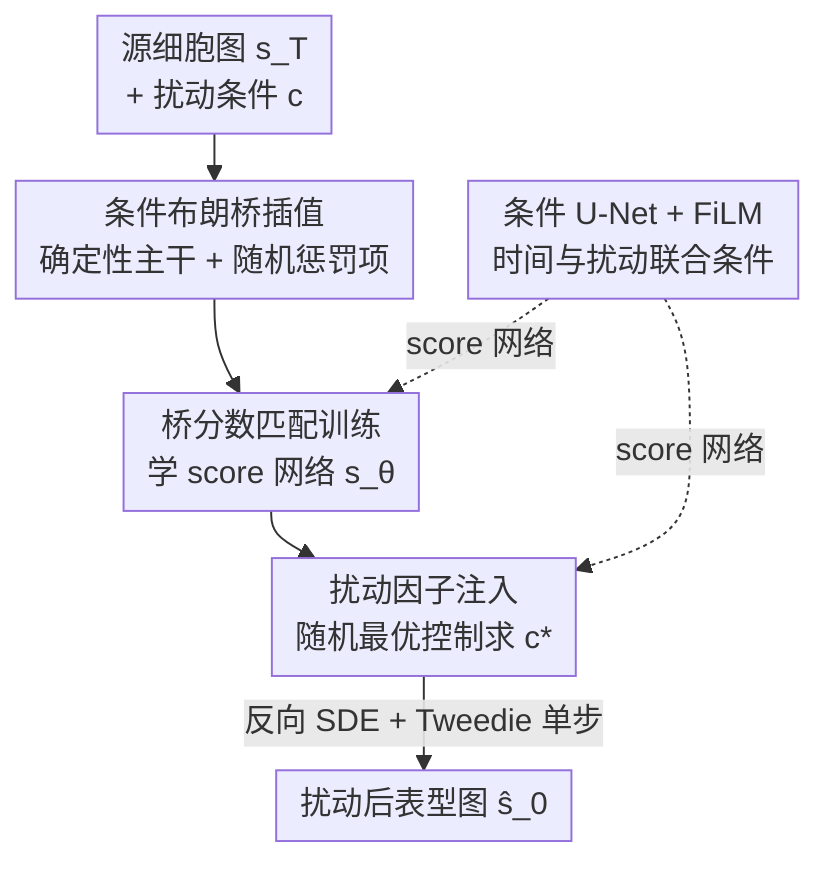

# Steering Where to Diffuse: Generative Modeling of Phenotypic Response Simulation with Steered Diffusion Bridge

**会议**: CVPR 2026  
**论文**: [CVF Open Access](https://openaccess.thecvf.com/content/CVPR2026/html/Zhang_Steering_Where_to_Diffuse_Generative_Modeling_of_Phenotypic_Response_Simulation_CVPR_2026_paper.html)  
**代码**: 无  
**领域**: 扩散模型 / 生成式建模 / 细胞表型仿真  
**关键词**: 扩散桥, 布朗桥, 随机最优控制, 表型响应仿真, 细胞形态生成

## 一句话总结
SimuSDB 把"给定一张未扰动细胞图、预测它在某种药物/基因扰动下会变成什么形态"这件事建模成一条从源细胞分布到扰动后分布的**随机扩散桥**：用条件布朗桥让轨迹在确定性主干周围发散以覆盖表型多样性，再把"生成结果要符合特定扰动表型"这个约束转写成**随机最优控制问题**来引导漂移项，在 BBBC021、RxRx1、JUMP 等基准上的 FID/KID 全面超过扩散、flow matching 和 GAN 基线。

## 研究背景与动机

**领域现状**：细胞表型响应仿真（phenotypic response simulation）想用计算模型预测细胞在化学小分子或基因扰动（CRISPR 敲除、ORF 过表达）下的形态变化，从而做"in silico"药物筛选，省下动辄数月、横跨多个批次的高通量成像实验。主流做法从早期的判别式/端到端预测模型（如 GAN 风格迁移的 IMPA），发展到近年用扩散模型、flow matching 这类生成式范式去学习数据流形上的轨迹。

**现有痛点**：两条主流生成路线各有硬伤。**纯噪声起点的扩散模型**（如 PhenDiff）要从各向同性高斯噪声出发、经几百上千步去噪才能覆盖整个分布，中间大量状态缺乏数据流形的显式引导，容易偏离真实表型轨迹；而**flow matching** 虽然用确定性最优传输路径更直接，但被线性插值假设束缚——所有从同一源点出发的轨迹都被压在连接源点和目标点的**同一条直线子空间**里，切向量恒指向 $s_T - s_0$，无法探索表型多样性，样本不均时还会过早收敛到训练数据的统计均值。

**核心矛盾**：细胞对同一扰动的响应本身是**高度随机、多模态**的——一个分子扰动能把一群细胞推向几个不同的表型态或沿发散的连续演化轨迹。判别式模型天然抓不住这种多模态分布；确定性生成模型则把多样性"拍平"成单一轨迹。再加上跨批次实验的**批次效应**（batch effect）信号有时比真实表型变化还强，模型容易把实验伪影误当扰动特征。

**本文目标**：构造一个能在两个**任意复杂分布**（源细胞态 ↔ 扰动后表型态）之间映射的生成模型，既保持端点守恒（生成必须从真实源细胞图出发、落到目标表型），又能发散出多样轨迹，还能被扰动规则**显式引导**。

**切入角度**：作者注意到扩散桥（diffusion bridge）/ 薛定谔桥这套框架天生支持在任意配对分布间建立随机传输，而把源细胞图当作"信息性先验"代替高斯噪声，就避开了纯噪声起点的中间态漂移问题；再借布朗桥引入受控随机性来打破直线子空间。

**核心 idea**：用**条件布朗桥**替代线性插值给轨迹"撒开"以恢复多样性，再把"生成要符合扰动表型"转写成**随机最优控制**来 steer 漂移项的方向——一句话就是"既要让桥发散得开（diffuse），又要 steer 它发散到对的地方"。

## 方法详解

### 整体框架
SimuSDB 的输入是一张源细胞图像 $s_T = s_1$（未扰动/控制态，作为扩散桥的起点先验）和一个扰动条件 $c$（化学分子用分子指纹、基因用 one-hot 编码），输出是扰动后的表型图像 $s_0$。整条管线分三件事：**(1)** 用条件布朗桥在源态 $s_T$ 和目标态 $s_0$ 之间定义一族**随机插值轨迹**，并训练一个分数网络去拟合桥的条件 score；**(2)** 推理时把"生成结果要贴合扰动 $c$ 的表型"形式化为**随机最优控制**问题，得到解析的最优控制策略 $c^*_t$ 注入反向 SDE 的漂移项，steer 生成方向；**(3)** 用条件 U-Net 作为 score 网络，时间步和扰动条件经 FiLM 注入每个残差块。注意"扩散方向"由前者负责（让轨迹发散覆盖多样性），"steer 去哪"由后者负责（把发散约束到目标表型）。

### 关键设计

**1. 条件布朗桥随机插值：给确定性轨迹"撒开"以恢复表型多样性**

针对 flow matching 把所有轨迹困在一维直线子空间、无法表达多模态表型的痛点，SimuSDB 在确定性插值主干上叠加一个**布朗运动惩罚项**。先定义确定性插值骨架 $I_t(s_0, s_T, t) = \alpha_t s_0 + \beta_t s_T$，其中系数满足 $\alpha_t + \beta_t = 1$、$\alpha_t$ 单调递减而 $\beta_t$ 单调递增（边界条件 $I_0 = s_0$、$I_T = s_1$）。然后引入随机插值：

$$s_t = \underbrace{\alpha_t s_0 + \beta_t s_T}_{I_t(s_0, s_T, t)} + \underbrace{\sigma_t B_t(s_0, \beta_t s_T, t)}_{\text{轨迹惩罚项}}$$

这里 $\sigma_t$ 是时变扩散系数且强制 $\sigma_0 = \sigma_T = 0$，保证两个端点被精确锚定（生成必须从真实源图出发、落到真实目标）；$B_t$ 是标准布朗运动，让从同一源点出发的轨迹能在确定性路径周围的邻域里发散探索。在 $f \equiv 0$、$g \equiv 1$、$\nabla_{s_t} \log q(s_T = s_1 | s_t) := (s_T - s_t)/(1-t)$ 这组条件下布朗桥成立，惩罚项是零均值、方差 $t(1-t)$ 的高斯过程，于是条件分布可解析写成 $p(s_t | s_0, T) = \mathcal{N}(s_t; I_t(s_0, s_T, t), t(1-t)\sigma_t^2 E_d)$。当 $\sigma_t = 0$ 时退化为确定性插值。它的妙处在于：即便模型倾向学接近 $I_t$ 的轨迹，惩罚项也把可达路径空间从**一维直线**扩展到了 $d$ 维流形，且端点处方差归零不破坏守恒——这正好对上细胞响应"同一扰动、多种表型"的随机异质本质。

**2. 随机最优控制引导：把"生成要符合扰动表型"转写成可解析求解的控制问题**

光把轨迹撒开还不够，发散得"对"才行。作者把扰动因子 $c_t := c(s_t, t)$ 作为控制项注入桥过程的反向 SDE：$ds_t = [f(s_t, t) - g^2(t)\nabla_{s_t}\log q(s_t)] + g(t)(c_t\, dt + dw_t)$。随后定义带约束的代价函数：

$$f_c(s_t, t) = \mathbb{E}\!\left[ l_c(s_1) + \int_0^T \tfrac{1}{2} g^2(t)\|c_t\|^2\, dt \right]$$

其中终端代价 $l_c(s_1)$ 衡量生成的最终图像与扰动 $c$ 对应目标表型的偏离，积分项惩罚控制幅度、防止过度偏离原布朗桥轨迹。按随机最优控制理论，最优策略有解析形式 $c^*_t = g(t)\nabla_s \log \psi(s_t, t)$，其中 desirability 函数 $\psi(s_t, t) = \mathbb{E}_{Q_0}[e^{-l_c(s_1)} | s_t]$。理论上用该最优控制采样，终端分布会收敛到 $Q^*(s_1) \propto p(s_1 | s_0, c)\cdot e^{l_c(s_1)}$，其中 $e^{l_c(s_1)}$ 充当重要性权重，把终端分布集中到满足特定扰动表型的区域。

由于直接算 $\psi$ 需要对所有从 $s_t$ 到 $s_T$ 的轨迹积分、计算上不可行，作者采用一个 Jensen 不等式下界近似：每步在 $t$ 处采样 $N$ 个候选下一状态 $\{s^{(i)}_{t+\Delta t}\}$，用 Tweedie 公式单步估出各自的最终图 $\{\hat s^{(i)}_{t+\Delta t}\}$，再选使代价 $l_c(\hat s_1)$ 最小的候选。对凸的 $l_c$，在期望处求代价不大于对所有轨迹的最优代价。这套设计让"扰动特异性"在采样时被实时 steer 进去，而不是事后靠 classifier guidance 硬拽。

**3. 条件 U-Net + FiLM 联合条件：把时间步和扰动统一注入 score 网络**

score 网络用条件 U-Net（编码器-解码器 + skip connection 保留多尺度空间特征）。时间步 $t$ 经正弦位置编码 + 两层 MLP 映射到嵌入维度；扰动条件 $c$（化学分子的分子指纹 / 基因的 one-hot）经线性层投到同一嵌入空间；两个嵌入逐元素相加后用 **FiLM** 机制注入每个残差块，实现时间和扰动的联合条件。这一架构本身不是核心创新，但它是把前两个设计落地为可训练 score 预测器 $s_\theta(s_t, t, s_1, c)$ 的载体。

### 损失函数 / 训练策略
训练目标是**去噪桥分数匹配**：学条件 score 函数 $\nabla_{s_t}\log q(s_t | s_0, s_T = s_1, c)$，使模型能预测任意时刻中间态 $s_t$ 的分数。唯一未知项 $q(s_t | s_T = s_1)$ 用参数化网络 $s_\theta$ 估计，最小化

$$L(\theta) = \mathbb{E}_t \mathbb{E}_{s_0, s_1 \sim q_{\text{data}}} \mathbb{E}_{s_t \sim q(s_t|s_0, s_T=s_1, c)}\big[ w(t)\,\|s_\theta(s_t, t, s_1, c) - \nabla_{s_t}\log q(s_t | s_0, s_T, c)\|_2^2 \big]$$

其中 $w(t)$ 是正权重函数。推理时从源图 $s_T$ 出发，用训练好的 score 网络近似桥分数，按离散化反向 SDE 配合 Tweedie 单步估计逐步精修最终图像，并在每步注入扰动因子修正端点。实现上采用 EDM 时间调度 + 偏斜时间步采样（强化中间时刻学习），初始噪声 0.5，余弦退火学习率（初值 $10^{-4}$），AdamW（weight decay $10^{-2}$），4 张 A100-80GB 训练。

## 实验关键数据

### 主实验
两个基准：**BBBC021**（化学扰动，MCF-7 乳腺癌细胞，112 个化合物，3 通道，98K 图、26 种扰动）和 **RxRx1**（基因扰动，U2OS 骨肉瘤细胞子集，>1000 个 siRNA、3 个独立批次，171K 图、6 通道、1042 种扰动）。指标用 FID/KID 的整体（o）和条件（c）两种，越低越好。

| 数据集 | 指标 | SimuSDB | 次优(CellFlux) | PhenDiff | IMPA |
|--------|------|---------|----------------|----------|------|
| BBBC021 (化学) | FIDo↓ | **16.5** | 18.7 | 49.5 | 33.7 |
| BBBC021 (化学) | FIDc↓ | **53.7** | 56.8 | 109.2 | 76.5 |
| BBBC021 (化学) | KIDo↓ | **1.32** | 1.62 | 3.10 | 2.60 |
| RxRx1 (基因) | FIDo↓ | **29.9** | 33.0 | 65.9 | 41.6 |
| RxRx1 (基因) | FIDc↓ | **156.8** | 163.5 | 174.4 | 164.8 |
| JUMP (组合) | FIDo↓ | **8.7** | 9.0 | 49.3 | 14.6 |
| JUMP (组合) | FIDc↓ | **82.8** | 84.4 | 127.3 | 99.9 |

SimuSDB 在三套数据集、整体/条件四个指标上全面领先。PhenDiff 因纯噪声初始化表现最差；CellFlux 受线性插值拖累条件一致性；IMPA 受 GAN 训练不稳定限制。BBBC021 上 SimuSDB 的 FIDc/FIDo 比为 3.25，说明各类扰动间生成质量均衡、无极端崩坏。

### 泛化 & 消融
OOD（未见扰动）和零样本跨扰动迁移上，SimuSDB 的泛化 gap 显著小于基线，per-perturbation FID 在 8 个代表扰动中 6 个最优，且在高异质性扰动上优势更明显。

| 配置 (BBBC021) | FIDo↓ | FIDc↓ | KIDo↓ | KIDc↓ | 说明 |
|------|-------|-------|-------|-------|------|
| Full (布朗桥 + 控制引导) | **16.5** | **53.7** | **1.32** | **1.43** | 完整模型 |
| w/o 布朗项（退化为确定性插值） | 20.7 | 57.7 | 1.76 | 1.82 | FIDo 涨 4.2，多样性/流形覆盖明显变差 |
| w/o 控制引导（换成 classifier guidance） | 17.5 | 54.8 | 1.44 | 1.49 | FIDc 涨 1.1，扰动特异性下降 |

### 关键发现
- **布朗随机项是生成质量的关键**：去掉它 FIDo 从 16.5 涨到 20.7，因为轨迹空间塌回一维直线，表型多样性和真实流形覆盖率都掉下来；在 Cyt. B、Mev. L 这类引发大幅表型变化的扰动上，SimuSDB 相对 CellFlux 的多样性/覆盖优势尤其突出。
- **最优控制引导提升扰动特异性**：去掉后 FIDc 从 53.7 涨到 54.8，生成图对目标表型的还原变差；它比 classifier guidance 更能把生成 steer 到对的表型区域。
- **泛化来自学到的形态演化先验**：OOD 实验里 SimuSDB 退化幅度与 CellFlux 相当、远小于 PhenDiff，说明它学的是"细胞形态如何演化"的通用先验，而非死记扰动→图像的映射，这对真实药物筛选降本很有意义。

## 亮点与洞察
- **"diffuse where to steer"的双轮设计很对症**：布朗桥负责"撒得开"（恢复多模态多样性），最优控制负责"撒得对"（贴合扰动表型），刚好把细胞响应"随机 + 特异"两个看似矛盾的需求拆给两个独立机制，互不打架——这是论文标题里"Steering Where to Diffuse"的精髓。
- **用源图当先验代替高斯噪声**，从根上绕开了纯噪声扩散"中间态无引导易漂移"的毛病，对图像到图像的条件生成任务是可复用的思路。
- **把规则引导转写成随机最优控制 + Tweedie 单步候选筛选**，给了一个无需重训、推理时即插即用的可解析引导框架，比 classifier guidance 更原生，可迁移到其他需要"按约束 steer 扩散"的生成任务。
- 端点方差归零（$\sigma_0 = \sigma_T = 0$）这个细节很关键，既享受了中间随机性又不破坏端点守恒，是布朗桥能用在配对图像生成上的前提。

## 局限与展望
- 作者承认：de novo（从头）预测场景需要额外适配；某些扰动类型训练数据极少时易过拟合、生成保真度下降。
- 评估只用 FID/KID 等分布相似度指标，缺乏下游生物学验证（如生成表型能否真的指导湿实验优先级排序），"in silico 筛选"的实际价值仍需生物侧背书。
- 推理时每步要采 $N$ 个候选 + Tweedie 单步估最终图再筛选，最优控制引导的计算开销随候选数增长，论文未给出采样耗时/候选数敏感性分析。
- 作者提的展望：探索无条件起点的扩散桥变体或基于隐变量的群体级建模。

## 相关工作与启发
- **vs PhenDiff（扩散）**：PhenDiff 从纯高斯噪声起步、几百上千步去噪，中间态缺数据流形引导易漂移，FID 最差；SimuSDB 用源细胞图当先验起点 + 桥过程，从根上避开这个问题。
- **vs CellFlux（flow matching）**：CellFlux 用确定性最优传输路径更直接，但线性插值把轨迹困在同一直线子空间、条件一致性受限；SimuSDB 用条件布朗桥把可达路径从一维扩到 $d$ 维流形，恢复表型多样性，是它的次优对手中差距最稳定的一个。
- **vs IMPA（GAN 风格迁移）**：IMPA 用 AdaIN 做非配对风格迁移、避开配对样本需求，但受 GAN 训练不稳定拖累；SimuSDB 是基于 score 匹配的概率建模，训练更稳、能显式建模多模态分布。
- **与薛定谔桥/扩散桥的关系**：SimuSDB 建立在扩散桥（Doob h-transform 把参考扩散过程约束到指定端点）之上，把它和随机最优控制引导结合，专门适配表型仿真这种"源态非高斯、需端点守恒 + 规则引导"的任务。

## 评分
- 新颖性: ⭐⭐⭐⭐ 把条件布朗桥发散与随机最优控制引导组合到表型仿真，"撒开 + steer"分工清晰，思路有原创性；单个组件多源自已有理论。
- 实验充分度: ⭐⭐⭐⭐ 覆盖化学/基因/组合三类扰动 + OOD + 零样本迁移 + 多样性/覆盖分析 + 消融，较全面；但缺生物学下游验证和推理开销分析。
- 写作质量: ⭐⭐⭐⭐ 动机与方法推导清晰、公式完整；部分符号（如 $s_T = s_1$ 与 $s_0$ 的方向约定）需对照原文才不混淆。
- 价值: ⭐⭐⭐⭐ 对高通量药物筛选降本有实际意义，提供的"源图先验 + 控制引导扩散桥"范式可迁移到其他条件图像生成任务。

<!-- RELATED:START -->

## 相关论文

- [\[CVPR 2026\] AS-Bridge: A Bidirectional Generative Framework Bridging Next-Generation Astronomical Surveys](as-bridge_a_bidirectional_generative_framework_bridging_next-generation_astronom.md)
- [\[NeurIPS 2025\] Coupling Generative Modeling and an Autoencoder with the Causal Bridge](../../NeurIPS2025/image_generation/coupling_generative_modeling_and_an_autoencoder_with_the_causal_bridge.md)
- [\[CVPR 2026\] Texvent: Asynchronous Event Data Simulation via Text Prompt](texvent_asynchronous_event_data_simulation_via_text_prompt.md)
- [\[CVPR 2026\] POLAR: A Portrait OLAT Dataset and Generative Framework for Illumination-Aware Face Modeling](polar_a_portrait_olat_dataset_and_generative_framework_for_illumination-aware_fa.md)
- [\[CVPR 2026\] Test-Time Instance-Specific Parameter Composition: A New Paradigm for Adaptive Generative Modeling](test-time_instance-specific_parameter_composition_a_new_paradigm_for_adaptive_ge.md)

<!-- RELATED:END -->
