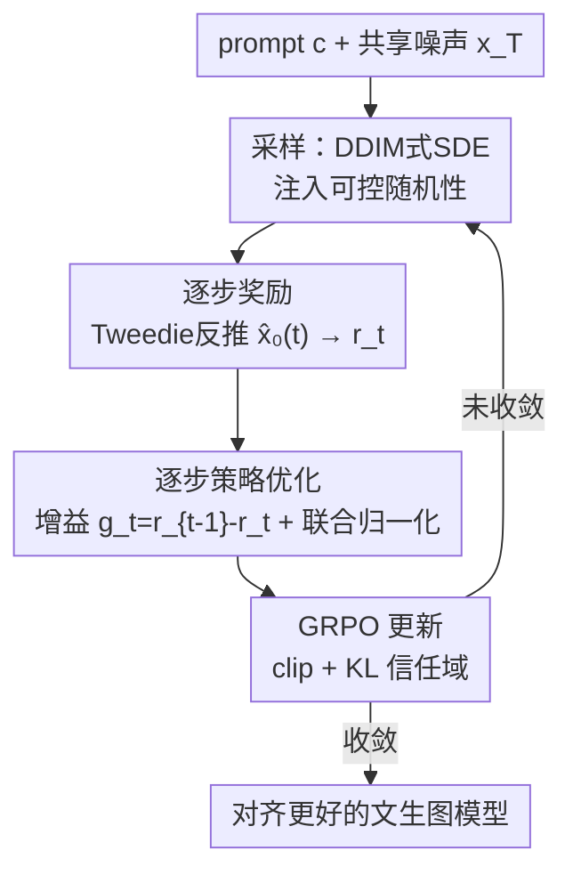

# Stepwise-Flow-GRPO：给流匹配模型的去噪步逐步分配信用

**会议**: CVPR 2026  
**论文**: [CVF Open Access](https://openaccess.thecvf.com/content/CVPR2026/html/Savani_Stepwise_Credit_Assignment_for_GRPO_on_Flow-Matching_Models_CVPR_2026_paper.html)  
**代码**: 无（项目页 stepwiseflowgrpo.com）  
**领域**: 扩散模型 / 对齐RLHF / 图像生成  
**关键词**: Flow-GRPO, 信用分配, Tweedie公式, 增益优势, 文生图RL

## 一句话总结
针对 Flow-GRPO 把"最终图像的同一个优势"平摊给所有去噪步这一缺陷，本文用 Tweedie 公式估计每一步的中间奖励、再以"相邻步奖励增益"作为逐步优势来做 GRPO，并配一个 DDIM 式 SDE 提升采样质量，在文生图 RL 上拿到更高的样本效率和更快的收敛。

## 研究背景与动机
**领域现状**：把强化学习用到流匹配（flow-matching）文生图模型上，主流做法是 Flow-GRPO / DanceGRPO——它们把确定性的流 ODE 改写成边缘分布匹配的随机 SDE，从而能在去噪轨迹上做策略梯度，然后用 GRPO 以"组内相对优势"优化策略。

**现有痛点**：Flow-GRPO 只在**最终图像** $x_0$ 上算一个奖励 $r=R(x_0,c)$，得到一个轨迹级优势 $A_i$，再把这同一个 $A_i$ **平摊（uniform credit）给轨迹里的每一步去噪**。这忽略了扩散生成天然的时间结构：早期步决定构图与布局（低频结构），晚期步细化纹理与细节（高频）。把整条轨迹按最终质量统一奖励，会把"前期犯错、后期被纠正"的轨迹里那些坏的早期步也一并强化。

**核心矛盾**：去噪过程是**逐步、分频率、coarse-to-fine** 的，但 Flow-GRPO 的信用分配是**无差别的**。论文用频域信噪比解释这种层级：自然图像能量集中在低频（功率谱 $\propto|k|^{-\alpha}$），而高斯噪声各频率平坦，于是频率 $k$、时刻 $t$ 处的信噪比为 $\text{SNR}_t(k)=\left(\frac{1-t}{t}\right)^2\frac{1}{|k|^{\alpha}}$——低频始终先于高频脱离噪声，随 $t\to 0$ 高频才逐渐浮现。一个决定物体布局的步和一个仅锐化边缘的步，被当成同等责任，显然不合理。

**本文目标**：给每一个去噪步分配它**实际贡献**的信用，而不是只看最终图像；同时不引入 PPO 那种额外的 critic 模型。

**切入角度**：既然中间状态 $x_t$ 是带噪的、没法直接喂奖励模型，那就**估计它对应的干净图像并对估计打分**——这样每一步都有了自己的奖励，进而能衡量"这一步把奖励改善了多少"。

**核心 idea**：用 Tweedie 公式拿到每步的中间奖励 $r_t$，再用**相邻步增益** $g_t=r_{t-1}-r_t$ 作为优势去做 GRPO——奖励真正改善奖励的步、惩罚拉低奖励的步，等价于一个"无需单独 critic"的细粒度信用分配。

## 方法详解

### 整体框架
Stepwise-Flow-GRPO 沿用 Flow-GRPO 的"ODE→SDE→GRPO"骨架，只在两处动刀：**奖励怎么算**和**优势怎么算**，外加一个改进的采样 SDE。对每个 prompt $c$，从共享初始噪声 $x_T$ 出发采 $N$ 条轨迹；与 Flow-GRPO 不同，对轨迹的**每一步** $x_t$ 都用 Tweedie + 若干 ODE 子步反推一张干净图 $\hat{x}_0(t)$，对它打分得到中间奖励 $r_t$；再把相邻步奖励之差 $g_t=r_{t-1}-r_t$ 作为"这一步的边际贡献"，跨步与跨轨迹**联合归一化**成组相对优势 $\tilde{A}_t^i$，喂回 GRPO 的 clip+KL 目标更新策略。采样侧再换上一个 DDIM 式 SDE，让喂给奖励模型的样本更干净、奖励信号更可靠。

### 关键设计

**1. 逐步奖励：用 Tweedie 公式给带噪中间态打分**

痛点很直接：奖励模型只认干净图像，没法对中间带噪态 $x_t$ 评分，所以 Flow-GRPO 只能等到 $x_0$ 才打一次分。本文用 Tweedie 公式做一步去偏估计：$\hat{x}_0(t):=\mathbb{E}[x_0\mid x_t]=x_t-t\hat{x}_1$，其中 $\hat{x}_1$ 是生成时每步本就算好的预测噪声，所以一步 Tweedie 估计**几乎零额外开销**。为了让估计更准，作者不止用一步，而是把区间 $[t,0]$ 离散成 $T'$ 个子步，用前向 Euler 解流 ODE 从 $x_t$ 多步去噪到 $\hat{x}_0(t)$；$T'=1$ 时退化为单步 Tweedie，实验里 $T'=5$ 在质量和开销间最优。对每步得到 $r_t^i=R(\hat{x}_0^i(t),c)$，且每步只需**一条确定性去噪轨迹**、不必多采样平均，各步彼此独立因而可并行算。这一步把"只有终点有奖励"变成"每步都有奖励曲线"，是后面做逐步信用分配的前提。

**2. 增益优势：用相邻步奖励差 + 联合归一化做逐步信用分配**

有了每步奖励还不能直接优化——直接最大化 $r_t$ 会去优化"高分的中间 Tweedie 估计"而非高分的最终图。作者改为优化**逐步增益** $g_t^i:=r_{t-1}^i-r_t^i$，它衡量"这一步把奖励改善了多少"：改善的步得到正强化，拉低的步被惩罚。关键性质是增益**可伸缩（telescoping）**：$\sum_{t=1}^{T}g_t^i=r_0^i-r_T^i$，即最大化逐步增益等价于最大化"从初始噪声到最终图"的总改善，把局部逐步优化和全局最终奖励目标接上了。归一化上有个重要选择：**联合归一化**（跨所有步和所有轨迹一起算均值/方差）而非按步单独归一化——因为图 2 显示早期步增益幅度更大（构图决策驱动了大部分奖励改善），按步归一化会把后期那些本就微小的奖励波动放大成噪声。组相对优势为

$$\tilde{A}_t^i=\frac{g_t^i-\text{mean}}{\text{std}},\quad \text{mean}=\frac{1}{NT}\sum_{j,k}g_k^j,\ \ \text{std}=\sqrt{\frac{1}{NT}\sum_{j,k}(g_k^j-\text{mean})^2}$$

随后照搬 GRPO 目标，只是把 Flow-GRPO 的统一优势 $A_i$ 换成逐步优势 $\tilde{A}_t^i$：

$$J(\theta)=\frac{1}{NT}\sum_{i=1}^{N}\sum_{t=0}^{T-1}\Big[\varphi(s_t^i(\theta),\tilde{A}_t^i)-\beta D_{\mathrm{KL}}^{i,t}(\pi_\theta\|\pi_{\text{ref}})\Big]$$

其中 $\varphi$ 是 clip 后的 propensity-ratio 加权项、$s_t^i(\theta)$ 为新旧策略的重要性比、KL 项把策略锚在初始 $\pi_{\text{ref}}$ 上。同组 $N$ 条轨迹共享初始噪声 $x_T$，使奖励差异**只来自随机去噪过程**。作者还指出这个增益最大化与 Kveton 等人的自适应策略梯度在代数上等价：当奖励增益单调、子模时，贪心 KL 正则策略梯度可学到近最优策略——图 2 中"增益随 $t\to0$ 递减"正暗示这类子模结构，本文是首个把这种增益变换用到 GRPO 和流模型、并推广到 off-policy + 组相对优势的工作。

**3. DDIM 式 SDE：在保留探索随机性的同时让样本更干净**

Flow-GRPO 的 SDE 虽然可证地匹配 ODE 的边缘分布，但注入的噪声让生成样本视觉上偏脏；而奖励模型是在干净图上训练的，脏样本会污染奖励估计、拖慢优化。作者借 DDIM 的思路构造一个在确定性与随机采样间插值的更新：把信号/噪声强度设为 $\alpha_t=(1-t)^2,\ \beta_t=t^2$ 以匹配 rectified flow 的边缘，得到

$$x_{t-\Delta t}=(1-(t-\Delta t))\,\hat{x}_0(t)+\sqrt{(t-\Delta t)^2-\sigma_t^2}\,\hat{x}_1+\sigma_t\epsilon$$

当 $\sigma_t=0$ 时精确退回确定性流 ODE；该 DDIM 形式在小 $\sigma_t,\Delta t$ 下是精确边缘匹配的一个近似（误差 $O(\sigma_t^4)$）。噪声调度取 $\sigma_t=a(t-\Delta t)\sqrt{1-t}$：$t=1$ 处注入最大随机性供探索，随 $t\to0$ 平滑退火到 $\sigma_t\to0$ 恢复确定性 ODE，全程保持小 $\sigma_t$ 以贴合边缘。这样得到高斯策略 $\pi_\theta(x_{t-1}\mid x_t,c)=\mathcal{N}(x_{t-1};\mu_t,\sigma_t^2 I)$，既能算重要性比和 KL、又显著改善视觉质量。它与逐步信用分配是**互补**的两条加速路径。

### 损失函数 / 训练策略
最终最小化 $-J(\theta)$（式见上），用 AdamW 更新。算法每轮：采 prompt 与共享噪声 $x_T$ → 自回归生成 $N$ 条轨迹 → 对每步用 $T'$ 子步算 $\hat{x}_0(t)$ 与奖励 $r_t$ → 算增益 $g_t$ 与联合归一化优势 $\tilde{A}_t$ → 策略梯度更新。Appendix A 还试过 EMA 基线去中心化增益、GAE 让每步分享未来增益、以及基于渐进蒸馏的 ODE 变体，但 5.2 节的朴素增益表现最好。

## 实验关键数据

主干模型 SD3.5-Medium，8×A100，基于 Flow-GRPO 代码库；10 步去噪、batch 16。奖励用 PickScore / ImageReward / UnifiedReward-7b，评测集 GenEval（组合性）与 PickScore 数据集。

### 主实验：GenEval 最终模型质量（PickScore 奖励训练）

| 模型 | Overall | Two Objs. | Counting | Position | Attr. Binding |
|------|---------|-----------|----------|----------|---------------|
| SD3.5-M（cfg=1.0，预训练） | 0.28 | 0.23 | 0.15 | 0.05 | 0.08 |
| SD3.5-M（cfg=4.5，预训练） | 0.63 | 0.78 | 0.50 | 0.24 | 0.52 |
| Flow-GRPO（cfg=1.0） | 0.60 | 0.73 | 0.67 | 0.21 | 0.35 |
| **本文（cfg=1.0）** | 0.60 | **0.75** | 0.67 | 0.21 | 0.34 |
| Flow-GRPO（cfg=4.5） | 0.68 | 0.82 | 0.64 | 0.24 | 0.59 |
| **本文（cfg=4.5）** | **0.71** | **0.85** | **0.70** | **0.29** | 0.59 |

cfg=1.0 下与 Flow-GRPO 基本持平（说明更快收敛**不牺牲**最终质量）；cfg=4.5 下全面优于或持平，**计数和空间定位**提升最明显（Position 0.24→0.29，Counting 0.64→0.70）。样本效率上（图 4），4 个设置里 3 个收敛更快且最终更高，提升在训练早期最显著；wall-clock（图 5）即便算上中间去噪开销，3/4 设置仍更快达到目标奖励。

### 消融实验

| 配置 | 现象 | 结论 |
|------|------|------|
| $T'$ 去噪子步数 | $T'\le3$ 奖励估计噪声大、拖慢训练；$T'\in[6,10]$ 提升可忽略但更贵 | $T'=5$ 为质量/效率最优 |
| 联合归一化 vs 按步归一化 | 按步归一化抹平各步重要性、收敛更慢 | 联合归一化保住早期大增益，优先构图决策 |
| 改进 SDE（图 6） | 两方法都用 DDIM 式 SDE 时本文仍领先 | 信用分配与采样改进互补、可叠加 |

### 关键发现
- **增益幅度随步递减**（图 2）：早期步增益最大，证实"构图决策驱动大部分奖励改善"，也支撑联合归一化的选择。
- **可伸缩性是关键桥梁**：$\sum_t g_t=r_0-r_T$ 让"逐步局部优化"严格等价于"最大化最终奖励改善"，避免了直接优化中间 Tweedie 估计带来的 reward hacking。
- 定性上（图 3）Flow-GRPO 会把物体合并、把公交车放到天上，本文的空间推理与属性绑定更合理。

## 亮点与洞察
- **"增益 = 无 critic 的细粒度信用"**：用相邻步奖励差替代轨迹总奖励，达到了 PPO 那种逐步信用分配的效果，却**不需要训练单独的 critic 模型**——这是把 RLHF 里"价值函数难学"痛点绕开的巧办法。
- **Tweedie 几乎免费**：$\hat{x}_1$ 本就在每步算好，一步 Tweedie 不增成本；要更准就加几步 ODE 子步，把"中间态没法打分"这个看似硬的约束化解得很轻。
- **可伸缩求和**把局部目标和全局目标对齐，是这套方法理论上站得住、实践上不 reward-hack 的核心，思路可迁移到任何"轨迹型生成 + 终点奖励"的 RL 场景。
- 采样与信用分配解耦、各自独立提升又能叠加，工程上很友好。

## 局限与展望
- **未形式化验证子模性**：理论近最优依赖"奖励增益单调、子模"假设，作者坦言只有经验成功和递减增益作为旁证（标 ⚠️ 子模性未证）。
- **多了中间去噪开销**：每步要跑 $T'=5$ 子步去噪 + 打分，单步更贵；虽然样本效率补偿了 wall-clock，但在奖励模型很重（如 UnifiedReward 需额外 8×A100）时成本不低。
- **仍是 4 选 3 的优势**：样本/wall-clock 效率在 4 个设置里赢 3 个，并非全面碾压。
- 作者展望：用 per-prompt 增益方差做课程学习难度信号、按增益方差自适应加权步、乃至"自纠错扩散"——让模型学会检测并重试糟糕的中间决策。

## 相关工作与启发
- **vs Flow-GRPO**：同样 ODE→SDE→GRPO，但 Flow-GRPO 只用终点奖励、统一优势平摊到每步；本文给每步独立奖励 + 增益优势，外加更干净的 DDIM 式 SDE，样本效率与收敛速度更优。
- **vs TempFlow-GRPO / Granular-GRPO（并行工作）**：两者也针对信用分配——TempFlow 用**手工设计的噪声级加权**作用在终点优势上，Granular 只优化**前一半步**；本文优化的是**数据驱动**的可伸缩增益，无需人工调度或手动选步。
- **vs PPO/RLHF**：PPO 需要细粒度 critic，本文用逐步增益达到类似细粒度信用却省掉了 critic，理论上接 Kveton 等人的自适应策略梯度并推广到 off-policy + 组相对优势。

## 评分
- 新颖性: ⭐⭐⭐⭐ 把"逐步增益 + 可伸缩"引入流模型 GRPO，思路清晰且有理论接口，但属于在 Flow-GRPO 上的精准改进。
- 实验充分度: ⭐⭐⭐⭐ 三种奖励模型 × 两数据集、样本/wall-clock/最终质量都测，消融到位；但优势是 4 选 3、缺更大模型验证。
- 写作质量: ⭐⭐⭐⭐⭐ 动机用频域 SNR 讲透，方法推导（Tweedie/增益/SDE）层层递进、公式干净。
- 价值: ⭐⭐⭐⭐ 文生图 RL 的即插即用加速，与采样改进互补，工程可落地。

<!-- RELATED:START -->

## 相关论文

- [\[CVPR 2026\] Fine-Grained GRPO for Precise Preference Alignment in Flow Models](fine-grained_grpo_for_precise_preference_alignment_in_flow_models.md)
- [\[CVPR 2026\] GRPO-Guard: Mitigating Implicit Over-Optimization in Flow Matching via Regulated Clipping](grpo-guard_mitigating_implicit_over-optimization_in_flow_matching_via_regulated_.md)
- [\[CVPR 2026\] Neighbor GRPO: Contrastive ODE Policy Optimization Aligns Flow Models](neighbor_grpo_contrastive_ode_policy_optimization_aligns_flow_models.md)
- [\[ICML 2026\] LithoGRPO: Fast Inverse Lithography via GRPO Reinforced Flow Matching](../../ICML2026/image_generation/lithogrpo_fast_inverse_lithography_via_grpo_reinforced_flow_matching.md)
- [\[CVPR 2026\] DiverseGRPO: Mitigating Mode Collapse in Image Generation via Diversity-Aware GRPO](diversegrpo_mitigating_mode_collapse_in_image_generation_via_diversity-aware_grp.md)

<!-- RELATED:END -->
