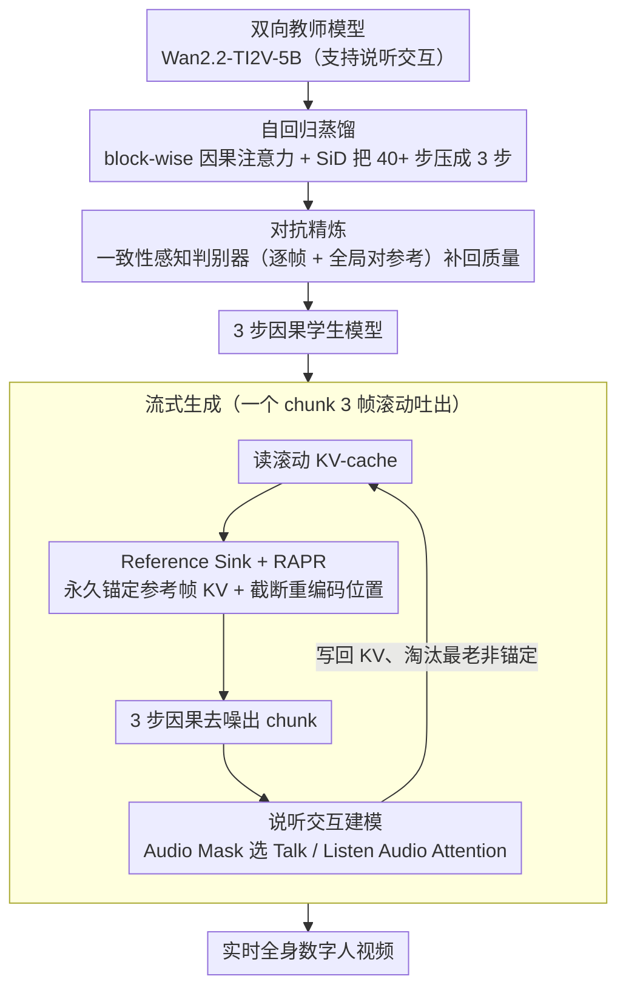

# StreamAvatar: Streaming Diffusion Models for Real-Time Interactive Human Avatars

**会议**: CVPR 2026  
**arXiv**: [2512.22065](https://arxiv.org/abs/2512.22065)  
**代码**: [https://streamavatar.github.io](https://streamavatar.github.io)  
**领域**: 图像生成  
**关键词**: 实时数字人, 流式视频生成, 自回归蒸馏, 说听交互, 扩散模型

## 一句话总结
提出两阶段自回归适配加速框架（自回归蒸馏 + 对抗精炼），将双向人体视频扩散模型转化为实时流式生成器，通过 Reference Sink、RAPR 位置重编码和一致性感知判别器保证长视频稳定性，实现首个支持说话和倾听交互的全身实时数字人。

## 研究背景与动机

1. **领域现状**：扩散模型在音频驱动人物视频生成（talking avatar）方面已取得显著成功，能从单张图片生成高质量说话视频。代表工作如 Hallo3、OmniAvatar、HunyuanVideo-Avatar 等。

2. **现有痛点**：三大挑战阻碍实用化：
    - **实时流式生成**：扩散模型的迭代去噪（25-50步）和长上下文双向注意力计算量巨大，且双向注意力天然不支持流式。现有方法生成 5 秒视频需要 7-74 分钟。
    - **长时稳定性**：流式交互需要持续生成长视频，but 自回归方式容易累积误差导致身份漂移和质量下降。
    - **说-听交互**：现有方法只建模说话行为，忽视倾听状态。在对话场景中，不建模倾听会使交互显得不自然。少数建模倾听的方法仅限于头肩区域，缺乏手势和全身表现力。

3. **核心矛盾**：高质量需要强大的双向扩散模型，但实时流式需要轻量级因果模型。质量与速度之间的矛盾是核心。

4. **本文目标** 如何将高保真但非因果的人体视频扩散模型高效转化为实时、流式、支持交互的生成器。

5. **切入角度**：先训练强大的双向教师模型（支持说听交互），再通过两阶段蒸馏+对抗精炼将其压缩为 3 步因果自回归学生模型。针对长视频稳定性，提出专门的注意力机制和位置编码改进。

6. **核心 idea**：通过自回归蒸馏将去噪过程从 40+ 步压缩到 3 步，加上 Reference Sink 和 RAPR 解决身份漂移，实现 20 秒生成 5 秒 720p 视频。

## 方法详解

### 整体框架
这篇论文要解决的核心矛盾是：高保真人体视频需要重量级的双向扩散模型（迭代去噪 40+ 步、全序列双向注意力），而实时流式交互又只能用轻量级的因果模型。StreamAvatar 的破局办法是「先重后轻」——先把一个支持说听交互的双向扩散模型训练好当教师，再分两个阶段把它压成能边算边吐帧的因果学生。

backbone 是 Wan2.2-TI2V-5B（30 个 DiT block）。整体流程是：Stage 1 自回归蒸馏把双向注意力换成 block-wise 因果注意力，并用 Score Identity Distillation 把去噪步数从 40+ 步砍到 3 步，得到一个能流式生成但质量打了折的学生；Stage 2 对抗精炼再用一致性感知判别器把蒸馏丢掉的质量补回来。生成时模型以「参考帧 + 滚动上下文」为条件，一个 chunk（3 帧）一个 chunk 地往外吐，靠 Reference Sink 和 RAPR 保证长视频里身份不漂、质量不塌。

### 关键设计

**1. 自回归蒸馏：把 40+ 步双向去噪压成 3 步因果生成**

双向模型要看到完整序列才能算，天然没法流式，再加上 40+ 步去噪，生成 5 秒视频要七十多分钟，根本谈不上实时。这里的做法是把生成窗口切成参考帧 chunk（1 帧）和若干生成 chunk（每个 $C=3$ 帧）：chunk 之间用因果注意力（后面的看前面的），chunk 内部仍保留双向注意力，这样既能自回归往外吐、又不丢局部的双向动力学建模能力；上下文用一个滚动 KV-cache 存有限窗口，避免序列越拖越长。

蒸馏分两步走。先做 ODE 初始化：用教师模型生成视频、记录完整去噪轨迹，让学生学会从含噪的 $\{x_t^n\}$ 直接预测干净的 $\{x_t^0\}$。再做 Score Identity Distillation，关键是换成 student-forcing——让学生基于自己之前吐出的 chunk（而不是教师的标准答案）去预测下一 chunk，把训练和推理的分布对齐，避免推理时一步错步步错。一个实用发现是：跳过 KV-cache 的更新步骤、直接拿含噪的 $\{x_t^1\}$ 而不是干净的 $\{x_t^0\}$ 当条件，质量几乎不掉，却能省掉一次前向传播——说明自回归生成对轻微噪声相当鲁棒。

**2. Reference Sink + RAPR：用「锚定参考帧 + 重编码位置」按住长视频的身份漂移**

滚动 KV-cache 是把双刃剑：窗口一满，老的 KV 就被淘汰，参考帧的身份信息也随之丢失，长视频越生成越不像本人。Reference Sink 的办法很直接——在缓存里永久保留参考帧的 KV pair，让模型每一步都能注意到原始身份；再额外保住第一个生成 chunk 的 KV，进一步稳住一致性。

但光有 Sink 还不够，RoPE 本身还有两个坑：一是训练只见过短序列、推理时帧的位置索引越来越大跑到 OOD 区，二是 RoPE 固有的长距离衰减让模型对越来越远的参考帧注意力越来越弱。RAPR（Reference-Anchored Positional Re-encoding）一并解决：缓存里存的是未编码的 key，生成当前帧 $x_t$ 时，把它到参考帧的距离截断成有上限的 $\min(t, D)$（$D < T$）当 RoPE 索引，同步把所有缓存 key 的相对位置一起调整，再统一施加 RoPE。这样最大距离被钉死，注意力不会随距离衰减掉，而且训练和推理永远落在同一个有限的位置空间里，OOD 问题也消失。它最妙的地方在于：训练时就能用短视频模拟出长视频推理时的位置偏移，不需要真去生成长视频来训。

**3. 一致性感知判别器：用「逐帧 + 全局对参考」双分支把蒸馏丢的质量补回来**

蒸馏到 3 步必然牺牲质量，常见症状是模糊、手部和牙齿畸变；而普通判别器只盯单帧真不真，管不了帧与帧之间漂不漂。这里的判别器从教师 backbone 初始化，在中间层插 $N_Q=3$ 个 Q-Former 抽深层特征，然后分两个分支判：局部真实性分支把每帧特征线性投影成逐帧 logit，专管单帧像不像真；全局一致性分支让参考帧特征和所有后续帧特征做 cross-attention，汇成一个 logit，专门惩罚「越生成越不像参考身份」的情况。训练用 relativistic adversarial loss 加 R1/R2 梯度惩罚，而且对抗阶段直接喂真实视频，把生成分布往真实分布上拽。正是全局分支显式约束了「每一帧都得对得上参考身份」，才补住了普通判别器够不着的时序一致性。

**4. 说听交互建模：用「后置 Audio Mask + 双音频注意力」让数字人会说也会听**

对话场景里只会说话、不会倾听，交互就很出戏。区分这两个阶段靠 Audio Mask，它由 TalkNet（音视频联合检测）给出，比单纯做音频分离更准。一个容易踩的坑是 mask 该在哪一步加：如果在 Wav2Vec 2.0 提特征之前就改波形，提出来的特征会偏离预训练分布；所以这里把 mask 放在 Wav2Vec 提完特征之后再用，保住特征质量（消融里 Pre-Mask vs Ours 在所有指标上都验证了后置更好）。模型在 DiT block 里扩出两个音频注意力模块：Talk Audio Attention 注入说话音频、驱动表情和手势，Listen Audio Attention 注入倾听音频、驱动自然的反应动作；文本 prompt 固定成 "a person is speaking and listening"。

### 一个完整示例：生成第 t 个 chunk

假设要生成一段长视频里第 t 帧附近的 chunk（3 帧），看模型这一步实际怎么转：

1. **取上下文**：从滚动 KV-cache 里读出当前窗口的 key/value。窗口里一定包含被 Reference Sink 永久锁住的参考帧 KV 和第一个生成 chunk 的 KV，再加上最近若干 chunk 的 KV——身份锚点和近期动态都在。
2. **重编码位置（RAPR）**：当前 chunk 到参考帧的真实距离 $t$ 可能已经很大，先截成 $\min(t, D)$；同步把缓存里所有 key 的相对位置一起平移到这个有上限的区间内，再统一施加 RoPE。于是无论 t 多大，模型看到的位置分布都和训练时一致，对参考帧的注意力也不会被距离衰减掉。
3. **3 步因果去噪**：chunk 内 3 帧之间双向注意，对窗口内历史只做因果注意；学生模型用 student-forcing 训出来的 3 步去噪直接把这个 chunk 出图。为省一次前向，条件可以直接用上一 chunk 含噪的 $\{x_t^1\}$。
4. **注音频**：若 Audio Mask 判这一段是说话，走 Talk Audio Attention 驱动口型和手势；若是倾听，走 Listen Audio Attention 驱动点头、表情等反应动作。
5. **更新缓存**：把新生成 chunk 的 KV 写回滚动 cache，淘汰最老的非锚定 KV，进入下一 chunk。整段视频就这样一个 chunk 一个 chunk 流式吐出，参考帧 KV 始终不被淘汰，身份不漂。

### 训练策略
- 教师模型：从 Wan2.2-TI2V-5B 微调 20000 步，batch size 32，lr 5e-6
- 学生模型 Stage 1：ODE 初始化 5000 步（bs 8, lr 2e-6）+ SiD 蒸馏 6000 步（bs 16, lr 3e-6）
- 学生模型 Stage 2：对抗精炼 1400 步（bs 32, lr 5e-6）
- 训练数据：~200h 720P 视频（SpeakerVid-5M + 自采集），按 TalkNet 检测的倾听比例平衡说话/倾听样本
- 推理时 DiT 和 VAE 解码在两张 H800 上流水线化，延迟 1.2 秒

## 实验关键数据

### 主实验（说话视频生成）

| 方法 | FID ↓ | FVD ↓ | IQA ↑ | Sync-C ↑ | HKV（手势） | HA ↑ | 步数 | 分辨率 | 5秒用时 |
|------|-------|-------|-------|----------|-----------|------|------|--------|---------|
| StableAvatar | 75.20 | 603.54 | 4.66 | 4.24 | 42.92 | 0.909 | 40 | 480p | 12min |
| OmniAvatar | 87.24 | 851.93 | 4.45 | 7.60 | 8.64 | 0.974 | 25 | 480p | 36min |
| HY-Avatar | 76.49 | 557.46 | 4.67 | 6.71 | 54.31 | 0.947 | 50 | 720p | 74min |
| EchoMimicV3 | 78.65 | 724.29 | 4.66 | 3.10 | 25.53 | 0.969 | 25 | 480p | 7min |
| **Ours** | **74.21** | **707.34** | **4.68** | **7.06** | 48.35 | **0.974** | **3** | **720p** | **20s** |

### 消融实验（逐步添加组件）

| 配置 | FID ↓ | IQA ↑ | Sync-C ↑ | HA ↑ |
|------|-------|-------|----------|------|
| Baseline (Self Forcing) | 96.58 | 4.29 | 7.04 | 0.948 |
| + Reference Sink | 88.75 | 4.55 | 7.03 | 0.950 |
| + RAPR | 81.63 | 4.64 | 7.06 | 0.956 |
| + GAN w/o 一致性判别器 | 79.68 | 4.65 | 7.05 | 0.947 |
| **Full (Ours)** | **74.21** | **4.68** | **7.06** | **0.974** |

### 交互能力（倾听阶段动态性）

| 方法 | LBKV（身体） | LHKV（手部） | LFKV（面部） |
|------|-------------|-------------|-------------|
| Baseline（静默音频） | 6.05 | 4.53 | 2.39 |
| **Ours** | **15.88** | **16.24** | **7.11** |

### 关键发现
- 速度提升极其显著：3 步 vs 25-50 步，生成 5 秒视频仅需 20 秒 vs 最快基线的 7 分钟（提速 21x），且达到更高分辨率 720p
- Reference Sink 对身份保持至关重要（FID 从 96.58 降至 88.75），RAPR 在此基础上进一步提升长视频稳定性（FID 降至 81.63）
- 一致性感知判别器的全局分支是关键——消融表里把 GAN 的一致性判别器去掉后，HA 从 0.974 掉到 0.947，掉幅明显（原文「长视频数据上 0.993 降至 0.993」前后数字相同，疑为笔误，> ⚠️ 以原文为准）
- 倾听状态的运动丰富度（LHKV）是 baseline 的 3.6 倍，说明模型确实学到了自然的倾听反应

## 亮点与洞察
- RAPR 是一个非常优雅的位置编码解决方案——通过限制最大距离并动态重编码所有缓存 keys，在训练时就模拟长视频推理环境，无需实际生成长视频进行训练。这个思路可以广泛应用于其他需要长序列推理的 RoPE 模型
- "训练时跳过 KV-cache 更新"的发现很实用——直接用含噪输出条件化下一 chunk 不影响质量但省一次前向传播，说明自回归生成对轻微噪声有鲁棒性
- Audio mask 在 Wav2Vec 之后而非之前应用的设计巧妙——保留原始波形的 Wav2Vec 特征质量远优于处理后的，这个洞见对所有使用预训练音频特征的工作都有参考价值

## 局限与展望
- 有限的时序上下文可能导致长时间遮挡区域出现不一致内容
- 蒸馏不可避免地限制了运动范围
- 文本输入处理简单（固定 prompt），缺乏细粒度语义控制
- VAE 解码占总时间一半以上，是进一步降低延迟的瓶颈
- 目前仅支持单人交互，多人对话场景值得探索

## 相关工作与启发
- **vs CausVid/Self-Forcing**：StreamAvatar 在自回归蒸馏框架上增加了 Reference Sink + RAPR + 一致性感知判别器，专门解决数字人场景的身份稳定性问题
- **vs Hallo3/EchoMimicV3**：这些方法质量不错但速度慢（7-32分钟/5秒），且长序列会出现手部畸变和身份漂移。StreamAvatar 在质量更好的同时快 21x+
- **vs INFP/ARIG**：这些方法支持说听交互但仅限头肩区域。StreamAvatar 是首个支持全身说听交互的实时模型

## 评分
- 新颖性: ⭐⭐⭐⭐ 两阶段框架设计合理，RAPR 位置编码改进新颖，说听交互全身模型首创
- 实验充分度: ⭐⭐⭐⭐⭐ 对比全面、消融详实、有用户研究和实时性能分析
- 写作质量: ⭐⭐⭐⭐ 结构清晰，技术细节描述到位
- 价值: ⭐⭐⭐⭐⭐ 实时交互数字人是刚需，20 秒/5 秒的速度使实际部署成为可能

<!-- RELATED:START -->

## 相关论文

- [\[CVPR 2026\] FlashDecoder: Real-Time Latent-to-Pixel Streaming Decoder with Transformers](flashdecoder_real-time_latent-to-pixel_streaming_decoder_with_transformers.md)
- [\[CVPR 2026\] DreamStereo: Towards Real-Time Stereo Inpainting for HD Videos](dreamstereo_towards_real-time_stereo_inpainting_for_hd_videos.md)
- [\[CVPR 2025\] SemanticDraw: Towards Real-Time Interactive Content Creation from Image Diffusion](../../CVPR2025/image_generation/semanticdraw_towards_real-time_interactive_content_creation_from_image_diffusion.md)
- [\[CVPR 2026\] PortraitDirector: A Hierarchical Disentanglement Framework for Controllable and Real-time Facial Reenactment](portraitdirector_a_hierarchical_disentanglement_framework_for_controllable_and_r.md)
- [\[CVPR 2025\] MobilePortrait: Real-Time One-Shot Neural Head Avatars on Mobile Devices](../../CVPR2025/image_generation/mobileportrait_real-time_one-shot_neural_head_avatars_on_mobile_devices.md)

<!-- RELATED:END -->
