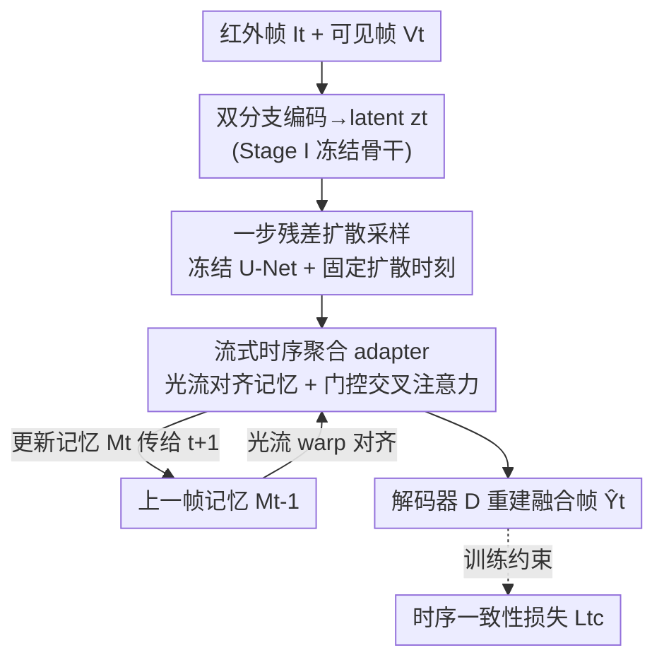

# Streaming Diffusion Model for Fast Infrared and Visible Video Fusion

**会议**: CVPR 2026  
**论文**: [CVF Open Access](https://openaccess.thecvf.com/content/CVPR2026/html/Liu_Streaming_Diffusion_Model_for_Fast_Infrared_and_Visible_Video_Fusion_CVPR_2026_paper.html)  
**代码**: https://github.com/DandanYoung/SDMFusion (有)  
**领域**: 扩散模型 / 红外可见光视频融合 / 低层视觉  
**关键词**: 视频融合, 一步扩散, 流式记忆, 时序一致性, 光流对齐

## 一句话总结
SDMFusion 把预训练扩散模型蒸成「一步采样 + 流式记忆」的框架来做红外-可见光视频融合：用单步残差采样换取实时速度、用光流对齐的记忆单元加门控时序聚合 adapter 保证帧间连贯，并配一个时序一致性损失抑制闪烁与拖影，在四个 benchmark 上同时拿到 SOTA 质量和最快推理。

## 研究背景与动机
**领域现状**：红外-可见光融合的目标是把红外的热辐射信息（不受光照影响、夜间可见）和可见光的纹理细节、高分辨率合成到同一路视频里，是全天候监控、自动驾驶、夜间侦察等感知系统的底座技术。这个方向已经发展出两波：第一波是成熟的「图像级融合」（CDDFuse、DCEvo 等），把红外/可见单帧融成一张高质量图；近来兴起的第二波才开始尝试「视频级融合」。

**现有痛点**：图像级方法把视频当成一堆独立帧逐帧处理，完全忽略帧间时序依赖，结果就是融合视频出现时序闪烁（flickering）和物体拖影/漂移（ghosting/drift），对下游跟踪、行为识别这类视频任务很不友好。第二波视频方法虽然引入了时序，但多依赖时序平均或简单循环单元这类粗糙机制，捕捉不了真实视频里复杂的非线性运动和长程依赖，往往把结果磨得过平、运动轨迹糊掉。

**核心矛盾**：扩散模型有很强的生成先验，本可以用来补细节、修伪影，但它的迭代去噪过程对动辄几十上百帧的视频来说慢到不可接受；而现有的一步蒸馏加速技术又是「时序盲」的——直接套用只会产出一串各自高质量但彼此不连贯的帧，反而没解决视频融合的核心难题。于是**高保真**与**时序稳定 + 实时速度**之间形成了根本性的两难。

**本文目标**：在满足实时性的前提下，既保住扩散先验带来的细节保真，又显式建模时序动态来保证帧间连贯。

**核心 idea**：把预训练扩散模型的生成先验「压」进一个一步采样框架，同时引入一个记忆增强的潜空间流水线——用时序聚合 adapter 对齐并传播跨帧特征、配一个专门的时序一致性损失，从而把「追求高保真」和「维持时序稳定」这两件事解耦开来分别解决。

## 方法详解

### 整体框架
给定一对已对齐的红外-可见光视频 $\{(I_t, V_t)\}_{t=1}^{T}$，目标是生成时序连贯的融合序列 $\{\hat{Y}_t\}_{t=1}^{T}$。SDMFusion 采用**两阶段**设计：Stage I 在静态图像对上学一个跨模态编码-解码骨干（图像级融合 backbone）；Stage II 冻结这个骨干，引入「流式扩散模型（SDM）+ 光流引导的特征传播」在潜空间逐帧精修时序表示。这种解耦让训练更稳，既吃到图像级强先验，又能高效快速地做视频融合。

具体到一帧的数据流：双分支编码器先抽出红外/可见的跨模态特征并在特征空间融合得 $G_t = F(B(I_t), B(V_t))$，按固定空间因子 $s$ 下采样压成潜变量 $z_t$ 以削减扩散内部的计算量；接着复用一个预训练的 Stable Diffusion 去噪 U-Net（**全程冻结**以保住大规模数据学到的生成能力），在其解码层后插入 adapter 做单步残差校正，并把上一帧传来的、经光流 warp 对齐的记忆通过 adapter 注入做时序聚合；最后把精修后的潜特征还原回原分辨率、由图像解码器 $D$ 重建出融合帧。训练侧再加一个时序一致性损失约束特征传播的稳定性。

### 关键设计

**1. 两阶段解耦 + 任务自适应 VAE：把「保真」和「时序稳定」拆开训**

直接训一个重型视频扩散模型既不稳又慢，所以作者把任务劈成两段：Stage I 只在静态红外-可见图像对上学跨模态编码-解码骨干，先把图像级融合的强先验吃透；Stage II 冻结这套骨干，只在其上叠加流式扩散与光流传播来处理时序。这样「achieving high fidelity」与「maintaining temporal stability」被解耦——保真靠 Stage I 的图像先验兜底，连贯靠 Stage II 的时序模块负责，互不拖累，训练也更稳定。此外，标准 latent 扩散常用的 VAE 只在可见光单模态分布 $P_V$ 上训过，直接拿来编码融合内容（分布 $P_F$ 来自红外+可见两路）会有分布偏移：$\mathrm{KL}(p_F(z_t)\,\|\,p_V(z_t))$ 很大，$V^{-1}\!\circ V$ 在融合 latent 上失配，解码后表现为空间错位和 ghosting（作者观察到：只在可见光上训的编码器低估热显著性、解码器又在错位处放大可见纹理）。为此他们把现成 VAE 换成一个 DCEvo 风格、按融合 latent 分布对齐训练的任务自适应编码-解码器，从源头消掉这种失配伪影。

**2. 一步残差扩散采样：用单次前向替掉整条迭代去噪链**

扩散慢的根因是反向过程要从 $z_T$ 迭代 $T$ 步去噪（$z_{t-1} \leftarrow S(z_t, t, \epsilon_\theta(z_t,t,c))$），对视频帧数一乘就爆。作者借鉴一步 latent 扩散范式，把多步扩散蒸成「在固定扩散时刻 $\hat{t}$ 做一次残差预测」：去噪器在下采样潜特征上预测残差 $r_t = \epsilon_\theta(z_x; c, \hat{t})$，再用闭式更新一步到位

$$z_y = \frac{z_x - \sqrt{1-\bar{\alpha}_{\hat{t}}}\, r_t}{\sqrt{\bar{\alpha}_{\hat{t}}}}$$

其中 $\bar{\alpha}_{\hat{t}} = \prod_{s=1}^{\hat{t}} \alpha_s$ 沿用标准 schedule。式子直接取代了整条迭代采样链，把推理压成单次前向，同时仍保留负责保真与细节的生成先验；精修后的潜特征再上采回原尺度、与残差 skip 相加以保住低频结构后送解码。关键在于：U-Net 训练时**冻结**，只训插在解码层后的 adapter，从而既享一步加速、又不破坏预训练扩散的生成能力。⚠️ 原文式 (4) 中分子记为 $z_x - \sqrt{1-\bar\alpha_{\hat t}}\,r_t$、$z_x$ 与 $r_t$ 的符号关系略有歧义，以原文为准。

**3. 流式记忆增强的时序聚合 adapter：只看当前帧 + 一份记忆就完成跨帧对齐**

多帧输入方案要反复跑骨干、占额外显存，还因强依赖相邻帧带来流水线延迟，不适合实时。作者改成**流式**：每步只需当前帧、前一帧和一份先验记忆 $M_{t-1}$。先用光流估计器算出 $O_{t-1\to t}$，把记忆 warp 对齐到当前时刻 $\tilde{F}_{t-1\to t} = \mathcal{W}(M_{t-1}, O_{t-1\to t})$，再通过插在解码块后的 adapter 注入。每个 adapter 做「轻量交叉注意力 + 门控残差融合」：query $Q^{(k)}$ 由当前特征 $F_t^{(k)}$ 投影，key/value 来自光流对齐的记忆 $\tilde{F}_{t-1\to t}^{(k)}$；先算一个学习到的门控

$$\gamma^{(k)} = \sigma\!\left(\phi_g^{(k)}\big(\mathrm{Cat}(F_t^{(k)}, \tilde{F}_{t-1\to t}^{(k)})\big)\right)$$

再做门控注意力聚合 $A^{(k)} = \mathrm{Softmax}\!\big((Q^{(k)}\odot\gamma^{(k)})(K^{(k)}\odot\gamma^{(k)})^\top/\sqrt{C}\big)$、$\hat{F}_t^{(k)} = F_t^{(k)} + A^{(k)}V^{(k)}$。门控让当前特征**有选择地**吸收运动对齐后的互补线索，从而抑制运动伪影和时序闪烁；最后 adapter 把状态更新成 $M_t^{(k)} = \phi_m^{(k)}(\hat{F}_t^{(k)})$，多尺度记忆 $\{M_t^{(k)}\}_k$ 作为下一帧 $t+1$ 的先验。整套流式、记忆增强的方案只需当前帧 + 紧凑先验，既降延迟又维持高保真的时序连贯。

**4. 时序一致性损失：用运动补偿后的前一帧约束当前帧**

光有结构对齐还不够，作者在第二阶段加一个时序一致性损失 $L_{tc}$ 直接在像素级约束帧间稳定。用预训练 SpyNet 估前向光流 $O_{t-1\to t}$，把前一帧融合结果 warp 到当前时刻，只在有效区域（warp 全 1 图得到的二值 mask $M_t$）上算差异：

$$L_{tc} = \frac{1}{T-1}\sum_{t=2}^{T} \frac{\big\|(\hat{Y}_t - \mathcal{W}(\hat{Y}_{t-1}, O_{t-1\to t}))\odot M_t\big\|_1}{\sum M_t + \varepsilon}$$

它逼着当前融合帧与运动补偿后的前一帧在有效区一致，从而抑制闪烁和漂移。总损失 $L_{total} = \lambda_{V,I}L_{V,I} + \lambda_{fus}L_{fus} + \lambda_{deco}L_{deco} + \lambda_{tc}L_{tc}$，其中 $L_{V,I}$ 是 SSIM+MSE 的模态重建项、$L_{fus}$ 是基于亮度/梯度逐元素取大的融合项（继承更强强度响应和更锐边缘）、$L_{deco}$ 沿用 CDDFuse 的分解损失。

### 损失函数 / 训练策略
两阶段训练：Stage I 训图像级骨干，batch size 12；Stage II 训流式扩散，batch size 1、序列长 6（$L_{tc}$ 只在此阶段启用）。两阶段都用 AdamW，初始学习率 $1\times10^{-4}$，余弦退火衰减到 $1\times10^{-5}$；PyTorch 实现，单张 RTX 5090 训练。

## 实验关键数据

### 主实验
在 HDO、M3SVD、VTMOT、NOT-156 四个红外-可见视频融合 benchmark 上，对比 7 个图像融合方法和 2 个视频融合方法（UniVF、TemCoCo），指标为 SCD（空间一致性）、VIF（视觉保真）、mSSIM（结构相似）。本文在多数指标拿到最好/次好（下表节选各数据集代表值）：

| 数据集 | 指标 | 本文 | DCEvo (CVPR'25) | UniVF (NeurIPS'25) | TemCoCo (ICCV'25) |
|--------|------|------|------|------|------|
| M3SVD | SCD↑ | **1.776** | 1.747 | 1.721 | 1.553 |
| M3SVD | VIF↑ | **0.926** | 0.871 | 0.914 | 0.678 |
| M3SVD | mSSIM↑ | **0.955** | 0.933 | 0.939 | 0.894 |
| VTMOT | VIF↑ | 1.026 | 1.026 | **1.068** | 0.716 |
| NOT-156 | VIF↑ | **0.937** | 0.913 | 0.912 | 0.455 |
| HDO | mSSIM↑ | **1.135** | 1.127 | 1.113 | 0.953 |

下游目标跟踪（NOT-156，ByteTrack + YOLOv11n 免训练直接跑）进一步验证融合质量对实际任务的增益：

| 指标 | 本文 | Mask-Dif | DCEvo | UniVF |
|------|------|----------|-------|-------|
| AUC↑ | **0.3799** | 0.3774 | 0.3673 | 0.3553 |
| SR@0.5↑ | **0.4350** | 0.4277 | 0.4200 | 0.3826 |
| SR@0.75↑ | 0.1700 | **0.1785** | 0.1550 | 0.1363 |
| DP@20↑ | **0.3900** | 0.3836 | 0.3800 | 0.3607 |

跟踪上除 SR@0.75 次于 Mask-Dif 外其余三项最优，说明融合结果能恢复细粒度纹理、抑噪，给下游跟踪器更可靠的输入。

### 消融实验
在 M3SVD 和 VTMOT 上逐个去掉关键组件（TFP=时序特征传播、adapter=解码后聚合 adapter、TC loss=时序一致性损失）：

| 配置 | M3SVD SCD↑ | M3SVD VIF↑ | M3SVD mSSIM↑ | VTMOT VIF↑ | 说明 |
|------|-----------|-----------|--------------|-----------|------|
| w/o TFP | 1.771 | 0.873 | 0.945 | 1.018 | 去掉时序先验注入、改用当前帧特征 |
| w/o adapter | 1.743 | 0.897 | 0.946 | 1.024 | adapter 换成普通卷积 |
| w/o TC loss | 1.769 | 0.920 | 0.950 | 1.018 | 去掉时序一致性损失 |
| Ours (Full) | **1.776** | **0.926** | **0.955** | **1.026** | 完整模型 |

去掉任一组件都有可见掉点：M3SVD 上去 adapter 的 SCD 跌得最多（1.776→1.743），VIF 则对 TFP 最敏感（0.926→0.873），三者共同支撑最终性能。

### 关键发现
- **解码后 adapter 对空间一致性（SCD）贡献最大**：在 M3SVD 上换成普通卷积后 SCD 掉得最明显，说明门控交叉注意力的跨帧聚合是连贯性的主要来源，单纯卷积聚合不了运动对齐的互补信息。
- **时序先验传播（TFP）主导视觉保真（VIF）**：去掉记忆注入后 VIF 下滑最多，印证「用前一帧记忆补当前帧」确实在恢复被运动/遮挡破坏的细节。
- **效率显著领先**：VTMOT 上总推理时间比次优快 1.42×，得益于潜空间压缩 + 一步采样；虽然扩散架构参数量更大，但 per-frame 延迟和 FLOPs 仍很有竞争力。
- 帧差可视化（图 4）与逐帧 SCD/VIF/mSSIM 轨迹（图 5）显示：静态背景区接近纯白（时序波动极小）、运动边界更锐利，且各指标随时间稳定不抖，说明时序连贯性是真实成立的而非平均化伪连贯。

## 亮点与洞察
- **「冻结 U-Net + 插 adapter + 一步残差」三件套**：既白嫖预训练扩散的生成先验、又只训轻量 adapter，既保速度又保保真——把「一步扩散」和「时序建模」干净地组合到了一起，是可迁移到其它视频生成/修复任务的范式。
- **流式记忆 + 光流 warp 替代多帧堆叠**：只吃「当前帧 + 一份记忆」，避免了多帧输入反复跑骨干的算力/延迟开销，这个「记忆传播」思路对实时视频任务普适。
- **门控交叉注意力做时序聚合**：用学习到的 $\gamma$ 门控让当前特征「有选择地」吸收运动对齐记忆，比时序平均/简单循环单元更能挑出真正互补的线索、压住闪烁。
- 把「换掉可见光单模态 VAE」当成一个显式的分布失配问题来解（用 KL 和 ghosting 现象论证），而不是默认现成 VAE 够用，这个诊断本身就有启发。

## 局限与展望
- **参数量偏大**：作者承认扩散架构参数多于对手，虽然延迟/FLOPs 仍竞争力强，但在极端资源受限端侧部署可能受限。
- **依赖光流质量**：记忆对齐和 $L_{tc}$ 都建立在 SpyNet 估出的光流上，剧烈运动、遮挡或弱纹理场景下光流不准时，warp 对齐与一致性约束都可能退化（⚠️ 论文未给光流失败时的鲁棒性分析）。
- **跟踪 SR@0.75 次优**：在更严格的重叠阈值下不及 Mask-Dif，提示在高精度定位场景仍有提升空间。
- **隐私/伦理**：作者主动提到增强的夜间监控能力可能带来隐私风险，需要配套伦理规范。
- 改进方向：可探索更轻量的一步骨干蒸馏、或把光流换成更鲁棒的运动表示（如自学习的隐式对齐）以减少对外部光流估计器的依赖。

## 相关工作与启发
- **vs 图像级融合（CDDFuse / DCEvo / GIFNet / SAGE）**：它们逐帧融合、忽略时序，本文显式建模跨帧依赖并加时序一致性约束，区别在于「视频 vs 图像」的时序建模；本文在融合质量持平/更优的同时解决了闪烁与漂移。
- **vs 多步扩散融合（Zhao 等 DDPM 融合 / Mask-Dif）**：它们靠多步去噪拿保真但推理极慢，本文用一步残差采样把整条迭代链压成单次前向，速度上彻底翻盘、保真仍靠冻结的生成先验维持。
- **vs 视频融合方法（UniVF / TemCoCo）**：UniVF 靠多帧学习 + 光流 warp 显式建时序，但反复处理多帧导致特征利用率低、算力高；TemCoCo 走视觉-语义协作 + 显式时序。本文改为「流式 + 一步扩散」，只需当前帧即可在线产出融合帧，效率（1.42× 更快）和质量都更优。

## 评分
- 新颖性: ⭐⭐⭐⭐ 首次把「一步扩散」与「流式记忆时序聚合」组合用于红外-可见视频融合，思路清晰且解耦得当
- 实验充分度: ⭐⭐⭐⭐ 四 benchmark + 跟踪下游 + 效率分析 + 多组消融，较全面；个别指标（SR@0.75）非最优
- 写作质量: ⭐⭐⭐⭐ 动机与方法叙述清楚，公式较完整；部分公式符号（式 4）略有歧义
- 价值: ⭐⭐⭐⭐ 实时 + 高保真 + 时序连贯，对监控/自动驾驶等全天候感知有直接落地价值

<!-- RELATED:START -->

## 相关论文

- [\[CVPR 2026\] Taming Generative Diffusion Model for Task-Oriented Infrared Imaging](taming_generative_diffusion_model_for_task-oriented_infrared_imaging.md)
- [\[CVPR 2026\] StreamAvatar: Streaming Diffusion Models for Real-Time Interactive Human Avatars](streamavatar_streaming_diffusion_models_for_real-time_interactive_human_avatars.md)
- [\[AAAI 2026\] Hierarchical Schedule Optimization for Fast and Robust Diffusion Model Sampling](../../AAAI2026/image_generation/hierarchical_schedule_optimization_for_fast_and_robust_diffusion_model_sampling.md)
- [\[CVPR 2026\] Diff-SemiER: Transparency-Aware Adaptive Fusion Diffusion Model with Generative Prior for Semi-Transparent Eyeglasses Removal](diff-semier_transparency-aware_adaptive_fusion_diffusion_model_with_generative_p.md)
- [\[CVPR 2026\] FlashDecoder: Real-Time Latent-to-Pixel Streaming Decoder with Transformers](flashdecoder_real-time_latent-to-pixel_streaming_decoder_with_transformers.md)

<!-- RELATED:END -->
