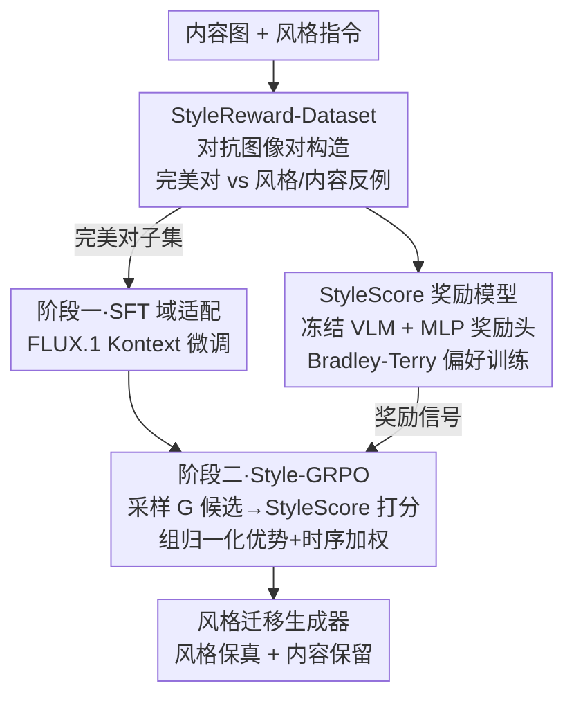

# Style-GRPO: Semantic-Aware Preference Optimization for Image Style Transfer Guided by Reward Modeling

**会议**: CVPR 2026  
**论文**: [CVF Open Access](https://openaccess.thecvf.com/content/CVPR2026/html/Zhao_Style-GRPO_Semantic-Aware_Preference_Optimization_for_Image_Style_Transfer_Guided_by_CVPR_2026_paper.html)  
**代码**: 无  
**领域**: 图像生成 / 风格迁移 / 偏好优化  
**关键词**: 风格迁移、GRPO、奖励模型、风格-内容解耦、扩散模型后训练

## 一句话总结
针对扩散编辑模型做风格迁移时"风格泄漏 + 语义漂移"的老问题，本文造了一个 30 万对抗图像对的偏好数据集 StyleReward-Dataset，训出一个能同时打分风格一致性与内容保真度的多模态奖励模型 StyleScore，再用「SFT 域适配 + GRPO 偏好优化」两阶段把 FLUX.1[Kontext] 调成 SOTA，在 ImgEdit / AnyEdit 上风格保真和内容保留双双领先，用户研究中 87.5% 被选为第一。

## 研究背景与动机
**领域现状**：当前主流的指令引导风格迁移建立在 flow-based 扩散编辑模型（FLUX.1[Kontext]、Qwen-Image-Edit 等）之上，给一张内容图加一句风格指令，让模型把整图改成目标风格、同时保留内容语义。

**现有痛点**：这些模型大多是为**局部编辑**（物体增删、局部修补）优化的，擅长"改某块区域、保持其余不变"。但风格迁移要求的是**全局变换**——整张图都要换风格、又得保住主体身份。把局部编辑模型直接拿来做全局风格迁移，结果要么风格上不去（stylization 不足），要么风格上去了但内容被改坏（语义漂移，例如把城堡改成水彩后结构崩了、把椅子改成波普风后主体变样）。

**核心矛盾**：风格一致性与内容保真度之间存在 trade-off。要风格强就容易牺牲内容结构，要内容稳就容易风格不到位，二者很难同时满足。监督微调（SFT）能缓解一部分，但容易过拟合数据集偏差、对没见过的复合风格泛化差。

**更深一层的障碍**：想用 RL/偏好优化来对齐这个 trade-off，却卡在**没有可靠奖励信号**上——通用 VLM 奖励模型（Qwen2.5-VL、ImageReward）分不清"风格对但内容错"和"内容对但风格错"，常把笼统的美观度当成风格保真度，无法刻画风格迁移这种细粒度的解耦权衡。

**核心 idea**：先用对抗式构造的偏好数据**教会一个奖励模型识别这个 trade-off**（StyleScore），再用这个奖励模型驱动 GRPO 在线优化生成器，让模型直接在"风格 vs 内容"的取舍上学习，而不是靠 SFT 的固定监督。

## 方法详解

### 整体框架
全套方法由三块串成一条管线：① 先构造 **StyleReward-Dataset**——一个 30 万对抗图像对的偏好数据集，每个内容样本配一张"风格内容都对"的完美图，再配上"只对风格"或"只对内容"的反例图，把风格-内容解耦显式编码进数据；② 用这份数据训出 **StyleScore**——一个冻结 Qwen2.5-VL-7B 主干、外接 MLP 奖励头的多模态奖励模型，能给生成图打出一个统一标量分，精确量化风格一致性、内容保留、感知质量；③ 用 **Style-GRPO 两阶段后训练**把基模型 FLUX.1[Kontext] 调好——先在完美对子集上 SFT 做域适配，再用 StyleScore 当奖励函数跑 GRPO 在线强化学习。三块互相依赖：数据集喂奖励模型，奖励模型当 GRPO 的裁判，GRPO 才能学到细粒度的取舍。

### 关键设计

**1. StyleReward-Dataset：用对抗图像对把"风格-内容解耦"显式写进监督信号**

通用风格迁移数据集只给"内容图 + 目标风格图"的正样本对，模型学不到"什么叫错"。本文的做法是对每个内容样本同时生成**完美对**和两类**不完美对**，逼模型在对比中分清两个失败维度。具体地，内容数据从 GenRef-wds 采 2 万对，风格数据分真实风格（WikiArt、Style30K、Omnistyle）与虚拟风格（用 GPT-5 生成结构化模板 + T2I 合成），经美学分 / GPT-4o / Gemini 多重过滤后，构造三类样本：完美对（Omnistyle、StyleID 生成、专家校验过风格与语义都对）、"内容对但风格错"（保住内容、色调纹理偏离）、"风格对但内容错"（风格对但篡改内容 prompt 导致语义漂移）。整套经"开源 Qwen2.5-VL 7B→72B 初筛 + GPT-5/Gemini-2.5 精判 + 人类专家兜底"的分层过滤，最终 30 万对抗对、15 万 prompt。这种对抗构造让数据天然支持偏好学习——奖励模型能从"哪边好哪边坏"里学到风格与内容各自的判别边界，而不是只学一个笼统的"好看"。

**2. StyleScore：冻结 VLM + MLP 奖励头，用 Bradley-Terry 训出统一的风格-内容裁判**

通用 VLM 奖励模型把美观度和风格保真度混为一谈，无法惩罚"为了好看牺牲内容"的结果。StyleScore 以 Qwen2.5-VL-7B 为主干，把原本的语言建模头换成一个两层 MLP 奖励头，输出标量奖励。给定查询 $x=(c, x_c)$（指令 $c$ + 内容图 $x_c$）和响应图 $y$，多模态输入经主干抽出末层隐状态 $h_{final}$，奖励头计算 $l_{act}=\mathrm{SiLU}(W_1 h_{final}+b_1)$，$r_\phi(y|x)=W_2 l_{act}+b_2$，取最后一个 token 的分作为序列标量奖励 $r_i=R_i[-1]$。训练用 Bradley-Terry 偏好模型：

$$P(y_w \succ y_l \mid x) = \sigma\big(r_\phi(y_w \mid x) - r_\phi(y_l \mid x)\big)$$

$$\mathcal{L}_{Reward}(\theta) = \mathbb{E}_{(x, y_w, y_l)\sim D}\big[-\log \sigma(r_w - r_l)\big]$$

其中 $y_w$ 是完美图、$y_l$ 是退化图，目标是拉大完美与退化之间的奖励 margin。训练只用 LoRA（rank 64）更新 MLP 奖励头等轻量组件，主干冻结。在 500 对测试集上，StyleScore 偏好准确率 98.6%，远高于 Qwen2.5-VL 的 65.2% 和 ImageReward 的 48.7%——专门训练让它能分辨通用模型看不出的细微风格/内容偏差，从而当 GRPO 的可靠奖励。

**3. Style-GRPO：SFT 域适配打底 + GRPO 偏好优化，组归一化优势 + 时序奖励加权**

直接对编辑模型跑 RL 会失败，因为 PPO/DPO 默认优化目标落在预训练分布内，而风格迁移的目标分布跨越大量没见过的艺术域，模型对风格语义理解有限。所以**第一阶段 SFT**先在完美对子集上微调 FLUX.1[Kontext]（flow-matching 目标 $\mathcal{L}_{SFT}=\mathbb{E}_{t,z}\big[\lVert v_\theta(z,t,c)-u_t(z|c)\rVert_2^2\big]$，$v_\theta$ 预测速度场、$u_t$ 为目标速度场），把模型适配到风格迁移域、建一个稳定的初始策略。**第二阶段 GRPO**才做细粒度解耦：先按 Flow-GRPO 把确定性 ODE 采样改成随机 SDE 引入探索噪声，对每条编辑指令 $c$ 采 $G$ 条轨迹、用 StyleScore 打分，算组归一化优势

$$\hat{A}^i_t = \frac{R(\hat{x}^i_0; x^i_0, c) - \mathrm{mean}(\{R(\hat{x}^j_0)\}_{j=1}^G)}{\mathrm{std}(\{R(\hat{x}^j_0)\}_{j=1}^G)}$$

再用带 KL 约束的裁剪目标更新策略：$\mathcal{L}_{Style\text{-}GRPO}(\theta)=\mathbb{E}\big[\frac{1}{G}\sum_i \frac{1}{T}\sum_t \min(r^i_t \hat{A}^i_t,\, \mathrm{clip}(r^i_t,1-\epsilon,1+\epsilon)\hat{A}^i_t) - \beta D_{KL}(\pi_\theta \Vert \pi_{ref})\big]$，其中概率比 $r^i_t=\frac{p_\theta(x^i_{t-1}|x^i_t,c)}{p_{\theta_{old}}(x^i_{t-1}|x^i_t,c)}$，KL 项防止 reward hacking。GRPO 免去价值网络、内存与样本效率更高。额外地，作者注意到**去噪早期步对全局风格更关键**，加了一个时序感知的奖励加权 $w(t)=\alpha^{t/T}$（指数衰减），让奖励信号在风格关键的早期时间步占更大权重，进一步增强风格-内容解耦。

### 损失函数 / 训练策略
- **奖励模型**：Qwen2.5-VL-7B + LoRA(rank 64)，lr 5e-5，batch 32，Bradley-Terry loss。
- **SFT**：FLUX.1[Kontext] + LoRA(rank 128)，batch 32，flow-matching 目标，仅用完美对子集。
- **GRPO**：LoRA(rank 128)，lr 5e-4，importance clip 1e-4，group size 16，KL 系数 0.01；奖励信号 = StyleScore + CLIP Score + Aesthetic Score；分辨率 1024×1024；8×H200 训练。

## 实验关键数据

### 主实验
在公开 ImgEdit（GPT-4o / Gemini-2.5-Pro 打分）与 AnyEdit（CLIP/DINO 客观指标）上对比 SOTA：

| 方法 | ImgEdit GPT-4o↑ | ImgEdit Gemini↑ | CLIPimg↑ | CLIPtext↑ | L1距离↓ | DINO↑ | StyleScore↑ |
|------|------|------|------|------|------|------|------|
| InstructP2P | 3.55 | 2.65 | 0.8260 | 0.1717 | 0.1550 | 0.7104 | 3.21 |
| DiffStyler | 1.51 | 1.65 | 0.4900 | 0.1889 | 0.2395 | 0.5875 | 2.03 |
| StyleBooth | 4.33 | 3.88 | 0.8221 | **0.1986** | 0.2075 | 0.7230 | 3.46 |
| Omnistyle | 3.77 | 2.38 | 0.7590 | 0.1797 | 0.1907 | 0.6981 | 2.96 |
| FLUX.1 Kontext | 4.55 | 4.29 | 0.8215 | 0.1857 | 0.2457 | 0.7311 | 3.77 |
| **本文** | **4.74** | **4.46** | **0.8452** | 0.1664 | **0.0944** | **0.7583** | **3.91** |

本文在 ImgEdit 两套打分、CLIPimg、L1、DINO、StyleScore 上全面领先；尤其 L1 距离从次好的 0.155 降到 0.094、DINO 升到 0.758，说明内容结构保真度大幅提升。CLIPtext 略低是预期的 trade-off——模型优先贴合参考图的细粒度视觉线索而非笼统文本先验，不为对齐文本牺牲风格细节与内容结构。

奖励模型本身的偏好准确率与用户研究：

| 评估 | 对比项 | 结果 |
|------|--------|------|
| 奖励模型偏好准确率 | Qwen2.5-VL / ImageReward / 本文 | 65.2% / 48.7% / **98.6%** |
| 用户研究 Rank-1 占比 | FLUX Kontext / 本文 | 10.3% / **87.5%** |

36 名参与者在 50 条 prompt 上盲评，本文 87.5% 被选为第一，强证据表明更贴合人类对高保真风格迁移的偏好。

### 消融实验
拆解 SFT 与 GRPO 两阶段的贡献（ImgEdit + StyleScore）：

| 配置 | GPT-4o | Gemini | StyleScore | 说明 |
|------|--------|--------|------------|------|
| FLUX.1 Kontext（基线） | 4.55 | 4.29 | 3.77 | 原始模型 |
| +SFT | 4.67 | 4.34 | 3.82 | 仅域适配 |
| +Post-Training(仅 GRPO) | 4.68 | 4.30 | 3.85 | 直接对基线跑 GRPO |
| +SFT+Post-Training | **4.74** | **4.46** | **3.91** | 完整两阶段 |

### 关键发现
- **单独用 SFT 或单独用 GRPO 都能显著超基线**，且仅 GRPO 已能逼平甚至略超仅 SFT——说明 StyleScore 引导的直接偏好优化本身就很强。
- **但两阶段组合最优**：SFT 先把模型适配到风格域、建一个更稳更"懂风格"的初始策略，GRPO 才能更有效探索、收敛到更好的解。这验证了"域适配打底 + 偏好精修"的设计。
- **L1/DINO 的大幅领先**是本文最有说服力的点：在风格上得最高分的同时内容结构反而最稳，正面回应了风格迁移最核心的解耦难题。

## 亮点与洞察
- **用对抗反例把"trade-off"显式编码进数据**：与其让模型隐式学权衡，不如直接给它看"只对风格"和"只对内容"两类失败，奖励模型于是学到两个独立判别维度——这是 98.6% 偏好准确率的根。这个对抗对构造思路可迁移到任何"两个目标互相打架"的生成任务（如真实性 vs 多样性）。
- **专用奖励模型 >> 通用 VLM 奖励**：通用 VLM 把美观和保真混为一谈、准确率只有 65%，专门训过的 StyleScore 到 98.6%，强烈说明 RLHF/GRPO 类方法的天花板往往卡在奖励信号质量而非策略优化算法。
- **时序感知奖励加权**：把"早期去噪步决定全局风格"的扩散先验编进 $w(t)=\alpha^{t/T}$，让奖励在风格关键步更重——一个轻量却符合物理直觉的 trick，可复用到其他扩散 RL 任务。
- **SFT 当 RL 的"稳定地基"**：消融显示 GRPO 单独也行，但从域适配策略出发能探索得更好，呼应了 LLM 后训练里"SFT cold-start + RL"的范式在视觉生成上同样成立。

## 局限与展望
- 作者承认当前只支持**文本引导**的风格迁移，未来要扩展到**以参考图作为风格 prompt**，以获得更细的艺术控制。
- ⚠️（自己发现）整条管线重度依赖大量闭源/开源模型做数据构造与过滤（GPT-5、Gemini-2.5、GPT-4o、多尺寸 Qwen2.5-VL）+ 人工专家校验，30 万对抗对的构建成本与可复现性存疑；论文未公开代码，复现难度高。
- ⚠️ 奖励模型在自建测试集上 98.6% 的准确率可能高估泛化——评测集与训练集同源，跨域风格上的真实判别力未充分验证。
- RL 阶段奖励同时混用 StyleScore + CLIP + Aesthetic 三个信号，三者权重配比与各自贡献文中未细究，存在 reward hacking 风险（虽有 KL 约束缓解）。

## 相关工作与启发
- **vs FLUX.1[Kontext]（基模型）**：Kontext 擅长区域感知的局部编辑、但做全局风格迁移会风格不一致 + 内容漂移；本文在其上叠 SFT+GRPO，把它从"局部编辑器"调成"全局风格迁移器"，L1 从 0.2457 降到 0.0944。
- **vs Flow-GRPO**：本文沿用其 ODE→SDE 转换引入探索噪声的思路，但把奖励从通用信号换成专门的语义感知 StyleScore，并加了时序奖励加权，针对风格迁移做了任务特化。
- **vs StyleBooth / Omnistyle（数据集类工作）**：它们提供高质量风格-内容正样本对改善训练；本文进一步用**对抗反例**支持偏好学习，从"学什么是对"升级到"学怎么区分对与各类错"。
- **vs DPO**：DPO 假设优化目标落在预训练分布内，对跨多艺术域的风格迁移过于受限；本文用"SFT 拉分布 + GRPO 在线探索"绕开这一假设。

## 评分
- 新颖性: ⭐⭐⭐⭐ 把"对抗偏好数据 + 专用奖励模型 + 两阶段 GRPO"系统化用于风格迁移、显式解耦风格与内容，组合新颖但各组件多为已有范式的迁移。
- 实验充分度: ⭐⭐⭐⭐ 公开+自建双 benchmark、客观指标+LLM 打分+用户研究+消融齐全；但奖励模型评测同源、缺跨域泛化与权重消融。
- 写作质量: ⭐⭐⭐⭐ 动机与 trade-off 论证清晰、图表完整；公式编号偶有重复、个别表述略冗。
- 价值: ⭐⭐⭐⭐ 给"风格-内容解耦"这一长期难题提供了可落地的奖励驱动方案，对扩散后训练社区有参考价值；惜未开源、复现门槛高。

<!-- RELATED:START -->

## 相关论文

- [\[CVPR 2026\] StyleGallery: Training-free and Semantic-aware Personalized Style Transfer from Arbitrary Image References](stylegallery_training-free_and_semantic-aware_personalized_style_transfer_from_a.md)
- [\[CVPR 2026\] Enhancing Spatial Understanding in Image Generation via Reward Modeling](enhancing_spatial_understanding_in_image_generation_via_reward_modeling.md)
- [\[CVPR 2026\] Harmonic Canvas: Inversion-Free Editing for Visually-Guided Music Style Transfer](harmonic_canvas_inversion-free_editing_for_visually-guided_music_style_transfer.md)
- [\[CVPR 2025\] SaMam: Style-aware State Space Model for Arbitrary Image Style Transfer](../../CVPR2025/image_generation/samam_style-aware_state_space_model_for_arbitrary_image_style_transfer.md)
- [\[CVPR 2026\] A Style is Worth One Code: Unlocking Code-to-Style Image Generation with Discrete Style Space](a_style_is_worth_one_code_unlocking_code-to-style_image_generation_with_discrete.md)

<!-- RELATED:END -->
