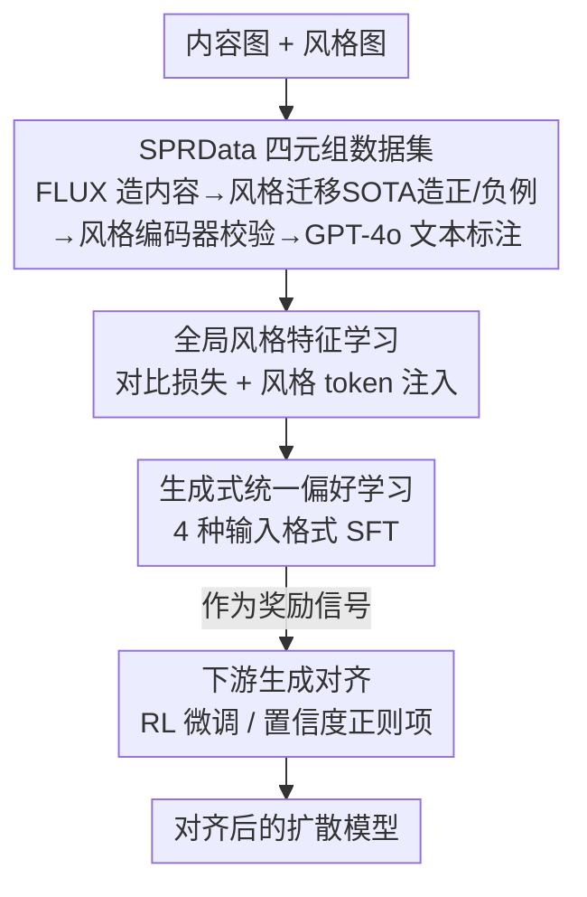

# StyleDoctor: Towards Specialist Reward Model for Style-centric Generation Tasks

**会议**: CVPR 2026  
**论文**: [CVF Open Access](https://openaccess.thecvf.com/content/CVPR2026/html/He_StyleDoctor_Towards_Specialist_Reward_Model_for_Style-centric_Generation_Tasks_CVPR_2026_paper.html)  
**代码**: https://github.com/Xilin-He/StyleDoctor （论文标注「Dataset and code are available」，仓库地址 ⚠️ 以原文为准）  
**领域**: 图像生成 / 风格迁移 / 奖励模型  
**关键词**: 风格奖励模型, 风格一致性, 强化微调, 多模态大模型, 偏好学习

## 一句话总结
StyleDoctor 用一个基于多模态大模型（Qwen2.5-VL-3B）的「风格专用奖励模型」替代通用的人类偏好奖励模型——先构建 40 万条「四元组」风格偏好数据集 SPRData，再三阶段训练让模型同时会读图像风格和文本风格语义，最终作为奖励信号去强化微调扩散模型，把风格生成/迁移的风格一致性显著拉高。

## 研究背景与动机
**领域现状**：扩散模型让风格生成（把图像渲染成目标风格）进展飞快，而近期一类做法是给扩散模型套上「强化微调（RL fine-tuning）」——用一个从人类偏好里学来的奖励模型（reward model）给生成结果打分，再用 DPO / Flow-GRPO 等方法把模型往高分方向推，在通用生成与编辑任务上效果显著。

**现有痛点**：作者发现一个关键错配——现成的人类偏好奖励模型（如 HPSv2/v3）是为「美学质量」打分训练的，而风格任务真正在意的是「生成结果和参考风格的一致性」。论文 Fig.2 给的例子很直观：一张审美分高的图和一张审美分低的图，在「是否忠实于参考风格」上的排序可能完全相反。直接拿这类模型当奖励，RL 微调后风格反而对不齐。另一条退路是拿现有「风格感知模型」（CSD/CLIP，靠对比学习编码图像级风格）当奖励，但它们只建模图像级特征、不吃跨模态监督（风格图–文本对应），泛化不到多样的文本风格 prompt，也撑不起多模态生成任务的奖励。

**核心矛盾**：奖励模型的训练目标（美学 / 通用偏好）和风格生成的目标（风格一致性）之间存在内在错配；而专门的风格感知模型又缺少图文联合建模，没法当通用奖励函数。

**本文目标**：造一个「专科」奖励模型，它要同时满足两件事——既能判定成对图像之间谁更贴合参考风格，又能判定图像和风格文本是否对齐——并且能直接插进现有 RL 微调管线。

**切入角度**：作者押注多模态大模型（MLLM）：它天生擅长视觉理解和图文对齐，只要喂对数据、把「全局风格特征」显式注入，就能既看局部风格线索（图像 token）又看全局风格特性（专门的风格 token）。

**核心 idea**：用「四元组风格偏好数据 + 多模态大模型 + 三阶段训练」造出一个专门评判风格一致性的生成式奖励模型，用它的「正例置信度」当奖励信号去对齐扩散模型。

## 方法详解

### 整体框架
StyleDoctor 的产线分三大块：先**造数据**（SPRData，40 万四元组），再**三阶段训练**一个 MLLM 奖励模型，最后把它**接入下游生成对齐**。

数据侧，作者造的不是常见的三元组（内容图 + 风格图 + 一张合成图），而是**四元组**：内容图 + 风格图 + 两张合成风格图，其中一张风格/内容一致性明显更好（正例）、一张更差（负例）。这种成对设计让奖励模型能直接学到「同一条件下两个结果谁更好」的细粒度偏好——这正是 RL 微调最需要的信号。

模型侧，骨干用轻量的 Qwen2.5-VL-3B，分三阶段把「风格感知能力」逐步灌进去：① 用对比损失学**全局风格特征**；② 把全局风格特征作为一个特殊「风格 token」注入，配合普通图像 token，再用图文 caption 数据微调出基础风格理解；③ 把四元组重组成 4 种输入格式做**统一偏好学习**，让模型在文本条件、参考图条件、多图比较等各种范式下都会判风格一致性。

对齐侧，训练好的 StyleDoctor 有两种用法：要么作为奖励模型插进 DPO / Flow-GRPO 这类正式 RL 管线；要么把它对正例答案的输出置信度当作分数，作为正则项去最大化（如配合 ReNeg / B-LoRA）。

### 关键设计

**1. SPRData：四元组风格偏好数据集，喂模型「谁更贴风格」的成对信号**

风格奖励学习卡在没有可直接比较的成对数据：以往风格迁移数据集要么只做风格分类（WikiArt/Style30k/ArtBench，没有内容图和合成图），要么是单样本三元组（IMAGStyle/OmniStyle），没法直接比「两个合成结果谁的风格保持得更好」。SPRData 用四元组解决：每条含 内容图 + 风格图 + 正例合成图 + 负例合成图。造法是流水线化的——先用 ChatGPT 生成约 500 个物体概念、每个扩成 40 条 prompt，用 FLUX 生成参考内容图；风格图从 Style30k 的 1000 类里随机采样；正例用 OmniStyle/CSGO 这类 SOTA 风格迁移方法生成，负例同样用 CSGO 但**调低其解耦注意力模块的风格注入强度**，故意削弱风格对齐；再用 CSD 的风格编码器校验，确认正例的风格一致性分确实高于负例。文本标注分两类：用 GPT-4o 写「多维度风格分析」的推理标注（全局风格、色板、笔触纹理、构图四个维度，带 `<think>...</think>` 打分），以及把已知风格类别套模板得到的生成指令（如「Convert into {STYLE-CATE} style」）。最终 40 万四元组 + 20 万图文 caption 对，覆盖 1000 类风格。这套「成对偏好 + 多维度风格分析文本」是后续奖励建模能学到细粒度偏好的根基。

**2. 全局风格特征学习 + 风格 token 注入：让 MLLM 既看局部又看全局风格**

以往风格感知模型只做图像级建模，MLLM 又默认只吃序列化图像 token、缺全局风格先验。作者在视觉编码器 $E_v$ 后加一层线性投影，用对比损失学全局风格嵌入：

$$\mathcal{L}_{con} = -\frac{1}{N}\sum_{i=1}^{N}\log\frac{\exp\!\big(\mathrm{sim}(z_i, z_i^{+})/\tau\big)}{\sum_{j=1}^{N}\exp\!\big(\mathrm{sim}(z_i, z_j^{-})/\tau\big)}$$

其中 $z_i = E_v(x_i)$ 是图像 $i$ 的视觉嵌入，$z_i^{+}$ 是同风格正例、$\{z_j^{-}\}$ 是异风格负例，$\mathrm{sim}(\cdot,\cdot)$ 是余弦相似度，$\tau$ 是温度。学到全局风格特征后，把它经一个额外投影层注入成一个**专门的风格 token**（用 `<STY_START>`/`<STY_END>` 包住），和标准图像 token 并排喂给语言模型——这样模型既能从图像 token 读局部风格线索，又能从风格 token 读全局风格特性。这一阶段再用 SPRData 的图文 caption 部分以交叉熵微调，把基础风格理解能力灌进模型。

**3. 生成式统一偏好学习：把四元组重组成 4 种输入格式，一次训练通吃多任务**

下游风格任务的输入范式五花八门（纯文本条件、参考图条件、多图比较），如果每种单独训会割裂。作者把 SPRData 四元组**重组成 4 种格式**联合训练：① 一张输入图（判它是否是 {STYLE_CATE} 风格）；② 一张输入图 + 一张参考风格图（判是否与参考风格一致）；③ 两张输入图（判哪张更贴 {STYLE_CATE}）；④ 两张输入图 + 一张参考风格图（判哪张更贴参考图风格）。前两种是「条件判断」，后两种是「偏好选择」。统一用交叉熵以监督微调（SFT）方式训练，把细粒度风格分析能力注入奖励模型，使它在各种风格生成范式下都能给出一致性判定。

**4. 生成对齐：用「正例置信度」当奖励，接 RL 也能当正则项**

StyleDoctor 是生成式奖励模型，输出的是文本而非一个标量分数，没法直接当 reward。作者的处理是：取它对**正例答案在输出 logits 空间里的平均置信度**作为奖励替代量——这个值反映 StyleDoctor 对「风格条件与采样图像风格相似」的确信程度。基于此有两种对齐用法：一是作为奖励模型直接插进 DPO / Flow-GRPO 等正式 RL 微调，且它给的是「全局风格一致性 / 色板和谐 / 笔触纹理」多维度可解释信号，而非二值或纯美学反馈；二是把这个置信度当正则项去最大化（参照 ReNeg 学习风格化负嵌入、或配合 B-LoRA 做风格定制），通过对生成图一步估计后最大化奖励期望来优化可学习组件。

## 实验关键数据

### 主实验

**风格感知（检索 + 多模态理解）**：在 WikiArt 采 1 万图像对做「是否同风格」二分类，以及 SPRData 衍生的多模态风格理解测试集上，StyleDoctor 全面领先视觉编码器和通用 MLLM。

| 方法 | 检索准确率 Retri. Acc. | 多模态理解 MM Und. Acc. |
|------|------|------|
| CLIP | 53.45 | 46.28 |
| CSD | 62.60 | 53.25 |
| SigLIP | 58.39 | 48.20 |
| Qwen-2.5-VL (3B) | 71.82 | 66.54 |
| **StyleDoctor** | **75.46** | **71.14** |

**作为奖励模型对齐生成**：把 StyleDoctor 当奖励插进 OmniGen2 等模型的 RL 微调，风格生成/迁移指标普遍提升（CSD 为风格编码器相似度，GPT 为 GPT-4o 判定的风格分，Content 为内容保持度）。

| 任务 / 方法 | 风格指标 | 内容保持 |
|------|------|------|
| 文本控制生成 OmniGen2 | 65.42 / 58.85 (StyDoc./GPT) | - |
| 文本控制生成 OmniGen2 + StyDoc. | **69.58 / 67.60** | - |
| 参考图生成 AttnDistill | 0.67 (CSD) | - |
| 参考图生成 OmniGen2 + StyDoc. | **0.72 (CSD)** | - |
| 指令风格迁移 Flux-Kontext | 74.35 (GPT) | 0.67 |
| 指令风格迁移 Flux-Kontext + StyDoc. | **78.54 (GPT)** | **0.68** |
| 参考图风格迁移 OmniStyle | 0.74 / 67.86 (CSD/GPT) | 0.66 |
| 参考图风格迁移 OmniStyle + StyDoc. | **0.78 / 72.25** | **0.72** |

**vs 人类偏好奖励模型**：直接对标 HPSv2/v3，无论风格理解还是引导下游生成，StyleDoctor 都明显更高，印证「通用偏好奖励不适合风格任务」的核心论点。

| 方法 | 检索 Retri. | 多模态 MM Und. | 生成 Style | 生成 Content |
|------|------|------|------|------|
| HPSv2 | 56.83 | 40.20 | 0.45 | 0.62 |
| HPSv3 | 68.75 | 63.45 | 0.64 | 0.63 |
| **StyleDoctor** | **75.46** | **71.14** | **0.78** | **0.69** |

### 消融实验
在风格定制任务上拆解两大组件——GSF（全局风格特征学习）与 UPL（统一偏好学习，表中记作 USP）。MM Und. 为多模态理解准确率，Gen. 为 CSD 风格一致性分。

| 配置 | GSF | UPL | MM Und. | Gen. |
|------|------|------|------|------|
| Baseline | – | – | 66.54 | 0.69 |
| 仅 GSF | ✓ | – | 69.63 | 0.72 |
| 仅 UPL | – | ✓ | 69.70 | 0.73 |
| **StyleDoctor** | ✓ | ✓ | **71.14** | **0.78** |

另外作为正则项配合 B-LoRA 做风格定制（SDXL 为底模），StyleDoctor 也优于用 CSD 当正则：B-LoRA 0.68/65.18 → +CSD 0.75/68.62 → +StyDoc. **0.78/70.45**（CSD/GPT）。

### 关键发现
- 两个组件各自加上都能涨点（66.54→69.6 量级），但**叠加后才到 71.14 / 0.78**，说明「全局风格特征」和「统一偏好学习」是互补的：前者补全局风格先验，后者补跨范式的细粒度偏好判定。
- 人类偏好奖励模型（HPSv2 检索仅 56.83、生成风格分仅 0.45）在风格任务上明显拖后腿，直接证明「美学偏好 ≠ 风格一致性」，这是全文最有说服力的反例。
- 一个反直觉发现：原始 OmniGen2 在参考图引导风格生成上会直接「抄」参考风格图输出，导致任务完全失败，所以这一格没法报它的基线分——侧面说明风格对齐光靠生成模型本身不够，需要专门奖励信号纠偏。

## 亮点与洞察
- **四元组 > 三元组**：把「单张合成图」换成「正负成对合成图」，一步把数据从「能描述风格」升级到「能比较风格优劣」，这正是奖励/偏好学习的命门——可迁移到任何需要 pairwise 偏好的奖励建模任务。
- **负例靠「调低风格注入强度」批量造**：用同一个 CSGO、只削弱其解耦注意力的风格注入，就能廉价产出可控难度的负例，再用 CSD 编码器自动校验正负差距，省掉人工标注，是个很实用的数据 trick。
- **生成式奖励模型用「正例置信度」当标量奖励**：MLLM 输出文本没有现成分数，取正答 logits 平均置信度作替代，让生成式奖励模型也能无缝插进只接受标量奖励的 RL/正则管线，思路可复用到其他「拿 LLM 当裁判」的对齐场景。
- **多维度可解释奖励**：奖励信号拆成全局风格/色板/笔触/构图四维，比二值或单一美学分更细、也更便于诊断模型在哪个风格维度没对齐。

## 局限与展望
- 奖励来自生成式模型的 logits 置信度而非真正的标量分数，这种「代理奖励」的可靠性和校准程度论文没深入分析，⚠️ 在风格分布外或置信度饱和时是否仍单调可靠存疑。
- 数据高度依赖现有 SOTA 风格迁移方法（OmniStyle/CSGO）生成正负例，正例质量上限被这些方法本身的风格保真度框住；负例靠「削弱风格注入」制造，难度分布可能偏单一。
- 风格类别虽达 1000 类但都来自 Style30k，对训练集未见的全新/混合风格的泛化没专门评测。
- 评测大量依赖 CSD 编码器和 GPT-4o 做风格一致性判定，存在「用一个风格模型评另一个」的循环风险，⚠️ 与人类主观风格判断的相关性缺乏直接验证。

## 相关工作与启发
- **vs 人类偏好奖励模型（HPSv2/v3）**: 它们为通用美学/图文对齐打分，本文专攻风格一致性；区别在训练目标和数据（成对风格偏好 vs 通用人类偏好），本文在风格任务上全面胜出，但通用美学场景未必更强。
- **vs 图像级风格感知模型（CSD/CLIP）**: 它们靠对比学习编码图像级全局风格、不吃跨模态监督，本文用 MLLM 联合建模图像风格 + 文本风格语义，能处理文本条件和多图比较等范式；代价是模型更重、依赖大模型骨干。
- **vs 风格迁移生成方法（OmniStyle/CSGO/Flux-Kontext）**: 它们是被对齐的「生成器」，本文是给它们打分的「奖励器」，两者互补——本文实验里这些方法接上 StyleDoctor 后风格分普遍提升。

## 评分
- 新颖性: ⭐⭐⭐⭐ 「风格专用奖励模型」切入点清晰，四元组数据 + 生成式奖励的置信度用法都有新意，但底层组件（对比损失、SFT、ReNeg/DPO）均为现成拼装。
- 实验充分度: ⭐⭐⭐⭐ 覆盖检索/理解/四类下游生成/正则与 RL 两种对齐/与人类偏好奖励对比/消融，较全面；但泛化与代理奖励可靠性的分析偏薄。
- 写作质量: ⭐⭐⭐⭐ 动机与错配论点讲得清楚，Fig.2/Fig.3 直观；三阶段训练细节稍显分散。
- 价值: ⭐⭐⭐⭐ 给风格生成的 RL 对齐补上了缺失的奖励模型，配套 40 万级数据集，实用价值高。

<!-- RELATED:START -->

## 相关论文

- [\[CVPR 2026\] Style-GRPO: Semantic-Aware Preference Optimization for Image Style Transfer Guided by Reward Modeling](style-grpo_semantic-aware_preference_optimization_for_image_style_transfer_guide.md)
- [\[CVPR 2026\] A Style is Worth One Code: Unlocking Code-to-Style Image Generation with Discrete Style Space](a_style_is_worth_one_code_unlocking_code-to-style_image_generation_with_discrete.md)
- [\[CVPR 2026\] OSPO: Object-Centric Self-Improving Preference Optimization for Text-to-Image Generation](ospo_object-centric_self-improving_preference_optimization_for_text-to-image_gen.md)
- [\[CVPR 2026\] Unified Customized Generation by Disentangled Reward Modeling](unified_customized_generation_by_disentangled_reward_modeling.md)
- [\[CVPR 2026\] Enhancing Spatial Understanding in Image Generation via Reward Modeling](enhancing_spatial_understanding_in_image_generation_via_reward_modeling.md)

<!-- RELATED:END -->
