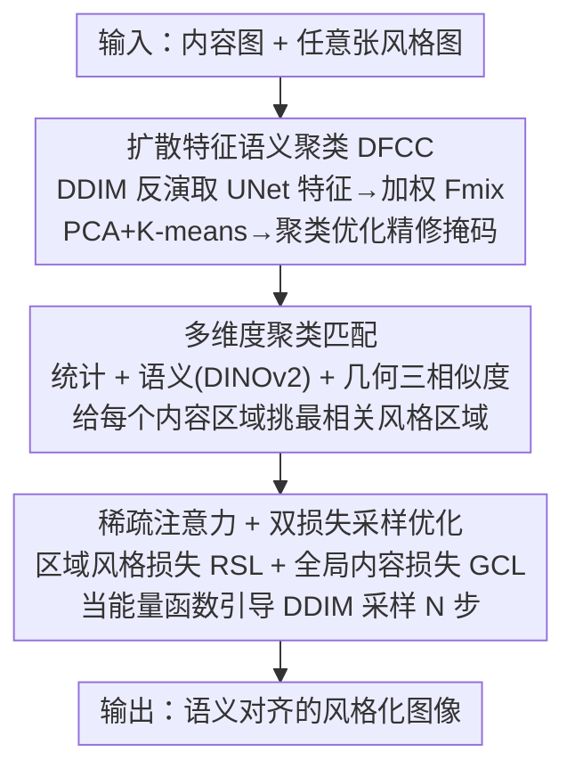

# StyleGallery: Training-free and Semantic-aware Personalized Style Transfer from Arbitrary Image References

**会议**: CVPR 2026  
**论文**: [CVF Open Access](https://openaccess.thecvf.com/content/CVPR2026/html/He_StyleGallery_Training-free_and_Semantic-aware_Personalized_Style_Transfer_from_Arbitrary_Image_CVPR_2026_paper.html)  
**代码**: https://github.com/iiiiiiiword/StyleGallery  
**领域**: 扩散模型 / 图像生成  
**关键词**: 风格迁移, 训练免, 语义感知, 扩散特征聚类, 区域匹配

## 一句话总结
StyleGallery 是一个训练免的语义感知风格迁移框架：它先用扩散模型的中间特征对内容图做无监督语义聚类，再用统计/语义/几何三个维度把内容区域与任意张参考风格图中最相关的区域自适应匹配，最后用区域风格损失引导扩散采样，从而在不要外部掩码的前提下实现可解释、可个性化定制的细粒度风格迁移。

## 研究背景与动机
**领域现状**：基于扩散模型的风格迁移近年很火，主流训练免方法（如 StyleID、Attention Distillation/AD）大多在预训练扩散模型的自注意力模块里做文章——要么把参考图的 K/V 注入自注意力层，要么用一个能量函数约束去噪方向，把风格当成一个整体的全局特征贴到内容图上。

**现有痛点**：这种"全局贴风格"忽略了语义对应关系，会同时踩三个坑。其一是**语义鸿沟**：单张风格图的语义未必覆盖内容图（内容里有"山"但风格图里没有），导致某些区域被错误地涂上不相干的风格。其二是**依赖额外约束**：要做语义对齐就得喂语义分割掩码（如 SCSA），还要求内容图和风格图语义结构相似，适用面被卡死。其三是**特征关联僵硬**：缺乏内容-风格之间自适应的全局-局部对齐，既保不住细粒度风格、又保不住全局结构。具体到现象上，StyleID 内容保得好但风格化不足（遇到纯色背景甚至乱涂图案），AD 风格化更强却带来内容泄漏。

**核心矛盾**：风格迁移强度与内容结构保持之间存在 trade-off，而根因在于现有方法把风格当成"单一整体特征"去搬运，没有按语义区域去做"哪块内容该配哪块风格"的自适应匹配。

**本文目标**：在不引入任何额外输入（掩码/分割图）、不训练的前提下，支持任意张参考风格图，做到区域级、语义对齐、可解释、可个性化定制的风格迁移。

**切入角度**：作者沿用"语义区域才是风格特征的基本载体、内容-风格区域间的自适应匹配是高质量迁移的关键"这一假设，并观察到扩散模型自身的 UNet 中间特征（DIFT 那套）就足以无监督地把语义区域分出来——于是不需要外部分割模型。

**核心 idea**：用"分而治之"取代"整体贴风格"——先用扩散特征把图切成语义区域，再按语义相关性给每个内容区域挑最匹配的风格区域，最后只在匹配区域对内的注意力上施加风格损失。

## 方法详解

### 整体框架
给定一组风格图 $I_s=\{I_1, I_2, \dots\}$（数量任意）和一张内容图 $I_c$，StyleGallery 的目标是从风格集里自适应找出与内容语义匹配的区域来做风格化，同时保住内容结构、抑制泄漏。整条管线分三个阶段串行：先把图切成语义区域（聚类），再把内容区域和风格区域配对（匹配），最后在配对关系下用损失引导采样（优化生成）。

### 关键设计

**1. 扩散特征语义聚类（DFCC）：不靠外部分割模型，用扩散自身特征把图切成语义区域**

这一步针对"做语义对齐就得喂额外掩码"的痛点。作者基于 DIFT 的思路，把图像输入预训练扩散模型做前向加噪，沿途抽取 UNet 中间特征图来区分语义区域，全程无监督、无需外部分割网络。具体四步：①对内容图做 $T$ 步 DDIM 反演，拿到一串噪声特征图 $\{F_0,\dots,F_T\}$；②对这串特征做"按时间步自适应加权"融合成统一特征 $F_{mix}$；③对 $F_{mix}$ 做 PCA 降维 + K-means 聚类（$K$ 是聚类上限）；④做聚类优化精修掩码。其中加权权重用一条 sigmoid 曲线 $d(t)=\frac{1}{1+\exp(5\cdot(t/T-0.7))}$，再归一化求和 $F_{mix}=\sum_t^T \frac{d(t)}{\sum_k^T d(k)}\cdot F_t$，常数 5 和 0.7 分别控制曲线陡度和拐点位置——直观上让靠近 $0.7T$ 之前（语义信息更丰富）的时间步特征权重更高。

聚类优化（论文 Figure 3）解决 K-means 初分的碎块问题：先算各聚类两两的语义距离，把低于阈值 0.85 的聚类合并；再借输入的深度特征做"拆分-重组"；最后逐像素遍历，把孤立点并进最近邻聚类。整个 DFCC 可写成 $\text{Clusters}=\text{Optimization}(\text{K-means}(F_{mix},K), F)$，其中 $F$ 是 VAE 编码后的初始图像特征。

**2. 多维度聚类匹配：用统计、语义、几何三个尺度自适应地给内容区域配风格区域**

内容图和风格图在风格、颜色、形状、纹理上都不同，单一相似度容易配错。作者用三个维度联合度量来找"自适应最优匹配"。维度一**统计特征**：把聚类掩码贴到融合特征图上隔离出各区域特征，区域内用自注意力聚合关系后算出每个聚类的统计量（均值、方差）。维度二**语义相似度**（重点）：把图像喂进 DINOv2 拿语义 token，把聚类掩码 reshape 对齐到 token 上，有效 token 数超过 100 就拼接成聚类特征，再算余弦相似度——这是跨图找"同语义区域"的主力。维度三**几何准则**：当内容图和风格图语义对应较弱时，引入"聚类最小外接圆"相似度，用每个聚类外接圆的圆心和半径捕捉位置信息作为补充。

最终匹配相似度是三者加权 $\text{Similarity}=\sum_i \lambda_i \cdot CS(feat_i^c, feat_i^s)$，其中 $CS$ 是余弦相似度，权重设为 $\lambda_1=0.25,\ \lambda_2=1,\ \lambda_3=0.125$——语义维度权重远高于另两个，几何维度只作弱兜底。这套匹配让每个内容区域能从"任意张参考图"里挑出最相关的那块风格区域，也正是支持串行风格迁移（一个艺术家的全部作品）和用户自定义对应关系的基础。

**3. 稀疏注意力 + 双损失采样优化：只在匹配区域内搬风格，既强化区域风格又抑制泄漏**

有了区域匹配后，第三步是把风格区域特征"搬"到内容对应区域，同时不让风格越界泄漏。作者从 UNet 最后 6 个自注意力层取 $Q,K,V$，借语义聚类掩码做**稀疏化**：把无关点置零、并把掩码 reshape 对齐到 $Q,K,V$ 维度，使得每个区域只保留自身相关语义的注意力权重（论文 Figure 4）。在此之上定义两个损失。**区域风格损失（RSL）**对每对匹配区域 $(i,j)$ 算 L1 距离：$\mathcal{L}_{RSL}=\sum_{i,j}\lVert \text{Mask}(\text{Self-Attn}(Q_i,K_i,V_i)) - \text{Self-Attn}(\text{Mask}(Q_i), K_j^s, V_j^s)\rVert_1$，即把内容侧的稀疏 query 去匹配风格侧对应区域的 $K_s,V_s$。**全局内容损失（GCL）**沿用 AD 的内容约束 $\mathcal{L}_{GCL}=\lVert Q-Q_c\rVert_1$，其中 $Q$ 来自生成分支、$Q_c$ 来自内容分支，保住全局结构。

总损失 $\mathcal{L}_{RST}=\mathcal{L}_{RSL}+\lambda_c\cdot\mathcal{L}_{GCL}$，$\lambda_c$ 控制内容保持的强度。作者把 $\mathcal{L}_{RST}$ 当作能量函数（classifier guidance 思路）来引导 DDIM 采样，用 Adam 按梯度更新隐变量：$z_{t-1}=z_{t-1}-\eta\nabla_{z_{t-1}}L_{RST}(z_{t-1}, z_{t-1}^{ref})$，步长 $\eta=0.05$。"稀疏化让 query 不去注意不匹配的 key"正是抑制语义泄漏的关键——这区别于 AD/StyleID 把全局风格无差别注入的做法。

### 损失函数 / 训练策略
全程**训练免**，基于预训练 Stable Diffusion 1.5。前向扩散 15 步，生成时优化 150 步；默认超参：聚类上限 $K=10$，三维匹配权重比 $2{:}8{:}1$（即 $\lambda_2=1$ 为主），全局内容损失权重 $\lambda_c=0.26$，采样步长 $\eta=0.05$，聚类合并阈值 0.85。

## 实验关键数据

数据集是作者自建的"风格画廊"基准（因为没有现成的"任意张参考风格迁移"基准）：内容/风格图来自 COCO、FFHQ、WikiArt 等，覆盖 25 个风格家族（梵高、中国水墨等），每个风格 4–17 张（均值 8）；内容图分 5 类，每类 2–10 张。为每张内容图随机选 1/2/3/5 张风格图，共生成 750 张风格化结果。评估指标用基于匈牙利算法的块级匹配（把图切成 16 个 128×128 块、VGG 抽特征、余弦最近匹配）得到 Style 分，并辅以 Gram Loss、FID、LPIPS、ArtFID。

### 主实验
| 指标 | StyTR-2 | StyleID | AD | StyleShot | 本文 |
|------|---------|---------|-----|-----------|------|
| Style ↑ | 0.5219 | 0.4972 | 0.5249 | 0.5198 | **0.5337** |
| Gram Loss ↓ | 16.719 | 14.261 | 13.862 | 19.013 | **13.519** |
| FID ↓ | 17.623 | 18.987 | 17.677 | 20.638 | **16.889** |
| LPIPS ↓ | 0.3856 | 0.4496 | 0.4032 | 0.6615 | **0.3716** |
| ArtFID ↓ | 25.804 | 28.973 | 26.207 | 35.952 | **24.536** |

StyleGallery 在全部 5 个指标上都取得最优：Style 最高（风格化最足）、LPIPS 最低（内容结构保持最好），同时拿下 Gram/FID/ArtFID——说明它确实在"风格强度 vs 内容保持"这条 trade-off 上同时推进，而非顾此失彼。

### 消融实验
| 配置 | LPIPS ↓ | FID ↓ | Style ↑ | 说明 |
|------|---------|-------|---------|------|
| Full（$\lambda_c=0.26$） | **0.3716** | **16.89** | **0.5337** | 完整模型 |
| $\lambda_c=0.29$（偏高） | 0.3689 | 27.26 | 0.4172 | 内容权重过高→风格化骤降 |
| $\lambda_c=0.22$（偏低） | 0.4354 | 21.84 | 0.4562 | 内容权重过低→结构变差 |
| w/o RSL | 0.5195 | 23.56 | 0.4387 | 去区域风格损失→风格化崩、LPIPS 飙升 |
| w/o GCL | 0.6822 | 30.83 | 0.4150 | 去全局内容损失→内容泄漏最严重 |

### 关键发现
- **两个损失缺一不可且互补**：单用 GCL 能保结构但风格化弱，单用 RSL 风格化强但内容失真；去掉任一个都让全部指标明显劣化，去 GCL 时 LPIPS 从 0.37 暴涨到 0.68（内容彻底跑偏），证明组合才能拿到最优 trade-off。
- **掩码约束是抑制泄漏的关键**：去掉掩码会出现"山的纹理渗进草地、暗斑污染背景"等泄漏；稀疏注意力把风格化限制在匹配区域对内，让 query 不去注意错配的 key，从而压住泄漏。
- **$\lambda_c$ 敏感**：0.26 是自动模式甜点；调高到 0.29 风格化骤降（Style 0.53→0.42），调低到 0.22 结构变差，自定义模式下可由用户按需调。
- **可兼容加速模型**：接入 LCM-LoRA 或 Hyper-SD 后，优化步数从 150 降到 28、推理从约 30s 降到约 8s，风格化质量基本不掉。

## 亮点与洞察
- **把"全局贴风格"改成"区域级语义匹配 + 稀疏注意力"**：核心洞察是风格泄漏的根因是 query 注意到了错配的 key，于是用语义掩码把注意力稀疏化、只在匹配区域内搬风格——这个"分而治之"思路既提升可解释性（能看清哪块配哪块），又天然支持多参考与个性化定制。
- **复用扩散自身特征做无监督语义分割**：用 DIFT 式的 UNet 中间特征 + K-means + 聚类优化，免掉外部分割模型和掩码输入，是"训练免/零额外输入"卖点的支柱，可迁移到其他需要语义对应的扩散编辑任务。
- **三维匹配的权重设计很务实**：语义（DINOv2）权重 1 当主力、统计 0.25、几何 0.125 当弱兜底，几何维度专为"语义对应弱"的极端 case 设计，体现了对失败模式的针对性。
- **能量函数 + classifier guidance 复用**：把区域风格损失当能量函数引导 DDIM 采样，沿用 AD 的范式但把作用域从全局收窄到区域，是一个低成本高收益的改造。

## 局限与展望
- 作者承认：**聚类掩码出错会导致局部风格化破碎**，根因是自动生成的语义掩码在输入语义模糊或结构复杂时不够准；缓解办法是支持用户提供掩码或用 SAM 等外部模型给初始掩码、再做聚类优化。
- 对**高度抽象、语义线索极少的风格图**，方法虽能给出合理结果，但对微弱/模糊风格线索的敏感度还有提升空间，是未来方向。
- 自己发现的局限：评估基准是作者自建的、规模有限（750 张），且 Style 指标依赖 VGG+块匹配的设计，跨方法横向比较时这套自定义指标的公允性需谨慎看待；另外多参考"任意张"虽是卖点，但风格数极多时匹配/采样的开销与稳定性论文未充分量化。⚠️ 这些以原文与补充材料为准。

## 相关工作与启发
- **vs StyleID（CVPR2024）**：StyleID 用 DDIM 反演取 Q/K/V 注入自注意力做全局风格迁移，内容保得好但风格化不足、遇纯色背景乱涂；本文按语义区域稀疏注意力 + 区域损失，风格化更足且更可控。
- **vs Attention Distillation / AD（CVPR2025）**：AD 用能量函数约束去噪方向、原生支持多风格，但全局作用易内容泄漏；本文沿用其能量函数范式，但把损失收窄到匹配区域并加 GCL，泄漏明显更小（消融里 w/o GCL 即退化到类似问题）。
- **vs SCSA**：SCSA 也做区域级语义匹配，但要求额外语义分割掩码、且内容-风格语义结构需相似；本文用扩散特征聚类 + DINOv2 匹配，零额外输入、不要求语义结构相似，适用更广。
- **启发**：用预训练扩散模型自身的中间特征做无监督语义对应、再以稀疏注意力把编辑约束在匹配区域内，这套"语义对齐 + 局部约束"的思路可迁移到其他需要细粒度可控的扩散编辑/局部重绘任务。

## 评分
- 新颖性: ⭐⭐⭐⭐ 把"全局贴风格"系统地改造成"扩散特征聚类→多维区域匹配→稀疏注意力区域损失"，路线清晰且训练免、零额外输入。
- 实验充分度: ⭐⭐⭐⭐ 5 指标主表 + 损失/超参消融 + 加速兼容 + 鲁棒性分析较完整，但基准为自建、规模有限。
- 写作质量: ⭐⭐⭐⭐ 三阶段管线讲得清楚，图示丰富；部分公式排版（如 RSL）在原文里略乱。
- 价值: ⭐⭐⭐⭐ 支持任意张参考 + 个性化定制 + 可解释区域迁移，实用性强，且代码与数据集开源。

<!-- RELATED:START -->

## 相关论文

- [\[CVPR 2026\] Style-GRPO: Semantic-Aware Preference Optimization for Image Style Transfer Guided by Reward Modeling](style-grpo_semantic-aware_preference_optimization_for_image_style_transfer_guide.md)
- [\[CVPR 2025\] SaMam: Style-aware State Space Model for Arbitrary Image Style Transfer](../../CVPR2025/image_generation/samam_style-aware_state_space_model_for_arbitrary_image_style_transfer.md)
- [\[CVPR 2026\] HAM: A Training-Free Style Transfer Approach via Heterogeneous Attention Modulation for Diffusion Models](ham_a_training-free_style_transfer_approach_via_heterogeneous_attention_modulati.md)
- [\[CVPR 2025\] HSI: A Holistic Style Injector for Arbitrary Style Transfer](../../CVPR2025/image_generation/hsi_a_holistic_style_injector_for_arbitrary_style_transfer.md)
- [\[CVPR 2026\] A Training-Free Style-Personalization via SVD-Based Feature Decomposition](a_training-free_style-personalization_via_svd-based_feature_decomposition.md)

<!-- RELATED:END -->
