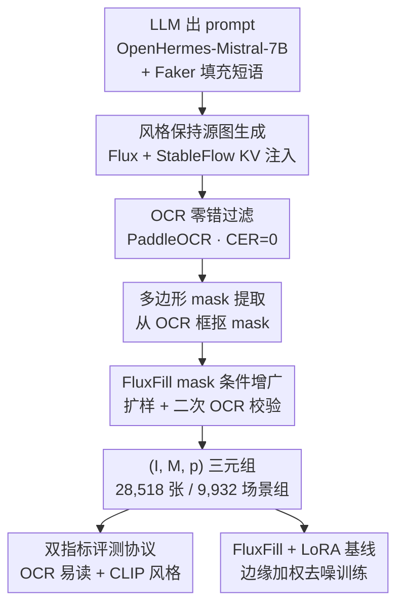

# StyleText: A Large-Scale Dataset and Benchmark for Stylized Scene Text Inpainting

**会议**: CVPR 2026  
**arXiv**: [2605.17309](https://arxiv.org/abs/2605.17309)  
**代码**: 论文承诺开源 pipeline 代码 / 元数据 / KV cache（无具体仓库链接）  
**领域**: 扩散模型 / 图像生成  
**关键词**: 场景文字补全、风格保持、合成数据、OCR 评测、CLIP 一致性

## 一句话总结
针对"往自然场景里插入新文字、同时保住周围光照纹理风格"这个任务缺乏专用 benchmark 的问题，本文用 LLM 出 prompt + Flux/StableFlow KV 注入生成 + OCR 过滤 + 多边形 mask 提取的全自动管线，造出 28,518 个图–mask–prompt 三元组（按 9,932 个"场景组"分组）的 StyleText 数据集，并配套定义了 OCR 易读性 + CLIP 风格一致性的双指标可复现评测协议，最后用 FluxFill+LoRA 训出一个把字符准确率从 56% 拉到 77% 的强基线。

## 研究背景与动机
**领域现状**：扩散模型（Flux、FluxFill、StableFlow、TextDiffuser、AnyText）已经能在自然图像里做 prompt 驱动、带空间控制的高分辨率文字编辑——往招牌、海报、街景里塞进一段新文字，用于多语言翻译、海报编辑、OCR 数据增广、无障碍、文档修复等场景。

**现有痛点**：进展卡在"没有合适的 benchmark"上。检测/识别数据集（COCO-Text、ICDAR 2015）只给 bbox，没有区域级多边形 mask、没有场景风格 ground truth、也没有评测生成结果的协议；合成拼贴管线（SynthText）能堆到 80 万张但靠启发式贴字，风格突兀、没有受控的多实例场景结构；专攻文字渲染保真度的方法（TextDiffuser、AnyText）只单独测"字清不清楚"，没有任何机制衡量"插入的字和周围场景在视觉上协不协调"。

**核心矛盾**：文字补全有两个正交目标——**易读性（legibility）**和**风格一致性（style preservation）**——而现有协议几乎只报 OCR 准确率。一个把字渲染得很清晰但视觉上格格不入的模型，照样能拿高分，却根本没完成"风格保持的文字插入"这件事。没有任何已有资源能**同时**提供：OCR 衍生的多边形 mask + 风格一致的场景分组 + 文字 prompt + 覆盖易读性和风格的双指标可复现协议。

**本文目标**：造一个 benchmark，让研究者能回答四个具体问题——(1) 我的模型是真学了风格还是只学了易读？(2) 它在哪类样本上崩、为什么崩？(3) 它是在泛化到新词还是在记视觉模式？(4) 它对"具体插入哪个短语"有多敏感？

**切入角度**：与其手工标注真实照片（贵且无法控制风格），不如**全自动合成**——关键观察是 StableFlow 的 KV 注入能在生成时保住参考图的光照/纹理/布局，于是可以让同一个场景模板配不同的插入短语，天然形成"风格固定、只变文字"的**场景组（scene group）**，这正是受控风格分析需要的结构。

**核心 idea**：用"LLM 出场景 prompt → Flux+KV 注入生成源图 → OCR 零错过滤 → 多边形 mask 提取 → FluxFill mask 条件增广"的全自动管线造数据，并把"场景组"作为评测的一等公民，配 OCR+CLIP 双指标协议来同时量易读性和风格保持。

## 方法详解

### 整体框架
StyleText 由三块构成：(1) **数据集**——28,518 张 1024×1024 高清图，每张配一个二值多边形 mask 和一段大写短语，按"同一背景 prompt、不同插入文字"聚成 9,932 个场景组；(2) **全自动合成管线**——三个阶段把零人工标注的 prompt 变成语义校验过的 (I, M, p) 三元组；(3) **评测协议 + 基线**——OCR/CLIP 双指标、按场景组划分防泄漏、再训一个 FluxFill+LoRA 当参考分。

合成管线是核心，分三阶段串行：**(a) 风格保持的源图生成**——OpenHermes-Mistral-7B 生成带大写词的场景 prompt（如"A frozen lake reflecting the words 'WINTER DREAMS'"），模板化后用 Faker 填充随机短语；Flux 配 StableFlow 风格的 KV 注入，把参考 cache 的 key–value 张量注进指定 transformer block，生成保住光照纹理布局的候选图。**(b) OCR 过滤 + mask 提取**——PaddleOCR 识别，归一化（大写化+去标点）后只保留字符错误率（CER）为 0 的样本，再从 OCR 检测框抠出多边形 mask，组成 (I, M, p)。**(c) FluxFill mask 条件增广**——在已有三元组上做 mask 条件 inpainting，扩样并保持局部风格，再过一遍 OCR 校验。整条管线模块化、可批量迭代，任一阶段出错（OCR 失败/mask 伪影/渲染错）都能定位到单一阶段、局部修复而不必重生成整个语料。

### 关键设计

**1. 场景组结构：把"风格固定、只变文字"做成数据集的一等结构**

这是 StyleText 区别于所有已有数据集的核心。文件名里编码了"背景描述 + 目标短语"，凡共享同一背景描述、只换插入文字的图就归为一个**场景组**——组内视觉上下文近似固定，唯一变量是插入的短语。绝大多数组只有 1–4 张图（单图 15.6%、两图 21.2%、三图 25.4%、四图 37.5%，≥5 图的只占 0.33%）。这个结构直接支撑了三种别的 benchmark 做不到的分析：① **组内 CLIP 相似度**衡量"同场景不同词的输出长得像不像"（风格一致性，与文字易读性解耦）；② **按场景组划分 train/val/test**，因为组内图共享背景结构，按图随机划会让近重复样本泄漏、高估泛化；③ **组内方差分析**，固定场景只变短语，能把"prompt 敏感性"从"场景难度"里隔离出来。词表也刻意做宽：最高频词 NATURE 也只占 0.26%，杜绝训练时的词汇记忆，逼模型做开放词表泛化。

**2. KV 注入驱动的风格保持源图生成：不微调就把风格"焊死"**

往场景里插字最难的是别破坏未遮挡区域的光照纹理布局。本文采用 StableFlow 的渐进式引导：用预训练 Flux 生成源图时，把参考 cache 的 key–value 注意力张量注进预定义的多模态块和单流 transformer 块，从而把光照、纹理、空间布局当作可控的"风格锚点"传下去——关键是**不需要对每张图单独微调**，就能产出自然的文字插入而不扭曲周围内容。正是这一步让同一场景模板下不同短语的输出保持风格一致，给后续的组内一致性评测提供了有效的场景级监督。

**3. OCR 零错过滤 + 多边形 mask 提取：用机器可读性当语义守门员**

纯合成管线的风险是"字看起来在但拼错了"，而文字编辑里**拼写正确是一阶要求**——一个视觉上像样但拼错的结果通常没法用。本文用 PaddleOCR 识别每张候选图，归一化后只保留**归一化 CER = 0** 的样本，并存下 OCR 框、置信度、阶段级过滤元数据做溯源。保留的样本再从 OCR 检测抠多边形 mask；训练时对 mask 做增广（膨胀、相邻框合并、轻度形变扰动），让模型见到连续谱系的区域形状、对长短语和不规则布局更鲁棒。作者也诚实点出这是个权衡：零错过滤会顺带剔掉"字在但写得差"的样本，使保留集偏向**易读多样性**而非**伪影多样性**。

**4. 双指标评测协议 + 分层诊断：逼任何方法同时报易读和风格，且能定位崩在哪**

协议强制联合报告两个正交指标，防止单指标刷分：**OCR 指标**用固定配置的 PaddleOCR，报词级精确匹配准确率和字符准确率 $\text{Char Acc.} = 1 - \text{CER}$（CER 为归一化 Levenshtein 距离除以目标长度）；**CLIP 相似度**用 CLIP ViT-B/32 算生成图与源图的图–图余弦相似度（报 $100\times\cos$，224×224 中心裁剪预处理），衡量插字后场景结构与风格保住了多少。一个模型可能"字清但不协调"（高 OCR、低 CLIP）或"协调但字烂"（低 OCR、高 CLIP），两个都报才挡得住刷分。协议还定义三条**分层轴**做诊断：短语复杂度（Easy ≤5 字单词 / Medium 6–9 字 / Hard ≥10 字或多词）、mask 覆盖率（Small <1.5% / Medium 1.5–4% / Large >4%）、背景难度（Low 单色 / Medium 自然纹理 / High 杂乱高频）。再配组内 CLIP 一致性、组内 OCR/CLIP 标准差（prompt 敏感性）、失败分类法（窄 mask 截字、长多词 spacing 坍缩、低对比融合差、曲线/透视几何不匹配），让"在哪崩、为什么崩"可量化复现。

### 损失函数 / 训练策略
基线训练管线基于 Flux 架构做带 mask 条件的文字 inpainting。冻结 VAE 编码器 $\mathcal{E}$ 把输入图 $I$ 编码到隐空间 $z=\mathcal{E}(I)$；二值 mask $M$ 标出待补区域，保留未遮挡上下文，对遮挡区在随机采样的时间步 $t$ 加噪。构造保上下文隐变量 $z_{\mathrm{ctx}}=z\odot(1-M)$，加高斯噪声得：

$$z_t = z_{\mathrm{ctx}} + \sigma_t\,\epsilon,\qquad \epsilon\sim\mathcal{N}(0,\mathbf{I})$$

Transformer 去噪器预测 $\hat{\epsilon}=\mathcal{F}_\theta(z_t,t,M,p)$，prompt $p$ 由冻结的 T5 文本编码器嵌入、$M$ 作为显式空间条件输入。基础损失是去噪 score matching $\mathcal{L}_\epsilon=\mathbb{E}\big[\lVert\epsilon-\mathcal{F}_\theta(z_t,t,M,p)\rVert_2^2\big]$，并加**边缘感知的逐像素加权**让梯度集中在 mask 边界、改善接缝质量、减少融合伪影：

$$w(M)=1+\alpha\cdot\mathrm{Sobel}(M),\qquad \mathcal{L}=\mathbb{E}\big[w(M)\odot(\epsilon-\hat{\epsilon})^2\big]$$

训练设置：4×H100、bfloat16、固定随机种子；LoRA（rank 128）适配注意力和前馈块，VAE 与文本编码器冻结；AdamW（lr=1e-4、cosine schedule、50 步 warmup）；时间步均匀采样、用 $\epsilon$-prediction 配 FluxFill 自带 scheduler，参数化保持固定以隔离"数据集本身的效果"。

## 实验关键数据

### 主实验
在 StyleText 上训 FluxFill+LoRA，对比未微调的预训练 checkpoint（Epoch 0）与最佳微调点（Epoch 2）。微调带来 **+16.6 pp 词准确率、+20.9 pp 字符准确率**，且 Epoch 2 的 CLIP 66.03 说明易读性提升没有以牺牲场景一致性为代价。

| 模型 | 词准确率↑ (%) | 字符准确率↑ (%) | CLIP↑ (100×) |
|------|------|------|------|
| FluxFill（预训练, Ep.0） | 27.84 | 56.17 | — |
| + LoRA on StyleText（Ep.2） | **44.48** | **77.03** | 66.03 |
| + 继续训练（Ep.9） | 41.03 | 75.63 | — |

> CLIP 仅在 Epoch 2 测量；CLIP 若模型完全不动场景会接近 100，实际只在 mask 边界（真正生成内容处）掉下来，66.03 反映的是跨短语的场景级一致性。

### 消融实验
论文没有传统"去模块"消融，而是用**训练动态**和**分层难度分析**充当诊断（数据集论文的等价物）：

| 配置 / 维度 | 关键指标 | 说明 |
|------|---------|------|
| Epoch 0（预训练基线） | Word 27.84 / Char 56.17 | 不微调的起点 |
| Epoch 1 | Word 39.90 / Char 76.06 | 前两 epoch 快速 warm-up |
| Epoch 2（峰值） | Word 44.48 / Char 77.03 | 词准与字符准差距收窄（+16.6 vs +20.9 pp），说明模型从"拼对单字"进到"拼对整词" |
| Epoch 3–9（平台期） | Word 37–41 / Char 74–76 | 轻微波动，未再超过 Epoch 2 |
| Easy tier（短单词） | 最稳定 | 字符间距正确、边界对齐 mask |
| Hard tier（长/多词） | 失败集中 | spacing 坍缩、截字为主，对应 OCR 平台期 |
| Large mask（>4% 面积） | 边界外溢 | 无论短语长短都出现 boundary bleed，提示需要尺度感知的 mask 条件 |

### 关键发现
- **峰值在 Epoch 2、之后进平台期**：词准与字符准的差距从 Epoch 0 的（+16.6 vs +20.9 pp）收窄，表明模型逐步从"渲染对孤立字符"进步到"组装出完整词"，但学到字符结构后没能进一步学会不规则 mask 下的多字符鲁棒排版。
- **失败遵循可预测的难度轴而非随机**（直接回答 RQ2）：长/多词短语贡献了绝大多数 spacing 坍缩和截字；大 mask 不论短语长短都边界外溢——这正是 StyleText 分层设计要暴露的结构。
- **组内风格一致**（回答 RQ4）：Epoch 2 输出在同一场景组内、不同插入词下，背景光照、笔画纹理、边界融合都忠实复现，证明 KV 引导的源图生成提供了有效的场景级风格监督。
- **prompt 敏感性来自短语结构而非场景难度**：组内 OCR 方差随短语复杂度变化——同场景里短词识别接近峰值、长词字符错误率更高，验证了 prompt 敏感性协议。

## 亮点与洞察
- **把"评测结构"也当成贡献**：场景组不是数据组织的副产品，而是被设计成支撑组内 CLIP 一致性、防泄漏划分、组内方差分析三件事的一等结构——这是一个"benchmark 的结构本身就能问出新问题"的范例，可迁移到任何"需要把某个变量固定、只变另一个变量"的受控评测场景。
- **零错 OCR 过滤是把双刃剑用对了方向**：用 CER=0 当语义守门员，承认它会偏向机器可读字体、牺牲艺术化字体多样性，但换来训练集的"易读多样性"——这种把过滤偏置讲明白并归到局限的诚实做法值得学。
- **双指标反刷分**：OCR 与 CLIP 正交，强制联合报告堵住了"渲染清晰但视觉违和"和"场景保住但字烂"两种单指标作弊，这个"两个正交指标都要报"的协议设计可直接搬到其他有多目标 trade-off 的生成任务评测里。
- **边缘感知 Sobel 加权**：用 $w(M)=1+\alpha\cdot\mathrm{Sobel}(M)$ 把梯度往 mask 边界压，针对性改善文字插入最容易露馅的接缝处，是个轻量可复用的 trick。

## 局限性 / 可改进方向
- **评测指标本身有盲区（作者承认）**：PaddleOCR 会误识别艺术字/低对比文字，可能低估视觉正确性；CLIP 抓不到字形、间距等细粒度排版属性——作者建议补 SSIM（在未遮挡区）来更好量化编辑局部性。
- **范围受限（作者承认）**：只覆盖英文大写、字体集受 Flux 生成先验约束；多语言脚本（CJK、阿拉伯、天城文）、混合大小写、曲线/透视文字都没处理，需要多语言短语生成器 + 对应脚本的 OCR。
- **残留合成偏置（作者承认）**：零 CER 过滤系统性低估了霓虹、粉笔、手绘等高度风格化字体；Flux 的写实先验引入的视觉分布未必覆盖真实场景文字——作者把"在 COCO-Text / ICDAR 2015 上做跨数据集迁移评测"列为首要下一步验证。
- **自己发现的局限**：基线只有一个 FluxFill+LoRA，且最佳点出现在第 2 个 epoch 就进平台，benchmark 的"上限"还很空旷，缺少与 TextDiffuser/AnyText 等专用文字生成方法的直接对比，难判断这套协议下不同范式的真实差距。

## 相关工作与启发
- **vs SynthText**：都做合成场景文字数据，但 SynthText 靠分割+深度先验的**启发式贴字**，复杂场景下风格突兀、有伪影；本文用扩散 + prompt/mask 条件生成，光照几何连贯，且提供受控的多实例场景组结构和生成式评测协议。
- **vs TextDiffuser / AnyText**：它们专攻文字渲染保真度、定义了生成协议，但只**孤立地测易读性**，没有任何机制衡量插入文字与周围场景的视觉协调；StyleText 的核心正是强制 OCR + CLIP 双指标、把风格一致性纳入评测。
- **vs COCO-Text / ICDAR 2015**：检测/识别数据集只给 bbox/quad，没有区域级多边形 mask、风格 ground truth 和生成评测协议；本文用 OCR 衍生多边形 mask + 场景组 + 双指标协议把这块空白填上。
- **vs StableFlow**：本文直接复用 StableFlow 的 KV 注入做风格保持，但把它从"通用风格迁移"用到"造训练数据"——靠 KV 锚住风格、无需逐图微调地批量生成风格一致的源图。

## 评分
- 新颖性: ⭐⭐⭐⭐ 任务本身不新，但"场景组 + 双指标 + 全自动零标注管线"三者合一的 benchmark 结构是实打实的空白填补。
- 实验充分度: ⭐⭐⭐ 数据集构建和分层诊断扎实，但模型侧只有单一 FluxFill+LoRA 基线、缺与专用文字生成方法的横向对比，benchmark 上限未被探明。
- 写作质量: ⭐⭐⭐⭐ 用"四个研究问题"组织全文、把每个设计映射到要回答的问题，逻辑清晰，局限交代诚实。
- 价值: ⭐⭐⭐⭐ 提供可复现的双指标 testbed + 开源管线/元数据/KV cache，对风格保持文字编辑这个方向是有用的公共基础设施。

<!-- RELATED:START -->

## 相关论文

- [\[CVPR 2026\] Pico-Banana-400K: A Large-Scale Dataset for Text-Guided Image Editing](pico-banana-400k_a_large-scale_dataset_for_text-guided_image_editing.md)
- [\[CVPR 2026\] 4KLSDB: A Large-Scale Dataset for 4K Image Restoration and Generation](4klsdb_a_large-scale_dataset_for_4k_image_restoration_and_generation.md)
- [\[CVPR 2026\] BioVITA: Biological Dataset, Model, and Benchmark for Visual-Textual-Acoustic Alignment](biovita_biological_dataset_model_and_benchmark_for_visual-textual-acoustic_align.md)
- [\[CVPR 2026\] CG-Floor: Centroid-Guided Diffusion for Large-Scale Floorplan Generation](cg-floor_centroid-guided_diffusion_for_large-scale_floorplan_generation.md)
- [\[CVPR 2026\] GenColorBench: A Color Evaluation Benchmark for Text-to-Image Generation](gencolorbench_a_color_evaluation_benchmark_for_text-to-image_generation.md)

<!-- RELATED:END -->
