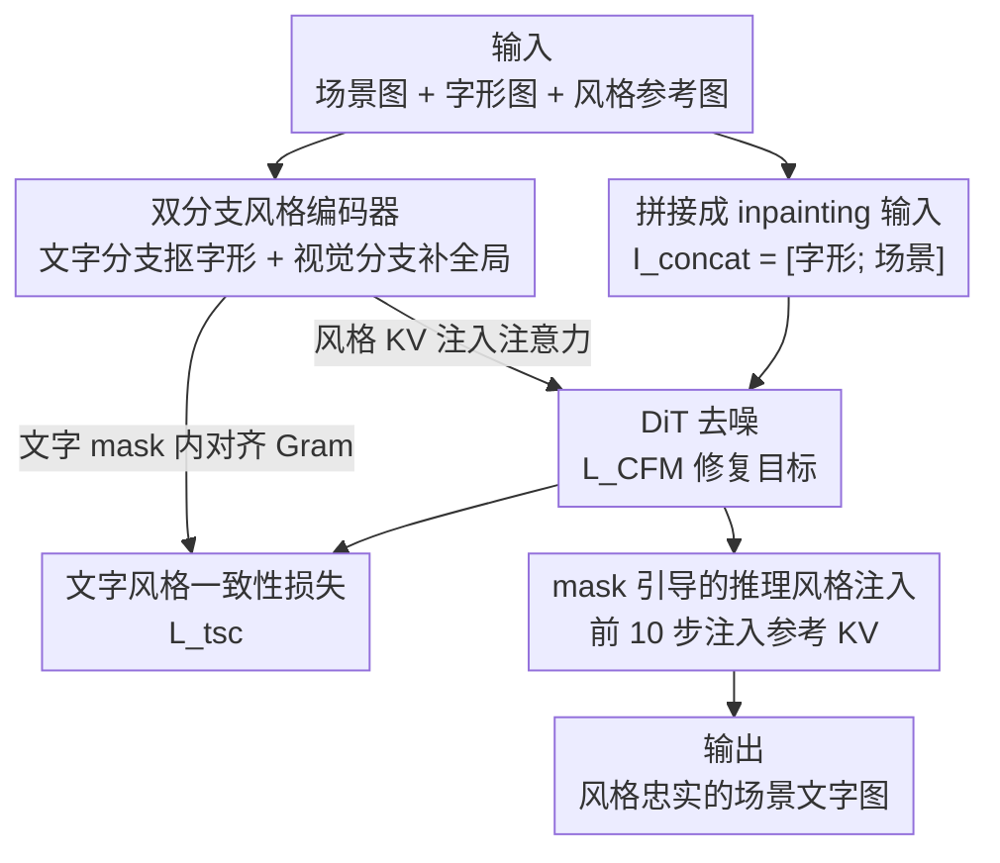

# StyleTextGen: Style-Conditioned Multilingual Scene Text Generation

**会议**: CVPR 2026  
**arXiv**: [2605.14708](https://arxiv.org/abs/2605.14708)  
**代码**: 无  
**领域**: 扩散模型 / 图像生成 / 场景文字生成  
**关键词**: 风格条件生成, 多语言场景文字, 双分支风格编码器, 风格一致性损失, 扩散修复

## 一句话总结
StyleTextGen 把"按参考图风格生成场景文字"建模成 DiT 扩散修复（inpainting）任务，用**双分支风格编码器**（文字分支抠字形纹理 + 视觉分支补全局基调）提取与背景解耦的风格嵌入，再配一个**只在文字区域**算的风格一致性损失和**只在前 10 步注入参考 KV**的推理策略，在中英文单语和跨语言场景文字生成上都刷新了风格相似度与文字正确率的 SOTA。

## 研究背景与动机

**领域现状**：文本到图像扩散模型（FLUX、SD 系列）已能生成逼真图像，但在图像里"写字"一直是难点，于是分化出一条专门做场景文字生成的线——AnyText、TextDiffuser、GlyphControl 等用字形先验 + 布局 mask 提升结构保真度，GlyphByT5、AnyText2 进一步把字体、颜色信息编进文本编码器实现粗粒度外观控制。

**现有痛点**：但这些方法只能控制相对简单的字体，几乎无法**按一张任意参考图复刻艺术化风格**。场景文字编辑类方法（TextCtrl、SRNet 等）通常只复用原位文字的风格，吃不下外部风格参考；Calligrapher 虽尝试自由风格生成，但它的风格提取**缺乏内容感知**，导致风格与内容纠缠——一旦参考图背景杂乱、光照多变，风格就被污染。

**核心矛盾**：风格条件场景文字生成有两个区别于通用图像合成的硬骨头。其一，**从复杂场景中抽取"只属于文字的风格"非常难**：参考图往往背景杂乱、文字布局各异，通用编码器容易把背景纹理当成文字风格。其二，**多语言下逐字保持细粒度风格一致性更难**：拉丁、中文、阿拉伯等不同书写系统笔画结构和数量差异巨大，缺乏稳健的跨语言风格迁移机制时，换语言生成就会出现字形外观漂移和结构畸变。

**本文目标**：拆成三个子问题——(1) 设计能从复杂多语言场景中稳定抽取文字风格的编码器；(2) 显式约束生成文字与参考文字在文字区域内的风格统计对齐；(3) 在推理阶段进一步精修参考↔生成的风格对应。

**切入角度**：作者观察到通用视觉编码器会被背景"短路"，而专门在多语言文字分割任务上预训练过的编码器能聚焦字形。于是用一个"懂文字"的分支 + 一个"懂全局"的分支互补，再用 mask 把所有风格约束严格框死在文字像素上。

**核心 idea**：用"双分支文字感知风格编码 + mask 约束的风格一致性损失与推理注入"，在 inpainting 扩散范式下实现内容与风格解耦的多语言场景文字风格迁移。

## 方法详解

### 整体框架
StyleTextGen 建立在扩散修复范式之上：输入是一张背景场景图 $I_{\text{scene}}$、一段目标文本 prompt（渲染成二值字形图 $I_{\text{glyph}}$）和一张文字风格参考图 $I_{\text{style}}$，输出是在指定 mask 区域里生成的、风格忠实复刻参考的目标文字图。骨干用 TextFlux（基于 FLUX.1-Fill-Dev 的多语言文字生成 DiT）初始化。具体地，把字形图与场景图**纵向拼接**成 $I_{\text{concat}}=[I_{\text{glyph}};\,I_{\text{scene}}]$ 作为修复输入，连同修复 mask $M$、prompt $p$、风格图 $I_{\text{style}}$ 组成条件集 $c$，DiT 在 rectified-flow 视角下预测速度场，用条件 flow-matching 损失 $\mathcal{L}_{\text{CFM}}$ 优化去噪。

在这个骨干上叠三个贡献组件：**双分支风格编码器**把 $I_{\text{style}}$ 编成文字感知的风格嵌入 $z_{\text{style}}$，经线性投影成风格 key-value 注入 DiT 的注意力；训练时额外加**文字风格一致性损失** $\mathcal{L}_{\text{tsc}}$，只在生成/参考文字 mask 内对齐 Gram 矩阵；推理时再用**mask 引导的风格注入**，把参考图反演出的 KV 在前 10 步注入文字区域，精修风格对应。整个流程冻结 DiT 与两个分支的编码器主干，只训两个分支的适配模块和那层风格 KV 投影。

### 关键设计

**1. 双分支风格编码器：让"懂文字的"和"懂全局的"互补，抠出与背景解耦的风格**

这一设计直击"从杂乱场景里只抽文字风格"的痛点。单用通用视觉编码器会把背景纹理、光照当成风格而短路，于是作者拆成两条互补支路。**文字风格分支**负责字形结构、笔画纹理、颜色分布这类文字专属线索，由文字编码器 $E_{\text{text}}$、自注意力精修 transformer $S_{\text{text}}$、Q-Former 适配器 $Q_{\text{text}}$ 串成：$h_{\text{text}}=Q_{\text{text}}(S_{\text{text}}(E_{\text{text}}(I_{\text{style}})))$；其中 $E_{\text{text}}$ 用 InternViT（以 TokenFD 双语文字感知权重初始化），并在"风格保持式多语言文字分割"任务上预训练过，所以能从复杂背景和多种书写系统里稳定锁定文字。**视觉先验分支**用对文字不敏感的通用编码器 SigLIP，抽全局外观与色调，避免自参考模式下走捷径：$h_{\text{vis}}=P_{\text{vis}}(E_{\text{vis}}(I_{\text{style}}))+Q_{\text{vis}}(E_{\text{vis}}(I_{\text{style}}))$。两者通过交叉注意力融合，以文字特征为 query、视觉特征为 key/value：$z_{\text{style}}=\mathrm{Attn}(h_{\text{text}},h_{\text{vis}},h_{\text{vis}})$，得到稳健的文字感知风格嵌入。最后把 $z_{\text{style}}$ 线性投影成风格 $(K_s,V_s)$，以**加性风格注意力分支**叠进 DiT：$F_{\text{style}}=\mathrm{SelfAttn}(Q,K,V)+\mathrm{StyleAttn}(Q,K_s,V_s)$——既保留上下文依赖，又注入风格调制。与 Calligrapher 缺乏内容感知的单路风格提取相比，这种"分工 + 融合"显式把文字风格和背景拆开，复杂背景下不掉链子。

**2. 文字风格一致性损失：把风格约束严格框死在文字像素上**

背景杂波会遮蔽风格线索，而没有显式的文字区域目标时，逐字风格容易漂移。作者沿用 Gatys 的神经风格表示思路，用预训练视觉编码器 $\phi$ 抽多层特征，对某层把 $\phi_j(x)\in\mathbb{R}^{C_j\times H_j\times W_j}$ 重排成 $F_j(x)\in\mathbb{R}^{C_j\times N_j}$（$N_j=H_jW_j$），算 Gram 矩阵 $G_j^{\phi}(x)=\frac{1}{N_j}F_j(x)F_j(x)^{\top}$ 来概括纹理外观。关键在于**只在文字区域算**：用生成图的文字 mask $M_{\text{gen}}$ 和参考图 mask $M_{\text{ref}}$ 把图抠出来，再求两边 Gram 矩阵的 Frobenius 距离

$$\mathcal{L}_{\text{tsc}}=\sum_{j\in J}\left\|G_j^{\phi}(M_{\text{gen}}\odot\hat{x})-G_j^{\phi}(M_{\text{ref}}\odot I_{\text{style}})\right\|_F^2.$$

总训练目标为 $\mathcal{L}=\mathcal{L}_{\text{CFM}}+\lambda_{\text{tsc}}\mathcal{L}_{\text{tsc}}$，默认 $\lambda_{\text{tsc}}=10$。这个 mask 引导的损失逼着所有生成字符的风格统计向参考对齐、向文字区域看齐，避免去抄背景的颜色纹理，多语言下视觉连贯性明显提升。

**3. mask 引导的推理风格注入：在去噪早期把参考 KV 精准灌进文字区域**

训练只能约束到平均行为，参考与生成在细粒度上仍可能错位，所以推理时再补一刀精修。先用双语文字分割模型给生成图 $\hat{I}_{\text{gen}}$ 和参考图 $I_{\text{style}}$ 各抠出文字 mask $M_{\text{gen}}$、$M_{\text{style}}$；再把参考图的隐变量 $x_s$ 通过 DiT **反演**，恢复出其内部的 key-value $(K_s,V_s)$，并用 $M_{\text{style}}$ 保证只有文字区域参与风格表示。然后用 AdaIN 得到风格适配的 KV：$\tilde{K},\tilde{V}=\mathrm{AdaIN}(K,V;K_s\odot M_{\text{style}},V_s\odot M_{\text{style}})$，再按 $M_{\text{gen}}$ 与原始 KV 融合：$K'=(1-M_{\text{gen}})\odot K+M_{\text{gen}}\odot\tilde{K}$（$V'$ 同理）。注意力输出层面同样做 mask 融合：$f_{\text{base}}=\mathrm{Attention}(Q,K',V')$、$f_{\text{style}}=\mathrm{Attention}(Q,K_s,V_s)$，最终 $f_{\text{out}}=(1-M_{\text{gen}})\odot f_{\text{base}}+M_{\text{gen}}\odot\mathrm{AdaIN}(f_{\text{base}};f_{\text{style}}\odot M_{\text{style}})$。为保住场景文字保真度和背景连贯，**风格注入只在前 10 个去噪步施加**——早期定基调、后期让模型自由细化，避免过度风格化破坏可读性。

### 损失函数 / 训练策略
- **总损失**：$\mathcal{L}=\mathcal{L}_{\text{CFM}}+\lambda_{\text{tsc}}\mathcal{L}_{\text{tsc}}$，$\lambda_{\text{tsc}}=10$。
- **冻结策略**：冻结 DiT 全部参数，以及双分支编码器的两个 encoder 主干（InternViT/SigLIP），只训两分支剩余模块（$S_{\text{text}}$、$Q_{\text{text}}$、$P_{\text{vis}}$、$Q_{\text{vis}}$）和风格 KV 投影线性层，保住预训练表征能力。
- **超参**：分辨率 $512\times512$，AdamW，学习率 $2\times10^{-5}$，batch size 2，16 步梯度累积。
- **数据**：受 POSTA 的 ArtText Diffusion 启发自建双语风格数据集（77 个中英 TrueType 字体 + 2218 个艺术风格 prompt + 1 万张无字背景图合成）；训练集 = 1 万张高质量双语图 + 2000 张 Calligrapher 流程生成的英文风格样本 + 2000 张精选合成双语风格图。

## 实验关键数据

### 主实验
AnyWord-Eval（各 1000 张中/英）下，self-style 编辑范式对比（Sen.Acc 行级识别准确率↑、NED 归一化编辑距离↑、FID↓、LPIPS↓）：

| 设置 | 指标 | AnyText | Calligrapher | TextFlux | **Ours** |
|------|------|---------|--------------|----------|----------|
| English | Sen.Acc ↑ | 0.5613 | 0.6129 | 0.6542 | **0.7102** |
| English | NED ↑ | 0.7264 | 0.7637 | 0.8018 | **0.8575** |
| English | FID ↓ | 67.82 | 54.26 | 59.44 | **49.51** |
| English | LPIPS ↓ | 0.212 | 0.176 | 0.187 | **0.161** |
| Chinese | Sen.Acc ↑ | 0.4986 | 0.5153 | 0.6185 | **0.6524** |
| Chinese | NED ↑ | 0.6691 | 0.6847 | 0.7934 | **0.8187** |
| Chinese | FID ↓ | 71.35 | 63.28 | 57.12 | **52.43** |
| Chinese | LPIPS ↓ | 0.267 | 0.231 | 0.204 | **0.187** |

英文 Sen.Acc 比 TextFlux 高 5.6 个点、中文高 3.4 个点；FID 在英文降 16.7%、中文降 8.21%；LPIPS 全场最低。

StyleText-CE（2021 张中英场景文字，支持自参考/外参考 × 单语/跨语言）下与唯一支持外参考的 Calligrapher 对比（FID/LPIPS 只在抠出的文字区域上算，避免背景干扰）：

| 参考模式 | 配置 | 指标(Sen.Acc/NED ↑) | Calligrapher | **Ours** |
|----------|------|--------------------|--------------|----------|
| Self | cn | Sen.Acc/NED | 0.51/0.67 | **0.66/0.81** |
| Self | en | Sen.Acc/NED | 0.64/0.78 | **0.70/0.85** |
| Self | cn→en | Sen.Acc/NED | 0.57/0.74 | **0.66/0.80** |
| Self | en→cn | Sen.Acc/NED | 0.49/0.66 | **0.64/0.77** |
| External | cn | Sen.Acc/NED | 0.49/0.67 | **0.60/0.79** |
| External | en | Sen.Acc/NED | 0.58/0.75 | **0.71/0.84** |

风格相似度上，self-style 平均 Sen.Acc/NED 提升约 0.11/0.095、FID/LPIPS 降约 9.8/0.025；external-style 提升约 0.135/0.11、FID/LPIPS 降约 15.1/0.028。跨语言配置下 FID/LPIPS 普遍偏高，是因为只在文字区域评估、参考与生成字形形状差异大导致的分布/感知差异，并非方法退化。

### 消融实验
StyleText-CE 上逐组件消融（Table 3）：

| 配置 | Sen.Acc ↑ | NED ↑ | FID ↓ | LPIPS ↓ | 说明 |
|------|-----------|-------|-------|---------|------|
| w/o 文字分支 | 0.618 | 0.775 | 133.62 | 0.536 | 去文字风格分支，FID 暴涨 20 |
| w/o 视觉分支 | 0.634 | 0.789 | 124.18 | 0.503 | 去视觉先验分支，全局连贯变差 |
| w/o $\mathcal{L}_{\text{tsc}}$ | 0.629 | 0.788 | 126.94 | 0.509 | 去风格一致性损失，文字抄背景 |
| w/o 推理风格注入 | 0.646 | 0.796 | 118.36 | 0.494 | 去推理注入，精修缺失 |
| Full (Ours) | **0.659** | **0.804** | **113.47** | **0.482** | 完整模型 |

### 关键发现
- **文字风格分支贡献最大**：去掉后 FID 从 113.47 飙到 133.62（+20），说明"精准抽取文字专属风格线索"是整套方法的命门；视觉先验分支主要影响字形形状与布局保真度，去掉 FID 升到 124.18。
- **两个分支角色互补**：定性看，文字分支管复杂背景下的文字风格抽取，视觉分支管全局色调与布局；缺一即偏。
- **$\mathcal{L}_{\text{tsc}}$ 防止"抄背景"**：去掉后生成文字倾向继承周围背景而非参考文字的视觉线索，风格迁移不一致（FID 升到 126.94）。
- **推理注入是锦上添花**：贡献最小（FID 仅升到 118.36），但稳定性和细粒度对齐有可见提升。

## 亮点与洞察
- **"懂文字 + 懂全局"双编码器分工**：用在多语言文字分割上预训练的 InternViT 抠字、用文字不敏感的 SigLIP 补全局，再交叉注意力融合——这套显式解耦思路可直接迁到任何"前景细节 + 背景上下文"都重要的条件生成任务（如 logo、图标、局部纹理替换）。
- **mask 把所有风格约束框死在文字区域**：无论训练损失（Gram 矩阵只在 mask 内算）还是推理注入（KV 只取文字区域），都用同一把 mask 把"风格"限制到该限制的像素上，从根上避免风格-背景纠缠，这是它比 Calligrapher 干净的核心原因。
- **"前 10 步注入"的早停技巧很巧妙**：扩散早期决定全局风格/结构、后期细化纹理，只在前 10 步注参考 KV 既能定调又不牺牲文字可读性和背景连贯，是个低成本可复用的 inference trick。
- **跨语言评估的 caveat 写得诚实**：作者主动指出跨语言 FID/LPIPS 偏高是字形差异导致的度量假象而非方法退化，避免读者误读数字。

## 局限性 / 可改进方向
- **依赖外部分割模型质量**：训练损失和推理注入都要文字 mask（微调过的 Hi-SAM），分割不准会直接拖累风格对齐；论文未量化分割误差的影响。
- **只在中英双语上验证**：摘要立意"多语言"，但 benchmark 和数据集都只覆盖中英文，对阿拉伯、印地等差异更大的书写系统是否泛化没有实验支撑。
- **合成数据为主**：训练集大量依赖 ArtText Diffusion / Flux 合成的风格样本，真实世界艺术字分布覆盖度存疑，可能限制极端艺术风格的复刻。
- **推理多一遍反演 + 分割**：推理时要先跑分割、再做 DiT 反演取 KV，额外计算开销和延迟论文未报告。
- **无代码 / 评分维度有限**：风格相似度只用 FID+LPIPS，缺乏人评或更贴合"风格"的专门指标。

## 相关工作与启发
- **vs Calligrapher**：同样做自由风格场景文字生成，但 Calligrapher 风格提取缺内容感知、风格与内容纠缠，复杂背景下退化；本文用双分支显式解耦 + mask 约束，全面领先（external-style 下 Sen.Acc/NED 提升约 0.135/0.11）。
- **vs TextFlux**（骨干）：TextFlux 是多语言文字生成 DiT 但不支持参考风格，输出风格只受背景影响；本文在其基础上加风格条件能力，AnyWord-Eval 上英文 Sen.Acc +5.6 点。
- **vs AnyText / AnyText2 / GlyphByT5**：这些靠文本编码器内的字体/颜色编码做粗粒度外观控制，限于简单字体、难复刻艺术化风格；本文走"图像条件 + 风格编码器"路线，能吃任意参考图。
- **vs 通用风格迁移（AdaIN / IP-Adapter / 神经风格迁移）**：通用方法做整图风格化，不为局部文字的复杂字形结构设计；本文把风格控制精准约束到文字区域，复用了 Gram 矩阵与 AdaIN 但都加 mask 门控。

## 评分
- 新颖性: ⭐⭐⭐⭐ 双分支文字感知风格编码 + mask 全程约束的组合在场景文字风格迁移上是清晰的新解法，但组件（Gram loss、AdaIN、KV 反演注入）多为已有技术的巧妙拼装。
- 实验充分度: ⭐⭐⭐⭐ 两个 benchmark、单语/跨语言/自参考/外参考四设置、逐组件消融齐全；但只覆盖中英双语、缺人评、无延迟报告。
- 写作质量: ⭐⭐⭐⭐ 方法公式完整、动机清晰，连跨语言度量偏高都主动给了 caveat，诚实可读。
- 价值: ⭐⭐⭐⭐ 多语言招牌/海报设计等真实场景有明确需求，且对场景文字检测识别有下游增益，mask 解耦思路可迁移。

<!-- RELATED:START -->

## 相关论文

- [\[CVPR 2026\] A Style is Worth One Code: Unlocking Code-to-Style Image Generation with Discrete Style Space](a_style_is_worth_one_code_unlocking_code-to-style_image_generation_with_discrete.md)
- [\[CVPR 2026\] StyleText: A Large-Scale Dataset and Benchmark for Stylized Scene Text Inpainting](styletext_a_large-scale_dataset_and_benchmark_for_stylized_scene_text_inpainting.md)
- [\[CVPR 2026\] ScenDi: 3D-to-2D Scene Diffusion Cascades for Urban Generation](scendi_3d-to-2d_scene_diffusion_cascades_for_urban_generation.md)
- [\[ECCV 2024\] DCDM: Diffusion-Conditioned-Diffusion Model for Scene Text Image Super-Resolution](../../ECCV2024/image_generation/dcdm_diffusion-conditioned-diffusion_model_for_scene_text_image_super-resolution.md)
- [\[CVPR 2026\] StyleDoctor: Towards Specialist Reward Model for Style-centric Generation Tasks](styledoctor_towards_specialist_reward_model_for_style-centric_generation_tasks.md)

<!-- RELATED:END -->
