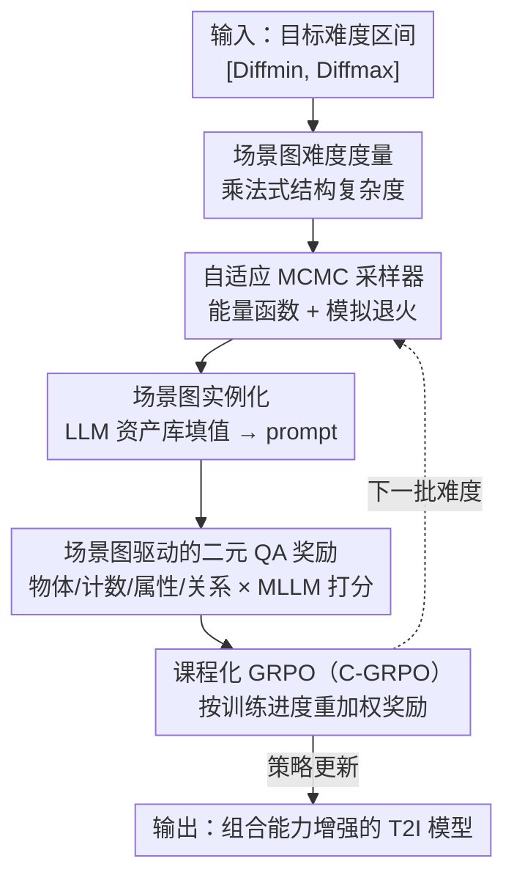

# Synthetic Curriculum Reinforces Compositional Text-to-Image Generation

**会议**: CVPR 2026  
**论文**: [CVF Open Access](https://openaccess.thecvf.com/content/CVPR2026/html/Wang_Synthetic_Curriculum_Reinforces_Compositional_Text-to-Image_Generation_CVPR_2026_paper.html)  
**代码**: 无  
**领域**: 扩散模型 / 文本生成图像 / 强化学习  
**关键词**: 组合式生成, 课程学习, 场景图, MCMC 采样, GRPO

## 一句话总结
CompGen 用场景图的结构复杂度定义"组合难度"，再用自适应 MCMC 在指定难度区间内采样场景图、拼成训练 prompt，最后把"由易到难"的课程权重塞进 GRPO 的奖励里——**全程不需要任何 ground-truth 图像**，就把扩散模型和自回归 T2I 模型的组合生成能力平均提升了 7~12 个点。

## 研究背景与动机
**领域现状**：文本到图像（T2I）生成在画质上已经很强，但"组合式生成"——一张图里同时出现多个物体、各自带不同属性、彼此还有空间/语义关系（如"一只棕色狗站在一只白色小猫右边"）——仍然是公认的难题。主流改进路线有三类：改注意力图（DenseDiffusion、CONFORM 等在推理时调 cross/self-attention）、引入中间结构（layout、skeleton 做规划）、训练时微调（用 vision-language 监督或 RL）。

**现有痛点**：注意力类方法只在推理时生效，扩展性和算力都受限；规划类方法要额外的 layout/VQA 模块，推理成本上去了还可能绑错属性；而训练类方法里，需要合成 ground-truth 图像或中间骨架来做监督微调，数据准备代价高。更关键的是，直接对组合 T2I 做大规模 RL 很不稳定——因为"组合能力"本身是异质的，它同时包含物体存在、属性绑定、关系理解、数量计数四种差异很大的子能力，一股脑混在一起训会震荡。

**核心矛盾**：组合难度没有一个**可量化、可控制**的标尺。如果不能精确地"先喂简单样本、再喂复杂样本"，RL 就只能在难易混杂的数据上盲目优化，既不稳定也不充分。

**本文目标**：(1) 给组合难度下一个有依据的定义；(2) 能按指定难度高效地造训练数据；(3) 把难度课程接进 RL，且不依赖真值图像。

**切入角度**：作者借鉴人类认知发展——先学会单个物体及其属性，再逐步理解多物体多关系的复杂组合。这种"由易到难"的课程恰好能用**场景图（scene graph）**来刻画：物体、属性、关系三类节点的结构密度天然反映组合复杂度。

**核心 idea**：用场景图的结构复杂度当难度尺，用 MCMC 在目标难度区间采样场景图来"合成课程"，再用课程权重重塑 GRPO 的奖励——把课程学习和无真值 RL 焊在一起。

## 方法详解

### 整体框架
CompGen 是一个两阶段的"合成课程 + 课程化 RL"框架。**第一阶段**先定义难度、再用自适应 MCMC 在 `[Diffmin, Diffmax]` 难度区间内采样出一批场景图；**第二阶段**把每个场景图实例化成具体的文本 prompt 喂给 T2I 模型生成图，再用从同一张场景图程序化生成的二元问答（QA）对 + 多模态 LLM 打分作为奖励，最后用课程化 GRPO（C-GRPO）更新 T2I 模型。整条链路的输入只有"文本"，输出是"被强化过组合能力的 T2I 模型"，中途**完全不需要参考图像**。

### 关键设计

**1. 场景图难度度量：用乘法式结构复杂度量化"组合有多难"**

痛点是组合难度此前没有公认的、能驱动课程的标尺。本文把场景图形式化为 $G=(O,A,R)$（物体集 $O$、属性集 $A$、关系集 $R$），并定义难度为

$$\mathrm{Diff}(G) = \lVert O\rVert \cdot \max\!\left(1, \frac{\lVert A\rVert}{\lVert O\rVert}\right)\cdot \max\!\left(1, \frac{\lVert R\rVert}{\lVert O\rVert}\right)$$

三个因子分别是物体总数 $\lVert O\rVert$、平均属性密度 $\lVert A\rVert/\lVert O\rVert$、平均关系连通度 $\lVert R\rVert/\lVert O\rVert$。关键在于它用**乘法**而非加法/平均：组合复杂度随成分增加是组合爆炸式增长的，乘法形式才能刻画这种指数特性。消融里它比加法基线（如 $\lVert O\rVert+\lVert A\rVert+\lVert R\rVert$）平均高 4.56 个点，印证了"难度应当是乘性的"这一假设。

**2. 自适应 MCMC 场景图采样：在指定难度区间高效造数据**

有了难度尺，下一个问题是"如何高效地造出难度恰好落在 $[\mathrm{Diff}_{min},\mathrm{Diff}_{max}]$ 的场景图"。穷举所有图在组合空间里不可行，作者把它转化为迭代采样问题：从一个极简初始图 $G_0$ 出发，用两个互逆的可逆变换 $T_{add}$（加一个属性/关系节点及其边）和 $T_{delete}$（删一个节点及其边）来提议候选图 $G'$，提议分布 $q(G'|G)$ 被设计成对称的（加某元素与删该元素的概率相等），从而满足细致平衡。为把采样导向目标难度，定义能量函数衡量难度偏离区间的程度：

$$\mathrm{Energy}(G) = \mathrm{Dist}\big(\mathrm{Diff}(G),\,[\mathrm{Diff}_{min},\mathrm{Diff}_{max}]\big)$$

落在区间内能量为 0，否则为正。再用 Metropolis-Hastings 做接受决策，接受概率因提议对称而化简为 $\mathrm{Acc}(G'|G)=\min\!\big(1,\exp(\tfrac{\mathrm{Energy}(G)-\mathrm{Energy}(G')}{\tau})\big)$。温度 $\tau$ 采用类模拟退火的策略：初期高温广泛探索图空间，逐步降温收敛到满足约束的图。这样既能精确命中目标难度，又保证了图的多样性。

**3. 场景图驱动的二元 QA 奖励：无真值图像也能给细粒度反馈**

RL 需要奖励信号，但本文不要参考图像，奖励怎么来？答案是让**同一张场景图既生成 prompt、又生成评估问题**。先用受约束的 LLM（DeepSeek-V3）把场景图转成自然语言 prompt，并通过三重机制保证忠实：强制包含所有物体/属性、保留关系依赖、多级内容校验，确保 prompt 不丢不改地覆盖场景图全部元素。再程序化地从场景图生成四类二元问题——物体存在 $Q_{object}$、计数 $Q_{count}$、属性 $Q_{attribute}$、关系 $Q_{relation}$，做到对场景结构的全覆盖。最后仿照 VQAScore，用多模态 LLM（LLaVA-v1.6-13B）算"该图对每个二元问题答'yes'的概率"作为细粒度奖励：$r_j^{(i)}=p_{reward}(\text{answer}_j\mid I^{(i)},\text{question}_j)$，对一张图的所有问题取平均即为它的奖励。这把"组合对不对"拆成了可逐项核对的细粒度信号，比粗粒度的整体打分更能指导复杂组合。

**4. 课程化 GRPO（C-GRPO）：把"由易到难"焊进策略优化**

直接用混合难度做 GRPO 会不稳。C-GRPO 的做法是按训练进度对不同难度层的奖励重加权：第 $t$ 步的课程加权奖励为 $\hat r_j^{(i)}(t)=\sum_{j'}\hat p(t,j')\cdot r_j^{(i)}$，其中 $\hat p(t,j')$ 是难度层 $j'$ 在第 $t$ 步的课程采样概率，由调度策略（Easy-to-Hard 顺序推进 / Gaussian 钟形平滑过渡）给出。一张图的整体奖励是所有采样问题的均值 $\hat r^{(i)}(t)=\tfrac1M\sum_j \hat r_j^{(i)}(t)$。课程感知的优势在每组 $G$ 张图内归一化 $A_i(t)=\big(\hat r^{(i)}(t)-\mathrm{Mean}\big)/\mathrm{Std}$，再代入带 clip 与 KL 正则的 GRPO 目标：

$$J_{\text{C-GRPO}}(\theta)=\mathbb{E}_T\Big[\tfrac1G\sum_i \min\big(\tfrac{\pi_\theta}{\pi_{\theta_{old}}}A_i(t),\ \mathrm{clip}(\tfrac{\pi_\theta}{\pi_{\theta_{old}}},1-\epsilon,1+\epsilon)A_i(t)\big)-\beta\,\mathrm{KL}(p_\theta\Vert p_{ref})\Big]$$

这样模型在每个训练阶段都聚焦于"当前合适的难度"，先掌握简单概念再攻克复杂组合，scaling 行为也更健康。

## 实验关键数据

### 主实验
在 GenEval、DPG、TIFA、T2I-CompBench、DSG 五个组合生成基准上，CompGen 对扩散和自回归两类骨干都带来显著提升：

| 模型 | 参数量 | GenEval | DPG | TIFA | T2I-CompBench | DSG | 平均 |
|------|--------|---------|-----|------|---------------|-----|------|
| Stable-Diffusion-1.5（基线） | 0.9B | 42.08% | 62.24% | 78.67% | 29.94% | 61.57% | 54.90% |
| Stable-Diffusion-2.1 | 0.9B | 50.00% | 65.47% | 82.00% | 32.01% | 68.09% | 59.51% |
| Playground-V2 | 2.6B | 59.00% | 74.54% | 86.20% | 36.13% | 74.54% | 66.08% |
| SimpleAR-SFT（基线） | 0.5B | 53.00% | 78.48% | 81.06% | 33.76% | 71.98% | 63.66% |
| Emu3 | 14B | 54.00% | 74.19% | 81.86% | 31.20% | 70.31% | 62.31% |
| **SD-1.5 w/ CompGen** | 0.9B | 53.88% | 78.67% | 85.71% | 37.68% | 77.16% | **66.62%** (↑11.72) |
| **SimpleAR w/ CompGen** | 0.5B | 63.24% | 81.20% | 85.53% | 40.27% | 86.11% | **71.27%** (↑7.61) |

仅 0.9B 的 SD-1.5 加 CompGen 后平均 66.62%，反超更强的 SD-2.1 和更大的 2.6B Playground-V2；0.5B 的 SimpleAR 加 CompGen 后达 71.27%，**超过所有评测模型（含 14B 的 Emu3）**，刷新同规模 SOTA。

### 消融实验

**奖励模型的影响**（SD-1.5 为骨干，平均分）：

| 奖励模型 | GenEval | DPG | TIFA | T2I-CompBench | DSG | 平均 |
|----------|---------|-----|------|---------------|-----|------|
| InstructBLIP | 42.04% | 64.00% | 76.29% | 39.21% | 64.58% | 57.22% |
| CLIP-FlanT5-XXL | 45.11% | 71.26% | 81.42% | 31.60% | 73.74% | 60.63% |
| LLaVA-v1.5-13B | 49.23% | 74.54% | 84.84% | 37.43% | 75.97% | 64.40% |
| **LLaVA-v1.6-13B（采用）** | 53.88% | 78.67% | 85.71% | 37.68% | 77.16% | **66.62%** |

奖励模型能力与 CompGen 性能强正相关：最强的 LLaVA-v1.6-13B 比最弱的 InstructBLIP 高 9.4 个点。

**难度度量的影响**（SD-1.5，10K 训练数据，难度层 1–10 均匀采样）：

| 难度度量 | GenEval | DPG | TIFA | T2I-CompBench | DSG |
|----------|---------|-----|------|---------------|-----|
| $\lVert O\rVert+\lVert A\rVert+\lVert R\rVert$（加法） | 50.12% | 72.59% | 79.40% | 37.00% | 71.21% |
| $(\lVert O\rVert+\lVert R\rVert)/2$（均值） | 48.83% | 72.91% | 75.24% | 35.59% | 74.33% |
| **本文（乘法）** | 53.88% | 78.67% | 85.71% | 37.68% | 77.16% |

### 关键发现
- **奖励模型是天花板**：CompGen 的效果随奖励 MLLM 能力线性提升，意味着未来换更强的 VLM 就能直接受益，指明了一条清晰的改进路径。
- **乘法难度尺关键**：乘法式难度比加法基线平均高 4.56 个点，说明组合难度本质是组合爆炸式的，必须用乘性度量才能正确建模。
- **课程调度决定 scaling**：在 GenEval 上，无课程的基线停在 42%，Random 采样峰值 52.1%，Easy-to-Hard 53.8%，Gaussian 在 500 步达 54.6%（相对提升 30%）。Gaussian 收敛最快，Easy-to-Hard 的 scaling 区间最长；课程学习还把可继续提升的训练区间整体拉长了。
- **难度分布要均衡**：只在极易或极难样本上训会导致组合泛化变差，覆盖广难度区间的均衡课程才稳。

## 亮点与洞察
- **场景图既是"出题人"又是"评卷人"**：同一张场景图既生成训练 prompt、又程序化生成四类二元问答当奖励——这一招让 RL 摆脱了对真值图像的依赖，是整套方法最巧妙的支点。
- **把"难度"做成可采样的连续控制量**：用 MCMC + 能量函数 + 退火，把"我想要难度为 4 的样本"变成一个可精确命中的采样问题，这种"按需造数据"的思路可迁移到任何能用结构图刻画难度的生成任务。
- **课程权重直接长在奖励上**：C-GRPO 不改 GRPO 主体，只在奖励侧按训练进度重加权，工程上极易嵌入现有 RLHF/GRPO 管线。
- **乘法 vs 加法的实证**：用消融把"组合复杂度是乘性的"这一直觉变成可验证的设计选择，是个干净利落的 ablation。

## 局限与展望
- 作者承认当前难度度量只看场景图结构，没纳入语义复杂度、视觉真实性要求、跨模态对齐难度等更精细的维度。
- 课程调度（Easy-to-Hard / Gaussian）是预设的固定策略，作者也提到未来可做"根据模型实时表现动态调难度"的自适应课程。
- 自己发现的局限：奖励完全由 MLLM 的二元 VQA 打分决定，性能被奖励模型能力卡住（消融已显示强相关），若 MLLM 在某类关系/计数上系统性出错，奖励就会带偏；且二元 yes/no 形式对连续/模糊属性（如"略微偏暖的橙色"）的刻画粒度有限。
- 难度由结构计数定义，可能与"人类感知的难度"不完全一致——结构简单但语义诡异的 prompt（如"朋克松鼠对着麦克风嘶吼"）难度分会偏低。

## 相关工作与启发
- **vs 注意力类方法（DenseDiffusion / CONFORM）**：它们在推理时调注意力图来强化物体存在与属性绑定，扩展性和算力受限且不改权重；CompGen 在训练时改权重，推理零额外成本。
- **vs 规划类方法（layout / LLM 生成骨架）**：它们靠中间结构引导生成，增加推理开销还可能绑错属性；CompGen 不引入任何中间模块，纯数据驱动。
- **vs 需真值图像的监督微调（合成 GT 图 / skeleton）**：它们要准备配对图像代价高；CompGen 只用文本 prompt + RL，**完全不需要参考图像**，这是与同期训练类方法最大的差异。
- **vs 普通 GRPO**：标准 GRPO 在混合难度上直接优化容易震荡，C-GRPO 用课程权重重塑奖励，让优化"由易到难"，scaling 更健康。

## 评分
- 新颖性: ⭐⭐⭐⭐⭐ 把场景图难度度量、MCMC 课程采样、无真值 RL 三件事焊成一套自洽框架，思路新颖
- 实验充分度: ⭐⭐⭐⭐ 覆盖 5 个基准、两类骨干、奖励模型/难度尺/调度策略三组消融，扎实；但缺人类评测与失败案例分析
- 写作质量: ⭐⭐⭐⭐ 公式与流程清晰，定义规整；部分实现细节被推到附录
- 价值: ⭐⭐⭐⭐⭐ 无真值、不改架构、推理零成本就显著提升组合能力，实用性强且易接现有 RL 管线

<!-- RELATED:START -->

## 相关论文

- [\[CVPR 2026\] POCA: Pareto-Optimal Curriculum Alignment for Visual Text Generation](poca_pareto-optimal_curriculum_alignment_for_visual_text_generation.md)
- [\[CVPR 2026\] Curriculum Group Policy Optimization: Adaptive Sampling for Unleashing the Potential of Text-to-Image Generation](curriculum_group_policy_optimization_adaptive_sampling_for_unleashing_the_potent.md)
- [\[CVPR 2026\] Compositional Text-to-Image Generation Via Region-aware Bimodal Direct Preference Optimization](compositional_text-to-image_generation_via_region-aware_bimodal_direct_preferenc.md)
- [\[CVPR 2026\] HiCoGen: Hierarchical Compositional Text-to-Image Generation in Diffusion Models via Reinforcement Learning](hicogen_hierarchical_compositional_text-to-image_generation_in_diffusion_models_.md)
- [\[CVPR 2026\] CSF: Black-box Fingerprinting via Compositional Semantics for Text-to-Image Models](csf_black-box_fingerprinting_via_compositional_semantics_for_text-to-image_model.md)

<!-- RELATED:END -->
