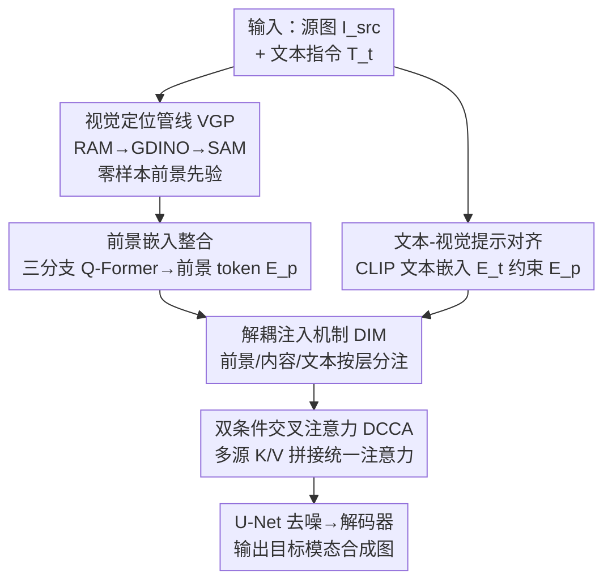

# SynthRGB-T: Language-Vision Guided Image Translation for Diversity Synthesis

**会议**: CVPR 2026  
**论文**: [CVF Open Access](https://openaccess.thecvf.com/content/CVPR2026/html/Ding_SynthRGB-T_Language-Vision_Guided_Image_Translation_for_Diversity_Synthesis_CVPR_2026_paper.html)  
**代码**: 无  
**领域**: 图像生成 / 扩散模型 / 跨模态翻译  
**关键词**: 红外-可见光翻译, 语言-视觉引导, 扩散模型, 双向翻译, 数据合成

## 一句话总结
SynthRGB-T 把红外↔可见光图像翻译重新表述为「视觉-语言引导的去噪扩散」，用基础模型自动抠出前景语义先验、再把前景/内容/文本三路条件解耦地注入 U-Net 不同分辨率层，实现一个模型既能双向翻译又能按文本提示生成多样化结果，在 I2V 和 V2I 两个方向多个真实基准上都拿到 SOTA。

## 研究背景与动机
**领域现状**：红外与可见光配对数据对夜间/低光场景理解（检测、跟踪、多模态融合）很关键，但采集需要专用硬件 + 精确动态配准，大规模数据集成本高、且现有数据集多样性不足。于是大家用图像翻译（GAN 或扩散）做跨模态数据增广，把一个模态映射到另一个模态。

**现有痛点**：作者把现有方法的毛病归纳成三条。其一**单向性**——大多数方法（如 DiffV2IR、各种 GAN）是确定性的一对一映射，只能做 V2I *或* I2V 一个方向，想换方向就得重新训练。其二**泛化差**——没有显式建模开放场景，模型学不到可见像素和热信号之间的真实对应，容易收敛到被训练基准约束的次优解（比如在 M3FD 上训的 I2V-GAN 拿到 RoadScene/VisDrone 上就崩）。其三**缺乏多样性**——一对一映射没法刻画「同一可见场景下，车辆运动状态不同会导致热分布差异很大」「同一张红外图可能对应多种可见外观/环境」这种内在的一对多关系。

**核心矛盾**：确定性映射框架天然只能产出单一、固定方向的结果，而跨模态翻译本质上是「条件可控、方向可切、一对多」的生成问题——框架的表达能力和任务需求之间存在根本错配。

**本文目标**：用一个统一框架同时解决三件事——双向翻译（I2V 和 V2I 共用一个模型）、开放世界泛化（不被训练基准锁死）、可控多样性（同一输入按不同文本提示生成不同合理结果）。

**切入角度**：作者发现扩散模型的 U-Net 交叉注意力层对「布局」和「细节」的响应是分层的（低分辨率层管全局结构、高分辨率层管纹理）。如果能把不同语义的引导条件解耦地注入对应分辨率的层，就能既保住结构一致性、又放开风格/细节的可控生成。

**核心 idea**：把图像翻译写成「语言-视觉引导的去噪扩散过程」，用基础模型（RAM+GroundingDINO+SAM）零样本地自动生成前景语义先验，再把前景/内容/文本三路条件**解耦注入** U-Net 不同分辨率层，用一个统一的双条件交叉注意力把多源条件融到一起。

## 方法详解

### 整体框架
SynthRGB-T 建立在 Stable Diffusion v1.5 之上，输入是一张待翻译图 $I_{src}$（红外或可见光）加一句文本指令 $T_t$（如「把图像从红外转成可见光，夜晚」），输出是目标模态的合成图。整条管线写成 $\hat{I} = N_{tr}(I_{src}, T_t, P \mid \theta)$，其中 $P$ 是前景提示、$N_{tr}$ 是翻译网络。

流程分三步走：① **视觉定位管线（VGP）** 先用三个冻结的基础模型把输入图里的前景物体识别、定位、分割出来，再过 CLIP/SAM 编码器拿到每个物体的标签嵌入和掩码嵌入，构成「隐式翻译先验」；② 这些前景嵌入连同文本提示，经 Q-Former 整合成前景 token，和图像编码器输出的内容嵌入 $E_c$、文本嵌入 $E_t$ 一起，构成三路语义对齐的控制向量；③ 在去噪 U-Net 里，**解耦注入机制（DIM）** 让这三路条件按交叉注意力层的分辨率走不同注入规则，每层的融合由 **双条件交叉注意力（DCCA）** 完成，最后解码器把 $z_0$ 还原回像素空间。整个 VGP 和编码器都冻结，只训 Q-Former、U-Net 和解码器。

### 关键设计

**1. 视觉定位管线 VGP：用基础模型零样本造前景语义先验，免人工标注**

痛点直接：给每张图手动框前景、标类别既费时又费力，而前景（车、人、建筑）恰恰是跨模态翻译里热信号差异最大、最需要精准引导的地方。VGP 串起三个**全程冻结**的基础模型形成流水线：Recognize Anything (RAM) 先提候选类别 $C=\{c_1,\dots,c_K\}$，Grounding DINO 用这些文本语义做条件定位、把类别对到图像区域，SAM 再做像素级分割得到掩码集 $M=\{m_1,\dots,m_K\}$。之后每个前景的文本描述喂 CLIP 编码器、掩码喂 SAM 编码器，建立文本↔视觉的一对一对齐，零样本地为每个物体生成条件嵌入 $E_{mask}^k$ 和 $E_{label}^k$。因为这些模型在大规模自然图像上预训练且无反向更新，整个先验提取过程不增加训练负担，却把「世界知识」注入了翻译过程——这是它能在没见过的开放基准上泛化的关键。

**2. 解耦注入机制 DIM：按交叉注意力层的分辨率分注三路条件，拆开「风格」与「内容」**

这是全文的核心观察。作者借鉴扩散 U-Net 里「不同交叉注意力层管不同属性」的现象：低分辨率层捕全局结构、决定布局和物体宏观状态，高分辨率层负责纹理和局部真实感。于是 DIM 把前景提示嵌入 $E_p$ 注入低分辨率层去引导结构组成与类别，把图像编码器输出 $E_c$ 注入高分辨率层去增强纹理保真，而文本引导 $E_t$ 作为全局约束贯穿所有尺度保证语义一致。实现上每个扩散步有 16 个交叉注意力层（编号 0–15），第 4–8 层划为低分辨率层注入前景引导（Prospect Guidance），其余层注入内容引导（Content Guidance）。这种「分层解耦」让风格和内容真正分离，既不破坏源图几何结构、又能让文本灵活改写外观；消融里去掉 DIM 让所有层都参与融合，反而既增算力又不涨点（FID 从 38.7 退到 62.1）。前景嵌入本身由三分支 Q-Former 整合得到：$E_p = f_{Q\text{-}Former}(E_{mask}, E_{label}, Q_{query})$，把掩码、标签、查询 token 在统一表示空间里关联起来。

**3. 双条件交叉注意力 DCCA：把多源条件拼成统一注意力，而非各算各加和**

要让 U-Net 支持上面的解耦注入，就得有个能同时吃「文本+内容」或「文本+前景」两路条件的注意力结构。传统做法是每个模态分支各算一遍交叉注意力、再逐元素相加，作者认为这限制了条件间的交互、导致全局表示次优。DCCA 改成：用两组可训练线性投影 $W^{1,2}_{i/t}$ 分别处理图像特征 $C_i$ 和文本特征 $C_t$，然后把多源特征的 key 和 value **拼接**起来，再用 U-Net 的 query 特征 $Z$ 发起一次统一的交叉注意力：

$$K = \text{Concat}(C_i W^1_i, C_t W^1_t), \quad V = \text{Concat}(C_i W^2_i, C_t W^2_t)$$

$$Z_{out} = \text{Softmax}\left(\frac{Z W_Q K^T}{\sqrt{d}}\right) V$$

把 K/V 拼接而不是结果相加，意味着 query 在一次 softmax 里就能跨模态联合加权，多源条件之间能直接相互作用，从而学到更协同的潜空间表示。

**4. 文本-视觉提示对齐 $L_{cons}$：把 VGP 抠的前景先验和用户文本拉到同一表示空间**

VGP 生成的查询 token $E_p$ 来自视觉侧，用户给的文本指令经 CLIP 文本编码器变成 $E_t = \varepsilon_t(T_{instr})$ 来自语言侧，两者若不对齐，文本就指挥不动前景生成。作者在一个**单独的训练阶段**用 MSE 加余弦相似度损失把两者拉近：

$$L_{cons} = \lambda_1 \underbrace{\lVert E_t - E_p \rVert^2}_{L_{mse}} + \lambda_2 \underbrace{\left(1 - \frac{E_t \cdot E_p}{\lVert E_t\rVert \lVert E_p\rVert}\right)}_{L_{cos}}$$

这一步对多样性至关重要：消融显示去掉 $L_{cons}$ 会导致前景引导「几乎完全失效」，文本响应度大幅下降——因为没有对齐，文本提示根本进不到前景 token 里。

### 损失函数 / 训练策略
两阶段训练。第一阶段只做上面的提示对齐 $L_{cons}$。第二阶段在 $L_{cons}$ 对齐基础上用三个损失联合优化：扩散损失 $L_{diff} = \mathbb{E}\big[\lVert \epsilon - \epsilon_\theta(z_t, t, [E_c, E_p, E_t])\rVert_2^2\big]$ 保文本一致性；几何损失 $L_{geom} = 1 - \frac{\langle g(\hat{I}), g(I_{src})\rangle}{\lVert g(\hat{I})\rVert \cdot \lVert g(I_{src})\rVert + \epsilon}$ 用 Sobel 算子 $g(\cdot)$ 保内容结构；感知约束 $L_{perc} = \sum_i \lVert \phi_i(\hat{I}) - \phi_i(I_{target})\rVert_1$ 用 VGG 特征增强视觉-语义保真。总损失 $L_{total} = L_{diff} + \lambda_{geom}L_{geom} + \lambda_{perc}L_{perc}$。训练时图像/文本编码器和 VGP 全冻结，只更新 Q-Former、U-Net、解码器；Q-Former 由 BLIP-Diffusion 权重初始化，16 个查询 token；4×RTX 6000 训 100K 步，batch 8，AdamW，lr $1\times10^{-4}$。为增强对缺失条件的鲁棒性，训练时随机丢掉前景引导或内容引导分支；推理用 DDIM 30 步采样。

## 实验关键数据

数据集方面，作者构建了 **RGBTSynth-86K**（86,141 对红外+可见+文本提示，汇集 LLVIP/M3FD/RoadScene/DroneVehicle 等多个公开基准），覆盖 I2V 和 V2I 两个方向；并额外在 VisDrone/COCO/CTIR/IRSTD-1k 等单模态基准上测泛化。评测用 NIQE↓（自然度）、LPIPS↓（感知差异）、FID↓（分布真实度）、SSIM↑（结构相似度）四个指标。为公平对比，每个 baseline 都为每个基准和翻译方向单独训练。

### 主实验（I2V & V2I 对比 SOTA，节选 M3FD / LLVIP）

| 任务 | 基准 | 指标 | 本文 | CM-Diff | DiffV2IR | LG-Diff |
|------|------|------|------|---------|----------|---------|
| I2V | M3FD | FID↓ / SSIM↑ | **40.3 / 0.753** | 43.9 / 0.665 | 116.7 / 0.686 | 78.3 / 0.654 |
| I2V | LLVIP | FID↓ / SSIM↑ | **34.2 / 0.885** | 39.8 / 0.718 | 50.4 / 0.671 | 42.8 / 0.703 |
| I2V | LLVIP | LPIPS↓ | **0.057** | 0.101 | 0.123 | 0.108 |
| V2I | M3FD | FID↓ / SSIM↑ | **37.5 / 0.783** | 40.8 / 0.626 | 39.5 / 0.689 | 72.8 / 0.735 |
| V2I | LLVIP | FID↓ / SSIM↑ | **31.8 / 0.922** | 40.0 / 0.751 | 35.9 / 0.774 | 37.0 / 0.742 |

两个方向、配对与非配对设置下基本都拿第一。GAN 类方法 SSIM 普遍偏低、LPIPS 偏高（跨模态一致性弱）；扩散类更稳但只学到「宏观目标域风格」、没保证翻译像素的真实语义对齐——本文同时压低 FID/LPIPS、抬高 SSIM，说明它确实弥合了模态 gap 而非只换了个风格皮。

### 消融实验（双向平均，VGP/DIM/DCCA/$L_{cons}$ 逐项）

| ID | VGP | DIM | DCCA | $L_{cons}$ | NIQE↓ | LPIPS↓ | FID↓ | SSIM↑ |
|----|-----|-----|------|-----------|-------|--------|------|-------|
| I | ✗ | ✗ | ✗ | ✗ | 7.96 | 0.356 | 144.2 | 0.407 |
| III | ✓ | ✓ | ✗ | ✓ | 5.58 | 0.154 | 60.3 | 0.699 |
| IV | ✓ | ✗ | ✓ | ✓ | 5.85 | 0.172 | 62.1 | 0.675 |
| V | ✓ | ✓ | ✓ | ✗ | 6.62 | 0.248 | 88.6 | 0.629 |
| VI（Full） | ✓ | ✓ | ✓ | ✓ | **4.22** | **0.085** | **38.7** | **0.793** |

### 多样性专项消融（LPIPS 此处↑为好，衡量生成多样性）

| 配置 | I2V LPIPS↑ | I2V FID↓ | V2I LPIPS↑ | V2I FID↓ |
|------|-----------|----------|-----------|----------|
| w/o DIM | 0.132 | 38.9 | 0.102 | 35.5 |
| w/o DCCA | 0.158 | 38.0 | 0.098 | 35.1 |
| w/o $L_{cons}$ | 0.108 | 41.5 | 0.080 | 37.4 |
| SynthRGB-T | **0.179** | **36.9** | **0.126** | **34.5** |

### 关键发现
- **四个组件缺一不可**：从空 baseline（FID 144.2）到完整模型（38.7），每加一块都涨；去掉任意一个都明显掉点，去掉 DIM 让 FID 退到 62.1（且增算力）、去掉 DCCA 退到 60.3。
- **$L_{cons}$ 对多样性和可控性最致命**：去掉它不仅 FID 退到 88.6，多样性 LPIPS 也从 0.179 跌到 0.108，作者观察到「前景引导几乎完全失效」——这印证了文本-视觉对齐是「文本能不能真正指挥生成」的开关。
- **多样性度量的巧妙复用**：作者借鉴已有工作把 LPIPS 从「质量指标（越低越好）」反过来当「多样性指标（越高越好）」——从 500 真实样本用随机文本提示生成 5000 张图算平均 LPIPS 距离，同时为保质量每例采样 5 次算 FID，量化了「按提示生成不同合理结果」的能力。

## 亮点与洞察
- **把基础模型当「免费的世界知识源」零样本接进扩散先验**：RAM+GroundingDINO+SAM 全冻结串成 VGP，不训一分钱却给翻译注入了语义前景先验，这是它在没见过的开放基准上不崩的根本——思路可迁移到任何「需要细粒度语义引导但缺标注」的条件生成任务。
- **「按交叉注意力层分辨率解耦注入不同条件」是最值得借鉴的设计**：它把扩散 U-Net 内部「低分辨率管结构、高分辨率管纹理」的经验观察落成了可执行的注入规则（4–8 层注前景、其余注内容、文本全局约束），实现了风格与内容的真正解耦——这套分层注入策略对可控图像编辑、风格迁移都有直接参考价值。
- **K/V 拼接式的统一交叉注意力 vs. 分支相加**：DCCA 用一个 softmax 让多源条件相互作用，比传统「各算各加」更协同——这是个轻量但有效的多条件融合改进。
- **一个模型双向 + 可控多样**：相比现有方法换方向要重训、且只能一对一映射，SynthRGB-T 用统一框架同时支持 I2V/V2I 和文本可控的一对多生成，并顺手产出 RGBTSynth-86K 数据集 + 50K 合成对，扩充了社区多模态资源。

## 局限与展望
- 作者承认当前只在红外-可见光这一对模态上验证，未来想拓展到医学等其他模态。
- 重度依赖三个外部基础模型（RAM/GDINO/SAM）的前景识别质量——若基础模型在某些罕见类别或低质输入上识别失败，前景先验就会失真（⚠️ 论文未给出 VGP 失败时的鲁棒性分析）。
- 多样性度量复用 LPIPS 当「越高越好」是借鉴他人做法，但 LPIPS 升高既可能来自「合理多样」也可能来自「失真」，单看这个指标难区分两者；论文用 t-SNE 可视化和固定 FID 上限做了一定缓解，但这套度量的严谨性仍存疑。
- 整条管线（基础模型前景提取 + 两阶段训练 + 多损失）较重，4×RTX 6000、100K 步的训练成本不低，推理也要先跑 VGP 再扩散。

## 相关工作与启发
- **vs DiffV2IR / LG-Diff**：它们也把文本语义+空间先验融进扩散来做 V2I，但仍是单向、一对一；本文用 VGP 自动造前景先验 + DIM 分层解耦注入，做到双向 + 可控多样，泛化到开放基准明显更稳（M3FD V2I FID 39.5/72.8 → 37.5）。
- **vs CM-Diff**：CM-Diff 联合建模红外/可见分布也支持双向翻译，但作者指出它主要学「宏观目标域风格」、翻译像素语义对齐不足（V2I 时活体热信号丢失）；本文靠语言-视觉细粒度引导拿到更高 SSIM（如 LLVIP V2I 0.751 → 0.922）。
- **vs GAN 类（CycleGAN / I2V-GAN / StegoGAN）**：GAN 方法跨模态像素对应弱、SSIM 低 LPIPS 高，且域特定过拟合、换基准就崩；扩散 + 基础模型先验在泛化性和视觉真实度上整体碾压。

## 评分
- 新颖性: ⭐⭐⭐⭐ 「基础模型零样本造前景先验 + 按 U-Net 分辨率层解耦注入多条件」组合得很巧，统一了双向+多样翻译。
- 实验充分度: ⭐⭐⭐⭐ I2V/V2I 双向、配对/非配对、五基准 + 多样性专项 + 完整四组件消融，覆盖很全。
- 写作质量: ⭐⭐⭐⭐ 三大限制→三大设计的对应清晰，公式和注入规则交代到位。
- 价值: ⭐⭐⭐⭐ 产出 RGBTSynth-86K + 50K 合成对，对多模态检测/跟踪的数据扩充有直接工程价值。

<!-- RELATED:START -->

## 相关论文

- [\[CVPR 2026\] VisionDirector: Vision-Language Guided Closed-Loop Refinement for Generative Image Synthesis](visiondirector_vision-language_guided_closed-loop_refinement_for_generative_imag.md)
- [\[CVPR 2026\] VOSR: A Vision-Only Generative Model for Image Super-Resolution](vosr_a_vision_only_generative_model_for_image_super_resolution.md)
- [\[CVPR 2026\] OpenDPR: Open-Vocabulary Change Detection via Vision-Centric Diffusion-Guided Prototype Retrieval for Remote Sensing Imagery](opendpr_open-vocabulary_change_detection_via_vision-centric_diffusion-guided_pro.md)
- [\[CVPR 2026\] TherA: Thermal-Aware Visual-Language Prompting for Controllable RGB-to-Thermal Infrared Translation](thera_thermal-aware_visual-language_prompting_for_controllable_rgb-to-thermal_in.md)
- [\[CVPR 2026\] Diversity over Uniformity: Rethinking Representation in Generated Image Detection](diversity_over_uniformity_rethinking_representation_in_generated_image_detection.md)

<!-- RELATED:END -->
