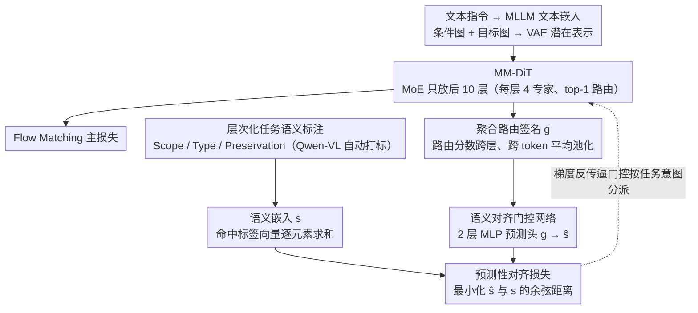

# TAG-MoE: Task-Aware Gating for Unified Generative Mixture-of-Experts

**会议**: CVPR 2026  
**arXiv**: [2601.08881](https://arxiv.org/abs/2601.08881)  
**代码**: [项目主页](https://yuci-gpt.github.io/TAG-MoE/)  
**领域**: 图像生成 / 扩散模型 / 图像编辑  
**关键词**: 混合专家, 任务感知路由, 统一图像生成编辑, 扩散Transformer, 任务干扰

## 一句话总结

针对统一图像生成与编辑模型中严重的任务干扰问题，提出 TAG-MoE 框架，通过层次化任务语义标注方案和预测性对齐正则化将高层任务意图注入 MoE 局部路由决策，使门控网络从任务无关的执行器进化为语义感知的调度中心，在 ICE-Bench、EmuEdit、GEdit、DreamBench++ 等五个基准上取得开源模型最优综合性能。

## 研究背景与动机

1. **领域现状**：视觉合成领域正快速收敛到统一图像生成与编辑模型，旨在将主体定制、风格迁移、高保真修复、指令编辑等任务整合到单一框架中。代表方法包括 ACE++、Flux Kontext、BAGEL、OmniGen2、Qwen-Edit 等，均基于大规模 Dense Diffusion Transformer (DiT)。

2. **现有痛点**：统一模型面临严重的**任务干扰**——共享参数空间必须同时执行根本矛盾的目标：局部编辑要求精确保留内容，而主体驱动生成要求表达性多样和新颖合成。这种根本冲突迫使网络走向"平庸妥协"，阻碍了必要的表征特化。

3. **核心矛盾**：稀疏 MoE 是扩展模型容量、缓解任务干扰的有前景方案，但标准 MoE 的门控网络是**任务无关的**——仅依赖局部 token 特征做路由，完全不知道全局任务意图（如"保持身份"还是"修改风格"）。这种局部门控与全局目标之间的深层信息鸿沟导致专家自发、低效的特化，无法结构性地解耦多任务干扰。

4. **本文目标**：如何将高层全局任务语义注入局部 MoE 路由机制，实现任务感知的专家特化？

5. **切入角度**：作者观察到"语义相似的生成任务应触发相似的专家使用模式"，据此设计正则化使路由签名可以预测任务语义。

6. **核心 idea**：通过层次化任务标注构建结构化语义监督信号，再通过预测性对齐损失强制 MoE 路由策略与任务语义对齐，使门控网络自动学会按任务意图分派专家。

## 方法详解

### 整体框架

TAG-MoE 想解决的核心问题是：统一生成模型里门控网络只看局部 token 特征做路由，根本不知道这一笔生成到底是"保身份"还是"改风格"，于是专家的特化全靠自发涌现、效率低下。它的思路是把高层任务意图当成一种可学习的监督信号，逼着路由策略本身去"预测"任务语义，从而间接把全局意图灌进局部路由。

整条 pipeline 建立在 MM-DiT（多模态扩散 Transformer）之上：文本指令经 MLLM 编码为文本嵌入，条件图像与目标图像经 VAE 压成潜在表示，一起送入 DiT。在后 10 层 Transformer 块里，图像流的 FFN 被换成 MoE 层（每层 4 个专家、top-1 路由）。训练时，先用一套层次化标注给每个样本打上结构化任务描述符，再让一个语义对齐路由器把"全模型的整体路由模式"对齐到这些任务描述符，整体由 Flow Matching 目标端到端训练；推理时不需要标注，只靠 VLM 改写指令即可。

### 关键设计

**1. 层次化任务语义标注：把笼统的"编辑"拆成正交的三层标签**

统一模型最棘手的地方在于"编辑"这个词太粗——"把背景换成海滩"和"让人微笑"都叫编辑，但前者要大改像素、后者要严守身份，二者的行为和保留约束几乎相反。单一粗粒度标签喂不出这种区分。TAG-MoE 把每个任务沿三个正交维度拆开标注：**Scope** 描述操作的空间范围（全局编辑 / 局部编辑 / 内容定制），**Type** 描述语义类别（物体编辑 / 风格迁移 / 属性编辑），**Preservation** 描述必须保持不变的要素（身份 / 背景 / 结构保留）。标注本身由 Qwen-VL 自动完成——读入训练三元组（源图、指令、目标图）后输出这组原子标签，无需人工。这套标注就是后面路由对齐所依赖的、之前 MoE 训练里完全缺失的结构化监督信号。

**2. 语义对齐门控网络：让路由签名能"预测"任务语义**

有了任务标签，最直白的做法是把标签直接喂给路由器——但那样推理时拿不到标签就废了。TAG-MoE 改成一个间接而巧妙的约束：要求模型实际跑出来的整体路由模式（路由签名 $\mathbf{g}$）本身能够预测这一笔的宏观任务语义（语义嵌入 $\mathbf{s}$）。

它分三步搭起这座桥。先构建**全局语义嵌入**：定义一个含 $K$ 个原子标签的词表 $\mathcal{V}$，每个标签学一个嵌入向量，把样本命中的标签集合逐元素求和，聚合成固定维度的语义向量 $\mathbf{s}$。再构建**聚合路由签名**：把所有 MoE 层的路由分数先跨层平均、再跨 token 平均池化，压成一个向量 $\mathbf{g} \in \mathbb{R}^N$，它编码的是整个模型在这一笔上的专家使用模式（而非单个 token 的瞬时选择）。最后做**预测性对齐**：用一个 2 层 MLP 预测头把 $\mathbf{g}$ 投到语义空间得到 $\hat{\mathbf{s}}$，最小化它与真值 $\mathbf{s}$ 的余弦距离。

关键在于梯度会顺着 $\mathbf{g}$ 反传回所有 MoE 层的门控网络 $\mathcal{G}$——为了让聚合签名足够"可预测任务"，每一层的 $\mathcal{G}$ 都被迫学会按任务意图智能分派 token。门控由此从任务无关的执行器，变成了语义感知的调度中心，而这一切都不依赖推理时的标签。

**3. MoE 只放后 10 层：把扩容用在最受益的高层语义上**

容量扩展并非每一层都划算。TAG-MoE 只在 DiT 的后 10 层把 FFN 换成 MoE（每个专家结构与原 FFN 相同，每层 4 个、top-1 路由），浅层处理低层特征仍用普通 FFN。这沿用了 DeepSeek-V3、DiT-MoE 的经验：高层语义合成最吃容量，把稀疏专家集中放在深层，能在几乎不增加激活参数量的前提下显著扩容。

### 损失函数 / 训练策略

总损失为三项之和：$\mathcal{L}_{total} = \mathcal{L}_{flow} + \lambda_{lbl}\mathcal{L}_{lbl} + \lambda_{align}\mathcal{L}_{align}$，其中 $\mathcal{L}_{flow}$ 是 Flow Matching 主损失，$\mathcal{L}_{lbl}$ 是标准 MoE 负载均衡损失，$\mathcal{L}_{align}$ 是预测性对齐损失。训练数据超过 1100 万样本，包含公开数据（InstructP2P、UltraEdit、OmniEdit 等 220 万）和自建数据（通过 GPT-4o 生成指令、用专用模型生成目标图像、并构建反向任务增强鲁棒性）。

## 实验关键数据

### 主实验

**ICE-Bench 统一生成评估**（主基准，涵盖 26 个任务类型）：

| 方法 | 美学 | CLIP-src | CLIP-cap | CLIP-ref | vllmqa |
|------|------|----------|----------|----------|--------|
| ACE++ | 5.219 | 0.851 | 0.263 | 0.713 | 0.637 |
| Kontext | 5.165 | 0.863 | 0.274 | 0.728 | 0.629 |
| OmniGen2 | 5.238 | 0.855 | 0.279 | 0.728 | 0.787 |
| Qwen-Edit | 5.358 | 0.840 | 0.279 | 0.671 | 0.774 |
| **TAG-MoE** | **5.399** | 0.857 | **0.282** | 0.732 | **0.852** |
| GPT-4o (闭源) | 5.801 | 0.823 | 0.278 | 0.693 | 0.889 |

**图像编辑专项评估（EmuEdit-bench / GEdit-bench）**：

| 方法 | EmuEdit vllmqa | GEdit vllmqa |
|------|----------------|--------------|
| Step1X-Edit | 0.7893 | 0.8158 |
| Qwen-Edit | 0.9174 | 0.875 |
| **TAG-MoE** | **0.9284** | **0.8854** |

**主体驱动生成（DreamBench++ / OmniContext）**：TAG-MoE 在 Face-ref（面部身份保持）上均取得 SOTA，Style-ref 在 DreamBench++ 上也是最高。

### 消融实验

| 配置 | DINO-ref | Face-ref | Style-ref | CLIP-src | CLIP-cap | vllmqa |
|------|----------|----------|-----------|----------|----------|--------|
| Dense 基线 | 0.7196 | 0.3544 | 0.5177 | 0.851 | 0.263 | 0.637 |
| MoE w/o $\mathcal{L}_{align}$ | 0.7355 | 0.3779 | 0.5251 | 0.863 | 0.274 | 0.677 |
| MoE w/ $\mathcal{L}_{align}$ | **0.7620** | **0.4642** | **0.5679** | **0.879** | **0.281** | **0.847** |

### 关键发现

- **MoE vs Dense**：等激活参数量下，MoE 在所有指标上大幅超越 Dense，收敛速度也更快，验证稀疏架构是缓解任务干扰的基础必需。
- **$\mathcal{L}_{align}$ 的决定性作用**：去掉对齐损失后所有指标大幅下降。仅有 MoE 结构不够，$\mathcal{L}_{align}$ 才是实现语义引导路由、真正解决任务干扰的关键。
- **专家特化可视化**：不同任务（Change Material vs Change Color）激活不同专家组合，且 token 热力图显示计算空间上集中在编辑相关区域（如背包像素），非相关背景被路由到其他专家。证实了任务特定且空间感知的特化。
- **用户研究**：65 人、50 个案例，TAG-MoE 在参考对齐、提示对齐、总体偏好三项标准上均获最高选择率。

## 亮点与洞察

- **预测性对齐正则化**是最核心的创新——不直接给路由器喂任务标签（那样推理时没标签就废了），而是要求路由策略本身能"预测出"任务语义，这样推理时路由器自然进化出了任务感知能力。设计非常巧妙。
- **层次化标注方案**将"编辑"这个模糊概念分解为 Scope/Type/Preservation 三个正交维度，提供了之前 MoE 训练中完全缺失的结构化监督信号。这个标注思路可迁移到任何多任务学习场景。
- **聚合路由签名**的设计也很聪明——不是看单个 token 的路由，而是将所有层所有 token 的路由分数聚合为一个全局向量，捕获样本级别的整体专家使用模式。

## 局限与展望

- 模型缺乏统一的输入理解能力——依赖预处理后的意图描述，无法联合推理意图和源图像的视觉内容。例如无法解决图像中的数学题（理解编辑意图但不理解像素内容）。
- 推理时依赖 VLM 做指令改写作为预处理，增加了延迟和复杂度。
- 专家数量固定为 4，路由策略为 top-1，更灵活的配置（如 top-2、动态专家数）值得探索。
- 任务标签词表是预定义的，新任务类型需要扩展词表并重新训练。

## 相关工作与启发

- **vs ICEdit**: ICEdit 用 LoRA-based MoE 模块集成到注意力块中，但 LoRA 专家容量有限，且路由仍是任务无关的。TAG-MoE 使用全尺寸专家 + 语义对齐路由，更有效。
- **vs Dense DiT (如 Qwen-Edit)**: Dense 模型在统一任务中被迫做平庸妥协，TAG-MoE 通过稀疏激活 + 语义引导路由实现了"专家级"处理不同任务子集。
- **vs DiT-MoE / HunyuanImage**: 这些工作将 MoE 用于单一 T2I 任务，不需要处理异构任务冲突。TAG-MoE 是首个解决多任务统一生成中 MoE 路由问题的工作。

## 评分

- 新颖性: ⭐⭐⭐⭐ 预测性对齐正则化思路新颖，将"路由预测语义"作为桥梁注入任务意图是巧妙的间接方法
- 实验充分度: ⭐⭐⭐⭐⭐ 五个基准、三类专项评估、消融研究、可视化分析、用户研究，非常全面
- 写作质量: ⭐⭐⭐⭐ 逻辑清晰，问题定义明确，但部分数学符号可进一步简化
- 价值: ⭐⭐⭐⭐ 对统一生成模型中的任务干扰问题提供了系统性解决方案，语义对齐路由的思路可广泛迁移

<!-- RELATED:START -->

## 相关论文

- [\[CVPR 2026\] CARE-Edit: Condition-Aware Routing of Experts for Contextual Image Editing](care-edit_condition-aware_routing_of_experts_for_contextual_image_editing.md)
- [\[CVPR 2026\] Taming Generative Diffusion Model for Task-Oriented Infrared Imaging](taming_generative_diffusion_model_for_task-oriented_infrared_imaging.md)
- [\[CVPR 2026\] PosterOmni: Generalized Artistic Poster Creation via Task Distillation and Unified Reward Feedback](posteromni_generalized_artistic_poster_creation_via_task_distillation_and_unifie.md)
- [\[AAAI 2026\] Mixture of Ranks with Degradation-Aware Routing for One-Step Real-World Image Super-Resolution](../../AAAI2026/image_generation/mixture_of_ranks_with_degradation-aware_routing_for_one-step_real-world_image_su.md)
- [\[CVPR 2026\] Unified Customized Generation by Disentangled Reward Modeling](unified_customized_generation_by_disentangled_reward_modeling.md)

<!-- RELATED:END -->
