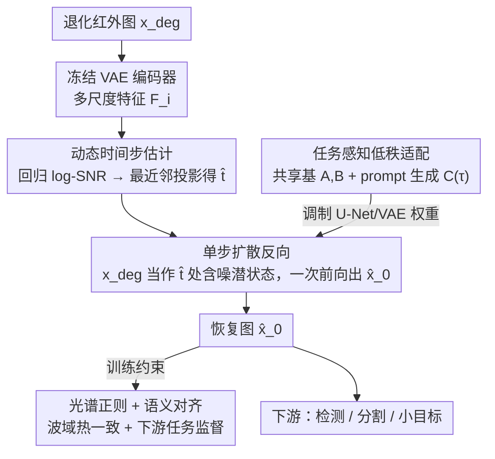

# Taming Generative Diffusion Model for Task-Oriented Infrared Imaging

**会议**: CVPR 2026  
**论文**: [CVF Open Access](https://openaccess.thecvf.com/content/CVPR2026/html/Ma_Taming_Generative_Diffusion_Model_for_Task-Oriented_Infrared_Imaging_CVPR_2026_paper.html)  
**代码**: https://github.com/csmty/InfraredIR  
**领域**: 扩散模型 / 红外图像恢复  
**关键词**: 红外成像, 单步扩散, 时间步估计, 任务感知LoRA, 光谱正则

## 一句话总结
把红外图像恢复重写成「单步扩散」——用一个轻量预测器把退化输入对齐到扩散轨迹上的最优时间步 $\hat t$，再配上波域光谱正则保住热辐射特性、任务感知低秩适配让一套模型靠优化几百维 prompt 就能切换到检测/分割等下游任务，在恢复质量、语义保持和效率上同时超过现有方法。

## 研究背景与动机

**领域现状**：红外成像是恶劣环境下感知（自动驾驶、机器人）的关键，但真实场景里图像被热噪声、传感器非均匀、大气模糊等**动态耦合的退化**严重污染，既降低视觉清晰度，也破坏下游检测/分割的语义准确率。扩散模型有很强的生成先验，自然被想拿来做红外恢复。

**现有痛点**：直接把扩散模型搬到红外有三个硬伤。① **先验错配**——绝大多数扩散先验是在可见光 RGB 上训的，依赖的是反射率纹理；而红外图像来自物体热辐射，强行迁移 RGB 先验会幻想出与热特性不符的纹理或结构，物理上不可信。② **效率**——扩散推理要多步迭代去噪，延迟高、算力贵，落地难。③ **适配成本**——下游任务（检测、分割、跟踪）要求模型快速适配场景/传感器/退化模式的变化，但扩散模型参数量大、靠全模型微调做任务定制，资源受限时几乎不可行。

**核心矛盾**：物理保真、计算效率、任务灵活三者之间存在张力——要保真就想用大生成先验，但先验是可见光的且推理慢；要灵活就要给每个任务微调，但微调全模型又贵。

**本文目标**：在一个框架里同时拿下这三点：恢复质量、语义结构保持、跨任务泛化。

**切入角度**：作者的关键观察是——任意退化的真实输入 $x_{\text{deg}}$ 其实可以被看成扩散前向过程中某个**未知时间步** $\hat t$ 处的含噪潜状态 $\hat x_{\hat t}$。一旦能估出这个 $\hat t$，就能用反向预测公式一步算出干净图，把整条迭代采样链压成一次前向。

**核心 idea**：把红外恢复重写成「单步扩散」——动态估计退化对应的时间步做一次反向，配光谱正则约束热物理一致，再用 prompt 驱动的低秩适配实现跨任务高效迁移。

## 方法详解

### 整体框架

整个框架建在一个预训练扩散先验（SD-Turbo）之上，核心是把「迭代恢复」改写成「单步恢复」。流程是：退化红外图 $x_{\text{deg}}$ 进来后，先复用冻结 VAE 编码器的多尺度特征，由一个轻量预测器估出它在扩散轨迹上对应的时间步 $\hat t$；把 $x_{\text{deg}}$ 当作 $\hat t$ 处的含噪潜状态，用反向预测公式一次前向得到恢复图 $\hat x_0$。在这个主干上挂两个动态条件机制：**动态时间步估计**负责把输入定位到轨迹的最优位置以调用对应时间步的先验；**任务感知低秩适配**负责让同一主干通过 prompt 切换到不同下游任务。训练时再叠一个**波域光谱正则**约束热辐射一致性，以及随下游任务实例化的语义对齐损失。

### 关键设计

**1. 单步扩散重构：把任意退化看成轨迹上某个未知时间步的含噪态**

痛点直接对准扩散推理慢。标准扩散靠 $x_t=\sqrt{\bar\alpha_t}x_0+\sqrt{1-\bar\alpha_t}\epsilon$ 前向加噪、再一步步反向去噪，多步采样是延迟主因。作者的做法是建立「真实退化 ↔ 前向扩散」的等价映射：假设一张任意退化的真实输入 $x_{\text{deg}}$ 就等于某个特定但未知时间步 $\hat t$ 处的含噪潜状态 $\hat x_{\hat t}$。于是干净图可由反向预测公式一次算出：$\hat x_0=\frac{1}{\sqrt{\bar\alpha_{\hat t}}}\big(\hat x_{\hat t}-\sqrt{1-\bar\alpha_{\hat t}}\,\epsilon_\theta(\hat x_{\hat t},\hat t)\big)$，整条恢复被压成单次前向 $x_{\text{restored}}=\hat x_0(x_{\text{deg}},\hat t)$。这样既保住了大生成先验的能力，又把 FLOPs 砍掉一个数量级——效率甚至低于从头训练的紧凑模型。

**2. 动态时间步估计：把"该用哪个时间步"变成可学的反问题**

单步恢复的成败完全压在 $\hat t$ 估得准不准上——$\hat t$ 必须匹配 $x_{\text{deg}}$ 的退化程度，太大会把轻度退化的图过度平滑，太小又去不掉重噪声。作者不用启发式搜索，而是把它当作噪声调度下的反问题。噪声调度用 log-SNR 参数化 $\lambda(t)=\log(\bar\alpha_t/(1-\bar\alpha_t))$，它在离散时间步索引与状态的连续信息量之间是双射，因此找最优 $\hat t$ 在数学上等价于估计输入相对于生成先验流形的内在退化程度。实现上复用冻结 VAE 编码器的多尺度特征 $F_i$（这些特征隐含退化线索），经轻量 MLP 头 $f_\phi$ 聚合投影，用 Smooth L1 回归真值连续 log-SNR $\lambda_{gt}$；推理时预测连续 $\hat\lambda$ 再最近邻投影到离散域 $\hat t=\arg\min_t|\lambda(t)-\hat\lambda|$。消融里它对轻/重退化分别预测出 $\hat t=82$ 和 $\hat t=255$，比任何固定时间步都更稳。

**3. 任务感知低秩适配：共享基 + prompt 生成的任务调制，靠优化几百维向量切任务**

痛点是下游任务目标各异（恢复要感知保真、检测/分割要语义判别），但给每个任务全模型微调太贵。作者做结构解耦：对冻结层 $W_0^{(\ell)}$ 引入秩-$r$ 更新 $\Delta W^{(\ell,\tau)}=A^{(\ell)}C^{(\tau)}B^{(\ell)}$，其中 $A^{(\ell)},B^{(\ell)}$ 是所有任务**共享**的投影基（定义通用适配子空间），$C^{(\tau)}\in\mathbb{R}^{r\times r}$ 是任务专属的紧凑瓶颈算子。为避免给每个任务存一份离散 $C^{(\tau)}$ 不可扩展，进一步用动态 prompt：把任务调制建成可学任务嵌入 $p_\tau$ 的连续函数，用轻量超网络 $h_\phi$ 映射 $C^{(\tau)}=h_\phi(p_\tau)$。这样通用机制（$A,B,h_\phi$）与任务表示（$p_\tau$）彻底分开——共享参数一旦收敛，适配一个全新任务只需优化低维 prompt $p_\tau$（论文里是 $1\times512$ 向量），从高维权重微调降为紧凑潜优化；冻结共享参数还天然防止新任务干扰旧知识。实验里转到全新分割任务时，冻住共享 LoRA、只优化 $p_\tau$ 就能在很少迭代内涨上来。

**4. 多尺度光谱正则：在波域约束热辐射一致，挡住 RGB 先验幻想纹理**

RGB 预训练先验迁到热域的最大隐患是把反射光纹理"幻想"进红外图。作者在小波域加一个多尺度光谱约束，不去硬匹配绝对光谱功率，而是约束**子带间能量分布**一致。设 $W_s^b(x)$ 为图像 $x$ 在尺度 $s$、子带 $b\in\{LH,HL,HH\}$ 的 2D-DWT 系数，能量 $E_s^b(x)=\|W_s^b(x)\|_2^2$、归一化占比 $p_s^b(x)=E_s^b(x)/(\sum_{b'}E_s^{b'}(x)+\varepsilon)$，则

$$L_{\text{Spec}}=\sum_{s=1}^{S}\sum_{b\in\{LH,HL,HH\}}\big|p_s^b(\hat x_0)-p_s^b(x_0)\big|.$$

它鼓励恢复结果保住红外特有的结构特征。最终目标把视觉恢复项与语义对齐项统一：$L_{\text{total}}=\underbrace{L_{\text{Base}}+\lambda_S L_{\text{Spec}}}_{\text{视觉恢复}}+\underbrace{\lambda_S L_{\text{Sem}}(\hat x_0,x_{GT})}_{\text{语义对齐}}$，其中 $L_{\text{Base}}$ 含 MSE+LPIPS+GAN，$L_{\text{Sem}}$ 随下游任务实例化（检测用分类+框回归、分割用分割损失）。靠调权重，框架能在「纯视觉质量」和「纯语义优先」之间灵活切换。⚠️ 原文式 (3) 中视觉恢复与语义对齐项的权重符号都写作 $\lambda_S$，疑似笔误，以原文为准。

### 损失函数 / 训练策略
用 SD-Turbo 作生成先验、官方权重初始化；prompt $p_\tau$ 为可学 $1\times512$ 向量，超网络 $h_\phi$ 是两隐层 512 维 MLP。RTX 5090 上用 Adam、学习率 $2\times10^{-5}$、batch 2、$512\times512$ 输入；LoRA 秩 VAE 用 16、U-Net 用 32，训练 50k 步。下游用 YOLOv8 测检测、SegFormer 测分割。

## 实验关键数据

### 主实验

HM-TIR 复合退化恢复（Normal 轻 / Hard 重）：

| 设置 | 指标 | 本文 | 次优(PPFN) | 说明 |
|------|------|------|-----------|------|
| Normal | PSNR ↑ | **27.918** | 25.232 | 超最强 baseline 2.68 dB |
| Normal | LPIPS ↓ | **0.1372** | 0.3264 | 感知质量最佳 |
| Normal | AHIQ ↑ | **0.4042** | 0.2633 | — |
| Hard | SSIM ↑ | **0.7572** | 0.7644(PPFN) | 重退化下仍居前 |
| Hard | DISTS ↓ | **0.1233** | 0.2829 | 最低 |

下游语义任务（检测 M3FD mAP / 分割 FMB mIoU）：

| 任务 | 指标 | 本文 | 次优 | 提升 |
|------|------|------|------|------|
| 检测 M3FD | mAP | **0.718** | 0.611 (PPFN) | +10.7 点 |
| 分割 FMB | mIoU | **0.447** | 0.329 (ResShift) | 大幅领先 |

效率（与大生成先验法比）：

| 指标 | SUPIR | DiffBIR | ResShift | 本文 |
|------|-------|---------|----------|------|
| FLOPs(T) ↓ | 32.577 | 11.796 | 1.354 | **1.191** |
| 参数(B) | 3.950 | 1.682 | 0.174 | 1.329 |

单步策略把 FLOPs 相对大先验法砍掉 10~27 倍（对 SUPIR 从 32.577T 降到 1.191T），用比紧凑模型还低的算力调用了大规模先验。

### 消融实验

优化目标消融（HM-TIR）：

| 配置 | PSNR ↑ | LPIPS ↓ | mIoU ↑ | 说明 |
|------|--------|---------|--------|------|
| Base ($L_{\text{Base}}$) | 24.152 | 0.315 | 0.403 | 仅基础重建，最差 |
| w/o Semantic | 25.703 | 0.224 | 0.417 | 加光谱，视觉/感知大涨 |
| w/o Spectral | 24.408 | 0.372 | 0.442 | 加语义，下游精度升 |
| Full | 25.684 | 0.1857 | 0.447 | 两者兼顾，综合最佳 |

时间步与适配消融：固定时间步（$t\in\{50,250,500,1000\}$）跨退化级泛化差，大步过度平滑、小步去不掉重噪；动态估计对轻/重输入分别预测 $\hat t=82/255$，PSNR 中位数最高且方差稳。去掉任务 prompt $p_\tau$，检测 mAP 从 0.718 掉到 0.682。

### 关键发现
- **光谱项管视觉、语义项管下游，各司其职**：去 spectral 时 LPIPS 恶化到 0.372（视觉变差但 mIoU 反升到 0.442），去 semantic 时 mIoU 降到 0.417——两项在感知保真与任务精度间存在竞争，Full model 的价值正是在它们之间取得平衡。
- **动态时间步是单步恢复成立的前提**：固定步无法跨退化级通用，自适应 $\hat t$ 才能同时兼顾细节保持与伪影去除。
- **prompt-only 适配真能迁移**：训练完恢复+检测后，冻住共享 LoRA、只优化 $p_\tau$，分割性能在很少迭代内快速爬升；未见场景（TNO/RoadScene）和全新任务（红外小目标检测 IRSTD-1K/NUAA-SIRST）也只靠调 prompt 就拿到最佳指标。

## 亮点与洞察
- **「退化程度 = 轨迹位置」这个映射很巧**：把"该从哪个时间步开始反向"从玄学搜索变成可回归的 log-SNR 反问题，且复用 VAE 已有的多尺度特征做预测，几乎零额外网络成本——这是单步化能成立的关键支点。
- **共享基 + prompt 超网络的解耦**：把 LoRA 拆成「通用子空间 $A,B$」和「prompt 生成的任务算子 $C(\tau)=h_\phi(p_\tau)$」，让加新任务从"再训一套权重"变成"优化几百维向量"，且冻结共享参数天然抗遗忘——这套范式可直接迁到任何「一主干多任务」的生成式恢复场景。
- **波域只约束子带能量占比、不匹配绝对功率**：这个选择很聪明，既挡住 RGB 先验的幻想纹理，又不把模型逼到死板复刻光谱，保留了生成先验的灵活度。

## 局限与展望
- 单步恢复假设「退化输入 = 轨迹上某个含噪态」，对训练分布外、与高斯加噪几何差异极大的退化（如强结构性条带/复杂大气湍流），这个等价映射是否仍成立、$\hat t$ 估计是否退化，论文未深入讨论。⚠️ 属笔者推测。
- 视觉项与语义项权重都记作 $\lambda_S$（式 3），公式表述存疑；如何在部署时自动选权重、而非手调，仍是开放问题。
- 评测多在公开红外基准上做，真实传感器在线部署时的时序稳定性、跨传感器漂移未覆盖。
- 生成先验仍来自可见光 SD-Turbo，光谱正则是"事后约束"而非"先验本身就懂热辐射"，未来若有原生红外/多光谱大先验可能进一步提升物理保真。

## 相关工作与启发
- **vs DiffBIR / ResShift（扩散恢复）**: 它们用预训练扩散先验做盲恢复/超分，但为可见光设计、靠多步采样，迁到红外会幻想纹理或过度平滑热结构、效率也低；本文用单步 + 光谱正则同时解决物理保真与效率。
- **vs Restormer / AdaIR（回归式恢复）**: 回归法倾向过度平滑细节、且通常针对单一退化因子；本文借生成先验恢复更清晰结构，并能跨多种复合退化。
- **vs PPFN（多退化 prompt 融合，NeurIPS'25）**: 同样用 prompt 但目标是渐进融合多退化因子做恢复；本文 prompt 是任务级调制、驱动同一主干切换到检测/分割等下游语义任务，定位不同。
- **vs SUPIR（大生成先验恢复）**: SUPIR 参数/FLOPs 巨大（32.577T）；本文单步把 FLOPs 降到 1.191T，以更低算力调用大先验。

## 评分
- 新颖性: ⭐⭐⭐⭐⭐ 「退化=轨迹时间步」的单步重构 + prompt 驱动任务感知 LoRA，两个机制都不落俗套且互相支撑。
- 实验充分度: ⭐⭐⭐⭐⭐ 覆盖恢复/检测/分割/小目标/未见场景 + 效率 + 多组消融，证据链完整。
- 写作质量: ⭐⭐⭐⭐ 动机与方法清晰，但式 (3) 权重符号疑似笔误、部分指标只在图里给。
- 价值: ⭐⭐⭐⭐⭐ 把"高效 + 物理一致 + 多任务"在红外感知上统一，实用性强且范式可迁移。

<!-- RELATED:START -->

## 相关论文

- [\[CVPR 2026\] Streaming Diffusion Model for Fast Infrared and Visible Video Fusion](streaming_diffusion_model_for_fast_infrared_and_visible_video_fusion.md)
- [\[CVPR 2026\] TAG-MoE: Task-Aware Gating for Unified Generative Mixture-of-Experts](tag-moe_task-aware_gating_for_unified_generative_mixture-of-experts.md)
- [\[CVPR 2026\] DiP: Taming Diffusion Models in Pixel Space](dip_taming_diffusion_models_in_pixel_space.md)
- [\[CVPR 2025\] DoraCycle: Domain-Oriented Adaptation of Unified Generative Model in Multimodal Cycles](../../CVPR2025/image_generation/doracycle_domain-oriented_adaptation_of_unified_generative_model_in_multimodal_c.md)
- [\[CVPR 2026\] Taming Sampling Perturbations with Variance Expansion Loss for Latent Diffusion Models](taming_sampling_perturbations_with_variance_expansion_loss_for_latent_diffusion_.md)

<!-- RELATED:END -->
