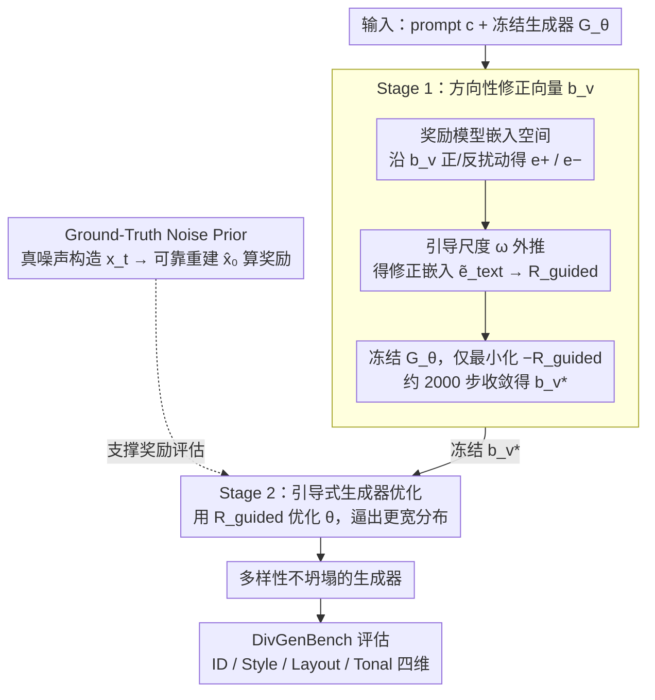

# Taming Preference Mode Collapse via Directional Decoupling Alignment in Diffusion Reinforcement Learning

**会议**: CVPR 2026  
**arXiv**: [2512.24146](https://arxiv.org/abs/2512.24146)  
**代码**: 无  
**领域**: 图像生成  
**关键词**: 偏好模式坍塌, RLHF对齐, 扩散模型, 奖励修正, 生成多样性

## 一句话总结

提出 D2-Align 框架，通过在奖励模型嵌入空间中学习方向性修正向量来纠偏奖励信号，解决扩散模型 RLHF 对齐中的偏好模式坍塌（PMC）问题——即模型过度优化奖励导致生成多样性严重下降；同时提出 DivGenBench 基准用于量化评估生成多样性。

## 研究背景与动机

RLHF 已被广泛用于将 T2I 扩散模型与人类偏好对齐，但现有方法在追求高奖励分数的同时产生了严重的副作用：

- **偏好模式坍塌（PMC）**：模型收敛到奖励模型偏好的狭窄模式——风格单一、过度油腻/过曝、人脸同质化，生成多样性严重退化。这是奖励黑客在多样性维度的具体表现
- **多样性评估缺失**：现有工作主要关注质量维度的奖励黑客，对生成多样性的崩溃缺乏关注。不像保真度那样容易量化，多样性没有标准化的评估指标
- **现有对策仅调幅度不调方向**：
    - Flow-GRPO 的 KL 正则化需大量手动调参且增加训练开销
    - DanceGRPO 的多奖励集成对权重敏感，训练不稳定
    - 这些方法本质上只调节奖励的**幅度**，未纠正奖励模型的内在偏差**方向**
- **根本原因假设**：奖励模型（如 HPS-v2.1）存在内在偏好偏差，优化过程天然地驱使模型过拟合这些偏好，导致分布坍塌

## 方法详解

### 整体框架

D2-Align 是一个两阶段解耦框架：Stage 1 在冻结生成器的条件下，学习一个方向性修正向量来纠偏奖励信号；Stage 2 利用学到的修正方向引导生成器优化，防止模型陷入特定模式。核心思想是**修正奖励的方向而非幅度**。

### 关键设计

**1. 方向性修正向量 $\bm{b}_v$：在奖励模型的嵌入空间里学一个「纠偏方向」（Stage 1）**

针对的痛点是 KL 正则、多奖励集成这些旧对策只会调节奖励的**幅度**，却动不了奖励模型内在偏差的**方向**——HPS-v2.1 本身就偏爱油腻过曝、人脸同质的图，优化越久越往这些模式上撞。作者的突破口来自一个直接的观察：给一张过度渲染的图片对应的 prompt 后面手动加上 "realistic" 之类的词，奖励分数反而被压下来、更贴近人类真实判断。这说明在文本侧做一点扰动就能抵消奖励模型的偏好膨胀，只是离散词汇空间太有限、还得靠人挑，于是把这件事搬到连续嵌入空间去**学**。

具体做法是在奖励模型（CLIP-based 的 HPS-v2.1）的文本嵌入空间里引入一个可学习向量 $\bm{b}_v \in \mathbb{R}^d$，借用类似 classifier-free guidance 的机制构造修正后的奖励。从原始文本嵌入 $\bm{e}_{\text{text}} = \Phi_{\text{text}}(c)$ 出发，沿 $\bm{b}_v$ 正反两个方向各扰动一步得到正/负嵌入，再用引导尺度 $\omega > 1$ 做**外推**（而非内插），把修正信号放大：

$$\bm{e}_+ = \text{normalize}(\bm{e}_{\text{text}} + \bm{b}_v), \quad \bm{e}_- = \text{normalize}(\bm{e}_{\text{text}} - \bm{b}_v)$$

$$\tilde{\bm{e}}_{\text{text}} = \bm{e}_- + \omega \cdot (\bm{e}_+ - \bm{e}_-)$$

最终用修正后的文本嵌入去算奖励 $R_{\text{guided}}(\bm{x}_0, c; \bm{b}_v) = \text{score}(\bm{e}_{\text{img}}, \tilde{\bm{e}}_{\text{text}})$。这一阶段把生成器 $G_\theta$ 整个冻住，只最小化 $\mathcal{L}_{\text{stage1}}(\bm{b}_v) = \mathbb{E}[-R_{\text{guided}}]$，因为只优化一个低维向量，约 2000 步就收敛。学到的 $\bm{b}_v$ 等于把奖励模型的偏差方向显式地刻画了出来。

**2. 引导式生成器优化：用纠偏后的奖励逼生成器走出单一模式（Stage 2）**

有了 Stage 1 学到的 $\bm{b}_v^*$ 之后，把它冻住，再用修正后的奖励去优化生成器参数 $\theta$：

$$\mathcal{L}_{\text{stage2}}(\theta) = \mathbb{E}_{c \sim \mathcal{D},\, \bm{x}_0 \sim G_\theta(c)}\big[-R_{\text{guided}}(\bm{x}_0, c; \bm{b}_v^*)\big]$$

关键在于修正后的奖励已经把「给油腻图片虚高评分」这类偏好膨胀压下去了，生成器再想靠迎合奖励模型那点单一审美刷分就刷不动了，只能被迫去探索更宽的生成分布。之所以拆成两阶段而不是让 $\bm{b}_v$ 和 $\theta$ 一起训，是因为同时优化会让纠偏方向随生成器一起漂移、互相追逐，训练很不稳定；先把方向定死再优化生成器，等于给优化加了一个固定的、可信的参照系。

**3. Ground-Truth Noise Prior：让噪声潜变量上的奖励评估也能算准**

这个设计补的是一个工程矛盾：奖励评估需要干净图像 $\bm{x}_0$，但优化又必须在带噪潜变量上进行，而标准的一步去噪预测 $\hat{\bm{x}}_0$ 在高噪声时间步（大 $t$）非常不准，直接拿去算奖励信号会抖得厉害。作者的办法是反过来——既然训练时干净图像 $\bm{x}_0$ 和它对应的噪声 $\bm{\epsilon}_{\text{gt}}$ 都是已知的，那就用真噪声去构造带噪样本 $\bm{x}_t = \alpha_t \bm{x}_0 + \sigma_t \bm{\epsilon}_{\text{gt}}$，再走一步去噪 $\hat{\bm{x}}_0 = (\bm{x}_t - \sigma_t \bm{\epsilon}_\theta(\bm{x}_t, t)) / \alpha_t$。因为有真噪声兜底，重建始终可靠，时间步 $t$ 就可以在 $[0,1]$ 上均匀采样，而不必躲开高噪声区。

**4. DivGenBench：把「生成多样性」做成可量化的基准**

现有 T2I 对齐工作几乎只盯保真度，对多样性崩溃缺乏标准化的衡量手段，PMC 现象因此一直被忽视。DivGenBench 就是来填这个空白的，它的 prompt 设计是**关键词驱动**——主动用关键词去探测模型生成边界在哪，而不是丢一个模糊 prompt 然后看输出方差有多大。基准按从高到低四个层次组织多样性：ID（高层语义，如人脸身份）、Style（中层美学，如画风）、Layout（结构关系，如空间布局）、Tonal（低层物理，如色调明暗），共 3200 个 prompt、每维度 800 个。每个维度配一个定制指标：IDS（身份发散分数）、ASC（风格覆盖度）、SDI（空间分散指数）、PVS（摄影方差分数），分别接 ArcFace 等领域专用提取器来算，从而把「画出来的图够不够不一样」变成几个可比的数。

### 损失函数/训练策略

- **Stage 1 损失**：$\mathcal{L}_{\text{stage1}}(\bm{b}_v) = \mathbb{E}_{c, \bm{x}_0 \sim G_{\theta_{\text{frozen}}}}[-R_{\text{guided}}]$，仅优化低维向量 $\bm{b}_v$，训练高效
- **Stage 2 损失**：$\mathcal{L}_{\text{stage2}}(\theta) = \mathbb{E}[-R_{\text{guided}}(\bm{x}_0, c; \bm{b}_v^*)]$，使用冻结的修正向量优化生成器
- **基座模型**：FLUX.1.Dev
- **奖励模型**：HPS-v2.1（主配置），另测试 HPS-v2.1 + CLIP 双奖励配置
- **训练效率**：D2-Align 在更少的训练步数内达到更高分数，DanceGRPO 和 Flow-GRPO 需要 250+ 步才能达到类似水平
- **引导尺度**：$\omega = 1.5$ 为最优超参数

## 实验关键数据

### 主实验（质量评估，Table 1）

基于 FLUX.1.Dev，HPS-v2.1 单奖励配置：

| 方法 | Aesthetic ↑ | ImageReward ↑ | PickScore ↑ | Q-Align ↑ | HPS-v2.1 ↑ | CLIP ↑ | GenEval ↑ |
|------|------------|---------------|-------------|-----------|------------|--------|-----------|
| FLUX 基线 | 6.417 | 1.670 | 0.240 | 4.922 | 0.310 | 0.315 | 0.663 |
| DanceGRPO | 6.068 | 1.664 | 0.241 | 4.930 | **0.361** | 0.293 | 0.522 |
| Flow-GRPO | 5.888 | 1.703 | 0.239 | 4.969 | **0.367** | 0.283 | 0.517 |
| SRPO | 6.614 | 1.533 | 0.241 | 4.866 | 0.296 | 0.302 | 0.623 |
| **D2-Align** | 6.450 | **1.771** | **0.246** | **4.969** | 0.343 | **0.323** | **0.636** |

DanceGRPO/Flow-GRPO 的 HPS-v2.1 虚高但 Aesthetic、CLIP、GenEval 全面下滑，典型的奖励黑客。D2-Align 在除 HPS-v2.1 外的所有指标上领先。

### 消融实验（DivGenBench 多样性，Table 2）

| 方法 | IDS ↓ | ASC ↑ | SDI ↑ | PVS ↑ |
|------|-------|-------|-------|-------|
| FLUX 基线 | 0.280 | 0.179 | 0.563 | 0.408 |
| DanceGRPO | 0.348 | 0.130 | 0.488 | 0.259 |
| Flow-GRPO | 0.391 | 0.044 | 0.389 | 0.168 |
| SRPO | 0.259 | 0.234 | 0.580 | 0.352 |
| **D2-Align** | **0.251** | **0.253** | **0.636** | **0.412** |

Flow-GRPO 多样性崩溃最严重（ASC 0.044 vs FLUX 0.179），验证了 PMC 现象。D2-Align 在所有多样性指标上均为最优，甚至超越未对齐的 FLUX 基线。

### 关键发现

- **PMC 现象被量化证实**：DanceGRPO/Flow-GRPO 虽 HPS-v2.1 分数虚高，但多样性全面崩溃，IDS/ASC/SDI/PVS 均大幅劣化
- **$\bm{b}_v$ 约 2000 步收敛**：修正效果稳定后即可冻结进入 Stage 2
- **$\omega = 1.5$ 最优**：引导尺度过大会过度修正导致质量下降，过小则修正不足
- **连续向量优于离散词汇**：学习的 $\bm{b}_v$ 在雷达图所有维度上超越手动选择的 "realistic" 等词汇扰动和无修正基线
- **$\bm{b}_v^*$ 可迁移**：将学到的修正向量应用到 DanceGRPO/Flow-GRPO 等其他方法也能缓解 PMC
- **质量-多样性不再是 trade-off**：D2-Align 同时提升了质量和多样性，打破了传统对齐中的此消彼长

## 亮点与洞察

- **首次系统定义和量化 PMC**：从多样性视角重新审视奖励黑客问题，提出了被忽视但重要的新研究方向
- **方向性修正 vs 幅度调节**：不同于 KL 正则化、多奖励集成等调幅方法，D2-Align 直接修正奖励模型的偏差方向，是更根本的解法
- **高效的两阶段设计**：Stage 1 只学一个低维向量，Stage 2 比基线更快收敛，训练成本低
- **DivGenBench 填补评估空白**：关键词驱动的 prompt 设计 + 维度定制指标，为社区提供了标准化的多样性评估工具
- **嵌入空间修正的通用性**：在连续嵌入空间学习修正方向的思路，可推广到 LLM 对齐、视频生成等其他奖励黑客场景

## 局限性

- 仅在 FLUX.1.Dev 上验证，未测试 SD3/SDXL 等其他架构的泛化性
- $\bm{b}_v$ 是全局共享的单一方向向量，可能无法覆盖奖励模型的所有偏差模式（如不同 prompt 类型的偏差方向可能不同）
- DivGenBench 四个维度未必穷尽所有多样性方面（如纹理、光照变化等）
- 目前仅验证了 HPS-v2.1 作为奖励模型，其他奖励模型的偏差模式可能需要重新学习 $\bm{b}_v$
- 未探索在视频生成或 3D 生成等其他模态中的适用性

## 评分

- 新颖性: ⭐⭐⭐⭐⭐ — 首次定义 PMC 并提出方向性修正框架，问题发现和解法设计都很新颖
- 实验充分度: ⭐⭐⭐⭐ — 质量+多样性双维评估+消融+用户研究，但仅在 FLUX 上验证
- 写作质量: ⭐⭐⭐⭐ — 动机引导清晰，从现象观察到方法设计的逻辑链完整
- 实用价值: ⭐⭐⭐⭐⭐ — PMC 是实际部署中的真实痛点，$\bm{b}_v$ 可迁移到其他方法，DivGenBench 可成为标准基准

<!-- RELATED:START -->

## 相关论文

- [\[ICML 2026\] Escaping Mode Collapse in LLM Generation via Geometric Regulation](../../ICML2026/image_generation/escaping_mode_collapse_in_llm_generation_via_geometric_regulation.md)
- [\[CVPR 2026\] Refining Few-Step Text-to-Multiview Diffusion via Reinforcement Learning](refining_few-step_text-to-multiview_diffusion_via_reinforcement_learning.md)
- [\[CVPR 2026\] Taming Score-Based Denoisers in ADMM: A Convergent Plug-and-Play Framework](taming_score-based_denoisers_in_admm_a_convergent_plug-and-play_framework.md)
- [\[CVPR 2026\] DiP: Taming Diffusion Models in Pixel Space](dip_taming_diffusion_models_in_pixel_space.md)
- [\[CVPR 2026\] Spatial-SSRL: Enhancing Spatial Understanding via Self-Supervised Reinforcement Learning](spatial-ssrl_enhancing_spatial_understanding_via_self-supervised_reinforcement_l.md)

<!-- RELATED:END -->
