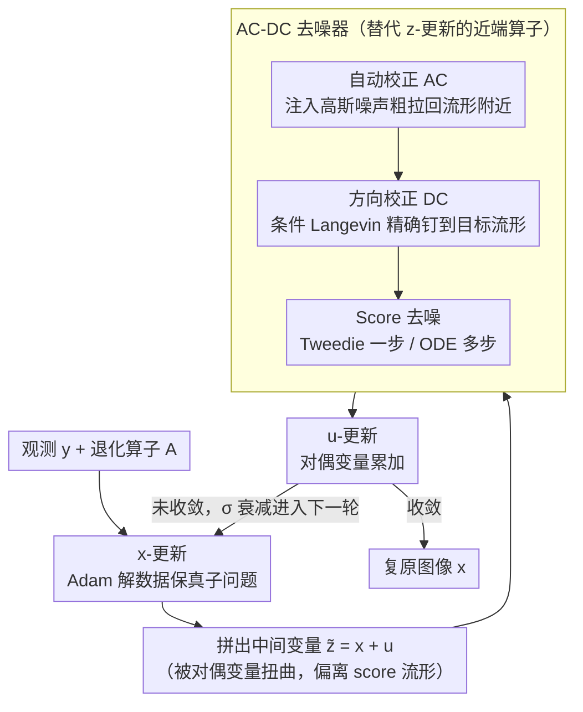

# Taming Score-Based Denoisers in ADMM: A Convergent Plug-and-Play Framework

**会议**: CVPR 2026  
**arXiv**: [2603.10281](https://arxiv.org/abs/2603.10281)  
**代码**: 有（随supplementary提供）  
**领域**: 图像生成  
**关键词**: 即插即用, ADMM, 扩散模型, Score-based Denoiser, 逆问题求解

## 一句话总结

提出 AC-DC 三阶段去噪器（自动校正 + 方向校正 + Score 去噪），解决 ADMM 迭代与 score 训练流形不匹配的问题，并首次为 ADMM-PnP + score denoiser 建立了收敛性保证，在多种逆问题上取得 SOTA。

## 研究背景与动机

### 1. 领域现状

逆问题（去模糊、超分、修复、相位恢复等）广泛使用 Plug-and-Play（PnP）范式：将预训练去噪器直接嵌入到 ADMM / HQS 等优化算法中替代正则化项的近端算子。近年来，基于扩散模型的 score function 因其强大的分布建模能力，成为 PnP 去噪器的热门选择。

### 2. 痛点

- **流形不匹配**：Score function 是在高斯扰动产生的噪声数据流形 $\mathcal{M}_{\sigma(t)}$ 上训练的，但 ADMM 迭代产生的中间变量 $\tilde{\bm{z}}^{(k)} = \bm{x}^{(k+1)} + \bm{u}^{(k)}$ 并不在这些流形上。尤其 ADMM 的对偶变量 $\bm{u}^{(k)}$ 进一步扭曲了噪声几何结构。
- **缺乏收敛性理论**：已有的 score-based PnP 方法大多针对 primal 算法（如梯度下降），primal-dual 方法（如 ADMM）与 score denoiser 结合后的收敛性完全未知。

### 3. 核心矛盾

ADMM 的灵活性（可处理多正则化项和约束）使其在逆问题中极具吸引力，但对偶变量的存在让 score denoiser 的输入偏离训练流形更远——已有的简单加噪（purification）策略无法保证对齐。

### 4. 要解决什么

（1）设计一种能将 ADMM 迭代拉回 score 训练流形的去噪器；（2）为该 ADMM-PnP 框架提供严格的收敛性保证。

### 5. 切入角度

从 Langevin dynamics 条件采样出发：先加噪做粗校正，再用条件 Langevin 做精校正，使输入落入 $\mathcal{M}_{\sigma^{(k)}}$，最后再施加 Tweedie 去噪。

### 6. 核心 idea

三阶段 AC-DC 去噪器 = Auto-Correction（加噪拉近流形）+ Directional Correction（条件 Langevin 精确对齐）+ Score Denoising（Tweedie/ODE 去噪）。

## 方法详解

### 整体框架

这篇论文要解决的核心问题是：把扩散模型的 score function 当作去噪器塞进 ADMM 求解逆问题时，去噪器的输入根本不在它训练过的流形上，结果既不收敛、效果也差。论文把逆问题写成 ADMM 的变量分裂形式

$$\min_{\bm{x},\bm{z}} \ell(\bm{y} \| \mathcal{A}(\bm{x})) + \gamma h(\bm{z}) \quad \text{s.t.} \quad \bm{x} = \bm{z}$$

然后沿用标准的三步交替迭代：**x-更新**解带数据保真项的子问题（用 Adam 做梯度下降，最多 1000 步、loss 连升 3 次早停），**z-更新**是去噪子问题，**u-更新**做对偶变量累加 $\bm{u}^{(k+1)} = \bm{u}^{(k)} + (\bm{x}^{(k+1)} - \bm{z}^{(k+1)})$。整个框架的创新全部压在 z-更新：原本该调用近端算子的地方，换成一个叫 AC-DC 的三阶段去噪器。它接收 ADMM 拼出来的中间变量 $\tilde{\bm{z}}^{(k)} = \bm{x}^{(k+1)} + \bm{u}^{(k)}$——这个量被对偶变量 $\bm{u}^{(k)}$ 扭曲过，噪声几何早已偏离 score 的训练流形 $\mathcal{M}_{\sigma(t)}$——先把它粗略拉近流形（AC），再精确对齐（DC），最后才真正去噪（Score Denoising）。三步逐级收紧，是后面收敛性证明能成立的关键。

### 关键设计

**1. Auto-Correction（AC）：先用高斯噪声把走样的输入"洗"回流形附近**

ADMM 迭代出来的 $\tilde{\bm{z}}^{(k)}$ 带着一种分布未知、还被对偶变量进一步扭曲的噪声，没法直接喂给只认高斯扰动的 score function。AC 的做法很直接，往里再注入一层已知方差的高斯噪声 $\bm{z}_{\text{ac}}^{(k)} = \tilde{\bm{z}}^{(k)} + \sigma^{(k)} \bm{n}$（$\bm{n} \sim \mathcal{N}(\bm{0}, \bm{I})$）：当注入的高斯噪声足够强，原本那点未知的结构性扰动会被"淹没"，整体分布就向某个 $\mathcal{M}_{\sigma(t)}$ 靠拢。这一步只是粗对齐——它能把输入推到流形附近，但保证不了真正落在流形上，所以后面必须接 DC 补位。

**2. Directional Correction（DC）：用条件 Langevin 把输入精确钉到目标流形上**

AC 之后还差最后一段距离，DC 从 $\bm{z}_{\text{ac}}^{(k)}$ 出发跑 $J$ 步条件 Langevin dynamics，采样目标是条件分布 $p(\bm{z}_{\sigma^{(k)}} | \bm{z}_{\text{ac}}^{(k)})$。这个分布的支撑集恰好 $\subseteq \mathcal{M}_{\sigma^{(k)}}$，所以只要采样收敛，结果天然就躺在 score 的训练流形上——这正是 AC 给不了的"精确落点"。条件 score 被拆成无条件 score $\bm{s}_\theta$ 加一项近似高斯似然梯度，使得每步更新既往流形拉、又不丢掉 AC 注入的观测信息：

$$\bm{w}^{(k,j+1)} = \bm{w}^{(k,j)} + \eta^{(k)}\left(\frac{1}{\sigma_{\bm{s}^{(k)}}^2}(\bm{z}_{\text{ac}}^{(k)} - \bm{w}^{(k,j)}) + \bm{s}_\theta(\bm{w}^{(k,j)}, \sigma^{(k)})\right) + \sqrt{2\eta^{(k)}}\bm{n}$$

消融里把 $J$ 调到 0（关掉 DC）会出现严重伪影、$J$ 递增图像逐步变干净，说明这一步才是真正弥合流形不匹配的关键，而非可有可无的微调。

**3. Score-based Denoising：输入已经对齐了，这一步 score 才能发挥全力**

经过 AC+DC，喂进来的 $\bm{z}_{\text{dc}}^{(k)}$ 已经落在 $\mathcal{M}_{\sigma^{(k)}}$ 上，此刻 score function 处在它最熟悉的工作点，去噪效果才最干净。论文给两种变体：Tweedie 公式一步到位 $\bm{z}_{\text{tw}}^{(k)} = \bm{z}_{\text{dc}}^{(k)} + (\sigma^{(k)})^2 \bm{s}_\theta(\bm{z}_{\text{dc}}^{(k)}, \sigma^{(k)})$，快但偏像素级指标；或者用 ODE 求解器从 $\sigma^{(k)}$ 积分到 0，慢、多步、感知质量更好。前两步保证"输入对"，这一步负责"出图好"，分工清楚。

### 损失函数 / 训练策略

- **无需训练**：直接使用预训练的 score model（来自 Chung et al., 2023 的扩散模型）
- **噪声调度**：$\sigma^{(k)}$ 线性衰减 $[10 \to 0.1]$，窗口 $W$ 步；DC 步数 $J=10$；Langevin 步长 $\eta^{(k)} = 5 \times 10^{-4} \sigma^{(k)}$
- **x-子问题**：Adam 优化器，最多 1000 步，loss 连续上升 3 次则早停

## 实验关键数据

### 主实验

在 FFHQ 256×256 和 ImageNet 256×256 上测试，每个任务随机采样 100 张图像。

**表 1：FFHQ 数据集上各任务性能对比**

| 任务 | 方法 | PSNR↑ | SSIM↑ | LPIPS↓ |
|------|------|-------|-------|--------|
| 超分辨率(4×) | **Ours-tweedie** | **30.44** | **0.857** | 0.178 |
| | Ours-ode | 29.99 | 0.845 | **0.156** |
| | DAPS | 29.53 | 0.814 | 0.167 |
| | DPS | 24.83 | 0.705 | 0.257 |
| 随机修复 | **Ours-tweedie** | **32.84** | **0.906** | 0.122 |
| | Ours-ode | 32.13 | 0.894 | **0.095** |
| | DAPS | 31.65 | 0.847 | 0.124 |
| 运动去模糊 | **Ours-tweedie** | **30.00** | **0.854** | 0.179 |
| | Ours-ode | 29.65 | 0.841 | **0.154** |
| | DAPS | 29.05 | 0.815 | 0.175 |
| 相位恢复 | **Ours-tweedie** | **27.94** | **0.793** | 0.209 |
| | Ours-ode | 27.10 | 0.757 | 0.237 |
| | DAPS | 26.71 | 0.749 | 0.230 |

**表 2：ImageNet 数据集上各任务性能对比**

| 任务 | 方法 | PSNR↑ | SSIM↑ | LPIPS↓ |
|------|------|-------|-------|--------|
| 超分辨率(4×) | **Ours-tweedie** | **27.32** | **0.717** | 0.280 |
| | DAPS | 26.65 | 0.680 | **0.266** |
| 随机修复 | **Ours-tweedie** | **29.56** | **0.817** | 0.184 |
| | Ours-ode | 28.73 | 0.795 | **0.148** |
| 高斯去模糊 | **Ours-tweedie** | **27.20** | **0.705** | 0.281 |
| | Ours-ode | 26.90 | 0.690 | 0.282 |
| | DAPS | 26.89 | 0.678 | **0.260** |

### 消融实验

**DC 步数 $J$ 的影响**（相位恢复任务）：

- $J=0$（关闭 DC）：恢复图像存在严重伪影
- $J$ 递增：图像逐步变干净
- 说明 DC 阶段是弥合流形不匹配的关键组件

### 关键发现

1. **Ours-tweedie 在 PSNR/SSIM 上稳定最优**：在几乎所有任务上 PSNR 和 SSIM 都是第一；Ours-ode 在感知指标 LPIPS 上往往最优
2. **大幅领先 PnP 基线**：相比 DiffPIR、RED-diff 等同类 PnP 方法，PSNR 提升 2-10 dB
3. **对困难任务效果显著**：在相位恢复这种高度非凸的任务上，Ours-tweedie 比 DPS 高出 16+ dB (FFHQ)
4. **两种变体互补**：Tweedie 变体更快且像素级指标好，ODE 变体感知质量更好

## 亮点与洞察

1. **问题定义精准**：明确指出 ADMM 对偶变量导致流形不匹配加剧这一被忽视的问题，这是 score-based denoiser 很少与 primal-dual 方法结合的根本原因
2. **AC-DC 三阶段设计优雅**：粗校正（AC）→ 精校正（DC）→ 去噪，逻辑递进清晰，每一步有明确的几何直觉
3. **理论贡献扎实**：
    - Theorem 1：弱非扩张条件下，常步长收敛到 $\delta$-ball
    - Theorem 2：证明 AC-DC 去噪器满足弱非扩张性
    - Theorem 3：去掉强凸假设，自适应步长也收敛
4. **通用性强**：AC-DC 去噪器不仅限于 ADMM，可嵌入任何基于近端算子的优化框架

## 局限与展望

1. **计算开销大**：每次 ADMM 迭代需要多次 score 评估（AC 1次 + DC $J$次 + Tweedie/ODE），NFE 较高
2. **噪声调度依赖经验**：$\sigma^{(k)}$、$\sigma_{\bm{s}^{(k)}}$ 的调度策略是人工设定的线性衰减，缺乏自适应机制
3. **常步长非凸收敛未证明**：实验表明常步长在非凸目标上也能工作，但理论只证了自适应步长的情况
4. **固定点收敛较弱**：仅保证收敛到固定点（非稳定点），尚无法保证解的质量
5. **DC 假设理想化**：理论中假设 DC 达到平稳分布，实际只跑有限步

## 相关工作与启发

- **DiffPIR (Zhu et al., 2023)**：同为 PnP+score 框架，但用 HQS 而非 ADMM，且仅通过加噪矫正流形（相当于只有 AC 没有 DC），效果差距明显
- **SNORE (Renaud et al., 2024)**：构造显式正则化项使梯度对应 score，走梯度下降路线，理论上更清晰但灵活性不如 ADMM
- **DAPS (Zhang et al., 2024)**：后验采样方法，在 LPIPS 上有时与本文接近，但 PSNR/SSIM 系统性落后
- **Ryu et al. (2019)**：经典 ADMM-PnP 收敛性分析，要求去噪器残差严格收缩；本文放松为"弱非扩张+$\delta$-球收敛"
- **启发**：条件 Langevin dynamics 做流形对齐的思路可推广到其他需要 score 评估的场景（如条件生成、编辑）

## 评分

⭐⭐⭐⭐ 理论与实验俱佳的扎实工作。AC-DC 三阶段去噪器设计精巧、几何直觉清晰，收敛性分析是对 PnP 理论的实质性推进；实验全面覆盖 7 类逆问题且一致优于基线。主要遗憾是计算开销大且噪声调度缺乏自适应策略。

<!-- RELATED:START -->

## 相关论文

- [\[CVPR 2026\] Smoothing the Score Function for Generalization in Diffusion Models: An Optimization-based Explanation Framework](smoothing_the_score_function_for_generalization_in_diffusion_models.md)
- [\[CVPR 2026\] Taming Preference Mode Collapse via Directional Decoupling Alignment in Diffusion Reinforcement Learning](taming_preference_mode_collapse_via_directional_decoupling_alignment_in_diffusio.md)
- [\[CVPR 2026\] Reviving ConvNeXt for Efficient Convolutional Diffusion Models](reviving_convnext_for_efficient_convolutional_diffusion_models.md)
- [\[CVPR 2026\] Pose-dIVE: Pose-Diversified Augmentation with Diffusion Model for Person Re-Identification](pose-dive_pose-diversified_augmentation_with_diffusion_model_for_person_re-ident.md)
- [\[CVPR 2026\] Diffusion Probe: Generated Image Result Prediction Using CNN Probes](diffusion_probe_generated_image_result_prediction_using_cnn_probes.md)

<!-- RELATED:END -->
