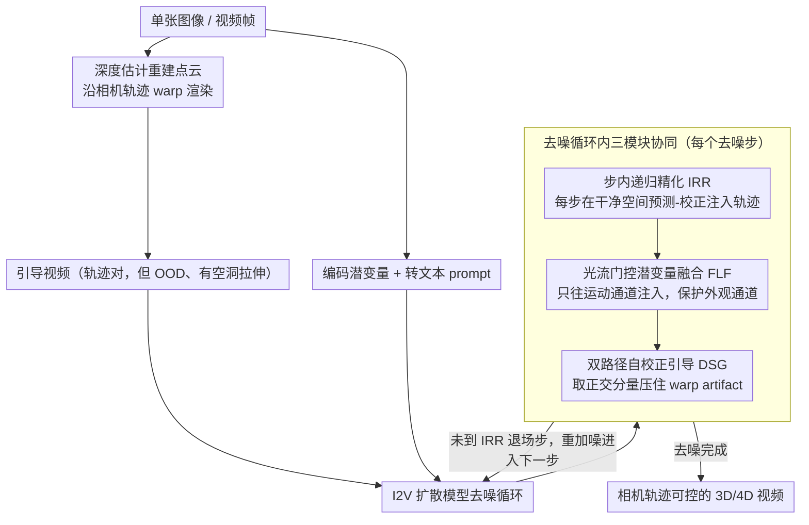

# Taming Video Models for 3D and 4D Generation via Zero-Shot Camera Control

**会议**: CVPR 2026  
**arXiv**: [2509.15130](https://arxiv.org/abs/2509.15130)  
**代码**: [https://worldforge-agi.github.io](https://worldforge-agi.github.io) (项目页)  
**领域**: 扩散模型 / 3D视觉  
**关键词**: 视频扩散模型, 3D生成, 4D生成, 相机控制, 无训练推理

## 一句话总结
WorldForge 提出一个完全无训练的推理时引导框架，通过三个协同组件——步内递归精化（IRR）、光流门控潜变量融合（FLF）和双路径自校正引导（DSG）——将预训练视频扩散模型改造为精确相机轨迹可控的 3D/4D 生成工具，在轨迹精度和感知质量上同时超越训练式和推理式基线。

## 研究背景与动机

1. **领域现状**：视频扩散模型（VDM）在海量视频数据上训练，编码了丰富的时空先验，能生成逼真的视觉内容。研究者开始利用 VDM 做 3D/4D 任务（新视角合成、场景生成、动态重渲染等）。

2. **现有痛点**：
    - **可控性差**：VDM 难以精确遵循 6-DoF 相机轨迹，导致空间不一致
    - **场景-相机运动耦合**：改变视角时会引起不期望的物体变形和场景不稳定
    - **微调方案代价高**：在运动条件数据上微调（如 LoRA、ControlNet）计算昂贵、泛化差、可能破坏预训练先验
    - **Warp-and-repaint 方案不鲁棒**：将帧按新相机路径投影后用生成模型修补——但扭曲的输入是分布外（OOD）的，预训练模型处理不好，产生 artifact

3. **核心矛盾**：精细的相机可控性与生成质量/泛化性之间存在根本矛盾——注入控制信号会破坏模型先验，而保留先验则无法精确控制。

4. **本文目标** 在推理时注入精确的轨迹控制，同时完整保留 VDM 的世界先验，且不需要任何训练或微调。

5. **切入角度**：采用 warp-and-repaint 流程获取轨迹引导帧，但通过三个精心设计的推理时干预机制解决其固有的 OOD 问题。核心观察：VAE 潜变量的不同通道编码了不同信息（运动 vs 外观），可以选择性注入控制信号。

6. **核心 idea**：通过选择性地在运动相关通道注入轨迹信号、在每个去噪步进行微校正、并利用引导与非引导路径的差异进行自校正，实现无训练的精确相机控制。

## 方法详解

### 整体框架
WorldForge 要解决的事情其实很拧巴：让一个只会"自由生成"的预训练视频扩散模型精确听从用户给的相机轨迹，却又不破坏它原本编码的世界先验，而且全程不训练、不微调。整条 pipeline 是这样转的：先从单张图像（或视频帧）用深度估计重建出场景点云，沿用户指定的相机轨迹把点云 warp 渲染成一段"引导视频"——这段视频轨迹是对的，但 warp 会留下空洞、拉伸和遮挡错误，所以它本身是分布外（OOD）的、画质很差。接着把原图编码成潜变量、再转成文本 prompt，一起送进 Image-to-Video 扩散模型去噪。真正的关键全在去噪循环内部：IRR 负责在每一步把轨迹信息反复"打"进生成结果，FLF 决定只往哪些潜通道打、把外观通道保护起来，DSG 则在打的同时压住 warp 带来的 artifact。三个模块叠在同一个去噪过程里协同，最后输出一段既贴轨迹、画质又干净的视频。

### 关键设计

**1. 步内递归精化（IRR）：把轨迹信息在每个去噪步里反复"预测—校正"，而不是一次性灌进去**

如果只在采样开头把轨迹潜变量塞一次，它会随着后续几十步去噪被噪声慢慢冲淡，到最后轨迹控制力所剩无几。IRR 的办法是在每个去噪步 $t$ 内部嵌一个微型的"predict-correct"循环：模型先正常去噪得到当前对干净图的估计 $\hat{\mathbf{x}}_0^{(t)}$，再用一个融合算子 $\mathbf{F}$ 把轨迹潜变量 $\mathbf{x}_{traj}$（warp 帧编码到潜空间的结果）按掩码覆盖进可观测区域：

$$\mathbf{F}(\hat{\mathbf{x}}_0^{(t)}, \mathbf{x}_{traj}) = \mathbf{M} \cdot \mathbf{x}_{traj} + (1-\mathbf{M}) \cdot \hat{\mathbf{x}}_0^{(t)}$$

其中 $\mathbf{M}$ 是 warp 给出的有效像素掩码。融合后重新加噪、进入下一步。这里有个容易被忽略却很要紧的选择：融合是在干净空间 $\hat{\mathbf{x}}_0^{(t)}$ 上做的，而不是像以往 inpainting 工作那样在噪声空间 $\mathbf{x}_{t-1}$ 上做——干净空间语义清晰、光流可算，这恰好给后面 FLF 模块的通道筛选铺好了路。因为每一步都重新注入一次，轨迹信号在整个采样过程里持续生效，不会中途被噪声稀释。

**2. 光流门控潜变量融合（FLF）：只往"管运动"的潜通道注入轨迹，别碰"管外观"的通道**

IRR 若无差别覆写所有通道，画质会被 warp 帧的噪声严重拖垮。FLF 的洞察是 VAE 潜空间里通道分工不同——有的通道主要编码运动，有的主要编码外观，只有前者该被轨迹信号改写。具体做法是对 $\hat{\mathbf{x}}_0^{(t)}$ 的每个通道 $c$ 算帧间光流 $\mathcal{F}_{pred}^{(t,c)}$，对轨迹潜变量 $\mathbf{x}_{traj}$ 算参考光流 $\mathcal{F}_{gt}^{(t,c)}$，两者用 M-EPE、M-AE、Fl-all 三种光流指标比对，得到该通道的运动相似度分数 $S^{(t,c)}$。再用一个随步数变化的动态阈值来筛：

$$\delta^{(t)} = \mu_S^{(t)} - \lambda^{(t)}\sigma_S^{(t)}$$

分数高于阈值的通道判为"运动相关"、注入轨迹，低于的保留模型自己的预测。$\lambda^{(t)}$ 从松到紧调度：早期放过更多通道、先把结构建起来，后期收紧、多保护外观通道保细节。作者实测通道分工相当稳定——通道 13 几乎总因低运动相关被过滤掉，通道 8 几乎总因高运动相关被保留，这正说明"一刀切覆写所有通道"是错的。

**3. 双路径自校正引导（DSG）：用引导方向在非引导方向上的正交分量做校正，压住 warp artifact**

warp 帧自带深度误差、遮挡和对齐不良，直接顺着它去噪会把这些 artifact 一并生成出来。DSG 借了 CFG 的形式，但解决的是另一个问题：每步同时跑两条路径——非引导路径 $\mathbf{v}_t^{ori}$ 从原始 $\mathbf{x}_t$ 去噪，画质高但不受轨迹约束；引导路径 $\mathbf{v}_t^{traj}$ 从校正后的 $\mathbf{x}_t'$ 去噪，听轨迹但带噪。关键观察是这两条路径的余弦相似度只有 0.3–0.6（夹角 50°–70°），比 CFG 里条件/无条件路径接近 1 的相似度发散得多——所以 CFG 那套"两个方向直接相减再放大"的公式在这里会灾难性失败。DSG 改成取引导方向在非引导方向上的正交分量来校正：

$$\mathbf{v}_t^{corr} = \mathbf{v}_t^{traj} + \rho \cdot \beta_t(\mathbf{v}_t^{traj} - \alpha_t \cdot \mathbf{v}_t^{ori})$$

其中 $\beta_t = \sqrt{1-\alpha_t^2}$ 起自适应缩放：两条路径分歧大时强力校正，趋于一致时就放手让模型保留自然预测。正交投影的好处是绕开了大夹角下直接相减的发散——消融里把 DSG 换成直接套 CFG 公式的版本（FID 120.91）反而比完整模型（96.08）差得多，正好印证了这个分析。

### 一个完整示例：一个去噪步内部发生了什么
拿 50 步采样里靠前的第 10 步举例（IRR 工作区间在前 20 步内）。这一步开始时手上是带噪潜变量 $\mathbf{x}_{10}$。① 模型先正常去噪，预测出当前的干净估计 $\hat{\mathbf{x}}_0^{(10)}$。② FLF 上场，逐通道算光流相似度：比如通道 8 分数高、判为运动通道要注入轨迹，通道 13 分数低、判为外观通道予以保留；此时还在早期、阈值 $\lambda$ 偏松，放过的通道更多，好让结构先成形。③ IRR 用掩码 $\mathbf{M}$ 把轨迹潜变量 $\mathbf{x}_{traj}$ 只覆盖到被选中的运动通道的可观测区域，得到校正后的 $\mathbf{x}_{10}'$。④ DSG 同时从 $\mathbf{x}_{10}$ 和 $\mathbf{x}_{10}'$ 各去噪一次，发现两条路径夹角约 60°——太大不能直接相减，于是取正交分量算出 $\mathbf{v}_{10}^{corr}$。⑤ 用这个校正后的方向重新加噪，得到 $\mathbf{x}_9$ 进入下一步。如此循环到第 20 步后 IRR 退场，剩下的步数让模型自由收尾、把画质打磨干净。

### 推理细节
使用 Wan2.1 I2V-14B 模型，50 步 UniPC 采样，IRR 在前 20 步（约 35-45%）应用。FLF 早期（前 5 步）禁用以保留结构完整性，后期逐步收紧筛选。单 GPU（≥69GB VRAM）运行，可生成最高 1280×720 视频。

## 实验关键数据

### 主实验（3D 静态场景生成）

| 方法 | 训练免 | FID ↓ | CLIP_sim ↑ | ATE ↓ | RPE-T ↓ | RPE-R ↓ |
|------|-------|------|-----------|------|---------|---------|
| ViewCrafter | ✗ | 117.50 | 0.930 | 0.236 | 0.315 | 0.728 |
| TrajectoryCrafter | ✗ | 111.49 | 0.910 | 0.090 | 0.152 | 0.267 |
| NVS-Solver | ✓ | 118.64 | 0.937 | 0.224 | 0.268 | 1.056 |
| See3D | ✗ | 123.26 | 0.941 | 0.091 | 0.089 | 0.250 |
| **WorldForge** | **✓** | **96.08** | **0.948** | **0.077** | **0.086** | **0.221** |

### 4D 动态场景控制

| 方法 | 训练免 | FVD ↓ | CLIP-V_sim ↑ | ATE ↓ | RPE-T ↓ |
|------|-------|------|-------------|------|---------|
| ViewExtrapolator | ✓ | 108.48 | 0.913 | 1.040 | 1.208 |
| TrajectoryCrafter | ✗ | 97.31 | 0.923 | 0.431 | 1.078 |
| **WorldForge** | **✓** | **93.17** | **0.938** | 0.527 | **0.826** |

### 消融实验

| 配置 | FID ↓ (3D) | CLIP_sim ↑ (3D) | FVD ↓ (4D) | CLIP-V_sim ↑ (4D) |
|------|-----------|----------------|-----------|-------------------|
| w/o DSG | 109.43 | 0.943 | 95.69 | 0.937 |
| w/o FLF | 112.69 | 0.945 | 99.79 | 0.932 |
| w/o DSG & FLF | 113.12 | 0.943 | 103.17 | 0.931 |
| DSG (用 CFG 公式) | 120.91 | 0.936 | 109.10 | 0.919 |
| **完整模型** | **96.08** | **0.948** | **93.17** | **0.938** |

### 关键发现
- 作为无训练方法，WorldForge 在生成质量和轨迹精度上同时超越所有训练式基线（FID 96.08 vs 第二名 111.49）
- 三个组件缺一不可——去掉 IRR 完全丧失轨迹控制；去掉 FLF 产生不自然输出（FID 从 96.08 升至 112.69）；去掉 DSG 引入 warp artifact（FID 升至 109.43）
- 直接使用 CFG 公式做 DSG 效果最差（FID 120.91），验证了大角度发散下 CFG 失效的分析
- 方法可跨模型迁移——在 SVD 和 LongCat-Video 上均有效
- 通道角色稳定：通道 13 几乎总是低运动相关被过滤，通道 8 总是高运动相关被保留，4D 场景比 3D 场景表现出更多样化的通道分数

## 亮点与洞察
- **选择性通道注入的精妙设计**：核心洞察——VAE 潜空间的不同通道编码不同信息。FLF 用光流作为运动通道的直接度量（而非 PCA 等统计方法），在不需要梯度优化的情况下实现了运动-外观解耦
- **正交投影解决大角度 CFG 问题**：标准 CFG 假设条件和无条件方向接近（角度~0°），本文场景中两条路径角度 50-70°，直接相减会灾难性失败。取正交分量的思路借鉴自 APG 但在完全不同的任务中验证了有效性
- **无训练即插即用的通用性**：一个框架支持 3D 场景生成、4D 重渲染、视频编辑、视频稳定、虚拟试穿等 12+ 种应用，model-agnostic（Wan2.1、SVD、LongCat-Video 均适用）

## 局限与展望
- 迭代引导过程导致无法实时运行
- 依赖深度估计质量——虽然 VDM 先验能缓解部分深度误差，但极端深度错误仍会影响结果
- 单通道扫描分析 VDM 上下文较长时可能增加计算开销
- 未来方向：蒸馏引导过程到更少步数、结合更强生成模型、提升分辨率

## 相关工作与启发
- **vs ViewCrafter/See3D（训练式）**: 在 warp+微调数据上训练，计算成本高且可能破坏 VDM 先验；WorldForge 完全保留先验且泛化更好
- **vs NVS-Solver（无训练式）**: 同为推理时引导但缺少运动-外观解耦和自校正，轨迹精度差（ATE 0.224 vs 0.077）
- **vs ReCamMaster（训练式 4D）**: 使用 T2V 模型+专门训练的相机控制模块，但无法接受相同的 warp 输入，可控性和泛化性受限

## 评分
- 新颖性: ⭐⭐⭐⭐⭐ 三个推理时引导组件的设计原创性强，FLF 和 DSG 的设计理由充分且新颖
- 实验充分度: ⭐⭐⭐⭐⭐ 70+ 场景、50+ 视频、3D/4D 双任务、跨模型验证、完整消融
- 写作质量: ⭐⭐⭐⭐ 框架描述清晰，但三个组件的符号较多，阅读有一定门槛
- 价值: ⭐⭐⭐⭐⭐ 无训练即插即用的通用性使其有极高的实用价值，12+ 种应用展示令人印象深刻

<!-- RELATED:START -->

## 相关论文

- [\[CVPR 2025\] PreciseCam: Precise Camera Control for Text-to-Image Generation](../../CVPR2025/image_generation/precisecam_precise_camera_control_for_text-to-image_generation.md)
- [\[CVPR 2026\] DiP: Taming Diffusion Models in Pixel Space](dip_taming_diffusion_models_in_pixel_space.md)
- [\[CVPR 2026\] Adapter Shield: A Unified Framework with Built-in Authentication for Preventing Unauthorized Zero-Shot Image-to-Image Generation](adapter_shield_a_unified_framework_with_built-in_authentication_for_preventing_u.md)
- [\[CVPR 2026\] SeeThrough3D: Occlusion Aware 3D Control in Text-to-Image Generation](seethrough3d_occlusion_aware_3d_control_in_text-to-image_generation.md)
- [\[ICCV 2025\] AnyPortal: Zero-Shot Consistent Video Background Replacement](../../ICCV2025/image_generation/anyportal_zero-shot_consistent_video_background_replacement.md)

<!-- RELATED:END -->
