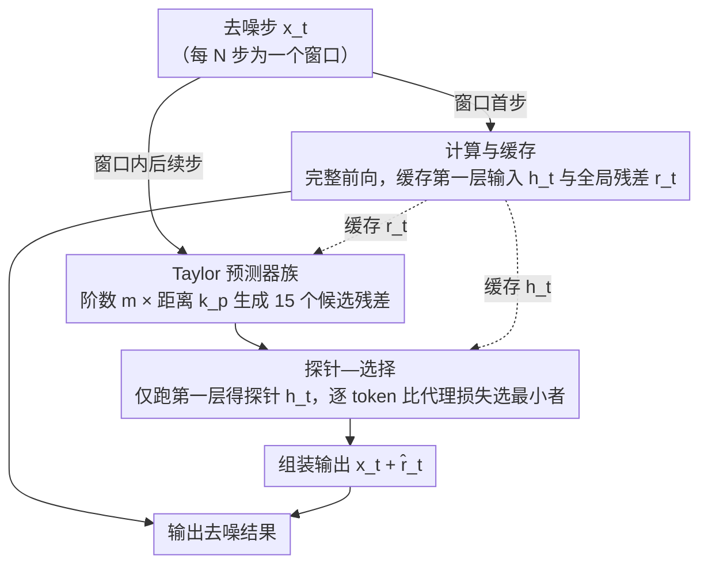

# TAP: A Token-Adaptive Predictor Framework for Training-Free Diffusion Acceleration

## 基本信息

- **会议**: CVPR 2026
- **arXiv**: [2603.03792](https://arxiv.org/abs/2603.03792)
- **代码**: 未公开
- **领域**: 图像生成 / 扩散模型加速
- **关键词**: Diffusion Acceleration, Token-Adaptive, Training-Free, Feature Caching, Taylor Predictor

## 一句话总结

提出 TAP 框架，通过第一层探针（probe）为每个 token 在每一步自适应选择最优预测器（Taylor 展开族），实现无需训练的扩散模型加速，在 FLUX.1-dev 上以 6.24× 加速且无感知质量损失。

## 研究背景与动机

扩散模型（Diffusion Models）在图像和视频生成中取得了顶尖效果，但推理速度慢是其核心瓶颈——每个去噪步骤都需要完整的前向传播。现有加速方法主要分两类：

**减少采样步数**：DDIM、DPM-Solver 等高阶 ODE 求解器可减少步数，但极端加速时质量下降明显。

**减少每步计算量**：特征缓存（DeepCache、Δ-DiT、TeaCache、ToCa）利用时间冗余复用中间特征；预测方法（TaylorSeer、FreqCa、SpeCa）对未来特征进行预测。

**现有方法的关键局限**：所有先前方法对所有 token 和所有时间步施加**同一个全局预测策略**，忽略了一个重要事实——不同 token 的时序演化特性差异巨大：

- **平滑背景 token**：变化缓慢，低阶预测器即可胜任
- **边缘/运动物体 token**：变化剧烈，需要高阶或替代预测器
- 全局单一预测器在激进加速比下会导致误差累积和严重质量退化

此外，现有自适应方法（TeaCache、SpeCa）依赖**手动调节的阈值**，缺乏鲁棒性。

## 方法详解

### 整体框架

TAP 针对的是扩散加速里一个被忽视的事实：不同 token 的时序演化差异巨大——平滑背景变化慢、低阶预测器就够，边缘和运动物体变化剧烈、需要高阶或别的预测器，而现有方法对所有 token、所有时间步硬套同一个全局预测策略，激进加速下误差累积、质量崩坏。TAP 的思路是在每一步给每个 token 单独挑最合适的预测器：每 $N$ 步窗口的第一步算一次完整模型并缓存关键量，之后的步用一族 Taylor 预测器外推，再用“第一层探针”为每个 token 选出代理误差最小的那个预测器组装输出。

### 关键设计

**1. 计算与缓存：只存第一层输入和全局残差，$O(1)$ 开销**

要让“跳步预测”省钱，缓存本身不能太重。TAP 在每 $N$ 步窗口的第一步执行完整前向，只缓存两个量：第一层调制后的输入 $\mathbf{h}_t = \text{Modulate}(\text{Norm}_1(\mathbf{x}_t), \mathbf{s}_t, \mathbf{g}_t)$（供后续探针评估）和模型输入输出残差 $\mathbf{r}_t = f_\theta(\mathbf{x}_t, t) - \mathbf{x}_t$（供预测）。两者都是 $O(1)$、与模型深度 $L$ 无关，而 TaylorSeer/ToCa 需要 $O(L)$ 的逐层缓存——这也是 TAP 在 FLUX.1-dev 上只多占 0.1 GB 显存（约 0.3%）、额外 FLOPs 仅 0.015% 的原因。

**2. Taylor 预测器族：用阶数和距离两个维度造一组候选**

单一预测器无法同时照顾平滑和突变的 token，所以 TAP 准备一族候选，从两个维度变化出多样性：Taylor 展开阶数 $m \in [O_l, O_r]$（低阶对突变更鲁棒、高阶对平滑更精确），以及预测距离 $k_p \in [k - \lambda, k]$（不同 token 收敛半径不同，超出半径的高阶展开会发散）。预测公式为
$$\mathcal{F}_{\text{pred}}(\mathbf{x}_{t-k}; m, k_p) = \sum_{i=0}^{m} \frac{\Delta^i \mathcal{F}(\mathbf{x}_t)}{i! \cdot N^i} (-k_p)^i$$
其中 $\Delta^i \mathcal{F}$ 是 $i$ 阶有限差分。默认 $M=3$（阶数 0,1,2）、$\lambda=4$、$\delta=1$，共生成 $\lfloor(4+1)/1\rfloor \times 3 = 15$ 个候选。其中零阶预测器尤其关键，因为它对突变、不连续的 token 动态最稳。

**3. 探针—选择：用第一层输出当代理，免阈值挑预测器**

怎么在不跑完整模型的情况下判断哪个预测器最好？TAP 的答案是：当前步只跑一次第一层完整计算（成本极低），用第一层调制输入 $\mathbf{h}_t$ 作为预测质量的代理——输入扰动和输出误差高度相关。对每个 token $(b,n)$ 算每个预测器的代理损失 $\mathcal{L}_p^{b,n} = d(\widehat{\mathbf{h}}_{t,p}^{b,n}, \mathbf{h}_t^{b,n})$（$d$ 用余弦距离），取最小者 $p^{\star, b, n} = \arg\min_{p \in \mathcal{P}} \mathcal{L}_p^{b,n}$，再用它的残差预测组装最终输出 $\widehat{f}_\theta(\mathbf{x}_t, t) = \mathbf{x}_t + \widehat{\mathbf{r}}_t$。整个选择只比较不同预测器的相对误差，不需要任何手工阈值，这正是它比 TeaCache、SpeCa 等靠手调阈值的自适应方法更鲁棒的地方。候选集也不限于 Taylor，可换成 FoCa、FreqCa 等其他预测器。

## 实验

### 主实验：文本到图像生成（FLUX.1-dev）

| 方法 | FLOPs 加速 | ImageReward ↑ | CLIP ↑ | PSNR ↑ | SSIM ↑ | LPIPS ↓ |
|------|-----------|---------------|--------|--------|--------|---------|
| 50 steps (baseline) | 1.00× | 0.95 | 30.63 | - | - | - |
| FORA (N=7) | 6.24× | 0.80 | 30.42 | 13.43 | 0.60 | 0.55 |
| TeaCache (l=2.0) | 6.17× | 0.66 | 30.07 | 14.23 | 0.60 | 0.58 |
| TaylorSeer (N=8,O=2) | 6.24× | 0.91 | 30.62 | 14.72 | 0.61 | 0.50 |
| **TAP (N=8)** | **6.24×** | **0.99** | **31.19** | **16.11** | **0.64** | **0.44** |

在高加速比（6.24×）下，TAP 的 ImageReward 达到 0.99，**超过了未加速的 baseline（0.95）**，同时 PSNR 比 TaylorSeer 高约 1.4 dB。TeaCache 在此加速比下已经严重退化（ImageReward 仅 0.66）。

### 主实验：Qwen-Image 文生图

| 方法 | FLOPs 加速 | ImageReward ↑ | CLIP ↑ | PSNR ↑ | LPIPS ↓ |
|------|-----------|---------------|--------|--------|---------|
| 50 steps (baseline) | 1.00× | 1.23 | 33.74 | - | - |
| FORA (N=3) | 2.94× | 0.92 | 32.25 | 14.12 | 0.50 |
| TeaCache (l=0.8) | 3.57× | 1.18 | 33.52 | 19.07 | 0.27 |
| TaylorSeer (N=4,O=2) | 3.57× | 1.18 | 33.44 | 18.02 | 0.30 |
| **TAP (N=4)** | **3.57×** | **1.23** | **33.80** | **20.13** | **0.22** |

在 Qwen-Image 上 TAP 同样保持了与 baseline 一致的 ImageReward（1.23），PSNR 提升约 2 dB。

### 视频生成实验（HunyuanVideo + VBench）

| 方法 | FLOPs 加速 | VBench (%) ↑ |
|------|-----------|-------------|
| 50 steps | 1.00× | 66.61 |
| FORA (N=5) | 4.98× | 63.87 |
| TeaCache (l=0.4) | 4.55× | 65.13 |
| TaylorSeer (N=6,O=2) | 4.98× | 64.89 |
| **TAP (N=6)** | **4.98×** | **65.46** |

TAP 在视频生成上也取得最佳质量-效率平衡，VBench 仅下降 1.7%。

### 消融实验

**Taylor 预测器族的阶数与距离影响**：

| 配置 | ImageReward ↑ |
|------|---------------|
| 仅 O=2（单一全局预测器） | ~0.89 |
| O=0,1,2（多阶数） | ~0.95 |
| O=0,1,2 + λ=4（多距离） | ~0.99 |
| δ=0.1（更细粒度） | ~0.995（增益微小） |

关键消融发现：

1. **零阶预测器（order 0）至关重要**：对突变、不连续的 token 动态更鲁棒，比仅用高阶预测器提升更大
2. **向左偏移预测窗口有效**：使用更早的展开点避免超出 Taylor 收敛半径；向右偏移无收益
3. **全局预测器对比**：30 个候选预测器的 ImageReward 分布在 0.86–0.92 之间，没有单一最优预测器，而 TAP 通过自适应融合始终超越任何单一预测器
4. **超参数不敏感**：$\delta=1$ 的默认设置已经足够，更细粒度带来的收益可忽略

## 亮点

- **Token 粒度自适应**：首次在扩散加速中实现逐 token 逐步的预测器自适应选择，显著优于全局统一策略
- **无阈值设计**：基于相对代理误差选择，完全消除了手动调参需求
- **极低额外开销**：仅增加 0.3% 显存和 0.015% FLOPs，实际推理中开销几乎为零
- **框架通用性强**：兼容 FLUX.1、Qwen-Image、HunyuanVideo 等不同架构，兼容蒸馏模型
- **质量甚至可以超越 baseline**：在部分设置下 ImageReward 和 CLIP 分数反而高于未加速版本
- **$O(1)$ 存储**：只缓存残差和第一层输入，与模型深度无关

## 局限

- 预测器族目前以 Taylor 展开为主，对高度非线性 token 动态的覆盖能力有限
- 探针基于第一层输出，当第一层特征与深层特征的相关性减弱时可能失效
- 未与知识蒸馏、模型剪枝等正交加速方法组合实验
- 视频生成实验仅在 HunyuanVideo 单一模型上验证
- 代码未公开，可复现性暂时无法验证

## 评分

⭐⭐⭐⭐ (4/5)

**理由**：问题动机清晰（token 级异质性），方法设计优雅（probe-then-select），无需训练且开销极低。实验覆盖多模型多任务，消融充分。核心贡献——逐 token 自适应预测器选择——是扩散加速领域的显著推进。扣一颗星因为候选预测器仍局限于 Taylor 族且缺乏理论保证（为什么第一层探针一定是好的代理？）。

<!-- RELATED:START -->

## 相关论文

- [\[CVPR 2026\] When Safety Collides: Resolving Multi-Category Harmful Conflicts in Text-to-Image Diffusion via Adaptive Safety Guidance](when_safety_collides_resolving_multi-category_harmful_conflicts_in_text-to-image.md)
- [\[ICCV 2025\] MatchDiffusion: Training-free Generation of Match-Cuts](../../ICCV2025/image_generation/matchdiffusion_training-free_generation_of_match-cuts.md)
- [\[ICCV 2025\] LoRAverse: A Submodular Framework to Retrieve Diverse Adapters for Diffusion Models](../../ICCV2025/image_generation/loraverse_a_submodular_framework_to_retrieve_diverse_adapters_for_diffusion_mode.md)
- [\[ICCV 2025\] PanoLlama: Generating Endless and Coherent Panoramas with Next-Token-Prediction LLMs](../../ICCV2025/image_generation/panollama_generating_endless_and_coherent_panoramas_with_next-token-prediction_l.md)
- [\[ICCV 2025\] FreeMorph: Tuning-Free Generalized Image Morphing with Diffusion Model](../../ICCV2025/image_generation/freemorph_tuning-free_generalized_image_morphing_with_diffusion_model.md)

<!-- RELATED:END -->
