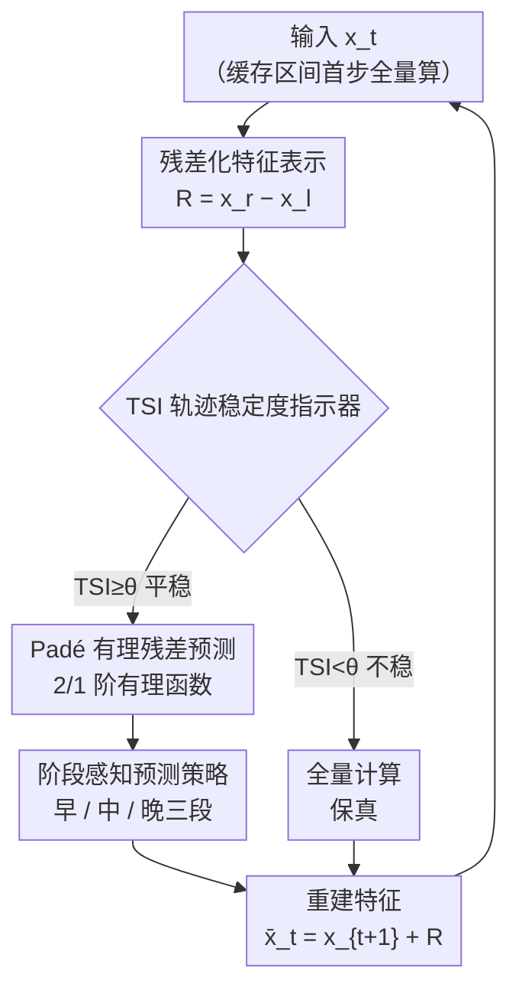

# TC-Padé: Trajectory-Consistent Padé Approximation for Diffusion Acceleration

**会议**: CVPR 2026  
**论文**: [CVF Open Access](https://openaccess.thecvf.com/content/CVPR2026/html/He_TC-Pade_Trajectory-Consistent_Pade_Approximation_for_Diffusion_Acceleration_CVPR_2026_paper.html)  
**代码**: 无（项目页 https://dreamer-hsx.github.io/tc-pade-project ）  
**领域**: 扩散模型 / 采样加速  
**关键词**: 特征缓存, Padé 近似, 扩散加速, 残差预测, 低步数采样

## 一句话总结
针对扩散模型在 20–30 步低步数采样下特征缓存失效的问题，TC-Padé 用「有理函数（Padé）外推残差」替代 TaylorSeer 的「多项式外推原始特征」，再配上一个轨迹稳定度指示器（TSI）自适应决定跳算、以及早/中/晚三阶段差异化预测策略，在 FLUX.1-dev 上做到 2.88× 加速且 FID 仅掉 ~3%。

## 研究背景与动机

**领域现状**：扩散模型质量很好但要几十上百步迭代去噪，推理太慢。免训练、即插即用的「特征缓存」是主流加速路线，又分两派：① 复用派（DeepCache / FORA / ToCa）直接缓存并重用相邻步的中间激活；② 预测派（TaylorSeer）用截断泰勒展开主动把特征外推到未来时间步，是当前 SOTA。

**现有痛点**：这些方法在 50 步这种高步数下都很好，但工业界实际常用的 **20–30 步低步数区间** 全线崩溃。步数一少，相邻去噪步之间的时间间隔就被拉大，特征相似度随之指数衰减——复用派赖以成立的「相邻步特征近似不变」假设被打破，缓存激活和当前状态严重错位，产生轨迹漂移（trajectory drift）；预测派的泰勒外推则因为泰勒级数固有的**有限收敛半径**，在大间隔外推时误差被急剧放大。论文用 PCA 可视化（Fig.2）显示这些方法的输出速度场轨迹明显偏离真值轨迹。

**核心矛盾**：泰勒级数本质上只能在局部邻域内逼近，超出收敛半径就发散，而低步数下特征演化恰恰是高度非线性、且**不同去噪阶段动力学不同**（早期是大尺度结构形成、晚期是细节精修）。可现有方法对整条采样轨迹用**同一套**预测策略，忽视了阶段差异。

**切入角度 + 核心 idea**：作者抓住数值逼近里的一个经典结论——**Padé 近似（两个多项式之比的有理函数）比同阶泰勒展开更善于刻画带极点、渐近行为和急剧非线性转变的函数**，且常能用更少历史点更快收敛。于是核心 idea 就是：用 Padé 有理函数外推**残差**（而非原始特征），并辅以稳定度感知的自适应系数 + 阶段感知策略，让低步数采样保持轨迹一致。

## 方法详解

### 整体框架
TC-Padé 是一个建立在 Padé 近似之上的**轨迹一致残差预测框架**。它把整条采样轨迹切成长度为 $N$ 的缓存区间（论文 $N=4$），区间内采用自适应计算策略：**每个区间的首步做全量计算**建立参考状态并缓存残差；后续每一步先用 TSI（轨迹稳定度指示器）判断当前轨迹稳不稳——稳就跳过网络计算、改用 Padé 外推残差并按阶段策略修正，不稳就老老实实全量计算以保真。预测时不直接预测高维原始特征，而是预测「层间残差」$\mathcal{R}=x^r-x^l$（残差时序相似度远高于原始特征），再用 $\bar{x}_t = x_{t+1}+\mathcal{R}_{\text{Padé},t}$ 重建输出特征。整套机制把算力集中在不稳定的轨迹片段，在平滑片段上加速。

### 关键设计

**1. 残差化特征表示：预测「增量」而非「绝对值」，绕开高维特征空间**

预测派的痛点是直接外推原始特征 $x_t$，但随着时间间隔变大，绝对特征变化量不断累积，导致相邻步特征相似度指数衰减（论文 Fig.4(b) 显示 TaylorSeer 的原始特征相似度低于 0.5）。TC-Padé 改为对 DiT 每个 block 的**层间残差**建模：定义第 $l$ 层到第 $r$ 层在时间步 $t$ 的残差为 $\mathcal{R}_t^{l:r} = x_t^r - x_t^l$，它表示这段层对特征施加的增量更新，剥离了绝对特征值。作者经验性发现残差的时序余弦相似度**始终显著高于**原始特征（Fig.4(a)），因为残差捕捉的是更平滑、更结构化的演化量。重建时只需 $\bar{x}_t = x_{t+1} + \mathcal{R}_{\text{Padé},t}$。这样把残差预测与原始特征预测解耦，让 Padé 近似只需聚焦更可预测的残差动力学，而非整个高维特征空间。消融显示在「整 block」粒度上缓存残差最优。

**2. Padé 有理残差预测：用有理函数取代泰勒多项式，靠收敛性优势吃下大间隔外推**

这是全文的数学内核，针对的是泰勒外推「收敛半径有限、越界即发散」的根本缺陷。$[m/n]$ 阶 Padé 近似定义为两个多项式之比

$$\mathcal{P}_{[m/n]} = \frac{P_m(x)}{Q_n(x)} = \frac{\sum_{i=0}^{m} a_i x^i}{1 + \sum_{j=1}^{n} b_j x^j}$$

其中分母 $Q_n(0)=1$ 保证唯一性。有理形式天然能刻画带极点、渐近行为或急剧非线性转变的函数，常以更少项更快收敛。作者用前若干个全算步的缓存残差构造有理预测器，并在表达力与开销间折中，采用低阶 $[2/1]$ 近似（取 $k=3$、$m=1$）：

$$\mathcal{R}_{\text{Padé},t} = \frac{b_0\,\mathcal{R}_{t+3} + b_1\,\mathcal{R}_{t+2}}{1 + a_1\,\mathcal{R}_{t+1}}$$

关键在于系数不是像经典 Padé 那样从泰勒匹配条件解析求得——扩散残差轨迹离散且随机，必须**自适应、数据驱动**地定系数。作者用一个稳定因子衡量近期变化的相对幅度：

$$\sigma_{stab} = \exp\!\left(-\lambda\,\frac{\lVert \mathcal{R}_{t+1}-\mathcal{R}_{t+2}\rVert}{\lVert \mathcal{R}_{t+1}+\mathcal{R}_{t+2}\rVert}\right)$$

当残差快速变化时 $\sigma_{stab}\to 0$、平稳时 $\to 1$（$\lambda$ 取较大值，论文设 10）。系数随之定义为 $b_0 = 2\sigma_{stab}$、$b_1 = -\sigma_{stab}$、$a_1 = \frac{1}{\lambda}\sigma_{stab}$。这样在历史缓存到当前残差的过渡上做平滑调制，避免数值不稳定。

**3. TSI 轨迹稳定度指示器：自适应决定「跳算 or 全算」，把算力花在刀刃上**

固定跳算节奏在大间隔下会在不稳定段掉质量。TC-Padé 在区间内除首步外，每步先算一个轨迹稳定度指示器：先把相邻步残差差归一化为方向向量 $u_t = (\mathcal{R}_t - \mathcal{R}_{t+1})/\lVert \mathcal{R}_t - \mathcal{R}_{t+1}\rVert_2$，再取

$$\text{TSI} = \tfrac{1}{2}\lVert u_{t+1} - u_{t+2}\rVert_2$$

当 $\text{TSI}\ge\theta$（$\theta$ 为预设稳定阈值）时判定轨迹平稳、跳过网络计算改用设计 2 的 Padé 预测；当 $\text{TSI}<\theta$ 时判定不稳、执行全量计算保真。论文给两档配置：TC-Padé (slow) 用 $\theta=1.0$、TC-Padé (fast) 用 $\theta=0.7$，$\theta$ 越小越激进、加速越高。⚠️ 原文措辞「TSI≥θ 表示稳定平滑→跳算」与「TSI 衡量相邻方向向量之差（值越大方向变化越剧烈、直觉上越不稳）」在方向上略有张力，且 $\theta=1.3$ 超出单位向量差归一化后的理论上界（$\tfrac12\lVert u_{t+1}-u_{t+2}\rVert\in[0,1]$）；此处以原文公式与阈值设置为准。

**4. 去噪阶段感知预测策略：早/中/晚三段用不同公式，匹配各阶段动力学**

特征缓存效果在去噪轨迹上差异很大：早期（高噪）是快速大尺度结构形成、晚期（低噪）是细节精修。统一策略在大间隔下会出问题。TC-Padé 把去噪过程按总步数 $T$ 切成三段，给出最终残差预测目标：

$$\bar{\mathcal{R}}_t = \begin{cases} \alpha_1 \mathcal{R}_{t+1} + \alpha_2 \mathcal{R}_{t+2}, & t > 0.7T \\[4pt] \mathcal{R}_{\text{Padé},t}, & 0.2T \le t \le 0.7T \\[4pt] \mathcal{R}_{\text{Padé},t} + \beta(\mathcal{R}_{t+1} - \mathcal{R}_{t+2}), & t < 0.2T \end{cases}$$

早期结构剧变，直接用两个最近残差的加权组合（$\alpha_1+\alpha_2=1$），保守稳妥；中期用完整 Padé 近似充分利用残差轨迹的长程依赖；晚期精修阶段在 Padé 预测上叠加一阶差分项 $\beta(\mathcal{R}_{t+1}-\mathcal{R}_{t+2})$（$\beta$ 为小系数），捕捉残差演化里细微的速度变化。三段差异化既保效率又保质量。

### 损失函数 / 训练策略
本方法**完全免训练、即插即用**，不改模型结构、不引入额外训练目标，纯粹在推理时替换缓存/外推逻辑。关键超参：缓存区间 $N=4$、稳定因子敏感参数 $\lambda=10$、TSI 阈值 $\theta\in\{0.7,1.0,1.3\}$、Padé 阶取 $[2/1]$（$k=3,m=1$），全部模型固定 20 步去噪。

## 实验关键数据

### 主实验
覆盖三类任务：文生图（FLUX.1-dev / COCO 2017，5 万 prompt）、文生视频（Wan2.1-1.3B / VBench-2.0）、类条件生成（DiT-XL/2 / ImageNet 256×256），均固定 20 步、L40 GPU。

文生图（COCO 2017，FLUX.1-dev 20 步）主结果：

| 方法 | 加速比 | FID↓ | CLIP↑ | PSNR↑ | SSIM↑ | LPIPS↓ |
|------|--------|------|-------|-------|-------|--------|
| FLUX.1-dev（基线） | 1.00× | 23.38 | 32.10 | – | – | – |
| ToCa (N=5) | 1.81× | 24.18 | 31.48 | 17.29 | 0.613 | 0.481 |
| TeaCache (fast) | 2.15× | 23.90 | 31.50 | 18.02 | 0.690 | 0.419 |
| TaylorSeer (N=5,O=2) | 2.31× | †崩坏 | 31.52 | 17.46 | 0.525 | 0.616 |
| **TC-Padé (slow)** | 2.20× | **23.85** | **31.90** | **24.67** | **0.861** | **0.144** |
| **TC-Padé (fast)** | **2.88×** | 24.14 | 31.82 | 21.96 | 0.782 | 0.290 |

TaylorSeer 在 20 步下 FID 直接崩坏（标 †，超出可比较范围），而 TC-Padé (fast) 用最高的 2.88× 加速仍保住 PSNR 21.96 / LPIPS 0.290，像素级与感知质量全面领先。

文生视频与类条件生成关键数字：

| 任务 / 模型 | 方法 | 加速比 | 质量主指标 |
|-------------|------|--------|-----------|
| 文生视频 Wan2.1-1.3B | 基线 | 1.00× | VBench-2.0 64.16% |
| | TaylorSeer (N=4,O=1) | 1.66× | VBench 54.50%（大幅掉） |
| | **TC-Padé (fast)** | **1.72×** | **VBench 60.38%** |
| 类条件 DiT-XL/2 | 基线 | 1.00× | FID 3.56 / IS 221.3 |
| | TaylorSeer (N=3,O=2) | 1.44× | FID 7.84 |
| | **TC-Padé (fast)** | 1.46× | **FID 6.93 / IS 185.1** |

### 消融实验

| 实验 | 配置 | 加速比 | 关键指标 | 说明 |
|------|------|--------|---------|------|
| 残差缓存粒度 | Double-stream | 1.36× | Aes 5.10 / ImgRwd 0.792 | 仅双流块 |
| | Single-stream | 1.94× | Aes 5.69 / ImgRwd 0.872 | 仅单流块 |
| | **整 Block** | **2.88×** | **Aes 5.76 / ImgRwd 0.918** | 最佳，ImgRwd 较双流 +15.9% |
| TSI 阈值 θ | θ=1.3 | 1.63× | ImgRwd 0.956 | 保守跳算、质量最高 |
| | θ=1.0 | 2.20× | ImgRwd 0.924 | 均衡档 |
| | θ=0.7 | 2.88× | ImgRwd 0.918 | 激进跳算、加速最高 |

### 关键发现
- **残差粒度选「整 block」最优**：在整 block 上缓存残差比仅双流块在 Image Reward 上高 15.9%、Aesthetic 高 12.9%，同时拿到 2.88× 加速——粗粒度残差更平滑、更可预测。
- **θ 是质量–速度旋钮且很平滑**：θ 从 1.3 降到 0.7，加速从 1.63× 升到 2.88×，Image Reward 仅从 0.956 微降到 0.918，Aesthetic/CLIP 几乎不动，说明激进跳算的质量代价很小。
- **与量化正交可叠加**：TC-Padé + 量化在 FLUX.1-dev 上吞吐从 0.22 升到 0.54–0.57 img/s（2.5×），batch=1 时延 9s→1.83s（约 6×），且质量几乎不掉（FID 23.38→24.31）。
- **预测派 vs 复用派的代价对比**：TaylorSeer 在视频/类条件上能堆到更高 FLOPs 削减（最高 3.32×），但质量大幅塌方；TC-Padé 取的是「实用加速 + 最小质量损失」的折中点。

## 亮点与洞察
- **把数值分析里的 Padé 近似搬进扩散缓存**：核心洞察是「泰勒收敛半径有限→大间隔外推必崩」，换成有理函数后用 $[2/1]$ 这么低的阶就吃下了非线性，思路干净且有理论依据，是很漂亮的跨领域迁移。
- **预测残差而非原始特征**：一个看似简单却关键的换元——残差时序相似度天然更高，把高维特征预测问题降维成更结构化的残差预测，这个 trick 可迁移到任何「外推中间激活」的加速方法。
- **稳定因子调制系数**：用 $\sigma_{stab}=\exp(-\lambda\cdot\text{相对变化})$ 把「轨迹稳不稳」直接编码进 Padé 系数，平稳时退化为强外推、突变时收敛为保守组合，是一种优雅的自适应数值稳定手段。
- **阶段感知**：早期加权平均、中期纯 Padé、晚期 Padé+一阶差分，对应「结构形成→长程依赖→细节速度」的物理直觉，把单一外推器拆成三段是低成本高回报的设计。

## 局限与展望
- **TSI 定义与阈值存在表述张力**（见设计 3 的 ⚠️）：「TSI≥θ 判稳定→跳算」与 TSI 作为方向向量差的直觉、以及 $\theta=1.3$ 超出归一化理论上界之间不完全自洽，论文未在正文澄清，复现时需谨慎核对原始实现。
- **超参偏多且部分凭经验**：$N,\lambda,\theta,\alpha_1/\alpha_2,\beta$ 以及三段切分点 $0.2T/0.7T$ 多为经验设定，跨模型/调度器的普适性、敏感性细节被放进 Appendix，正文证据有限。
- **加速比天花板受限于「保质量」定位**：在视频/类条件任务上 FLOPs 削减明显不如激进的 TaylorSeer 配置，TC-Padé 的卖点是质量稳，不是极限压缩——对极端低算力场景未必够。
- **可改进方向**：把 Padé 阶数 $[m/n]$ 也做成自适应（按阶段或按 TSI 动态升降阶）、或把 TSI 阈值在线学习，可能进一步压缩超参并提升鲁棒性。

## 相关工作与启发
- **vs TaylorSeer（预测派 SOTA）**：两者都属「主动外推未来特征」，但 TaylorSeer 用截断泰勒展开外推**原始特征**，受限于有限收敛半径，在 20–30 步大间隔下误差爆炸、FID 崩坏；TC-Padé 改用 Padé **有理函数外推残差**，收敛性更好、残差更平滑，是对预测派的直接升级。
- **vs ToCa / Δ-DiT / TeaCache（复用派）**：复用派依赖「相邻步特征近似不变」，低步数下该假设失效、产生轨迹漂移；TC-Padé 不被动复用而是建模演化趋势，并用 TSI 在不稳段回退到全算，质量明显更稳。
- **vs DDIM / DPM-Solver（求解器派）/ 蒸馏派**：求解器与蒸馏从「减少采样步数」入手、常需改流程或训练学生模型；TC-Padé 走「降低每步算力」路线、免训练即插即用，且与量化等正交技术可叠加。

## 评分
- 新颖性: ⭐⭐⭐⭐ 把 Padé 有理近似 + 残差化 + 阶段感知组合进特征缓存，跨领域迁移巧妙且切中低步数痛点。
- 实验充分度: ⭐⭐⭐⭐ 覆盖图/视频/类条件三任务三模型、对比主流缓存方法、消融到粒度与阈值，较扎实；TSI 公式自洽性与超参敏感性证据稍欠。
- 写作质量: ⭐⭐⭐⭐ 动机—方法—实验逻辑清晰、图示到位；TSI 部分表述存在小张力，部分细节挪到 Appendix。
- 价值: ⭐⭐⭐⭐ 直击工业级 20–30 步采样落地痛点，免训练、可与量化叠加，实用性强。

<!-- RELATED:START -->

## 相关论文

- [\[CVPR 2026\] Forecast the Principal, Stabilize the Residual: Subspace-Aware Feature Caching for Diffusion Transformers](forecast_the_principal_stabilize_the_residual_subspace-aware_feature_caching_for.md)
- [\[CVPR 2026\] ResCa: Residual Caching for Diffusion Transformers Acceleration](resca_residual_caching_for_diffusion_transformers_acceleration.md)
- [\[CVPR 2026\] Adaptive Spectral Feature Forecasting for Diffusion Sampling Acceleration](adaptive_spectral_feature_forecasting_for_diffusion_sampling_acceleration.md)
- [\[CVPR 2026\] Denoising as Path Planning: Training-Free Acceleration of Diffusion Models with DPCache](dpcache_denoising_path_planning_diffusion_accel.md)
- [\[CVPR 2026\] GeoRK2: Geometry-Guided Runge-Kutta Integration for Diffusion Transformer Acceleration](geork2_geometry-guided_runge-kutta_integration_for_diffusion_transformer_acceler.md)

<!-- RELATED:END -->
