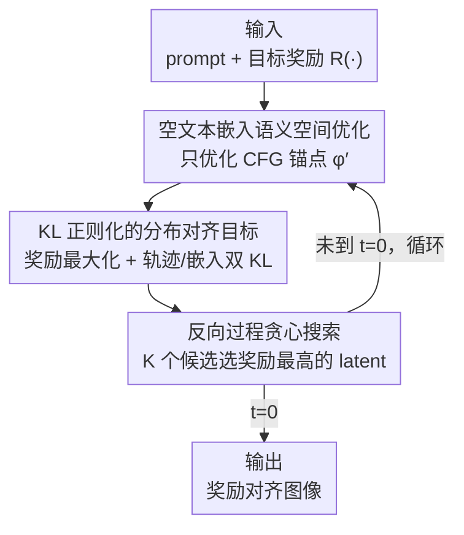

# Test-Time Alignment of Text-to-Image Diffusion Models via Null-Text Embedding Optimisation

**会议**: CVPR 2026  
**论文**: [CVF Open Access](https://openaccess.thecvf.com/content/CVPR2026/html/Kim_Test-Time_Alignment_of_Text-to-Image_Diffusion_Models_via_Null-Text_Embedding_Optimisation_CVPR_2026_paper.html)  
**代码**: 无  
**领域**: 扩散模型  
**关键词**: 测试时对齐, 奖励对齐, 空文本嵌入, Classifier-Free Guidance, 奖励 hacking

## 一句话总结
不改模型权重、也不去拧噪声/latent，而是只优化 Classifier-Free Guidance 里那个"空文本嵌入"（null-text embedding），让扩散模型在推理阶段对齐目标奖励——因为文本嵌入空间是结构化语义流形，这样既能把奖励顶到 SOTA，又不会靠非语义噪声"作弊"（reward hacking）。

## 研究背景与动机
**领域现状**：让预训练扩散模型对齐人类偏好或某个目标奖励（美学分、HPSv2、PickScore 等），目前有两条路。一是微调（fine-tuning），直接改模型权重去最大化奖励；二是测试时对齐（Test-Time Alignment, TTA），推理时不动权重，转而优化噪声/latent 变量、或用 SMC 采样、或用 MCTS 之类的离散搜索来逼近高奖励样本。

**现有痛点**：微调代价大且容易"奖励过优化"（reward over-optimisation）——模型死磕代理奖励，丢掉跨奖励的泛化性和样本多样性。TTA 这边同样两头不讨好：要么 under-optimise（如 DPS、TDPO 目标奖励几乎没涨），要么 over-optimise（如 DNO 目标分涨了、其他指标全崩）。

**核心矛盾**：作者把根因归到"优化在哪个空间"。无论是 pixel-space $x$ 还是 latent-space $z$，都是**高维、无结构**的空间，优化器很容易找到一堆**非语义的噪声扰动**去满足奖励函数 $r(x)$——分数上去了，但图像在语义上没变好甚至变坏，这就是 reward hacking 的温床。搜索类方法则随扩散步数指数级膨胀，又慢又次优。

**本文目标**：找一个既能稳定顶高目标奖励、又不牺牲跨奖励泛化、还不用更新权重的 TTA 框架。

**切入角度**：作者从图像编辑里的 Null-Text Inversion (NTI) 得到启发——NTI 证明了优化 CFG 中的空文本嵌入 $\phi$ 能实现细粒度语义控制且保真度高。关键观察是：CFG 里的空文本嵌入是**整个条件生成分布的几何锚点**，而且它住在文本编码器定义的**结构化语义空间**里，天然带有隐式的流形正则。

**核心 idea**：把对齐从"拧噪声"搬到"优化空文本嵌入"——在语义流形上做奖励最大化，配一个 KL 正则目标，直接把模型的生成分布往目标奖励方向掰，而不是只在样本层面打补丁。

## 方法详解

### 整体框架
Null-TTA 是一个 training-free 的 TTA 框架，输入是 prompt + 目标奖励函数 $R(\cdot)$，输出是对齐后的图像，全程**不更新 U-Net 权重**，只优化一个向量——CFG 里的空文本嵌入 $\phi'$。整体在标准 DDPM 反向去噪循环里嵌入：在每个去噪步 $t$，先对 $\phi'$ 做若干步梯度上升（最大化"奖励 − KL 正则"的组合目标），再用更新后的 $\phi'$ 跑一步 DDPM 转移，并叠一个轻量贪心搜索从 $K$ 个候选里挑奖励最高的 latent 作为 $x_{t-1}$。整条流水线就是"语义空间优化 + 轨迹级 KL 约束 + 逐步贪心选择"三件套的协同。

### 关键设计

**1. 空文本嵌入上的语义空间优化：把对齐从无结构噪声搬到结构化流形**

这是全文的根。痛点是 pixel/latent 空间无结构，优化器会钻"非语义噪声"的空子去刷分（reward hacking）。Null-TTA 的做法是：不碰噪声变量，只优化 CFG 公式里的空文本嵌入 $\phi$。回顾 CFG，预测噪声是 $\tilde{\epsilon}_\theta(x_t,t,c,\phi) = \epsilon_\theta(x_t,t,\phi) + s\,(\epsilon_\theta(x_t,t,c) - \epsilon_\theta(x_t,t,\phi))$，其中 $\phi$ 是无条件生成用的空文本嵌入，它"锚定"了模型生成分布。由于 $\phi$ 住在文本编码器定义的语义空间里，对它做优化等于在一个**隐式带流形正则**的空间里移动——更新只能沿语义上连贯的方向走，没法像 latent 优化那样靠噪声 artifact 作弊。而且因为 $\phi$ 是整个条件分布的锚点，动它就是**直接掰动生成分布本身**，而非事后修样本，这也是它不更新权重却能改变分布的原因。

**2. KL 正则化的分布对齐目标：在掰分布的同时不偏离预训练行为**

光最大化奖励仍会导致分布漂移和 reward hacking。作者从 KL 正则化的最优目标分布 $p_{tar}(x) = \frac{1}{Z}\,p_{pre}(x)\exp(r(x)/\alpha)$ 出发，设计了一个对 $\phi'$ 的正则目标：$\max_{\phi'}\big(\lambda_1\,\mathbb{E}_{p(x_0|\phi')}[R(x_0)] - \lambda_2\,\mathrm{KL}(p(x_{0:T},\phi')\,\|\,p(x_{0:T},\phi))\big)$。利用扩散过程的 Markov 性，这个轨迹级 KL 被拆成两部分：相邻去噪步之间的局部 KL 之和，加上嵌入分布之间的 KL。每步条件分布都是高斯，化简后局部 KL 有闭式：

$$\mathrm{KL}\big(p(x_{i-1}|x_i,\phi')\,\|\,p(x_{i-1}|x_i,\phi)\big) = \frac{1-\alpha_i}{2\alpha_i(1-\bar{\alpha}_i)}\,\|\tilde{\epsilon}(x_i,\phi') - \tilde{\epsilon}(x_i,\phi)\|^2$$

嵌入项则把 $\phi,\phi'$ 建模为高斯，得到 $\mathrm{KL}(p(\phi')\|p(\phi)) = \frac{1}{2\sigma_\phi^2}\|\phi-\phi'\|^2$（注意作者并不真去采样 $\phi'$，只优化其均值，概率建模只是为了直观解释）。两项含义直白：前者强制优化后的去噪轨迹和预训练轨迹保持一致，后者拦着 $\phi'$ 不要离原始空文本嵌入太远。实践中用单条去噪轨迹做 Monte Carlo 近似、用 Tweedie 公式估 $\mathbb{E}_{p(x_0|\phi')}[R(x_0)]$，于是每步实际优化的是 $\max_{\phi'}\big(\lambda_1 R(\hat{x}_0(x_t,\phi')) - \lambda_2\,(\cdot)\|\tilde{\epsilon}(x_t,\phi')-\tilde{\epsilon}(x_t,\phi)\|^2 - \frac{\lambda_2}{2\sigma_\phi^2}\|\phi'-\phi\|^2\big)$。一个工程细节是 $\lambda_2$ 随 $t\to 0$ 退火：早期噪声大、强正则稳住优化，后期奖励估计更准、弱正则放开做精细对齐；同时内层优化步数从 $n_{min}$ 增到 $n_{max}$。

**3. 反向过程的贪心搜索：在每一步顺手把轨迹往高奖励区域推一把**

光优化 $\phi'$ 还不够，DDPM 转移本身带随机性。每步更新完 $\phi'$ 后，作者从转移核 $p(x_{t-1}|x_t,\phi')$ 采 $K$ 个候选 $\{x_{t-1}^{(k)}\}$，对每个候选用 Tweedie 后验均值估出对应的干净样本 $\hat{x}_0^{(k)}$，用奖励模型 $R(\hat{x}_0^{(k)})$ 打分，只保留分数最高的那个当 $x_{t-1}$、其余丢弃。这个贪心选择等于在每步多探 $K$ 条路、留最优，确定性地把反向扩散路径往高奖励区域微调，得到一条更对齐的轨迹。它是对前两项设计的轻量补充——优化把分布锚点掰对，搜索把单次采样的随机抖动也利用起来。

### 损失函数 / 训练策略
没有训练，全程 inference-time 优化。核心目标即式 (26)：奖励项 $\lambda_1 R(\hat{x}_0(x_t,\phi'))$ 减去两项 KL 正则。一个关键的工程优势是：因为只优化空文本嵌入 $\phi'$，反向传播**只需穿过 cross-attention 层**而非整个 U-Net，所以显存占用最低、运行时随优化步数稳定扩展。对**不可微奖励**（如 JPEG 压缩率、分子对接分等黑盒场景），改用零阶梯度估计 $\hat{\nabla}_\phi J(\phi) \approx \frac{1}{K\mu}\sum_{k=1}^{K}[J(\phi+\mu v_k)-J(\phi)]v_k$，其中 $v_k\sim\mathcal{N}(0,I)$。

## 实验关键数据

基线覆盖各 TTA 分支：TDPO（微调）、DNO/DPS（guidance 型）、DAS（采样型）、DSearch（搜索型）；主模型 SD v1.5，推理 100 步，单张 L40S，结果跨 3 个随机种子平均。

### 主实验

PickScore 作为目标奖励时的目标分 + 跨奖励泛化（SD v1.5，$n_{max}=55$）：

| 方法 | PickScore（目标）↑ | HPSv2 ↑ | Aesthetic ↑ | ImageReward ↑ |
|------|------|------|------|------|
| SD-v1.5 | 0.218 | 0.279 | 5.232 | 0.339 |
| DNO | 0.289 | 0.290 | 5.075 | 0.396 |
| DAS | 0.258 | 0.289 | 5.382 | 0.871 |
| **Null-TTA** | **0.315** | **0.294** | **5.431** | **0.946** |

Null-TTA 在目标奖励和全部 held-out 奖励上同时领先，说明它"顶分"的同时没有把其他指标搞崩。论文还在 Aesthetic、HPSv2 目标上画了 Pareto 前沿（Fig.1），Null-TTA 持续把前沿往外推，pareto-dominate 所有竞品。SDXL 上同样成立（Table 4）：$n_{max}$ 从 25 加到 45，目标 PickScore 从 0.266 升到 0.282，其他质量指标几乎不掉。

### 消融 / 分析实验

计算成本对比（HPSv2 目标，SD v1.5）：

| 方法 | $n_{max}$ | HPSv2 ↑ | 显存 (MB) ↓ | 单图耗时 |
|------|------|------|------|------|
| DAS | – | 0.306 | 30595 | 4m48s |
| DNO | – | 0.375 | 20449 | 19m38s |
| Null-TTA | 25 | 0.347 | 17585 | 4m33s |
| Null-TTA | 55 | 0.375 | 17585 | 8m40s |
| Null-TTA | 115 | 0.428 | 17585 | 17m07s |

同样达到 0.375 的 HPSv2，Null-TTA（8m40s）比最强基线 DNO（19m38s）快一倍多，且显存最低（17585MB，只反传 cross-attention）。再加大预算还能继续顶到 0.428。用户研究（Table 2，16 人、800 对）里 Null-TTA 平均排名 1.81，优于 DNO（2.04）和 DAS（2.15），说明奖励增益确实转化成了人感知到的质量。

### 关键发现
- **作弊与否取决于优化空间**：基线掉链子的根因被归为"在无结构 latent/噪声空间优化"，要么 over-optimise（DNO 目标涨别的崩）要么 under-optimise（TDPO/DPS 目标几乎不动）；把优化挪到语义流形 + KL 约束轨迹一致，两头问题同时缓解。
- **显存优势来自只优化嵌入**：因为梯度只穿 cross-attention 不穿整个 U-Net，显存随优化步数几乎不增长，这是相对其他 TTA 的结构性省钱点。
- **可扩到不可微奖励**：用零阶梯度估计，能对 JPEG 压缩率这类黑盒奖励对齐（Table 5），在保压缩率的同时显著更好地保住视觉质量与 prompt 一致性。
- **多目标可控**：用 $R_{multi}=w\cdot\text{PickScore}+(1-w)\cdot\text{HPSv2}$，Null-TTA 的权衡前沿明显压过 DAS，说明语义空间优化对多目标对齐更友好。

## 亮点与洞察
- **把"对齐"重新定义成"优化生成分布的锚点"**：最妙的是认识到 CFG 的空文本嵌入是条件分布的几何锚点，动它就是动分布本身——这让一个不到 U-Net 万分之一参数量的向量承担起了"无须微调改分布"的活。
- **结构化空间天然抗 reward hacking**：把优化变量从无结构噪声换成语义嵌入，等于免费拿到流形正则；"换空间"这个思路可迁移到任何容易被代理奖励钻空子的优化场景（如其他生成模型的偏好对齐）。
- **闭式 KL + Tweedie 近似**让训练-free 的轨迹级正则真的可算，避免了对整条轨迹反传的开销。
- **只反传 cross-attention** 这个工程选择直接换来显存与速度的双赢，是可复用的省资源 trick。

## 局限与展望
- 贪心搜索每步采 $K$ 个候选会增加奖励模型前向次数，$K$ 与候选质量的权衡论文未深入消融，极端高奖励压力下是否仍稳需更多验证。⚠️ 论文正文未给 $K$ 的敏感性分析。
- 整体奖励仍依赖现成奖励模型（HPSv2/PickScore/Aesthetic），这些代理本身的偏差会被继承；语义流形抗 hacking，但抗不了"奖励模型自己就偏"。
- $\lambda_2$ 退火、$n_{min}/n_{max}$ 等超参偏经验设定，跨模型/跨奖励是否需要重调未充分讨论。
- 仅在 SD v1.5 / SDXL 上验证，对更大或非 latent 架构（如像素空间扩散、flow matching）的可迁移性待考。

## 相关工作与启发
- **vs DNO（guidance 型 TTA）**：DNO 直接拧注入噪声做奖励最大化，在无结构空间里容易 over-optimise（目标涨、别的崩）；Null-TTA 在语义嵌入空间优化 + KL 约束，目标分相当或更高，但泛化和速度都更好。
- **vs DAS（采样型 TTA / SMC）**：DAS 假定一个固定但 intractable 的后验、靠少量粒子采样，关注采样效率而非直接改分布；Null-TTA 显式修改生成分布本身，跨任务对齐更稳更一致。
- **vs DSearch / Search-over-Paths（搜索型 TTA）**：搜索类把 TTA 当噪声空间的离散搜索（MCTS 等），能处理不可微奖励但复杂度随扩散步数指数膨胀、慢且次优；Null-TTA 在连续语义流形上做优化，兼顾效率与平滑可解释的控制，并用零阶估计也能覆盖不可微奖励。
- **vs Null-Text Inversion (NTI)**：NTI 把空文本嵌入优化用于图像编辑/反演；本文把同一原理外推、重构成扩散模型奖励对齐的通用机制。
- **vs 微调类对齐（TDPO 等）**：微调改权重、贵且易过优化降多样性；Null-TTA 不动权重、training-free，保持通用性与效率。

## 评分
- 新颖性: ⭐⭐⭐⭐⭐ 把对齐从噪声空间搬到 CFG 空文本嵌入这一"分布锚点"，是 TTA 范式上的清晰新角度。
- 实验充分度: ⭐⭐⭐⭐ 覆盖多目标/多模型/计算成本/不可微奖励/用户研究，较全面；但贪心搜索 $K$、超参敏感性消融偏少。
- 写作质量: ⭐⭐⭐⭐ 动机—推导—目标的逻辑链清楚，KL 拆解给了完整闭式。
- 价值: ⭐⭐⭐⭐⭐ training-free、省显存、抗 reward hacking，对实际部署对齐很有吸引力。

<!-- RELATED:START -->

## 相关论文

- [\[CVPR 2026\] Progress by Pieces: Test-Time Scaling for Autoregressive Image Generation](progress_by_pieces_test-time_scaling_for_autoregressive_image_generation.md)
- [\[CVPR 2026\] From Scale to Speed: Adaptive Test-Time Scaling for Image Editing](from_scale_to_speed_adaptive_test-time_scaling_for_image_editing.md)
- [\[CVPR 2026\] Premier: Personalized Preference Modulation with Learnable User Embedding in Text-to-Image Generation](premier_personalized_preference_modulation_with_learnable_user_embedding_in_text.md)
- [\[CVPR 2026\] TINA: Text-Free Inversion Attack for Unlearned Text-to-Image Diffusion Models](tina_text-free_inversion_attack_for_unlearned_text-to-image_diffusion_models.md)
- [\[NeurIPS 2025\] Diffusion Adaptive Text Embedding for Text-to-Image Diffusion Models](../../NeurIPS2025/image_generation/diffusion_adaptive_text_embedding_for_texttoimage_diffusion.md)

<!-- RELATED:END -->
