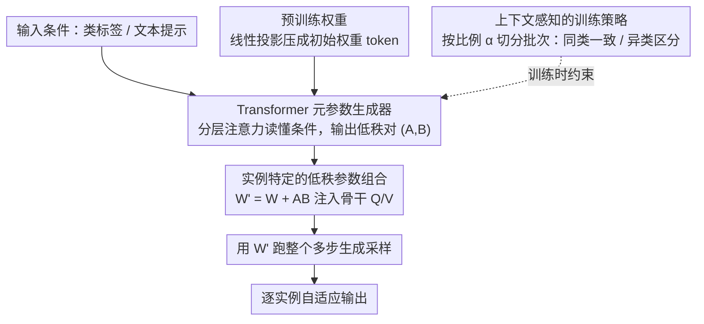

# Test-Time Instance-Specific Parameter Composition: A New Paradigm for Adaptive Generative Modeling

**会议**: CVPR 2026  
**arXiv**: [2603.27665](https://arxiv.org/abs/2603.27665)  
**代码**: [https://github.com/tmtuan1307/Composer](https://github.com/tmtuan1307/Composer)  
**领域**: 图像生成 / 扩散模型  
**关键词**: 自适应生成模型、测试时参数组合、低秩更新、动态权重、元生成器

## 一句话总结

本文提出 Composer，一个即插即用的元生成器框架，在推理时根据每个输入条件动态生成低秩参数更新并注入预训练模型权重，以极低的计算开销（时间+0.2%、内存+3.6%）实现逐实例自适应的高质量图像生成，在类条件生成、文本到图像、后训练量化和测试时缩放等场景中均显著提升性能。

## 研究背景与动机

**领域现状**：扩散模型和视觉自回归模型已在图像生成领域取得巨大成功，但本质上是静态模型——一套固定的预训练参数要处理所有输入提示、场景和模态。

**现有痛点**：这种刚性限制了模型的适应性。面对复杂或模糊的生成条件时，静态权重无法针对每个输入的语义特征做特化，常导致过度平滑或不一致的样本。现有的测试时训练（TTT）方法虽能在推理时适配参数，但需要逐实例梯度优化，计算开销极高（时间增加 540%+，内存增加 180%+）。MoE 架构提供了条件计算，但路由粒度粗且绑定固定专家池，还需要架构改动和全量重训练。

**核心矛盾**：如何在不增加显著计算开销的前提下，让预训练生成模型拥有逐实例适应能力？

**本文目标** (1) 实现推理时逐输入的参数特化而不需要微调或重训练；(2) 以即插即用方式兼容任意预训练生成模型骨干；(3) 保持极低的计算和内存开销。

**切入角度**：受人类灵活调整内部生成表示以适应不同感知/想象情境的启发，不走迭代优化路线，而是用轻量辅助网络直接从条件信号合成参数更新。

**核心 idea**：用 Transformer 元生成器将输入条件映射为低秩参数更新 $W' = W + AB$，在推理前一次性完成参数组合，以近乎零开销实现逐实例自适应生成。

## 方法详解

### 整体框架

Composer 想解决的事很具体：让一套冻结的预训练生成模型，在面对每一个不同输入条件（类标签、文本提示）时，临时换上一副"为这个输入量身定做"的权重，而又不付出测试时再训练的代价。它的做法是在骨干网络外面挂一个轻量的元生成器：训练时，这个 Transformer 学会把"预训练权重 + 当前条件"映射成一对低秩矩阵 $(A,B)$，于是骨干的某些权重在推理前被就地改写为 $W' = W + AB$，再用改写后的权重跑一遍标准生成训练。推理时不再需要任何梯度，元生成器只用预存的 token 一次性算出 $(A,B)$，把 $W'$ 拼好后整个多步采样过程都复用它，所以额外开销几乎可以忽略。

### 关键设计

**1. 实例特定的低秩参数组合：把"一套权重打天下"换成"一个输入一套微调"**

静态模型的根本毛病是同一组参数要应付所有条件，复杂或模糊的输入只能被平均化处理。Composer 在骨干的查询矩阵 $W_Q$ 和值矩阵 $W_V$ 上叠加一个低秩修正 $W' = W + AB$，其中 $A \in \mathbb{R}^{d \times r}$、$B \in \mathbb{R}^{r \times d}$、$r \ll d$（默认 $r=8$）。低秩约束把每次修正的参数量压到极小，所以即便逐输入生成也不会拖慢推理。它和 LoRA 看似同形却本质不同：LoRA 的 $A,B$ 训练完就固定、对所有输入共享，而 Composer 的 $A,B$ 是当场根据输入条件现算出来的——同样是低秩适配，一个是"全局一副眼镜"，一个是"每个输入换一副眼镜"。只改 Q 和 V、不动 K 和 O，沿用了已有微调经验里"Q/V 修正性价比最高"的观察。

**2. Transformer 元参数生成器：让一个注意力网络去"读懂"条件并写出权重**

要为每个输入现场产出 $(A,B)$，关键是有一个能把条件信号翻译成权重的网络。训练时先用一层线性投影把预训练权重压成初始 token $A^0, B^0$（$\mathbb{R}^{d \times d} \to \mathbb{R}^{2r \times d_{model}}$），与输入提示 token 拼在一起喂进 Transformer。这里的注意力被刻意设计成分层结构：所有组件 token 都去 attend 提示 token 以吸收上下文，块内做局部 attention 压低计算量，而每个块的首 token 额外做跨块 attention 来捕捉不同权重矩阵之间的关联。这样既保留了"条件感知"，又不会因全局注意力而开销爆炸。推理阶段干脆把线性投影层整个移除，直接复用训练好的 $A^0, B^0$ token，这正是推理时间几乎不增加的原因——昂贵的初始化只在训练时发生一次。

举个具体的转法：给定类标签"金毛犬"，提示 token 进入元生成器后，首 token 跨块汇总各层 Q/V 的修正需求，几步注意力后吐出 $r=8$ 维的 $(A,B)$，骨干的 $W_Q$、$W_V$ 被改写成偏向"毛发纹理、犬类轮廓"的版本，随后整个采样过程都用这副权重。

**3. 上下文感知的训练策略：在"同类要一致"和"异类要有区分"之间调平衡**

如果训练时每个批次都随机采样，元生成器学不到条件之间的语义关系，适应会不稳定；但若每个批次都来自同一类别，输出又会趋同、退化成模式坍塌。Composer 用一个比例 $\alpha \in [0,1]$ 切分批次：$\alpha \times b$ 个样本取自同一类别以保证相似输入产出一致的适配，剩下 $(1-\alpha) \times b$ 个样本取自不同类别以拉开区分度（默认 $\alpha = 0.75$）。对文本到图像任务，"同类"进一步用 CLIP 嵌入空间的语义相似度来界定，而不是硬性的类标签。消融显示 $\alpha=0.75$ 恰好在一致性与多样性之间取到最优，过低或过高都会变差。

### 损失函数 / 训练策略

类条件生成沿用标准扩散损失 $\mathcal{L} = \mathbb{E}_{x,\epsilon,t}[\|\epsilon - \epsilon_\theta(x_t, t; W', P)\|_2^2]$，区别只是 $\epsilon_\theta$ 用的是组合后的权重 $W'$。后训练量化场景改用知识蒸馏损失 $\mathcal{L}_{KD} = \|h - h_q\|_2^2$，让低秩更新去补偿量化带来的特征偏移。所有实验用 AdamW（weight decay 0.05、lr 1e-4），训练 50 个 epoch，低秩维度固定 $r=8$。

## 实验关键数据

### 主实验

ImageNet 256×256 类条件生成：

| 骨干 | 方法 | FID ↓ | IS ↑ | 推理时间 | 内存 |
|------|------|-------|------|---------|------|
| VAR d-16 | Standard | 3.55 | 274.4 | 0.4s | 2.37G |
| VAR d-16 | TTT | 3.22 | 277.2 | 40.52s (+10030%) | 4.58G |
| VAR d-16 | **Composer** | **3.15** | **280.4** | 0.42s (+5%) | 2.57G |
| VAR d-30 | Standard | 1.97 | 323.1 | 1.0s | 16.57G |
| VAR d-30 | TTT | 1.85 | 327.7 | 112.37s (+11137%) | 28.41G |
| VAR d-30 | **Composer** | **1.79** | **330.4** | 1.07s (+7%) | 16.97G |
| DiT-XL/2 | Standard | 2.27 | 278.2 | 45s | 6.1G |
| DiT-XL/2 | **Composer** | **2.06** | **285.6** | 45.03s (+0.07%) | 6.4G |

### 消融实验

| 消融维度 | 设置 | VAR d-16 FID |
|---------|------|-------------|
| 低秩维度 $r$ | 4/8/16/32 | 3.32/3.15/3.10/3.08 |
| 采样比 $\alpha$ | 0.0/0.5/0.75/1.0 | 3.42/3.22/3.15/3.25 |
| 注意力机制 | Standard/Global-Local | 3.55/3.15 |
| 生成器架构 | CNN/MLP/Transformer | 3.35/3.32/3.15 |

### 关键发现

- **效率极高**：相比 TTT 的 10000%+ 时间开销，Composer 仅增加 0.2%-7% 的推理时间和 3.6%-5% 的内存
- **跨骨干一致提升**：在 VAR (d-16 到 d-36)、DiT (L/2 到 XL/2)、SD2.1 上均稳定降低 FID
- **量化修复能力**：在极端 2/8 bit 量化下，将 Q-Diffusion 的 IS 从 49.08 提升到 78.21，FID 从 43.36 降到 35.26
- **可叠加性**：Composer + ORM/PARM 测试时缩放可进一步提升效果（FID 从 13.45 降到 12.82）
- **$\alpha = 0.75$ 最优**：过低（无一致性约束）或过高（缺乏多样性）都导致次优结果

## 亮点与洞察

- **范式创新**：从静态参数到动态参数组合的范式转换，是 LoRA 思想的自然演进——LoRA 是全局共享的低秩适配，Composer 是逐实例的低秩适配
- **实用性极强**：即插即用、模型无关、几乎零开销，是少有的"全面赢"的方法
- **量化场景的独特价值**：用低秩更新补偿量化误差是非常聪明的应用方向
- **与人类认知的类比**：模型学会为每个输入"调整心态"后再生成，类似人类面对不同创作任务时的心理准备过程

## 局限与展望

- 仅针对 Q 和 V 矩阵做适配，未充分探索其他层（如 FFN）的潜力
- 训练仍需 50 个 epoch，元生成器的训练成本未被充分讨论
- 文本到图像的改进幅度（FID 13.45→13.07）相对类条件场景较小
- 未探索视频生成或 3D 生成等更复杂的应用场景

## 相关工作与启发

- LoRA 是 Composer 的思想前身——共享低秩 vs 动态低秩的对比非常有启发性
- MoE 的粗粒度路由 vs Composer 的细粒度逐实例适配提供了不同层次的动态计算视角
- HyperNetwork 也做参数生成，但 Composer 的 Transformer 架构+分层注意力设计更高效

## 评分

- **新颖性**: ⭐⭐⭐⭐⭐ — 测试时逐实例参数组合是全新范式，对生成模型设计有深远影响
- **实验充分度**: ⭐⭐⭐⭐⭐ — 覆盖5种骨干模型、4个应用场景、多组消融，数据非常完整
- **写作质量**: ⭐⭐⭐⭐ — 概念阐述清晰，公式推导完整，图表设计直观
- **价值**: ⭐⭐⭐⭐⭐ — 即插即用的通用框架+多场景验证+极低开销，实际应用价值极高

<!-- RELATED:START -->

## 相关论文

- [\[CVPR 2026\] From Scale to Speed: Adaptive Test-Time Scaling for Image Editing](from_scale_to_speed_adaptive_test-time_scaling_for_image_editing.md)
- [\[CVPR 2026\] Progress by Pieces: Test-Time Scaling for Autoregressive Image Generation](progress_by_pieces_test-time_scaling_for_autoregressive_image_generation.md)
- [\[ICLR 2026\] GenCP: Towards Generative Modeling Paradigm of Coupled Physics](../../ICLR2026/image_generation/gencp_towards_generative_modeling_paradigm_of_coupled_physics.md)
- [\[CVPR 2026\] Test-Time Alignment of Text-to-Image Diffusion Models via Null-Text Embedding Optimisation](test-time_alignment_of_text-to-image_diffusion_models_via_null-text_embedding_op.md)
- [\[ICLR 2026\] Compose Your Policies! Improving Diffusion-based or Flow-based Robot Policies via Test-time Distribution-level Composition](../../ICLR2026/image_generation/compose_your_policies_improving_diffusion-based_or_flow-based_robot_policies_via.md)

<!-- RELATED:END -->
