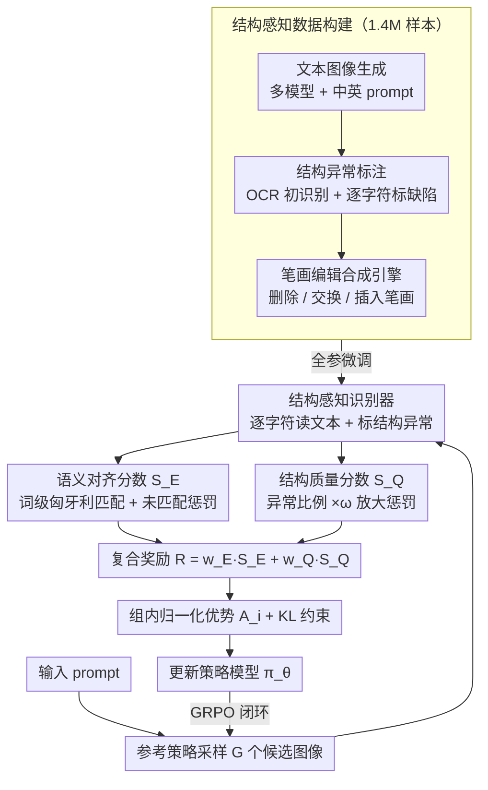

# TextPecker: Rewarding Structural Anomaly Quantification for Enhancing Visual Text Rendering

**会议**: CVPR 2026  
**arXiv**: [2602.20903](https://arxiv.org/abs/2602.20903)  
**代码**: [GitHub](https://github.com/CIawevy/TextPecker)  
**领域**: 图像生成  
**关键词**: visual text rendering, structural anomaly, reinforcement-learning, reward model, OCR

## 一句话总结

提出 TextPecker——一种即插即用的结构异常感知 RL 策略，通过构建字符级结构异常标注数据集训练结构感知识别器，替代传统 OCR 的噪声奖励信号，联合优化语义对齐和结构保真度，在多个文本到图像模型（FLUX、SD3.5、Qwen-Image）上显著提升视觉文本渲染质量。

## 研究背景与动机

**视觉文本渲染（VTR）仍是 T2I 生成的关键挑战**：即使是先进模型（如 FLUX、GPT-4o、BAGEL）也频繁产生扭曲、模糊、错位或缺字等结构异常。

**OCR/MLLM 作为评估器存在根本缺陷**：现有评估和 RL 优化流程依赖 OCR 模型或 MLLM 识别生成文本再计算编辑距离奖励。然而这些模型无法感知细粒度结构异常，表现为两类失败：(a) **误解读**：过度依赖语言先验"纠正"结构缺陷，忽略笔画缺失/错位等字形级缺陷；(b) **不可见**：直接忽略严重模糊/扭曲区域，当作不存在。

**评估器盲区导致误导性奖励**：OCR 的"自动纠错"会压低编辑距离 $N_e$、虚高奖励分数 $S$，导致 RL 优化方向偏离。即使是高度优化的 Qwen-Image、Seedream4.0 仍难以渲染结构忠实的文本。

**结构异常标注数据匮乏**：缺少字符级结构异常标注的训练数据，尤其是中文字符因二维空间组合和 8000+ 字符量带来组合爆炸。

## 方法详解

### 整体框架

TextPecker 想堵住的窟窿是：T2I 模型用 RL 优化文本渲染时，奖励信号来自 OCR/MLLM，而这些评估器对字形级的结构缺陷天生是"盲"的——要么靠语言先验把缺笔画的字"脑补"对，要么干脆跳过模糊扭曲的区域。结果就是奖励虚高、优化方向跑偏。它的对策很直接：把 GRPO 流程里那个不靠谱的 OCR 奖励，整个换成一个看得见结构异常的复合奖励，其余一概不动。

整体是一个标准的 GRPO 闭环。对每条 prompt，先从参考策略 $\pi_{\theta_{\text{ref}}}$ 采样 $G$ 个候选图像 $\{o_i\}_{i=1}^G$；交给一个专门训练的「结构感知识别器」逐字符读出生成的文本，并逐字标出哪些字符存在结构异常；据此算出每个候选的联合奖励 $\mathcal{R}_i$（语义对齐 + 结构质量两块）；再把组内奖励归一化成相对优势 $A_i$，配合 KL 约束更新策略模型 $\pi_\theta$。因为改动只落在「奖励」这一环，TextPecker 对任意 T2I 模型都是即插即用的，不碰生成器架构。下面四个设计点，前三个拼出这个复合奖励，第四个则解决"识别器从哪来"。

### 关键设计

**1. 结构质量分数 $\mathcal{S}_Q$：把"罕见但刺眼"的字形缺陷放大成强惩罚**

对一个已经很强的生成器，结构错误往往是偶发的——一百个字里坏两三个，但人眼一看就出戏。如果只按异常字符比例线性扣分，这种零星缺陷几乎不影响分数，策略就学不到要修它们。$\mathcal{S}_Q$ 的做法是给异常比例乘一个大于 1 的缩放因子再扣：

$$\mathcal{S}_Q = \text{clip}\left(1 - \omega \frac{N_a}{N_P},\ 0,\ 1\right)$$

其中 $N_P$ 是生成文本总字符数，$N_a$ 是被识别器标为结构异常的字符数，缩放因子 $\omega>1$（实验取 $\omega=5$）。$\omega$ 把罕见错误的惩罚力度放大了五倍，相当于告诉策略"别想靠绝大多数字写对就蒙混过关"，从而把优化压力精准地压到那些少数却扎眼的坏字上。

**2. 语义对齐分数 $\mathcal{S}_E$：词级匈牙利匹配 + 未匹配惩罚，比直接字符串比对更公平**

生成图里的词序可能和 prompt 对不上，直接拿整串文本算编辑距离会把"内容写对但顺序换了"误判成大错。$\mathcal{S}_E$ 改在词级别做：先按归一化编辑距离 NED 在目标词集 $\mathcal{T}$ 和生成词集 $\mathcal{P}$ 之间求一个匈牙利最优配对 $\mathcal{M}$，配上的词算各自的 NED，配不上的词（多写或漏写）单独计入惩罚项：

$$\mathcal{S}_E = 1 - \frac{\sum_{(t_i, p_j) \in \mathcal{M}} \text{NED}(t_i, p_j) + \text{Penalty}(\mathcal{T}, \mathcal{P}, \mathcal{M})}{\max(|\mathcal{T}|, |\mathcal{P}|)}$$

这样既不会因词序差异冤枉对的内容，又能通过惩罚项抓住多余词和缺失词，对语义对齐给出全面的打分。

**3. 复合奖励 $\mathcal{R}$：语义和结构各占一半，同时管"写对字"和"写得清楚"**

单看 $\mathcal{S}_E$ 只保证内容对、单看 $\mathcal{S}_Q$ 只保证字形干净，二者缺一不可，于是直接加权相加：

$$\mathcal{R} = w_E \mathcal{S}_E + w_Q \mathcal{S}_Q, \quad w_E + w_Q = 1$$

实验里取 $w_E = w_Q = 0.5$，让语义准确性和结构保真度在优化中同等重要。这个 $\mathcal{R}$ 就是替换掉 OCR 奖励后，喂进 GRPO 的那个信号。

**4. 结构感知数据构建：用笔画编辑合成引擎绕开中文字符的组合爆炸**

前三个设计都依赖一个能逐字判异常的识别器，而这种字符级结构异常标注的数据几乎没有现成的——中文尤其麻烦，二维空间组合加上 8000+ 字符量，靠人标根本覆盖不全。作者用一条三步流水线攒出了 1.4M 样本。第一步是文本图像生成：英文用 AnyText、SD1.5、SD3.5、FLUX、Seedream3.0、Qwen-Image，中文用 Cogview4、Kolors、Seedream3.0、Qwen-Image，中文 prompt 从 WanJuan1.0 采样并用 Qwen3-235B 生成字体风格描述，保证字形和版式足够多样。第二步是结构异常标注：先用 OCR 跑出初步识别结果，再由标注员逐字符标出模糊、扭曲、缺笔画、多余笔画等缺陷，严重粘连到认不出的字符用占位符顶替。

真正绕开组合爆炸的是第三步——笔画编辑合成引擎，它直接在笔画层面对中文字符做三种操作来批量造异常：**笔画删除**移除一部分笔画子集、**笔画交换**把两组不相交的笔画对调位置（对齐质心后再换）、**笔画插入**从别的字符采样笔画塞进来。合成出的异常字符和正常字符再经 SynthTIGER 渲染引擎贴到多样的背景与布局上。这样无需逐字人工造异常，就能覆盖海量罕见字形缺陷。各类数据的最终配比如下：

| 数据类型 | 级别 | 样本数 | 占比 |
|---------|------|--------|------|
| 人工标注 | Box | 559.6K | 39.32% |
| 人工标注 | Image | 131.1K | 9.21% |
| 合成异常文本 | Box | 452.5K | 31.80% |
| 合成异常文本 | Image | 100.0K | 7.03% |
| 合成正常文本 | Box | 150.0K | 10.54% |
| 合成正常文本 | Image | 30.0K | 2.10% |
| **合计** | – | **1.4M** | 100% |

### 训练策略

策略侧基于 Flow-GRPO，把 GRPO 扩展到 rectified-flow 设定：通过向确定性采样动力学注入随机性，将其转写成一个随机微分方程，从而能在 flow 模型上做 on-policy 采样与优化：

$$dx_t = \left(v_t + \frac{\sigma_t^2}{2t}(x_t + (1-t)v_t)\right)dt + \sigma_t\,dw_t$$

识别器侧以 Qwen3-VL-8B 和 InternVL3-8B 为骨干，支持边界框级输入，在上述 1.4M 数据上全参数微调 2 个 epoch。

## 实验结果

### 结构异常感知（TSAP）与标准文本识别（CTR）

| 方法 | 英文 TSAP F1 | 英文 CTR Recall | 中文 TSAP F1 | 中文 CTR Recall |
|-----|-------------|----------------|-------------|----------------|
| PP-OCRv5 | 0.000 | 0.720 | 0.024 | 0.921 |
| GOT-OCR-2.0 | 0.000 | 0.610 | 0.008 | 0.853 |
| GPT-5 | 0.170 | 0.556 | 0.226 | 0.758 |
| Qwen3-VL-8B | 0.032 | 0.807 | 0.017 | 0.943 |
| InternVL3-8B | 0.183 | 0.759 | 0.153 | 0.927 |
| **TextPecker (InternVL3)** | **0.870** | **0.944** | **0.927** | **0.962** |
| **TextPecker (Qwen3-VL)** | **0.862** | **0.918** | **0.925** | **0.972** |

- 现有 OCR 和 MLLM 在 TSAP 上几乎完全失败（F1 ≈ 0），TextPecker 达到 0.87+ F1。
- TextPecker 同时提升标准文本识别能力，CTR Recall 超过 0.94。

### VTR RL 优化

- **FLUX**：相比基线 Sem. +38.3%、Qua. +31.6%；相比 OCR 奖励，GenTextEval Sem. +11.7%。
- **Qwen-Image 中文渲染**：语义对齐 +8.7%、结构保真度 +4.0%，达到新 SOTA。
- **SD3.5-M**：Qua. 从 0.671 提升至 0.959，Sem. 从 0.265 提升至 0.506。

## 消融实验

- 移除合成数据增强后中文识别性能显著下降，验证笔画编辑引擎对中文结构异常覆盖的必要性。
- 仅用人工标注数据训练时模型对未见异常类型泛化性差。
- $\omega=5$ 在缩放因子消融中取得最优平衡。

## 优点与局限

**优点**：
- 首次系统性识别 VTR 中结构异常感知的关键瓶颈，为评估和优化提供全新视角
- 即插即用，无需修改生成器架构，适用于任意 T2I 模型
- 笔画编辑合成引擎巧妙解决中文字符结构异常的组合爆炸问题
- 在已高度优化的 Qwen-Image 上仍取得显著提升

**局限**：
- 数据标注成本较高（559.6K box 级标注）
- 结构感知识别器基于 8B 参数 VLM，推理开销较大
- 主要验证中英文，其他文字系统（如阿拉伯文、日文假名）未覆盖

## 个人评价

⭐⭐⭐⭐

这篇论文对 VTR 领域的关键痛点（OCR 评估器的结构盲区）进行了深入分析和有效解决。从"OCR 和 MLLM 在 TSAP 上 F1 ≈ 0"这一发现出发，构建数据集→训练识别器→设计复合奖励→RL 优化的完整链路非常流畅。笔画编辑合成引擎的设计体现了对中文字符特性的深入理解。在已经高度优化的 Qwen-Image 上仍能取得 +8.7% 语义+4% 结构提升，充分说明方法的实用价值。不足之处在于标注成本较高且推理开销较大，但作为一项填补评估空白的工作，贡献突出。

<!-- RELATED:START -->

## 相关论文

- [\[CVPR 2026\] GlyphPrinter: Region-Grouped Direct Preference Optimization for Glyph-Accurate Visual Text Rendering](glyphprinter_region-grouped_direct_preference_optimization_for_glyph-accurate_vi.md)
- [\[CVPR 2026\] Learning to Generate via Understanding: Understanding-Driven Intrinsic Rewarding for Unified Multimodal Models](learning_to_generate_via_understanding_understanding-driven_intrinsic_rewarding_.md)
- [\[CVPR 2026\] RenderFlow: Single-Step Neural Rendering via Flow Matching](renderflow_single-step_neural_rendering_via_flow_matching.md)
- [\[ECCV 2024\] WebRPG: Automatic Web Rendering Parameters Generation for Visual Presentation](../../ECCV2024/image_generation/webrpg_automatic_web_rendering_parameters_generation_for_visual_presentation.md)
- [\[ICML 2026\] Conf-Gen: Conformal Uncertainty Quantification for Generative Models](../../ICML2026/image_generation/conf-gen_conformal_uncertainty_quantification_for_generative_models.md)

<!-- RELATED:END -->
