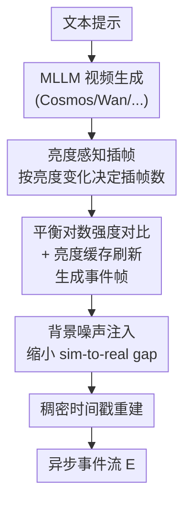

# Texvent: Asynchronous Event Data Simulation via Text Prompt

**会议**: CVPR 2026  
**论文**: [CVF Open Access](https://openaccess.thecvf.com/content/CVPR2026/html/Wang_Texvent_Asynchronous_Event_Data_Simulation_via_Text_Prompt_CVPR_2026_paper.html)  
**代码**: https://github.com/rfww/texvent  
**领域**: 图像生成 / 事件相机仿真  
**关键词**: 事件相机, 文本到事件仿真, 免训练, 帧插值, 多模态大模型

## 一句话总结
Texvent 用文本提示直接生成异步事件相机数据——先用多模态大模型（如 Cosmos）把文本渲染成视频，再用一个全新的免训练物理仿真器把视频转成事件流，靠「亮度感知插帧 + 平衡对数强度对比 + 亮度缓存」三招同时拿到比级联式 baseline 高一截的保真度和接近最快的速度。

## 研究背景与动机
**领域现状**：事件相机（event camera）是仿生视觉传感器，在时延、功耗、动态范围上都远胜传统相机，已成为很多视觉任务的主力。但真实事件数据集采集极难，所以「事件仿真」成了刚需——主流做法是 video-to-event（V2E）：用连续视频帧推算每个像素的亮度变化，超过阈值就触发一个事件。

**现有痛点**：V2E 路线必须先有视频，而视频采集成本高、在视角/运动/光照上扩展性差。于是有人提出 text-to-event（T2E），用文本提示直接生成事件。但已有的 T2E 先驱方法要训练一个「文本编码器 + 扩散模型 + 自编码器」的专用网络，需要海量「文本-事件」配对语料，几乎没法落地，而且只能做手势这类特定域。

**核心矛盾**：一个最朴素的免训练方案是「视频生成器 + 现成 V2E 仿真器」级联，但这条流水线有两个硬伤——① **低效**：插帧时要反复估双向光流，难以支撑需要大量训练数据或实时生成的场景；② **低保真**：现成 V2E 仿真器对「真实事件采集 vs 仿真」之间的物理差异建模不全，导致用合成数据训练的模型泛化差。理想的 T2E 必须同时按住效率和保真这两个点。

**本文目标**：做一个**免训练、通用**的 T2E 框架，既要快、又要仿得像真事件，还要能即插即用接到不同视频生成器和真实相机上。

**切入角度**：作者观察到「插帧数量」和「事件触发」本质上都由亮度变化决定，于是把整条流水线围绕亮度变化重新设计——既用它来决定插多少帧（省掉光流），又用它来更精确地模拟事件相机电路的触发与刷新行为。

**核心 idea**：用 MLLM 渲视频代替真实拍摄，再用一个亮度驱动的物理仿真器把「插帧效率」和「事件触发保真」同时做对，全程不训练。

## 方法详解

### 整体框架
Texvent 输入一段文本提示，输出一串异步事件数据 $E=\{e_i\}_{i=1}^n$，其中每个事件 $e_i=(x_i,t_i,p_i)$ 包含坐标、时间戳和极性。整条流水线分两大块：**高帧率视频生成** 和 **事件数据仿真**。

第一块先用文本到视频的 MLLM 把提示解码成低帧率图像序列 $I_{t\{1:N\}}=D(E(T;\theta_e);\theta_d)$，再用「亮度感知插帧」按需补帧拉高时间分辨率。第二块是核心贡献的物理仿真器：用「平衡对数强度对比」逐像素算亮度变化、超阈值就生成事件帧，其中引入「亮度缓存」来正确模拟参考电压只在事件触发时才刷新的电路行为；之后注入背景活动噪声缩小 sim-to-real gap，最后按亮度变化率重建稠密时间戳，拼成最终事件流。

### 关键设计

**1. 亮度感知插帧：用亮度变化代替光流来决定插几帧**

插帧的核心难题是「该在两帧之间插多少张中间帧」。现有 V2E（VID2E/V2E/ESIM）用双向光流，要求相邻中间帧的位移不超过 1 像素——一旦视频有混乱的光照变化，光流估计就让效率崩掉。Texvent 直接抛掉光流，改用亮度差决定插帧数：相邻两帧 $I_{t_i},I_{t_{i+1}}$ 之间插的中间帧数 $K_i=\max(|L(I_{t_i})-L(I_{t_{i+1}})|)\bmod\delta$，其中 $L(\cdot)$ 是对数亮度、$\delta$ 是对比阈值。亮度有明显变化时就用 RIFE 等距插 $K_i$ 帧拉高时间分辨率；若两帧亮度差低于 $\delta$，说明根本不会触发事件，就**直接不插帧**。这样既保证了事件密集处的时间分辨率，又省掉了静止区域的冗余插帧和全部光流计算，效率因此拉满。

**2. 平衡对数强度对比：给对数亮度加平衡参数 α，修正高低光下不公平的触发灵敏度**

事件相机用对数函数模拟人眼视网膜，但对数曲线天然对低光更敏感：同一个对比阈值下，低光区只要一点点亮度变化就触发事件，高光区却要近四倍的变化才触发。问题是普通视频是低动态范围相机拍的，高光细节本就捕捉不全，于是高光物体几乎仿不出事件。Texvent 在算像素亮度变化时引入平衡参数 $\alpha$，把对数对比写成

$$\prod_{i\in\{0:N-1\}}\prod_{j\in\{1:K_i\}}L(\alpha+I^{j}_{(t_i,t_{i+1})})-L(\alpha+\kappa\diamond I^{j-1}_{(t_i,t_{i+1})})>\delta$$

加上 $\alpha$ 后，高光区只需约两倍于低光的亮度变化即可触发（而非四倍），在保留视网膜生物特性的同时把高低光的触发灵敏度拉平。消融里去掉 $\alpha$，EQS 从 0.8474 掉到 0.8309，说明它对高光边缘的事件恢复确实关键。

**3. 亮度缓存刷新：只在触发处更新参考亮度，杜绝逐帧刷新造成的漏事件**

上面公式里的 $\kappa$ 就是亮度缓存，$\diamond$ 表示亮度更新操作。真实事件相机电路里，参考电压**只有在某像素触发事件时才更新**；如果像现成 V2E 那样直接拿相邻两帧逐帧算差，就等于每帧都刷新参考亮度，会把那些「积累了几帧才够阈值」的潜在事件提前抹掉。Texvent 用缓存 $\kappa$ 存住尚未触发事件的历史亮度，拿当前帧和这个「校准帧」比，而不是和上一帧比，只在真正触发的坐标上才更新参考亮度——和事件相机电路的电压更新行为一致。缓存还会周期性 reset 置空，避免长序列仿真里累出「假事件」。消融显示去掉缓存后很多事件不被触发，EQS 大跌 4.01%，是保真度的主要支柱。

**4. 噪声注入 + 时间戳重建：补齐 sim-to-real gap 与微秒级异步时序**

干净的仿真事件帧只有正负事件，和真实数据差一截，主要差在背景活动（BA）噪声和时间戳。Texvent 不像 VID2E 那样随机抖对比阈值（会误伤真事件），而是注入 Poisson 噪声：$E=E\cdot(1-M)+M\cdot\mathrm{Poisson}(\lambda_1\lambda_2)$，噪声强度按传感器 fill factor 调（不同传感器噪声水平不同），注入位置用 mask $M=(I_{t_{i+1}}<\sigma)\cdot(\Delta L<\delta)$ 优先打到低光背景区（低亮度更易激活噪声），从而不破坏前景真事件。最后重建稠密时间戳：假设固定时间窗内亮度变化越大、事件触发越早，于是

$$t_{x_i}=\gamma\times(t_{i+1}-t_i)\left(1-\frac{\Delta_{x_i}L-\min(\Delta L)}{\max(\Delta L)-\min(\Delta L)}\right)+t_i$$

其中 $\gamma$ 是缩放参数保证微秒级触发。这样每个事件都拿到坐标、极性、连续时间戳，拼成真正异步的事件流。

## 实验关键数据

### 主实验

事件帧（E.F.）与重建图像（R.I.）的质量对比，NT-ImageNet / ECD / DSEC 上评测：

| 指标 | VID2E | V2E | V2CE | DVS-Voltmeter | SENPI | Texvent |
|------|-------|-----|------|---------------|-------|---------|
| MSE↓ (E.F.) | 0.116 | 0.142 | 0.082 | 0.276 | 0.186 | **0.045** |
| SSIM↑ (E.F.) | 0.430 | 0.299 | 0.552 | 0.085 | 0.095 | 0.488 |
| LPIPS↓ (E.F.) | 0.406 | 0.603 | 0.383 | 0.972 | 0.820 | **0.339** |
| SSIM↑ (R.I.) | 0.387 | 0.420 | 0.392 | 0.149 | 0.251 | **0.472** |
| LPIPS↓ (R.I.) | 0.381 | 0.422 | 0.451 | 0.354 | 0.561 | **0.296** |

事件帧上 Texvent 拿到最优 MSE（0.045）和最低 LPIPS（0.339），SSIM 0.488 次优（仅次于 V2CE 的 0.552）；重建图像上 SSIM 和 LPIPS 双第一。

事件质量分（EQS）与单帧对运行时间：

| 指标 | VID2E | V2E | V2CE | DVS-Voltmeter | SENPI | Texvent |
|------|-------|-----|------|---------------|-------|---------|
| EQS↑ | 0.8597 | 0.8138 | 0.8642 | 0.8573 | 0.8824 | **0.8851** |
| Time(s)↓ | 2.1228 | 2.1652 | 0.0950 | 0.6919 | **0.0573** | 0.0653 |

Texvent 拿到最高 EQS（0.8851，比次优 SENPI 高 2.7%），速度第二（0.0653s），仅微差于 SENPI（0.0573s），而 VID2E/V2E 因反复估光流慢了 30 倍以上。

### 消融实验

| 配置 | EQS↑ | 说明 |
|------|------|------|
| Full（Texvent） | 0.8474 | 完整仿真器 |
| w/o 平衡参数 α | 0.8309 | 去掉 α，高光边缘事件恢复变差，掉 0.0165 |
| w/o 亮度缓存 | 0.8073 | 去掉缓存，大量事件漏触发，掉 4.01% |

下游任务（图像重建）增益，仅用 Texvent 增广 **5%** 事件数据，ECD 数据集：

| 方法 | 设置 | PSNR↑ | SSIM↑ | LPIPS↓ | MSE↓ |
|------|------|-------|-------|--------|------|
| E2VID | ✗ → ✓ | 22.11 → 22.85 | 0.590 → 0.632 | 0.310 → 0.279 | 0.0070 → 0.0063 |
| HyperE2VID | ✗ → ✓ | 21.95 → 23.30 | 0.597 → 0.662 | 0.242 → 0.166 | 0.0077 → 0.0061 |

### 关键发现
- **亮度缓存是保真度第一支柱**：去掉它 EQS 掉 4.01%，远超去掉平衡参数（掉 0.0165），印证「只在触发处刷新参考亮度」这个对电路行为的精确建模才是事件保真的根本。
- **效率来自插帧策略**：Texvent 不估光流，比 VID2E/V2E 快 30 倍以上，几乎追平最快的 SENPI，却拿到最高的 EQS——证明亮度感知插帧没有用速度换质量。
- **极少量增广就大幅提升下游**：仅增广 5% 事件数据，HyperE2VID 的 PSNR/SSIM/LPIPS/MSE 分别改善约 6.2%/10.9%/31.6%/20.9%，说明合成数据的统计特性足够接近真实。

## 亮点与洞察
- **把「插帧依据」从光流换成亮度变化**：一个观察——既然事件触发由亮度变化决定，那决定插几帧也该用亮度变化，于是同一个量同时服务于效率（静止区不插帧）和保真（事件密集区高分辨率），一举两得，这是整篇最巧的统一。
- **缓存机制精确对齐硬件电路语义**：用一个可周期 reset 的亮度缓存模拟「参考电压仅在触发时刷新」，把以往 V2E 逐帧算差的物理误差直接修掉，这种「照着真实电路行为建模」的思路可迁移到任何传感器仿真。
- **即插即用、免训练**：仿真器与视频生成器解耦，换 Cosmos / Wan / CogVideoX / Open-Sora 都能用，也能直接接真实 RGB 相机，工程上极易复用。

## 局限性 / 可改进方向
- 保真度上限受**视频生成器质量**钳制：MLLM 渲的视频本身是低动态范围、且可能有内容幻觉，高光信息缺失只能靠 $\alpha$ 缓解而非根治。
- 平衡参数 $\alpha$、噪声参数 $\lambda_1,\lambda_2$、缩放 $\gamma$ 等都是手工设定的超参，⚠️ 原文未充分讨论它们对不同传感器/场景的敏感性，跨域时可能需要重新标定。
- DSEC 上的 warped event / depth 实验里作者也承认，真实事件与对应视频序列存在 misalignment，部分 sim-to-real 差异其实来自数据本身的不对齐而非仿真器。
- 评测主要在 ImageNet 衍生的静态物体场景（NT-ImageNet），对高速运动、复杂多体交互等极端动态场景的仿真保真度还缺验证。

## 相关工作与启发
- **vs Ott et al.（先驱 T2E）**：他们训练「文本编码器 + 扩散 + 自编码器」，需要海量文本-事件配对、只能做手势特定域；Texvent 完全免训练、开放域，靠 MLLM + 物理仿真器拼出来，落地成本和泛化性都更优。
- **vs VID2E / V2E（级联式 V2E）**：它们用双向光流插帧、逐帧算亮度差，慢且漏事件；Texvent 用亮度感知插帧去掉光流（快 30×），用亮度缓存修掉逐帧刷新的漏事件（EQS +4%）。
- **vs DVS-Voltmeter（随机过程建模）**：它把电压变化建成带漂移的布朗运动来增真，但实测呈散乱噪声、破坏自然事件分布（SSIM 仅 0.085）；Texvent 用确定性的平衡对数 + 缓存 + 定向 Poisson 噪声，分布更干净、边界更清晰。

## 评分
- 新颖性: ⭐⭐⭐⭐ 首个免训练通用 T2E 框架，亮度统一插帧/触发的视角很巧
- 实验充分度: ⭐⭐⭐⭐ 帧级/点级/应用级三层评测 + 真实双相机系统验证，较完整
- 写作质量: ⭐⭐⭐⭐ 物理动机讲得清楚，公式与电路行为对应明确
- 价值: ⭐⭐⭐⭐ 即插即用、免训练、可接真实相机，对缓解事件数据稀缺很实用

<!-- RELATED:START -->

## 相关论文

- [\[CVPR 2026\] Generative Anonymization in Event Streams](generative_anonymization_in_event_streams.md)
- [\[CVPR 2026\] Rethinking Prompt Design for Inference-time Scaling in Text-to-Visual Generation](rethinking_prompt_design_for_inference-time_scaling_in_text-to-visual_generation.md)
- [\[ICLR 2026\] Asynchronous Denoising Diffusion Models for Aligning Text-to-Image Generation](../../ICLR2026/image_generation/asynchronous_denoising_diffusion_models_for_aligning_text-to-image_generation.md)
- [\[CVPR 2026\] Semantics Lead the Way: Harmonizing Semantic and Texture Modeling with Asynchronous Latent Diffusion](semantics_lead_the_way_harmonizing_semantic_and_texture_modeling_with_asynchrono.md)
- [\[CVPR 2026\] Mitigating Memorization in Text-to-Image Diffusion via Region-Aware Prompt Augmentation and Multimodal Copy Detection](mitigating_memorization_in_texttoimage_diffusion_v.md)

<!-- RELATED:END -->
