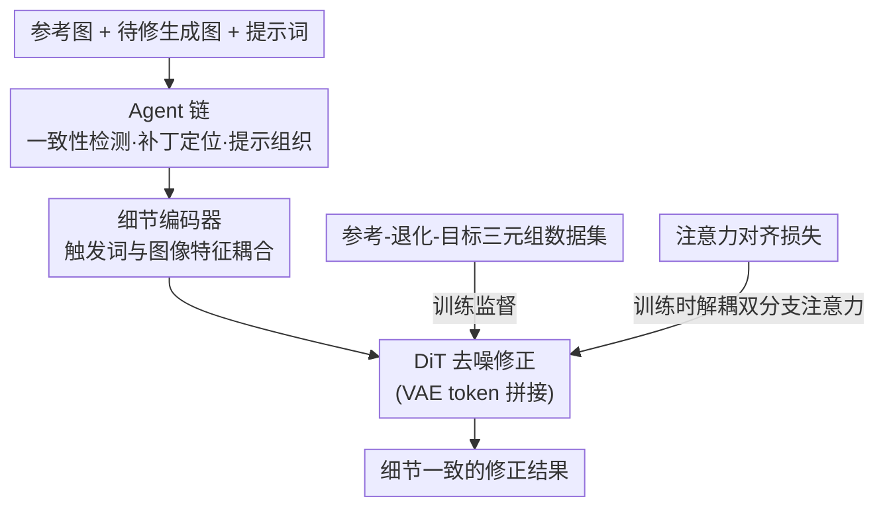

# The Consistency Critic: Correcting Inconsistencies in Generated Images via Reference-Guided Attentive Alignment

**会议**: CVPR 2026  
**论文**: [CVF Open Access](https://openaccess.thecvf.com/content/CVPR2026/html/Ouyang_The_Consistency_Critic_Correcting_Inconsistencies_in_Generated_Images_via_Reference-Guided_CVPR_2026_paper.html)  
**代码**: https://ouyangziheng.github.io/ImageCritic-Page/  
**领域**: 图像生成 / 扩散模型  
**关键词**: 参考引导编辑, 一致性修正, 注意力对齐, 细节编码器, Agent

## 一句话总结
ImageCritic 把"修复定制化生成图里的细节不一致"做成一个参考引导的后编辑任务：先用 VLM 筛选 + Flux-Fill 主动退化构造出 10k 参考-退化-目标三元组数据，再在 Flux Kontext 上引入注意力对齐损失和细节编码器，让模型精准定位并对齐文字、logo 等小细节，并用一套 Agent 链实现一键自动化多轮修正。

## 研究背景与动机
**领域现状**：参考引导生成（虚拟试衣、主体定制、图像编辑）已经从 UNet 演进到 DiT，能很好地保持主体的整体一致性，是当前最热的方向之一。

**现有痛点**：尽管整体主体能对上，但由于 VAE 编解码引入的失真、以及 decoder-only 结构丢失浅层信息，现有模型在**细粒度细节**上常常翻车——文字渲染错误、logo 错位、局部模糊。GPT-4o、Nano-Banana、Qwen-Image、UNO 这些 SOTA 定制模型生成的图，放大看文字/标志区域几乎都不一致。

**核心矛盾**：两个朴素思路都不work。① 用参考引导超分（如 ReFIR）去修模糊区域——结果不一致依然没被纠正，局部甚至更糟；② 用多图编辑模型（如 Qwen-Image）按文字指令修局部——模型根本定位不准要改的细节。作者把失败归因为两点：**缺乏聚焦细粒度细节的高质量数据**（Subjects200K、UNO-1M 等只关心整体一致，忽略局部），以及**模型无法关注、定位并对齐细粒度区域**做精确修正。

**本文目标**：在给定参考图的前提下，把生成图的细粒度一致性（尤其文字、logo）修对，同时不破坏环境、光照、空间关系。

**切入角度**：作者可视化了参考分支和输入分支在噪声区域的注意力图，发现两者**强耦合**——参考 token 和输入 token 在局部生成时给出相互冲突的线索，模型因此要么忽略要么改错。既然问题出在注意力纠缠上，那就用显式监督把它解耦。

**核心 idea**：把一致性修正当成"评论家（Critic）"后编辑——用三元组数据 + 注意力对齐损失 + 细节编码器训出一个能精准定位并对齐细节的修正模型，再用 Agent 链把检测、定位、检索、修复全流程自动化。

## 方法详解

### 整体框架
ImageCritic 以 Flux.1-Kontext-dev 为底座，整条管线分"训练"和"推理"两条线但共享同一个 critic 模型。输入永远是一张待修的定制生成图（input）和一张参考图（reference），目标是把 input 里不一致的细节按 reference 修对。具体流转是：参考图和输入图连同提示词先经过**细节编码器**得到文本 token，这些 token 与 VAE 编码出的图像 token 拼接后送入 DiT 去噪；训练时额外加一个**注意力对齐损失**来解耦并对齐条件输入与噪声目标之间的注意力；推理时由一条 **Agent 链**自动判断哪里不一致、定位补丁、组织提示词，再交给 critic 模型修复。所有训练和推理都用统一的提示模板："Use the object in IMG1 as a reference to be corrected, replace, or enhance the object in IMG2."，其中 IMG1/IMG2 是对应参考图和输入图的触发词。

这套方法的数据是从零造的，所以"参考-退化-目标三元组数据集"本身就是第一个贡献节点。

### 关键设计

**1. 参考-退化-目标三元组数据集：用 VLM 筛选造正样本、用 Flux-Fill 主动造负样本**

针对"缺乏聚焦细节的数据"这个痛点，作者把问题拆成两半：怎么得到一致的参考-目标对，以及怎么造出能反映现有模型真实缺陷的退化图。流程是：先用 Flux Kontext、GPT-4o、Nano-Banana 等 SOTA 文生图模型按多样化 prompt（含物体、场景、人物交互、光照变化）生成场景丰富的图；用 Qwen-VL 按视觉质量和清晰度打分只留 top 样本；再用 Qwen 标注 + Grounding SAM 做检测分割、并用 Qwen 复查过滤 SAM 的 mask 错误，得到高质量参考-目标对。负样本则用 **Flux-Fill 主动退化**：随机选 mask 区域子集喂给 Flux-Fill 去 inpaint 或篡改文字/logo，再用 Qwen 剔掉退化太离谱的，从而精准模拟现有生成模型常见的文字渲染错误和 logo 错位。最终拿到 **10k 高质量三元组**。关键点在于退化不是随手加噪，而是刻意复现"真实生成模型会犯的错"，让监督信号贴近实际部署场景。

**2. 注意力对齐损失（AAL）：用区域掩码显式解耦参考分支与输入分支的注意力**

光在数据上 LoRA 微调底座，模型能理解修哪、但小文字/细粒度区域仍残留输入图的旧元素，一致性不够。根因是作者可视化发现：参考分支和输入分支在噪声区域的注意力**强耦合**，两路 token 给局部生成传冲突线索。他们希望输入 token 负责物体级细节、参考 token 负责背景与光照等全局。为此先定义二值物体掩码 $B(p)=1$（背景）/ $0$（主体），再对两路注意力图加 MSE 对齐项：

$$L_G = \frac{1}{n_l}\sum_{j=0}^{n_l-1}\left\| B\odot N(M_G^j)\right\|_2^2,\quad L_R = \frac{1}{n_l}\sum_{j=0}^{n_l-1}\left\| \bar{B}\odot N(M_R^j)\right\|_2^2$$

其中注意力图 $M = Q_{c_i}K_{tgt}^\top/\sqrt{d}$（$i\in\{R,I\}$ 为参考/输入），$N(\cdot)$ 是 min-max 归一化，$\bar B$ 是 $B$ 的补。总目标 $L = L_{diff} + L_R + L_G$，$L_{diff}$ 是底座的 rectified flow-matching 损失。直观说，$L_G$ 让参考 patch 别去关注前景物体（盯背景），$L_R$ 防止输入 patch 对要修区域施加过度影响。作者还观察到这种集中的强响应只出现在 double stream 层、single block 里条件分支注意力很分散，所以 **AAL 只加在 double stream 块**，$n_l$ 取 double-stream 层数。

**3. 细节编码器（DE）：把触发词 token 与图像特征耦合，解决"两张图共享同一触发词"的歧义**

训练时给两张图分别用 IMG1/IMG2 触发词，但 T5 文本编码器对同一个触发词产出的 latent 在不同输入下是一样的，模型因此无法把不同图像输入和各自触发词关联起来——当输入图和参考图形状略有差异时就会认错对象、生成出错。受 PhotoMaker、DreamO 启发，作者设计细节编码器把触发词 latent 和图像 latent 耦合：取 T5 输出里 IMG1/IMG2 对应的隐状态 $P_R,P_I\in\mathbb{R}^{1\times d_t}$，与 CLIP 提取的图像扁平特征 $C_i\in\mathbb{R}^{1\times d_c}$ 拼成 $P'_i=[P_i;C_i]$，过一个两层 MLP 投回原维得到 $\tilde P_i$，再用它更新提示里对应触发词的隐状态。这样文本触发词和视觉内容被显式绑定，模型能正确分辨"哪张图是参考、哪张是待修"，提升参考一致性。

**4. Agent 链：把一致性评估、不一致定位、参考检索、修复串成一键自动化多轮流程**

实际场景里模型常把参考图压缩，导致细小文字渲染不出来，而用户其实给了高分辨率参考图没被充分利用。为了榨干高清引导、并让交互更直观，作者用 Qwen-Agent 当协调器，把多个专职 agent 串起来：评估内容一致性、识别不一致区域、挑相关参考补丁、总结提示词、最后由 critic 模型修复。系统既能全自动一键修，也支持用户交互式调整输入补丁（比如想重生成某个产品区域的小字，协调器就把请求派给对应 agent 重处理），从而在复杂真实场景里实现多轮人机协同修正。

## 实验关键数据

底座为 Flux.1-Kontext-dev，LoRA rank=128、lr=1e-4，2 卡每卡 batch 4（总 8）训 20000 步；训练后还用 ImageCritic 增强数据集中低一致性的目标，再按相同设置重训一遍。评测在 DreamBench++ 和作者自建的 **CriticBench**（300 张图：200 张复杂多语言产品图 + 100 张服饰配饰）上做，指标为 CLIP-I、DINO（越高越好）、DreamSim（越低越好），对各生成模型修正前后取增量。

### 主实验

CriticBench 上对多种生成模型的输出做一致性修正（修正前 ➟ 修正后）：

| 被修模型 | CLIP-I ↑ | DINO ↑ | DreamSim ↓ |
|--------|------|------|------|
| Sora | 78.7 ➟ 79.6 (+0.9) | 68.4 ➟ 69.2 (+0.8) | 29.1 ➟ 28.7 (-0.4) |
| Nano-Banana | 79.2 ➟ 79.8 (+0.6) | 66.5 ➟ 66.9 (+0.4) | 32.0 ➟ 31.8 (-0.2) |
| XVerse | 76.5 ➟ 79.9 (+3.4) | 68.8 ➟ 71.9 (+3.1) | 34.3 ➟ 31.4 (-2.9) |
| DreamO | 77.8 ➟ 78.1 (+0.3) | 67.7 ➟ 68.2 (+0.5) | 29.6 ➟ 29.2 (-0.4) |
| MOSAIC | 74.6 ➟ 77.1 (+2.5) | 62.6 ➟ 65.0 (+2.4) | 35.2 ➟ 31.4 (-3.8) |
| OmniGen2 | 78.8 ➟ 79.3 (+0.5) | 70.0 ➟ 70.8 (+0.8) | 27.7 ➟ 27.0 (-0.7) |
| UNO | 77.6 ➟ 78.9 (+1.3) | 68.4 ➟ 69.3 (+0.9) | 33.6 ➟ 32.1 (-1.5) |
| Qwen-Image | 77.9 ➟ 78.2 (+0.3) | 69.2 ➟ 69.4 (+0.2) | 30.3 ➟ 30.1 (-0.2) |

DreamBench++ 上同样有稳定提升，对那些原本细节较差的模型增益更明显，例如 Qwen-Image 的 DINO 从 61.8 ➟ 64.9（+3.1）、DreamSim 36.9 ➟ 34.5（-2.4），XVerse 的 DreamSim 36.9 ➟ 34.9（-2.0）。一个值得注意的规律是：**原本一致性差的模型（XVerse、MOSAIC）被修正的幅度大，原本就强的模型（Nano-Banana、Qwen-Image）增量小**，符合"修补短板"的定位。

### 消融实验

在 CriticBench 上对两个核心模块 AAL（注意力对齐损失）与 DE（细节编码器）做消融，报告各方法平均增量：

| AAL | DE | CLIP-I | DINO | DreamSim |
|-----|----|--------|------|----------|
| ✗ | ✗ | +0.3 | +0.4 | -0.2 |
| ✗ | ✓ | +0.7 | +0.7 | -0.9 |
| ✓ | ✗ | +0.7 | +0.9 | -0.9 |
| ✓ | ✓ | **+1.3** | **+1.2** | **-1.7** |

另外作者把 Agent 链自动定位的补丁框和人工标注框比对：

| 指标 | Mean IoU (%) | mAP@50 (%) |
|------|------|------|
| Agent 链 vs 人工 | 75.3 | 88.4 |

### 关键发现
- **数据集本身就有效**：只在三元组数据上 LoRA 微调底座（AAL/DE 全关）就已带来正增益（CLIP-I +0.3），验证了"造对数据"是基础。
- **两个模块互补且有协同**：AAL 和 DE 单独加各有提升，但同时加才出现明显跃升（DreamSim 从 -0.9 跳到 -1.7），说明"解耦注意力"和"绑定触发词-图像"解决的是两类不同问题。
- **注意力解耦可视化**：AAL 让 double stream 层里参考/输入两路注意力分别集中到背景/物体区域，注意力图从耦合变解耦，这是细节修对的直接证据。
- **Agent 链定位够准**：mAP@50 达 88.4%，说明自动定位要修区域的能力接近可用，多轮自动修正不是噱头。

## 亮点与洞察
- **把"修一致性"重新定义为后编辑任务**很巧：不去重训生成模型，而是做一个即插即用的 critic，对任意开源/闭源模型（Sora、Nano-Banana、Qwen-Image…）的输出都能补刀，泛化面广。
- **主动退化造负样本**是数据侧最聪明的一手：用 Flux-Fill 刻意复现"真实模型会犯的文字/logo 错误"，比随机加噪更贴合分布，让监督信号有的放矢。
- **从注意力可视化反推损失设计**：先看到双分支注意力耦合这个现象，再针对性地用区域掩码做 MSE 对齐，而且只加在响应集中的 double stream 层——这种"先诊断再开方"的设计逻辑可迁移到其他多条件注入的 DiT 任务。
- **触发词歧义问题**点得很实：T5 对同一触发词输出固定 latent，导致多图输入认错对象，用 CLIP 特征耦合触发词隐状态来破解，这个 trick 对任何"多参考图+触发词"的定制框架都适用。

## 局限与展望
- 增量绝对值偏小：对本就强的模型（Nano-Banana、Qwen-Image），CLIP-I/DINO 提升往往只有 +0.2~+0.6，说明 critic 的收益主要集中在"短板模型"，对头部模型边际有限。
- 依赖底座能力：整套构建在 Flux Kontext 上，注意力对齐的"double stream 才集中"这一观察是否对其他 DiT 架构成立、AAL 该加在哪些层，需要重新诊断，迁移成本不低。⚠️ 论文未给出跨底座的验证。
- 数据与评测都偏产品/文字/logo 场景（CriticBench 以多语言产品图、服饰配饰为主），对人脸、复杂非刚体等更难场景的鲁棒性主要靠定性图展示，定量覆盖有限。
- Agent 链虽然 mAP@50 高，但整条链由 Qwen-Agent + 多个专职 agent + critic 串成，推理成本和延迟、以及 agent 误判时的失败模式都没有量化讨论。

## 相关工作与启发
- **vs 参考引导超分（ReFIR）**：超分只把模糊区域变清晰，但不纠正"内容本身就错"的不一致，局部甚至更糟；ImageCritic 是按参考做语义级修正，能改对文字/logo 内容而非单纯提清晰度。
- **vs 多图编辑模型（Qwen-Image）**：靠文字指令修局部，定位不准；ImageCritic 用 Agent 链自动定位补丁 + AAL 显式对齐注意力，解决"找不准、改不对"。
- **vs 主体一致性方法（DreamO 的 router、XVerse 的 text-stream 调制、MOSAIC 的区域语义点约束）**：这些都在生成阶段增强整体主体一致性，但忽略细粒度细节；ImageCritic 定位在它们之后做后编辑补刀，且对它们的输出都能带来增益（表 1/2 里 XVerse、MOSAIC 增幅最大）。

## 评分
- 新颖性: ⭐⭐⭐⭐ 把一致性修正定义成参考引导后编辑，并从注意力可视化反推出 AAL，角度新且诊断扎实
- 实验充分度: ⭐⭐⭐⭐ 覆盖 8 个开闭源模型 + 两个 benchmark + 模块消融 + agent 定位评测，但增量绝对值偏小、跨底座未验证
- 写作质量: ⭐⭐⭐⭐ 问题—诊断—方案的叙事清晰，图示（注意力对比、数据管线）到位
- 价值: ⭐⭐⭐⭐ 即插即用 critic 对任意定制模型补刀，工程实用性强，CriticBench 也是有用资源

<!-- RELATED:START -->

## 相关论文

- [\[CVPR 2026\] HiFi-Inpaint: Towards High-Fidelity Reference-Based Inpainting for Generating Detail-Preserving Human-Product Images](hifi-inpaint_towards_high-fidelity_reference-based_inpainting_for_generating_det.md)
- [\[AAAI 2026\] Beautiful Images, Toxic Words: Understanding and Addressing Offensive Text in Generated Images](../../AAAI2026/image_generation/beautiful_images_toxic_words_understanding_and_addressing_offensive_text_in_gene.md)
- [\[NeurIPS 2025\] Detecting Generated Images by Fitting Natural Image Distributions](../../NeurIPS2025/image_generation/detecting_generated_images_by_fitting_natural_image_distributions.md)
- [\[CVPR 2026\] Re-Align: Structured Reasoning-guided Alignment for In-Context Image Generation and Editing](re-align_structured_reasoning-guided_alignment_for_in-context_image_generation_a.md)
- [\[CVPR 2026\] SimLBR: Learning to Detect Fake Images by Learning to Detect Real Images](simlbr_learning_to_detect_fake_images_by_learning_to_detect_real_images.md)

<!-- RELATED:END -->
