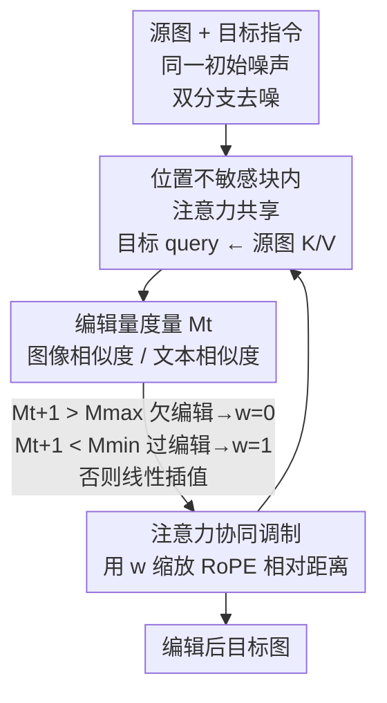

# The Devil is in Attention Sharing: Improving Complex Non-rigid Image Editing Faithfulness via Attention Synergy

**会议**: CVPR 2026  
**论文**: [CVF Open Access](https://openaccess.thecvf.com/content/CVPR2026/html/Chen_The_Devil_is_in_Attention_Sharing_Improving_Complex_Non-rigid_Image_CVPR_2026_paper.html)  
**代码**: [项目页](https://synps26.github.io/)  
**领域**: 扩散模型 / 图像编辑  
**关键词**: 非刚性图像编辑, 注意力共享, 位置编码, RoPE, 免训练编辑

## 一句话总结
针对免训练非刚性图像编辑中「注意力坍塌」的问题，本文提出 SynPS：先用图像相似度/文本相似度之比量化每步该编多少，再据此**动态缩放注意力共享里 RoPE 的相对距离**，在「保留原图结构」与「跟随目标语义」之间逐步自适应平衡，在 PIE-Bench 与自建基准上把 MLLM 评分大幅刷到新 SOTA。

## 研究背景与动机
**领域现状**：基于 FLUX 这类 RoPE-based MM-DiT 的免训练图像编辑已经实用化——不需微调、不需数据集，只要给一张源图 + 一句目标指令就能改图。要让目标图既改对语义又别破坏源图外观，主流做法是**注意力共享（attention sharing）**：在生成目标图时，让目标 token 当 query，去源图的 key/value 里检索视觉内容，从而把源图外观「搬」到目标图上。

**现有痛点**：共享时「query 里要不要带位置编码」直接决定成败，而两条路都翻车。FreeFlux 这类**保留 RoPE** 的做法，会让 query 只关注空间上相邻的 token——比如想编辑马眼时却 attend 到旁边女人的胳膊，结果生成一张和源图几乎一样、**编辑没生效的复制图（过度保真 / under-editing）**。CharaConsist 这类**去掉/重映射位置**、纯靠语义特征当 query 的做法，又会丢掉结构信息、被目标 prompt 带跑，**源图外观保不住（over-editing）**，源图和预生成目标图布局不一致时尤其明显。

**核心矛盾**：作者把这两类失败统称为**注意力坍塌（attention collapse）**——注意力要么坍塌到位置编码（只看空间近邻）、要么坍塌到语义（被 prompt 主导）。一旦在去噪过程中发生，就很难恢复。位置信号（来自源图、管保真）和语义信号（来自目标 prompt、管编辑）本质是一对此消彼长的力，固定地全用或全不用都不对。

**切入角度**：作者发现不同编辑指令、甚至同一指令的不同去噪步，对「位置 vs 语义」的依赖程度是变化的——所以注意力共享应该是 **prompt-adaptive 且逐步可调**的，而不是像以往工作那样全程用一套固定策略。关键在于：**何时、以及如何**引入位置编码。

**核心 idea**：用一个可量化的「编辑量度量」实时判断当前是 over- 还是 under-editing，再用一个 $[0,1]$ 的权重 $w$ **连续地缩放 RoPE 的相对位移**，在「完全位置感知」和「完全位置无关」之间平滑滑动，让位置与语义协同（Synergy of Positional embedding and Semantics，即 SynPS）。

## 方法详解

### 整体框架
SynPS 是一个**免训练、推理期**的注意力共享改造，骨干是 FLUX.1-dev。整个编辑过程双分支并行去噪：源分支用源 prompt、目标分支用目标 prompt，且两者**用同一份初始噪声**（消除 inversion 误差的干扰）。在 FreeFlux 标定的「位置不敏感块」里做注意力共享——目标 query 去 attend「目标文本 key + 源图 key」的拼接序列，从而把源图外观注入目标图。

SynPS 在这个共享回路上加了一个**闭环控制**：每一步去噪时，先用源/目标两分支注意力输出的文本 token 与图像 token 各算一个余弦相似度，二者相除得到一个**编辑量度量 $M_t$**；下一步就用 $M_{t+1}$ 通过一个分段线性函数算出权重 $w$；这个 $w$ 直接去**缩放 RoPE 注入时用的 position ID**，等价于按比例缩短/拉伸 token 间的相对距离。$M$ 偏大（图像太像源、编辑不足）就把 $w$ 推向 0、丢掉位置约束放开多样性；$M$ 偏小（偏离源太多、过度编辑）就把 $w$ 推向 1、用满位置约束拉回保真；居中则线性插值。如此逐步把编辑量度量「稳在 1 附近」。

### 关键设计

**1. 编辑量度量 $M_t$：用一个比值实时判断当前是过度编辑还是编辑不足**

痛点是：以往方法全程用固定策略，根本不知道「现在编多了还是编少了」，没有任何反馈信号。SynPS 受 DeltaEdit 启发，在每个时间步 $t$、每个 transformer 块 $l$ 上，分别对源/目标分支的注意力输出取**文本 token** 和**图像 token**，算两个余弦相似度：文本相似度 $S^l_{txt,t}=\cos\!\big(\text{Attn}^{l,src}_{txt,t},\,\text{Attn}^{l,tgt}_{txt,t}\big)$ 衡量 prompt 想要多大改动（越大说明目标语义和源越接近、需要编的越少），图像相似度 $S^l_{img,t}=\cos\!\big(\text{Attn}^{l,src}_{img,t},\,\text{Attn}^{l,tgt}_{img,t}\big)$ 衡量当前目标图视觉上还多像源图。编辑量度量取二者之比、再对全部 $L$ 个块求平均：

$$M_t = \frac{1}{L}\sum_{l=1}^{L}\frac{S^l_{img,t}}{S^l_{txt,t}}.$$

直觉上，$M_t$ 大 = 图像还很像源、但文本要求改得多 → **欠编辑（under-editing）**；$M_t$ 小 = 图像已经偏离源太多 → **过度编辑（over-editing）**。理想状态是 $M_t\approx 1$（图像变化幅度恰好匹配文本要求）。这个标量把抽象的「编辑得对不对」变成了一个可监控、可反馈的信号——这是后续动态调制的前提。

**2. 注意力协同调制：用权重 $w$ 缩放 RoPE 的相对距离，在位置感知与位置无关之间连续滑动**

痛点是：以往要么带 RoPE（坍塌到空间近邻、复制源图）、要么不带 RoPE（坍塌到 prompt 语义、丢源外观），是非黑即白的二选一。SynPS 的关键观察是：RoPE 编码的是 token 间的**相对位移**而非绝对坐标——query $[Q]_{i,j}$ 与 key $[K]_{i',j'}$ 的注意力分数只依赖位移 $(i'-i,\,j'-j)$：

$$\big\langle\text{RoPE}([Q]_{i,j},i,j),\,\text{RoPE}([K]_{i',j'},i',j')\big\rangle = [Q]_{i,j}^\top R_{i'-i,\,j'-j}[K]_{i',j'}.$$

于是引入缩放因子 $w\in[0,1]$，**直接把 query/key 的 position ID 乘以 $w$**，等价于把相对旋转角、也就是有效相对距离缩放为 $w\cdot(i'-i,\,j'-j)$。$w=1$ 时位置编码完整保留（最大程度抑制语义带来的形变，偏保真）；$w=0$ 时位置编码被抹平、注意力变成完全位置无关（偏编辑）；中间值则是二者的连续谱。这把「带不带 RoPE」从开关变成了**旋钮**，让位置约束可以被按需、按量地施加。

**3. 分段线性的自适应权重：把度量 $M_{t+1}$ 翻译成下一步该用多强的位置约束**

有了度量和旋钮，还需要把二者连起来——怎么从 $M$ 决定 $w$。SynPS 用两个阈值 $M_{min}$、$M_{max}$ 构造一个分段线性映射，用**上一步**算出的 $M_{t+1}$ 来设定当前步的 $w$：

$$w = \begin{cases} 0, & M_{t+1} > M_{max}\ (\text{欠编辑，放开})\\[2pt] 1, & M_{t+1} < M_{min}\ (\text{过编辑，拉回})\\[2pt] \dfrac{M_{max}-M_{t+1}}{M_{max}-M_{min}}, & \text{otherwise}. \end{cases}$$

当图像相似度明显超过文本相似度（$M_{t+1}>M_{max}$，编辑不足）就彻底去掉位置约束（$w=0$）放开多样性、保证跟随指令；当图像偏离过大（$M_{t+1}<M_{min}$，过度编辑）就上满位置约束（$w=1$）把结果拉回保真；区间内则平滑插值，做到细粒度自适应。实验里 $M_{max}=1$、$M_{min}=0.9$。整个机制免训练、只在采样循环里加几行，却能让 $M_t$ 全程稳在 1 附近，从根上缓解注意力坍塌。

### 损失函数 / 训练策略
本方法**完全免训练**，无任何损失函数或微调。骨干 FLUX.1-dev，50 步采样、guidance scale 3.5，注意力共享只在 FreeFlux 标定的位置不敏感块内进行；源/目标分支共用初始噪声以消除 inversion 误差。唯二超参是阈值 $M_{min}=0.9$、$M_{max}=1.0$。

## 实验关键数据

### 主实验
在 PIE-Bench 的 ChangePose 子集（40 对非刚性编辑指令）与自建的 Non-Rigid Editing Benchmark（200 对、由 GPT-5 生成，涵盖姿态/体型/表情/视角变化）上评测。指标含三个 MLLM 评判分（GPT-4o / GPT-5 / Gemini-2.5-Pro，越高越好）与 CLIP 文本对齐分 $\text{CLIP}_{txt}$。

| 方法 | PIE GPT-4o↑ | PIE GPT-5↑ | PIE Gemini↑ | PIE CLIPtxt↑ | Bench GPT-5↑ | Bench Gemini↑ | Bench CLIPtxt↑ |
|------|------|------|------|------|------|------|------|
| RF-Solver-Edit | 6.03 | 4.33 | 2.98 | 0.2664 | 5.59 | 4.24 | 0.2320 |
| FlowEdit | 4.82 | 2.81 | 1.32 | 0.2590 | 3.11 | 2.71 | 0.2260 |
| StableFlow | 4.81 | 3.40 | 2.85 | 0.2648 | 5.02 | 4.26 | 0.2287 |
| FreeFlux（基线） | 5.60 | 4.72 | 3.24 | 0.2614 | 5.97 | 4.23 | 0.2291 |
| CharaConsist | 6.32 | 4.84 | 3.49 | 0.2649 | 5.53 | 3.73 | 0.2329 |
| **SynPS（本文）** | **6.99** | **5.82** | **4.17** | **0.2683** | **6.66** | **5.43** | **0.2344** |

SynPS 在所有 MLLM 评判上全面领先：在 PIE-Bench 上 Gemini-2.5-Pro 分相对 FreeFlux 基线提升 28.6%、比第二名 CharaConsist 高 19.3%。CLIP 指标上，FreeFlux 因偏向复制源图而 $\text{CLIP}_{img}$ 虚高但 $\text{CLIP}_{txt}$ 差，CharaConsist 反之；SynPS 在两者间取得更平衡的折中（⚠️ $\text{CLIP}_{img}$ 因「平凡复制源图也能刷高」存在口径争议，原文在补充材料里单独讨论，正文以 $\text{CLIP}_{txt}$ 为主）。

### 消融实验
在自建 Non-Rigid Editing Benchmark 上从「固定种子的 FLUX 默认」逐步加组件（Gemini-2.5-Pro 分）：

| 配置 | 设置 | Gemini↑ | 说明 |
|------|------|------|------|
| Fix Seed FLUX Default | – | 2.35 | 完全不共享，编辑发散 |
| + Attention Sharing | w/ RoPE ($w{=}1$) | 4.23 | 加共享带位置，仍易复制源 |
| + Attention Sharing | w/o RoPE ($w{=}0$) | 4.79 | 去位置更跟随语义，但仍有坍塌 |
| + SynPS 自适应 $w$ | $M_{min}{=}0.8,M_{max}{=}1.0$ | 5.21 | 自适应已超固定策略 |
| **+ SynPS 自适应 $w$** | $M_{min}{=}0.9,M_{max}{=}1.0$（本文） | **5.43** | 最优阈值组合 |

### 关键发现
- **固定策略两头都不到位**：纯带 RoPE（4.23）和纯不带 RoPE（4.79）都明显弱于自适应的 SynPS（5.43）——证明「位置 vs 语义」确实需要逐步动态调，而非全程一套。
- **自适应权重是涨点主力**：从固定 $w$ 切到由 $M$ 控制的自适应 $w$，Gemini 分从 4.79 提到 5.43，验证了「编辑量度量 → 权重」这条闭环的有效性。
- **度量曲线印证机制**：在 200 个 case 上统计 $M_t$ 随时间步的轨迹，SynPS 全程贴近 1，而 FreeFlux 上漂（欠编辑）、w/o RoPE 下沉到 1 以下（过编辑），且 SynPS 曲线方差更小、跨样本更稳。
- **可解释的连续过渡**：把 $w$ 从 1 插值到 SynPS 权重，目标图会从「复制源结构」平滑过渡到「保留语义、跟随 prompt」（如人脸朝向从正面转到侧面、表情从微笑变惊讶），说明 $w$ 的物理含义清晰可控。

## 亮点与洞察
- **把「带不带位置编码」从开关变成旋钮**：通过缩放 position ID 来连续调 RoPE 的相对距离，构造出「位置感知 ↔ 位置无关」的连续谱——一个极简却切中要害的参数化，免训练即可插入任意 RoPE-based DiT。
- **用一个标量比值闭环控制生成**：$M_t = S_{img}/S_{txt}$ 把抽象的「编辑过头/不足」量化成可监控信号，并直接驱动下一步的位置约束强度，是把诊断指标变成控制信号的漂亮范例。
- **诊断先于设计**：论文先把 over-/under-editing 统一归因为「注意力坍塌」并用注意力图可视化坐实（带 RoPE 坍塌到空间近邻、不带 RoPE 坍塌到 prompt 语义），方法完全顺着这个诊断长出来，可读性极强。
- **可迁移思路**：「实时算一个相似度比值 → 自适应调某个推理期旋钮」这套闭环可迁移到其它需要在保真与编辑间权衡的任务（如视频编辑、风格迁移的强度自适应）。

## 局限与展望
- **依赖双阈值与人工标定块集**：$M_{min}/M_{max}$ 需经验设定（0.9/1.0），且只在 FreeFlux 预先标定的「位置不敏感块」里共享，块集的迁移性与阈值鲁棒性未充分探讨。
- **绑定 RoPE-based MM-DiT**：机制建立在「缩放 RoPE 相对距离」上，对 SD3 这类只在输入层加位置编码、或非 RoPE 架构未必直接适用。
- **评测口径争议**：$\text{CLIP}_{img}$ 因「复制源图可虚高」被各家做不同处理，主观 MLLM 评分也有随机性（虽已用温度 0、三次取均），绝对分数跨方法比较需谨慎。
- **延迟反馈**：用 $M_{t+1}$（上一步统计）来设当前步 $w$ 存在一步滞后，剧烈编辑场景下是否够及时值得进一步分析（⚠️ 原文未量化此影响）。

## 相关工作与启发
- **vs FreeFlux**：同样在位置不敏感块做注意力共享，但 FreeFlux **固定保留 RoPE**，导致 query 只关注空间近邻、复制源图（欠编辑、$\text{CLIP}_{img}$ 虚高）；SynPS 把 RoPE 强度变成由编辑量度量动态调制的 $w$，PIE-Bench Gemini 分相对其提升 28.6%。
- **vs CharaConsist**：CharaConsist 按源图与预生成目标图的语义对应**重映射位置编码**，但布局不一致时对应错位、被目标语义主导、丢源外观；SynPS 不依赖跨图对应，而是用相似度比值自适应控制位置约束强度，避免了错位带来的非预期修改。
- **vs MasaCtrl / DiTCtrl**：这些经典注意力共享方法把源 K/V 注入以保一致性，但主要面向保结构的编辑（增删/替换/风格）；SynPS 专攻 Imagic 提出的**非刚性编辑**（姿态/布局/体型大改），核心增量是显式缓解共享过程中的注意力坍塌。

## 评分
- 新颖性: ⭐⭐⭐⭐ 把「注意力坍塌」诊断清楚并用「缩放 RoPE 相对距离 + 相似度比值闭环」解决，切口新且优雅。
- 实验充分度: ⭐⭐⭐⭐ 两基准 + 三 MLLM + CLIP + 度量曲线 + 插值可视化，消融清晰；CLIP 口径争议与 MLLM 主观性略减分。
- 写作质量: ⭐⭐⭐⭐⭐ 诊断—方法—验证逻辑环环相扣，注意力图与度量曲线把「为什么有效」讲得很透。
- 价值: ⭐⭐⭐⭐ 免训练、即插即用、刷新非刚性编辑 SOTA，对 RoPE-based DiT 编辑实践有直接参考价值。

<!-- RELATED:START -->

## 相关论文

- [\[CVPR 2026\] Gated Condition Injection without Multimodal Attention: Towards Controllable Linear-Attention Transformers](gated_condition_injection_without_multimodal_attention_towards_controllable_line.md)
- [\[CVPR 2026\] Towards Robust Sequential Decomposition for Complex Image Editing](towards_robust_sequential_decomposition_for_complex_image_editing.md)
- [\[CVPR 2026\] FlowDC: Flow-Based Decoupling-Decay for Complex Image Editing](flowdc_flow-based_decoupling-decay_for_complex_image_editing.md)
- [\[CVPR 2026\] CompBench: Benchmarking Complex Instruction-guided Image Editing](compbench_benchmarking_complex_instruction-guided_image_editing.md)
- [\[CVPR 2026\] Anchoring and Rescaling Attention for Semantically Coherent Inbetweening](anchoring_and_rescaling_attention_for_semantically_coherent_inbetweening.md)

<!-- RELATED:END -->
