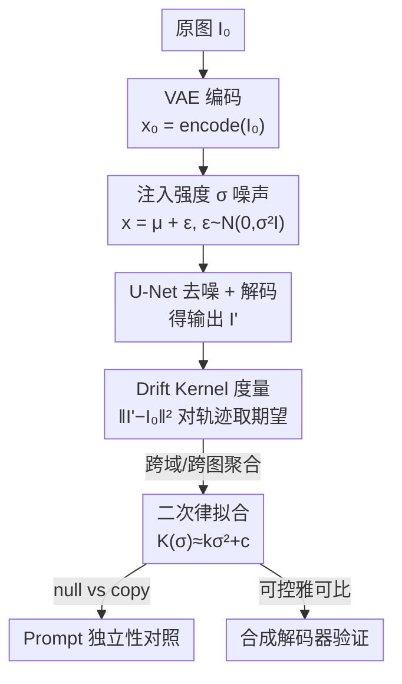

# The Drift Kernel: Why Diffusion Models Change Even When Told Not To

**会议**: CVPR 2026  
**论文**: [CVF Open Access](https://openaccess.thecvf.com/content/CVPR2026/html/Ram_The_Drift_Kernel_Why_Diffusion_Models_Change_Even_When_Told_CVPR_2026_paper.html)  
**代码**: 有（NoOp-Bench，作者承诺随论文释出）  
**领域**: 扩散模型  
**关键词**: No-Op Drift、Drift Kernel、身份保持、解码器雅可比、扩散稳定性

## 一句话总结
当你让扩散模型「什么都别改」时它仍会悄悄改动输入，本文把这种「空操作漂移」量化成一个随噪声强度 $\sigma$ 二次增长的 **Drift Kernel** $K_M(\sigma)\approx k_M\sigma^2+c_M$，并从解码器雅可比的一阶 Taylor 展开给出理论根因、在 12 万对图像上实测验证，证明漂移是解码器结构属性而非 prompt 措辞问题。

## 研究背景与动机
**领域现状**：扩散模型（SD1.5/SD2.1/SDXL/InstructPix2Pix）被广泛用于图像编辑。许多编辑/反演方法（Prompt-to-Prompt、Null-text inversion、SDEdit）都隐含一个假设：只要给「空指令」或精确反演，未被编辑的区域就能保持身份不变。

**现有痛点**：作者发现这个假设是错的——即便 prompt 明确写「make no change / do nothing / identity」，模型输出相对原图仍有可测的感知偏差。也就是说「静止从来不是真正的静止」。以往工作只关心生成质量或身份保持编辑，**没有人系统量化过这种「空操作下的身份漂移」**，更没解释它从哪来。

**核心矛盾**：漂移到底是 prompt 语义没说清（可以靠 prompt engineering 修），还是扩散去噪过程本身的结构性产物（无论怎么写 prompt 都消不掉）？这两种解释指向完全不同的应对策略。

**本文目标**：(1) 定义一个可度量、模型无关的「漂移」标量；(2) 找出它随什么变化、服从什么规律；(3) 证明它是结构性的还是 prompt 引起的；(4) 给出可复现的 benchmark。

**切入角度**：把扩散反向过程的不可消除方差，看成被解码器 $D$ 放大后投射到像素空间的偏差。既然方差注入是高斯的、解码器近似可微，那么用一阶 Taylor 展开就能预测漂移如何随噪声强度缩放——这是一个可以从第一性原理推导、再用实验证伪的假设。

**核心 idea**：用一个 **Drift Kernel** $K_M(\sigma)=\mathbb{E}[\lVert I'-I_0\rVert_2^2\mid\sigma]$ 把「空操作漂移」抽象成噪声强度的函数，并证明对方差驱动模型它服从 $\sigma^2$ 二次律、系数 $k_M=\mathrm{Tr}(J_DJ_D^\top)$ 只由解码器雅可比决定，从而把「漂移消不掉」归因到解码器几何而非条件信号。

## 方法详解
本文不是提出新模型，而是提出一个**分析框架 + 度量协议**：先把漂移定义成核函数，从解码器一阶展开推出 $\sigma^2$ 二次律，再用一条标准化的度量流水线在四个模型、四个域、12 万对图像上实测，最后用对照实验（null vs copy prompt）和合成解码器证明这条律是**机制性**的。

### 整体框架
输入一张原图 $I_0$，在固定噪声强度 $\sigma$ 下、用「空指令」prompt 跑一遍 image-to-image 扩散，得到输出 $I'$；漂移定义为像素空间的平方偏差 $\lVert I'-I_0\rVert_2^2$，对随机去噪轨迹取期望就得到核 $K_M(\sigma)$。整条度量流水线是：图像经 VAE 编码到隐空间 $x_0$ → 注入强度 $\sigma$ 的噪声 → U-Net 去噪 → 解码回像素得 $I'$ → 计算漂移度量 → 跨样本聚合成核曲线并拟合二次系数 $k_M,c_M$。理论侧的关键一步是：被注入的隐空间方差**无法被反向过程完全抵消**，残余方差经解码器雅可比 $J_D$ 放大后变成 $\sigma^2$ 缩放的像素偏差。

### 关键设计

**1. Drift Kernel 定义与 $\sigma^2$ 二次律推导：把「漂移」变成可推导可预测的标量**

针对的痛点是「漂移」此前只是一个模糊的视觉现象，无法量化、无法预测。作者先把它定成核 $K_M(\sigma)=\mathbb{E}[\lVert I'-I_0\rVert_2^2\mid\sigma]$，期望对随机去噪轨迹取。核心理论结果（Proposition 1）是：对解码器为 $D$ 的扩散模型，期望漂移满足

$$K_M(\sigma)=\mathrm{Tr}(J_DJ_D^\top)\,\sigma^2+c.$$

推导思路很干净：前向过程注入高斯噪声 $q(x_t\mid x_0)=\mathcal{N}(\sqrt{\bar\alpha_t}x_0,(1-\bar\alpha_t)I)$，反向过程无法完全消除这部分方差，残余记为 $x_t=\mu+\epsilon,\ \epsilon\sim\mathcal{N}(0,\sigma^2 I)$。对解码器在均值隐变量 $\mu$ 处做一阶 Taylor 展开 $I'=D(\mu+\epsilon)\approx D(\mu)+J_D(\mu)\epsilon$，对 $\epsilon$ 取期望得 $\mathbb{E}[\lVert J_D\epsilon\rVert_2^2]=\mathrm{Tr}(J_DJ_D^\top)\sigma^2$，再加上与强度无关的常数项 $c$。于是定义 **drift-sensitivity 系数** $k_M=\mathrm{Tr}(J_DJ_D^\top)$，它度量解码器对隐空间扰动的总平方敏感度。这个推导的妙处在于：$J_D$ 是模型架构属性、与 prompt 无关，所以它直接解释了为什么 prompt 措辞改不掉漂移——方差放大发生在解码器，条件信号只影响去噪过程的**均值**，影响不了由解码器几何决定的**方差结构**。

**2. NoOp-Bench 大规模度量协议：让「漂移消不掉」从轶事变成统计事实**

针对的痛点是单张可视化对比说服力弱、无法排除是个别样本或某个 prompt 的偶然。作者构建标准化协议：四个架构 SD1.5(860M,512²)、SD2.1(860M,768²)、SDXL(2.6B,1024²)、InstructPix2Pix(860M,512²)；固定 15 步 DDIM、guidance=5.0、strength=0.3、seed=42；用三条空 prompt（"make no change" / "identity" / "do nothing"）。基线规模 12 万对（1 万图 × 3 空 prompt × 4 模型，每模型 3 万输出），强度扫描在 100 图子集上跑 $\sigma\in\{0.1,0.2,0.3,0.4\}$ 得 4800 样本。度量同时报告 MSE/MAE/PSNR/SSIM。这套协议的价值在于：它把「核是否真的二次」变成一个可统计检验的问题——虽然单模型分桶拟合 $R^2$ 只有 0.10–0.26（因每个强度桶只有 25 张图、测量噪声主导），但跨域跨图聚合后 $\sigma^2$ 律清晰浮现，聚合 $R^2=0.97$。

**3. Prompt 独立性对照（null vs copy）：证明漂移是结构性的而非措辞问题**

针对的痛点是有人会反驳「空 prompt 说得不够强，写详细点就不漂移了」。作者设计严格的「拷贝 prompt」对照——三条明确要求逐像素保持的强指令，作为「用户意图清晰度的上界」。如果漂移源自去噪过程本身，那么 null 和 copy 应该产生几乎相同的核；如果源自 prompt 语义，强 prompt 应显著压低漂移。实测结果是：方差驱动模型的 $k_M$ 在 null 与 copy 之间相差 < 17%（SD15 仅差 0.4%、SDXL 8.5%、SD21 最大 17%），$R^2$ 都保持 > 0.96。这直接坐实了「再详细的指令也消不掉漂移」，与设计 1 的理论解释（方差放大独立于条件）形成闭环。

**4. 合成解码器验证与两种 regime：证明二次律来自解码器架构而非数据集伪影**

针对的痛点是实测的二次趋势可能只是真实数据集的巧合。作者反过来**人工构造雅可比可控的解码器**来验证机制：线性解码器 $D(x)=Ax$ 完美复现理想二次形 $K(\sigma)=\mathrm{Tr}(AA^\top)\sigma^2$，$R^2=0.9999$；带曲率的解码器 $D(x)=Ax+\gamma\tanh(Bx)$ 仍保留二次趋势（$R^2>0.99$），说明非线性不破坏 $\sigma^2$ 缩放；而「编辑偏置」解码器把关系**压平**（$R^2<0.1$），正好复现实践中观测到的两种 regime。这解释了为什么 InstructPix2Pix 表现独特：指令微调让编辑方向主导条件信号，cross-attention 层的雅可比范数更大、独立于 $\sigma$ 地放大条件噪声，于是它的核**均值平坦但方差很高**（漂移随强度只涨 8%，而 SD15 涨 207%），属于「编辑驱动」regime，与 SD 系的「方差驱动」regime 本质不同。

## 实验关键数据

### 主实验
strength=0.3、12 万对比较下各模型的基线漂移（mean ± std）：

| 模型 | MSE ↓ | MAE | PSNR ↑ | SSIM ↑ | regime |
|------|-------|-----|--------|--------|--------|
| SD1.5 | 0.0059 ±0.0061 | 0.0452 | 24.52 | 0.6976 | 方差驱动 |
| SD2.1 | 0.0069 ±0.0064 | 0.0511 | 23.27 | 0.6654 | 方差驱动 |
| SDXL | 0.0085 ±0.0072 | 0.0579 | 22.05 | 0.6304 | 方差驱动 |
| InstructPix2Pix | 0.0052 ±0.0071 | 0.0426 | 25.89 | 0.7802 | 编辑驱动 |

关键观察：**没有任何模型在空操作下完美保持身份**；SDXL 漂移均值最大（0.0085），印证「更大模型放大方差更多」；InstructPix2Pix 均值最低（0.0052）但方差很高（±0.0071），是另一种漂移机制。

### 二次律拟合与 prompt 独立性
强度扫描下拟合 $K_M(\sigma)\approx k_M\sigma^2+c_M$，并对比 null vs copy prompt：

| 模型 | prompt | $k_M$ | $c_M$ | $R^2$ | null↔copy 差异 |
|------|--------|-------|-------|-------|----------------|
| SD15 | null / copy | 0.0345 / 0.0346 | 0.0028 | 0.9605 / 0.9595 | 0.4% |
| SD21 | null / copy | 0.0685 / 0.0801 | 0.0016 / 0.0013 | 0.9790 / 0.9761 | 17.0% |
| SDXL | null / copy | 0.0710 / 0.0770 | 0.0024 | 0.9638 / 0.9669 | 8.5% |
| InstructPix2Pix | null / copy | — | — | 0.883 / 0.059 | 编辑驱动·平坦 |

聚合 $R^2=0.97$ 确认 $\sigma^2$ 缩放；三个方差驱动模型 null↔copy 系数差 < 17%，证明漂移与 prompt 措辞无关。InstructPix2Pix 在 copy prompt 下拟合 $R^2$ 仅 0.059，平坦高方差，验证编辑驱动 regime。

### 关键发现
- **漂移随强度二次增长**：SD15 从 $\sigma=0.1$ 的 MSE 0.0027 涨到 $\sigma=0.4$ 的 0.0083，约 3.1×；高强度下小幅增加噪声会带来不成比例的大漂移。
- **域依赖显著且各模型一致**：漂移排序恒为 aerial(0.0022) < faces(0.0029) < natural scenes(0.0090) < artwork(0.0124)。结构化域（航拍、人脸）受几何约束更稳，纹理重的域（艺术画、自然场景）漂移更大。
- ⚠️ **像素度量的盲区**：航拍图 MSE 最低（0.0022）却视觉上结构崩塌最严重——低纹理使逐像素 MSE 偏小，暴露了 MSE/PSNR 这类逐像素指标在低纹理域的局限。
- **两种机制并存**：方差驱动模型可预测（$\sigma^2$ 律），编辑驱动模型不可预测（强度无关、高方差），$k_M$ 可当作模型稳定性的设计指标，在跑 pipeline 前就预测身份漂移。

## 亮点与洞察
- **把一个被忽视的现象变成一条「律」**：作者起了个很有画面的名字「Law of Generative Inertia（生成惯性律）」，并用 $k_M=\mathrm{Tr}(J_DJ_D^\top)$ 把它锚定到解码器雅可比迹——这是从经验观测上升到机制解释的漂亮一步。
- **理论与对照实验互证**：理论说「方差放大独立于条件」，对照实验就用 copy prompt 证明措辞改不掉漂移；理论说「来自解码器架构」，合成解码器就用可控雅可比复现两种 regime。两边咬合得很紧。
- **可迁移的诊断思路**：$k_M$ 作为「漂移敏感度系数」可在部署前预测身份漂移，对医学影像、取证、科学可视化这类要求身份保持的高风险场景有直接价值——even $\sigma=0.1$ 都可能移动解剖边界或污染证据。
- **「逐像素指标会骗人」的提醒很实用**：航拍图 MSE 低但视觉崩塌，说明评估身份保持不能只看 MSE/PSNR，需要配合感知/结构指标。

## 局限与展望
- 作者承认：只覆盖四个模型、四个域，所有图统一缩放到 512×512，分辨率偏置可能影响漂移幅度；未纳入反演输入（DDIM inversion 等），只刻画标准前向扩散下的漂移。
- 逐像素 MSE 在低纹理域（航拍）严重低估视觉漂移，benchmark 主指标用 MSE 有盲区——结论里「aerial 漂移最低」其实是度量假象，引用时要带 caveat。
- ⚠️ 单模型分桶拟合 $R^2$ 仅 0.10–0.26，二次律主要靠跨域跨图聚合才显现（聚合 $R^2=0.97$）；这意味着 $k_M$ 作为单模型稳定性指标的逐样本可靠性有限，更多是统计趋势而非逐图预测。
- 大量理论证明、方差分解、LPIPS/CLIP 指标、完整系数都放在补充材料，正文可验证的细节有限（如 InstructPix2Pix 的 $k_M/c_M$ 表里缺）。
- 展望：扩展到更多架构与高分辨率 pipeline、新域（医学影像、科学可视化）、视频/3D 生成，以及带显式身份保持控制的 pipeline。

## 相关工作与启发
- **vs Prompt-to-Prompt / Null-text inversion**：它们假设空嵌入/精确反演能保持身份，本文实测证明即便完美空指令漂移依然存在，反演方法只能减少而不能消除漂移——直接挑战了这类编辑方法的隐含前提。
- **vs SDEdit / InstructPix2Pix 等编辑方法**：以往工作关注「怎么改得好」，本文关注「让它别改时它改了多少」，并指出指令微调模型（InstructPix2Pix）属于编辑驱动 regime，漂移机制与 SD 系不同。
- **vs 身份保持/忠实性工作（FGS、CorrFill、Odo、IP-FaceDiff）**：它们提方法去保身份，但都没量化空操作下的漂移；本文提供的是一个**诊断性抽象**（核 + 系数），可作为评估这些方法稳定性的统一标尺。

## 评分
- 新颖性: ⭐⭐⭐⭐⭐ 把被忽视的「空操作漂移」形式化成可推导的核 + 解码器雅可比机制，视角新颖。
- 实验充分度: ⭐⭐⭐⭐ 12 万对 + 强度扫描 + null/copy 对照 + 合成解码器，规模与对照都到位，但单模型拟合 $R^2$ 低、主指标 MSE 有盲区。
- 写作质量: ⭐⭐⭐⭐ 理论—实验闭环清晰，命名有画面感；但关键系数/证明大量外推到补充材料。
- 价值: ⭐⭐⭐⭐ 为身份保持、可复现性提供诊断工具与 benchmark，对高风险场景有实际意义。

<!-- RELATED:START -->

## 相关论文

- [\[CVPR 2026\] When Pretty Isn't Useful: Investigating Why Modern Text-to-Image Models Fail as Reliable Training Data Generators](when_pretty_isnt_useful_investigating_why_modern_text-to-image_models_fail_as_re.md)
- [\[CVPR 2026\] When Anonymity Breaks: Identifying Models Behind Text-to-Image Leaderboards](when_anonymity_breaks_identifying_models_behind_text-to-image_leaderboards.md)
- [\[CVPR 2026\] When Local Rules Create Global Order: Self-Organized Representation Learning for Latent Diffusion Models](when_local_rules_create_global_order_self-organized_representation_learning_for_.md)
- [\[CVPR 2026\] RDF-MIG: A Robust Diffusion Framework for Masked Image Generation to Augment Semantic Segmentation and Change Detection](rdf-mig_a_robust_diffusion_framework_for_masked_image_generation_to_augment_sema.md)
- [\[CVPR 2026\] OpenDPR: Open-Vocabulary Change Detection via Vision-Centric Diffusion-Guided Prototype Retrieval for Remote Sensing Imagery](opendpr_open-vocabulary_change_detection_via_vision-centric_diffusion-guided_pro.md)

<!-- RELATED:END -->
