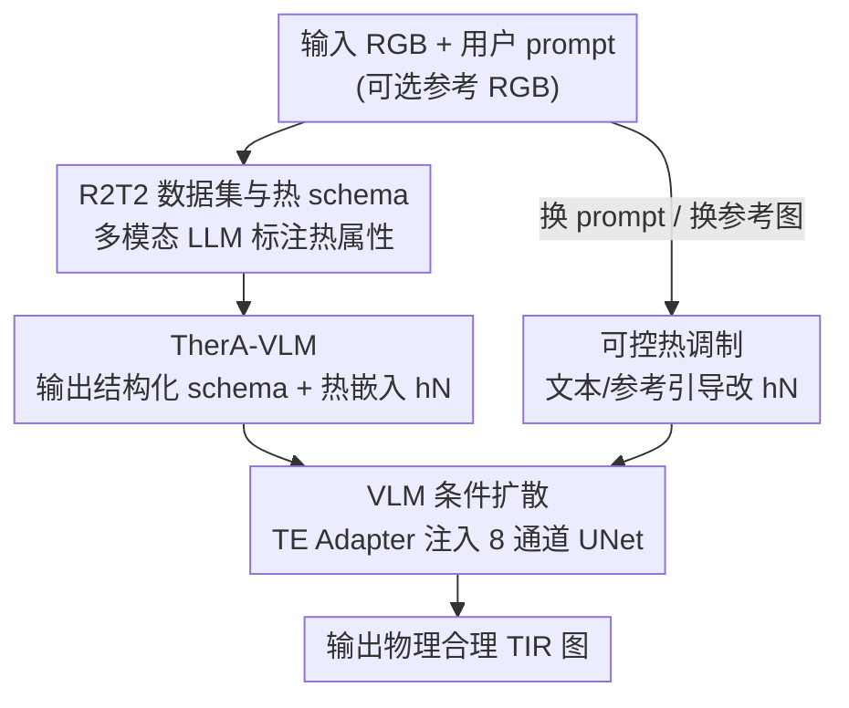

# TherA: Thermal-Aware Visual-Language Prompting for Controllable RGB-to-Thermal Infrared Translation

**会议**: CVPR 2026  
**论文**: [CVF Open Access](https://openaccess.thecvf.com/content/CVPR2026/html/Lee_TherA_Thermal-Aware_Visual-Language_Prompting_for_Controllable_RGB-to-Thermal_Infrared_Translation_CVPR_2026_paper.html)  
**代码**: https://github.com/donkeymouse/TherA  
**领域**: 图像生成 / 图像翻译  
**关键词**: RGB-to-TIR、热红外、视觉语言模型、潜空间扩散、可控生成

## 一句话总结
TherA 用一个"热感知"视觉语言模型（TherA-VLM）从 RGB 图推断出场景/物体/材质/发热状态的结构化热语义嵌入，再把这个嵌入注入潜空间扩散模型来条件生成 TIR 图，从而把 RGB→热红外翻译从"风格迁移"升级为"符合热物理"的可控合成，零样本翻译平均指标比 SOTA 高出最多 33%。

## 研究背景与动机
**领域现状**：热红外（TIR）成像在低能见度下感知鲁棒，但采集和标注大规模 TIR 数据极其昂贵。一个务实的替代方案是用图像翻译把现成的 RGB 数据合成成伪 TIR 数据，于是 RGB→TIR 翻译成了热感知领域的"数据引擎"。

**现有痛点**：绝大多数 RGB→TIR 方法把这件事当成像素级风格迁移——只盯着 RGB 像素去预测热强度，完全忽略热物理。论文用一个很直观的反例点破：InstructPix2Pix 翻译两辆车时，把停着的车和正在行驶的车都画成排气管发烫、轮毂发热，明显违背常识。后续工作试图用分割图、场景索引等先验来缓解，但这些线索编码的是类别和布局，而不是"热怎么发出来、怎么传导"的物理。

**核心矛盾**：TIR 外观取决于温度相关因素——材质发射率、是否有主动热源、时间/季节/天气等环境条件，所以**同一张 RGB 可以对应很多张合法的 TIR**。这是一个内在的一对多（ill-posed）问题，而现有方法强行学一个确定性的一对一映射，既丢了多样性，又生成出违反热物理的假图。

**本文目标**：(1) 给翻译注入真正的热物理先验，让发热分布合理；(2) 让用户能可控地调节热外观（天气、时间、物体状态），同时不改变场景几何。

**切入角度**：作者的观察是——预训练 VLM 里其实蕴含了"什么东西会热、为什么会热"的常识知识，缺的只是把它**结构化、热域化**地提取出来当条件。与其喂模型一句"turn this into thermal"的空泛 prompt，不如让 VLM 输出一份结构化的热属性 schema，再用它的隐状态当语义条件。

**核心 idea**：用"热感知 VLM 嵌入"替换扩散模型里原本的 CLIP 文本嵌入，把语义-物理推理灌进去条件，从而把不可控的像素翻译变成有物理依据、可被语言/参考图调控的生成。

## 方法详解

### 整体框架
TherA 是一个两阶段串行的可控翻译框架。第一阶段，TherA-VLM 读入一张 RGB 图（和可选的用户 prompt / 参考图），推理出一份结构化的热属性 schema，并把它的最终隐状态作为一个紧凑的**热嵌入 $h_N$** 输出。第二阶段，一个潜空间扩散 UNet 同时吃 RGB 引导潜码和这个热嵌入（经 TE Adapter 投影后注入交叉注意力），去噪生成符合热物理的 TIR 图。整个 pipeline 的可控性来自"改 VLM 的输入就会改 $h_N$"这一机制——换文字 prompt 或换参考图，热嵌入随之改变，输出的热外观也随之改变，而场景几何保持不变。这一切的前提是先有监督信号：作者专门构建了 R2T2 数据集（10 万对 RGB-TIR-文本三元组）来训练 VLM 学会"从 RGB 推断热属性"。

### 关键设计

**1. R2T2 数据集与热属性 schema：给"从 RGB 推热"造监督信号**

要让 VLM 学会推断热属性，先得有"RGB→热语义"的成对监督，而现有 TIR 数据集只有图、没有热物理描述。作者构建了 R2T2——10 万个三元组，每个含一张 RGB、对齐的 TIR，以及一段描述场景与物体热特性（类别、材质、颜色、发热状态）的规范化文本。标注方式是让多模态推理模型（Gemini 2.5 Pro）**同时看 RGB 和 TIR**，描述 RGB 场景在热域里如何呈现，产出关键词导向的结构化输出；再对这些 caption 做规范化（合并同义词、统一物体属性），把条件空间正则化、剔除语言噪声。数据来自 9 个对齐数据集加 3 个同步但未对齐数据集（后者经伪对齐扩充视角/季节/天气多样性），并刻意把 M3FD 和 FLIR 留作验证。这一步是后面一切的地基：没有热域化的规范监督，VLM 学到的只会是 RGB-centric 的泛泛描述。

**2. TherA-VLM：把 RGB 翻译成结构化热语义，用隐状态当条件**

针对"语言分支只被当成风格提示、conditioning 太空泛"的痛点，TherA-VLM（记为 $f_\theta$）被设计成输出一份**结构化 canonical schema**而非自由文本：给定 RGB 输入 $I_{rgb}$ 和用户 prompt $p_{user}$，输出 $S = f_\theta(I_{rgb}, p_{user}) = \{s_{scene}, s_{object}, s_{material}, s_{heat}\}$，分别编码场景、物体、材质、发热状态。它以 LLaVA 1.5 为底座，只在语言模块和图像投影模块上微调 LoRA 层，用 teacher forcing 拟合规范 schema 伪标签，损失为 $L_{TF} = -\sum_{n=1}^{N} \log p_\theta(y_n \mid y_{<n}, I_{rgb})$，即自回归地从视觉线索预测"热接地"的 token。关键在于：推理时真正喂给扩散模型的**不是文本字符串，而是 $f_\theta$ 的最终隐状态——热嵌入 $h_N$**。相比 LLaVA 那种描述"画面里有什么"的 RGB-centric caption，这份结构化 schema 描述的是"它如何辐射热"，既紧凑可解释，又把 VLM 预训练里的物理常识压进了一个适合多模态 grounding 的语义表示。

**3. VLM 条件扩散：把 VLM 隐状态桥接进 UNet 交叉注意力**

有了热嵌入，还得让扩散 UNet 能用它。作者用一个潜空间扩散 UNet，把输入改成 8 通道：4 通道给加噪的目标 TIR 潜码 $z_t$、4 通道给 RGB 引导潜码 $z_{rgb}$（冻结 VAE 编码 $z_{rgb}=\alpha\cdot E(I_{rgb})$、$z_{tir}=\alpha\cdot E(I_{tir})$，拼成 $x_t = \mathrm{concat}(z_t, z_{rgb})$）。难点是直接拿一个大 VLM 的隐状态替换 CLIP 嵌入很不稳定——UNet 既要适应新嵌入空间又要适应新的 TIR 输出域。作者借鉴 LaVi-Bridge（恰好 LLaVA 与该 UNet 同属 LLaMA 谱系），用一个两层前馈的 **TE Adapter $\phi$**，把 $h_N \in \mathbb{R}^{L\times 4096}$ 投影到 UNet 注意力宽度 $E = \phi(h_N) \in \mathbb{R}^{L\times 768}$，注入交叉注意力层。训练时冻结 TherA-VLM，只优化 UNet 和 adapter，目标为 $L_{diff} = \mathbb{E}_{t,\epsilon,E,M}[\|\hat\epsilon(x_t,t,E,M)-\epsilon\|_2^2]$。这样把大规模预训练里学到的跨模态对齐，迁移到了 RGB→TIR 这个小任务上。

**4. 可控热调制：改 VLM 输入即改热外观，且解耦几何**

TherA 是第一个能可控调 RGB→TIR 的框架，而这种可控性是"免费"涌现的——不需要额外训练，只要改 VLM 的输入，$h_N$ 就会相应改变，从而对输出施加定向修改、又保证热物理合理。它支持两层控制：**文本引导**把用户指令拼在 $p_{user}$ 之后，更新 schema $S$ 进而生成新的全局热嵌入，目前主要用于场景级属性（阴天、夜晚等）；**参考引导**则在推理时给 TherA-VLM 喂一张**带有目标属性的不同参考 RGB**（而扩散仍处理原图），让 VLM 抽出该参考特有的热嵌入再去条件扩散，这不仅能控全局场景属性，还能控物体级属性（比如把某辆特定的车从"停着"切到"行驶"，让热从轮毂和排气管正确发出）。推理用双 CFG：$\tilde\epsilon_\theta = \epsilon_\theta(x_t,\varnothing,\varnothing) + s_V[\epsilon_\theta(x_t,c_V,\varnothing)-\epsilon_\theta(x_t,\varnothing,\varnothing)] + s_S[\epsilon_\theta(x_t,c_V,c_S)-\epsilon_\theta(x_t,c_V,\varnothing)]$，先叠加视觉结构（$s_V$）再叠加热语义（$s_S$）。一个很实用的副产物是缓解"热反转"（昼夜温差导致 TIR 强度差异巨大）：夜间 RGB 全是噪声、几乎没有可推断信号，TherA 可以拿一张干净的白天 RGB，配一句文字 prompt 就合成物理合理的夜间 TIR，绕开了对夜间 RGB 的依赖。

### 损失函数 / 训练策略
两阶段分开训。TherA-VLM 用 teacher-forcing 损失 $L_{TF}$ 在 R2T2 的规范 schema 上微调 LoRA（$r{=}128, \alpha{=}256$，作用于视觉投影器和语言模型），指令 prompt 为 "Explain how this image would look in thermal image \<condition\>"，其中 condition token 以 10% 概率随机丢弃防过拟合。扩散阶段冻结 VLM，用噪声预测损失 $L_{diff}$ 只训 UNet（SD 1.4 初始化）和 TE Adapter（LLaMa-UNet Bridge 初始化），AdamW、学习率 $1\mathrm{e}{-4}$、每 GPU batch 32、100 epoch，4 张 A6000。双 CFG 推理实测最优为 $s_V{=}0.5$（弱化对 RGB 潜码的依赖）、$s_S{=}1.5$（强化热先验）。

## 实验关键数据

### 主实验
在 M3FD 和 FLIR 上的标准微调设置下，TherA 在全部 4 个指标、两个 benchmark 上都拿到最优。注意带额外先验的翻译模型（如同时用分割图+场景描述的 DiffV2IR）本来就是 prior 方法里最强的，但 TherA 仍全面超过它。

| 数据集 | 指标 | TherA | 次优(DiffV2IR) | 说明 |
|--------|------|-------|----------------|------|
| M3FD | PSNR↑ | 19.54 | 18.97 | 全 SOTA |
| M3FD | SSIM↑ | 0.67 | 0.66 | 全 SOTA |
| M3FD | FID↓ | 87.08 | 92.57 | 更低更好 |
| M3FD | LPIPS↓ | 0.21 | 0.23 | 感知更近 |
| FLIR | PSNR↑ | 19.02 | 18.24 | 全 SOTA |
| FLIR | SSIM↑ | 0.53 | 0.48 | 全 SOTA |
| FLIR | FID↓ | 83.78 | 84.26(PID) | 更低更好 |

零样本设置（只在 R2T2 上训、不做 benchmark 微调，在 M3FD/FLIR/CART 上测）差距更明显，TherA 大幅领先：

| 数据集 | 指标 | TherA | DiffV2IR | ThermalGen |
|--------|------|-------|----------|------------|
| M3FD | PSNR↑ | 18.24 | 11.77 | 12.84 |
| FLIR | PSNR↑ | 16.56 | 11.41 | 14.06 |
| CART | PSNR↑ | 15.38 | 10.92 | 12.17 |
| CART | FID↓ | 169.33 | 184.93 | 215.73 |

### 消融实验
核心消融验证"到底是热嵌入还是文本在起作用"，设 4 个渐进变体：(i) Baseline=InstructPix2Pix 在 R2T2 上训；(ii) LLaVA=通用 VLM；(iii) Lavi-LLama=用 TherA-VLM 的**文本 schema**当条件；(iv) TherA=用**热嵌入 $h_N$** 当条件。

| 配置 | M3FD PSNR↑ | M3FD SSIM↑ | 说明 |
|------|-----------|-----------|------|
| InstructPix2Pix (Baseline) | 12.40 | 0.32 | 只堆数据，仍 RGB-centric |
| LLaVA (通用 VLM) | 11.85 | 0.47 | 泛泛描述，无热接地 |
| Lavi-LLama (用文本 schema) | 13.23 | 0.51 | 规范文本，仅小幅提升 |
| TherA (用热嵌入 hN) | 18.24 | 0.65 | 比文本 schema 再 +4.66 dB |

### 关键发现
- **是"隐状态"而非"文本"才是关键**：从规范文本 schema（13.23 dB）换到热嵌入 $h_N$（18.24 dB），M3FD PSNR 直接 +4.66 dB。说明热物理推理压在 VLM 的隐状态里，转成离散文本会损失大量信息——这是全文最强的支撑性证据。
- **结构化条件 → 强零样本泛化**：把条件约束成关键词导向的结构化嵌入（而非自由文本）减少了语言噪声、稳定了训练，是 TherA 零样本大幅领先的主因。
- **双 CFG 配比有讲究**：$s_V{=}0.5, s_S{=}1.5$ 最优，即刻意弱化 RGB 潜码、强化热先验，印证"别太信 RGB 像素"的核心主张。
- **下游可用**：用 TherA 的伪 TIR 图预训练热分割和 RGB-TIR 匹配模型，两个下游任务都比用其他翻译基线生成的数据更好。

## 亮点与洞察
- **用 VLM 隐状态替换 CLIP 文本嵌入**：这是最巧妙的一手——把"什么会热"的物理常识当成连续语义条件灌进扩散，而消融证明这比把它压成文字强得多。这个"隐状态 > 文本"的思路可迁移到任何"语言里有隐性物理/常识、但写成文字会丢信息"的条件生成任务。
- **可控性是涌现的、不是训练出来的**：因为条件来自 VLM，而 VLM 的输出随输入变化，所以换 prompt/换参考图天然就能调输出，零额外成本拿到文本级+物体级两层控制。
- **同谱系桥接降低对齐难度**：刻意选了 LLaMA 谱系的 LLaVA + LLaMa-UNet Bridge，让 TE Adapter 只需两层前馈就能把 4096 维 VLM 嵌入桥到 768 维 UNet 注意力——选型时考虑预训练血缘是个值得借鉴的工程巧思。
- **热反转的解法很优雅**：夜间 RGB 没信息？那就用白天 RGB + 一句"night"prompt 反推夜间 TIR，把一个长期困扰 TIR 的物理难题转成了可控生成问题。

## 局限与展望
- 作者承认：方法只处理**相对热图像**（像素强度是归一化/对比意义上的温差），不是绝对辐射值，因此不能直接给出真实温度。
- ⚠️ 文本引导目前只能控**场景级**属性（天气、时间），物体级精细控制必须走参考图引导——文本对物体级的可控性还不够。
- 数据标注重度依赖 Gemini 2.5 Pro 的多模态推理质量，schema 的物理正确性受这个"教师"上限约束；规范化也可能抹掉一些有用的细粒度差异。
- 改进方向：把绝对辐射温度建模进来、让文本直接控物体级属性、以及探索多光谱感知与"热接地"的视觉语言建模。

## 相关工作与启发
- **vs InstructPix2Pix**：它是指令式编辑的范式开创者，但本质仍是 RGB 域的风格迁移，会把停着的车也画成发热（违反热物理）；TherA 用热感知 VLM 嵌入做条件，让发热分布符合物理，并在消融里把 IPix2Pix 当 baseline 直接超越。
- **vs DiffV2IR / F-ViTA（分割/场景先验类）**：它们用分割图、场景描述等 RGB-centric 先验改善几何对齐，但这些线索只编码类别和布局、对"热如何发出"是盲的；TherA 不依赖显式几何先验，靠语义-物理推理保住热真实性，主实验和零样本都更强。
- **vs PID（物理损失类）**：PID 用基于物理的损失，但依赖数据集特定的特征提取器，泛化差；TherA 把物理先验放进可泛化的 VLM 推理里，零样本明显更好。
- **vs ThermalGen（场景索引先验）**：它能抓全局热色调但常丢细粒度空间结构，RGB-only 数据上还会因过分割产生伪影；TherA 不靠场景索引，结构与热外观都更稳。

## 评分
- 新颖性: ⭐⭐⭐⭐⭐ 首次用结构化热感知 VLM 隐状态替代 CLIP 条件，把 RGB→TIR 从风格迁移升级为物理接地的可控生成。
- 实验充分度: ⭐⭐⭐⭐⭐ 标准+零样本双设置、4 指标、十余基线、渐进消融直击"隐状态 vs 文本"，还有下游任务验证。
- 写作质量: ⭐⭐⭐⭐ 动机用反例点破、方法两阶段清晰；部分符号（如 $h_N$、adapter 维度）需对照图才好理解。
- 价值: ⭐⭐⭐⭐⭐ 直击 TIR 数据稀缺痛点，能规模化造全天候伪 TIR 数据，且开源数据集+权重+模块。

<!-- RELATED:START -->

## 相关论文

- [\[NeurIPS 2025\] ThermalGen: Style-Disentangled Flow-Based Generative Models for RGB-to-Thermal Image Translation](../../NeurIPS2025/image_generation/thermalgen_style-disentangled_flow-based_generative_models_for_rgb-to-thermal_im.md)
- [\[CVPR 2026\] SynthRGB-T: Language-Vision Guided Image Translation for Diversity Synthesis](synthrgb-t_language-vision_guided_image_translation_for_diversity_synthesis.md)
- [\[CVPR 2026\] Improving Controllable Generation: Faster Training and Better Performance via x0-Supervision](improving_controllable_generation_faster_training_and_better_performance_via_x0-.md)
- [\[CVPR 2026\] Gated Condition Injection without Multimodal Attention: Towards Controllable Linear-Attention Transformers](gated_condition_injection_without_multimodal_attention_towards_controllable_line.md)
- [\[CVPR 2026\] Language-Free Generative Editing from One Visual Example](language-free_generative_editing_from_one_visual_example.md)

<!-- RELATED:END -->
