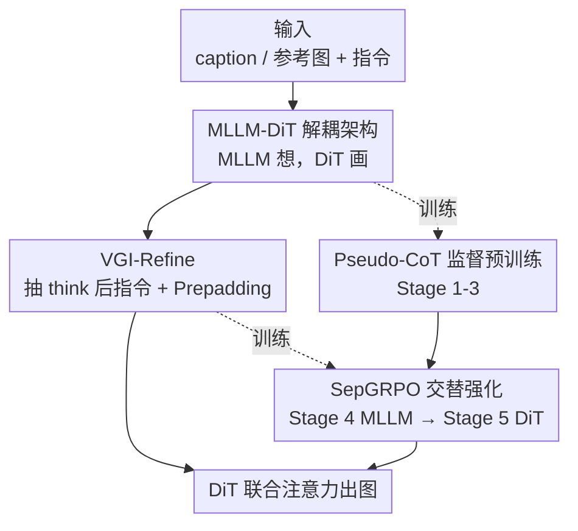

# ThinkGen: Generalized Thinking for Visual Generation

**会议**: CVPR 2026  
**论文**: [CVF Open Access](https://openaccess.thecvf.com/content/CVPR2026/html/Jiao_ThinkGen_Generalized_Thinking_for_Visual_Generation_CVPR_2026_paper.html)  
**代码**: https://github.com/jiaosiyuu/ThinkGen  
**领域**: 图像生成 / 多模态VLM  
**关键词**: 思维链生成, MLLM, 扩散Transformer, GRPO, 统一生成框架

## 一句话总结
ThinkGen 把 MLLM 的 `<think>` 思维链显式接进图像生成：用一个解耦的「MLLM 想 + DiT 画」架构，再配上交替强化 MLLM 与 DiT 的 SepGRPO 训练，让同一个模型在文生图、文字渲染、图像编辑、推理生成等多种场景里**自动**触发 CoT 推理，并在 GenEval (0.89)、CVTG (0.84)、ImgEdit (4.21) 等多个 benchmark 上达到 SOTA。

## 研究背景与动机
**领域现状**：把思维链（Chain-of-Thought, CoT）从理解任务搬到生成任务是近期的热点。已有工作要么把图像 token 的逐步生成类比成文本 token 的 CoT 来优化，要么先用 MLLM 改写生成指令、再把生成过程拆成若干阶段，从而在特定任务上提升图像质量。

**现有痛点**：这些 CoT 机制几乎都是**为单一场景量身定做**的——例如只服务"推理生成"。一旦换到更广的任务（文字渲染、图像编辑、风格化…），这套机制不仅不涨点，反而会掉点（论文 Fig.1 左半边）。结果是用户得**手动**决定某个任务该不该开 CoT，机制完全缺乏跨场景的灵活性。

**核心矛盾**：作者把根因归到——现有生成框架本身缺乏"先想清楚再画"的高级推理能力，CoT 只是被拼接上去的外挂，没有真正驱动生成。而且 MLLM 自回归产生的思维链里**充满冗余**，直接拿去喂扩散模型反而会干扰生成。

**本文目标**：做一个 think-driven 的**通用**视觉生成框架，让一个模型在所有生成场景里都能自适应地用 CoT，而不是为每个场景单独设计、单独切换。

**切入角度**：与其把 MLLM 当成纯特征提取器，不如让带 `<think>` 格式的 MLLM 真正负责"理解用户意图 + 生成定制化指令"，DiT 只负责"照着指令高质量出图"，二者解耦但协同。

**核心 idea**：用"MLLM 思考改写指令 → DiT 据此生成"的解耦架构，加上把 MLLM 和 DiT **分开做强化学习**的 SepGRPO，把 CoT 推理统一注入多种生成任务。

## 方法详解

### 整体框架
ThinkGen 是一个 think-driven 的统一生成模型，把"想"和"画"两步彻底解耦：前半段是一个 MLLM（Qwen3-VL-8B-Think 初始化），负责接收 caption / 参考图 + 编辑指令，先在 `<think>...</think>` 里做推理，再产出一条**贴合 DiT 口味**的改写生成指令；后半段是一个标准 DiT（OmniGen2-DiT-4B 初始化），把这条指令当文本条件、把参考图经 VAE 编码后当视觉条件，一起拼到带噪 latent 上做联合注意力出图。两段之间靠一个轻量模块 VGI-Refine 把 MLLM 思维链里**有用的指令信息**抽出来、规整好再交给 DiT。

训练上分两大块共五个阶段：先用监督学习把 DiT 和 MLLM 对齐并打好画质底子（Stage 1-3），再用 SepGRPO 强化学习交替优化 MLLM 和 DiT（Stage 4-5）。监督阶段为了省掉给海量数据逐条写 `<think>` 标注的天价成本，用一个 pseudo-CoT 模板模拟思维链；强化阶段则让 MLLM 学会"写出 DiT 偏好的指令"、让 DiT 学会"照指令出更好的图"。

### 关键设计

**1. 解耦的 MLLM-DiT 架构：让"想"和"画"各司其职**

针对"现有框架把 MLLM 当特征提取器、没真正用上推理能力"这个痛点，ThinkGen 把理解和生成拆成两个独立模块。MLLM 用一个专门设计的系统提示 `[SYS]` 引导它理解用户意图并产出改写指令，然后**取 `</think>` token 之后产生的最后两层 hidden states** 作为 DiT 的条件输入——作者实验发现用最后两层比用别的层对生成更有利。DiT 这边用一个**简单线性层**当 connector 来对齐多路条件特征，实验显示这种朴素线性投影反而比 MLP 或更复杂的 transformer connector 更好。这种解耦带来三个直接好处：每个模块能单独设计 reward（灵活）、各自的学习任务更纯粹（MLLM 专注产指令、DiT 专注出图，复杂度低）、分开训练显著降低 GPU 显存占用（成本低）。

**2. VGI-Refine：把冗长思维链压成 DiT 能用的干净指令**

MLLM 自回归产生的 CoT 往往又长又冗余，直接喂 DiT 会干扰生成。VGI-Refine（Visual Generation Instruction Refinement）分两步解决：第一步，从 MLLM 生成的文本 token 里**只抽取 `</think>` 之后的 instruction token**，把真正用于下游出图的精华部分隔离出来；第二步，在这串指令 token 前面拼接 $K$ 个**可学习的 Prepadding States**。这个拼接会调节输出 hidden states 的数据分布，对"generate a dog""remove the cat"这类**短指令**尤其有用——消融显示加上 Prepadding 后短 prompt benchmark 全面提升（GenEval 0.64→0.78、WISE 0.37→0.46、CVTG 0.24→0.28、ImgEdit 3.46→3.93），说明它确实能把 MLLM 的输出表征拉到更贴合 DiT 的分布上。

**3. SepGRPO：把 MLLM 和 DiT 拆开交替做强化学习**

这是把 CoT 统一注入多场景的核心。传统做法把整个模型一起做 RL，既贵又难收敛。SepGRPO 把文本和视觉的 rollout 解耦：**Stage 4 (MLLM-GRPO)** 先冻住 DiT，只对 MLLM 做 GRPO——对同一个输入采 $N_1$ 条思维链轨迹 $\{o_i\}$，让 DiT 用**相同的初始噪声**为每条轨迹各出一张图（消除生成随机性的干扰），再用各场景的 rule model 打分得到 reward $R_i$，按组内相对方式算优势 $\hat{A}_i=(R_i-\text{mean}(\{R_i\}))/\text{std}(\{R_i\})$，最后用带 KL 正则的 clipped GRPO 目标更新 MLLM。**Stage 5 (DiT-GRPO)** 反过来冻住 MLLM，用 FlowGRPO 强化 DiT 的指令跟随能力。这种"分而治之"带来三个优势：每个模块能定制不同 reward、各自学习复杂度更低、显存占用大幅下降。MLLM-GRPO 阶段还专门挑了语义组合、推理生成、文字渲染、图像编辑、反思五个代表性场景，各配专属数据集和 rule model（如 GenEval、HPSv3、Word Acc.、SigLIP2、NED）联合多任务训练，从而把泛化的 CoT 能力撑起来。

**4. Pseudo-CoT 监督预训练：绕开"没有 think 标注"的数据困境**

绝大多数生成数据集都没有显式的 `<think>` 标注，给 54M+ 量级的数据逐条改写思维链成本高到不可行。作者构造了一个 pseudo-CoT 模板：把 `<think> </think>` 之间**留空**，answer 直接**重复原始 caption / 编辑指令**，即 `[SYS]+[C]+<think> </think>+[C]`。靠这个模板，DiT 就能在"推理驱动"的输入格式下被预训练优化。监督预训练再细分三步——Stage 1 只训线性 connector 做对齐（≤512px）、Stage 2 解冻全部 DiT 参数在 60M 样本上大规模预训练、Stage 3 用 0.7M 高质量子集做精修（≤1024px）提升细节与审美。这一套监督底子是后面 SepGRPO 能稳定强化的前提。

### 损失函数 / 训练策略
监督阶段用 Rectified Flow 的 Flow Matching 目标回归速度场：$L(\theta)=\mathbb{E}_{t,x_0,x_1}\big[\lVert v-v_\theta(x_t,t)\rVert^2\big]$，其中 $v=x_1-x_0$ 是目标速度场。强化阶段的 GRPO 目标是带 KL 正则的 clipped surrogate：对每个 token 取 $\min\big(r_{i,t}\hat{A}_i,\ \text{clip}(r_{i,t},1-\varepsilon,1+\varepsilon)\hat{A}_i\big)-\beta D_{KL}(\pi_\theta\Vert\pi_{ref})$，$r_{i,t}$ 是新旧策略输出当前 token 的概率比。Stage 5 还用了 Denoising Reduction（20 步 512px）加速采样，高效收集低质但信息量足的轨迹。

## 实验关键数据

### 主实验
开/不开 CoT 用 `*` 区分（带 `*` 表示出图时启用 CoT 推理）。ThinkGen 在多个 benchmark 上 SOTA，且**开 CoT 后在推理类任务上提升尤其巨大**。

| Benchmark | 指标 | ThinkGen (w/o think) | ThinkGen* (w/ think) | 代表对手 |
|-----------|------|----------------------|----------------------|----------|
| GenEval | Overall | 0.88 | **0.89** | BAGEL 0.82 / OmniGen2 0.80 |
| DPG-Bench | Overall | 85.14 | **85.87** | BAGEL 85.07 |
| CVTG | Word Acc. | 0.80 | **0.84** | TextCrafter 0.76 |
| WISE | Overall | 0.55 | **0.76** | BAGEL* 0.70 / STAR 0.66 |
| RISEBench | Avg. | 3.6 | **13.0** | Gemini-2.0 13.3 / BAGEL* 11.9 |
| ImgEdit | Overall | 4.14 | **4.21** | GPT-4o 4.20 / OmniGen2 3.44 |

最亮眼的是推理类任务：WISE 从 0.55 跳到 0.76（+21%），RISEBench 从 3.6 跳到 13.0，逼近闭源的 Gemini-2.0；图像编辑 ImgEdit 4.21 已与 GPT-4o (4.20) 持平。

### 消融实验

**训练阶段拆解**（GenEval / WISE / CVTG，`*` 表示开 CoT）：

| 阶段 | GenEval | WISE | CVTG | 说明 |
|------|---------|------|------|------|
| Stage1 仅训 connector | 0.78 | 0.46 | 0.28 | 对齐不足，文字渲染差 |
| Stage2 大规模预训练 | 0.88 | 0.55 | 0.63 | 画质大涨，CVTG +35% |
| Stage3 高质量精修 | 0.88 | 0.55 | 0.75 | 细节进一步提升 |
| Stage4 MLLM-GRPO* | 0.86* | **0.76*** | 0.79* | 开 CoT 后推理飙升 0.55→0.76 |
| Stage5 DiT-GRPO* | **0.89*** | 0.76* | **0.84*** | 文字渲染再 0.79→0.84 |

**Prepadding States 消融**（短 prompt 全面受益）：

| 配置 | GenEval | WISE | CVTG | ImgEdit | DPG (长 prompt) |
|------|---------|------|------|---------|------|
| w/o Prepadding | 0.64 | 0.37 | 0.24 | 3.46 | 80.90 |
| w/ Prepadding | **0.78** | **0.46** | **0.28** | **3.93** | 80.86 |

**训练策略消融**（在 Stage3 模型上，10K 推理数据）：

| 策略 | GenEval | WISE | CVTG | 关键发现 |
|------|---------|------|------|----------|
| Stage3 基线 | 0.88 | 0.55 | 0.75 | — |
| SFT (10K reasoning) | 0.85 | 0.58 | 0.67 | 直接 SFT 几乎不涨推理 |
| MLLM-GRPO (10K reasoning) | 0.80 | **0.74** | 0.73 | WISE 暴涨 +0.19 |
| MLLM-GRPO (24K multitask) | 0.86 | **0.76** | 0.79 | 多任务最佳 |

### 关键发现
- **推理能力来自 SepGRPO 而非推理数据本身**：对 DiT 直接 SFT 喂推理数据，WISE 只从 0.55 微动到 0.58，说明 DiT 不具备把世界知识泛化到未见域的能力；而用 MLLM-GRPO 把 WISE 拉到 0.74。这是全文最关键的洞察——**会"想"的必须是 MLLM，DiT 只负责照做**。
- **Prepadding States 专治短指令**：长 prompt 的 DPG 几乎不受影响（80.90 vs 80.86），但所有短 prompt benchmark 明显受益，印证它的作用是调节短指令下 MLLM 输出特征的分布。
- **MLLM-GRPO 会让非 CoT 生成略掉点**：Stage4 给 GenEval 带来 -0.01、WISE -0.01 的轻微 representation shift，但一旦开 CoT 收益远超这点损失。
- **SepGRPO 过程可视化**：随训练推进，CoT 平均长度逐渐变长、多任务 reward 稳步上升、生成图（50→300→700 步）细节与保真度明显改善。

## 亮点与洞察
- **"把会推理的部分隔离出来单独强化"**：SepGRPO 最妙的地方是认清了——生成质量的天花板是 MLLM 的推理，而不是 DiT 的画工。于是把 RL 火力集中在 MLLM 上，DiT 只做轻量对齐，既省显存又对症下药，这个思路可迁移到任何"规划器+执行器"式的两段模型。
- **Pseudo-CoT 模板**：用"留空 think + 重复原指令"这种近乎零成本的模板，把海量无标注数据也纳入推理驱动的预训练，巧妙绕开了 CoT 标注稀缺的瓶颈，是很实用的工程 trick。
- **取 `</think>` 后两层 hidden states 当条件**：不取文本 token、不取全部层，而是精准取"想完之后"的表征，既保留推理结果又避免冗余，是连接 LLM 与扩散模型的一个干净接口设计。
- **统一框架自动触发 CoT**：相比过去要手动决定开不开 CoT，ThinkGen 让一个模型在六种场景里自适应地"该想就想"，朝"通用生成模型"迈了实在一步。

## 局限与展望
- **推理编辑仍偏弱**：RISEBench 即便开 CoT 也只有 13.0，逻辑推理子项（Log.）仅 1.1，离真正可靠的"理解物理/因果再编辑"还很远。
- **依赖外部 rule model 打分**：MLLM-GRPO 的五个场景各需专属 rule model（GenEval/HPSv3/SigLIP2 等），新增场景就得配新 reward，扩展到长尾任务的成本不低。⚠️ rule model 的具体打分细节作者放在附录，正文未完全展开。
- **两阶段交替强化的收敛与稳定性**：Stage4/Stage5 交替优化，先冻一边再冻另一边，论文未充分讨论多轮交替（而非单次往返）是否还能持续涨点，也未给出 RL 阶段的训练成本绝对值。
- **改进思路**：把 rule model 换成更通用的可学习 reward model、或让 MLLM 与 DiT 做更细粒度的交替/联合 RL，可能进一步打通推理编辑这类硬场景。

## 相关工作与启发
- **vs BAGEL**：BAGEL 同样融合自回归与扩散、也能开 CoT，但其 CoT 机制偏单场景，跨任务时不稳定（BAGEL 0.52 → BAGEL* 0.70 在 WISE 上虽涨但仍逊于 ThinkGen* 0.76）。ThinkGen 用解耦 + SepGRPO 把 CoT 做成跨场景通用，且编辑/文字渲染更强。
- **vs OmniGen2**：OmniGen2 把 MLLM 主要当特征提取器接扩散，没真正发挥推理；ThinkGen 复用其 DiT 权重但让 MLLM 显式 `<think>`，在 GenEval (0.89 vs 0.80)、ImgEdit (4.21 vs 3.44) 上全面领先。
- **vs 把图像 token 生成当 CoT 的工作（如 BiCoT-GRPO 路线）**：那类方法在 token 层面优化"画的过程"；ThinkGen 把推理放在**指令层面**（先想清楚要画什么再画），两者正交，本文证明指令层推理对世界知识类任务（WISE/RISEBench）增益更大。

## 评分
- 新颖性: ⭐⭐⭐⭐ 首个把 MLLM 显式 CoT 统一注入多场景生成的框架，SepGRPO 的解耦强化是实打实的新设计
- 实验充分度: ⭐⭐⭐⭐⭐ 覆盖文生图/编辑/推理生成/推理编辑/文字渲染六类任务，主表 5 张 + 消融 3 张，拆解到每个训练阶段
- 写作质量: ⭐⭐⭐⭐ 架构与训练 recipe 讲得清晰，rule model 细节下放附录略影响自洽
- 价值: ⭐⭐⭐⭐ 给"推理驱动的统一生成"提供了可复用的解耦+分离强化范式，对后续工作有借鉴意义

<!-- RELATED:START -->

## 相关论文

- [\[CVPR 2026\] Thinking-while-Generating: Interleaving Textual Reasoning throughout Visual Generation](thinking-while-generating_interleaving_textual_reasoning_throughout_visual_gener.md)
- [\[CVPR 2026\] Seeing What Matters: Visual Preference Policy Optimization for Visual Generation](seeing_what_matters_visual_preference_policy_optimization_for_visual_generation.md)
- [\[CVPR 2026\] ProcessMaker: A Generalized Process Visualization Framework with Adaptive Sequence Steps on Diffusion Transformers](processmaker_a_generalized_process_visualization_framework_with_adaptive_sequenc.md)
- [\[CVPR 2026\] DPAR: Dynamic Patchification for Efficient Autoregressive Visual Generation](dpar_dynamic_patchification_for_efficient_autoregressive_visual_generation.md)
- [\[CVPR 2026\] POCA: Pareto-Optimal Curriculum Alignment for Visual Text Generation](poca_pareto-optimal_curriculum_alignment_for_visual_text_generation.md)

<!-- RELATED:END -->
