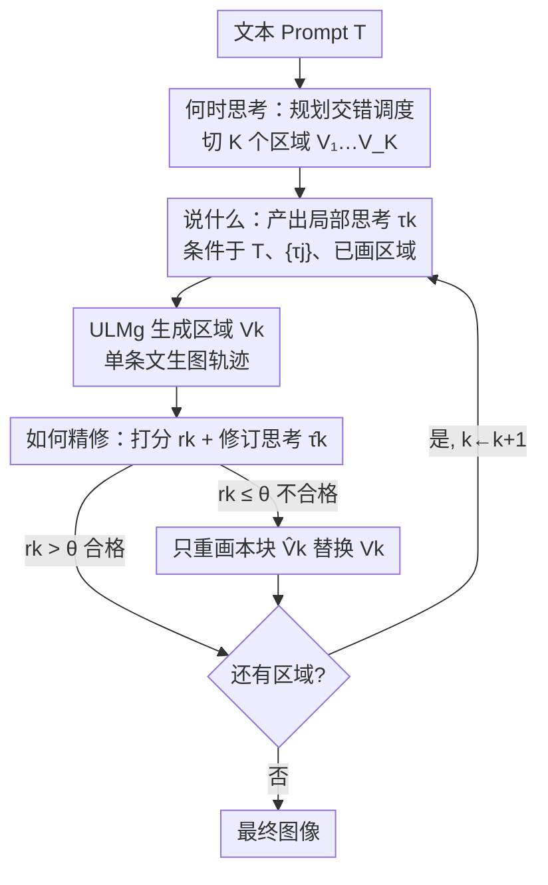

# Thinking-while-Generating: Interleaving Textual Reasoning throughout Visual Generation

**会议**: CVPR 2026  
**论文**: [CVF Open Access](https://openaccess.thecvf.com/content/CVPR2026/html/Guo_Thinking-while-Generating_Interleaving_Textual_Reasoning_throughout_Visual_Generation_CVPR_2026_paper.html)  
**代码**: https://github.com/ZiyuGuo99/Thinking-while-Generating  
**领域**: 图像生成 / 多模态生成  
**关键词**: 交错推理, 文生图, 统一多模态模型, GRPO, on-the-fly 反思

## 一句话总结
本文提出 TWIG（Thinking-while-Generating），第一个让文本推理"边生成边介入"的文生图框架——在自回归图像生成的过程中按区域插入文本思考，既为下一块画面提供局部指引、又对刚画完的区域打分纠错，并用 zero-shot / SFT / RL 三条路线验证；在 Janus-Pro-7B 上把 T2I-CompBench 的颜色绑定从 63.6 提到 82.5。

## 研究背景与动机
**领域现状**：扩散与自回归模型让文生图质量大幅提升，但面对"长程构图、多实体关系、细致指令遵循"仍力不从心。于是出现了一批"用推理辅助生成"的工作（Generation with CoT 一脉），在语言模态注入思维链来帮视觉合成。

**现有痛点**：这些 CoT 方法按"推理插在哪"可分两类，各有硬伤。**生成前思考（think-before）**先产出一份结构化计划（详细 caption、场景布局、物体属性关系），再把生成器 condition 在这份计划上——好处是全局连贯、实体摆放合理，但**计划一旦生成开始就固定**，无法在中途做细粒度引导和纠偏。**生成后思考（think-after）**先把整张图画完，再用自我批评或外部验证器挑错、反复重画——能修局部、补属性绑定，但推理与生成轨迹**只是松耦合**，缺少及时的细粒度修正，而且每轮重画都要**额外昂贵的推理回合**。

**核心矛盾**：推理与生成被切成了两个互不交叠的阶段——要么"先想好再画"（想的时候看不到画面），要么"画完再改"（改的时候已经晚了且贵）。真正缺的是**生成进行时**的多模态交互。

**切入角度**：作者注意到视觉理解领域的一个互补趋势——大型多模态模型在做"图文交错推理"，把中间视觉证据（检测框、放大区域、打标图）织进文本 CoT 来提升理解。作者反过来问：能不能**反转模态流向**，把文本织进正在展开的视觉生成过程，提供"随画面演进、协同进化"的推理？

**核心 idea**：在**单条生成轨迹**内，把画布切成若干局部区域逐块生成，每块生成前插入一段文本思考做局部 sub-prompt 引导（what），每块生成后立刻做区域级打分反思、必要时只重画这一块（how），而切几块、怎么切由模型先规划好（when）——让文本推理与视觉模态**共同演化**。

## 方法详解

### 整体框架
TWIG 把"一次性出图"改造成"分区域、带文本思考的渐进式生成"。给定文本 prompt $T$，框架围绕三个问题展开：**何时思考（When to Think）** 决定把生成切成几个区域、怎么切；**说什么（What to Say）** 在每个区域生成前产出一段局部思考做精细指引；**如何精修（How to Refine）** 在每个区域生成后做一次打分反思、低于阈值就只重画这一块。整套流程由**同一个统一多模态模型（ULM，如 Janus-Pro）**承担，理解前向记作 $\text{ULM}_u$、生成前向记作 $\text{ULM}_g$。

关键工程点在于：整个"思考—生成—反思—再生成"的循环**始终保持在一条自回归轨迹里**，不另起新一轮推理。视觉上下文 $\{V_j\}_{j<k}$ 不是作为图像重新喂回模型（所以 $\text{ULM}_g$ **只需文生图能力、不需要图生图**），而是把文本前文从 $\{\tau_j\}_{j<k}$ 扩展到 $\{\tau_j\}_{j\le k}$ 接在序列开头、把已生成视觉 token 原封不动留在序列末尾，继续往后自回归生成下一块。

### 关键设计

**1. When to Think：把整图生成调度成 K 个可控子任务**

针对 think-before"计划一次定死"的痛点，TWIG 让 $\text{ULM}_u$ 先读懂 prompt、规划一个交错推理调度 $S=\{V_k\}_{k=1}^{K}$，即 $S=\text{ULM}_u(T)$，其中每个 $V_k$ 是一块要施加推理的目标视觉区域（自回归/离散扩散里是 token span，连续扩散里是时间步窗口）。这一步把"一次性合成"解耦成更小、更可控的子任务，给后续逐块的文本引导腾出介入点。调度可以是**静态**（固定 $K$、均匀切分）或**自适应**（$K$ 可变、按内容切）。作者实验发现**静态 $K=3$ 最好**，依据一个朴素启发：多数图像由"上方背景 / 中央主体 / 下方背景"三段语义构成；自适应调度因当前 ULM 难以稳定输出结构良好的切分而暂时搁置（列为未来工作）。

**2. What to Say：每块生成前的局部思考做"细粒度 sub-prompt"**

针对 think-before 无法中途细化的问题，在每个调度点 $\text{ULM}_u$ 产出一段文本思考 $\tau_k$，**专门只指引当前区域 $V_k$** ——它是一个局部 sub-prompt，比全局预规划的粒度细得多。$\tau_k$ 的生成同时 condition 在三样东西上：原始 prompt $T$、之前所有思考 $\{\tau_j\}_{j<k}$、之前已生成的视觉内容 $\{V_j\}_{j<k}$，即 $\tau_k=\text{ULM}_u(T,\{\tau_j\}_{j<k},\{V_j\}_{j<k})$，从而既积累上下文又为下一块做规划。随后 $\text{ULM}_g$ 据此合成该区域：$V_k=\text{ULM}_g(\{\tau_j\}_{j\le k},\{V_j\}_{j<k})$。如前所述，这里靠"扩展文本前文 + 保留已生成视觉 token"实现，因此不打断自回归、不引入新生成回合。

**3. How to Refine：区域级即时反思 + 局部重画，省掉昂贵的全图重做**

针对 think-after"画完整图再全局返工、又慢又贵"的痛点，TWIG 在每块 $V_k$ 生成后立刻做一次区域级修订：$\text{ULM}_u$ 产出反思元组 $c_k=(r_k,\hat{\tau}_k)=\text{ULM}_u(T,\{\tau_j\}_{j\le k},\{V_j\}_{j\le k})$，其中 $r_k\in[0,100]$ 是给当前区域打的整数 critic 分（沿颜色准确、物体完整、细节丰富、空间关系、视觉连贯五个维度评估其与引导 prompt $\tau_k$ 的语义对齐与视觉一致性），$\hat{\tau}_k$ 是一条用于纠错的修订 sub-caption。若 $r_k$ 超过阈值 $\theta$ 则直接进入下一块；否则触发局部反思，**只重画当前子区域**：$\hat{V}_k=\text{ULM}_g(\{\tau_j\}_{j<k},\hat{\tau}_k,\{V_j\}_{j<k})$。实现上把文本前文从 $\tau_k$ 替换成 $\hat{\tau}_k$、只在序列末尾重新生成局部 $\hat{V}_k$ 去替换 $V_k$，同样保持单条轨迹、不做全图重做——既及时止损又大幅省算力。

### 损失函数 / 训练策略
作者并不把 TWIG 当成单一模型，而是探索三条把它落地的路线，分别给出不同视角：

- **Zero-shot prompting**：精心设计三套"交错感知" prompt（对应 when/what/how 三组件），不更新任何参数就直接激发 ULM 的交错推理潜力。优点是揭示了 ULM 自组织交错推理的潜能，缺点是稳定性差。
- **SFT（TWIG-50K 数据集）**：把"理解+生成"过程拆成**九个子任务**（$\text{ULM}_u$ 的三段思考、$\text{ULM}_u$ 的三段反思打分+修订、$\text{ULM}_g$ 的三段区域生成，对应固定 $K=3$），构建 5 万规模数据集 TWIG-50K 做微调，提升指令遵循、降低视觉幻觉。数据用 GPT-4o 生成三段式 sub-caption、GPT-4o-Image 合成对应分区图像，再过滤组织成交错格式。
- **RL（TWIG-GRPO）**：在 GRPO 基础上定制——一次 rollout 内 ULM 做多次前向，**只基于最终图像与输入 prompt 算一个共享 reward**，同时优化所有 thinking/generation/reflection pass 的策略，让全局信息在不同路径间流动、增强协同。reward 用四个互补模型的无权重平均（HPS v2 人类偏好、GroundingDINO 物体定位、GIT 的 VQA 一致性、微调 ORM 的 LMM 对齐）以缓解 reward hacking。

## 实验关键数据
基线为 Janus-Pro-7B，benchmark 为 T2I-CompBench(++)，默认设置 $K=3$、均匀切分、至多一轮反思。

### 主实验：三条路线逐级提升（T2I-CompBench）

| 模型 | Color↑ | Shape↑ | Texture↑ | Spatial↑ | Complex↑ |
|------|--------|--------|----------|----------|----------|
| Janus-Pro-7B（基线） | 63.59 | 35.28 | 49.36 | 20.61 | 35.59 |
| TWIG-ZS（zero-shot） | 73.11 | 41.55 | 64.77 | 21.98 | 36.65 |
| TWIG-SFT | 74.58 | 52.42 | 67.95 | 27.02 | 38.22 |
| TWIG-RL | **82.49** | **61.28** | **73.19** | **34.06** | **40.31** |

仅靠 zero-shot prompt，Color 就 +9.52、Texture +15.41，说明 ULM 本身就藏着很强的交错推理能力；SFT 在此之上稳定小幅提升（Shape、Spatial 提升最明显）；RL 再把 Color 推到 82.49、相对 SFT 在三个属性绑定类与 Spatial 类均 >+5%，逼近/超过 T2I-R1 等专门方法。

### 消融实验

| 配置 | Color↑ | Texture↑ | Spatial↑ | 说明 |
|------|--------|----------|----------|------|
| Think-before-Gen. | 65.12 | 51.05 | 20.88 | 仅预规划 |
| Think-after-Gen. | 64.72 | 50.62 | 21.05 | 仅后精修 |
| **Thinking-while-Gen.** | **73.11** | **64.77** | 21.98 | 交错推理（本文） |
| $K=2$ | 72.79 | 64.64 | 21.97 | 切 2 块 |
| **$K=3$** | 73.11 | 64.77 | 21.98 | 切 3 块（默认最佳） |
| $K=4$ | 72.95 | 64.70 | 22.03 | 切 4 块 |
| 均匀切分 | 73.11 | 64.77 | 21.98 | 默认 |
| 自适应切分 | 72.43 | 63.92 | 21.67 | ULM 难稳定遵循反而掉点 |
| w/o Reflection | 73.11 | 64.77 | 21.98 | 不反思 |
| 1 轮 Reflection | **73.90** | **66.10** | **24.50** | Spatial 大涨 |
| 2 轮 Reflection | 73.68 | 66.02 | 24.42 | 无额外收益 |

RL 阶段还有两组消融：reward 用四模型集成时逐个叠加（人类偏好 → +物体定位 → +VQA 一致性 → +LMM 对齐）持续涨点，尤其 Spatial 从 20.68 一路升到 34.06；GRPO 策略上**同时强化 $\text{ULM}_u$ 与 $\text{ULM}_g$（TWIG-GRPO）**优于只强化任一方（82.49 vs 单独 80.12 / 78.36）。

### 关键发现
- **交错 > 前/后思考**：同样 zero-shot 设置下，TWIG 在 Color（73.11 vs 65.12/64.72）、Texture 上大幅领先纯预规划或纯后精修，证明"生成进行时介入"确实带来前后两类做法给不了的细粒度即时引导。
- **$K=3$ 的"三段语义"假设站得住**：切 2/3/4 块差异很小但 $K=3$ 综合最好，呼应"上背景/中主体/下背景"的图像结构直觉。
- **反思一轮就够**：1 轮反思把 Spatial 从 21.98 提到 24.50，但第 2 轮无进一步收益——zero-shot ULM 的批评-修订能力大致一轮就用尽。
- **SFT 别喂太多反思数据**：平衡 thinking 与 generation 数据最好，过量加反思数据会让思考变长、过度纠正反而掉点（Reflect-heavy 仅 71.88），且 SFT 显著收紧 5 个随机种子下的方差（更稳定）。

## 亮点与洞察
- **"反转模态流向"的视角很巧**：图文交错推理一直是"把视觉证据塞进文本 CoT 帮理解"，本文反过来"把文本思考织进视觉生成帮合成"，一句话点破了一个新范式空白。
- **单轨迹工程是落地关键**：靠"扩展文本前文 + 保留已生成视觉 token"，让 $\text{ULM}_g$ 只需文生图能力就能利用视觉上下文，避免了图生图依赖与多轮重画的开销——这个 trick 可迁移到任何自回归视觉生成器上做"边生成边纠错"。
- **共享 reward 的 GRPO 很省事又有效**：只用最终图像算一个 reward 去联合优化思考/生成/反思全部 pass，绕开了给每个局部子任务单独算奖励的麻烦，还让全局信息跨路径流动。

## 局限与展望
- **自适应调度尚不可用**：当前 ULM 无法稳定输出结构良好的内容自适应切分，只能退回固定 $K=3$ 静态调度，作者明确列为未来工作。
- **仅在 T2I + 单 ULM + 自回归上验证**：框架设计上号称兼容扩散/离散扩散、I2I/T2V/T2-3D、pipeline 式（T2I 模型 + 外接 LMM）等，但本文只在 Janus-Pro 自回归文生图上做了"初步研究"，跨范式有效性尚待证。
- **反思数据"训不动"**：SFT 时反思子集不仅没帮上忙还掉点，说明 critique-and-revise 的训练配方仍未摸清；作者也承认这是开放问题。
- **存疑点**：⚠️ critic 分阈值 $\theta$ 的具体取值、九个子任务的精确数据配比等细节以原文/附录为准。

## 相关工作与启发
- **vs Think-before-Generation（GoT / 预规划类）**：他们先出一份固定计划再生成，全局连贯但中途无法细化；TWIG 把推理拆到每块区域生成前，提供可随画面演进的局部 sub-prompt 引导。
- **vs Think-after-Generation（PARM / 自我批评类）**：他们画完整图再全局返工、要额外昂贵推理回合；TWIG 做区域级即时反思、只重画不合格的局部，且全程单轨迹，省算力又及时。
- **vs 并行工作 IRG / Uni-CoT**：两者也号称"交错"推理与生成，但仍把视觉合成当成一个整块（更像 before+after 的组合），没有真正在生成过程**内部**逐区域交错，粒度与可控性不如 TWIG。

## 评分
- 新颖性: ⭐⭐⭐⭐⭐ "边生成边推理"反转模态流向，开了一个清晰的新范式空白
- 实验充分度: ⭐⭐⭐⭐ zero-shot/SFT/RL 三路线 + 四组消融较完整，但只在单 ULM 文生图上验证
- 写作质量: ⭐⭐⭐⭐⭐ when/what/how 三问拆解清晰，单轨迹机制讲得很透
- 价值: ⭐⭐⭐⭐ 提供了可迁移的交错生成范式与单轨迹纠错 trick，对组合式文生图有实用意义

<!-- RELATED:START -->

## 相关论文

- [\[CVPR 2026\] ThinkGen: Generalized Thinking for Visual Generation](thinkgen_generalized_thinking_for_visual_generation.md)
- [\[CVPR 2026\] UniVerse: Empower Unified Generation with Reasoning and Knowledge](universe_empower_unified_generation_with_reasoning_and_knowledge.md)
- [\[CVPR 2026\] Evaluating Reasoning Fidelity in Visual Text Generation](evaluating_reasoning_fidelity_in_visual_text_generation.md)
- [\[CVPR 2026\] Prompt Yourself: Awakening Textual Semantics in 1D Visual Tokenizers](prompt_yourself_awakening_textual_semantics_in_1d_visual_tokenizers.md)
- [\[CVPR 2026\] BioVITA: Biological Dataset, Model, and Benchmark for Visual-Textual-Acoustic Alignment](biovita_biological_dataset_model_and_benchmark_for_visual-textual-acoustic_align.md)

<!-- RELATED:END -->
