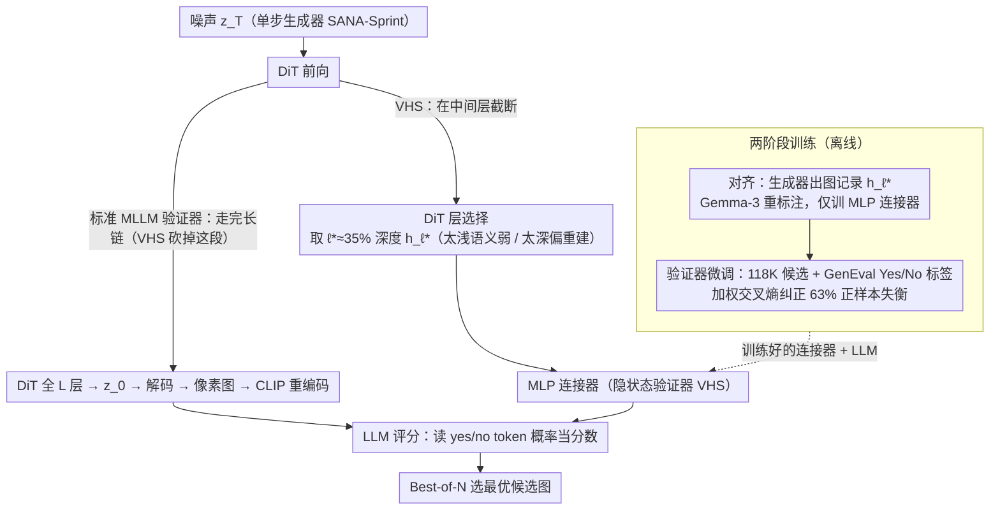

# Tiny Inference-Time Scaling with Latent Verifiers

**会议**: CVPR 2026 Findings  
**arXiv**: [2603.22492](https://arxiv.org/abs/2603.22492)  
**代码**: [https://aimagelab.github.io/VHS](https://aimagelab.github.io/VHS)  
**领域**: 扩散模型 / 图像生成 / LLM效率  
**关键词**: 推理时扩展, 隐空间验证器, 单步生成, DiT, MLLM

## 一句话总结
提出VHS（Verifier on Hidden States）——一种直接在DiT生成器中间层隐状态上工作的验证器，跳过解码-重编码开销，在单步图像生成的推理时扩展（inference-time scaling）场景下将联合生成-验证时间减少63.3%、FLOPs降低51%，同时在GenEval上相同时间预算下提升2.7%的性能。

## 研究背景与动机

1. **领域现状**：推理时扩展（inference-time scaling）已成为提升生成模型质量的有效方式——通过生成多个候选样本并用验证器（verifier）评分选出最佳结果。常见的Best-of-N策略在文本到图像生成中广泛使用。

2. **现有痛点**：当前验证器通常基于MLLM（多模态大语言模型），流程是：生成器在latent空间生成→解码到像素空间→MLLM的视觉编码器（如CLIP）重新编码→LLM评分。存在两个问题：(a) 解码-重编码是冗余操作——latent空间已隐式包含语义信息，却被解码后又重新编码；(b) 文献中通常只计算生成步数（function evaluations）而忽视验证器开销，但对于**单步生成器**（如SANA-Sprint），解码器和验证器的开销与生成本身可比拟。

3. **核心矛盾**：实际部署场景（如商业图像生成服务）通常只返回2-4张候选图片，是"tiny budget"设定。在如此紧的预算下，MLLM验证器的开销不可忽视。扩散模型在压缩latent空间操作以减少计算，但验证时又退回到像素空间，形成了计算上的矛盾。

4. **本文目标**：设计一种更高效的验证器，能直接在生成器的latent空间评估生成质量，消除解码-重编码开销。

5. **切入角度**：DiT生成器的中间隐层已经编码了丰富的语义信息（可以被LLM理解），不需要先解码再编码。直接用中间层特征替代CLIP视觉编码器的输出作为LLM的视觉输入。

6. **核心 idea**：验证器直接消费DiT生成器的中间隐状态作为视觉输入，跳过后续DiT层、自编码器解码和CLIP重编码，实现隐空间内的高效验证。

## 方法详解

### 整体框架
这篇论文想解决的是：推理时扩展里 Best-of-N 要为每个候选跑一遍验证器，而 MLLM 验证器的"解码—重编码"开销在单步生成的紧预算下大到不可忽视。它的破解办法是把验证器直接挪进生成器的隐空间。

标准 MLLM 验证器的链路很长——噪声 $z_T$ 先过完 DiT 全部 $L$ 层得到 $z_0$，再经自编码器解码到像素图 $x_0$，又被 CLIP 视觉编码器重新编码成特征，最后才送进 LLM 打分。VHS 把后半段全砍掉：$z_T$ 只过 DiT 的前 $\ell^*$ 层，取出中间隐状态 $h_{\ell^*}$，经一个 MLP 连接器直接喂给 LLM 评分。解码、CLIP 重编码、以及 DiT 第 $\ell^*$ 层之后的层全部不再执行，验证因此被压回 latent 空间内部完成。

### 关键设计

**1. 隐状态验证器 VHS：让 LLM 直接读 DiT 中间层，省掉一整段解码—重编码**

标准 MLLM 验证器的评分写成 $s = \text{LLM}(\mathcal{C}(\mathcal{V}(\mathcal{D}(z_0))), p)$，其中 $\mathcal{D}$ 是解码器、$\mathcal{V}$ 是视觉编码器、$\mathcal{C}$ 是连接器，prompt 为 $p$。VHS 把这条链路直接简化成

$$s = \text{LLM}(\mathcal{C}(h_{\ell^*}), p)$$

也就是取 DiT 第 $\ell^*$ 层的隐状态 $h_{\ell^*}$，过 MLP 连接器后送 LLM。这一步不只省下 $\mathcal{D}$ 和 $\mathcal{V}$ 两个模块，还顺带把生成器第 $\ell^*$ 层之后的 $L-(\ell^*+1)$ 层一起截断——验证用不到完整图像，自然也不必把生成跑完。之所以能这么做，是因为扩散模型本就靠 latent 携带的语义来还原图像，这份语义已经在中间层里了，再解码成像素又用 CLIP 编码回特征属于绕远路。消融也佐证了这点：AE 的 latent 虽然感知信息丰富，但受重建式预训练目标影响、语义偏弱；而 DiT 中间层特征是被生成 prompt 条件化过的，跟语义对齐得更紧。

**2. DiT 层的选择：在"太浅没语义、太深偏重建"之间挑中间那一层**

隐状态取自哪一层并非越深越好。论文在 20 层 DiT 上测了 $h_1, h_5, h_7, h_9, h_{19}$ 五个位置，结果呈非单调的权衡：极浅的 $h_1$ 紧挨噪声输入、表示还不稳定；极深的 $h_{19}$ 已逼近 AE 的重建空间，主导的是感知重建而非语义判断；落在约 35% 深度的 $h_7$ 最优——GenEval overall 比 $h_5$ 高 2.8%、比 $h_9$ 高 2.2%，而且因为能截断后面 13 层，延迟反而更低。换句话说，中间层恰好同时拿到了"足够的语义"和"最省的算力"，这也解释了为什么直接用最深层或 AE latent 都不划算。

**3. 两阶段训练：先把隐空间对齐到 LLM，再把它调成会拒绝坏图的验证器**

第一阶段是**对齐**，思路类似 LLaVA 的第一步，用图像—文本对训练 MLP 连接器，但输入换成生成模型的 latent 而非真实图像：先让生成器从 caption 出图并记录对应的 $h_{\ell^*}$，再用 Gemma-3-4B 对生成图重新标注描述（避免直接沿用 caption 带入生成偏差），这一阶段只训连接器。第二阶段是**验证器微调**，从 Reflect-DiT 的 prompt 每条生成 20 张候选、共 118K 样本，用 GenEval 自动评估打出 Yes/No 二值标签，再训练连接器与 LLM 的全部参数；推理时直接读 LLM 输出 "yes"/"no" token 的概率，当作连续分数。

这里有个绕不开的坑：自动标出来的正样本约占 63%，标准交叉熵会被多数类带偏，训出来的验证器倾向于给什么都打高分、丧失拒绝低质量生成的能力。论文用**加权交叉熵**按类别频率重新配权重来纠偏，消融里它相对标准 XE 提升约 4.2%，focal loss 也能缓解（约 +3.7%），但加权 XE 更好。

### 损失函数 / 训练策略
对齐阶段沿用 LLaVA 式训练、仅训连接器；验证器微调阶段用加权交叉熵，训练连接器与完整 LLM。实例化时 LLM 用 Qwen2.5-0.5B，生成器用单步的 SANA-Sprint。

## 实验关键数据

### 主实验
SANA-Sprint + Qwen2.5-0.5B在GenEval上（匹配时间预算内的Best-of-N）：

| 时间预算 | 验证器 | Best-of-N | GenEval Overall |
|----------|--------|-----------|-----------------|
| 550ms | MLLM w/ CLIP | Bo2 | 75.4% |
| 550ms | **VHS** | **Bo4** | **78.1%** (+2.7%) |
| 1100ms | MLLM w/ CLIP | Bo4 | 78.8% |
| 1100ms | **VHS** | **Bo9** | **80.5%** (+1.7%) |
| 1650ms | MLLM w/ CLIP | Bo6 | 80.4% |
| 1650ms | **VHS** | **Bo15** | **80.9%** (+0.5%) |

延迟与资源对比（Bo1基准）：

| 验证器 | 时间 | 节省 | FLOPs节省 | VRAM节省 |
|--------|------|------|-----------|----------|
| MLLM w/ CLIP | 277ms | - | - | - |
| MLLM w/ AE | 138ms | 50.2% | 51.0% | 14.5% |
| **VHS on $h_7$** | **102ms** | **63.3%** | **62.9%** | **14.5%** |

### 消融实验

| 配置 | GenEval Overall (1100ms) | 说明 |
|------|--------------------------|------|
| VHS $h_7$ + Weighted XE | **80.5%** | 最优配置 |
| VHS $h_1$ + Weighted XE | 71.3% | 太浅，语义不足 |
| VHS $h_{19}$ + Weighted XE | 76.5% | 太深，偏向感知重建 |
| VHS $h_7$ + XE | 76.3% | 标准XE，类别不平衡 |
| VHS $h_7$ + Focal | 80.0% | Focal loss也有效 |
| MLLM w/ AE + Weighted XE | 74.7% | AE latent语义弱 |
| VHS $h_7$ + Qwen2-1.5B | 78.4% | 更大LLM无帮助，瓶颈在视觉而非推理 |

### 关键发现
- VHS的核心优势在"tiny budget"场景：相同时间MLLM w/ CLIP评2个，VHS能评4个，翻倍的候选池带来显著质量提升
- 层选择非单调：太浅语义弱，太深偏重建，$h_7$（~35%深度）最优。AE latent效果差证实了"感知特征≠语义特征"
- 增大LLM（0.5B→1.5B）几乎无帮助，瓶颈在视觉表示质量而非语言推理——这是一个重要洞察
- 加权XE > Focal loss > XE，类别不平衡处理对验证器训练至关重要
- 在PixArt-α-DMD上也有效（48%加速），证明泛化性

## 亮点与洞察
- **"少即是多"的验证器设计**：移除视觉编码器反而更好——因为DiT latent已经是条件化的语义表示，比CLIP的通用视觉特征更适合判断生成质量。这挑战了"MLLM需要强视觉编码器"的常识
- **延迟→候选数的转化**：VHS的真正价值不只是"更快"，而是在同样时间内能评估更多候选，将"效率优势"转化为"质量优势"
- **生成器中间层特征的语义分析**：DiT不同深度层的特征从噪声→语义→感知的渐变规律，对理解生成模型的内部表示有理论价值

## 局限与展望
- 仅适用于单步生成器——多步生成器的latent在每步不同，VHS需要适配
- 仅在GenEval上评估，缺少更主流的benchmark（如T2I-CompBench、DrawBench）
- 依赖特定的DiT架构——对于非DiT的生成器（如U-Net扩散模型）需要重新设计
- 当前用fixed layer $\ell^*$，未探索自适应层选择的可能性
- VHS本身需要训练（对齐+微调），不是完全training-free的方案

## 相关工作与启发
- **vs VQA-Score**: VQA-Score用VQA模型打分，需要完整的像素图像。VHS在latent空间直接评估，适合低延迟场景
- **vs Vision-Reward**: Vision-Reward用MLLM做细粒度二值QA然后加权，也需要像素图像。VHS跳过了这一步
- **vs SANA-Sprint多步**: 8步SANA-Sprint（74.0%）不如VHS的Bo4（78.1%），进一步证实Best-of-N比增加步数更高效

## 评分
- 新颖性: ⭐⭐⭐⭐⭐ 直接在隐空间做验证的想法简洁有力，DiT层特征的语义分析有洞察
- 实验充分度: ⭐⭐⭐⭐ 延迟/性能/消融分析全面，但benchmark单一（仅GenEval）
- 写作质量: ⭐⭐⭐⭐⭐ 问题动机阐述精当，效率分析细致
- 价值: ⭐⭐⭐⭐ 对实际部署图像生成服务有直接价值，隐空间验证的思路可推广到视频生成

<!-- RELATED:START -->

## 相关论文

- [\[CVPR 2026\] Rethinking Prompt Design for Inference-time Scaling in Text-to-Visual Generation](rethinking_prompt_design_for_inference-time_scaling_in_text-to-visual_generation.md)
- [\[NeurIPS 2025\] Inference-Time Scaling for Flow Models via Stochastic Generation and Rollover Budget Forcing](../../NeurIPS2025/image_generation/inference-time_scaling_for_flow_models_via_stochastic_generation_and_rollover_bu.md)
- [\[CVPR 2026\] From Scale to Speed: Adaptive Test-Time Scaling for Image Editing](from_scale_to_speed_adaptive_test-time_scaling_for_image_editing.md)
- [\[CVPR 2026\] Progress by Pieces: Test-Time Scaling for Autoregressive Image Generation](progress_by_pieces_test-time_scaling_for_autoregressive_image_generation.md)
- [\[ICML 2026\] Simple Approximation and Derivative Free Inference-Time Scaling for Diffusion Models via Sequential Monte Carlo on Path Measures](../../ICML2026/image_generation/simple_approximation_and_derivative_free_inference-time_scaling_for_diffusion_mo.md)

<!-- RELATED:END -->
