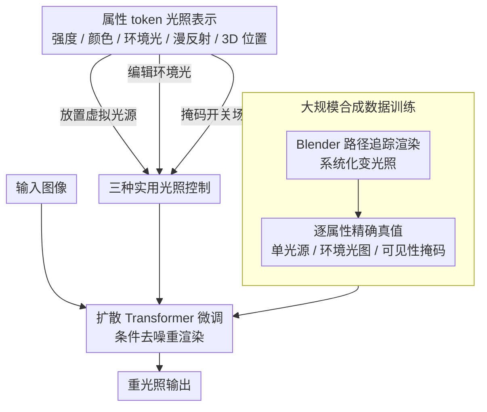

# TokenLight: Precise Lighting Control in Images using Attribute Tokens

**会议**: CVPR 2026  
**arXiv**: [2604.15310](https://arxiv.org/abs/2604.15310)  
**代码**: [vrroom.github.io/tokenlight/](https://vrroom.github.io/tokenlight/)  
**领域**: 图像生成/重光照  
**关键词**: relighting, attribute tokens, diffusion transformer, lighting control, synthetic data

## 一句话总结

提出 TokenLight，将图像重光照表述为以属性 token（强度、颜色、环境光、漫反射级别、3D 光源位置）为条件的端到端图像生成任务，在扩散 Transformer 框架中实现精确、连续、可解释的光照控制。

## 研究背景与动机

现有重光照方法的光照表示各有局限：文本驱动不够精确、背景图像信息有限、全景环境图无法建模近场照明、逆渲染方法依赖高质量 3D 重建。缺乏一种既精确可解释又空间定位灵活的表示来直接在 2D 图像域进行光照操控。核心需求是：在不需要 3D 重建的前提下，将 3D 光照工具的直觉灵活性与 2D 图像编辑的可访问性结合。

## 方法详解

### 整体框架

TokenLight 要解决的是「不做 3D 重建、直接在 2D 图像上精确控光」这件事。它把重光照重新表述成一个条件图像生成任务：在预训练的扩散 Transformer（文生图/视频基础模型）上微调，把一组描述光照的属性 token 连同输入图像一起喂进去，模型直接重渲染出期望光照下的结果。训练数据以大规模 Blender 合成集为主、少量真实拍摄为辅，前者给出每个光照属性的精确真值，后者补回真实感与泛化。

### 关键设计

**1. 属性 token 光照表示：把光照拆成可独立调的物理量**

文本太糊、背景图信息有限、全景图建不了近场光、逆渲染又得先有干净的 3D——这些表示要么不精确要么不灵活。TokenLight 的做法是把光照分解成一组物理含义明确的 token，每个 token 编码一个属性：强度、颜色（色温）、漫反射级别、3D 空间位置、环境光参数。每个属性都是连续可调且彼此独立的，于是「只改色温不动位置」这类解耦编辑天然成立，控制过程也从黑箱变成可解释的物理操控。

**2. 大规模合成数据训练：用路径追踪给每个属性配精确真值**

属性 token 要可控，前提是训练时模型见过「属性变一点、图像变一点」的成对监督，而真实数据几乎拿不到这种标注。作者在 Blender 里用路径追踪渲染器，让 3D 资产在系统化变化的光照条件下成像，逐属性给出精确真值监督；数据里同时包含单光源渲染、环境光图像和光源可见性掩码，正好覆盖了后面三种控制所需的全部信号。

**3. 三种实用光照控制：一套表示覆盖加光/调环境/开关场景光**

分解式表示落到使用上，对应三类可自由组合的操作：在任意 3D 位置放一盏新的虚拟光源、对全局环境光做编辑或扩散、用空间掩码开关场景内已有的发光体。三者配合属性 token 的连续可调，就能拼出丰富的创意光照效果——比如把虚拟光源放进物体内部、做出南瓜灯笼那样的效果。

### 损失函数 / 训练策略

训练沿用扩散模型标准的去噪目标，预训练基础模型的视觉先验在微调中被保留。除合成数据外，再用少量真实数据（同一场景内光源开/关的实拍）补充训练，以提升真实感和对真实场景的泛化。

## 实验关键数据

### 主实验

在合成和真实图像上验证，与 GenLit、LightLab 等先前方法对比：

| 任务 | 指标 | 先前SOTA | TokenLight |
|------|------|---------|-----------|
| 虚拟光源添加 | 定量+定性 | 较差 | **SOTA** |
| 环境光编辑 | 定量+定性 | 较差 | **SOTA** |
| 场景内光源控制 | 定量+定性 | 较差 | **SOTA** |

### 关键发现

- 无需逆渲染监督，模型展现了对光-场景交互的内在理解
- 可将虚拟光源放置在物体内部（如南瓜灯笼效果）
- 对透明材质的重光照同样产生可信阴影
- 仅从合成数据学习的推理能力即可迁移到真实场景

## 亮点与洞察

- 属性 token 将光照控制从黑箱变为可解释的物理操控
- 端到端方法无需 3D 重建即展现 3D 光照理解能力
- 合成训练数据的规模化策略对其他需要精确标注的生成任务有指导意义

## 局限与展望

- 3D 光源位置与相机视点耦合，多视角一致性未保证
- 对极端光照条件（如高动态范围场景）的鲁棒性需测试
- 实时交互编辑的推理速度可能受限于扩散模型

## 相关工作与启发

- 属性 token 的分解式控制设计可推广到其他条件生成任务
- 合成+少量真实的训练策略平衡了精度和泛化
- 扩散 Transformer 的光照推理能力暗示了端到端物理理解的可能

## 评分

8/10 — 表示设计优雅，控制精度和视觉质量均优秀，是重光照领域的重要进展。

<!-- RELATED:START -->

## 相关论文

- [\[CVPR 2026\] LumiCtrl: Learning Illuminant Prompts for Lighting Control in Personalized Text-to-Image Models](lumictrl_learning_illuminant_prompts_for_lighting_control_in_personalized_text-t.md)
- [\[CVPR 2026\] Beyond Pixel Simulation: Pathology Image Generation via Diagnostic Semantic Tokens and Prototype Control](beyond_pixel_simulation_pathology_image_generation_via_diagnostic_semantic_token.md)
- [\[CVPR 2026\] Guiding a Diffusion Model by Swapping Its Tokens](guiding_a_diffusion_model_by_swapping_its_tokens.md)
- [\[CVPR 2026\] All-in-One Slider for Attribute Manipulation in Diffusion Models](all_in_one_slider_attribute_manipulation.md)
- [\[CVPR 2026\] SimLBR: Learning to Detect Fake Images by Learning to Detect Real Images](simlbr_learning_to_detect_fake_images_by_learning_to_detect_real_images.md)

<!-- RELATED:END -->
