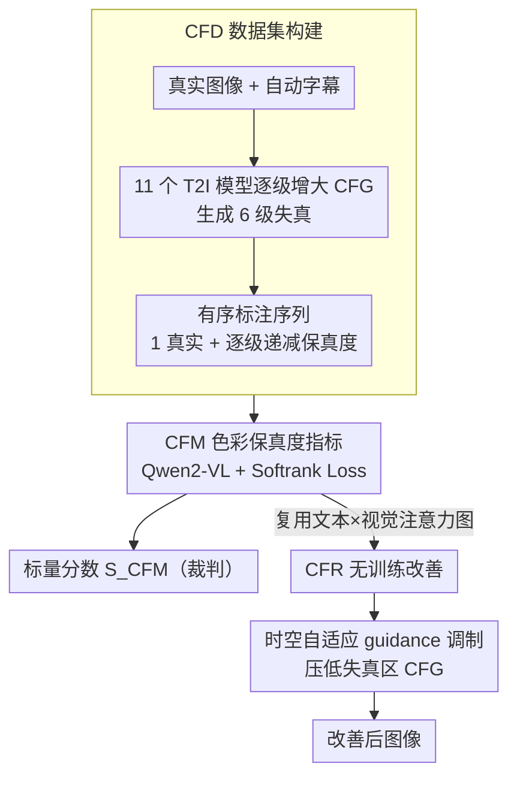

# Too Vivid to Be Real? Benchmarking and Calibrating Generative Color Fidelity

**会议**: CVPR 2026  
**arXiv**: [2603.10990](https://arxiv.org/abs/2603.10990)  
**代码**: [GitHub](https://github.com/ZhengyaoFang/CFM)  
**领域**: 图像生成  
**关键词**: color fidelity, text-to-image evaluation, guidance scale, realistic generation, evaluation bias

## 一句话总结

针对 T2I 模型生成图像"太鲜艳不像真实照片"的问题，提出 Color Fidelity Dataset (CFD, 130 万图像)、Color Fidelity Metric (CFM, 基于 Qwen2-VL + softrank loss) 和 Color Fidelity Refinement (CFR, 无训练的时空自适应 guidance 调制)，形成评估-改善一体化框架。

## 研究背景与动机

**T2I 模型过度鲜艳**：统计分析表明几乎所有 T2I 模型在被要求生成"写实风格"图像时，生成结果的饱和度和对比度均显著高于真实照片——"too vivid to be real"。

**评估偏差放大问题**：现有评估指标（PickScore、ImageReward、HPSv3、MPS）和人类评分都偏好鲜艳高对比图像。控制实验中，这些指标对过饱和图像系统性给高分，形成正反馈循环。

**缺乏色彩保真度评估**：现有指标衡量语义对齐或审美偏好，没有专门衡量色彩分布是否接近真实摄影的维度。

**CFG 的双刃剑**：Classifier-Free Guidance scale $s$ 越大文本对齐越强但色彩失真越严重（过饱和+高对比度），这种可控关系为构建有序色彩数据集提供了工具。

## 方法详解

### 整体框架

这篇论文要回答一个被忽视的问题：T2I 模型生成的「写实」图像往往太鲜艳，而现有评估指标不但发现不了、反而偏爱这种过饱和。它把「评估」和「改善」打通成一条链：先利用 CFG scale 与色彩失真的单调关系造一个带有序标注的数据集 CFD，在其上训练一个专门衡量色彩保真度的指标 CFM，再直接复用 CFM 的内部注意力图、做一个无需训练的改善模块 CFR——CFM 既是裁判，又顺手当了改善信号的来源。

### 关键设计

**1. Color Fidelity Dataset (CFD)：用 CFG 单调性自动造有序标注**

色彩保真度这个维度过去没人系统标注，人工标排序又贵。作者抓住一个关键观察：Classifier-Free Guidance 的 scale $s$ 越大，文本对齐越强、色彩失真（过饱和 + 高对比）也越严重——这是一条单调关系，正好拿来当「失真程度」的免费标签。

| 步骤 | 操作 | 规模 |
|---|---|---|
| 真实图像收集 | COCO/Open Images + CLIPIQA + Qwen2.5-VL(72B) 过滤 | 189,490 张 |
| 自动字幕 | Qwen2.5-VL 生成文本描述 | — |
| CFG 控制合成 | 11 个 T2I 模型 × 12 类别，逐步增大 CFG scale 生成 6 级失真 | 每组 7 张 |
| 数据划分 | 训练 160K 组 / 测试 30K 组 | ~133 万张 |

11 个 T2I 模型（SDXL、SD3、SD3.5、PixArt-Σ、Kolors、CogView4、Hunyuan-DiT、Flux-dev、Qwen-Image、Playground-v2.5、SRPO）× 12 个语义类别（覆盖人物、自然场景、城市环境等），让每组都成为「1 真实 + 逐级递减保真度」的有序序列；另有人工标注子集 CFD-Human（6690 张 × 3 标注者，Spearman 一致性 > 0.85）做验证。

**2. Color Fidelity Metric (CFM)：Softrank loss 把有序序列学成分数**

有了有序数据，关键是让指标学到「这组里谁更真」，而不是简单两两对比。CFM 基于 Qwen2-VL，把图像和文本统一编码为联合序列：

$$\mathbf{F} = [\mathbf{f}_1^v, \ldots, \mathbf{f}_M^v, \mathbf{f}_1^t, \ldots, \mathbf{f}_N^t] \in \mathbb{R}^{(M+N) \times d}$$

MLP head 输出 token 级 logits，从 `<|Reward|>` token 取标量分数 $S_{\text{CFM}}$。训练用可微的 Differentiable Softrank Loss：对每组 $K$ 张图（1 真实 + $K-1$ 级递减保真度）算成对概率和软排名，再回归到真值排名 $R=[1,2,\ldots,K]$（真实图排最前）：

$$P_{ij} = \sigma\left(\frac{r_j - r_i}{\tau}\right), \quad \hat{R}_i = 1 + \sum_{j=0}^{K-1} P_{ij}$$

$$\mathcal{L} = \frac{1}{K} \sum_{i=0}^{K-1} (\hat{R}_i - R_i)^2$$

相比 pairwise loss，软排名建模了整组的连续序结构，准确率 +7.4%（SynPairs）、Spearman +6.6；而文本分支提供了「这个场景色彩本该如何」的语义上下文，去掉它 SynPairs 准确率 -6.5%、Spearman -6.0。

**3. Color Fidelity Refinement (CFR)：把 CFM 的注意力变成像素级 guidance 场**

光有指标还改善不了图，CFR 让 CFM「指哪打哪」：用它的注意力图定位色彩失真区域，在扩散去噪时只对这些区域自适应地调低 guidance。先从 CFM 提取像素级注意力：

$$\mathbf{A} = \text{softmax}\left(\frac{\mathbf{F}^t (\mathbf{F}^v)^\top}{\kappa}\right) \in \mathbb{R}^{N \times M}$$

对文本 token 维度平均得到像素级注意力图 $\mathbf{a}'$，再做时空 guidance 调制：

$$s_t(u,v) = s_0 \left[1 - \lambda \alpha(t) \mathbf{a}'(u,v)\right]$$

其中 $\lambda \in [0,1]$ 是调制强度、$\alpha(t) = 1 - t/T$ 是时间衰减因子。色彩偏差大的高注意力区域 guidance 被自动压低、抑制过饱和，而整个过程完全无训练、即插即用、不修改模型参数。

### 损失函数 / 训练策略

CFM 的训练目标即上面的 Differentiable Softrank Loss；CFR 不涉及训练，是推理期对 guidance 的时空调制。

## 实验结果

### CFM 色彩保真度判别准确率

| 方法 | CFD-SynPairs | CFD-Real&Syn |
|---|---|---|
| MUSIQ | 53.4% | 21.5% |
| ImageReward | 44.3% | 42.7% |
| PickScore | 51.4% | 48.5% |
| HPSv3 | 57.5% | 58.3% |
| **CFM (Ours)** | **83.6%** | **80.1%** |

### 与人类判断的相关性（CFD-Human）

| 指标 | Spearman | Pearson | Kendall |
|---|---|---|---|
| ImageReward | 62.8 | 63.5 | 49.2 |
| HPSv3 | 74.4 | 76.0 | 62.8 |
| **CFM (Ours)** | **84.9** | **85.4** | **71.4** |

### CFR 色彩改善效果

| 模型 | 设置 | FID↓ | CLIPScore↑ | ΔSat.↓ | CFM↑ |
|---|---|---|---|---|---|
| SD3.5 | 原始 | 13.3 | 28.2 | 0.15 | 4.9 |
| SD3.5 | CFR_HPSv3 | 13.2 | 28.1 | 0.11 | 5.6 |
| SD3.5 | **CFR_CFM** | **13.1** | **28.2** | **0.07** | **6.9** |
| PixArt-Σ | 原始 | 16.5 | 27.2 | 0.09 | 4.4 |
| PixArt-Σ | **CFR_CFM** | **16.4** | **27.5** | **0.02** | **6.4** |
| Hunyuan | 原始 | 22.1 | 27.5 | 0.14 | 0.8 |
| Hunyuan | **CFR_CFM** | **19.9** | **27.5** | **0.03** | **2.1** |

- 饱和度偏差降低 0.08–0.11，CFM 提升 1.3–2.0
- FID/CLIPScore 基本不变——色彩改善不牺牲质量和语义

### CFR 消融：时空调制

| 设置 | FID | CLIPScore | ΔSat. | CFM |
|---|---|---|---|---|
| 基线 | 13.3 | 28.2 | 0.15 | 4.9 |
| 仅时间 | 18.0 | 25.9 | 0.18 | -1.3 |
| 仅空间 | 13.2 | 28.2 | 0.12 | 6.8 |
| **完整时空** | **13.0** | **28.2** | **0.07** | **6.9** |

- 仅时间调制反而有害（FID +4.7、CFM 变负）——全局衰减 CFG 强度破坏语义
- 空间调制是改善核心，时间衰减起稳定互补作用

### CFM 消融

| 变体 | CFD-SynPairs | CFD-Real&Syn | Spearman | Kendall |
|---|---|---|---|---|
| Pairwise loss | 76.2% | 74.8% | 78.3 | 66.1 |
| Visual-only | 77.1% | 74.3% | 78.9 | 67.0 |
| **Ours (softrank+multimodal)** | **83.6%** | **80.1%** | **84.9** | **71.4** |

## 优缺点分析

| 维度 | 评价 |
|---|---|
| 问题定义 | ⭐⭐⭐⭐⭐ 精准定义"color fidelity"并量化了评估偏差，填补空白 |
| 数据集质量 | ⭐⭐⭐⭐⭐ 130 万图像 × 11 模型 × 12 类别 × 人工验证集 |
| 评估指标 | ⭐⭐⭐⭐ Softrank loss + 多模态编码，高一致性人类相关 |
| 改善方法 | ⭐⭐⭐⭐ training-free 且 plug-and-play，实用性强 |
| 实验设计 | ⭐⭐⭐⭐ 多模型 + 人工标注 + 全面消融 |
| 局限性 | ⭐⭐⭐ 假设色彩失真主要源于 CFG；CFR 无法处理非 CFG 模型；色彩保真仅是"真实感"的一个维度 |

## 总结与启发

1. **评估偏差值得关注**：当前"人类偏好对齐"可能正在引导 T2I 模型偏离真实感——偏好训练指标对过饱和图像的偏好是隐性但持续的
2. **利用 CFG 构建数据集**：利用 guidance scale 与色彩失真的单调关系来构建有序标注数据，避免了昂贵的人工标注——方法论上非常聪明
3. **Softrank > Pairwise**：有序关系的连续建模优于离散对比，适合感知质量这类有天然序结构的任务
4. **空间自适应 guidance**：将全局 CFG scale 推广为像素级自适应 guidance field 是通用技巧，可迁移到其他 guidance 调制场景

## 与相关工作的对比

| 维度 | PickScore/ImageReward/HPSv3/MPS | IQA 方法 (MUSIQ/CLIPIQA) | **CFM (本文)** |
|---|---|---|---|
| 目标 | 语义对齐 / 审美偏好 | 真实图像质量退化 | 色彩保真度 |
| 训练数据 | 人类偏好对比对 | 真实图像失真标注 | CFG 控制的有序色彩序列 |
| 对过饱和图像 | 系统性偏好（给高分） | 近似随机 | 正确惩罚 |
| 人类一致性 | Spearman 62.8–74.4 | — | **84.9** |
| 可用于改善 | 弱（注意力与色彩无关） | 否 | 强（CFR 直接利用注意力） |

## 启发与关联

1. **评估-改善闭环**：CFM 不仅输出分数，其内部注意力图直接被 CFR 复用为改善信号——"评估指标本身即是改善工具"的设计范式值得借鉴
2. **利用生成过程构造标注**：通过 CFG scale 的单调性自动生成有序标注，避免大规模人工标注——对其他难以标注的感知维度（纹理真实感、光照一致性）同样适用
3. **像素级 guidance 自适应调制**：将全局标量 CFG 推广为 $s_t(u,v)$ 的空间场，可迁移到局部风格控制、区域细节增强等场景
4. **Softrank loss 的通用性**：可推广到任何有序感知标注任务（画质排序、相似度排序），比 pairwise 更稳定高效

## 评分

- 新颖性: ⭐⭐⭐⭐ 色彩保真度维度首次被系统化定义和量化，CFG 构建有序数据集的思路巧妙
- 实验充分度: ⭐⭐⭐⭐⭐ 11 模型 benchmark + 人工标注验证 + 3 模型 CFR 实验 + 完整消融
- 写作质量: ⭐⭐⭐⭐ 逻辑清晰，问题动机充分，图表丰富
- 价值: ⭐⭐⭐⭐ 填补 T2I 评估维度空白，训练免费改善方案实用性强；局限在于仅覆盖"色彩"一个维度

<!-- RELATED:START -->

## 相关论文

- [\[CVPR 2026\] MatPedia: A Universal Generative Foundation for High-Fidelity Material Synthesis](matpedia_a_universal_generative_foundation_for_high-fidelity_material_synthesis.md)
- [\[CVPR 2025\] GCC: Generative Color Constancy via Diffusing a Color Checker](../../CVPR2025/image_generation/gcc_generative_color_constancy_via_diffusing_a_color_checker.md)
- [\[CVPR 2026\] GenColorBench: A Color Evaluation Benchmark for Text-to-Image Generation](gencolorbench_a_color_evaluation_benchmark_for_text-to-image_generation.md)
- [\[CVPR 2026\] Leveraging Multispectral Sensors for Color Correction in Mobile Cameras](leveraging_multispectral_sensors_for_color_correction_in_mobile_cameras.md)
- [\[CVPR 2026\] It's Never Too Late: Noise Optimization for Collapse Recovery in Trained Diffusion Models](its_never_too_late_noise_optimization_for_collapse_recovery_in_trained_diffusion.md)

<!-- RELATED:END -->
