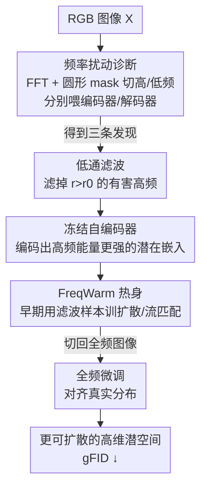

# Toward Diffusible High-Dimensional Latent Spaces: A Frequency Perspective

**会议**: CVPR 2026  
**论文**: [CVF Open Access](https://openaccess.thecvf.com/content/CVPR2026/html/Lai_Toward_Diffusible_High-Dimensional_Latent_Spaces_A_Frequency_Perspective_CVPR_2026_paper.html)  
**代码**: 项目页 https://bolinlai.github.io/projects/FreqWarm （未见正式代码仓）  
**领域**: 扩散模型 / 图像生成  
**关键词**: 潜在扩散, 高维潜空间, 频率分析, 自编码器, 即插即用课程

## 一句话总结
作者用频率扰动实验拆开了潜在扩散里"重建越好、生成反而越差"的高维 trade-off——根因是解码器极度依赖高频潜在分量、而编码器恰恰会丢掉高频——并据此提出 FreqWarm：训练早期先用低通滤波后的图像喂扩散模型做高频"热身"、再切回全频微调，不动任何自编码器就把多个高维 VAE 的 gFID 降了 4~14 分。

## 研究背景与动机

**领域现状**：自从潜在扩散（latent diffusion）成为视觉生成的默认范式，生成质量很大程度上取决于自编码器定义的潜空间是否"好扩散"（diffusible）。为了减少 token 数、提升计算效率，近年的 tokenizer 不断提高空间压缩率（从 8× 到 32×、64× 甚至 128×），并通过增加潜在通道数来补偿容量——DC-AE、Wan2.2-VAE、LTX-VAE 都是这条路线的代表。

**现有痛点**：作者观察到一个稳定存在的**重建-生成 trade-off**：随着潜在维度（通道数）变大，重建保真度（rFID）持续变好，但生成质量（gFID）先升后降。也就是说，高容量自编码器能把图像还原得更好，扩散模型却越来越难在它定义的潜空间里学出像样的分布。低维潜空间（4 通道、32 通道）反而更稳，于是大家被迫退守低维，高维潜空间的可扩散性长期没人讲清楚，也卡住了更高压缩率的路。

**核心矛盾**：gFID 同时受两件事影响——重建保真度（由自编码器决定）和潜在嵌入的合成质量（由扩散模型决定）。高维下前者一直在涨，但后者崩了，说明问题出在"扩散模型合成潜在嵌入"这一环，而非自编码器本身。可此前的改进（语义对齐、层级 tokenization、1D 序列化）大多是直觉驱动，缺乏对潜空间的细致分析，没人指出究竟是潜空间的哪个部分坏掉了。

**切入角度**：作者沿着 SE-VAE（Skorokhodov et al.）开的频率分析口子继续往下挖，但换了个更精细的视角——不是看潜空间整体的频谱，而是**分别**追问编码器和解码器对不同频段信号的反应，并且第一次去研究 RGB 空间与潜空间之间的"跨空间频率对应关系"。

**核心 idea**：先用频率扰动实验定位病灶（解码器靠高频、编码器丢高频，二者在高频上对不上），再用一个不需要重训自编码器的"频率热身课程"FreqWarm，在训练早期人为给扩散模型多喂高频潜在信号，把高维潜空间变得更可扩散。

## 方法详解

### 整体框架

这篇论文分两步：**先诊断、后开药**。诊断部分（第 3 节）通过频率扰动实验得到三条关键发现，定位"重建-生成 trade-off"的频率根因；开药部分（第 4 节）据此提出 FreqWarm，一个加在已有训练流程上的即插即用课程。

诊断的做法是：把信号在 RGB 空间或潜空间做 2D FFT，用一个半径为 $r$ 的圆形 mask 把频谱切成低频/高频两半，再逆变换回去，分别送进编码器或解码器，观察输出。关键结论是——解码器**重度依赖高频潜在分量**来恢复细节，但编码器**很难把高频编进潜空间**（极端高频的 RGB 信号甚至会挤占其他高频的编码容量），导致潜空间高频能量偏低、扩散训练时高频段"曝光不足"而欠拟合。

FreqWarm 的开药逻辑顺着这个诊断走：既然"过度高频的 RGB 输入"会压低潜空间高频能量，那就在训练早期**主动把这些有害高频滤掉**，让编码器吐出高频能量更强、更均衡的潜在嵌入，扩散模型于是在早期就能充分接触高频分布；热身之后再切回全频图像微调，收尾对齐真实分布。整条流程不碰自编码器一根毫毛，直接套在现成 checkpoint 上。

### 关键设计

**1. 跨空间频率扰动诊断：定位"解码器要高频、编码器丢高频"的错位**

这是全文的真正起点，也是第一份把编码器/解码器拆开看频率响应的分析。做法是对潜在嵌入 $Z=E(X)\in\mathbb{R}^{C\times H'\times W'}$ 逐通道做 2D FFT 并中心化：$Z_{freq}=\mathrm{Shift}(\mathrm{FFT}(Z))$，然后用半径 $r$ 的圆形 mask $M$ 把频谱切成两块再逆变换：

$$Z_{low}=\mathrm{IFFT}(\mathrm{IShift}(M\odot Z_{freq})),\quad Z_{high}=\mathrm{IFFT}(\mathrm{IShift}((1-M)\odot Z_{freq}))$$

把 $Z_{low}$、$Z_{high}$ 分别送进解码器，发现：只用低频潜在分量重建出的图像模糊、只有大致颜色和布局；只用高频分量重建的却带回了大量细节和语义——即使把阈值从 0.05 抬到 0.20 结论依旧（**Finding 1：解码器靠高频潜在分量恢复细节**）。

反过来在 RGB 空间做同样的切分送进编码器：发现图像大部分信息其实挤在很窄的低频带（阈值 0.20 时低频重建图几乎和原图一样，高频部分只剩零碎信息，**Finding 2**）。更关键的是，作者把只含低频的 RGB 图喂进编码器、再测潜空间频谱：随着保留的 RGB 高频变多，潜空间高频幅度先是上升，但当把**全部**高频都放进来（无阈值）时，潜空间高频幅度反而**显著掉落**（**Finding 3：极端高频 RGB 对画质贡献微小，却会阻碍其他高频信号的编码**）。作者推测原因是这些极端高频触发了向低频带的混叠（aliasing），挤占了本该留给其他高频的编码容量。三条发现合起来就解释了 trade-off：解码端要高频、编码端却把高频压没了，扩散模型训练时高频曝光不足，维度越高这个冲突越尖锐。

**2. FreqWarm：用低通滤波制造"高频更足"的热身样本，早期补上高频曝光**

既然 Finding 3 指出"极端高频 RGB 会压低潜空间高频能量"，那解法就反直觉地简单——**在 RGB 空间先把 $r>r_0$ 的高频滤掉**，再用冻结的预训练编码器去 tokenize 这些滤波后的图像。由于挤占容量的有害高频被移走，编码器吐出的潜在嵌入反而拥有**更强、更均衡的高频分量**。扩散模型/流匹配模型从头开始就在这批"高频更足"的潜在嵌入上做早期热身训练，相当于在最该打基础的阶段强行给高频段补足曝光，避免一开始就欠拟合高频分布。整个过程完全不重训、不微调自编码器，只是换了训练早期喂进去的数据，因此能无缝塞进任何现成训练 recipe。值得强调的是，作者指出"真实性 ≠ 高幅度"——热身的目标是让扩散模型学会合成**真实**的高频嵌入，而解码器恰好重度依赖这些真实高频来还原细节（呼应 Finding 1）。

**3. 课程式两阶段 + 阈值 $r_0=0.2$：在画质损失与潜在能量之间取平衡**

FreqWarm 是个**课程**而非一刀切：早期用滤波样本热身，**之后再切回全频图像做微调**收尾，让模型既补足了高频曝光、又最终对齐真实全频分布。其中唯一的关键超参是低通阈值 $r_0$（频谱被归一化成 $1.0\times1.0$ 的方块，半径范围 $0\sim\sqrt2\approx0.7$）。$r_0$ 太低（0.05）会连有用细节一起滤掉、丢信息；太高（0.4/0.6）则没把有害高频清干净、效果打折。作者实验定下 $r_0=0.2$ 为最优：滤掉 $r>0.2$ 的信号对画质几乎没影响，却能显著抬高潜在能量（见通道分析图），正好卡在"画质损失"与"潜在能量损失"之间的甜点。

### 损失函数 / 训练策略
方法不改任何损失函数，沿用各扩散/流匹配模型官方的训练目标，只把 batch size 提到 4096，默认 $r_0=0.2$。实验在 face-blurred 版 ImageNet 上跑，用 32 张 A100 训 5–7 天；评估默认不开 classifier-free guidance（CFG）。

## 实验关键数据

### 主实验

ImageNet 512×512，gFID 越低越好、IS 越高越好；下表节选 USiT-H 在三种高维自编码器上的结果（w/o CFG），FreqWarm 行的提升幅度在括号里：

| 自编码器 | 配置 | gFID ↓ | IS ↑ |
|----------|------|--------|------|
| Wan2.2-AE-f16c48 | 基线 | 43.67 | 33.48 |
| Wan2.2-AE-f16c48 | +FreqWarm | 29.56 (**-14.11**) | 46.16 (+12.68) |
| LTX-AE-f32c128 | 基线 | 24.18 | 61.60 |
| LTX-AE-f32c128 | +FreqWarm | 18.05 (**-6.13**) | 76.06 (+14.46) |
| DC-AE-f32c128 | 基线 | 13.84 | 85.40 |
| DC-AE-f32c128 | +FreqWarm | 9.42 (**-4.42**) | 108.80 (+23.40) |

跨 4 种 denoiser（DiT-XL / UViT-H / USiT-H / USiT-2B）和多种自编码器均一致提升；开 CFG 后增益仍在。值得注意的是，加了 FreqWarm 的高维自编码器能反超此前的低维自编码器——例如 DC-AE-f32c128+FreqWarm（gFID 9.42）优于原版 DC-AE-f32c64（gFID 9.97），说明**可以在不掉点的前提下进一步减 token、提压缩率**。在 1.58B 的 USiT-2B 上也有改善（gFID 5.67→4.77），显示对大模型的可扩展性。256×256 下同样稳：DiT 降 8.41、UViT 降 5.08、USiT 降 2.57。

### 消融实验

**通道数分析**（DC-AE，固定压缩率、只变通道，gFID）：

| 配置 | 无热身 | FreqWarm | 差值 ∆ |
|------|--------|----------|--------|
| f32c16 | 12.59 | 12.57 | 0.02 |
| f32c32 | 5.75 | 5.74 | 0.02 |
| f32c64 | 9.97 | 7.20 | 2.77 |
| f32c128 | 13.84 | 9.42 | 4.42 |
| f32c256 | 42.40 | 33.75 | 8.65 |
| f32c512 | 54.84 | 42.66 | 12.18 |

**阈值 $r_0$ 消融**（DC-AE-f32c128 + USiT-H）：

| $r_0$ | gFID ↓ | IS ↑ |
|-------|--------|------|
| 0.05 | 23.11 | 65.50 |
| **0.20** | **9.42** | **108.80** |
| 0.40 | 12.88 | 90.49 |
| 0.60 | 13.24 | 88.71 |

### 关键发现
- **增益随维度放大**：通道数越多，FreqWarm 收益越大（f32c16/c32 几乎无提升，c512 降了 12.18 分）。这与频率分析自洽——通道越多，无阈值时潜空间高频幅度掉得越狠（图 6 中红蓝曲线的 ∆ 越大），而低维下两条曲线几乎重合，本就没什么高频可补。这条相关性反过来支撑了作者"编码器优先编低频、有余力才编高频"的假说。
- **阈值是单峰的**：$r_0$ 过低丢细节、过高没清干净，0.2 是甜点；且滤掉 $r>0.2$ 的信号对画质几乎无损却大幅抬高潜在能量，所以它是"画质损失 vs 潜在能量"的理想折中。
- **不重训自编码器也能救生成**：重建质量保持不变（自编码器没动），增益全部来自扩散侧的高频曝光，证明病灶确实在"潜在嵌入合成"而非重建。

## 亮点与洞察
- **把一个老 trade-off 归因到一个可操作的频率机制**：以往"高维潜空间难扩散"是模糊共识，本文用编码器/解码器分离的频率扰动实验把它落到"解码要高频、编码丢高频"的具体错位上，诊断本身就是贡献。
- **跨空间频率对应是新视角**：在 RGB 空间扰动、却在潜空间测频谱，揭示了"极端高频 RGB 反而压低潜空间高频"的混叠现象，这是单看潜空间频谱看不出来的。
- **解法极轻、迁移性强**：FreqWarm 只是训练早期换一批低通滤波样本，不改架构、不改 loss、不重训 VAE，能直接套进任何现成 DiT/UViT/USiT recipe——这种"诊断驱动的即插即用课程"思路可迁移到任何"某个频/某个模式曝光不足"的生成训练问题。
- **"真实性 ≠ 高幅度"的提醒很到位**：作者特意区分热身不是为了把高频幅度拉高，而是让模型学会合成真实高频，避免读者误以为是简单的能量调高。

## 局限与展望
- **只在 ImageNet 类条件生成上验证**：没有文生图/文生视频的大规模实验，尽管 Wan2.2/LTX 是视频 tokenizer，但实测都是按单帧图像跑的，对真实视频生成的效果未知。
- **阈值 $r_0$ 是全局固定的硬切**：用单一圆形 low-pass mask 和固定 0.2，没探索按通道/按训练进度自适应的阈值课程，也没给出热身步数占比这类课程细节，复现时这部分要看附录/代码。
- **机制解释停在"推测"**：Finding 3 把高频掉落归因于混叠（aliasing），但属于 speculate，缺直接证据；"真实性 ≠ 高幅度"的论证放在补充材料，正文没展开。
- **改进方向**：作者自己指出终点应是"自编码器与扩散 transformer 围绕显式频率预算的协同设计"——比 FreqWarm 这种后处理课程更彻底地从编码端解决高频丢失。

## 相关工作与启发
- **vs SE-VAE (Skorokhodov et al.)**: 最相关的前作，开了"用频率分析解释自编码器"的口子，但只看潜空间整体频谱随通道的变化；本文进一步把编码器/解码器**分开**看、并引入 RGB↔潜空间的跨空间对应，定位到更具体的错位，且给出了不重训 VAE 的解法。
- **vs 训更强自编码器的路线（DC-AE / VA-VAE / ReaLS / SoftVQ-VAE 等）**: 这些靠语义对齐、更高压缩率、层级 tokenization 来提升可扩散性，都要改/重训自编码器；FreqWarm 正交于它们，直接在冻结的现成 VAE 上加训练课程，可叠加使用。
- **vs 扩散的傅里叶分析（Falck et al. / Ren et al.）**: 前者发现前向加噪不成比例地压制高频、反向先粗后细；后者把频率线索注入训练目标。本文区别在于焦点是**编解码器对不同频段的不同响应**，而非去噪过程本身，且不改训练目标只换数据曝光。

## 评分
- 新颖性: ⭐⭐⭐⭐⭐ 第一份分离编/解码器的跨空间频率诊断，把模糊的高维 trade-off 归因到可操作机制，解法又极简正交。
- 实验充分度: ⭐⭐⭐⭐ 覆盖 3 个自编码器 ×4 个 denoiser × 两种分辨率 + 通道/阈值消融，自洽性强；但只限 ImageNet 类条件生成，缺文生图/视频。
- 写作质量: ⭐⭐⭐⭐⭐ "诊断→三条发现→开药"的叙事清晰，分析与方法严丝合缝，图表把 trade-off 和频谱变化讲得很直观。
- 价值: ⭐⭐⭐⭐⭐ 即插即用、不重训 VAE、增益随维度放大，为"更高压缩率而不掉点"提供了现成训练 recipe，落地性高。

<!-- RELATED:START -->

## 相关论文

- [\[CVPR 2026\] Frequency-Aware Flow Matching for High-Quality Image Generation](freqflow_frequency_aware_flow_matching.md)
- [\[CVPR 2026\] FreqEdit: Preserving High-Frequency Features for Robust Multi-Turn Image Editing](freqedit_preserving_high-frequency_features_for_robust_multi-turn_image_editing.md)
- [\[ECCV 2024\] FouriScale: A Frequency Perspective on Training-Free High-Resolution Image Synthesis](../../ECCV2024/image_generation/fouriscale_a_frequency_perspective_on_training-free_high-resolution_image_synthe.md)
- [\[CVPR 2026\] Vibe Spaces for Creatively Connecting and Expressing Visual Concepts](vibe_spaces_for_creatively_connecting_and_expressing_visual_concepts.md)
- [\[CVPR 2026\] Exploring Spatial Intelligence from a Generative Perspective](exploring_spatial_intelligence_from_a_generative_perspective.md)

<!-- RELATED:END -->
